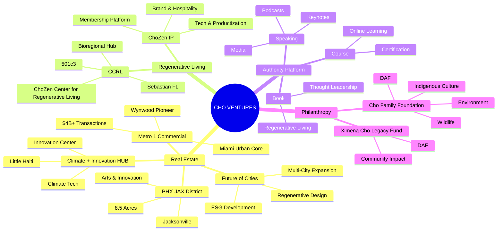
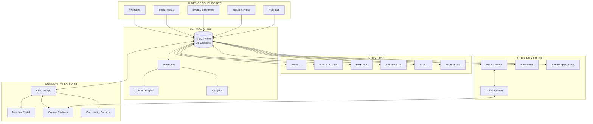
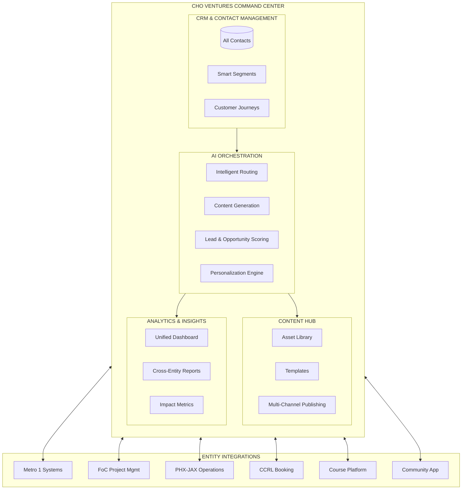
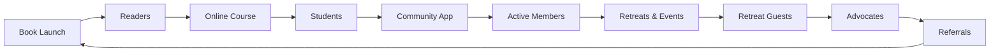
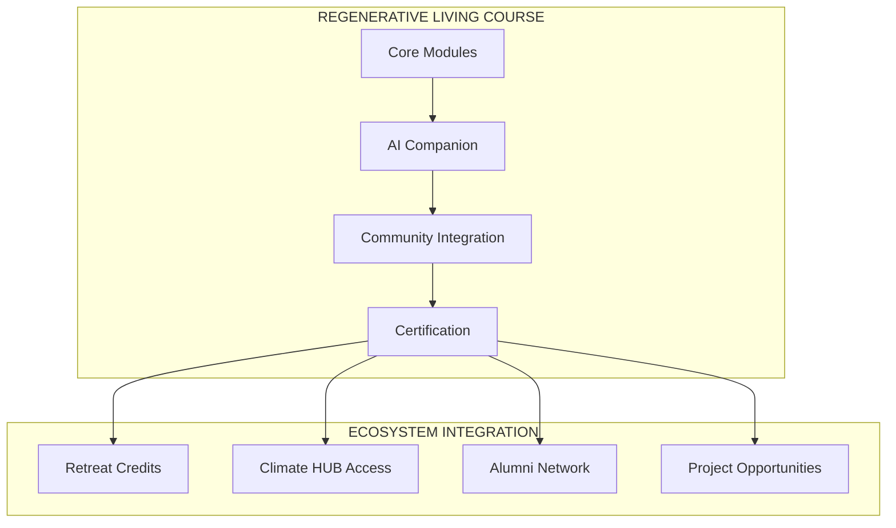
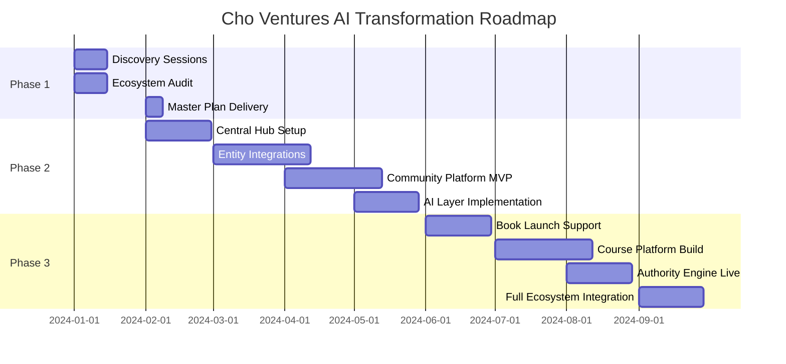
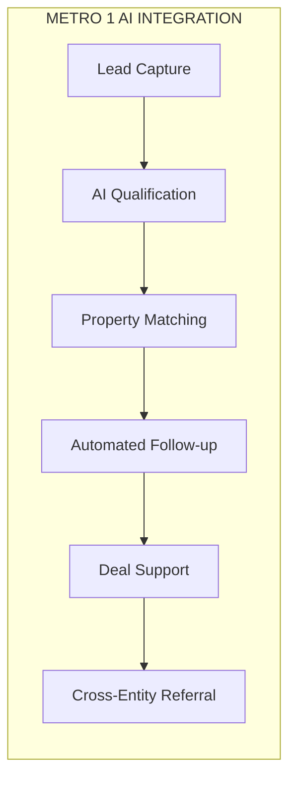

# Cho Ventures AI Ecosystem: Master Plan

> *Unifying a visionary portfolio into an AI-powered regenerative empire.*

---

## Table of Contents

1. [Executive Summary](#executive-summary)
2. [The Cho Ventures Ecosystem](#the-cho-ventures-ecosystem)
3. [Current State Assessment](#current-state-assessment)
4. [The Transformation Vision](#the-transformation-vision)
5. [Central Hub Architecture](#central-hub-architecture)
6. [AI Integration Map](#ai-integration-map)
7. [Authority Platform Strategy](#authority-platform-strategy)
8. [Three-Phase Framework](#three-phase-framework)
9. [Entity-Specific AI Strategies](#entity-specific-ai-strategies)
10. [Success Metrics](#success-metrics)

---

## Executive Summary

### The Opportunity

Tony Cho has built something remarkable: a portfolio of ventures that span real estate, climate innovation, hospitality, wellness, and philanthropy—all connected by a singular vision of regenerative living. But like many visionary portfolios, each entity operates somewhat independently, with untapped potential for synergy.

**The opportunity is threefold:**

1. **Unification** — Connect all entities through a central AI-powered hub
2. **Amplification** — Use AI to multiply the impact and efficiency of every venture
3. **Authority** — Position Tony as the definitive voice in regenerative placemaking

### The Stakes

Tony is at an inflection point:
- **Book coming** — A chance to codify his philosophy for a global audience
- **Course to launch** — An opportunity to teach regenerative principles at scale
- **Growing portfolio** — More entities means more coordination complexity
- **Climate urgency** — The world needs his message now more than ever

The organizations that integrate AI into their ecosystem now will:
- **Operate more efficiently** across all entities
- **Engage communities** at unprecedented depth
- **Scale impact** without proportional overhead
- **Lead the narrative** in regenerative development

### The Solution

A comprehensive AI transformation that:

```
┌─────────────────────────────────────────────────────────────────────────┐
│                     CHO VENTURES UNIFIED ECOSYSTEM                       │
├─────────────────────────────────────────────────────────────────────────┤
│                                                                          │
│   CENTRAL HUB          ENTITY LAYER           COMMUNITY LAYER           │
│   ───────────          ────────────           ───────────────           │
│   • Command Center     • Metro 1              • ChoZen App              │
│   • AI Orchestration   • Future of Cities     • Member Portal           │
│   • Unified CRM        • PHX-JAX              • Events & Retreats       │
│   • Content Engine     • Climate HUB          • Learning Platform       │
│   • Analytics          • CCRL                • Community Forums        │
│                        • Foundations                                     │
│                                                                          │
│   AUTHORITY LAYER      AI LAYER               DATA LAYER                │
│   ───────────────      ────────               ──────────                │
│   • Book Launch        • Lead Intelligence    • Unified Database        │
│   • Course Platform    • Content Generation   • Cross-Entity Analytics  │
│   • Speaking/Media     • Automation Engine    • Community Insights      │
│   • Newsletter         • Personalization      • Impact Metrics          │
│                        • Predictive Models                              │
│                                                                          │
└─────────────────────────────────────────────────────────────────────────┘
```

---

## The Cho Ventures Ecosystem

### Portfolio Overview



### Entity Profiles

| Entity | Type | Location | Core Function |
|--------|------|----------|---------------|
| **Cho Ventures** | Holding Company | Miami | Portfolio management, strategic direction |
| **Metro 1 Commercial** | Real Estate Brokerage | Miami | Commercial property sales, leasing, tenant rep |
| **Future of Cities** | Development Consortium | Multi-City | ESG real estate development, regenerative design |
| **PHX-JAX District** | Mixed-Use Development | Jacksonville | Arts, innovation, creative workspace campus |
| **Climate + Innovation HUB** | Innovation Center | Miami (Little Haiti) | Climate tech incubation, programming |
| **CCRL** | 501(c)(3) | Sebastian, FL | ChoZen Center for Regenerative Living — programs, retreats, regenerative living |
| **ChoZen IP** | Brand / IP Platform | Multi-Location | Brand identity, hospitality, membership platform, tech/productization |
| **Tony Cho Personal Brand** | Thought Leadership | — | Speaking, media, books (incl. Soft Power), online courses |
| **Cho Family Foundation** | DAF | Miami | Environmental & cultural philanthropy |
| **Ximena Cho Legacy Fund** | DAF | Miami | Community impact |

### The Unified Story

Every entity serves the same mission: **demonstrating that regenerative development creates superior returns for people, planet, and profit.**

- **Metro 1** proves it in commercial real estate transactions
- **Future of Cities** builds it into new developments
- **PHX-JAX** creates community through it
- **Climate HUB** incubates innovation for it
- **CCRL** embodies it as a living laboratory
- **ChoZen IP** extends it through brand, hospitality, and membership
- **Foundations** extend its benefits to underserved communities

The AI strategy must honor and amplify this unified story while enabling each entity to operate efficiently.

---

## Current State Assessment

### Likely Pain Points (To Be Validated in Discovery)

```
┌─────────────────────────────────────────────────────────────────────────┐
│                        CURRENT OPERATIONAL STATE                         │
├─────────────────────────────────────────────────────────────────────────┤
│                                                                          │
│   ENTITY SILOS         COMMUNITY GAPS         CONTENT FRAGMENTATION     │
│   ────────────         ──────────────         ──────────────────────    │
│   • Separate systems   • No unified app       • Multiple websites       │
│   • No shared CRM      • Manual engagement    • Inconsistent branding   │
│   • Data doesn't flow  • Event booking manual • No central content hub  │
│   • Duplicate work     • Members scattered    • Social fragmented       │
│                                                                          │
│   AUTHORITY GAPS       OPERATIONS             ANALYTICS                 │
│   ──────────────       ──────────             ─────────                 │
│   • No book platform   • Manual processes     • No unified dashboard    │
│   • Course not built   • Email overwhelm      • Entity silos            │
│   • Speaking ad-hoc    • Follow-up gaps       • Impact unmeasured       │
│   • List not unified   • Scheduling friction  • Insights limited        │
│                                                                          │
└─────────────────────────────────────────────────────────────────────────┘
```

### Integration Challenges

| Challenge | Impact | Current State |
|-----------|--------|---------------|
| **Siloed entities** | Lost synergies, duplicate effort | Each entity operates independently |
| **No unified CRM** | Relationships fragmented | Contacts scattered across systems |
| **Manual community management** | Limited engagement at scale | Email lists, manual follow-up |
| **Content scattered** | Diluted brand impact | Multiple sites, no central hub |
| **Book/course infrastructure absent** | Launch delays | Not yet built |
| **No unified analytics** | Blind spots in performance | Entity-specific tracking only |

### The Hidden Potential

Every person who interacts with any Cho entity is a potential:
- **CCRL guest** interested in wellness
- **Metro 1 client** looking for regenerative commercial space
- **Course student** wanting to learn regenerative principles
- **Book reader** sharing Tony's vision
- **Community member** joining the movement
- **Donor** supporting foundation work

Currently, these connections are made manually, if at all. AI changes everything.

---

## The Transformation Vision

### The Unified Ecosystem



### Core Capabilities

| Capability | Description | Impact |
|------------|-------------|--------|
| **Unified Contact Hub** | Every relationship across all entities in one system | Complete visibility, no lost connections |
| **Cross-Entity Intelligence** | AI identifies synergies between entities | Right opportunity, right entity |
| **Community Platform** | ChoZen app as the heart of engagement | Scalable community at depth |
| **Authority Engine** | Book, course, newsletter, speaking integrated | Thought leadership amplification |
| **AI Content Generation** | Consistent content across all entities | Brand cohesion, reduced effort |
| **Unified Dashboard** | Real-time visibility across portfolio | Informed decisions, impact tracking |
| **Automated Engagement** | Intelligent follow-up across all touchpoints | No one falls through cracks |

---

## Central Hub Architecture

### The Command Center



### Technology Stack Recommendations

| Layer | Recommended Tools | Purpose |
|-------|------------------|---------|
| **CRM Core** | HubSpot or GoHighLevel | Contact management, automation, pipeline |
| **AI Layer** | Claude API, OpenAI API | Content, intelligence, personalization |
| **Community App** | Custom Build or Circle.so | ChoZen member platform |
| **Course Platform** | Kajabi, Teachable, or Custom | Book companion, certifications |
| **Analytics** | Custom Dashboard + Native | Cross-entity visibility |
| **Websites** | Webflow or Custom | Unified design system |
| **Email/SMS** | Integrated via CRM | Multi-channel communication |

---

## AI Integration Map

### AI Touchpoints Across the Ecosystem

```mermaid
graph LR
    subgraph LEAD_INTEL["LEAD & RELATIONSHIP INTELLIGENCE"]
        A1[Lead Scoring]
        A2[Entity Matching]
        A3[Opportunity Identification]
        A4[Relationship Insights]
    end

    subgraph CONTENT_AI["CONTENT & COMMUNICATION"]
        B1[Email Generation]
        B2[Social Content]
        B3[Website Copy]
        B4[Newsletter Curation]
    end

    subgraph COMMUNITY_AI["COMMUNITY & ENGAGEMENT"]
        C1[Member Onboarding]
        C2[Event Recommendations]
        C3[Discussion Facilitation]
        C4[Learning Paths]
    end

    subgraph OPERATIONS_AI["OPERATIONS & AUTOMATION"]
        D1[Scheduling Assistant]
        D2[Follow-up Automation]
        D3[Task Prioritization]
        D4[Reporting Automation]
    end

    subgraph AUTHORITY_AI["AUTHORITY & LEARNING"]
        E1[Book Companion AI]
        E2[Course Assistant]
        E3[Speaking Prep]
        E4[Media Kit Generation]
    end

    A1 --> A2
    A2 --> A3
    A3 --> A4

    B1 --> B2
    B2 --> B3
    B3 --> B4

    C1 --> C2
    C2 --> C3
    C3 --> C4

    D1 --> D2
    D2 --> D3
    D3 --> D4

    E1 --> E2
    E2 --> E3
    E3 --> E4
```



### Priority AI Implementations

#### Priority 1: Unified CRM with Cross-Entity Intelligence
**Problem:** Contacts and relationships siloed across entities
**Solution:** Single CRM with AI that identifies cross-entity opportunities
**Example:** A Metro 1 client interested in sustainable buildings gets invited to CCRL programs and Climate HUB events

#### Priority 2: Community Platform with AI Engagement
**Problem:** Community engagement requires manual effort that doesn't scale
**Solution:** ChoZen app with AI that personalizes member experience
**Example:** AI recommends retreats, events, and content based on member interests and behavior

#### Priority 3: Authority Content Engine
**Problem:** Tony's message isn't reaching its full audience
**Solution:** AI-powered content system that amplifies book, course, and thought leadership
**Example:** AI generates social content, newsletter segments, and podcast prep from Tony's core teachings

#### Priority 4: Operational Automation
**Problem:** Manual processes consume time across all entities
**Solution:** AI handles scheduling, follow-up, and routine communications
**Example:** AI books CCRL tours, follows up with event attendees, manages newsletter sequences

---

## Authority Platform Strategy

### The Authority Flywheel



### Book Launch Strategy

**Tony's book** codifies his philosophy of regenerative living. The AI strategy supports:

| Component | AI Role |
|-----------|---------|
| **Pre-Launch List Building** | AI segments and nurtures leads from all entities |
| **Launch Sequencing** | Automated email campaigns, social content |
| **Book Companion** | AI chatbot answers questions about book concepts |
| **Reader to Student Conversion** | AI identifies readers ready for course |

### Course Platform Architecture



### Speaking & Media Engine

| Component | Description |
|-----------|-------------|
| **Speaking Kit** | AI-generated and maintained speaker one-sheet, topics, bio variations |
| **Podcast Prep** | AI researches host, suggests talking points, prepares questions |
| **Media Follow-up** | Automated thank-you and stay-in-touch sequences |
| **Content Repurposing** | AI turns speaking content into articles, social, newsletter |

---

## Three-Phase Framework

### Overview



### Phase 1: Discovery & Strategy

**Duration:** 2-3 weeks
**Deliverable:** Comprehensive Master Plan

#### Discovery Sessions

| Session | Focus | Participants |
|---------|-------|--------------|
| **Session 1** | Vision Alignment & Ecosystem Overview | Tony, Leadership |
| **Session 2** | Entity Deep-Dives (Metro 1, FoC, PHX-JAX) | Entity Leaders |
| **Session 3** | CCRL, ChoZen IP & Community Vision | CCRL Team, ChoZen IP Leads |
| **Session 4** | Authority Platform (Book, Course, Speaking) | Tony, Content Team |
| **Session 5** | Technology Audit & Integration Requirements | IT/Operations |
| **Session 6** | Roadmap Presentation & Decision | All Stakeholders |

#### Phase 1 Deliverables

1. **Ecosystem Audit Report** — Current state of all entities, systems, and processes
2. **AI Opportunity Matrix** — Prioritized opportunities across all entities
3. **Unified Architecture Design** — Target state system diagram
4. **Community Platform Specification** — ChoZen app requirements
5. **Authority Platform Plan** — Book, course, speaking integration
6. **Implementation Roadmap** — Phased plan with dependencies
7. **Investment Framework** — Costs, timeline, ROI projections

### Phase 2: Implementation

**Duration:** 4-6 months
**Deliverable:** Operational AI-Powered Infrastructure

#### Implementation Components

| Component | Description | Dependencies |
|-----------|-------------|--------------|
| **Central Hub** | CRM setup, unified database, core workflows | None |
| **Entity Integrations** | Connect all entities to central hub | Central Hub |
| **Website Revamps** | Unified design system, connected to hub | Central Hub |
| **Community Platform MVP** | ChoZen app core functionality | Central Hub |
| **AI Layer** | Intelligence, automation, personalization | All Above |
| **Dashboard** | Cross-entity visibility | All Above |

### Phase 3: Authority Launch

**Duration:** 4-6 months
**Deliverable:** Full Authority Platform + Community Engagement

#### Authority Components

| Component | Description |
|-----------|-------------|
| **Book Launch** | Pre-launch, launch, post-launch automation |
| **Course Platform** | Modules, AI companion, certification |
| **Community Scale** | ChoZen app full features, engagement programs |
| **Speaking Engine** | Booking, prep, follow-up automation |
| **Content Amplification** | Multi-channel, AI-generated content strategy |

---

## Entity-Specific AI Strategies

### Metro 1 Commercial



| AI Application | Description |
|----------------|-------------|
| Lead Qualification | AI scores and routes incoming inquiries |
| Property Matching | AI matches clients to properties based on criteria |
| Market Intelligence | AI monitors market for client opportunities |
| Cross-Referral | AI identifies clients for other entities (FoC development, CCRL visits) |

### Future of Cities

| AI Application | Description |
|----------------|-------------|
| Project Intelligence | AI tracks ESG trends, funding opportunities |
| Community Engagement | AI manages stakeholder communications |
| Sustainability Reporting | AI generates impact reports |
| Investor Relations | AI personalizes investor communications |

### PHX-JAX District

| AI Application | Description |
|----------------|-------------|
| Tenant Prospecting | AI identifies ideal creative tenants |
| Event Promotion | AI generates and targets event marketing |
| Community Building | AI facilitates connections between tenants |
| Space Optimization | AI analyzes usage patterns for programming |

### Climate + Innovation HUB

| AI Application | Description |
|----------------|-------------|
| Startup Matching | AI connects startups with resources, mentors |
| Program Personalization | AI tailors programs to participant needs |
| Impact Measurement | AI tracks and reports climate impact |
| Network Intelligence | AI identifies collaboration opportunities |

### CCRL (ChoZen Center for Regenerative Living)

| AI Application | Description |
|----------------|-------------|
| Booking Optimization | AI manages availability, pricing, upsells |
| Guest Personalization | AI tailors experience to guest profile |
| Follow-up & Nurture | AI maintains guest relationships post-visit |
| Program Promotion | AI targets ideal guests for specific programs |

### Foundations

| AI Application | Description |
|----------------|-------------|
| Grant Management | AI tracks applications, deadlines, reporting |
| Donor Relations | AI personalizes donor communications |
| Impact Reporting | AI generates impact narratives and metrics |
| Program Matching | AI connects donors with aligned programs |

---

## Success Metrics

### Ecosystem Metrics

| Metric | Current State | Target State |
|--------|--------------|--------------|
| Unified Contact Database | Siloed | 100% in one system |
| Cross-Entity Referrals | Manual/rare | Automated, 10x increase |
| Community Members (App) | N/A | 10,000+ active |
| Newsletter Subscribers | Fragmented | Unified, 50,000+ |
| Content Velocity | Manual, slow | AI-assisted, 5x faster |

### Authority Metrics

| Metric | Target |
|--------|--------|
| Book Pre-Launch List | 25,000+ |
| Course Enrollments (Year 1) | 1,000+ |
| Speaking Engagements | 24+/year |
| Podcast Appearances | 50+/year |
| Media Mentions | 100+/year |

### Entity Metrics

| Entity | Key AI-Enabled Metric |
|--------|----------------------|
| Metro 1 | Lead response time < 5 minutes |
| Future of Cities | Stakeholder engagement 3x |
| PHX-JAX | Tenant occupancy 95%+ |
| Climate HUB | Startup success rate 2x |
| CCRL | Repeat guest rate 40%+ |
| Foundations | Donor retention 80%+ |

### Impact Metrics

| Metric | Description |
|--------|-------------|
| Regenerative Projects | Number of developments using regenerative principles |
| Community Impact | People directly served by foundations |
| Climate Innovation | Startups launched from Climate HUB |
| Wellness Reach | Lives touched through CCRL programs |
| Philosophy Spread | People exposed to regenerative placemaking principles |

---

## Next Steps

### To Begin Phase 1

1. **Schedule Discovery Kickoff** — Align on vision, timeline, participants
2. **Complete Ecosystem Questionnaire** — Baseline information gathering
3. **Confirm Session Schedule** — Book 6 discovery sessions
4. **Execute Discovery** — Deep-dive sessions across all entities
5. **Receive Master Plan** — Comprehensive deliverable with recommendations
6. **Decide on Phase 2** — Proceed with implementation

### Contact

Ready to transform the Cho Ventures ecosystem into an AI-powered regenerative force?

---

*Cho Ventures AI — Regenerative impact, amplified by intelligence*
