# AI Integration Map: Cho Ventures Ecosystem

> *Every AI touchpoint across the portfolio, mapped and specified.*

---

## Overview

This document maps every point where AI can be integrated across the Cho Ventures ecosystem. From lead intelligence in Metro 1 to personalized learning in the course platform, AI amplifies human capability at every touchpoint.

---

## Ecosystem AI Architecture

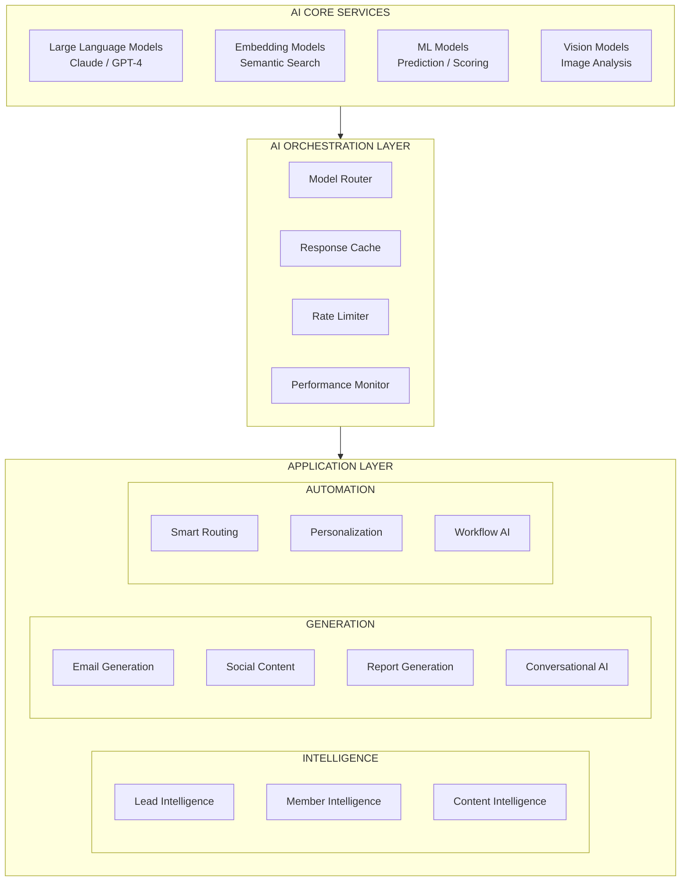

---

## AI Applications by Entity

### Central Hub AI

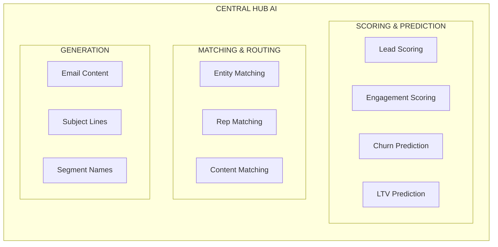

| Application | Input | Output | Model |
|-------------|-------|--------|-------|
| **Lead Scoring** | Demographics, behavior, source | Score 0-100 | Custom ML |
| **Entity Matching** | Profile, interests, history | Entity ranking | Embedding + rules |
| **Churn Prediction** | Engagement history, patterns | Probability | Classification ML |
| **Email Generation** | Context, template, recipient | Personalized email | Claude/GPT-4 |

---

### Metro 1 Commercial AI

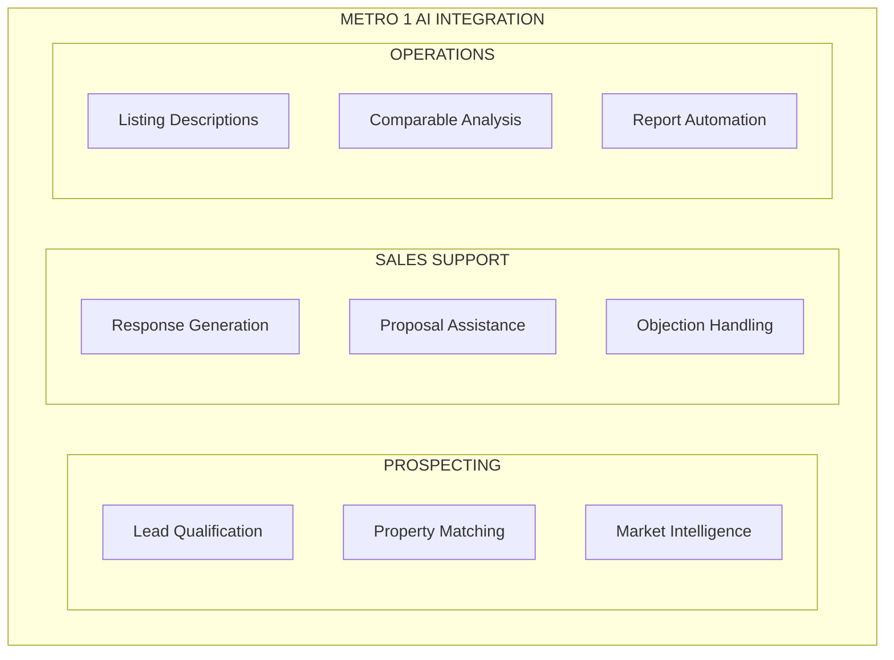

| Application | Description | AI Approach |
|-------------|-------------|-------------|
| **Lead Qualification** | Score incoming inquiries by fit | Scoring model on CRE criteria |
| **Property Matching** | Match clients to available properties | Requirement extraction + similarity |
| **Market Intelligence** | Monitor market for opportunities | NLP on listings, news, trends |
| **Response Generation** | Draft email responses to inquiries | LLM with Metro 1 voice |
| **Listing Descriptions** | Generate compelling property descriptions | LLM with property data |
| **Comparable Analysis** | Identify and analyze comps | ML on transaction data |

---

### Future of Cities AI

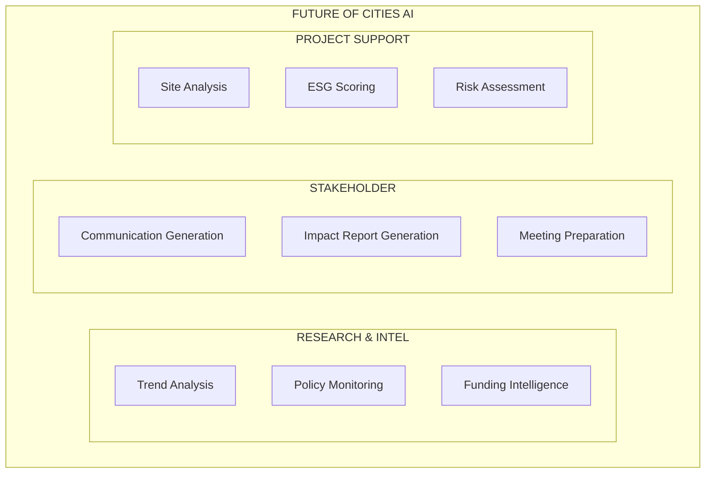

| Application | Description | AI Approach |
|-------------|-------------|-------------|
| **Trend Analysis** | Monitor urban development trends | NLP on publications, research |
| **Policy Monitoring** | Track relevant policy changes | NLP on government sources |
| **Impact Reporting** | Generate ESG and impact reports | LLM with project data |
| **Site Analysis** | Evaluate potential development sites | Multi-modal (satellite, data) |
| **ESG Scoring** | Score projects on ESG criteria | Custom scoring model |

---

### PHX-JAX District AI

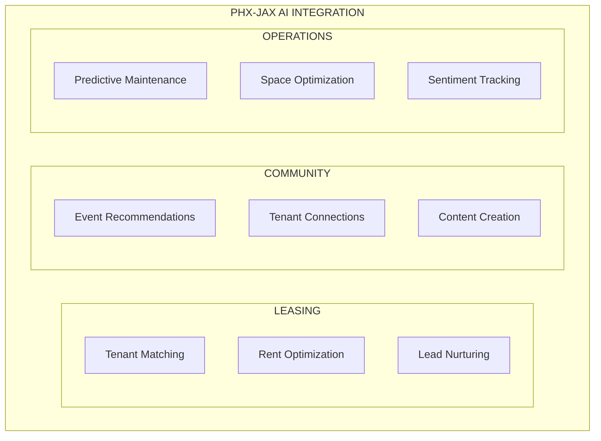

| Application | Description | AI Approach |
|-------------|-------------|-------------|
| **Tenant Matching** | Match leads to available spaces | Profile matching + space requirements |
| **Event Recommendations** | Suggest events to district visitors | Collaborative filtering |
| **Tenant Connections** | Facilitate inter-tenant collaboration | Profile similarity + complementarity |
| **Predictive Maintenance** | Anticipate maintenance needs | Time-series ML |
| **Sentiment Tracking** | Monitor tenant/visitor satisfaction | NLP on feedback |

---

### Climate + Innovation HUB AI

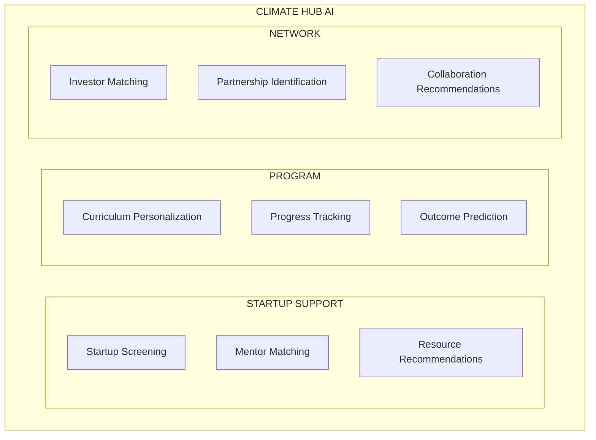

| Application | Description | AI Approach |
|-------------|-------------|-------------|
| **Startup Screening** | Evaluate startup applications | Scoring model on success factors |
| **Mentor Matching** | Match startups with ideal mentors | Profile matching + expertise |
| **Investor Matching** | Connect startups with aligned investors | Investment thesis matching |
| **Curriculum Personalization** | Tailor program to startup needs | Learning path optimization |
| **Outcome Prediction** | Predict startup success likelihood | Classification on historical data |

---

### CCRL AI

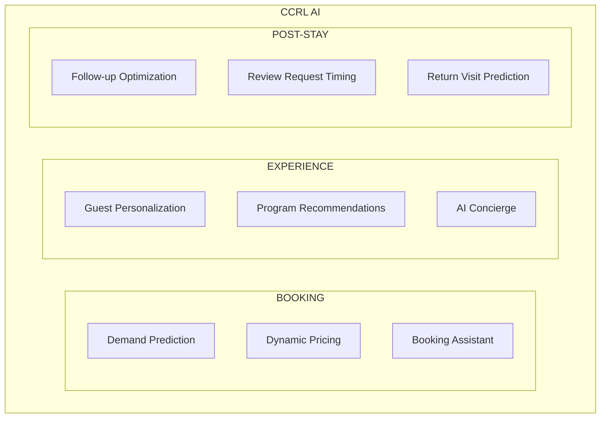

| Application | Description | AI Approach |
|-------------|-------------|-------------|
| **Demand Prediction** | Forecast booking demand | Time-series forecasting |
| **Dynamic Pricing** | Optimize pricing by demand | Pricing optimization ML |
| **Booking Assistant** | Conversational booking support | LLM with availability data |
| **Guest Personalization** | Tailor experience to guest | Profile analysis + preferences |
| **AI Concierge** | Answer questions, make recommendations | RAG on retreat knowledge |
| **Return Prediction** | Identify likely repeat guests | Classification model |

---

### Authority Platform AI

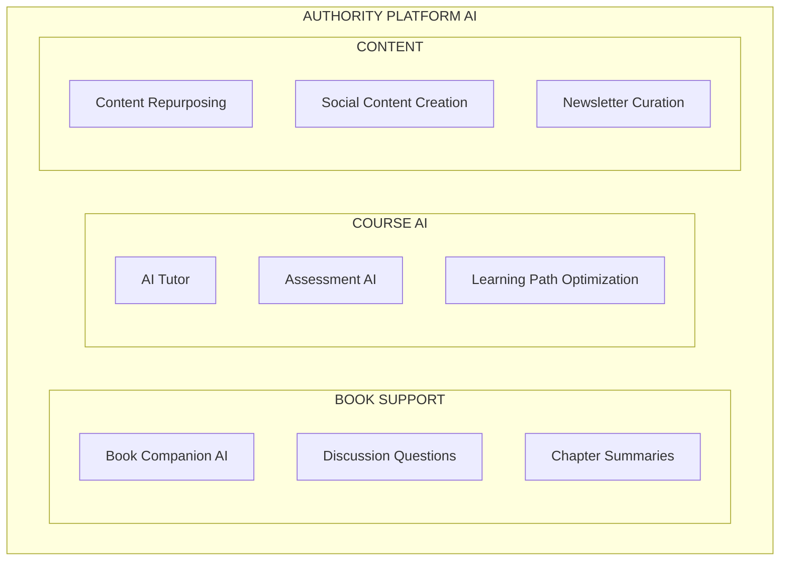

| Application | Description | AI Approach |
|-------------|-------------|-------------|
| **Book Companion** | Answer questions about book content | RAG on book content |
| **AI Tutor** | Support course students with learning | LLM with course curriculum |
| **Assessment AI** | Grade open-ended assignments | LLM with rubrics |
| **Content Repurposing** | Transform long content to short form | LLM summarization + formatting |
| **Social Content** | Generate social posts from content | LLM with brand voice |
| **Newsletter Curation** | Curate and generate newsletter content | LLM with engagement data |

---

### Community Platform AI

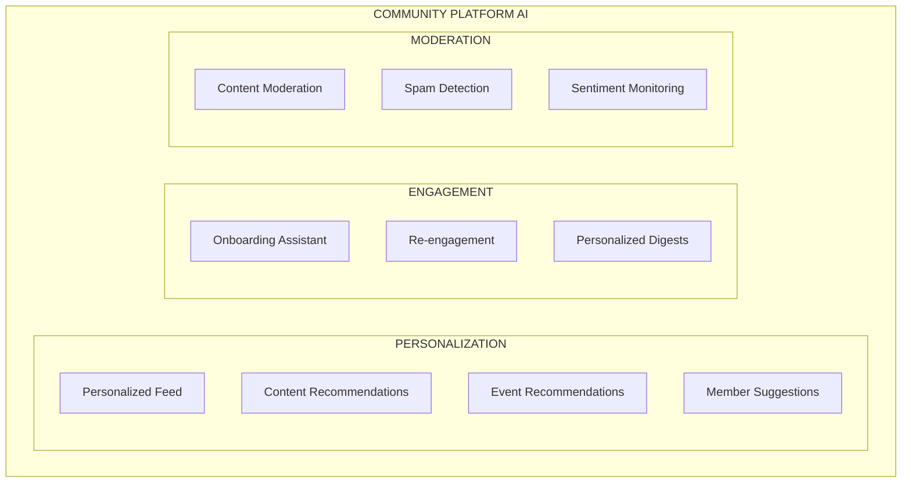

| Application | Description | AI Approach |
|-------------|-------------|-------------|
| **Personalized Feed** | Curate content feed for each member | Collaborative + content-based filtering |
| **Member Suggestions** | Recommend connections | Profile similarity + complementarity |
| **Onboarding Assistant** | Guide new members through setup | Conversational AI with community context |
| **Content Moderation** | Flag inappropriate content | Classification + LLM review |
| **Re-engagement** | Win back inactive members | Churn prediction + personalized messaging |

---

### Foundation AI

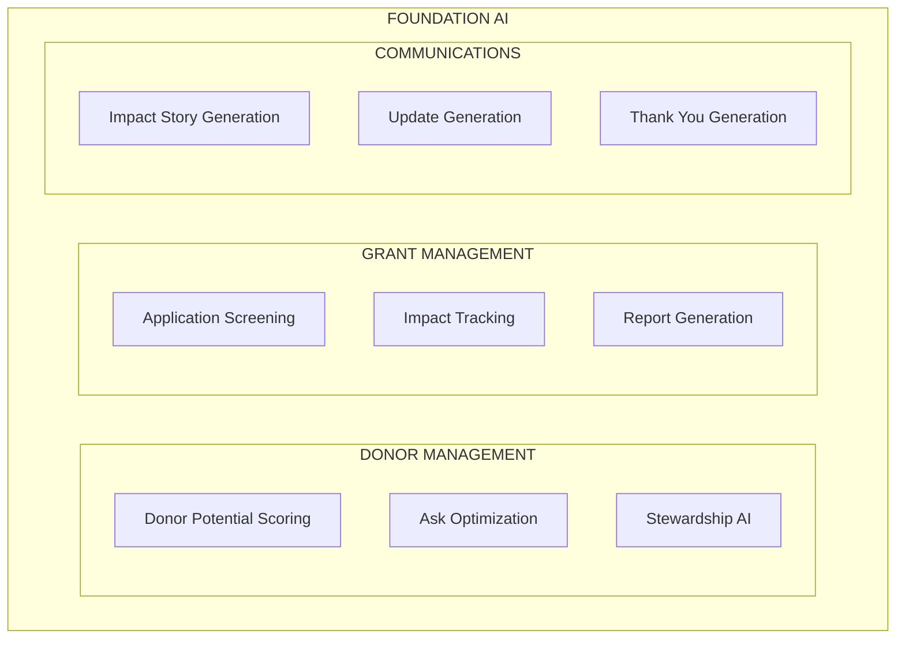

| Application | Description | AI Approach |
|-------------|-------------|-------------|
| **Donor Scoring** | Score donor potential and interests | Scoring model on giving patterns |
| **Ask Optimization** | Determine optimal ask amount/timing | Optimization model |
| **Application Screening** | Initial screening of grant applications | LLM + scoring criteria |
| **Impact Story Generation** | Create compelling impact narratives | LLM with impact data |
| **Thank You Generation** | Personalized donor thank you notes | LLM with donor context |

---

## AI Implementation Priority

### Priority Matrix

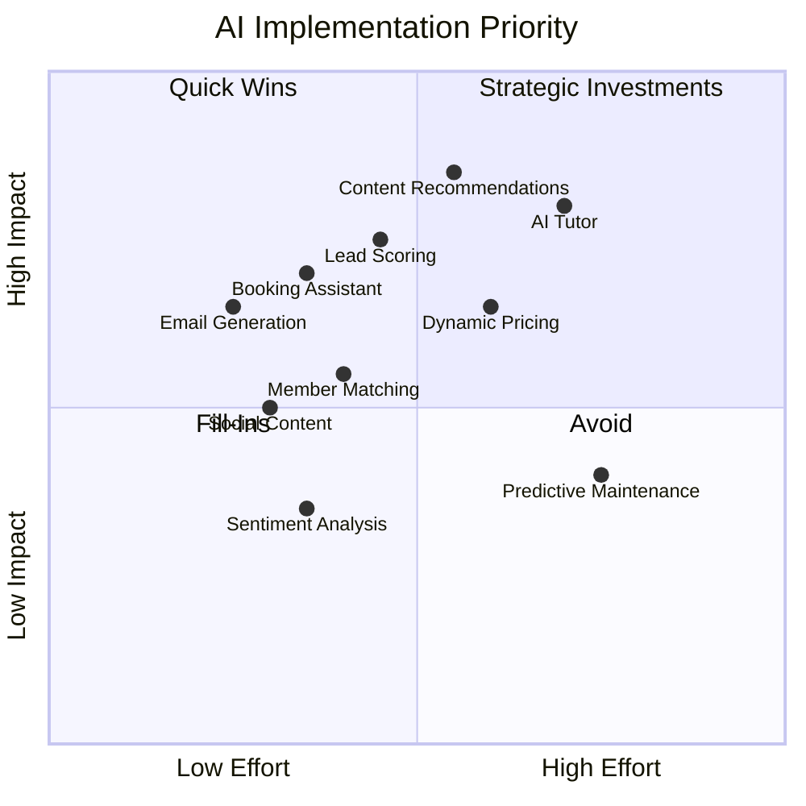

### Implementation Phases

| Phase | AI Applications | Timeline |
|-------|-----------------|----------|
| **Phase 2A** | Lead Scoring, Email Generation, Content Recommendations | Months 1-2 |
| **Phase 2B** | Booking Assistant, Member Matching, Social Content | Months 3-4 |
| **Phase 3A** | AI Tutor, Book Companion, Personalized Feed | Months 5-6 |
| **Phase 3B** | Dynamic Pricing, Donor Scoring, Full Automation | Months 7-8 |
| **Ongoing** | Model refinement, new applications | Continuous |

---

## Technical Specifications

### Model Selection

| Use Case | Recommended Model | Rationale |
|----------|-------------------|-----------|
| **Content Generation** | Claude 3 Opus/Sonnet | Quality, safety, long context |
| **Email/Social** | Claude 3 Haiku or GPT-4 Mini | Speed, cost efficiency |
| **Embeddings** | OpenAI text-embedding-3 | Quality, integration |
| **Classification** | Custom fine-tuned or XGBoost | Domain specificity |
| **Time Series** | Prophet or custom LSTM | Forecasting accuracy |
| **Vision** | Claude 3 Vision | Multi-modal capability |

### API Architecture

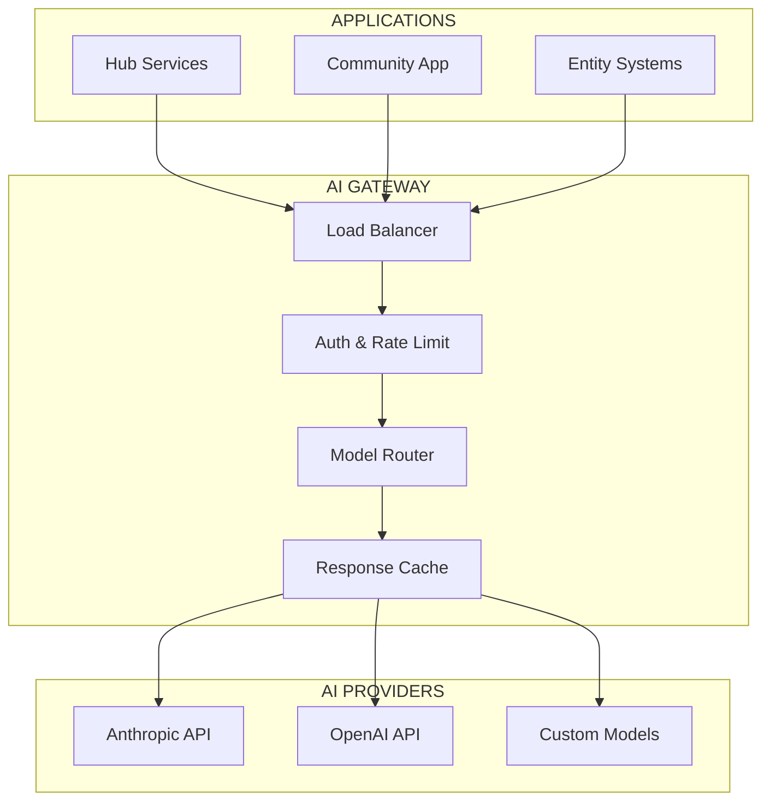

### Cost Estimation

| Application | Monthly Volume | Est. Cost |
|-------------|---------------|-----------|
| Email Generation | 50,000 emails | $500-1,000 |
| Content Recommendations | 1M requests | $200-500 |
| Conversational AI | 100,000 messages | $300-600 |
| Scoring Models | 500,000 scores | $100-200 |
| Content Analysis | 10,000 pieces | $200-400 |
| **Total Estimated** | | **$1,300-2,700/mo** |

---

## Data Requirements

### Training Data

| Model | Required Data | Source |
|-------|---------------|--------|
| Lead Scoring | Historical leads + outcomes | CRM |
| Content Recommendations | User behavior + content metadata | Analytics + CMS |
| Churn Prediction | Member activity history | Community platform |
| Property Matching | Past transactions + feedback | Metro 1 CRM |
| Email Performance | Open/click rates by segment | Email platform |

### Real-Time Data

| Data | Source | Update Frequency |
|------|--------|------------------|
| User Behavior | App/Web analytics | Real-time |
| Content Engagement | CMS + Analytics | Real-time |
| Lead Activity | CRM webhooks | Real-time |
| Member Status | Community platform | Real-time |
| Booking Status | Reservation system | Real-time |

---

## Governance & Ethics

### AI Principles

| Principle | Implementation |
|-----------|----------------|
| **Transparency** | Disclose AI use to users |
| **Control** | Users can opt-out of AI features |
| **Privacy** | No PII in model training without consent |
| **Fairness** | Regular bias audits on scoring models |
| **Safety** | Content filters on all generation |

### Monitoring

| Metric | Threshold | Action |
|--------|-----------|--------|
| Hallucination Rate | < 1% | Increase grounding |
| Bias Indicators | Flagged | Audit and retrain |
| User Satisfaction | > 80% | Continuous improvement |
| Cost per Action | Budget | Optimize model selection |
| Latency | < 2 seconds | Scale infrastructure |

---

## Success Metrics

| Category | Metric | Target |
|----------|--------|--------|
| **Efficiency** | Manual hours saved | 100+ hrs/month |
| **Conversion** | AI-assisted conversion lift | +25% |
| **Engagement** | Personalization engagement | +40% |
| **Satisfaction** | AI feature NPS | > 50 |
| **Accuracy** | Scoring model accuracy | > 85% |
| **Adoption** | % of users using AI features | > 70% |

---

*AI across the ecosystem—intelligence at every touchpoint.*
