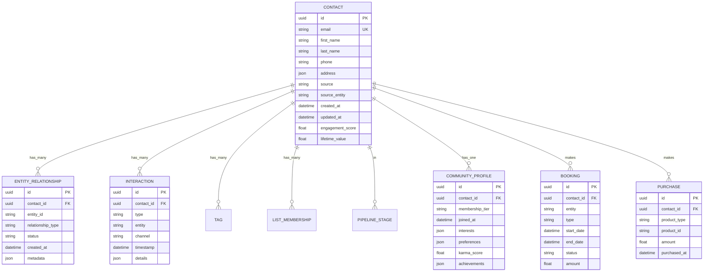

# Cho Ventures Ecosystem Hub Architecture

> *The central nervous system connecting all Cho Ventures entities.*

---

## Overview

The Ecosystem Hub is the AI-powered command center that unifies all Cho Ventures entities. It serves as the single source of truth for contacts, content, and intelligence—enabling seamless cross-entity experiences and operational efficiency.

---

## High-Level Architecture

---

## CRM Core Architecture

### Unified Contact Model

### Entity Relationship Types

| Entity | Relationship Types |
|--------|-------------------|
| **Metro 1** | Lead, Client, Seller, Buyer, Tenant, Landlord |
| **Future of Cities** | Investor, Stakeholder, Partner, Interested |
| **PHX-JAX** | Tenant, Visitor, Event Attendee, Vendor |
| **Climate HUB** | Startup Founder, Mentor, Sponsor, Participant |
| **CCRL** | Guest, Member, Volunteer, Staff, Program Participant |
| **Foundations** | Donor, Grantee, Volunteer, Beneficiary |
| **Book** | Reader, Pre-Order, Reviewer |
| **Course** | Student (Active), Alumni, Dropout |
| **Community** | ChoZen IP Member, Essentials, Premium, Founder |

---

## AI Engine Architecture

### AI Model Specifications

| Model | Input | Output | Use Case |
|-------|-------|--------|----------|
| **Lead Scoring** | Contact attributes, behavior, source | Score 0-100 | Prioritize outreach |
| **Entity Matching** | Contact profile, interests | Ranked entity list | Cross-referral |
| **Content Matching** | Member profile, history | Content recommendations | Personalization |
| **Email Generation** | Context, template, recipient | Personalized email | Automation |
| **Churn Prediction** | Engagement history | Churn probability | Retention |

---

## Automation Engine Architecture

### Core Workflows

| Workflow | Trigger | Sequence |
|----------|---------|----------|
| **New Lead** | Form submission | Welcome → Nurture → Entity routing |
| **Retreat Booking** | Booking confirmed | Confirmation → Pre-arrival → Welcome → Post-stay |
| **Course Enrollment** | Purchase | Welcome → Onboarding → Progress check-ins |
| **Community Join** | Registration | Welcome → Profile completion → First week engagement |
| **Cross-Entity Referral** | AI entity match | Notification → Introduction → Handoff |
| **Churn Prevention** | Score drop | Re-engagement → Value reminder → Personal outreach |

---

## Integration Architecture

### Integration Methods

| System | Integration Type | Sync Frequency |
|--------|-----------------|----------------|
| Entity Websites | Webhook | Real-time |
| Booking System | API | Real-time |
| Course Platform | API | Real-time |
| Community App | API | Real-time |
| Email Service | API | Real-time |
| Analytics | Events | Real-time |
| AI Services | API | On-demand |
| Payment | Webhook | Real-time |

---

## Dashboard Architecture

### Key Metrics by View

| Dashboard | Key Metrics |
|-----------|-------------|
| **Ecosystem** | Total contacts, cross-entity conversions, LTV, engagement |
| **Metro 1** | Leads, pipeline value, close rate, deals |
| **Future of Cities** | Projects, stakeholders, ESG scores |
| **PHX-JAX** | Occupancy, event attendance, tenant satisfaction |
| **Climate HUB** | Startups, funding, impact metrics |
| **CCRL** | Bookings, occupancy, NPS, repeat rate |
| **Book** | Sales, reviews, list growth |
| **Course** | Enrollments, completion, NPS |
| **Community** | Members, active rate, retention |
| **Content** | Reach, engagement, conversion |

---

## Security Architecture

### Security Measures

| Layer | Measures |
|-------|----------|
| **Authentication** | SSO, MFA, session management |
| **Authorization** | Role-based access, entity-level permissions |
| **Data** | AES-256 encryption, TLS 1.3, PII masking |
| **Compliance** | GDPR consent, data portability, deletion |
| **Monitoring** | Audit logging, anomaly detection, alerts |

---

## Technical Stack Recommendations

| Layer | Recommended Technology |
|-------|----------------------|
| **CRM Platform** | HubSpot Enterprise or GoHighLevel |
| **Database** | PostgreSQL with read replicas |
| **API Layer** | Node.js/Express or FastAPI |
| **AI Services** | Claude API, OpenAI API |
| **Email** | SendGrid or Postmark |
| **SMS** | Twilio |
| **Analytics** | Mixpanel + custom dashboards |
| **Hosting** | AWS or GCP |
| **CDN** | CloudFlare |
| **Monitoring** | Datadog or New Relic |

---

## Scalability Considerations

### Horizontal Scaling

| Component | Scaling Strategy |
|-----------|-----------------|
| API Layer | Auto-scaling containers |
| Database | Read replicas, sharding if needed |
| Automation | Queue-based processing |
| AI Services | Rate limiting, caching |
| Analytics | Pre-computed aggregations |

### Performance Targets

| Metric | Target |
|--------|--------|
| API Response Time | < 200ms (p95) |
| Webhook Processing | < 5 seconds |
| Email Delivery | < 30 seconds |
| Dashboard Load | < 3 seconds |
| AI Response | < 2 seconds |

---

*The Ecosystem Hub is the foundation. Everything connects through here.*
