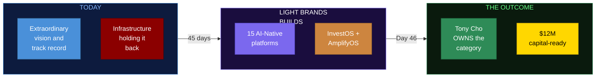
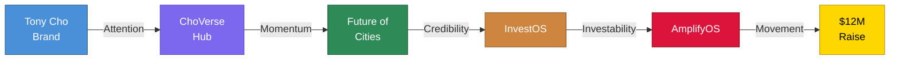
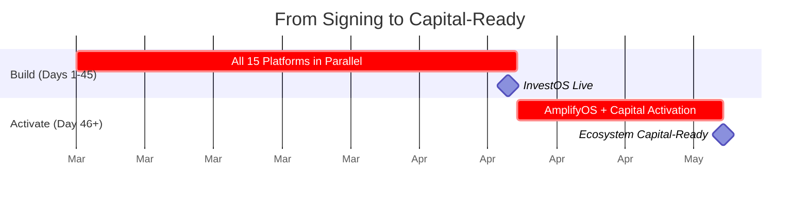
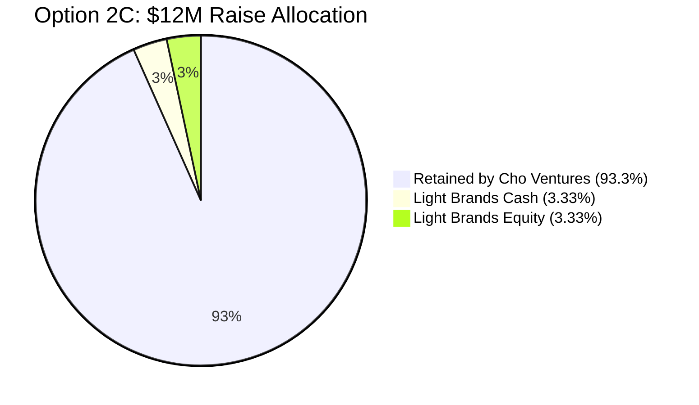
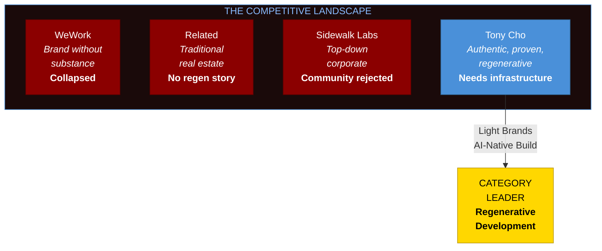

# LIGHT BRANDS
# CHO VENTURES PARTNERSHIP: EXECUTIVE OVERVIEW

> **Prepared for:** Tony Cho
> **Prepared by:** Light Brands
> **Date:** February 17, 2026

---

## The Opportunity

Nobody owns the category of Regenerative Development. Not yet.

Tony Cho has done what nobody else in this space can claim. Transformed Wynwood before anyone saw it coming. Built regenerative communities, climate innovation hubs, arts programming, youth development, and philanthropic infrastructure across 15+ entities. Not because it was trendy. Because it was right.

The substance is real. The track record is undeniable. The authenticity cannot be manufactured.

What is missing is the infrastructure that makes all of it visible as one unified movement. Right now, 15+ entities run on disconnected WordPress, Squarespace, and Wix sites held together by widgets and SaaS subscriptions that were never designed to talk to each other. The vision is extraordinary. The infrastructure is the gap.

---

## What We Build

A 100% AI-native ecosystem where every platform is intelligent, every entity is connected, and every touchpoint compounds value. Not websites. Not chatbots. A unified infrastructure that makes 15 entities operate as one.

**15 platforms delivered across the full Cho Ventures ecosystem:**

| Category | Entities |
|----------|----------|
| **Creative Identity** | Tony Cho Brand, Book, Online Course, Speaking and Media |
| **Ecosystem Hub** | ChoVerse |
| **Real Estate** | Future of Cities, Metro 1, PHX-JAX District, Climate + Innovation HUB |
| **Regenerative** | ChoZen Center (CCRL), ChoZen IP |
| **Philanthropy** | Cho Family Foundation, Ximena Cho Legacy Fund, Friends of PHXJAX |
| **Infrastructure** | Cho Ventures Family Office, InvestOS, AmplifyOS |

---

## The Timeline

InvestOS deployed in 45 days. AmplifyOS fires immediately after. Zero to capital-ready in under 10 weeks.

---

## The Economics

| | **Option 1** | **Option 2A** | **Option 2B** | **Option 2C (Recommended)** |
|---|---|---|---|---|
| **What You Get** | 3 platforms | All 15 platforms + InvestOS + AmplifyOS | Same | Same |
| **Total Cash** | $45,000 | $650,000 | $500,000 | $400,000 |
| **Equity** | None | None | $200,000 (0.57%) | $400,000 (1.13%) |
| **Upfront** | $45,000 | $65,000 | $50,000 | $40,000 |
| **Deferred** | None | 90% to milestones | 90% to milestones | 90% to milestones |
| **At-Cost Future Work** | No | No | Yes | Yes |
| **Advisory** | No | No | Yes | Yes |
| **% of $12M Raise** | 0.38% | 5.42% | 4.17% | 3.33% |

**Milestone triggers (Option 2, all structures):**
- 10% upfront upon signing
- Milestone 1 at $1.2M raised (10% of $12M)
- Milestone 2 at $3.6M raised (30% of $12M)

**Light Brands only gets paid in full if the raise succeeds.** 90% of cash fees are deferred and tied directly to capital milestones. Equity vests only when the full raise closes. The economics are structured entirely in your favor.

---

## The Valuation

| Metric | Value |
|--------|-------|
| **Pre-Money NAV** | $35.3M |
| **Post-Money (after $12M raise)** | $47.3M |
| **Assets** | $51.8M |
| **NAV / Invested Equity** | 4.7x |
| **Option 2C Equity at Pre-Money** | $400K = 1.13% |
| **That 1.13% at Post-Money** | ~$534K |

Equity is priced at pre-money NAV of $35.3M. It vests when the raise closes. It can be sold at any time after that. Equity partners receive at-cost pricing on all future development and ongoing advisory.

---

## The Category Play

Regenerative Development is where real estate, climate, community, culture, and capital are converging. Nobody owns this category. The person who builds the ecosystem first, with the infrastructure to back it up, defines the space for the next decade.

Tony Cho has the substance nobody else has. This engagement gives him the infrastructure to match.

---

## The Decision

**Option 1:** $45K upfront. Three platforms. Identity and cohesion. No capital activation.

**Option 2 (Recommended):** Full ecosystem. All 15 platforms. InvestOS. AmplifyOS. Capital-ready in under 10 weeks. Three payment structures ranging from $40K to $65K upfront, with 90% deferred to raise milestones.

Build separate pieces over time, or build the full ecosystem once and own the category.

The category is unclaimed. The track record is yours. The infrastructure is what we build.

---

*Light Brands | Institutional Infrastructure and Capital Activation Partnership*
*$40K starts the build. 90% deferred. 45 days to InvestOS. Category ownership on the other side.*
