# LIGHT BRANDS
# INSTITUTIONAL INFRASTRUCTURE AND CAPITAL ACTIVATION PARTNERSHIP

> **Prepared for:** Tony Cho
> **Prepared by:** Light Brands
> **Date:** February 17, 2026
> **Raise Objective:** $12M Capital Alignment

---

## 1. Executive Overview

This proposal outlines the strategic infrastructure required to align the Tony Cho personal brand, Future of Cities initiative, and capital-readiness systems into a unified ecosystem designed to support long-term influence, creative expression, and institutional growth.

The opportunity is unique:

- A strong visionary identity
- A proven track record of creative cultural influence
- Meaningful relationships and network access
- A mission capable of attracting both community participation and institutional capital

The core challenge is structural.

At present, the vision exists across multiple ideas and initiatives without a unified system that clearly shows how people engage, participate, learn, or invest.

Light Brands operates at the intersection of strategy, systems, and execution, building institutional-grade ecosystems that transform vision into aligned momentum and capital readiness.

---

## 2. Strategic Context

### The Vision: Category Ownership

Here is what we believe — and we believe it deeply.

Tony Cho is already doing the work. Regenerative placemaking. Community-driven development. Cultural preservation through real estate. Climate innovation. Arts activation. Youth programming. Philanthropic infrastructure. Nobody else is operating across all of these dimensions simultaneously with this level of authenticity and track record.

You transformed Wynwood before anyone understood what it could become. You built regenerative communities while the rest of the industry was still debating whether sustainability was worth the investment. You created arts programming, climate innovation hubs, youth camps, and philanthropic vehicles — not because they were trendy, but because they were right.

The work is extraordinary. And nobody else in this space can say what you can say, because nobody else has done what you have done.

The leaders who own categories — the ones whose names are synonymous with their space — did not get there by doing better work. They got there by building ecosystems that made their work visible, connected, and impossible to ignore. They built infrastructure that positioned every project, every initiative, every relationship as part of a single, coherent narrative.

Consider the landscape right now:

| Name | Known For | Infrastructure |
|------|-----------|---------------|
| **WeWork / Adam Neumann** | Community workspace, massive brand, collapsed | Over-indexed on brand, under-indexed on substance |
| **Related Companies / Stephen Ross** | Hudson Yards, mega-development | Traditional real estate, no regenerative narrative |
| **Sidewalk Labs / Google** | Smart cities, data-driven urbanism | Corporate, top-down, community skepticism |
| **Tony Cho** | Wynwood transformation, regenerative placemaking, arts, community, climate innovation | **The vision is real. The track record is real.** |

The difference between Tony Cho and every other name in this space is authenticity. The cultural impact is real. The community relationships are real. The regenerative commitment is real. Nobody else has the substance. Nobody else has the story.

The category of Regenerative Development is wide open. Nobody owns it. The person who builds the ecosystem first — who connects community, culture, climate, capital, and real estate into a single visible movement — will define what this space looks like for the next decade.

**That person should be Tony Cho.**

On the other side of this engagement, Tony Cho is not just a developer with interesting projects. Tony Cho is the face of Regenerative Development. The definitive voice in Regenerative Community Building. The person every conference invites to keynote, every publication references, every investor associates with the category itself.

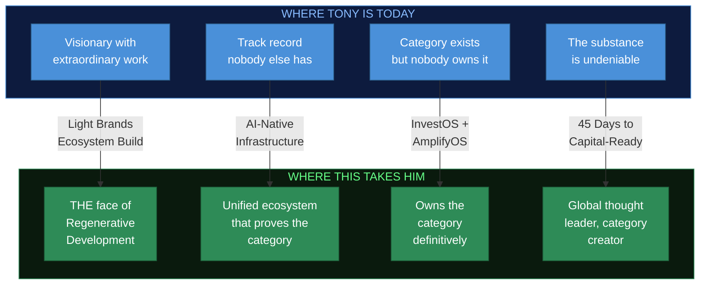

**We are not building a website. We are building the platform that positions Tony Cho as the definitive leader in regenerative development for the next decade.**

This is the category to own. Regenerative development is where real estate, climate, community, culture, and capital are converging. The person who owns this narrative — with the infrastructure to prove it — will attract the capital, the partnerships, the press, and the institutional support that follows category leadership.

That person should be Tony Cho. And on the other side of what we are capable of building, it will be.

### The Gap: What's Standing in the Way

So why isn't Tony Cho already recognized as the category leader? It's not the work. It's the infrastructure.

Let's be direct.

You have 15+ entities, initiatives, and platforms operating across the Cho Ventures ecosystem. What holds them together right now is a patchwork of WordPress sites, Squarespace pages, Wix builders, embedded third-party widgets, disconnected CRMs, fragmented email tools, and a dozen SaaS subscriptions that were never designed to talk to each other.

This is not infrastructure. This is digital duct tape.

Every tool in the current stack was built for a single-business operator running one website with one audience. You are not that. You are a multi-entity ecosystem with real estate holdings, regenerative ventures, philanthropic initiatives, creative platforms, and an institutional capital strategy — all running on tools designed for someone selling candles on Etsy.

The result is exactly what you already feel:

- **No cohesion.** Each platform is an island. Nothing connects. Nothing informs anything else.
- **No intelligence.** None of your systems learn. None of them know what the other is doing. Every platform starts from zero every time.
- **No scalability.** Adding a new initiative means spinning up another disconnected website with another login, another set of plugins, another monthly subscription that adds complexity without adding capability.
- **No investor confidence.** Institutional capital evaluates infrastructure. What they see right now is a collection of consumer-grade websites that do not communicate a $35M+ operation.

You have been committed to doing this on a budget, and it shows.

That is not a criticism — it is a diagnosis. The vision is extraordinary. The track record is undeniable. But the infrastructure is holding everything back. Every month spent patching together Web 2.0 tools is a month where the category stays unclaimed — and a month where someone with less substance but better infrastructure could step in front of you.

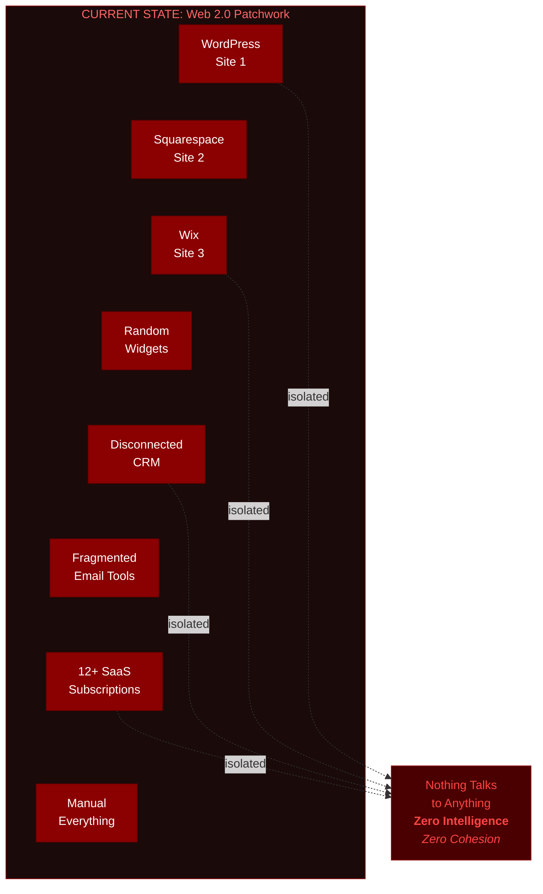

### The Industry Has Already Moved

The world has shifted. The organizations you will compete with for capital, attention, and partnerships are not building on WordPress. They are building AI-native ecosystems where every tool, every platform, every touchpoint is intelligent, connected, and informed by the entire operation.

This is not a future state. This is happening now.

- **AI-native platforms** know who is visiting, what they care about, and how to serve them — automatically.
- **Connected ecosystems** share context across every entity. A donor at the Cho Family Foundation is recognized when they visit Future of Cities. An investor exploring the QOF sees the full ecosystem narrative without clicking through six disconnected websites.
- **Intelligent infrastructure** compounds value over time. Every interaction teaches the system. Every touchpoint makes the next one smarter.

The question is not whether this transition needs to happen. You already know it does. The question is whether you are ready to do something about it now — while the category is still unclaimed — or whether you are comfortable watching the gap widen over the next decade while someone else claims the space you built.

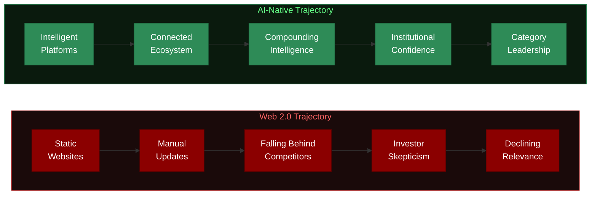

### The Solution: 100% AI-Native Infrastructure

This is not about adding a chatbot to your website. This is a fundamental architectural shift that matches the infrastructure to the vision.

When we say **100% AI-native at its core**, we mean:

| Dimension | Web 2.0 (Current) | AI-Native (Proposed) |
|-----------|-------------------|---------------------|
| **Content** | Manually written, manually updated | Dynamically informed, contextually served |
| **User Experience** | Same page for everyone | Personalized pathways based on intent |
| **Cross-Platform** | Each site is an island | Every platform shares intelligence |
| **Investor Experience** | Static PDF deck, hope they read it | Adaptive narrative that responds to interest |
| **Data** | Sitting in 12 disconnected dashboards | Unified intelligence layer across ecosystem |
| **Operations** | Manual coordination across entities | Automated orchestration informed by AI |
| **Scaling** | Add another WordPress site | Extend the ecosystem with zero fragmentation |
| **Competitive Position** | Keeping up | Owning the category |

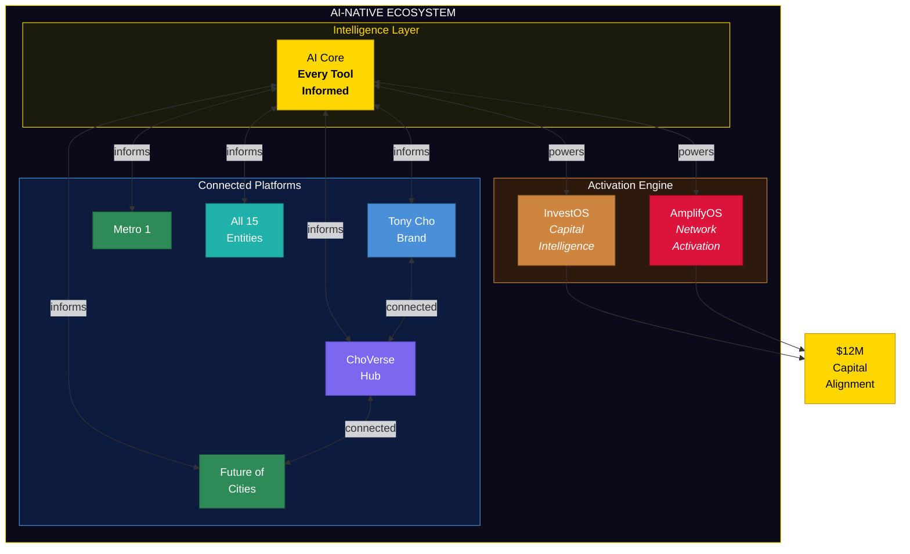

Every platform in the ecosystem becomes intelligent. Every tool is aware of the others. Every touchpoint compounds value. Nothing operates in isolation. Nothing is static. Nothing requires you to manually bridge gaps between disconnected systems ever again.

**This is what we build. This is what we are proposing. This is how Tony Cho owns the category.**

### The Methodology

Most founders and creators attempt to grow influence, launch products, and raise capital as separate efforts.

This typically results in:

- fragmented messaging
- disconnected offerings
- unclear participation paths
- momentum that depends entirely on the founder

Our methodology integrates these elements into one structured, AI-native ecosystem.

The sequence becomes:

1. Build intelligent infrastructure first
2. Align narrative, products, and identity
3. Activate network and capital pathways
4. Scale with systems already in place — systems that learn and improve continuously

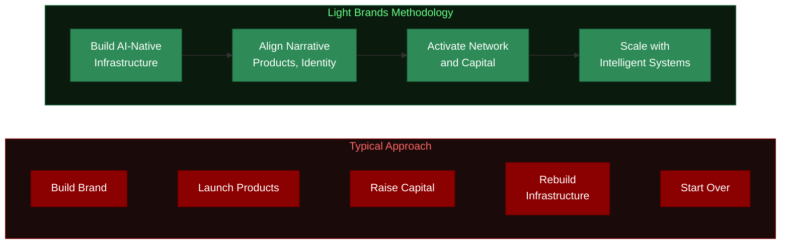

This approach allows momentum to compound rather than reset. And because the foundation is AI-native, every layer gets smarter over time — not just maintained.

---

## 3. Ecosystem Architecture

The proposed ecosystem consists of five interconnected layers.

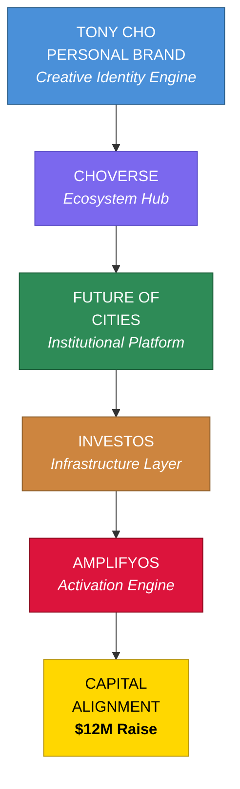

### Layer I. Tony Cho Personal Brand Platform

This platform becomes the creative expression of Tony Cho as a visionary, artist, builder, and cultural influence.

**Purpose:**

- Express the creative identity behind the work
- Showcase artistic influence and legacy, including cultural impact such as Wynwood
- Promote personal offerings including books, courses, and educational products
- Serve as the primary vehicle for audience engagement and storytelling

**Strategic Direction:**

This is not simply a personal website. It is a living creative platform that reflects how Tony thinks, builds, and influences culture. The tone and design should feel like an expression of the creator himself.

### Layer II. ChoVerse Ecosystem Hub

ChoVerse serves as the central container connecting all activity within the Tony Cho universe.

**Purpose:**

- Aggregate news, activity, offerings, art, and community initiatives
- Highlight ongoing projects and collaborations
- Create a consistent destination where people follow the broader movement
- Act as the amplification center for ongoing visibility and engagement

ChoVerse sits between personal brand and institutional positioning. It becomes the place where the community experiences the ecosystem in motion.

### Layer III. Future of Cities Platform

Future of Cities remains institutional in tone and execution.

**Purpose:**

- Position the larger mission with professional credibility
- Present projects and initiatives at an institutional level
- Support strategic partnerships and investor confidence

Navigation structure includes clear pathways back to "Meet Tony," ensuring alignment between visionary identity and institutional initiatives.

### Layer IV. InvestOS (Infrastructure Layer)

InvestOS forms the operational foundation beneath the ecosystem.

**Purpose:**

- Capital alignment architecture
- Investor-facing readiness systems
- Structured engagement pathways
- Narrative-to-financial alignment

InvestOS transforms visibility into investability by creating infrastructure that institutional stakeholders can evaluate and trust.

### Layer V. AmplifyOS (Capital and Network Activation Layer)

Once infrastructure is established, AmplifyOS activates the ecosystem across Tony's network and audience.

**Purpose:**

- Strategic amplification of ChoVerse and ecosystem activity
- Promotion of products, launches, and offerings under the personal brand
- Narrative-driven network activation supporting fundraising momentum
- Campaign architecture that converts visibility into participation and investment

AmplifyOS ensures infrastructure becomes movement, not static assets.

---

## 4. Scope of Work

### 4.1 Tony Cho Personal Brand Platform

**Scope includes:**

- Strategic narrative and positioning architecture
- Creative direction reflecting artistic identity
- Product ecosystem integration including book launch and courses
- Digital platform design and development
- Audience engagement flows
- AI-powered amplification foundations

**Outcome:**
A living personal platform that expresses identity while delivering products and ongoing engagement opportunities.

### 4.2 ChoVerse Ecosystem Hub

**Scope includes:**

- Ecosystem architecture design
- Centralized content and activity framework
- News, community, and offering integration
- Platform experience designed for ongoing amplification

**Outcome:**
A dynamic hub that connects all initiatives into one coherent universe.

### 4.3 Future of Cities Platform

**Scope includes:**

- Institutional positioning framework
- Narrative and brand architecture
- Project-focused digital infrastructure
- Strategic navigation linking back to personal brand

**Outcome:**
A professional, institutional-facing platform supporting partnerships and credibility.

### 4.4 InvestOS Infrastructure

**Scope includes:**

- Capital alignment architecture
- Investor-facing system design
- Participation pathways
- Strategic infrastructure supporting fundraising readiness
- Financial and narrative integration

**Outcome:**
Institutional-grade ecosystem ready for capital participation.

### 4.5 AmplifyOS Capital Activation

**Scope includes:**

- Strategic amplification strategy
- Network activation pathways
- Messaging for product launches and fundraising momentum
- Campaign structure designed to convert attention into action
- Advisory during fundraising activation phase

**Outcome:**
A system that actively drives participation toward the $12M raise objective while growing the broader ecosystem.

### 4.6 Full Ecosystem Web Portal Build-Out

This engagement includes the core web infrastructure for every business and initiative within the Cho Ventures ecosystem. Each portal receives foundational design, development, and integration into the ChoVerse hub.

**Platforms included:**

| Entity | Portal Type | Description |
|--------|------------|-------------|
| Tony Cho Personal Brand | Creative Platform | Artistic identity, book, course, storytelling |
| ChoVerse | Ecosystem Hub | Central activity aggregator for the entire universe |
| Cho Ventures | Family Office Portal | Portfolio overview, investor relations |
| Future of Cities | Institutional Platform | Regenerative placemaking, projects, partnerships |
| Metro 1 Commercial | Brokerage Platform | Commercial real estate, agent profiles, listings |
| PHX-JAX District | District Portal | Arts and innovation district, events, community |
| Climate + Innovation HUB | Incubator Platform | Climate tech programs, startups, events |
| ChoZen Center (CCRL) | Program Portal | Artisan market, farm days, residency, youth camp |
| ChoZen IP | Brand and Membership Portal | Membership platform, Casa Colibri, gift shop |
| Book Platform | Product Launch Site | Generation Regeneration, Soft Power |
| Online Course | Education Portal | Courses, certification, learning paths |
| Speaking and Media | Thought Leadership Portal | Engagements, podcast, media presence |
| Cho Family Foundation | Philanthropy Portal | DAF, conservation, culture preservation |
| Ximena Cho Legacy Fund | Legacy Portal | DAF, community development, cultural preservation |
| Friends of PHXJAX | Community Nonprofit Portal | Bloom Labs, Spring Mural Jam, arts programming |

**Exclusions:**

- ChoZen mobile application or native app development
- Advanced AI or machine learning functionality within individual platforms
- Custom software beyond standard web portal infrastructure
- Third-party system integrations requiring custom API development

**What is included per portal:**

- Strategic positioning and narrative architecture
- Responsive web design and development
- Content management infrastructure
- Integration into ChoVerse ecosystem hub
- Consistent design language across the ecosystem
- SEO and discoverability foundations

**Outcome:**
Every entity in the Cho Ventures ecosystem has a professional, functional web presence connected through ChoVerse, creating a unified digital infrastructure that supports the $12M raise narrative.

---

## 5. Engagement Philosophy

Light Brands operates as institutional infrastructure partners rather than external vendors.

This partnership integrates strategy, systems, and execution so that vision, identity, and capital move together.

**Engagement Value Range: $650,000 to $800,000**

This reflects the full scope of ecosystem architecture, infrastructure deployment, capital activation systems, and ongoing strategic advisory required to execute at this level. Three payment structures are available under Option 2, ranging from all-cash to equity-aligned partnerships. Typical engagements of this nature begin at $250,000+, reflecting the strategic rigor and integrated execution involved.

---

## 6. Partnership Structure

Because of the strategic opportunity and growth stage of the ecosystem, this partnership is structured as an aligned model where Light Brands' compensation is directly tied to the success of the raise.

All Option 2 payment structures follow the same milestone framework:

- **10% upfront** upon engagement signing
- **90% deferred**, tied to raise milestones
- **Milestone 1** triggers when 10% of $12M is raised ($1.2M)
- **Milestone 2** triggers when 30% of $12M is raised ($3.6M)

**The only way Light Brands is paid in full is if the raise succeeds.** This creates complete alignment between both parties. Light Brands bears the execution risk alongside Cho Ventures, ensuring every decision and deliverable is oriented toward capital activation.

---

## 7. Engagement Options

### OPTION 1. Brand and Ecosystem Foundation

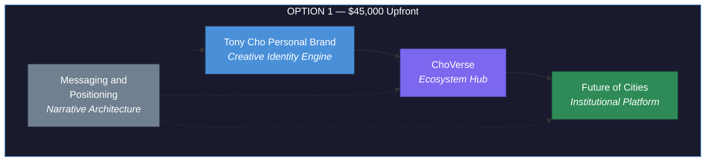

**Includes:**

- Tony Cho Personal Brand Platform
- ChoVerse Ecosystem Hub
- Future of Cities platform
- Messaging and positioning systems

**Investment:**
$45,000 upfront (covers foundation build)

**Outcome:**
Clear identity, product delivery platform, and ecosystem cohesion. Does not include capital activation infrastructure or raise alignment.

---

### OPTION 2. Full Ecosystem and Capital Activation (Recommended)

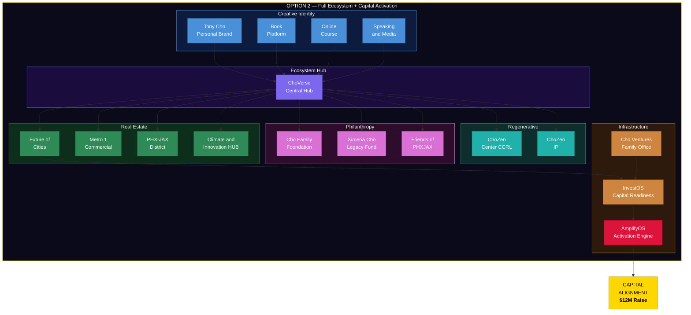

**All three payment structures include:**

- Everything in Option 1
- Web portals for all 15 ecosystem entities (see Section 4.6)
- InvestOS infrastructure deployment
- AmplifyOS capital activation layer
- Strategic systems supporting the $12M raise objective
- Investor-facing ecosystem alignment
- Ongoing advisory during fundraising activation

**Payment Structures:**

| | **2A: All Cash** | **2B: Blend** | **2C: Equity-Aligned** |
|---|---|---|---|
| **Upfront (10%)** | $65,000 | $50,000 | $40,000 |
| **Milestone 1** | $292,500 | $225,000 | $180,000 |
| **Milestone 2** | $292,500 | $225,000 | $180,000 |
| **Total Cash** | **$650,000** | **$500,000** | **$400,000** |
| **Equity** | $0 | $200,000 | $400,000 |
| **Total** | **$650,000** | **$700,000** | **$800,000** |
| **At-Cost Future Work** | No | Yes | Yes |
| **Ongoing Advisory** | No | Yes | Yes |

All milestone triggers are the same: Milestone 1 at $1.2M raised (10% of $12M), Milestone 2 at $3.6M raised (30% of $12M).

#### Three Payment Paths

```mermaid
flowchart LR
    subgraph PATH2A["2A: ALL CASH"]
        direction TB
        A1["$65K<br/>Upfront"] --> A2["$292.5K<br/>Milestone 1"]
        A2 --> A3["$292.5K<br/>Milestone 2"]
        A3 --> A4["Total<br/><b>$650K Cash</b><br/>No Equity"]
    end

    subgraph PATH2B["2B: BLEND"]
        direction TB
        B1["$50K<br/>Upfront"] --> B2["$225K<br/>Milestone 1"]
        B2 --> B3["$225K<br/>Milestone 2"]
        B3 --> B4["Total<br/><b>$500K Cash</b><br/>+ $200K Equity"]
    end

    subgraph PATH2C["2C: EQUITY-ALIGNED"]
        direction TB
        C1["$40K<br/>Upfront"] --> C2["$180K<br/>Milestone 1"]
        C2 --> C3["$180K<br/>Milestone 2"]
        C3 --> C4["Total<br/><b>$400K Cash</b><br/>+ $400K Equity"]
    end

    style A1 fill:#CD853F,stroke:#8B5E2B,color:#fff
    style A2 fill:#CD853F,stroke:#8B5E2B,color:#fff
    style A3 fill:#CD853F,stroke:#8B5E2B,color:#fff
    style A4 fill:#CD853F,stroke:#8B5E2B,color:#fff
    style B1 fill:#7B68EE,stroke:#5A4BC7,color:#fff
    style B2 fill:#7B68EE,stroke:#5A4BC7,color:#fff
    style B3 fill:#7B68EE,stroke:#5A4BC7,color:#fff
    style B4 fill:#7B68EE,stroke:#5A4BC7,color:#fff
    style C1 fill:#2E8B57,stroke:#1D5E3A,color:#fff
    style C2 fill:#2E8B57,stroke:#1D5E3A,color:#fff
    style C3 fill:#2E8B57,stroke:#1D5E3A,color:#fff
    style C4 fill:#2E8B57,stroke:#1D5E3A,color:#fff
    style PATH2A fill:#2e1a0d,stroke:#CD853F,color:#fff
    style PATH2B fill:#1a0d3e,stroke:#7B68EE,color:#fff
    style PATH2C fill:#0d2e1a,stroke:#2E8B57,color:#fff
```

#### Equity Terms (Options 2B and 2C)

| Term | Detail |
|------|--------|
| **Valuation Basis** | Pre-money NAV of $35.3M |
| **Option 2B Equity** | $200,000 = 0.57% ownership |
| **Option 2C Equity** | $400,000 = 1.13% ownership |
| **Vesting** | Fully vests when full raise closes |
| **Liquidity** | Can be sold at any time after raise closes |
| **Post-Money Value (2B)** | ~$270K (0.57% of $47.3M) |
| **Post-Money Value (2C)** | ~$534K (1.13% of $47.3M) |

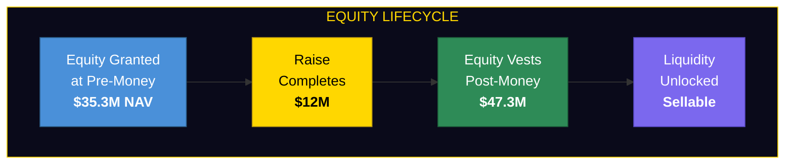

#### Ongoing Partnership Commitment (Options 2B and 2C)

Equity partners receive:

- **At-cost future development** — all future platforms, features, and builds beyond this engagement are quoted at cost. No margin. Light Brands is invested in the outcome, not the invoice.
- **Ongoing advisory** — continued strategic advisory on ecosystem development, capital positioning, and growth infrastructure.
- **Long-term alignment** — Light Brands remains committed to the ecosystem's success because we own a piece of it.

#### Comparison Summary

| Dimension | **2A: All Cash** | **2B: Blend** | **2C: Equity-Aligned** |
|-----------|---|---|---|
| **Cash Outlay** | $650,000 | $500,000 | $400,000 |
| **Equity Commitment** | None | $200K (0.57%) | $400K (1.13%) |
| **% of Raise (Cash)** | 5.42% | 4.17% | 3.33% |
| **Upfront to Start** | $65,000 | $50,000 | $40,000 |
| **Future Work Pricing** | Standard rates | At cost | At cost |
| **Ongoing Advisory** | Engagement only | Included | Included |
| **Long-Term Partnership** | No | Yes | Yes |
| **Recommended** | | | Yes |

**Outcome:**
Creative expression, ecosystem engagement, and capital readiness operate as one unified system. Options 2B and 2C include equity partnership, ensuring Light Brands remains invested in long-term ecosystem success with at-cost future development.

---

## 8. Strategic Recommendation

Visibility without infrastructure creates fragmentation.
Infrastructure without amplification creates stagnation.

The full ecosystem approach integrates:

- creative identity
- community and activity
- institutional credibility
- capital activation

from the beginning.

---

## 9. Capital Alignment Context

### Raise Overview

| Parameter | Detail |
|-----------|--------|
| **Raise Objective** | $12M |
| **Entity** | FoC QOF LLC (Delaware) |
| **Pre-Money Valuation (NAV)** | $35.3M |
| **Post-Money Valuation** | $47.3M ($35.3M + $12M) |
| **Option 2A (All Cash)** | $650,000 cash, no equity |
| **Option 2B (Blend)** | $500,000 cash + $200,000 equity (0.57%) |
| **Option 2C (Equity-Aligned)** | $400,000 cash + $400,000 equity (1.13%) |
| **Milestone Triggers** | 10% raised ($1.2M) and 30% raised ($3.6M) |
| **Equity Vesting** | Fully vests at completed raise (2B, 2C) |
| **Equity Liquidity** | Can be sold at any time after raise closes |
| **Ecosystem Layers** | 5 (Personal Brand, ChoVerse, Future of Cities, InvestOS, AmplifyOS) |
| **Web Portals Delivered** | 15 platforms across the entire ecosystem |
| **Future Work** | At-cost basis for equity partners (2B, 2C) |
| **Recommended Path** | Option 2C: Equity-Aligned |

### Pre-Money vs Post-Money Valuation

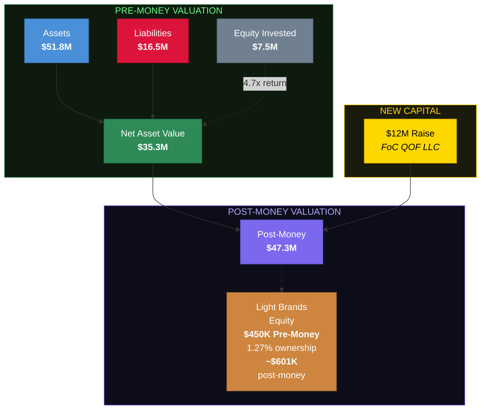

| Metric | Value |
|--------|-------|
| **Assets** | $51.8M |
| **Liabilities** | $16.5M |
| **Net Asset Value (Pre-Money)** | $35.3M |
| **Equity Invested to Date** | $7.5M |
| **NAV / Invested Equity** | 4.7x |
| **New Capital (Raise)** | $12.0M |
| **Post-Money Valuation** | $47.3M |
| **Option 2B Equity at Pre-Money** | $200K = 0.57% ownership |
| **That 0.57% at Post-Money** | ~$270K in value |
| **Option 2C Equity at Pre-Money** | $400K = 1.13% ownership |
| **That 1.13% at Post-Money** | ~$534K in value |

### Economics in Context

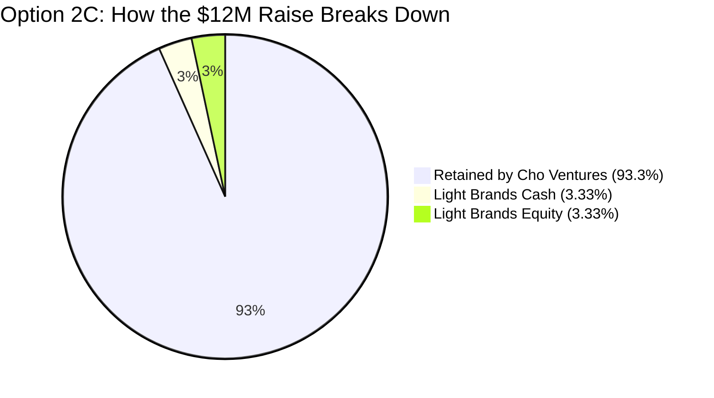

| | **2A: All Cash** | **2B: Blend** | **2C: Equity-Aligned** |
|---|---|---|---|
| **Upfront** | $65,000 (0.54%) | $50,000 (0.42%) | $40,000 (0.33%) |
| **Total Cash** | $650,000 (5.42%) | $500,000 (4.17%) | $400,000 (3.33%) |
| **Equity** | $0 (0%) | $200,000 (1.67%) | $400,000 (3.33%) |
| **Total Alignment** | $650,000 (5.42%) | $700,000 (5.83%) | $800,000 (6.67%) |

**What the upfront investment delivers (all options):**

- 15 web portals across the entire Cho Ventures ecosystem
- 5-layer strategic infrastructure (Personal Brand, ChoVerse, FoC, InvestOS, AmplifyOS)
- Capital activation systems aligned to the $12M raise
- Investor-facing ecosystem architecture
- 90% of cash fees only paid if the raise succeeds
- Typical engagements of this nature begin at $250,000+ for a single platform

**What equity unlocks (Options 2B and 2C):**

- Ownership at pre-money NAV of $35.3M that appreciates at post-money ($47.3M)
- Vests only when the full raise closes
- Ensures Light Brands remains a long-term committed partner
- Unlocks at-cost pricing on all future development
- Ongoing advisory and ecosystem development support

### How the Ecosystem Supports the Raise

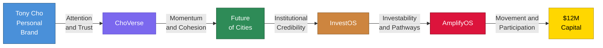

| Layer | Capital Function |
|-------|-----------------|
| Tony Cho Personal Brand | Drives attention, trust, and audience connection |
| ChoVerse | Creates visible momentum and ecosystem cohesion |
| Future of Cities | Provides institutional credibility for investors |
| InvestOS | Makes the ecosystem investable with structured pathways |
| AmplifyOS | Converts infrastructure into movement and capital participation |

---

## 10. Implementation Timeline

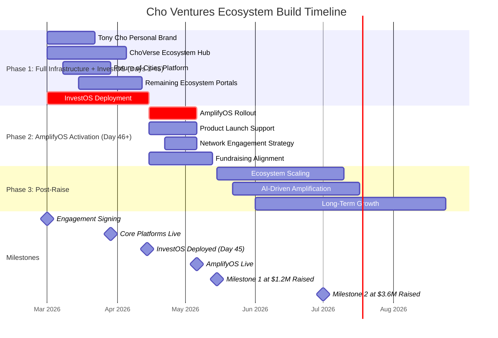

Light Brands operates at speed. This is not an 8-month engagement. InvestOS is deployed in 45 days. AmplifyOS fires immediately after. The entire ecosystem goes from zero to capital-ready in under 10 weeks.

### Phase 1. Full Infrastructure + InvestOS (Days 1-45)

Everything runs in parallel from day one. No sequential handoffs. No waiting for one platform to finish before another starts.

- Tony Cho personal brand platform (weeks 1-3)
- ChoVerse ecosystem hub (weeks 1-5)
- Future of Cities platform (weeks 2-4)
- Remaining ecosystem portals (weeks 3-6)
- InvestOS capital readiness infrastructure (days 1-45, concurrent with everything)

**Day 45: InvestOS is live.** The ecosystem is investable. Capital pathways are open.

### Phase 2. AmplifyOS Activation (Day 46+)

InvestOS goes live, AmplifyOS fires the next day. No gap. No pause. Infrastructure becomes movement immediately.

- AmplifyOS rollout (day 46)
- Product launch support
- Network engagement strategy
- Fundraising alignment and capital activation

### Phase 3. Post-Raise Expansion (Month 3+)

- Ecosystem scaling
- Advanced AI-driven amplification
- Long-term growth infrastructure

---

## 11. Closing Perspective

You already possess the vision, creativity, and influence required to build something meaningful at scale. You have the track record. You have the relationships. You have the authenticity that cannot be manufactured.

What you do not yet have is the infrastructure that makes all of it visible as one thing.

The category of Regenerative Development is wide open. Nobody owns it. The person who builds the ecosystem first — the one who connects community, culture, climate, capital, and real estate into a single intelligent platform — will define what this space looks like for the next decade.

That person should be you.

The decision is not whether to build. The decision is whether to build it now — while the category is still unclaimed — or to wait and watch someone with less authenticity, less track record, and less vision claim it because they moved faster.

Build separate pieces over time, or
Build the full ecosystem once and own the category.

Light Brands is prepared to act as a long-term strategic partner in building the infrastructure that positions Tony Cho as the definitive leader in regenerative development. Not just a participant. The leader.

---

## Ecosystem Layer Breakdown

```mermaid
flowchart TD
    subgraph L1["LAYER 1: Tony Cho Personal Brand"]
        L1R["Creative<br/>Identity Engine"]
        L1O["Attention<br/>Identity<br/>Community Connection"]
    end

    subgraph L2["LAYER 2: ChoVerse"]
        L2R["Ecosystem<br/>Hub"]
        L2O["Ecosystem Cohesion<br/>Engagement<br/>Visibility"]
    end

    subgraph L3["LAYER 3: Future of Cities"]
        L3R["Institutional<br/>Platform"]
        L3O["Institutional Trust<br/>Strategic Positioning"]
    end

    subgraph L4["LAYER 4: InvestOS"]
        L4R["Infrastructure<br/>Layer"]
        L4O["Investability<br/>Institutional Readiness"]
    end

    subgraph L5["LAYER 5: AmplifyOS"]
        L5R["Activation<br/>Engine"]
        L5O["Movement<br/>Participation<br/>Capital Engagement"]
    end

    OUTCOME["CAPITAL<br/>ALIGNMENT<br/><b>$12M Raise<br/>Readiness</b>"]

    L1R --> L1O
    L1O --> L2R
    L2R --> L2O
    L2O --> L3R
    L3R --> L3O
    L3O --> L4R
    L4R --> L4O
    L4O --> L5R
    L5R --> L5O
    L5O --> OUTCOME

    style L1 fill:#0d1b3e,stroke:#4A90D9,color:#fff
    style L2 fill:#1a0d3e,stroke:#7B68EE,color:#fff
    style L3 fill:#0d2e1a,stroke:#2E8B57,color:#fff
    style L4 fill:#2e1a0d,stroke:#CD853F,color:#fff
    style L5 fill:#2e0d0d,stroke:#DC143C,color:#fff
    style L1R fill:#4A90D9,stroke:#2C5F8A,color:#fff
    style L1O fill:#6BA3D9,stroke:#4A90D9,color:#fff
    style L2R fill:#7B68EE,stroke:#5A4BC7,color:#fff
    style L2O fill:#9B8AEE,stroke:#7B68EE,color:#fff
    style L3R fill:#2E8B57,stroke:#1D5E3A,color:#fff
    style L3O fill:#4EA877,stroke:#2E8B57,color:#fff
    style L4R fill:#CD853F,stroke:#8B5E2B,color:#fff
    style L4O fill:#DDA05F,stroke:#CD853F,color:#fff
    style L5R fill:#DC143C,stroke:#8B0A1E,color:#fff
    style L5O fill:#EC445C,stroke:#DC143C,color:#fff
    style OUTCOME fill:#FFD700,stroke:#B8960F,color:#000
```

### LAYER 1: Tony Cho Personal Brand
**Role:** Creative Identity Engine

- Creative expression and storytelling
- Book launch, course, and personal offerings
- Artistic influence and cultural narrative
- Entry point for audience connection

**Output:** Attention, Identity, Community connection

### LAYER 2: ChoVerse
**Role:** Ecosystem Hub

- News, activity, offerings, art, and community
- Central destination for all ongoing initiatives
- Living platform showing momentum in real time

**Output:** Ecosystem cohesion, Community engagement, Ongoing visibility

### LAYER 3: Future of Cities
**Role:** Institutional Platform

- Project-focused narrative
- Professional credibility
- Partnership and institutional alignment
- Navigation back to Meet Tony

**Output:** Institutional trust, Strategic positioning

### LAYER 4: InvestOS
**Role:** Infrastructure Layer

- Capital alignment architecture
- Investor-facing systems
- Participation pathways
- Narrative-to-financial alignment

**Output:** Investability, Institutional readiness

### LAYER 5: AmplifyOS
**Role:** Activation Engine

- Amplifies ChoVerse and ecosystem activity
- Network activation campaigns
- Product launches and fundraising momentum
- Strategic visibility designed for conversion

**Output:** Movement, Participation, Capital engagement

### FINAL OUTCOME: Capital Alignment and Raise Readiness

- Ecosystem prepared for institutional participation
- Audience, narrative, and infrastructure operating together
- Momentum directed toward a $12M raise objective

---

## Presentation Deck Structure

### Slide 1: Title
**Building the Infrastructure Beneath the Vision**
Tony Cho Ecosystem Proposal

### Slide 2: What We Heard
**The Vision We're Aligning Around**
- Creative visionary with cultural influence
- Passion for art, community, and city-building
- Multiple initiatives already in motion
- Desire to create clear pathways for participation and capital

### Slide 3: The Vision
**You've Already Done What Nobody Else Can Claim.**
- Wynwood transformation before anyone saw it coming
- Regenerative placemaking, climate innovation, arts, community, philanthropy
- No one else operates across all these dimensions with this authenticity
- The category of Regenerative Development is wide open — nobody owns it
- The person who builds the ecosystem first defines the space for the next decade

### Slide 3.5: Category Ownership
**Tony Cho IS Regenerative Development.**
- Compare: WeWork (collapsed), Related (traditional), Sidewalk Labs (corporate)
- Tony Cho has the substance, the track record, the authenticity
- On the other side of this engagement: the definitive voice in the category
- Every conference keynote. Every publication reference. Every investor association.
- The category is unclaimed. Claim it now.

### Slide 4: The Gap
**The Vision Is Extraordinary. The Infrastructure Is Holding It Back.**
- 15+ entities running on disconnected WordPress, Squarespace, Wix
- Tools designed for single-business operators, not multi-entity ecosystems
- Nothing talks to anything. Zero intelligence. Zero cohesion.
- You've been committed to doing this on a budget — and it shows
- The cost of staying on this path is greater than the cost of fixing it

### Slide 4.5: The Solution
**From Web 2.0 Patchwork to AI-Native Ecosystem**
Current: Disconnected tools, manual everything, zero intelligence
Proposed: 100% AI-native infrastructure — every tool informed, every platform connected
This is how Tony Cho owns the category

### Slide 5: The Ecosystem Map
**ChoVerse Ecosystem Architecture**
Tony Personal Brand > ChoVerse > Future of Cities > InvestOS > AmplifyOS > $12M Capital Alignment

### Slide 6: Tony Cho Personal Brand
**Creative Identity Platform**
- Artistic and cultural expression
- Legacy and creative influence (Wynwood reference)
- Book launch and course platform
- Personal narrative and storytelling
- Entry point for audience connection

### Slide 7: ChoVerse
**The Living Ecosystem Hub**
- News, activity, offerings, art, community
- Central destination for everything happening
- Ongoing momentum visible in one place
- The platform we amplify continuously

### Slide 8: Future of Cities
**Institutional Platform**
- Professional, project-focused positioning
- Institutional credibility
- Strategic partnerships and initiatives
- Navigation back to Meet Tony

### Slide 9: InvestOS
**Infrastructure Layer**
- Capital alignment architecture
- Investor-facing systems
- Participation pathways
- Narrative and financial alignment

### Slide 10: AmplifyOS
**Activation Engine**
- Amplifies ChoVerse activity
- Supports launches and offerings
- Activates network engagement
- Converts momentum into participation and investment

### Slide 11: Why This Order Matters
**Two Paths Forward**
LEFT: Brand > Attention > Need Infrastructure > Rebuild
RIGHT: Brand + Infrastructure + Amplification > Raise > Scale

### Slide 12: Value Anchor
**Institutional Engagement Level**
$450,000
Total ecosystem architecture and capital activation value.
15 web portals. 5 infrastructure layers. Full ecosystem build.

### Slide 12.5: The Economics
**Three Payment Structures**
- 2A: $650K all cash (5.42% of raise), no equity
- 2B: $500K cash + $200K equity (5.83% of raise), at-cost future work
- 2C: $400K cash + $400K equity (6.67% of raise), at-cost future work
- All structures: 10% upfront, 90% deferred to raise milestones
- Equity priced at pre-money NAV ($35.3M), vests at full raise

### Slide 13: Option 1
**Brand and Ecosystem Foundation**
- Personal Brand Platform
- ChoVerse Hub
- Future of Cities platform
- Investment: $45K upfront
- Outcome: Clear identity and ecosystem cohesion

### Slide 14: Option 2 (Three Structures)
**Full Ecosystem and Capital Activation**
- Everything in Option 1 plus all 15 web portals, InvestOS, AmplifyOS
- 2A: $650K all cash ($65K upfront), no equity
- 2B: $500K cash + $200K equity ($50K upfront), at-cost future work
- 2C: $400K cash + $400K equity ($40K upfront), at-cost future work (Recommended)
- All: 90% deferred, milestones at 10% and 30% of raise
- Equity at pre-money NAV ($35.3M), vests at full raise

### Slide 15: Moment of Truth Close
Build separate pieces over time
OR
Build the ecosystem once.

### Slide 16: Execution Timeline
- Phase 1 (Days 1-45): Full infrastructure + InvestOS deployed in 45 days, all 15 portals live
- Phase 2 (Day 46+): AmplifyOS fires immediately after InvestOS — no gap, no pause
- Phase 3 (Month 3+): Raise momentum, ecosystem scaling
- Zero to capital-ready in under 10 weeks

### Slide 17: Next Steps
- Confirm direction
- Finalize agreement
- Kickoff alignment session
- Begin ecosystem build

---

## Speaker Notes

### Slide 3 (The Vision)
This is the most important slide in the deck. Slow down. This is where you lift him up.
"Let me tell you what we actually see when we look at what you've built."
Pause.
"You transformed Wynwood before anyone knew what it could become. You're building regenerative communities. Climate innovation hubs. Arts programming. Youth development. Philanthropy. Real estate that actually serves people."
"Nobody else is operating across all of these dimensions with this level of authenticity. Nobody. The work you've done is extraordinary."
Pause. Let that land. He needs to feel it.
"WeWork collapsed because they had brand without substance. Related builds mega-developments but has no regenerative story. Google tried smart cities from the top down and communities rejected it."
"You have something none of them have. The substance is real. The cultural impact is real. The community relationships are real."
Pause.

### Slide 3.5 (Category Ownership)
"Now here's what matters."
"Regenerative development is a category. Real estate, climate, community, culture, and capital are all converging into one space. And right now — nobody owns it."
Pause. This is the moment.
"The people who own categories don't get there by doing better work. They get there by building ecosystems that make their work impossible to ignore."
"On the other side of this engagement, Tony Cho is not a developer with interesting projects. Tony Cho IS regenerative development. The name people think of when they think of this space. The person every conference invites to keynote. Every publication references. Every investor associates with the category itself."
"The category is wide open. And you are the one who should own it."
Let that sit. Do not rush past this. Let him feel the vision before you show him the gap.

### Slide 4 (The Gap)
Now the shift. Direct but respectful — you've just told him he's the one. Now show him what's in the way.
"So why doesn't the world already see it this way? It's not the work. It's the infrastructure."
Pause.
"Right now, the Cho Ventures ecosystem is held together by digital duct tape. WordPress here. Squarespace there. Wix over here. A dozen SaaS subscriptions that don't talk to each other."
"These are tools built for someone running one business with one website. You have fifteen entities. A $35 million NAV. An institutional capital strategy. And the infrastructure holding it together was designed for someone selling products online."
Pause. Let that land.
"You've been committed to doing this on a budget. And it shows. That's not a criticism — it's a diagnosis. The vision is extraordinary. The infrastructure is the gap."
"Every month on this path is a month where the category stays unclaimed — and a month where someone with less substance but better infrastructure could step in front of you."

### Slide 4.5 (The Solution)
"Here's the thing that should excite you."
"We build 100% AI-native ecosystems. Every tool informed. Every platform connected. Every touchpoint intelligent. Not chatbots on websites. Real infrastructure that makes 15 entities operate as one unified, intelligent system."
"This is how Tony Cho goes from visionary with extraordinary projects to the person who owns the category."
Pause.
"And we do it in 45 days."

### Ecosystem Diagram Presentation

"This is the entire system in one view."
Pause.
"Your personal brand creates connection and creative energy."
"ChoVerse becomes the living universe where everything happening around you is visible."
"Future of Cities creates institutional credibility."
"InvestOS makes it investable."
"And AmplifyOS activates the whole ecosystem so momentum actually moves toward capital."
Then stop talking. Let them process.

### Slide 6 (Personal Brand)
"This isn't a typical personal brand site. It should feel like a creative expression of you."

### Slide 7 (ChoVerse)
"ChoVerse becomes the universe people enter to stay connected to everything you're building."

### Slide 8 (Future of Cities)
"This is intentionally separate in tone. Institutional clarity lives here."

### Slide 9 (InvestOS)
"InvestOS makes the ecosystem investable."

### Slide 10 (AmplifyOS)
"This is where momentum turns into movement."

### Slide 11 (Why This Order Matters)
"Neither path is wrong. One simply removes future friction."
Pause.

### Slide 12 (Value Anchor)
Pause after saying the number.
"15 web portals for every entity in the ecosystem. Full infrastructure. Capital activation. But we're giving you three ways to structure this because we want to find the path that works best for both sides."
Pause again.
"Every structure has 90% deferred. We only get paid when the raise moves forward."

### Slide 12.5 (The Economics)
"Let me put this in context."
"The all-cash option is $650K. That's 5.4% of the raise. No equity, no ongoing commitment beyond delivery."
"The blend is $500K cash plus $200K in equity. That's $50K upfront. And because we're equity partners, everything we build for you after this engagement is at cost."
"The equity-aligned option is $400K cash plus $400K in equity. $40K upfront. That's one-third of one percent of the raise to start the full ecosystem build."
Pause.
"On the equity-aligned path, our total cash is 3.3% of the raise. 90% of that only gets paid if the raise succeeds. The equity is priced at pre-money NAV of $35.3 million. It only vests when the raise closes."
"The economics here are heavily in your favor regardless of which path you choose."

### Slide 14 (Option 2)
"All three structures get you the same deliverables. All 15 portals. Full ecosystem. InvestOS. AmplifyOS. Capital alignment."
"The difference is how we're compensated and how deep the partnership goes."
"All cash at $650K is straightforward. You pay for the build, we deliver, engagement ends."
"The blend and equity-aligned options bring us in as long-term partners. We take equity at pre-money valuation, it vests when the raise closes. In exchange, everything we build for you beyond this engagement is at cost. No margin. Because we're invested in the outcome, not the invoice."
"We recommend the equity-aligned path because it creates the deepest alignment. $40K starts the build. We don't get paid unless the raise works. And we stay committed to the ecosystem long after this engagement."

### Slide 15 (Close)
Use the 90-second close. Bring it back to category ownership.
"You've built something real. The track record is undeniable. Wynwood. Future of Cities. The regenerative work. The cultural impact. Nobody else has this."
Pause.
"The category of regenerative development is wide open right now. The person who builds the ecosystem first — who makes all of this visible as one movement — owns the space for the next decade."
"That should be you. And we're prepared to make sure it is."
Pause.
"Which path feels most aligned with how you want to own this?"
Silence.

### Slide 17 (Final 3 minutes)
Reconfirm decision.
Future project.
"From our side, we see category leadership. Not just a good ecosystem — the ecosystem that defines what regenerative development looks like. We're clear this is the right path."

---

*Light Brands | Institutional Infrastructure and Capital Activation Partnership*
*Option 2A: $650K Cash | Option 2B: $500K Cash + $200K Equity | Option 2C: $400K Cash + $400K Equity | 10% Upfront, 90% Raise-Aligned | $12M Raise | 15 Platforms*
