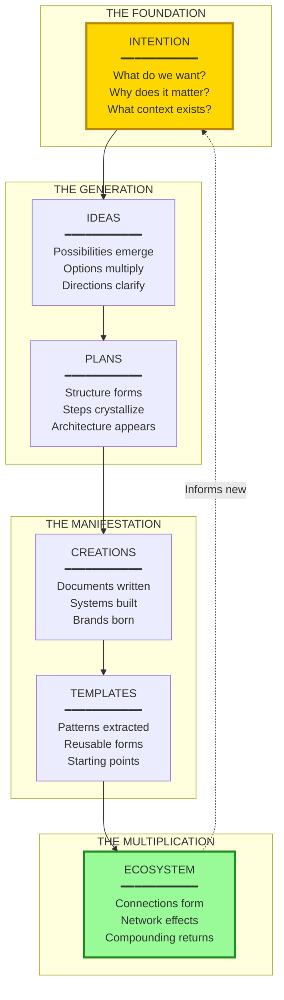
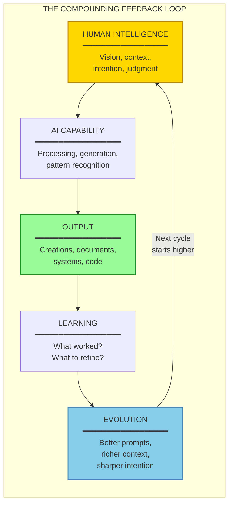

# The AI Leverage Moment

## An Overview of Exponential Compounding Through Intentional Intelligence

---

## Executive Summary

We are standing at the convergence of capability and intention. The tools exist. The intelligence is available. The question is no longer *if* but *how intentionally* we engage.

**The core insight:** Every intelligent interaction with AI compounds. Plans become creations. Creations become templates. Templates spawn new possibilities. Ideas generate ideas. The more intentional the engagement, the more exponential the return.

This is not linear productivity. This is leverage overflowing.

---

## The Leverage Moment

### Why Now Matters

```
┌─────────────────────────────────────────────────────────────────────────────┐
│                         THE CONVERGENCE POINT                                │
├─────────────────────────────────────────────────────────────────────────────┤
│                                                                              │
│                              NOW                                             │
│                               ▲                                              │
│                              /│\                                             │
│                             / │ \                                            │
│                            /  │  \                                           │
│                           /   │   \                                          │
│                          /    │    \                                         │
│            AI CAPABILITY      │      HUMAN INTENTION                         │
│                 ──────────────┼──────────────                                │
│                               │                                              │
│         Intelligence is       │       Understanding is                       │
│         available at scale    │       catching up                            │
│                               │                                              │
│         Models understand     │       Practitioners see                      │
│         context deeply        │       what's possible                        │
│                               │                                              │
│         Execution is          │       Vision is                              │
│         instantaneous         │       crystallizing                          │
│                               │                                              │
└─────────────────────────────────────────────────────────────────────────────┘
```

We are in the window where:
- **AI capability** has reached practical utility for complex work
- **Human understanding** of how to wield it is still developing
- **Early adopters** who learn to work *with* intelligence gain compounding advantages
- **The gap** between intentional users and casual users widens exponentially

### The Nature of This Leverage

Traditional leverage requires:
- Capital (money working for you)
- Labor (people working for you)
- Code (software working for you)

AI leverage adds a fourth:
- **Intelligence working for you**

But unlike the others, this leverage *learns*. It compounds not just outputs, but capabilities.

---

## The Compounding Mechanism

### How Intention Multiplies

```
┌─────────────────────────────────────────────────────────────────────────────┐
│                    THE EXPONENTIAL COMPOUNDING LOOP                          │
├─────────────────────────────────────────────────────────────────────────────┤
│                                                                              │
│     ┌──────────────────┐                                                    │
│     │    INTENTION     │                                                    │
│     │   ────────────   │                                                    │
│     │   Clear vision   │                                                    │
│     │   Specific ask   │                                                    │
│     │   Context given  │                                                    │
│     └────────┬─────────┘                                                    │
│              │                                                               │
│              ▼                                                               │
│     ┌──────────────────┐     ┌──────────────────┐                           │
│     │   INTERACTION    │────►│    CREATION      │                           │
│     │   ────────────   │     │   ────────────   │                           │
│     │   AI processes   │     │   Plan, system,  │                           │
│     │   understanding  │     │   document, code │                           │
│     │   and generates  │     │   comes to life  │                           │
│     └──────────────────┘     └────────┬─────────┘                           │
│                                       │                                      │
│                                       ▼                                      │
│                              ┌──────────────────┐                            │
│                              │    TEMPLATE      │                            │
│                              │   ────────────   │                            │
│                              │   Creation       │                            │
│                              │   becomes        │                            │
│                              │   reusable       │                            │
│                              │   pattern        │                            │
│                              └────────┬─────────┘                            │
│                                       │                                      │
│              ┌────────────────────────┼────────────────────────┐            │
│              │                        │                        │            │
│              ▼                        ▼                        ▼            │
│     ┌──────────────┐         ┌──────────────┐         ┌──────────────┐     │
│     │  SPAWN 1     │         │  SPAWN 2     │         │  SPAWN N     │     │
│     │  ────────    │         │  ────────    │         │  ────────    │     │
│     │  New idea    │         │  Variation   │         │  Evolution   │     │
│     │  emerges     │         │  applies     │         │  compounds   │     │
│     └──────┬───────┘         └──────┬───────┘         └──────┬───────┘     │
│            │                        │                        │              │
│            └────────────────────────┼────────────────────────┘              │
│                                     │                                        │
│                                     ▼                                        │
│                            ┌──────────────────┐                              │
│                            │   NEW INTENTION  │ ◄── Cycle repeats            │
│                            │   ────────────── │     at higher level          │
│                            │   Informed by    │                              │
│                            │   what was       │                              │
│                            │   created        │                              │
│                            └──────────────────┘                              │
│                                                                              │
└─────────────────────────────────────────────────────────────────────────────┘
```

### The Math of Compounding

Linear work:
```
1 plan = 1 outcome
10 plans = 10 outcomes
100 plans = 100 outcomes
```

Compounding work with AI leverage:
```
1 plan = 1 creation + 1 template
Template + variations = 3 new creations
3 creations inform = 6 new ideas
6 ideas spawn = 15 new possibilities
...
Each cycle multiplies, not adds
```

---

## The Overflow Principle

### Leverage as Water

```
┌─────────────────────────────────────────────────────────────────────────────┐
│                         LEVERAGE OVERFLOW                                    │
├─────────────────────────────────────────────────────────────────────────────┤
│                                                                              │
│                          ════════════════                                    │
│                         ║   INTENTION   ║                                    │
│                         ║   (The Dam)   ║                                    │
│                          ════════════════                                    │
│                                │                                             │
│                                │ ◄── Focused direction                       │
│                                │     channels the flow                       │
│                                ▼                                             │
│         ░░░░░░░░░░░░░░░░░░░░░░░░░░░░░░░░░░░░░░░░░░░░░░░░░░░                 │
│       ░░░░░░░░░░░░░░░░░░░░░░░░░░░░░░░░░░░░░░░░░░░░░░░░░░░░░░░               │
│     ░░░░░░░░░░░░░░░░░░░░░░░░░░░░░░░░░░░░░░░░░░░░░░░░░░░░░░░░░░░             │
│   ░░░░░░░░░░░░░░░░░░░ AI CAPABILITY ░░░░░░░░░░░░░░░░░░░░░░░░░░░░░           │
│ ░░░░░░░░░░░░░░░░░░░░░ (The Water)  ░░░░░░░░░░░░░░░░░░░░░░░░░░░░░░░         │
│░░░░░░░░░░░░░░░░░░░░░░░░░░░░░░░░░░░░░░░░░░░░░░░░░░░░░░░░░░░░░░░░░░░░        │
│                                                                              │
│         The water (AI capability) is infinite and rising.                    │
│         The dam (intention) directs where it flows.                          │
│         The channels (systems) determine what gets built.                    │
│                                                                              │
│         Without intention: water everywhere, nothing irrigated.              │
│         With intention: fertile valleys, thriving ecosystems.                │
│                                                                              │
└─────────────────────────────────────────────────────────────────────────────┘
```

### What Overflow Looks Like in Practice

| Unfocused Engagement | Intentional Engagement |
|---------------------|------------------------|
| Ask random questions | Build systematic knowledge |
| Get one-off answers | Create reusable frameworks |
| Start fresh each time | Compound on previous work |
| Water spills everywhere | Water irrigates precisely |
| Busy but not building | Every action constructs |

---

## The Compounding Stack

### How Our Work Multiplies

```
┌─────────────────────────────────────────────────────────────────────────────┐
│                        THE COMPOUNDING STACK                                 │
├─────────────────────────────────────────────────────────────────────────────┤
│                                                                              │
│  LAYER 6: ECOSYSTEM                                                          │
│  ══════════════════════════════════════════════════════════════════════════ │
│  Brands influence brands. Systems connect. Network effects emerge.           │
│  One creation feeds another. The whole becomes greater than parts.           │
│                                                                              │
│  LAYER 5: TEMPLATES                                                          │
│  ══════════════════════════════════════════════════════════════════════════ │
│  Every plan becomes a pattern. Strategies become starting points.            │
│  What worked once becomes the foundation for what works next.                │
│                                                                              │
│  LAYER 4: CREATIONS                                                          │
│  ══════════════════════════════════════════════════════════════════════════ │
│  Plans materialize into systems, documents, code, brands.                    │
│  Abstract becomes concrete. Ideas become assets.                             │
│                                                                              │
│  LAYER 3: PLANS                                                              │
│  ══════════════════════════════════════════════════════════════════════════ │
│  Vision crystallizes into actionable structure.                              │
│  The AI helps architect what human intention directs.                        │
│                                                                              │
│  LAYER 2: IDEAS                                                              │
│  ══════════════════════════════════════════════════════════════════════════ │
│  Possibilities emerge from conversation. Sparks ignite.                      │
│  One thought generates three. Those three generate nine.                     │
│                                                                              │
│  LAYER 1: INTENTION                                                          │
│  ══════════════════════════════════════════════════════════════════════════ │
│  Clear direction. Specific context. Meaningful purpose.                      │
│  This is the seed from which everything grows.                               │
│                                                                              │
└─────────────────────────────────────────────────────────────────────────────┘
```

### The Flow Between Layers



---

## Ideas Spawning Ideas

### The Generative Cascade

Every idea engaged with intention generates more:

```
┌─────────────────────────────────────────────────────────────────────────────┐
│                         THE GENERATIVE CASCADE                               │
├─────────────────────────────────────────────────────────────────────────────┤
│                                                                              │
│                           ┌─────────────────┐                                │
│                           │   SEED IDEA     │                                │
│                           │   ───────────   │                                │
│                           │   "What if we   │                                │
│                           │   created a     │                                │
│                           │   brand factory?"│                               │
│                           └────────┬────────┘                                │
│                                    │                                         │
│               ┌────────────────────┼────────────────────┐                   │
│               │                    │                    │                   │
│               ▼                    ▼                    ▼                   │
│        ┌────────────┐       ┌────────────┐       ┌────────────┐            │
│        │ SPAWN 1    │       │ SPAWN 2    │       │ SPAWN 3    │            │
│        │ ────────── │       │ ────────── │       │ ────────── │            │
│        │ Division   │       │ AI Agents  │       │ Portfolio  │            │
│        │ Structure  │       │ System     │       │ Strategy   │            │
│        └─────┬──────┘       └─────┬──────┘       └─────┬──────┘            │
│              │                    │                    │                    │
│      ┌───────┴───────┐    ┌───────┴───────┐    ┌───────┴───────┐          │
│      │               │    │               │    │               │          │
│      ▼               ▼    ▼               ▼    ▼               ▼          │
│  ┌────────┐     ┌────────┐┌────────┐ ┌────────┐┌────────┐ ┌────────┐     │
│  │Consult │     │  Dev   ││  Soul  │ │  Story ││Internal│ │Partner │     │
│  │Division│     │Division││Extrctr │ │ Forger ││ Brands │ │ Brands │     │
│  └────┬───┘     └────┬───┘└────┬───┘ └────┬───┘└────┬───┘ └────┬───┘     │
│       │              │         │          │         │          │          │
│       ▼              ▼         ▼          ▼         ▼          ▼          │
│   [Dashboard]   [Component] [Interview] [Messaging] [Nothing] [Cho       │
│   [Handoffs]    [Library]   [Process]   [Framework] Artfcl]   Ventures]  │
│   [Pricing]     [QA Flow]   [Templates] [Voice]     [Unified] [Earth     │
│       │              │         │          │         Sanctry]   Weavers]   │
│       │              │         │          │            │          │       │
│       └──────────────┴─────────┴──────────┴────────────┴──────────┘       │
│                                    │                                       │
│                                    ▼                                       │
│                        ┌───────────────────────┐                          │
│                        │   ECOSYSTEM EMERGES   │                          │
│                        │   ─────────────────── │                          │
│                        │   Hundreds of assets  │                          │
│                        │   Dozens of systems   │                          │
│                        │   Multiple brands     │                          │
│                        │   All from one seed   │                          │
│                        └───────────────────────┘                          │
│                                                                              │
└─────────────────────────────────────────────────────────────────────────────┘
```

### What Makes Ideas Spawn

| Factor | Effect on Generation |
|--------|---------------------|
| **Clarity of intention** | Sharper focus = more relevant offspring |
| **Context provided** | Richer background = deeper connections |
| **Openness to emergence** | Flexibility = unexpected breakthroughs |
| **Building on previous** | Continuity = compounding intelligence |
| **Documentation** | Captured thinking = retrievable foundation |

---

## Plans Become Templates

### The Template Lifecycle

```
┌─────────────────────────────────────────────────────────────────────────────┐
│                       PLAN → CREATION → TEMPLATE                             │
├─────────────────────────────────────────────────────────────────────────────┤
│                                                                              │
│  PHASE 1: PLAN                                                               │
│  ──────────────────────────────────────────────────────────────────────     │
│  "We need a strategy document for Cho Ventures"                              │
│                                                                              │
│  → Intention set                                                             │
│  → Context provided (deck, structure, goals)                                 │
│  → AI engages with understanding                                             │
│                                                                              │
│  PHASE 2: CREATION                                                           │
│  ──────────────────────────────────────────────────────────────────────     │
│  strategy-plan.md             manifests                                          │
│                                                                              │
│  → Comprehensive document created                                            │
│  → Specific to the context                                                   │
│  → Immediately useful                                                        │
│                                                                              │
│  PHASE 3: TEMPLATE                                                           │
│  ──────────────────────────────────────────────────────────────────────     │
│  Pattern extracted for future use                                            │
│                                                                              │
│  → Structure becomes reusable                                                │
│  → "Investment strategy documents follow this form"                          │
│  → Next similar task starts at 80%, not 0%                                   │
│                                                                              │
│  PHASE 4: MULTIPLICATION                                                     │
│  ──────────────────────────────────────────────────────────────────────     │
│  Template spawns variations                                                  │
│                                                                              │
│  → Earth Weavers needs strategy → template adapts                            │
│  → New investor opportunity → template evolves                               │
│  → Client needs similar → template customizes                                │
│                                                                              │
│  ═══════════════════════════════════════════════════════════════════════    │
│                                                                              │
│  LINEAR APPROACH:    Plan 1 → Creation 1                                     │
│                      Plan 2 → Creation 2 (start from scratch)                │
│                      Plan 3 → Creation 3 (start from scratch)                │
│                                                                              │
│  COMPOUNDING APPROACH: Plan 1 → Creation 1 → Template 1                      │
│                        Template 1 → Creation 2 (20% effort)                  │
│                        Template 1 evolved → Creation 3 (15% effort)          │
│                        ...                                                   │
│                                                                              │
└─────────────────────────────────────────────────────────────────────────────┘
```

---

## The Intelligence Amplifier

### How Intentional Interaction Compounds

The more intelligent our interaction becomes, the more AI can leverage that intelligence:

```
┌─────────────────────────────────────────────────────────────────────────────┐
│                     THE INTELLIGENCE AMPLIFIER                               │
├─────────────────────────────────────────────────────────────────────────────┤
│                                                                              │
│   YOUR INTELLIGENCE        ×        AI CAPABILITY        =        OUTPUT     │
│   ──────────────────              ──────────────────            ──────────  │
│                                                                              │
│   Level 1: Basic                                                             │
│   "Write me something"     ×     Standard response      =     Generic output │
│                                                                              │
│   Level 2: Contextual                                                        │
│   "Here's the context..."  ×     Informed processing    =     Relevant output│
│                                                                              │
│   Level 3: Systematic                                                        │
│   "Here's the ecosystem,   ×     Deep understanding     =     Strategic     │
│    the patterns, the                                          output        │
│    previous work..."                                                         │
│                                                                              │
│   Level 4: Compounding                                                       │
│   "Build on everything     ×     Full context +         =     Exponential   │
│    we've created, use             accumulated                  output       │
│    the templates,                 intelligence                              │
│    evolve the patterns..."                                                   │
│                                                                              │
│   ═══════════════════════════════════════════════════════════════════════   │
│                                                                              │
│   The multiplier grows as you provide:                                       │
│   • More context                                                             │
│   • Clearer intention                                                        │
│   • Accumulated materials                                                    │
│   • Systematic thinking                                                      │
│   • Feedback loops                                                           │
│                                                                              │
│   AI doesn't just respond—it amplifies whatever intelligence you bring.     │
│                                                                              │
└─────────────────────────────────────────────────────────────────────────────┘
```

### The Feedback Loop



---

## What We're Building

### The Light Brands Example

This very ecosystem demonstrates the compounding principle:

| Initial Seed | What It Became | What It Spawned |
|-------------|----------------|-----------------|
| "Brand creation consultancy" | Light Brands structure | Two-division model |
| Two-division model | Master plan document | Handoff protocols, service tiers |
| Service tiers | Pricing architecture | Client dashboard concept |
| AI agent concept | Light Brand Agency | 7 specialized agents |
| One brand (Nothing Artificial) | Portfolio strategy | 7+ brands in ecosystem |
| One strategy document | Template pattern | Reusable strategic frameworks |

Each creation becomes foundation for the next. Nothing is wasted. Everything compounds.

### Current Compounding Assets

```
┌─────────────────────────────────────────────────────────────────────────────┐
│                     ACCUMULATED LEVERAGE                                     │
├─────────────────────────────────────────────────────────────────────────────┤
│                                                                              │
│  STRATEGIC DOCUMENTS                                                         │
│  ├── Master plans (multiple brands)                                         │
│  ├── Strategy frameworks                                                     │
│  ├── Ecosystem maps                                                          │
│  └── Service architectures                                                   │
│                                                                              │
│  OPERATIONAL SYSTEMS                                                         │
│  ├── Handoff protocols                                                       │
│  ├── Work unit specifications                                                │
│  ├── QA frameworks                                                           │
│  └── Pricing tiers                                                           │
│                                                                              │
│  BRAND ASSETS                                                                │
│  ├── Visual identity systems                                                 │
│  ├── Voice and tone guides                                                   │
│  ├── Messaging frameworks                                                    │
│  └── Story templates                                                         │
│                                                                              │
│  TECHNICAL COMPONENTS                                                        │
│  ├── React applications                                                      │
│  ├── Design token systems                                                    │
│  ├── Component libraries                                                     │
│  └── API architectures                                                       │
│                                                                              │
│  AI SYSTEMS                                                                  │
│  ├── Agent specifications                                                    │
│  ├── Prompt patterns                                                         │
│  ├── Context frameworks                                                      │
│  └── Integration protocols                                                   │
│                                                                              │
│  Each item above:                                                            │
│  • Took effort once                                                          │
│  • Can be leveraged infinitely                                               │
│  • Informs new creations                                                     │
│  • Compounds with every use                                                  │
│                                                                              │
└─────────────────────────────────────────────────────────────────────────────┘
```

---

## The Practitioner's Edge

### What Separates Compounding Users

```
┌─────────────────────────────────────────────────────────────────────────────┐
│                    CASUAL vs. COMPOUNDING USE                                │
├─────────────────────────────────────────────────────────────────────────────┤
│                                                                              │
│  CASUAL USER                          │  COMPOUNDING USER                    │
│  ──────────────────────────────────── │ ────────────────────────────────    │
│                                        │                                     │
│  Asks isolated questions               │  Builds systematic knowledge        │
│                                        │                                     │
│  Starts fresh each session             │  Provides accumulated context       │
│                                        │                                     │
│  Gets answers                          │  Creates assets                     │
│                                        │                                     │
│  Consumes AI output                    │  Directs AI architecture            │
│                                        │                                     │
│  Works harder                          │  Works smarter, then leverages      │
│                                        │                                     │
│  Linear progress                       │  Exponential progress               │
│                                        │                                     │
│  ══════════════════════════════════════════════════════════════════════    │
│                                        │                                     │
│  Day 1: 1 unit of work                 │  Day 1: 1 unit of work              │
│  Day 30: 30 units of work              │  Day 30: 100+ units (compounded)    │
│  Day 90: 90 units of work              │  Day 90: 1000+ units (compounded)   │
│                                        │                                     │
└─────────────────────────────────────────────────────────────────────────────┘
```

### The Compounding Habits

1. **Document everything** - Today's creation is tomorrow's template
2. **Provide context** - Rich input generates rich output
3. **Build on previous** - Never start from zero
4. **Think systematically** - Patterns over one-offs
5. **Capture the learning** - What worked becomes method
6. **Connect the dots** - Let ideas inform each other
7. **Maintain intention** - Clear direction amplifies everything

---

## The Overflow State

### When Leverage Exceeds Capacity

```
┌─────────────────────────────────────────────────────────────────────────────┐
│                          OVERFLOW STATE                                      │
├─────────────────────────────────────────────────────────────────────────────┤
│                                                                              │
│  You know you've reached overflow when:                                      │
│                                                                              │
│  ► Ideas come faster than you can implement them                             │
│                                                                              │
│  ► Templates exist for most new needs                                        │
│                                                                              │
│  ► New projects start at 70%, not 0%                                         │
│                                                                              │
│  ► Past work actively generates future value                                 │
│                                                                              │
│  ► Systems build systems                                                     │
│                                                                              │
│  ► The constraint shifts from "how" to "which"                               │
│                                                                              │
│  ► Possibility exceeds bandwidth                                             │
│                                                                              │
│  ═══════════════════════════════════════════════════════════════════════    │
│                                                                              │
│  This is not a problem—it's the goal.                                        │
│                                                                              │
│  Overflow means leverage is working.                                         │
│  The challenge becomes curation, not creation.                               │
│  Selection, not generation.                                                  │
│  Direction, not production.                                                  │
│                                                                              │
│  The dam holds. The water flows where intended.                              │
│  The valleys are irrigated. The ecosystem thrives.                           │
│                                                                              │
└─────────────────────────────────────────────────────────────────────────────┘
```

---

## Conclusion

### The Moment We're In

This is the time to leverage.

The capability exists. The tools are available. The intelligence is accessible. What determines outcome is **intention**—the clarity of direction, the richness of context, the systematic approach to building on what came before.

Every interaction is an opportunity to compound. Every creation is a potential template. Every idea can spawn others. The question is not whether to engage, but how intentionally.

### The Invitation

```
┌─────────────────────────────────────────────────────────────────────────────┐
│                                                                              │
│                        THE COMPOUNDING CREED                                 │
│                                                                              │
│         We engage with intention, not impulse.                               │
│         We provide context, not just questions.                              │
│         We build systems, not just solutions.                                │
│         We create templates, not just documents.                             │
│         We connect ideas, not isolate them.                                  │
│         We compound, not consume.                                            │
│         We harness the overflow.                                             │
│         We leverage this moment.                                             │
│                                                                              │
└─────────────────────────────────────────────────────────────────────────────┘
```

The water is rising. The capability is overflowing. The only question is: where will you direct it?

---

*Document Version: 1.1*
*Created: January 2026*
*Last Updated: January 15, 2026*
*Context: Light Brands Strategic Framework*

---

*A Light Brands perspective on the exponential leverage of intentional AI engagement.*
