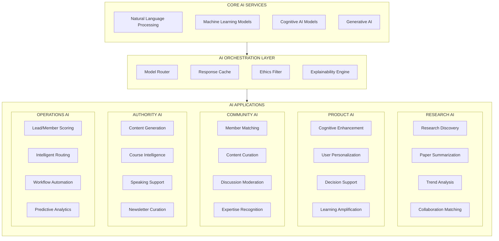
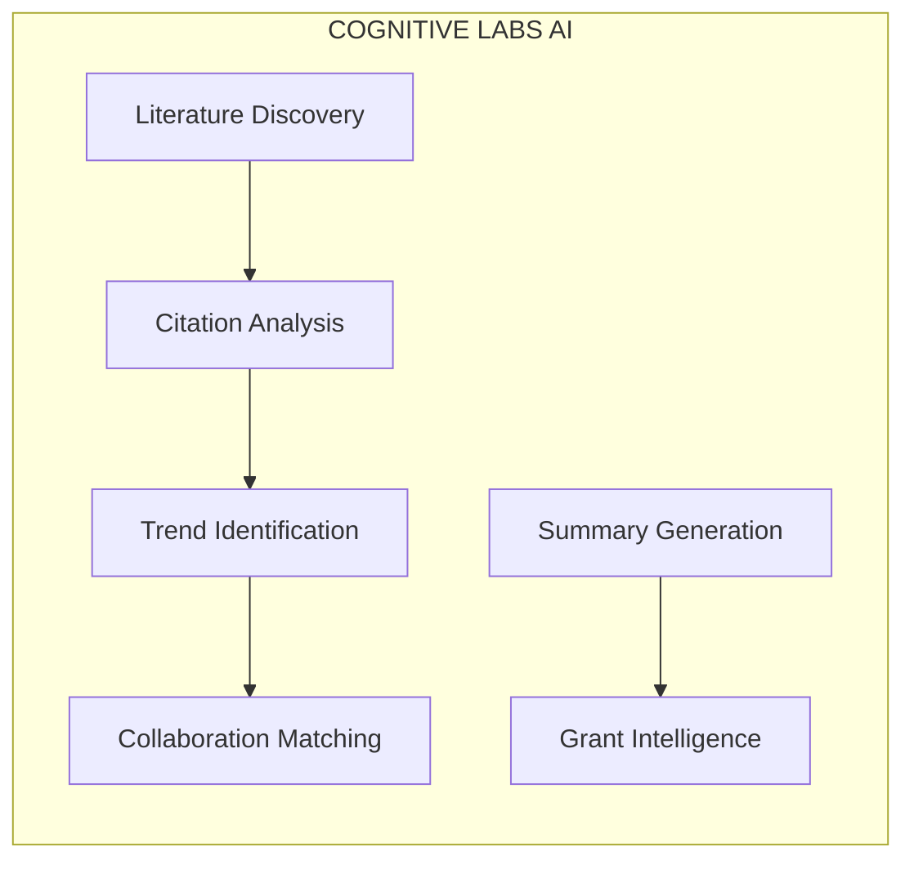
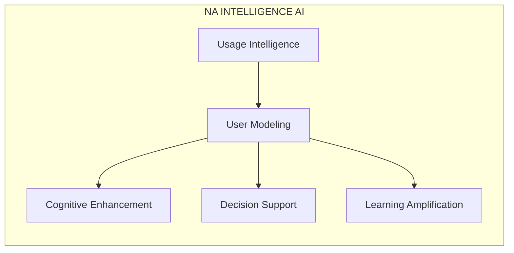
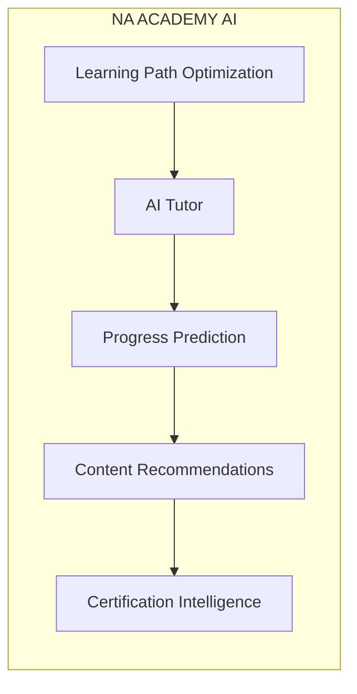
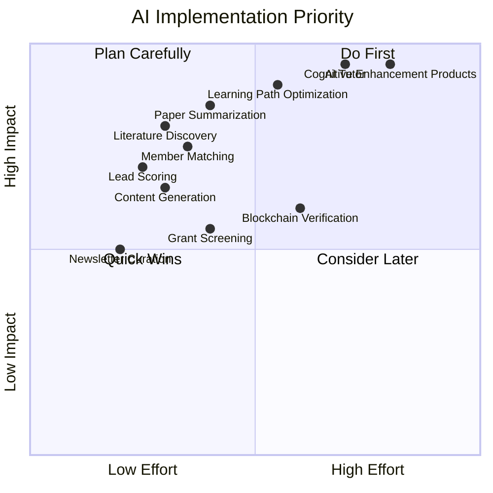
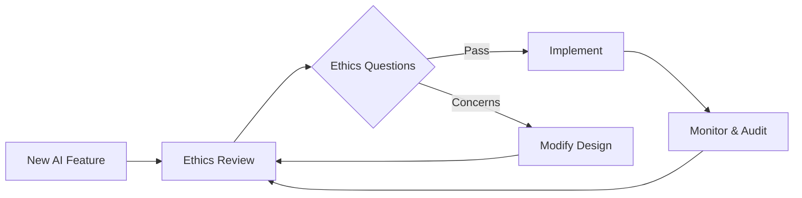

# Nothing Artificial AI Integration Map

> *AI touchpoints across the ecosystem, designed to enhance human intelligence at every interaction.*

---

## Overview

This document maps all AI integration points across the Nothing Artificial ecosystem. Every AI application is designed with the core philosophy: **augmentation over automation, transparency over black boxes, human dignity over efficiency.**

---

## Ecosystem AI Architecture



---

## AI Applications by Entity

### Central Hub AI

| Application | Description | Input | Output | Human Role |
|-------------|-------------|-------|--------|------------|
| **Cross-Entity Intelligence** | Identifies synergies between entities | Contact behavior, interests | Entity recommendations | Reviews and approves referrals |
| **Unified Scoring** | Scores contacts across all entities | All interactions | Composite scores | Sets scoring criteria |
| **Content Routing** | Routes content to appropriate audiences | Content metadata, segment data | Distribution plan | Approves major campaigns |
| **Analytics Intelligence** | Surfaces insights from cross-entity data | All ecosystem data | Actionable insights | Interprets and acts |

### Cognitive Labs AI



| Application | Description | Input | Output | Human Role |
|-------------|-------------|-------|--------|------------|
| **Literature Discovery** | Monitors journals for relevant papers | Keywords, research areas | Curated paper feed | Reviews recommendations |
| **Citation Analysis** | Maps citation networks and influence | Paper database | Influence graphs, key papers | Interprets academic impact |
| **Trend Identification** | Identifies emerging research themes | Paper abstracts, citations | Trend reports | Validates and explores |
| **Collaboration Matching** | Connects researchers with shared interests | Researcher profiles, papers | Collaboration suggestions | Initiates connections |
| **Summary Generation** | Creates accessible paper summaries | Full paper text | Multi-level summaries | Reviews for accuracy |
| **Grant Intelligence** | Tracks and matches funding opportunities | Grant databases, research focus | Grant recommendations | Decides applications |

### NA Intelligence (Products) AI



| Application | Description | Input | Output | Human Role |
|-------------|-------------|-------|--------|------------|
| **Cognitive Enhancement** | Tools that amplify thinking | User tasks, context | Enhanced outputs | Uses tools actively |
| **Decision Support** | Surfaces relevant information for decisions | Decision context | Structured options, pros/cons | Makes final decision |
| **Learning Amplification** | Accelerates skill and knowledge acquisition | Learning goals, progress | Optimized learning paths | Learns actively |
| **Attention Management** | Helps focus on important tasks | Task list, priorities | Focus recommendations | Chooses focus areas |
| **Memory Enhancement** | Assists in information retention | Information to remember | Spaced repetition, connections | Reviews and reinforces |

### NA Enterprise AI

| Application | Description | Input | Output | Human Role |
|-------------|-------------|-------|--------|------------|
| **Lead Qualification** | Scores and routes enterprise inquiries | Lead data, behavior | Qualified scores, routing | Reviews hot leads |
| **Proposal Generation** | Assists in creating custom proposals | Client needs, products | Proposal drafts | Customizes and sends |
| **Account Intelligence** | Monitors client needs and opportunities | Account activity | Opportunity alerts | Acts on insights |
| **ROI Modeling** | Demonstrates value to prospects | Usage data, industry benchmarks | ROI projections | Presents to clients |
| **Implementation Support** | Guides enterprise deployments | Client setup, best practices | Implementation plans | Oversees deployment |

### NA Academy AI



| Application | Description | Input | Output | Human Role |
|-------------|-------------|-------|--------|------------|
| **Learning Path Optimization** | Creates personalized curricula | Student profile, goals | Custom learning path | Chooses goals |
| **AI Tutor** | Real-time learning assistance | Student questions, context | Explanations, guidance | Learns from tutor |
| **Progress Prediction** | Identifies at-risk students | Engagement, performance | Risk scores, interventions | Implements interventions |
| **Content Recommendations** | Suggests supplementary materials | Progress, interests | Content suggestions | Explores content |
| **Certification Intelligence** | Assesses readiness for certification | Performance data | Readiness score, gaps | Decides when to certify |
| **Course Content Assistance** | Helps instructors create content | Topic, learning objectives | Content drafts | Reviews and refines |

### Research Community AI

| Application | Description | Input | Output | Human Role |
|-------------|-------------|-------|--------|------------|
| **Member Matching** | Connects members with shared interests | Member profiles, activity | Connection suggestions | Initiates connections |
| **Content Curation** | Personalizes member feeds | Interests, behavior | Curated content | Engages with content |
| **Discussion Facilitation** | Highlights important threads | Discussion activity | Featured discussions | Participates in discussions |
| **Expertise Recognition** | Tracks and surfaces member expertise | Contributions, certifications | Expertise badges | Validates expertise |
| **Event Recommendations** | Suggests relevant events | Member profile, history | Event suggestions | Registers for events |
| **Mentor Matching** | Connects mentors and mentees | Experience, goals | Mentor recommendations | Establishes relationships |

### NA Chain (Blockchain) AI

| Application | Description | Input | Output | Human Role |
|-------------|-------------|-------|--------|------------|
| **Verification Automation** | Triggers blockchain verification | Credential events | On-chain records | Reviews verification |
| **Anomaly Detection** | Monitors for trust violations | Transaction patterns | Anomaly alerts | Investigates anomalies |
| **Attribution Analysis** | Ensures proper credit in research | Paper metadata | Attribution verification | Resolves disputes |
| **Identity Intelligence** | Assists in decentralized identity | Identity claims | Verification status | Controls identity |
| **Impact Certification** | Verifies impact claims | Impact data | Certified impact records | Reports impact |

### NA Foundation AI

| Application | Description | Input | Output | Human Role |
|-------------|-------------|-------|--------|------------|
| **Grant Screening** | Evaluates grant applications | Applications | Scoring, recommendations | Makes grant decisions |
| **Impact Measurement** | Tracks and reports foundation impact | Grant outcomes | Impact reports | Validates impact |
| **Donor Intelligence** | Identifies potential supporters | Donor data, behavior | Donor recommendations | Cultivates relationships |
| **Research Prioritization** | Helps allocate research funding | Research proposals, trends | Priority rankings | Allocates funds |
| **Open Source Triage** | Manages open source contributions | Contributions, issues | Triage recommendations | Merges contributions |

---

## Implementation Priority Matrix



### Implementation Phases

#### Phase 2A: Foundation (Month 1-2)
- Lead/Member Scoring
- Basic Content Generation
- Newsletter Curation
- Literature Discovery

#### Phase 2B: Intelligence (Month 3-4)
- Paper Summarization
- Member Matching
- Content Curation
- Cross-Entity Intelligence

#### Phase 3A: Enhancement (Month 5-6)
- Learning Path Optimization
- AI Tutor
- Expertise Recognition
- Grant Screening

#### Phase 3B: Advanced (Month 7-8)
- Cognitive Enhancement Products
- Decision Support Tools
- Blockchain Verification
- Full Ecosystem AI

---

## Technical Specifications

### Model Selection

| Application | Recommended Model | Reasoning |
|-------------|------------------|-----------|
| **Paper Summarization** | Claude 3.5 Sonnet | Long context, accurate summaries |
| **Content Generation** | Claude 3.5 Sonnet | Quality writing, brand voice |
| **Lead Scoring** | Custom ML (XGBoost) | Structured data, interpretable |
| **Member Matching** | Custom embeddings + similarity | Domain-specific matching |
| **AI Tutor** | Claude 3.5 Sonnet | Interactive, educational |
| **Trend Analysis** | Custom NLP + Claude | Pattern recognition |
| **Anomaly Detection** | Custom ML | Real-time, low latency |

### API Architecture

```mermaid
flowchart TB
    subgraph CLIENTS["CLIENTS"]
        WEB[Web Apps]
        MOBILE[Mobile Apps]
        INTERNAL[Internal Tools]
        EXTERNAL[External APIs]
    end

    subgraph GATEWAY["API GATEWAY"]
        AUTH[Authentication]
        RATE[Rate Limiting]
        ROUTE[Routing]
    end

    subgraph AI_API["AI API LAYER"]
        SCORING_API[/scoring]
        MATCHING_API[/matching]
        GENERATION_API[/generation]
        RESEARCH_API[/research]
        TUTOR_API[/tutor]
    end

    subgraph MODELS["MODEL LAYER"]
        CLAUDE[Claude API]
        CUSTOM[Custom Models]
        EMBEDDINGS[Embedding Models]
    end

    CLIENTS --> GATEWAY
    GATEWAY --> AI_API
    AI_API --> MODELS
```

### Cost Estimation

| Application | Estimated Monthly Cost | Volume Basis |
|-------------|----------------------|--------------|
| Paper Summarization | $500-1,500 | 500-1,500 papers |
| Content Generation | $300-800 | 100-300 pieces |
| AI Tutor | $1,000-3,000 | 1,000-3,000 sessions |
| Lead Scoring | $100-300 | 10,000-30,000 scores |
| Member Matching | $200-500 | 5,000-15,000 matches |
| **Total Estimated** | **$2,100-6,100/month** | |

---

## Data Requirements

### Training Data

| Model | Data Required | Source |
|-------|--------------|--------|
| Paper Summarization | Existing summaries, papers | Cognitive Labs archives |
| Lead Scoring | Historical leads, outcomes | CRM data |
| Member Matching | Member profiles, connections | Community data |
| Course Recommendations | Enrollment, completion data | Academy data |
| Content Performance | Content metrics | Analytics data |

### Real-Time Data

| Application | Data Feed | Latency Requirement |
|-------------|-----------|-------------------|
| Lead Scoring | CRM events | < 1 second |
| Content Curation | User behavior | < 5 seconds |
| AI Tutor | Student interactions | < 2 seconds |
| Anomaly Detection | Blockchain events | < 10 seconds |

---

## Governance & Ethics

### Human-Centric AI Principles

| Principle | Implementation |
|-----------|----------------|
| **Transparency** | All AI decisions come with explanations |
| **Human Override** | Users can always override AI suggestions |
| **Privacy First** | Minimal data collection, no unauthorized sharing |
| **Bias Monitoring** | Regular audits for fairness |
| **Consent-Based** | Users opt-in to AI features |
| **Explainability** | "Why?" button on all AI outputs |

### AI Ethics Review Process



### Ethics Questions for Each AI Feature

1. Does this enhance or replace human capability?
2. Can users understand why the AI made this suggestion?
3. Can users easily override or ignore the AI?
4. What data does this use, and have users consented?
5. Could this create or amplify bias?
6. Does this respect user privacy?
7. Is there a human fallback if the AI fails?

---

## Success Metrics

### AI Performance Metrics

| Metric | Target | Measurement |
|--------|--------|-------------|
| Summarization Quality | 4.5/5 user rating | User feedback |
| Lead Score Accuracy | 80% precision | Conversion tracking |
| Tutor Helpfulness | 90% positive rating | Session feedback |
| Content Relevance | 70% engagement | Click/read rates |
| Match Success | 60% connection rate | Follow-up tracking |

### Human-AI Collaboration Metrics

| Metric | Target | Description |
|--------|--------|-------------|
| Human Override Rate | 10-20% | Healthy range shows AI useful but humans engaged |
| Explanation Views | 30%+ | Users understanding AI decisions |
| Feature Adoption | 70%+ | Users actively using AI features |
| Satisfaction | 4.2/5+ | Overall AI feature satisfaction |

---

*AI in service of human intelligence. Every algorithm, every model, every feature designed to make humans more capable, not more dependent.*
