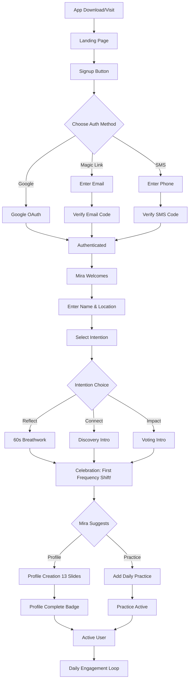
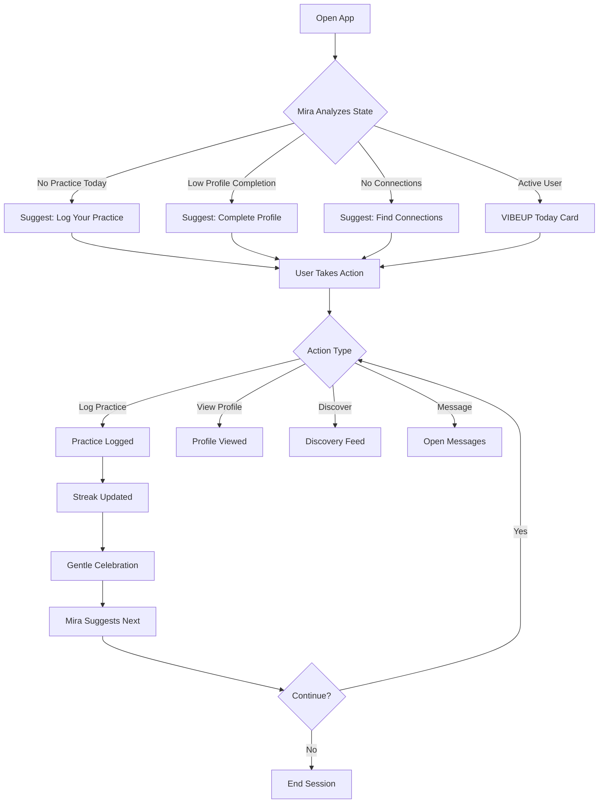

# User Journey Maps - Complete Flow Diagrams

**Version**: 1.0.0  
**Last Updated**: December 16, 2025

---

## Overview

Complete user journeys with Mermaid diagrams showing all critical paths, decision points, and conversions.

**Brand Voice Integration**: All touchpoints in these journeys use [brand voice guidelines](../brand/03-brand-voice-messaging.md). Mira's dialogue follows [personality guide](../brand/04-mira-personality-guide.md). Copy examples updated to match brand standards.

**Key Brand Principles in User Journeys**:
- Onboarding: Welcoming, not overwhelming ("Your Energy Is Your Edge")
- Practice logging: Encouraging, not demanding ("Ready to set the tone for your day?")
- Celebrations: Authentic, not generic ("This is where transformation begins")
- Suggestions: Invitations, not instructions ("Would you like to..." not "You should...")
- Error states: Supportive, not technical ("Let's try that again" not "Error 500")

---

## First-Time User Journey



---

## Daily Engagement Loop



---

## Critical Conversion Funnels

### Signup to Active User

```
Landing Page View
  ↓ (40% conversion)
Signup Start
  ↓ (70% conversion)
Email/Phone Verified
  ↓ (80% conversion)
Onboarding Complete
  ↓ (60% conversion)
First Practice Logged
  ↓
Active User (D7 return >25%)
```

### Free to Premium

```
Free User
  ↓
Uses Premium Feature (blocked)
  ↓ (20% click upgrade)
Views Membership Page
  ↓ (40% start trial)
Starts 7-Day Free Trial
  ↓ (40% convert)
Becomes Regenerative Member
```

---

**Related**: [`epic-01-mira.md`](../epics/epic-01-mira.md), [`epic-02-humans.md`](../epics/epic-02-humans.md), [`epic-03-practices.md`](../epics/epic-03-practices.md), [`epic-04-discovery.md`](../epics/epic-04-discovery.md)

