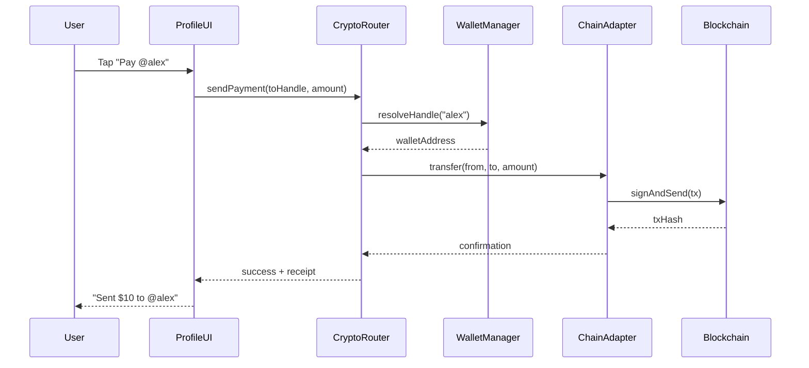

# Epic 1A: Crypto Financial Layer

**Epic ID**: EPIC-1A-CRYPTO  
**Priority**: P0 (Foundation alongside Mira)  
**Timeline**: 4 weeks (parallel with Epic 1)  
**Dependencies**: Epic 0 (Foundation)  
**Blocks**: All payment-related features across epics

---

## Vision & Objectives

Epic 1A establishes the **Crypto Financial Layer** as a foundational primitive alongside Mira. Just as Mira provides omnipresent AI intelligence, the Crypto Router provides omnipresent financial identity and payment capability throughout the platform.

**Core Philosophy**: Make crypto as invisible as email. Users shouldn't need to understand blockchain to use it—payments should feel as simple as tapping a button, and handles should work like usernames.

### What This Epic Delivers

1. **Wallet Identity**: Every user gets a crypto wallet at signup with a human-readable handle (@username)
2. **Handle Payments**: Send money by typing a handle—no wallet addresses needed
3. **USDC Transfers**: Stablecoin payments for P2P and business transactions
4. **VIBES Token**: Utility token for rewards, governance, and platform engagement
5. **Multi-Chain Support**: Base L2 primary, with Solana and Polygon adapters
6. **Hybrid Wallets**: Custodial for simplicity, with option to connect external wallets
7. **CryptoRouterService**: Unified service layer consumed by all other epics

### Success Criteria

**Foundation Metrics**:
- 100% of users have wallet handle at signup
- Handle resolution latency < 100ms
- Transfer success rate > 99.9%
- Zero funds lost to bugs

**Adoption Metrics (by end of Phase 2)**:
- 30% of users make at least 1 P2P payment
- 70% of users earn VIBES through practices
- 20% of payments use crypto vs Stripe

**Engagement Metrics (by end of Phase 3)**:
- 50% of business payments use crypto
- 40% of premium members stake VIBES
- 25% of affiliate payouts in crypto

---

## Platform-Wide Integration Strategy

The Crypto Router is consumed by every epic, just like Mira. Below is the integration framework:

### Integration Points by Epic

**Epic 0 - Foundation: Infrastructure Setup**
```typescript
// Crypto tables created in foundation migrations
// CryptoRouterService initialized at startup
// Feature flags for gradual rollout
interface CryptoFoundation {
  tables: ['user_wallets', 'crypto_transactions', 'vibe_token_balances'];
  service: CryptoRouterService;
  flags: Epic1AFeatureFlags;
}
```

**Epic 1 - Mira: Crypto Context Awareness**
```typescript
// Mira knows user's financial state
interface MiraCryptoContext {
  handle: string;
  balanceUsdc: number;
  balanceVibe: number;
  pendingPayments: number;
  recentRewards: VibeReward[];
}

// Example Mira prompts:
// "Your wallet has 50 USDC ready. Want to split that coffee with @alex?"
// "You earned 25 VIBES from your 7-day streak! That's 3x the base rate."
```

**Epic 2 - Human Profiles: Wallet Identity**
```typescript
// Profile displays handle and wallet actions
interface ProfileCryptoFeatures {
  displayHandle: boolean;           // @username in header
  showPayButton: boolean;           // Pay action alongside Connect
  walletSettings: boolean;          // Manage wallet in settings
  qrCode: boolean;                  // Payment QR code
  balanceDisplay: boolean;          // Show balances
}
```

**Epic 3 - Practices: VIBES Rewards**
```typescript
// Earn VIBES for wellness activities
interface PracticeCryptoFeatures {
  vibeRewards: boolean;             // Earn per practice
  streakMultipliers: boolean;       // Bonus for consistency
  achievementNfts: boolean;         // Soul-bound badges
  leaderboardRewards: boolean;      // Community competitions
}
```

**Epic 4 - Discovery: P2P Payments**
```typescript
// Pay connections directly
interface DiscoveryCryptoFeatures {
  inChatPayments: boolean;          // Send money in messages
  paymentRequests: boolean;         // Request money
  splitPayments: boolean;           // Split group expenses
  tipConnections: boolean;          // Tip for help
}
```

**Epic 5 - Impact: VIBES Governance**
```typescript
// VIBES-weighted voting power
interface ImpactCryptoFeatures {
  vibeWeightedVotes: boolean;       // More VIBES = more weight
  stakeForCommitment: boolean;      // Stake to signal priority
  feedbackRewards: boolean;         // Earn for feedback
  proposalGrants: boolean;          // Fund proposals
}
```

**Epic 6 - Business: Merchant Payments**
```typescript
// Accept crypto for services
interface BusinessCryptoFeatures {
  acceptUsdc: boolean;              // Stablecoin payments
  acceptVibe: boolean;              // VIBES for perks
  instantSettlement: boolean;       // No Stripe delays
  businessTreasury: boolean;        // Manage funds
  tips: boolean;                    // Tip practitioners
}
```

**Epic 7 - Community: Shared Treasuries**
```typescript
// Community financial management
interface CommunityCryptoFeatures {
  treasury: boolean;                // Shared wallet
  duesCollection: boolean;          // Membership dues
  crowdfunding: boolean;            // Fund events
  rewardsPool: boolean;             // Distribute rewards
  transparentLedger: boolean;       // On-chain visibility
}
```

**Epic 8 - Monetization: Crypto Subscriptions**
```typescript
// Pay memberships with crypto
interface MonetizationCryptoFeatures {
  cryptoSubscriptions: boolean;     // Pay in USDC/VIBES
  vibeStaking: boolean;             // Stake for premium
  affiliatePayouts: boolean;        // Instant global payouts
  onChainProof: boolean;            // Tree planting verification
}
```

---

## Architecture Overview

### System Architecture

```
┌─────────────────────────────────────────────────────────────────┐
│                      VIBEUP Application Layer                    │
├─────────────────────────────────────────────────────────────────┤
│  Epic 2    │  Epic 3    │  Epic 4    │  Epic 6    │  Epic 8    │
│  Profiles  │  Practices │  Discovery │  Business  │  Monetize  │
└──────┬─────┴──────┬─────┴──────┬─────┴──────┬─────┴──────┬─────┘
       │            │            │            │            │
       └────────────┼────────────┼────────────┼────────────┘
                    │            │            │
                    ▼            ▼            ▼
       ┌────────────────────────────────────────────────────┐
       │              CryptoRouterService                    │
       ├────────────────────────────────────────────────────┤
       │  WalletManager │ TransferEngine │ RewardEngine     │
       │  HandleResolver│ StakingManager │ TreasuryManager  │
       └──────────────────────────┬─────────────────────────┘
                                  │
       ┌──────────────────────────┼──────────────────────────┐
       │                          │                          │
       ▼                          ▼                          ▼
┌──────────────┐         ┌──────────────┐         ┌──────────────┐
│  Base L2     │         │   Solana     │         │   Polygon    │
│  (Primary)   │         │   Adapter    │         │   Adapter    │
└──────────────┘         └──────────────┘         └──────────────┘
       │                          │                          │
       ▼                          ▼                          ▼
┌──────────────┐         ┌──────────────┐         ┌──────────────┐
│    USDC      │         │    USDC      │         │    USDC      │
│    VIBES      │         │    VIBES      │         │    VIBES      │
│    SBTs      │         │              │         │              │
└──────────────┘         └──────────────┘         └──────────────┘
```

### Request Flow



---

## Core Components

### 1. Wallet Identity System

Every user gets a wallet at signup. The wallet address is abstracted behind a human-readable handle.

```typescript
interface UserWallet {
  id: string;                       // UUID
  userId: string;                   // References profiles.id
  handle: string;                   // Unique handle (@username)
  
  // Wallet addresses per chain
  addresses: {
    base: string;                   // Primary chain
    solana?: string;                // Optional
    polygon?: string;               // Optional
  };
  
  // Custody model
  custodyType: 'managed' | 'connected';
  
  // For managed wallets: encrypted key material
  encryptedKeyMaterial?: string;
  
  // For connected wallets: external wallet address
  connectedWalletAddress?: string;
  connectedWalletProvider?: 'metamask' | 'phantom' | 'coinbase';
  
  // State
  isActive: boolean;
  createdAt: Date;
  updatedAt: Date;
}

interface HandleResolution {
  handle: string;
  address: string;
  chain: 'base' | 'solana' | 'polygon';
  avatarUrl?: string;
  displayName?: string;
}
```

### 2. Transfer Engine

Handles all USDC transfers between users and to businesses.

```typescript
interface TransferRequest {
  fromUserId: string;               // Sender
  toHandle: string;                 // Recipient handle
  amount: number;                   // In USDC (decimal)
  memo?: string;                    // Optional note
  idempotencyKey: string;           // Prevent duplicates
}

interface TransferResult {
  transactionId: string;            // Internal ID
  txHash: string;                   // On-chain hash
  status: 'pending' | 'confirmed' | 'failed';
  fromHandle: string;
  toHandle: string;
  amount: number;
  fee: number;
  chain: string;
  confirmedAt?: Date;
}

interface PaymentRequest {
  id: string;
  fromHandle: string;               // Requester
  toHandle: string;                 // Payer
  amount: number;
  description: string;
  status: 'pending' | 'paid' | 'declined' | 'expired';
  expiresAt: Date;
  createdAt: Date;
}
```

### 3. VIBES Token System

Utility token for platform engagement, rewards, and governance.

```typescript
interface VibeTokenBalance {
  userId: string;
  available: number;                // Spendable balance
  staked: number;                   // Locked for benefits
  pending: number;                  // Rewards being processed
  lifetime: number;                 // Total ever earned
  lastUpdated: Date;
}

interface VibeReward {
  id: string;
  userId: string;
  amount: number;
  source: VibeRewardSource;
  multiplier: number;               // Combined streak/membership/karma bonus
  karmaMultiplier: number;          // KARMA-specific multiplier (Epic 1B)
  metadata: Record<string, any>;
  createdAt: Date;
}

type VibeRewardSource = 
  | 'practice_logged'
  | 'daily_affirmation'
  | 'streak_bonus'
  | 'achievement_milestone'
  | 'feedback_submitted'
  | 'referral_signup'
  | 'community_contribution';

// Reward configuration
const VIBES_REWARDS = {
  // Base rewards
  practice_logged: 5,
  daily_affirmation: 2,
  reflection_added: 3,
  feedback_submitted: 10,
  referral_signup: 100,
  
  // Streak multipliers
  streak_7_days: 1.5,
  streak_21_days: 2.0,
  streak_30_days: 2.5,
  streak_90_days: 3.0,
  
  // Membership multipliers
  community_tier: 1.0,
  regenerative_tier: 2.0,
  
  // KARMA Level multipliers (Epic 1B Integration)
  // Higher KARMA level = faster VIBES earning
  karma_level_1_3: 1.0,   // Seedling-Sapling
  karma_level_4: 1.1,     // Growing
  karma_level_5: 1.25,    // Flourishing
  karma_level_6: 1.5,     // Thriving
  karma_level_7: 1.75,    // Guardian
  karma_level_8_plus: 2.0, // Steward+
  
  // One-time achievements
  first_practice: 50,
  first_streak_7: 100,
  first_streak_30: 500,
  practices_100: 1000,
};

/**
 * KARMA-VIBES INTEGRATION (Epic 1B)
 * =================================
 * The Karma Layer (Epic 1B) provides an additional multiplier on VIBES earning.
 * When awarding VIBES, the CryptoRouterService calls KarmaRouterService.getVibesMultiplier()
 * to get the user's KARMA-based multiplier, which stacks with streak and membership multipliers.
 * 
 * Final VIBES = baseReward × streakMultiplier × membershipMultiplier × karmaMultiplier
 * 
 * This creates a virtuous cycle: positive actions earn KARMA → higher KARMA level → 
 * faster VIBES earning → more utility token value for engaged users.
 */
```

### 4. Staking System

Stake VIBES to unlock premium features without monthly payment.

```typescript
interface StakingTier {
  name: string;
  stakeRequired: number;
  benefits: string[];
  lockPeriodDays: number;
}

const STAKING_TIERS: StakingTier[] = [
  {
    name: 'free_regenerative',
    stakeRequired: 5000,
    benefits: ['all_regenerative_features'],
    lockPeriodDays: 30,
  },
  {
    name: 'governance_power',
    stakeRequired: 10000,
    benefits: ['2x_vote_weight', 'feature_proposals'],
    lockPeriodDays: 90,
  },
  {
    name: 'founder_status',
    stakeRequired: 50000,
    benefits: ['lifetime_premium', 'founding_member_badge'],
    lockPeriodDays: 365,
  },
];

interface StakePosition {
  id: string;
  userId: string;
  amount: number;
  tier: string;
  lockedUntil: Date;
  benefits: string[];
  createdAt: Date;
}
```

---

## Database Schema

```sql
-- ============================================================================
-- USER WALLETS
-- ============================================================================

CREATE TABLE user_wallets (
  id UUID PRIMARY KEY DEFAULT gen_random_uuid(),
  user_id UUID UNIQUE NOT NULL REFERENCES profiles(id) ON DELETE CASCADE,
  
  -- Handle (unique, lowercase, alphanumeric + underscore)
  handle TEXT UNIQUE NOT NULL,
  
  -- Wallet addresses per chain
  address_base TEXT NOT NULL,
  address_solana TEXT,
  address_polygon TEXT,
  
  -- Custody model
  custody_type TEXT NOT NULL DEFAULT 'managed',
  
  -- For managed wallets: encrypted private key
  encrypted_key_material TEXT,
  
  -- For connected wallets
  connected_wallet_address TEXT,
  connected_wallet_provider TEXT,
  
  -- State
  is_active BOOLEAN DEFAULT true,
  
  -- Timestamps
  created_at TIMESTAMPTZ DEFAULT NOW(),
  updated_at TIMESTAMPTZ DEFAULT NOW(),
  
  -- Constraints
  CONSTRAINT valid_handle CHECK (handle ~ '^[a-z0-9_]{3,30}$'),
  CONSTRAINT valid_custody_type CHECK (custody_type IN ('managed', 'connected'))
);

CREATE INDEX idx_wallets_user ON user_wallets(user_id);
CREATE INDEX idx_wallets_handle ON user_wallets(handle);
CREATE INDEX idx_wallets_address_base ON user_wallets(address_base);

-- ============================================================================
-- CRYPTO TRANSACTIONS
-- ============================================================================

CREATE TABLE crypto_transactions (
  id UUID PRIMARY KEY DEFAULT gen_random_uuid(),
  
  -- Transaction parties
  from_user_id UUID REFERENCES profiles(id),
  to_user_id UUID REFERENCES profiles(id),
  from_handle TEXT NOT NULL,
  to_handle TEXT NOT NULL,
  
  -- Transaction details
  amount NUMERIC(20, 8) NOT NULL,
  currency TEXT NOT NULL DEFAULT 'USDC',
  chain TEXT NOT NULL DEFAULT 'base',
  
  -- On-chain data
  tx_hash TEXT,
  block_number BIGINT,
  gas_used BIGINT,
  fee_amount NUMERIC(20, 8),
  
  -- Status
  status TEXT NOT NULL DEFAULT 'pending',
  
  -- Metadata
  memo TEXT,
  idempotency_key TEXT UNIQUE,
  metadata JSONB DEFAULT '{}',
  
  -- Error tracking
  error_message TEXT,
  retry_count INTEGER DEFAULT 0,
  
  -- Timestamps
  created_at TIMESTAMPTZ DEFAULT NOW(),
  confirmed_at TIMESTAMPTZ,
  
  -- Constraints
  CONSTRAINT valid_status CHECK (status IN ('pending', 'submitted', 'confirmed', 'failed')),
  CONSTRAINT valid_currency CHECK (currency IN ('USDC', 'VIBES')),
  CONSTRAINT valid_chain CHECK (chain IN ('base', 'solana', 'polygon')),
  CONSTRAINT positive_amount CHECK (amount > 0)
);

CREATE INDEX idx_transactions_from_user ON crypto_transactions(from_user_id, created_at DESC);
CREATE INDEX idx_transactions_to_user ON crypto_transactions(to_user_id, created_at DESC);
CREATE INDEX idx_transactions_status ON crypto_transactions(status);
CREATE INDEX idx_transactions_tx_hash ON crypto_transactions(tx_hash);
CREATE INDEX idx_transactions_idempotency ON crypto_transactions(idempotency_key);

-- ============================================================================
-- VIBES TOKEN BALANCES
-- ============================================================================

CREATE TABLE vibe_token_balances (
  id UUID PRIMARY KEY DEFAULT gen_random_uuid(),
  user_id UUID UNIQUE NOT NULL REFERENCES profiles(id) ON DELETE CASCADE,
  
  -- Balances
  available NUMERIC(20, 8) NOT NULL DEFAULT 0,
  staked NUMERIC(20, 8) NOT NULL DEFAULT 0,
  pending NUMERIC(20, 8) NOT NULL DEFAULT 0,
  lifetime NUMERIC(20, 8) NOT NULL DEFAULT 0,
  
  -- Timestamps
  last_updated TIMESTAMPTZ DEFAULT NOW(),
  created_at TIMESTAMPTZ DEFAULT NOW(),
  
  -- Constraints
  CONSTRAINT non_negative_balances CHECK (
    available >= 0 AND staked >= 0 AND pending >= 0 AND lifetime >= 0
  )
);

CREATE INDEX idx_vibe_balances_user ON vibe_token_balances(user_id);

-- ============================================================================
-- VIBES REWARDS
-- ============================================================================

CREATE TABLE vibe_rewards (
  id UUID PRIMARY KEY DEFAULT gen_random_uuid(),
  user_id UUID NOT NULL REFERENCES profiles(id) ON DELETE CASCADE,
  
  -- Reward details
  amount NUMERIC(20, 8) NOT NULL,
  source TEXT NOT NULL,
  multiplier NUMERIC(5, 2) DEFAULT 1.0,
  
  -- Related entity
  related_type TEXT,
  related_id UUID,
  
  -- Metadata
  metadata JSONB DEFAULT '{}',
  
  -- Status
  status TEXT DEFAULT 'pending',
  processed_at TIMESTAMPTZ,
  
  -- Timestamps
  created_at TIMESTAMPTZ DEFAULT NOW(),
  
  -- Constraints
  CONSTRAINT valid_source CHECK (source IN (
    'practice_logged', 'daily_affirmation', 'reflection_added',
    'streak_bonus', 'achievement_milestone', 'feedback_submitted',
    'referral_signup', 'community_contribution'
  )),
  CONSTRAINT valid_status CHECK (status IN ('pending', 'processed', 'failed')),
  CONSTRAINT positive_amount CHECK (amount > 0)
);

CREATE INDEX idx_vibe_rewards_user ON vibe_rewards(user_id, created_at DESC);
CREATE INDEX idx_vibe_rewards_source ON vibe_rewards(source);
CREATE INDEX idx_vibe_rewards_status ON vibe_rewards(status);

-- ============================================================================
-- PAYMENT REQUESTS
-- ============================================================================

CREATE TABLE payment_requests (
  id UUID PRIMARY KEY DEFAULT gen_random_uuid(),
  
  -- Parties (requester is who wants the money)
  requester_user_id UUID NOT NULL REFERENCES profiles(id),
  payer_user_id UUID NOT NULL REFERENCES profiles(id),
  requester_handle TEXT NOT NULL,
  payer_handle TEXT NOT NULL,
  
  -- Request details
  amount NUMERIC(20, 8) NOT NULL,
  currency TEXT NOT NULL DEFAULT 'USDC',
  description TEXT,
  
  -- Status
  status TEXT NOT NULL DEFAULT 'pending',
  
  -- Related transaction (if paid)
  transaction_id UUID REFERENCES crypto_transactions(id),
  
  -- Expiration
  expires_at TIMESTAMPTZ NOT NULL,
  
  -- Timestamps
  created_at TIMESTAMPTZ DEFAULT NOW(),
  responded_at TIMESTAMPTZ,
  
  -- Constraints
  CONSTRAINT valid_request_status CHECK (status IN ('pending', 'paid', 'declined', 'expired')),
  CONSTRAINT positive_request_amount CHECK (amount > 0),
  CONSTRAINT different_parties CHECK (requester_user_id != payer_user_id)
);

CREATE INDEX idx_payment_requests_requester ON payment_requests(requester_user_id, created_at DESC);
CREATE INDEX idx_payment_requests_payer ON payment_requests(payer_user_id, status);

-- ============================================================================
-- STAKE POSITIONS
-- ============================================================================

CREATE TABLE stake_positions (
  id UUID PRIMARY KEY DEFAULT gen_random_uuid(),
  user_id UUID NOT NULL REFERENCES profiles(id) ON DELETE CASCADE,
  
  -- Stake details
  amount NUMERIC(20, 8) NOT NULL,
  tier TEXT NOT NULL,
  benefits TEXT[] DEFAULT '{}',
  
  -- Lock period
  locked_until TIMESTAMPTZ NOT NULL,
  
  -- Status
  is_active BOOLEAN DEFAULT true,
  
  -- Timestamps
  created_at TIMESTAMPTZ DEFAULT NOW(),
  unstaked_at TIMESTAMPTZ,
  
  -- Constraints
  CONSTRAINT positive_stake CHECK (amount > 0),
  CONSTRAINT valid_tier CHECK (tier IN ('free_regenerative', 'governance_power', 'founder_status'))
);

CREATE INDEX idx_stakes_user ON stake_positions(user_id, is_active);
CREATE INDEX idx_stakes_tier ON stake_positions(tier);

-- ============================================================================
-- SOUL-BOUND TOKENS (Achievement NFTs)
-- ============================================================================

CREATE TABLE soul_bound_tokens (
  id UUID PRIMARY KEY DEFAULT gen_random_uuid(),
  user_id UUID NOT NULL REFERENCES profiles(id) ON DELETE CASCADE,
  
  -- Token details
  token_type TEXT NOT NULL,
  token_name TEXT NOT NULL,
  token_uri TEXT,
  
  -- On-chain reference
  chain TEXT DEFAULT 'base',
  contract_address TEXT,
  token_id BIGINT,
  
  -- Achievement context
  achievement_type TEXT,
  achievement_data JSONB DEFAULT '{}',
  
  -- Timestamps
  minted_at TIMESTAMPTZ DEFAULT NOW(),
  
  -- Constraints
  CONSTRAINT unique_achievement UNIQUE (user_id, token_type),
  CONSTRAINT valid_token_type CHECK (token_type IN (
    'first_practice', 'week_warrior', 'month_master',
    'century_club', 'practice_legend', 'founding_member'
  ))
);

CREATE INDEX idx_sbts_user ON soul_bound_tokens(user_id);
CREATE INDEX idx_sbts_type ON soul_bound_tokens(token_type);

-- ============================================================================
-- COMMUNITY TREASURIES
-- ============================================================================

CREATE TABLE community_treasuries (
  id UUID PRIMARY KEY DEFAULT gen_random_uuid(),
  community_id UUID UNIQUE NOT NULL REFERENCES communities(id) ON DELETE CASCADE,
  
  -- Multi-sig wallet
  wallet_address TEXT NOT NULL,
  signers TEXT[] NOT NULL,
  required_signatures INTEGER DEFAULT 2,
  
  -- Balances
  balance_usdc NUMERIC(20, 8) DEFAULT 0,
  balance_vibe NUMERIC(20, 8) DEFAULT 0,
  
  -- Settings
  dues_amount_usdc NUMERIC(20, 8),
  dues_amount_vibe NUMERIC(20, 8),
  dues_period TEXT DEFAULT 'monthly',
  
  -- Timestamps
  created_at TIMESTAMPTZ DEFAULT NOW(),
  updated_at TIMESTAMPTZ DEFAULT NOW()
);

CREATE INDEX idx_treasuries_community ON community_treasuries(community_id);

-- ============================================================================
-- ROW LEVEL SECURITY
-- ============================================================================

ALTER TABLE user_wallets ENABLE ROW LEVEL SECURITY;
ALTER TABLE crypto_transactions ENABLE ROW LEVEL SECURITY;
ALTER TABLE vibe_token_balances ENABLE ROW LEVEL SECURITY;
ALTER TABLE vibe_rewards ENABLE ROW LEVEL SECURITY;
ALTER TABLE payment_requests ENABLE ROW LEVEL SECURITY;
ALTER TABLE stake_positions ENABLE ROW LEVEL SECURITY;
ALTER TABLE soul_bound_tokens ENABLE ROW LEVEL SECURITY;
ALTER TABLE community_treasuries ENABLE ROW LEVEL SECURITY;

-- User wallets: users can read their own, public handle lookup
CREATE POLICY wallets_select_own ON user_wallets
  FOR SELECT USING (auth.uid() = user_id);

CREATE POLICY wallets_select_by_handle ON user_wallets
  FOR SELECT USING (true); -- Anyone can lookup handles

CREATE POLICY wallets_update_own ON user_wallets
  FOR UPDATE USING (auth.uid() = user_id);

-- Transactions: users can see their own sent/received
CREATE POLICY transactions_select_own ON crypto_transactions
  FOR SELECT USING (
    auth.uid() = from_user_id OR auth.uid() = to_user_id
  );

CREATE POLICY transactions_insert_own ON crypto_transactions
  FOR INSERT WITH CHECK (auth.uid() = from_user_id);

-- Balances: users can see their own
CREATE POLICY balances_select_own ON vibe_token_balances
  FOR SELECT USING (auth.uid() = user_id);

-- Rewards: users can see their own
CREATE POLICY rewards_select_own ON vibe_rewards
  FOR SELECT USING (auth.uid() = user_id);

-- Payment requests: both parties can see
CREATE POLICY requests_select_own ON payment_requests
  FOR SELECT USING (
    auth.uid() = requester_user_id OR auth.uid() = payer_user_id
  );

CREATE POLICY requests_insert_own ON payment_requests
  FOR INSERT WITH CHECK (auth.uid() = requester_user_id);

CREATE POLICY requests_update_payer ON payment_requests
  FOR UPDATE USING (auth.uid() = payer_user_id);

-- Stakes: users can see their own
CREATE POLICY stakes_select_own ON stake_positions
  FOR SELECT USING (auth.uid() = user_id);

-- SBTs: users can see their own (non-transferable)
CREATE POLICY sbts_select_own ON soul_bound_tokens
  FOR SELECT USING (auth.uid() = user_id);

-- Treasuries: community members can view
CREATE POLICY treasuries_select_members ON community_treasuries
  FOR SELECT USING (
    EXISTS (
      SELECT 1 FROM community_members
      WHERE community_id = community_treasuries.community_id
      AND user_id = auth.uid()
    )
  );
```

---

## Service Layer

### CryptoRouterService

```typescript
/**
 * CRYPTO ROUTER SERVICE
 * =====================
 * Central service for all crypto operations.
 * Abstracts blockchain complexity from the rest of the application.
 */
import { BaseDatabaseService } from './base-database-service';
import { logger } from '@/lib/logger';
import * as Sentry from '@sentry/nextjs';

export class CryptoRouterService extends BaseDatabaseService {
  private walletManager: WalletManager;
  private transferEngine: TransferEngine;
  private rewardEngine: RewardEngine;
  private stakingManager: StakingManager;
  private chainAdapters: Map<string, ChainAdapter>;
  
  constructor(supabase) {
    super(supabase);
    this.walletManager = new WalletManager(supabase);
    this.transferEngine = new TransferEngine(supabase);
    this.rewardEngine = new RewardEngine(supabase);
    this.stakingManager = new StakingManager(supabase);
    
    // Initialize chain adapters
    this.chainAdapters = new Map([
      ['base', new BaseAdapter()],
      ['solana', new SolanaAdapter()],
      ['polygon', new PolygonAdapter()],
    ]);
  }
  
  // ========================================================================
  // WALLET OPERATIONS
  // ========================================================================
  
  /**
   * Create wallet for new user during signup
   */
  async createWallet(userId: string, handle: string): Promise<UserWallet> {
    return this.execute(
      async () => {
        // Validate handle uniqueness
        const existing = await this.walletManager.getByHandle(handle);
        if (existing) {
          throw new ConflictError('Handle already taken');
        }
        
        // Generate wallet on primary chain (Base)
        const baseAdapter = this.chainAdapters.get('base')!;
        const { address, encryptedKey } = await baseAdapter.createWallet();
        
        // Store wallet
        const wallet = await this.walletManager.create({
          userId,
          handle: handle.toLowerCase(),
          addressBase: address,
          encryptedKeyMaterial: encryptedKey,
          custodyType: 'managed',
        });
        
        // Initialize VIBES balance
        await this.initializeVibeBalance(userId);
        
        logger.crypto.info('Wallet created', { userId, handle, address });
        
        return wallet;
      },
      { service: 'CryptoRouterService', method: 'createWallet', userId }
    );
  }
  
  /**
   * Resolve handle to wallet address
   */
  async resolveHandle(handle: string): Promise<HandleResolution | null> {
    return this.execute(
      async () => {
        const wallet = await this.walletManager.getByHandle(handle.toLowerCase());
        
        if (!wallet) return null;
        
        // Get profile info for display
        const { data: profile } = await this.supabase
          .from('profiles')
          .select('display_name, avatar_url')
          .eq('id', wallet.userId)
          .single();
        
        return {
          handle: wallet.handle,
          address: wallet.addressBase,
          chain: 'base',
          displayName: profile?.display_name,
          avatarUrl: profile?.avatar_url,
        };
      },
      { service: 'CryptoRouterService', method: 'resolveHandle' }
    );
  }
  
  /**
   * Connect external wallet
   */
  async connectExternalWallet(
    userId: string,
    walletAddress: string,
    provider: 'metamask' | 'phantom' | 'coinbase',
    signature: string,
    message: string
  ): Promise<void> {
    return this.execute(
      async () => {
        // Verify signature
        const isValid = await this.verifySignature(walletAddress, signature, message);
        if (!isValid) {
          throw new ValidationError('Invalid wallet signature');
        }
        
        // Update wallet record
        await this.walletManager.connectExternal(userId, walletAddress, provider);
        
        logger.crypto.info('External wallet connected', { userId, provider });
      },
      { service: 'CryptoRouterService', method: 'connectExternalWallet', userId }
    );
  }
  
  // ========================================================================
  // TRANSFER OPERATIONS
  // ========================================================================
  
  /**
   * Send USDC to another user by handle
   */
  async sendPayment(request: TransferRequest): Promise<TransferResult> {
    return this.execute(
      async () => {
        // Resolve handles
        const fromWallet = await this.walletManager.getByUserId(request.fromUserId);
        const toResolution = await this.resolveHandle(request.toHandle);
        
        if (!fromWallet) {
          throw new NotFoundError('Sender wallet');
        }
        if (!toResolution) {
          throw new NotFoundError(`User @${request.toHandle}`);
        }
        
        // Check balance
        const balance = await this.getUsdcBalance(request.fromUserId);
        if (balance < request.amount) {
          throw new ValidationError('Insufficient USDC balance');
        }
        
        // Execute transfer
        const result = await this.transferEngine.execute({
          fromAddress: fromWallet.addressBase,
          toAddress: toResolution.address,
          amount: request.amount,
          currency: 'USDC',
          chain: 'base',
          memo: request.memo,
          idempotencyKey: request.idempotencyKey,
        });
        
        // Record transaction
        await this.supabase.from('crypto_transactions').insert({
          from_user_id: request.fromUserId,
          to_user_id: await this.walletManager.getUserIdByHandle(request.toHandle),
          from_handle: fromWallet.handle,
          to_handle: request.toHandle,
          amount: request.amount,
          currency: 'USDC',
          chain: 'base',
          tx_hash: result.txHash,
          status: result.status,
          memo: request.memo,
          idempotency_key: request.idempotencyKey,
        });
        
        logger.crypto.info('Payment sent', {
          from: fromWallet.handle,
          to: request.toHandle,
          amount: request.amount,
          txHash: result.txHash,
        });
        
        return {
          transactionId: result.id,
          txHash: result.txHash,
          status: result.status,
          fromHandle: fromWallet.handle,
          toHandle: request.toHandle,
          amount: request.amount,
          fee: result.fee,
          chain: 'base',
        };
      },
      { service: 'CryptoRouterService', method: 'sendPayment', userId: request.fromUserId }
    );
  }
  
  /**
   * Create payment request
   */
  async createPaymentRequest(
    requesterId: string,
    payerHandle: string,
    amount: number,
    description: string
  ): Promise<PaymentRequest> {
    return this.execute(
      async () => {
        const requesterWallet = await this.walletManager.getByUserId(requesterId);
        const payerResolution = await this.resolveHandle(payerHandle);
        
        if (!requesterWallet) throw new NotFoundError('Requester wallet');
        if (!payerResolution) throw new NotFoundError(`User @${payerHandle}`);
        
        const payerUserId = await this.walletManager.getUserIdByHandle(payerHandle);
        
        // Create request (expires in 7 days)
        const { data, error } = await this.supabase
          .from('payment_requests')
          .insert({
            requester_user_id: requesterId,
            payer_user_id: payerUserId,
            requester_handle: requesterWallet.handle,
            payer_handle: payerHandle,
            amount,
            description,
            expires_at: new Date(Date.now() + 7 * 24 * 60 * 60 * 1000).toISOString(),
          })
          .select()
          .single();
        
        if (error) throw error;
        
        // Notify payer
        await this.notifyPaymentRequest(payerUserId, requesterWallet.handle, amount);
        
        return data;
      },
      { service: 'CryptoRouterService', method: 'createPaymentRequest', userId: requesterId }
    );
  }
  
  // ========================================================================
  // VIBES TOKEN OPERATIONS
  // ========================================================================
  
  /**
   * Award VIBES tokens for an action
   */
  async awardVibe(
    userId: string,
    source: VibeRewardSource,
    baseAmount: number,
    relatedType?: string,
    relatedId?: string
  ): Promise<VibeReward> {
    return this.execute(
      async () => {
        // Calculate multiplier
        const multiplier = await this.calculateVibeMultiplier(userId, source);
        const finalAmount = baseAmount * multiplier;
        
        // Create reward record
        const { data: reward, error } = await this.supabase
          .from('vibe_rewards')
          .insert({
            user_id: userId,
            amount: finalAmount,
            source,
            multiplier,
            related_type: relatedType,
            related_id: relatedId,
            status: 'pending',
          })
          .select()
          .single();
        
        if (error) throw error;
        
        // Update balance
        await this.supabase.rpc('add_vibe_balance', {
          p_user_id: userId,
          p_amount: finalAmount,
        });
        
        // Mark as processed
        await this.supabase
          .from('vibe_rewards')
          .update({ status: 'processed', processed_at: new Date().toISOString() })
          .eq('id', reward.id);
        
        logger.crypto.info('VIBES awarded', {
          userId,
          source,
          baseAmount,
          multiplier,
          finalAmount,
        });
        
        return { ...reward, amount: finalAmount };
      },
      { service: 'CryptoRouterService', method: 'awardVibe', userId }
    );
  }
  
  /**
   * Calculate VIBES multiplier based on streak and membership
   */
  private async calculateVibeMultiplier(
    userId: string,
    source: VibeRewardSource
  ): Promise<number> {
    let multiplier = 1.0;
    
    // Get current streak
    const { data: streak } = await this.supabase
      .from('practice_streaks')
      .select('current_streak')
      .eq('user_id', userId)
      .single();
    
    if (streak) {
      if (streak.current_streak >= 90) multiplier *= VIBES_REWARDS.streak_90_days;
      else if (streak.current_streak >= 30) multiplier *= VIBES_REWARDS.streak_30_days;
      else if (streak.current_streak >= 21) multiplier *= VIBES_REWARDS.streak_21_days;
      else if (streak.current_streak >= 7) multiplier *= VIBES_REWARDS.streak_7_days;
    }
    
    // Get membership tier
    const { data: membership } = await this.supabase
      .from('memberships')
      .select('tier')
      .eq('user_id', userId)
      .single();
    
    if (membership?.tier === 'regenerative') {
      multiplier *= VIBES_REWARDS.regenerative_tier;
    }
    
    return multiplier;
  }
  
  /**
   * Get user's VIBES balance
   */
  async getVibeBalance(userId: string): Promise<VibeTokenBalance> {
    const { data, error } = await this.supabase
      .from('vibe_token_balances')
      .select('*')
      .eq('user_id', userId)
      .single();
    
    if (error || !data) {
      return {
        userId,
        available: 0,
        staked: 0,
        pending: 0,
        lifetime: 0,
        lastUpdated: new Date(),
      };
    }
    
    return data;
  }
  
  // ========================================================================
  // STAKING OPERATIONS
  // ========================================================================
  
  /**
   * Stake VIBES for benefits
   */
  async stakeVibe(
    userId: string,
    amount: number,
    tier: string
  ): Promise<StakePosition> {
    return this.execute(
      async () => {
        // Validate tier
        const tierConfig = STAKING_TIERS.find(t => t.name === tier);
        if (!tierConfig) {
          throw new ValidationError('Invalid staking tier');
        }
        
        if (amount < tierConfig.stakeRequired) {
          throw new ValidationError(
            `Minimum stake for ${tier} is ${tierConfig.stakeRequired} VIBES`
          );
        }
        
        // Check balance
        const balance = await this.getVibeBalance(userId);
        if (balance.available < amount) {
          throw new ValidationError('Insufficient VIBES balance');
        }
        
        // Move from available to staked
        await this.supabase.rpc('stake_vibe', {
          p_user_id: userId,
          p_amount: amount,
        });
        
        // Create stake position
        const lockedUntil = new Date(
          Date.now() + tierConfig.lockPeriodDays * 24 * 60 * 60 * 1000
        );
        
        const { data: stake, error } = await this.supabase
          .from('stake_positions')
          .insert({
            user_id: userId,
            amount,
            tier,
            benefits: tierConfig.benefits,
            locked_until: lockedUntil.toISOString(),
          })
          .select()
          .single();
        
        if (error) throw error;
        
        // Apply benefits (e.g., upgrade membership)
        await this.applyStakeBenefits(userId, tierConfig.benefits);
        
        logger.crypto.info('VIBES staked', { userId, amount, tier });
        
        return stake;
      },
      { service: 'CryptoRouterService', method: 'stakeVibe', userId }
    );
  }
  
  // ========================================================================
  // BALANCE QUERIES
  // ========================================================================
  
  /**
   * Get user's USDC balance
   */
  async getUsdcBalance(userId: string): Promise<number> {
    const wallet = await this.walletManager.getByUserId(userId);
    if (!wallet) return 0;
    
    const adapter = this.chainAdapters.get('base')!;
    return adapter.getUsdcBalance(wallet.addressBase);
  }
  
  /**
   * Get user's complete crypto context for Mira
   */
  async getCryptoContext(userId: string): Promise<MiraCryptoContext> {
    const wallet = await this.walletManager.getByUserId(userId);
    if (!wallet) {
      return {
        handle: '',
        balanceUsdc: 0,
        balanceVibe: 0,
        pendingPayments: 0,
        recentRewards: [],
      };
    }
    
    const [usdcBalance, vibeBalance, pendingRequests, recentRewards] = await Promise.all([
      this.getUsdcBalance(userId),
      this.getVibeBalance(userId),
      this.supabase
        .from('payment_requests')
        .select('id')
        .eq('payer_user_id', userId)
        .eq('status', 'pending')
        .then(r => r.data?.length || 0),
      this.supabase
        .from('vibe_rewards')
        .select('*')
        .eq('user_id', userId)
        .order('created_at', { ascending: false })
        .limit(5)
        .then(r => r.data || []),
    ]);
    
    return {
      handle: wallet.handle,
      balanceUsdc: usdcBalance,
      balanceVibe: vibeBalance.available,
      pendingPayments: pendingRequests,
      recentRewards,
    };
  }
}
```

---

## API Contracts

### Wallet Endpoints

```typescript
/**
 * GET /api/crypto/wallet
 * ======================
 * Get current user's wallet information
 */
interface WalletResponse {
  success: boolean;
  wallet: {
    handle: string;
    addresses: {
      base: string;
      solana?: string;
      polygon?: string;
    };
    custodyType: 'managed' | 'connected';
    connectedProvider?: string;
  };
  balances: {
    usdc: number;
    vibe: {
      available: number;
      staked: number;
      pending: number;
      lifetime: number;
    };
  };
}

/**
 * POST /api/crypto/wallet/connect
 * ===============================
 * Connect external wallet
 */
interface ConnectWalletRequest {
  address: string;
  provider: 'metamask' | 'phantom' | 'coinbase';
  signature: string;
  message: string;
}

/**
 * GET /api/crypto/handle/:handle
 * ==============================
 * Resolve handle to user info
 */
interface HandleLookupResponse {
  success: boolean;
  exists: boolean;
  user?: {
    handle: string;
    displayName: string;
    avatarUrl?: string;
    canReceivePayments: boolean;
  };
}
```

### Transfer Endpoints

```typescript
/**
 * POST /api/crypto/send
 * =====================
 * Send USDC to another user
 */
interface SendPaymentRequest {
  toHandle: string;
  amount: number;
  memo?: string;
}

interface SendPaymentResponse {
  success: boolean;
  transaction: {
    id: string;
    txHash: string;
    status: 'pending' | 'confirmed';
    amount: number;
    toHandle: string;
    fee: number;
  };
}

/**
 * POST /api/crypto/request
 * ========================
 * Request payment from another user
 */
interface RequestPaymentRequest {
  fromHandle: string;
  amount: number;
  description: string;
}

/**
 * GET /api/crypto/transactions
 * ============================
 * Get transaction history
 */
interface TransactionHistoryResponse {
  success: boolean;
  transactions: Array<{
    id: string;
    type: 'sent' | 'received';
    amount: number;
    currency: 'USDC' | 'VIBES';
    counterpartyHandle: string;
    counterpartyName: string;
    memo?: string;
    status: string;
    createdAt: string;
    confirmedAt?: string;
  }>;
  pagination: {
    page: number;
    perPage: number;
    total: number;
  };
}
```

### VIBES Endpoints

```typescript
/**
 * GET /api/crypto/vibe/balance
 * ============================
 * Get VIBES token balance
 */
interface VibeBalanceResponse {
  success: boolean;
  balance: {
    available: number;
    staked: number;
    pending: number;
    lifetime: number;
  };
  multipliers: {
    streak: number;
    membership: number;
    total: number;
  };
}

/**
 * GET /api/crypto/vibe/rewards
 * ============================
 * Get VIBES reward history
 */
interface VibeRewardsResponse {
  success: boolean;
  rewards: Array<{
    id: string;
    amount: number;
    source: string;
    multiplier: number;
    createdAt: string;
  }>;
  summary: {
    today: number;
    thisWeek: number;
    thisMonth: number;
    allTime: number;
  };
}

/**
 * POST /api/crypto/vibe/stake
 * ===========================
 * Stake VIBES for benefits
 */
interface StakeVibeRequest {
  amount: number;
  tier: 'free_regenerative' | 'governance_power' | 'founder_status';
}
```

---

## UI Components

### Wallet Display

```typescript
/**
 * WALLET BALANCE CARD
 * ===================
 * Shows balances at a glance
 */
interface WalletBalanceCardProps {
  usdc: number;
  vibe: {
    available: number;
    staked: number;
  };
  handle: string;
}

// Display:
// ┌────────────────────────────────────────┐
// │  💳 Your Wallet                        │
// │                                        │
// │  @sarah                          [📋] │
// │                                        │
// │  $127.50 USDC    2,340 VIBES           │
// │                                        │
// │  [Add Funds]  [Send]  [Request]       │
// └────────────────────────────────────────┘
```

### Payment Flow

```typescript
/**
 * SEND PAYMENT MODAL
 * ==================
 * Quick payment to handle
 */
interface SendPaymentModalProps {
  defaultHandle?: string;
  onComplete: (transaction: Transaction) => void;
}

// Flow:
// 1. Enter handle (with autocomplete)
// 2. Enter amount
// 3. Optional memo
// 4. Confirm with biometrics/PIN
// 5. Show success animation
```

### VIBES Rewards Display

```typescript
/**
 * VIBES REWARD TOAST
 * =================
 * Celebration when earning VIBES
 */
interface VibeRewardToastProps {
  amount: number;
  source: string;
  multiplier: number;
}

// Display:
// ┌────────────────────────────────────────┐
// │  ✨ +10 VIBES earned!                   │
// │     Practice logged (2x streak bonus)  │
// │     Total: 2,350 VIBES                  │
// └────────────────────────────────────────┘
```

---

## Feature Flags

```typescript
export const EPIC_1A_FLAGS = {
  // Core wallet features
  'crypto_wallets_enabled': {
    enabled: true,
    description: 'Enable crypto wallet creation at signup',
    rollout: 100,
  },
  'handle_payments': {
    enabled: true,
    description: 'Enable sending payments by handle',
    rollout: 100,
  },
  
  // VIBES token features
  'vibe_token_rewards': {
    enabled: false,
    description: 'Award VIBES tokens for activities',
    rollout: 0,
  },
  'vibe_staking': {
    enabled: false,
    description: 'Enable VIBES staking for benefits',
    rollout: 0,
  },
  
  // Advanced features
  'external_wallet_connect': {
    enabled: false,
    description: 'Allow connecting external wallets',
    rollout: 0,
  },
  'nfc_payments': {
    enabled: false,
    description: 'Enable NFC tap-to-pay',
    rollout: 0,
  },
  'multi_chain_routing': {
    enabled: false,
    description: 'Route transactions across multiple chains',
    rollout: 0,
  },
  
  // Business features
  'business_crypto_payments': {
    enabled: false,
    description: 'Accept crypto for business services',
    rollout: 0,
  },
  'community_treasury': {
    enabled: false,
    description: 'Enable community shared wallets',
    rollout: 0,
  },
};
```

---

## Testing Strategy

### Unit Tests

```typescript
describe('CryptoRouterService', () => {
  describe('createWallet', () => {
    it('should create wallet with unique handle', async () => {
      const wallet = await service.createWallet('user-123', 'testuser');
      
      expect(wallet.handle).toBe('testuser');
      expect(wallet.addressBase).toMatch(/^0x[a-fA-F0-9]{40}$/);
      expect(wallet.custodyType).toBe('managed');
    });
    
    it('should reject duplicate handles', async () => {
      await service.createWallet('user-123', 'taken');
      
      await expect(service.createWallet('user-456', 'taken'))
        .rejects.toThrow('Handle already taken');
    });
    
    it('should normalize handles to lowercase', async () => {
      const wallet = await service.createWallet('user-123', 'TestUser');
      expect(wallet.handle).toBe('testuser');
    });
  });
  
  describe('sendPayment', () => {
    it('should transfer USDC between users', async () => {
      const result = await service.sendPayment({
        fromUserId: 'sender-id',
        toHandle: 'receiver',
        amount: 10.00,
        idempotencyKey: 'unique-key',
      });
      
      expect(result.status).toBe('confirmed');
      expect(result.amount).toBe(10.00);
      expect(result.toHandle).toBe('receiver');
    });
    
    it('should reject insufficient balance', async () => {
      await expect(service.sendPayment({
        fromUserId: 'broke-user',
        toHandle: 'receiver',
        amount: 1000000,
        idempotencyKey: 'unique-key',
      })).rejects.toThrow('Insufficient USDC balance');
    });
    
    it('should reject unknown recipient', async () => {
      await expect(service.sendPayment({
        fromUserId: 'sender-id',
        toHandle: 'nonexistent',
        amount: 10,
        idempotencyKey: 'unique-key',
      })).rejects.toThrow('User @nonexistent not found');
    });
  });
  
  describe('awardVibe', () => {
    it('should apply streak multiplier', async () => {
      // User with 21-day streak
      const reward = await service.awardVibe(
        'streak-user',
        'practice_logged',
        5
      );
      
      expect(reward.multiplier).toBe(2.0);
      expect(reward.amount).toBe(10); // 5 * 2.0
    });
    
    it('should apply membership multiplier', async () => {
      // Regenerative member
      const reward = await service.awardVibe(
        'premium-user',
        'practice_logged',
        5
      );
      
      expect(reward.multiplier).toBeGreaterThanOrEqual(2.0);
    });
  });
});
```

### Integration Tests

```typescript
describe('POST /api/crypto/send', () => {
  it('should complete payment flow', async () => {
    const response = await fetch('/api/crypto/send', {
      method: 'POST',
      headers: { 
        'Content-Type': 'application/json',
        'Cookie': `auth=${senderSession}`,
      },
      body: JSON.stringify({
        toHandle: 'receiver',
        amount: 10.00,
        memo: 'Thanks!',
      }),
    });
    
    const data = await response.json();
    
    expect(response.status).toBe(200);
    expect(data.success).toBe(true);
    expect(data.transaction.status).toBe('confirmed');
    expect(data.transaction.txHash).toBeTruthy();
  });
  
  it('should require authentication', async () => {
    const response = await fetch('/api/crypto/send', {
      method: 'POST',
      body: JSON.stringify({ toHandle: 'test', amount: 10 }),
    });
    
    expect(response.status).toBe(401);
  });
});
```

### E2E Tests

```typescript
describe('Crypto Payment Flow', () => {
  test('should send payment via profile Pay button', async ({ page }) => {
    // Login as sender
    await loginAs(page, 'sender@test.com');
    
    // Go to receiver's profile
    await page.goto('/profile/receiver');
    
    // Click Pay button
    await page.click('[data-testid="pay-button"]');
    
    // Enter amount
    await page.fill('[data-testid="amount-input"]', '10');
    await page.fill('[data-testid="memo-input"]', 'Coffee');
    
    // Confirm
    await page.click('[data-testid="confirm-payment"]');
    
    // Wait for success
    await expect(page.locator('[data-testid="payment-success"]'))
      .toBeVisible({ timeout: 10000 });
    
    // Verify transaction appears in history
    await page.goto('/wallet');
    await expect(page.locator('text=@receiver')).toBeVisible();
    await expect(page.locator('text=-$10.00')).toBeVisible();
  });
});
```

---

## Security Considerations

### Mira Safety Architecture (CRITICAL)

Mira **CANNOT execute any financial transactions**. This is the most critical security boundary in the crypto layer.

#### Service Separation

```typescript
// ✅ SAFE FOR MIRA - Read-only operations
import { createMiraCryptoService } from '@/lib/crypto/mira-safe';

const cryptoService = createMiraCryptoService(supabase);
await cryptoService.getMiraCryptoContext(userId);  // ✅ Allowed
await cryptoService.estimateTransaction(...);      // ✅ Allowed

// ❌ BLOCKED FROM MIRA - Execution operations
// CryptoExecutionService is NOT exported to Mira
// TransactionVerificationService is NOT exported to Mira
```

#### Out-of-Band Verification Flow

Every transaction execution requires human verification:

```
User initiates → PIN sent via SMS/email → User enters PIN → Token issued → Transaction executes
       ↑                                        ↑
       |                                        |
  Mira can SUGGEST                    Mira CANNOT access
  but not INITIATE                    the PIN channel
```

#### Verification Requirements

| Transaction Type | Amount | Verification |
|-----------------|--------|--------------|
| Send (small) | < $10 | Biometric only |
| Send (medium) | $10-$100 | Biometric + in-app PIN |
| Send (large) | > $100 | Biometric + SMS/email PIN |
| Stake VIBES | Any | SMS/email PIN |
| Unstake VIBES | Any | SMS/email PIN |

#### Verification Token Security

```typescript
interface TransactionVerificationToken {
  tokenId: string;           // UUID
  userId: string;            // Must match requesting user
  transactionParams: {...};  // LOCKED - cannot be changed
  expiresAt: Date;           // 30 seconds from PIN validation
  isUsed: boolean;           // Single use only
  ipAddress: string;         // Must match execution request
  userAgent: string;         // Must match execution request
}
```

### Key Management

- Managed wallet keys encrypted with AES-256-GCM
- Key encryption key (KEK) stored in AWS KMS
- Keys never exposed to client or logs
- Hardware security module (HSM) for production signing

### Transaction Security

- All transactions require verification token (not just authentication)
- Verification tokens are single-use with 30-second TTL
- Idempotency keys prevent duplicate payments
- Rate limiting: 10 transactions/minute per user
- Amount limits: $1,000/day without KYC
- Suspicious activity monitoring via Sentry

### Smart Contract Security

- USDC: Standard ERC-20 (audited by Circle)
- VIBES: OpenZeppelin ERC-20 implementation
- SBTs: Non-transferable, soul-bound design
- All contracts audited before mainnet deployment

---

## Monitoring & Alerts

### Key Metrics

```typescript
// Dashboard metrics
const CRYPTO_METRICS = {
  // Volume
  'crypto.transactions.count': 'Number of transactions',
  'crypto.transactions.volume': 'Total USDC transferred',
  'crypto.vibe.awarded': 'VIBES tokens awarded',
  
  // Performance
  'crypto.handle_resolution.latency': 'Handle lookup time',
  'crypto.transfer.latency': 'Transaction confirmation time',
  
  // Health
  'crypto.transactions.success_rate': 'Successful transactions %',
  'crypto.transactions.failed': 'Failed transaction count',
  'crypto.chain.connection': 'Chain adapter health',
};

// Alerts
const CRYPTO_ALERTS = [
  {
    name: 'High Transaction Failure Rate',
    condition: 'success_rate < 99%',
    severity: 'critical',
  },
  {
    name: 'Slow Handle Resolution',
    condition: 'latency_p95 > 500ms',
    severity: 'warning',
  },
  {
    name: 'Chain Connection Lost',
    condition: 'connection_status == "disconnected"',
    severity: 'critical',
  },
];
```

---

## Implementation Checklist

### Week 1: Foundation

- [ ] Create database tables (migrations)
- [ ] Implement WalletManager
- [ ] Implement handle resolution
- [ ] Set up Base L2 adapter
- [ ] Write unit tests for wallet operations

### Week 2: Transfers

- [ ] Implement TransferEngine
- [ ] Build payment flow UI
- [ ] Create transaction history
- [ ] Implement payment requests
- [ ] Write transfer integration tests

### Week 3: VIBES Token

- [ ] Implement RewardEngine
- [ ] Create VIBES balance tracking
- [ ] Build reward UI components
- [ ] Integrate with practice logging
- [ ] Write VIBES reward tests

### Week 4: Integration

- [ ] Connect Mira crypto context
- [ ] Add Pay button to profiles
- [ ] Integrate with messaging
- [ ] E2E testing
- [ ] Documentation
- [ ] Security audit prep

---

## Conscious Development Approach

**Divine Guide**: **Akasha** leads Epic 1A development—bridging the ethereal (consciousness platform) with the material (financial layer).

### Akasha's Guidance for Epic 1A

Building a financial layer for a consciousness platform requires extraordinary care. Money is energy, and how we handle it reflects our values.

**Development Practices**:

1. **Abundance Consciousness**:
   - Every user has a wallet—no gatekeeping
   - VIBES rewards feel generous, not stingy
   - Fees are minimal and transparent
   - Handle payments feel like gifts, not transactions

2. **Conscious Commit Examples**:
   ```
   ✨ Add handle resolution with instant lookup
   
   Intention: Enable users to send love (and payments) to each other
   using simple @handles, removing the friction of wallet addresses.
   
   Mantra: Simplicity enables generosity.
   
   Dedication: To the flow of abundance between aligned souls.
   
   Gratitude: To the vision of making crypto feel human.
   ```

3. **Sacred Money Handling**:
   - Triple-check all transfer logic
   - Test every edge case (zero balances, max amounts)
   - Never lose user funds—ever
   - Make refunds and reversals graceful

4. **Integration Consciousness**:
   - Crypto should feel invisible, not technical
   - Error messages are kind, not cryptic
   - Loading states feel calm, not anxious
   - Success celebrations are joyful

**Invocation**:
```bash
/personality-change akasha

# Akasha guides crypto integration
> How should this payment flow feel emotionally?
> Is this error message kind enough?
> Does this reward feel generous?
```

---

**Related Documents**:
- [`master-plan.md`](../master-plan.md) - Platform overview
- [`epic-00-foundation.md`](epic-00-foundation.md) - Infrastructure setup
- [`epic-01-mira.md`](epic-01-mira.md) - AI companion integration
- [`crypto-router.md`](../architecture/crypto-router.md) - Technical architecture
- [`vibe-tokenomics.md`](../architecture/vibe-tokenomics.md) - Token economics

