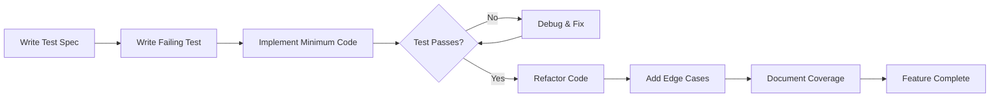

# Testing Strategy - TDD Framework & Quality Assurance

**Version**: 1.0.0  
**Last Updated**: December 16, 2025

---

## Test-Driven Development (TDD) Philosophy

We write tests BEFORE implementation. Tests define the contract, implementation fulfills it. This approach ensures every feature is validated before it's built and provides living documentation.

### TDD Workflow



### Coverage Targets

- **Service Layer**: 90%+ (business logic is critical)
- **API Routes**: 85%+ (integration points need thorough testing)
- **UI Components**: 75%+ (focus on behavior, not just rendering)
- **Critical User Flows**: 100% E2E coverage (onboarding, payments, core features)
- **Brand Compliance**: Visual regression and voice testing for brand consistency

---

## Brand Compliance Testing

All implementations must maintain brand consistency. These tests ensure visual identity, voice guidelines, and Mira personality remain consistent across the platform.

### Visual Regression Testing

Test that components match [brand visual identity](../brand/01-visual-identity.md):

```typescript
describe('Button Component - Brand Compliance', () => {
  it('primary button matches brand colors', () => {
    const button = render(<Button variant="primary">Test</Button>);
    expect(button).toHaveStyle('background-color: #002B7F'); // vibe-deep-blue
    expect(button).toHaveStyle('border-radius: 12px');
  });
  
  it('mira message has brand glow', () => {
    const message = render(<MiraMessage>Hello</MiraMessage>);
    expect(message).toHaveStyle('box-shadow: 0 0 24px rgba(91, 184, 255, 0.2)');
  });
});
```

### Voice Testing

Ensure copy matches [brand voice guidelines](../brand/03-brand-voice-messaging.md):

```typescript
describe('Error Messages - Brand Voice', () => {
  it('uses supportive language', () => {
    const message = getErrorMessage('NETWORK_ERROR');
    
    // Should NOT contain technical jargon
    expect(message).not.toContain('Error');
    expect(message).not.toContain('Failed');
    expect(message).not.toContain('500');
    
    // Should contain supportive framing
    expect(message).toMatch(/try again|let's|we/i);
  });
  
  it('empty states are inviting', () => {
    const emptyState = render(<ConnectionsList connections={[]} />);
    const text = emptyState.getByText(/meaningful connection/i);
    expect(text).toBeInTheDocument();
    expect(text).not.toHaveTextContent('0 connections');
  });
});
```

### Mira Response Testing

Ensure Mira embodies [personality guide](../brand/04-mira-personality-guide.md):

```typescript
describe('Mira Responses - Personality Compliance', () => {
  it('uses questions over commands', () => {
    const response = mira.suggestPractice(user);
    
    // Should use questions
    expect(response).toMatch(/would you like|want to|ready to/i);
    
    // Should NOT use commands
    expect(response).not.toMatch(/you should|you must|you need to/i);
  });
  
  it('uses observations over judgments', () => {
    const response = mira.missedPracticeMessage(user);
    
    // Should observe
    expect(response).toMatch(/I notice|it seems|it's been/i);
    
    // Should NOT judge
    expect(response).not.toMatch(/you missed|you failed|you haven't/i);
  });
  
  it('uses invitations over instructions', () => {
    const response = mira.recommendConnection(user, connection);
    
    // Should invite
    expect(response).toMatch(/here's|might|could/i);
    
    // Should NOT instruct
    expect(response).not.toMatch(/connect with|you need|must/i);
  });
});
```

### Accessibility Testing (Brand Standards)

Ensure [accessibility requirements](../brand/01-visual-identity.md#accessibility-requirements) are met:

```typescript
describe('Accessibility - Brand Standards', () => {
  it('color contrast meets WCAG AA', () => {
    const textOnBlue = render(<div style={{ background: '#002B7F', color: '#FFFFFF' }}>Text</div>);
    const contrast = getContrastRatio(textOnBlue);
    expect(contrast).toBeGreaterThanOrEqual(4.5); // WCAG AA for normal text
  });
  
  it('touch targets meet 44x44px minimum', () => {
    const button = render(<Button>Click</Button>);
    expect(button).toHaveStyle('min-height: 44px');
    expect(button).toHaveStyle('min-width: 44px');
  });
});
```

### Brand Compliance Test Suite

Run full brand compliance suite:

```bash
# Visual regression
npm run test:visual

# Voice compliance
npm run test:voice

# Mira personality
npm run test:mira

# Full brand suite
npm run test:brand
```

---

## Test Organization

```
tests/
├── unit/                         # Fast, isolated tests
│   ├── services/
│   │   ├── mira-service.test.ts
│   │   ├── profile-service.test.ts
│   │   ├── practice-service.test.ts
│   │   └── [other-services].test.ts
│   ├── utils/
│   │   ├── alignment-calculator.test.ts
│   │   ├── streak-calculator.test.ts
│   │   └── [other-utils].test.ts
│   └── components/
│       ├── WelcomeScreen.test.tsx
│       ├── PracticeCard.test.tsx
│       └── [other-components].test.tsx
│
├── integration/                  # API and database tests
│   ├── api/
│   │   ├── auth.test.ts
│   │   ├── mira.test.ts
│   │   ├── practices.test.ts
│   │   └── [other-routes].test.ts
│   ├── database/
│   │   ├── profiles.test.ts
│   │   ├── practices.test.ts
│   │   └── [other-tables].test.ts
│   └── stripe/
│       └── webhooks.test.ts
│
├── e2e/                          # End-to-end user flows
│   ├── onboarding.spec.ts
│   ├── practices.spec.ts
│   ├── discovery.spec.ts
│   ├── messaging.spec.ts
│   └── checkout.spec.ts
│
└── fixtures/                     # Test data and helpers
    ├── users.ts
    ├── practices.ts
    ├── communities.ts
    └── test-helpers.ts
```

---

## Unit Testing Patterns

### Service Layer Tests

```typescript
describe('PracticeService', () => {
  let service: PracticeService;
  let mockSupabase: MockSupabaseClient;
  
  beforeEach(() => {
    mockSupabase = createMockSupabase();
    service = new PracticeService(mockSupabase);
  });
  
  describe('logPractice', () => {
    it('should create practice log for today', async () => {
      const result = await service.logPractice('user-123', 'practice-456');
      
      expect(mockSupabase.from).toHaveBeenCalledWith('practice_logs');
      expect(result.log.log_date).toBe(today());
    });
    
    it('should increment streak when logged consecutively', async () => {
      // Setup: user logged yesterday
      mockSupabase.mockPreviousLog(yesterday());
      
      const result = await service.logPractice('user-123', 'practice-456');
      
      expect(result.streak.current_streak_days).toBe(2);
    });
    
    it('should reset streak when days skipped', async () => {
      // Setup: user logged 3 days ago
      mockSupabase.mockPreviousLog(threeDaysAgo());
      
      const result = await service.logPractice('user-123', 'practice-456');
      
      expect(result.streak.current_streak_days).toBe(1);
    });
    
    it('should detect achievement unlocks', async () => {
      mockSupabase.mockStreak({ current_streak_days: 20 });
      
      const result = await service.logPractice('user-123', 'practice-456');
      
      expect(result.achievement).toEqual({
        type: 'streak_milestone',
        title: '21-Day Streak!',
        description: expect.any(String)
      });
    });
  });
});
```

### Component Tests

```typescript
describe('PracticeCard', () => {
  it('should render practice name and icon', () => {
    render(<PracticeCard practice={mockPractice} onLog={jest.fn()} />);
    
    expect(screen.getByText('Meditation')).toBeInTheDocument();
    expect(screen.getByRole('img')).toHaveAttribute('src', '/icons/meditation.svg');
  });
  
  it('should call onLog when clicked', async () => {
    const onLog = jest.fn();
    render(<PracticeCard practice={mockPractice} onLog={onLog} />);
    
    await userEvent.click(screen.getByRole('button'));
    
    expect(onLog).toHaveBeenCalledWith(mockPractice.id);
  });
  
  it('should show logged state with checkmark', () => {
    render(<PracticeCard practice={mockPractice} isLogged={true} onLog={jest.fn()} />);
    
    expect(screen.getByTestId('checkmark-icon')).toBeInTheDocument();
    expect(screen.getByRole('button')).toHaveClass('opacity-50');
  });
  
  it('should meet minimum touch target size (44x44px)', () => {
    const { container } = render(<PracticeCard practice={mockPractice} onLog={jest.fn()} />);
    const button = container.querySelector('button');
    
    const styles = window.getComputedStyle(button!);
    const width = parseInt(styles.width);
    const height = parseInt(styles.height);
    
    expect(width).toBeGreaterThanOrEqual(44);
    expect(height).toBeGreaterThanOrEqual(44);
  });
});
```

---

## Integration Testing Patterns

### API Route Tests

```typescript
describe('POST /api/practices/log', () => {
  let testUser: User;
  let testPractice: Practice;
  
  beforeEach(async () => {
    testUser = await createTestUser();
    testPractice = await createTestPractice(testUser.id);
  });
  
  afterEach(async () => {
    await cleanupTestData(testUser.id);
  });
  
  it('should log practice and return streak', async () => {
    const response = await fetch('/api/practices/log', {
      method: 'POST',
      headers: {
        'Content-Type': 'application/json',
        'Cookie': `auth-token=${testUser.sessionToken}`
      },
      body: JSON.stringify({
        practiceId: testPractice.id,
        reflectionNote: 'Felt very centered today'
      })
    });
    
    expect(response.status).toBe(200);
    
    const data = await response.json();
    expect(data.success).toBe(true);
    expect(data.log.practice_id).toBe(testPractice.id);
    expect(data.streak.current_streak_days).toBe(1);
  });
  
  it('should require authentication', async () => {
    const response = await fetch('/api/practices/log', {
      method: 'POST',
      headers: { 'Content-Type': 'application/json' },
      body: JSON.stringify({ practiceId: testPractice.id })
    });
    
    expect(response.status).toBe(401);
  });
  
  it('should prevent logging someone else\'s practice', async () => {
    const otherUser = await createTestUser();
    const otherPractice = await createTestPractice(otherUser.id);
    
    const response = await fetch('/api/practices/log', {
      method: 'POST',
      headers: {
        'Content-Type': 'application/json',
        'Cookie': `auth-token=${testUser.sessionToken}`
      },
      body: JSON.stringify({ practiceId: otherPractice.id })
    });
    
    expect(response.status).toBe(403);
  });
});
```

---

## E2E Testing Patterns

### Critical User Flows

```typescript
// Onboarding Flow
test('complete onboarding end-to-end', async ({ page }) => {
  await page.goto('/');
  
  // Welcome
  await page.click('text=Enter with Intention');
  
  // Name & Location
  await page.fill('[data-testid="name-input"]', 'E2E User');
  await page.fill('[data-testid="location-input"]', 'San Francisco');
  await page.click('[data-testid="location-option"]:first');
  await page.click('text=Continue');
  
  // Intention
  await page.click('[data-testid="intention-reflect"]');
  
  // Breathwork (wait for 60 seconds)
  await page.waitForSelector('[data-testid="breathwork-complete"]', { timeout: 65000 });
  await page.click('text=Ready to keep rising');
  
  // Verify redirected
  await expect(page).toHaveURL(/\/(profile|today)/);
});

// Practice Logging Flow
test('log practice and see streak update', async ({ page, context }) => {
  const user = await createAuthenticatedUser();
  await context.addCookies([{ name: 'auth-token', value: user.sessionToken, domain: 'localhost', path: '/' }]);
  
  await page.goto('/today');
  
  // Click practice to log
  await page.click('[data-testid="practice-meditation"]');
  
  // Verify streak updated
  await expect(page.locator('[data-testid="streak-count"]')).toHaveText('1');
  
  // Verify celebration shown
  await expect(page.locator('text=Practice logged!')).toBeVisible();
});

// Connection Flow
test('discover and connect with user', async ({ page, context }) => {
  const user = await createAuthenticatedUser();
  await context.addCookies([{ name: 'auth-token', value: user.sessionToken, domain: 'localhost', path: '/' }]);
  
  await page.goto('/discover');
  
  // See recommended connections
  await expect(page.locator('[data-testid="connection-card"]')).toHaveCount.greaterThan(0);
  
  // Click connect on first recommendation
  await page.click('[data-testid="connect-button"]:first');
  
  // Verify connection requested
  await expect(page.locator('text=Connection requested')).toBeVisible();
  
  // Verify notification created for other user
  const notifications = await getNotifications(recommendedUser.id);
  expect(notifications).toContainEqual(
    expect.objectContaining({ type: 'connection_request' })
  );
});
```

### Mobile Responsiveness Tests

```typescript
test('mobile onboarding has proper touch targets', async ({ page }) => {
  await page.setViewportSize({ width: 375, height: 667 }); // iPhone SE
  
  await page.goto('/');
  
  const buttons = await page.locator('button').all();
  
  for (const button of buttons) {
    const box = await button.boundingBox();
    if (box) {
      expect(box.width, `Button too narrow: ${await button.textContent()}`).toBeGreaterThanOrEqual(44);
      expect(box.height, `Button too short: ${await button.textContent()}`).toBeGreaterThanOrEqual(44);
    }
  }
});

test('no horizontal scroll on mobile', async ({ page }) => {
  await page.setViewportSize({ width: 375, height: 667 });
  
  const pages = ['/', '/today', '/discover', '/profile', '/impact'];
  
  for (const route of pages) {
    await page.goto(route);
    
    const bodyWidth = await page.evaluate(() => document.body.scrollWidth);
    const viewportWidth = await page.evaluate(() => window.innerWidth);
    
    expect(bodyWidth, `Horizontal scroll on ${route}`).toBeLessThanOrEqual(viewportWidth);
  }
});
```

---

## Test Data Factories

```typescript
/**
 * Test fixtures for creating consistent test data
 */

export async function createTestUser(overrides?: Partial<User>): Promise<User> {
  const timestamp = Date.now();
  const defaultUser = {
    email: `test-${timestamp}@vibeup.test`,
    password: 'TestPassword123!',
    display_name: 'Test User',
    handle: `testuser_${timestamp}`,
    location: { city: 'Test City', country: 'Test Country' }
  };
  
  const userData = { ...defaultUser, ...overrides };
  
  const supabase = createTestClient();
  const { data: { user }, error } = await supabase.auth.signUp({
    email: userData.email,
    password: userData.password
  });
  
  if (error || !user) throw new Error('Failed to create test user');
  
  await supabase.from('profiles').insert({
    id: user.id,
    display_name: userData.display_name,
    handle: userData.handle,
    email: userData.email,
    location: userData.location
  });
  
  return {
    id: user.id,
    email: userData.email,
    sessionToken: (await supabase.auth.getSession()).data.session?.access_token!
  };
}

export async function createTestPractice(userId: string): Promise<Practice> {
  const supabase = createTestClient();
  
  const { data } = await supabase.from('practices').insert({
    user_id: userId,
    custom_name: 'Test Meditation',
    frequency: 'daily',
    time_of_day: ['morning']
  }).select().single();
  
  return data!;
}

export async function cleanupTestData(userId: string): Promise<void> {
  const supabase = createTestClient();
  
  // Cascade delete handles related data
  await supabase.from('profiles').delete().eq('id', userId);
  await supabase.auth.admin.deleteUser(userId);
}
```

---

## CI/CD Integration

### GitHub Actions Test Workflow

Tests run on every PR and must pass before merge.

**Jobs**:
1. Lint & Type Check (<2 min)
2. Unit Tests (<3 min)
3. Integration Tests (<5 min)
4. E2E Tests (<10 min)

**Coverage Requirements**:
- Overall: 80%+
- Service layer: 90%+
- New code: 85%+ (prevents coverage regression)

### Pre-Commit Hooks

```yaml
# .husky/pre-commit
npm run type-check
npm run lint
npm run test -- --bail --findRelatedTests
```

---

## Performance Testing

### Load Testing

```typescript
// Use k6 or Artillery for load testing
import http from 'k6/http';
import { check, sleep } from 'k6';

export const options = {
  vus: 100, // 100 virtual users
  duration: '5m',
  thresholds: {
    http_req_duration: ['p(95)<200'], // 95% of requests < 200ms
    http_req_failed: ['rate<0.01'], // Error rate < 1%
  },
};

export default function () {
  // Test practice logging under load
  const res = http.post('https://app.vibeup.io/api/practices/log', {
    practiceId: 'practice-123'
  }, {
    headers: {
      'Cookie': `auth-token=${__ENV.TEST_TOKEN}`
    }
  });
  
  check(res, {
    'status is 200': (r) => r.status === 200,
    'response time < 200ms': (r) => r.timings.duration < 200,
  });
  
  sleep(1);
}
```

---

**Related**: [`epic-00-foundation.md`](../epics/epic-00-foundation.md), all epic documents contain test specifications

