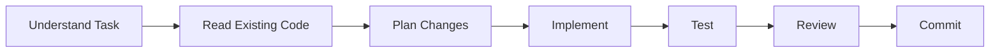

# Claude Code Configuration

> AI-driven development configuration for the baseline brand template.

---

## Overview

This document configures Claude Code for optimal development workflow with this baseline template. It auto-imports rules, agents, and commands from `ai-coding-config`.

---

## Auto-Import Configuration

```yaml
# Claude Code auto-imports
import:
  source: "@design-system/ai-coding-config"

  # Core rules (always active)
  rules:
    - rules/heart-centered-ai-philosophy.mdc
    - rules/conscious-commits.mdc
    - rules/git-interaction.mdc
    - rules/prompt-engineering.mdc

  # Language-specific rules (activate as needed)
  language_rules:
    typescript:
      - rules/typescript-standards.mdc
      - rules/react-best-practices.mdc
    python:
      - rules/python/python-standards.mdc

  # Development rules
  development_rules:
    - rules/testing-requirements.mdc
    - rules/observability.mdc
    - rules/code-review-checklist.mdc

  # Agents
  agents:
    - agents/autonomous-developer
    - agents/code-reviewer
    - agents/test-engineer

  # Commands
  commands:
    - commands/ai-coding-config
    - commands/load-rules
    - commands/review
```

---

## Project Rules

### Code Style

```markdown
# Baseline Code Style Rules

## TypeScript
- Strict mode enabled
- No `any` types allowed
- Explicit return types for functions
- Named exports preferred

## React
- Functional components only
- Server Components by default
- Client Components with "use client" directive
- Hooks follow rules of hooks

## Styling
- Tailwind CSS utilities
- CSS variables for theming
- No inline styles except for dynamic values

## Icons
- Lucide React for all icons
- No emojis in code or UI
- Icon components use currentColor

## Imports
- Absolute imports with @ alias
- Group imports: external, internal, relative
- No circular dependencies
```

### File Organization

```markdown
# File Organization Rules

## Naming Conventions
- Components: PascalCase (Button.tsx)
- Utilities: camelCase (formatDate.ts)
- Constants: SCREAMING_SNAKE_CASE
- Types: PascalCase with Type/Props suffix

## Component Structure
1. Imports
2. Types/Interfaces
3. Constants
4. Component function
5. Export

## Directory Structure
- Keep related files close
- Colocation over separation
- Index files for public exports
```

---

## Development Workflow

### Standard Workflow



### Commands

| Command | Description |
|---------|-------------|
| `/review` | Review current changes |
| `/test` | Run test suite |
| `/lint` | Check code quality |
| `/build` | Run production build |

---

## Context Files

### Always Include

These files provide essential context:

```yaml
context:
  always:
    - spec/MASTER-PLAN.md
    - spec/architecture/tech-stack.md
    - spec/brand/visual-identity.md
    - spec/development/CLAUDE.md
```

### Include When Relevant

```yaml
context:
  on_demand:
    components:
      - spec/design/GUIDELINES.md
    testing:
      - spec/operations/testing-strategy.md
    features:
      - spec/epics/*.md
```

---

## Code Generation

### Component Template

When generating new components:

```typescript
/**
 * ComponentName
 *
 * Description of the component's purpose.
 */

import { type ComponentProps } from 'react';
import { Icon } from 'lucide-react';
import { cn } from '@/lib/cn';

interface ComponentNameProps extends ComponentProps<'div'> {
  /** Prop description */
  variant?: 'default' | 'alternate';
}

export function ComponentName({
  variant = 'default',
  className,
  children,
  ...props
}: ComponentNameProps) {
  return (
    <div
      className={cn(
        'base-classes',
        variant === 'alternate' && 'alternate-classes',
        className
      )}
      {...props}
    >
      {children}
    </div>
  );
}
```

### API Route Template

When generating API routes:

```typescript
/**
 * API Route: /api/resource
 *
 * Description of the endpoint's purpose.
 */

import { NextRequest, NextResponse } from 'next/server';

export async function GET(request: NextRequest) {
  try {
    // Implementation
    return NextResponse.json({ data: [] });
  } catch (error) {
    console.error('API Error:', error);
    return NextResponse.json(
      { error: 'Internal Server Error' },
      { status: 500 }
    );
  }
}
```

---

## Testing Guidelines

### Unit Test Template

```typescript
import { describe, it, expect } from 'vitest';
import { render, screen } from '@testing-library/react';
import { ComponentName } from './ComponentName';

describe('ComponentName', () => {
  it('renders correctly', () => {
    render(<ComponentName>Content</ComponentName>);
    expect(screen.getByText('Content')).toBeInTheDocument();
  });

  it('applies variant classes', () => {
    render(<ComponentName variant="alternate">Content</ComponentName>);
    expect(screen.getByText('Content')).toHaveClass('alternate-classes');
  });
});
```

### Test Coverage Targets

| Type | Target |
|------|--------|
| Statements | > 80% |
| Branches | > 75% |
| Functions | > 80% |
| Lines | > 80% |

---

## Error Handling

### Error Boundary Pattern

```typescript
'use client';

import { Component, type ReactNode } from 'react';
import { AlertTriangle } from 'lucide-react';

interface Props {
  children: ReactNode;
  fallback?: ReactNode;
}

interface State {
  hasError: boolean;
}

export class ErrorBoundary extends Component<Props, State> {
  state = { hasError: false };

  static getDerivedStateFromError() {
    return { hasError: true };
  }

  render() {
    if (this.state.hasError) {
      return this.props.fallback ?? (
        <div className="flex items-center gap-2 p-4 text-error">
          <AlertTriangle className="h-5 w-5" />
          <span>Something went wrong</span>
        </div>
      );
    }
    return this.props.children;
  }
}
```

---

## Commit Guidelines

### Format

```
type(scope): description

[optional body]

[optional footer]
```

### Types

| Type | Usage |
|------|-------|
| `feat` | New feature |
| `fix` | Bug fix |
| `docs` | Documentation |
| `style` | Formatting |
| `refactor` | Code restructure |
| `test` | Test additions |
| `chore` | Maintenance |

### Example

```
feat(components): add Button component with icon support

- Implement Button with variant prop
- Add icon positioning (left/right)
- Include loading state with spinner icon

Closes #123
```

---

## Prohibited Patterns

### Never Do

| Pattern | Reason |
|---------|--------|
| Use emojis in code/UI | Icon-first design |
| Use `any` type | Type safety |
| Skip error handling | Reliability |
| Hardcode colors | Theming |
| Use inline styles | Maintainability |
| Import entire libraries | Bundle size |

### Always Do

| Pattern | Reason |
|---------|--------|
| Use Lucide icons | Consistency |
| Use TypeScript strict | Safety |
| Handle errors gracefully | UX |
| Use design tokens | Theming |
| Use Tailwind utilities | Maintainability |
| Tree-shake imports | Performance |

---

## Integration Points

### Design System v2

```typescript
// Import tokens
import { colors, typography, spacing } from '@design-system-v2/tokens';

// Import components (when extending)
import { Button, Card, Input } from '@design-system-v2/components';
```

### AI Coding Config

```typescript
// Rules are auto-applied via .claude/settings.json
// Agents are available via Claude Code interface
// Commands are accessible with / prefix
```

---

*Claude Configuration Version: 1.0.0*
