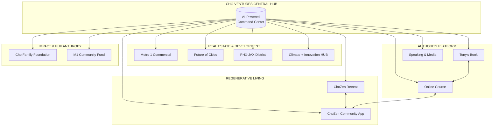

# Cho Ventures AI Ecosystem Strategy

> *Transforming a visionary real estate and impact portfolio into an AI-powered regenerative empire.*

## Quick Summary

This is a comprehensive AI integration strategy for Tony Cho and the Cho Ventures ecosystem. The plan provides a roadmap for unifying all entities—from Metro 1 Commercial to ChoZen Retreat—into a cohesive, AI-empowered platform that amplifies Tony's mission of regenerative placemaking while positioning him as a thought leader through his upcoming book, course, and community initiatives.

## The Vision

Tony Cho has built an extraordinary portfolio across real estate, climate innovation, hospitality, and philanthropy. Each entity serves a purpose in the larger mission of regenerative living. This strategy brings them together through:

- **A Central Hub** — One unified platform connecting all entities
- **AI Infrastructure** — Intelligent systems powering operations across the portfolio
- **Community Platform** — ChoZen community app as the heart of engagement
- **Authority Engine** — Book, course, and thought leadership amplification
- **Unified Dashboard** — Real-time visibility across all ventures

## The Cho Ventures Ecosystem

## Three-Phase Approach

| Phase | Focus | Deliverable |
|-------|-------|-------------|
| **Phase 1: Discovery** | AI Strategy Planning Session | Master Plan for Complete Integration |
| **Phase 2: Implementation** | Build & Deploy | Unified AI Infrastructure |
| **Phase 3: Authority** | Thought Leadership Launch | Book, Course, Community, Industry Position |

## Documentation

- [MASTER-PLAN.md](./spec/MASTER-PLAN.md) — Complete strategic specification
- [Phase 1: Discovery](./spec/phases/01-discovery.md) — AI Strategy Planning Session
- [Phase 2: Implementation](./spec/phases/02-implementation.md) — Build & Deploy Framework
- [Phase 3: Authority](./spec/phases/03-authority.md) — Thought Leadership Launch

### Entity Profiles
- [Metro 1 Commercial](./spec/entities/metro1.md) — Real Estate Brokerage
- [Future of Cities](./spec/entities/future-of-cities.md) — Development Consortium
- [PHX-JAX District](./spec/entities/phx-jax.md) — Jacksonville Arts District
- [Climate + Innovation HUB](./spec/entities/climate-hub.md) — Miami Climate Tech
- [ChoZen Retreat](./spec/entities/chozen-retreat.md) — Regenerative Retreat Center
- [Foundations](./spec/entities/foundations.md) — Cho Family Foundation & M1 Fund

### Architecture
- [Ecosystem Hub Architecture](./spec/architecture/ecosystem-hub.md) — Central Platform Design
- [AI Integration Map](./spec/architecture/ai-integration-map.md) — AI Touchpoints Across Portfolio
- [Community Platform](./spec/architecture/community-platform.md) — ChoZen App Specification

---

*Cho Ventures AI — Regenerative impact, amplified by intelligence*
