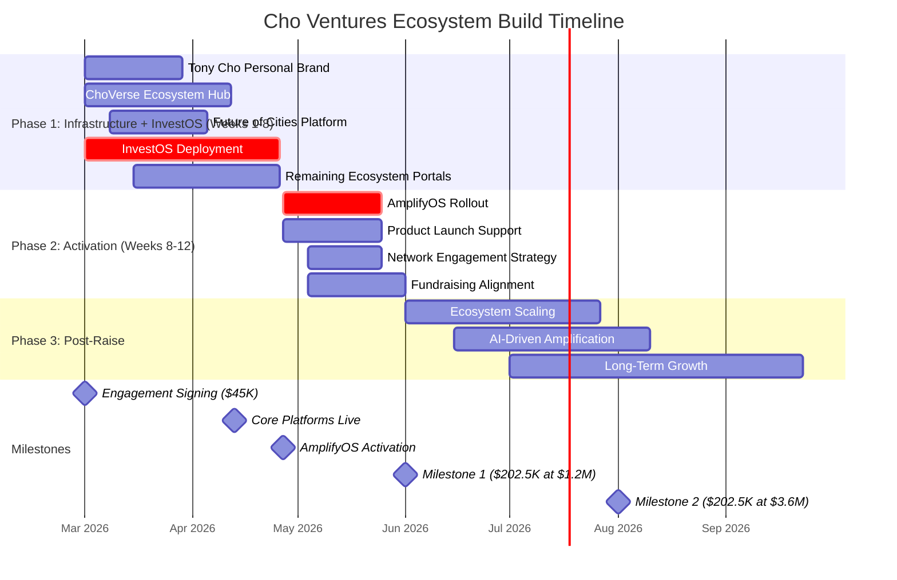

# LIGHT BRANDS
# INSTITUTIONAL INFRASTRUCTURE AND CAPITAL ACTIVATION PARTNERSHIP

> **Prepared for:** Tony Cho
> **Prepared by:** Light Brands
> **Date:** February 17, 2026
> **Raise Objective:** $12M Capital Alignment

---

## 1. Executive Overview

This proposal outlines the strategic infrastructure required to align the Tony Cho personal brand, Future of Cities initiative, and capital-readiness systems into a unified ecosystem designed to support long-term influence, creative expression, and institutional growth.

The opportunity is unique:

- A strong visionary identity
- A proven track record of creative cultural influence
- Meaningful relationships and network access
- A mission capable of attracting both community participation and institutional capital

The core challenge is structural.

At present, the vision exists across multiple ideas and initiatives without a unified system that clearly shows how people engage, participate, learn, or invest.

Light Brands operates at the intersection of strategy, systems, and execution, building institutional-grade ecosystems that transform vision into aligned momentum and capital readiness.

---

## 2. Strategic Context

Most founders and creators attempt to grow influence, launch products, and raise capital as separate efforts.

This typically results in:

- fragmented messaging
- disconnected offerings
- unclear participation paths
- momentum that depends entirely on the founder

Our methodology integrates these elements into one structured ecosystem.

The sequence becomes:

1. Build infrastructure first
2. Align narrative, products, and identity
3. Activate network and capital pathways
4. Scale with systems already in place

This approach allows momentum to compound rather than reset.

---

## 3. Ecosystem Architecture

The proposed ecosystem consists of five interconnected layers.

### Layer I. Tony Cho Personal Brand Platform

This platform becomes the creative expression of Tony Cho as a visionary, artist, builder, and cultural influence.

**Purpose:**

- Express the creative identity behind the work
- Showcase artistic influence and legacy, including cultural impact such as Wynwood
- Promote personal offerings including books, courses, and educational products
- Serve as the primary vehicle for audience engagement and storytelling

**Strategic Direction:**

This is not simply a personal website. It is a living creative platform that reflects how Tony thinks, builds, and influences culture. The tone and design should feel like an expression of the creator himself.

### Layer II. ChoVerse Ecosystem Hub

ChoVerse serves as the central container connecting all activity within the Tony Cho universe.

**Purpose:**

- Aggregate news, activity, offerings, art, and community initiatives
- Highlight ongoing projects and collaborations
- Create a consistent destination where people follow the broader movement
- Act as the amplification center for ongoing visibility and engagement

ChoVerse sits between personal brand and institutional positioning. It becomes the place where the community experiences the ecosystem in motion.

### Layer III. Future of Cities Platform

Future of Cities remains institutional in tone and execution.

**Purpose:**

- Position the larger mission with professional credibility
- Present projects and initiatives at an institutional level
- Support strategic partnerships and investor confidence

Navigation structure includes clear pathways back to "Meet Tony," ensuring alignment between visionary identity and institutional initiatives.

### Layer IV. InvestOS (Infrastructure Layer)

InvestOS forms the operational foundation beneath the ecosystem.

**Purpose:**

- Capital alignment architecture
- Investor-facing readiness systems
- Structured engagement pathways
- Narrative-to-financial alignment

InvestOS transforms visibility into investability by creating infrastructure that institutional stakeholders can evaluate and trust.

### Layer V. AmplifyOS (Capital and Network Activation Layer)

Once infrastructure is established, AmplifyOS activates the ecosystem across Tony's network and audience.

**Purpose:**

- Strategic amplification of ChoVerse and ecosystem activity
- Promotion of products, launches, and offerings under the personal brand
- Narrative-driven network activation supporting fundraising momentum
- Campaign architecture that converts visibility into participation and investment

AmplifyOS ensures infrastructure becomes movement, not static assets.

---

## 4. Scope of Work

### 4.1 Tony Cho Personal Brand Platform

**Scope includes:**

- Strategic narrative and positioning architecture
- Creative direction reflecting artistic identity
- Product ecosystem integration including book launch and courses
- Digital platform design and development
- Audience engagement flows
- AI-powered amplification foundations

**Outcome:**
A living personal platform that expresses identity while delivering products and ongoing engagement opportunities.

### 4.2 ChoVerse Ecosystem Hub

**Scope includes:**

- Ecosystem architecture design
- Centralized content and activity framework
- News, community, and offering integration
- Platform experience designed for ongoing amplification

**Outcome:**
A dynamic hub that connects all initiatives into one coherent universe.

### 4.3 Future of Cities Platform

**Scope includes:**

- Institutional positioning framework
- Narrative and brand architecture
- Project-focused digital infrastructure
- Strategic navigation linking back to personal brand

**Outcome:**
A professional, institutional-facing platform supporting partnerships and credibility.

### 4.4 InvestOS Infrastructure

**Scope includes:**

- Capital alignment architecture
- Investor-facing system design
- Participation pathways
- Strategic infrastructure supporting fundraising readiness
- Financial and narrative integration

**Outcome:**
Institutional-grade ecosystem ready for capital participation.

### 4.5 AmplifyOS Capital Activation

**Scope includes:**

- Strategic amplification strategy
- Network activation pathways
- Messaging for product launches and fundraising momentum
- Campaign structure designed to convert attention into action
- Advisory during fundraising activation phase

**Outcome:**
A system that actively drives participation toward the $12M raise objective while growing the broader ecosystem.

### 4.6 Full Ecosystem Web Portal Build-Out

This engagement includes the core web infrastructure for every business and initiative within the Cho Ventures ecosystem. Each portal receives foundational design, development, and integration into the ChoVerse hub.

**Platforms included:**

| Entity | Portal Type | Description |
|--------|------------|-------------|
| Tony Cho Personal Brand | Creative Platform | Artistic identity, book, course, storytelling |
| ChoVerse | Ecosystem Hub | Central activity aggregator for the entire universe |
| Cho Ventures | Family Office Portal | Portfolio overview, investor relations |
| Future of Cities | Institutional Platform | Regenerative placemaking, projects, partnerships |
| Metro 1 Commercial | Brokerage Platform | Commercial real estate, agent profiles, listings |
| PHX-JAX District | District Portal | Arts and innovation district, events, community |
| Climate + Innovation HUB | Incubator Platform | Climate tech programs, startups, events |
| ChoZen Center (CCRL) | Program Portal | Artisan market, farm days, residency, youth camp |
| ChoZen IP | Brand and Membership Portal | Membership platform, Casa Colibri, gift shop |
| Book Platform | Product Launch Site | Generation Regeneration, Soft Power |
| Online Course | Education Portal | Courses, certification, learning paths |
| Speaking and Media | Thought Leadership Portal | Engagements, podcast, media presence |
| Cho Family Foundation | Philanthropy Portal | DAF, conservation, culture preservation |
| Ximena Cho Legacy Fund | Legacy Portal | DAF, community development, cultural preservation |
| Friends of PHXJAX | Community Nonprofit Portal | Bloom Labs, Spring Mural Jam, arts programming |

**Exclusions:**

- ChoZen mobile application or native app development
- Advanced AI or machine learning functionality within individual platforms
- Custom software beyond standard web portal infrastructure
- Third-party system integrations requiring custom API development

**What is included per portal:**

- Strategic positioning and narrative architecture
- Responsive web design and development
- Content management infrastructure
- Integration into ChoVerse ecosystem hub
- Consistent design language across the ecosystem
- SEO and discoverability foundations

**Outcome:**
Every entity in the Cho Ventures ecosystem has a professional, functional web presence connected through ChoVerse, creating a unified digital infrastructure that supports the $12M raise narrative.

---

## 5. Engagement Philosophy

Light Brands operates as institutional infrastructure partners rather than external vendors.

This partnership integrates strategy, systems, and execution so that vision, identity, and capital move together.

**Total Engagement Value: $450,000**

This reflects the full scope of ecosystem architecture, infrastructure deployment, capital activation systems, and ongoing strategic advisory required to execute at this level. Typical engagements of this nature begin at $250,000+, reflecting the strategic rigor and integrated execution involved.

---

## 6. Partnership Structure

Because of the strategic opportunity and growth stage of the ecosystem, this partnership is structured as a fully aligned model where Light Brands' compensation is directly tied to the success of the raise.

### Fee Structure

| Component | Amount | Timing |
|-----------|--------|--------|
| **Upfront (10%)** | $45,000 | Upon engagement signing |
| **Deferred (90%)** | $405,000 | Tied to raise milestones |

### Deferred Fee Schedule

| Milestone | Raise Progress | Amount | Trigger |
|-----------|---------------|--------|---------|
| **Milestone 1** | 10% of $12M raised ($1.2M) | $202,500 | 50% of deferred fees |
| **Milestone 2** | 30% of $12M raised ($3.6M) | $202,500 | Remaining 50% of deferred fees |

**The only way Light Brands is paid in full is if the raise succeeds.** This creates complete alignment between both parties. Light Brands bears the execution risk alongside Cho Ventures, ensuring every decision and deliverable is oriented toward capital activation.

### Equity Component

In addition to the fee structure above, Light Brands will seek to secure **$450,000 in equity at pre-money valuation** based on FoC QOF Net Asset Value.

**Equity Terms:**

| Term | Detail |
|------|--------|
| **Equity Value** | $450,000 |
| **Valuation Basis** | Pre-money (FoC QOF NAV: $35.3M) |
| **Ownership** | ~1.27% ($450K / $35.3M) |
| **Vesting** | Fully vests at time of completed raise |
| **Liquidity** | Can be sold at any time after the raise closes |

This structure protects the long-term interests of both parties by ensuring Light Brands remains a committed partner well beyond the initial engagement.

### Ongoing Partnership Commitment

As an equity partner, Light Brands commits to:

- Ongoing advisory support for the entire Cho Ventures ecosystem
- Strategic guidance on ecosystem growth, positioning, and activation
- Development support for the ChoVerse and connected platforms

**Future platforms and initiatives beyond this engagement will be quoted at an at-cost basis** for as long as Light Brands remains an equity partner under Option 2. This eliminates margin on future work and ensures the ecosystem continues to grow without premium pricing on infrastructure.

### Total Partnership Value

| Component | Value |
|-----------|-------|
| **Cash Engagement** | $450,000 |
| **Equity Position** | $450,000 (at pre-money NAV of $35.3M) |
| **Total Alignment** | $900,000 |

This dual structure ensures Light Brands is fully invested in the long-term success of the ecosystem, not just the initial build.

---

## 7. Engagement Options

### OPTION 1. Brand and Ecosystem Foundation

**Includes:**

- Tony Cho Personal Brand Platform
- ChoVerse Ecosystem Hub
- Future of Cities platform
- Messaging and positioning systems

**Investment:**
$45,000 upfront (covers foundation build)

**Outcome:**
Clear identity, product delivery platform, and ecosystem cohesion. Does not include capital activation infrastructure or raise alignment.

---

### OPTION 2. Full Ecosystem and Capital Activation (Recommended)

**Includes:**

- Everything in Option 1
- Web portals for all 15 ecosystem entities (see Section 4.6)
- InvestOS infrastructure deployment
- AmplifyOS capital activation layer
- Strategic systems supporting the $12M raise objective
- Investor-facing ecosystem alignment
- Ongoing advisory during fundraising activation
- Future platform work quoted at cost basis as equity partner

**Investment Structure:**

| Payment | Amount | When |
|---------|--------|------|
| Upfront | $45,000 | Upon signing |
| Milestone 1 | $202,500 | When $1.2M raised (10% of $12M) |
| Milestone 2 | $202,500 | When $3.6M raised (30% of $12M) |
| **Total Cash** | **$450,000** | |
| Equity | $450,000 | At pre-money NAV ($35.3M), vests at full raise |

**Outcome:**
Creative expression, ecosystem engagement, and capital readiness operate as one unified system. Light Brands' incentives are fully aligned with raise success. Future development beyond this engagement is quoted at cost, not market rate.

---

## 8. Strategic Recommendation

Visibility without infrastructure creates fragmentation.
Infrastructure without amplification creates stagnation.

The full ecosystem approach integrates:

- creative identity
- community and activity
- institutional credibility
- capital activation

from the beginning.

---

## 9. Capital Alignment Context

### Raise Overview

| Parameter | Detail |
|-----------|--------|
| **Raise Objective** | $12M |
| **Entity** | FoC QOF LLC (Delaware) |
| **Pre-Money Valuation (NAV)** | $35.3M |
| **Post-Money Valuation** | $47.3M ($35.3M + $12M) |
| **Total Engagement Value** | $450,000 (cash) + $450,000 (equity) |
| **Upfront Investment** | $45,000 (10%) |
| **Deferred Fees** | $405,000 (90%), tied to raise milestones |
| **Milestone 1** | $202,500 at $1.2M raised (10% of raise) |
| **Milestone 2** | $202,500 at $3.6M raised (30% of raise) |
| **Equity Position** | $450,000 at pre-money NAV ($35.3M), ~1.27% ownership |
| **Equity Vesting** | Fully vests at completed raise |
| **Equity Liquidity** | Can be sold at any time after raise closes |
| **Ecosystem Layers** | 5 (Personal Brand, ChoVerse, Future of Cities, InvestOS, AmplifyOS) |
| **Web Portals Delivered** | 15 platforms across the entire ecosystem |
| **Future Work** | At-cost basis for equity partners (Option 2) |
| **Recommended Path** | Option 2: Full Ecosystem and Capital Activation |

### Pre-Money vs Post-Money Valuation

| Metric | Value |
|--------|-------|
| **Assets** | $51.8M |
| **Liabilities** | $16.5M |
| **Net Asset Value (Pre-Money)** | $35.3M |
| **Equity Invested to Date** | $7.5M |
| **NAV / Invested Equity** | 4.7x |
| **New Capital (Raise)** | $12.0M |
| **Post-Money Valuation** | $47.3M |
| **Light Brands Equity at Pre-Money** | $450K = 1.27% ownership |
| **That 1.27% at Post-Money** | ~$601K in value |

### Economics in Context

| Metric | Value | Percentage of Raise |
|--------|-------|-------------------|
| **Total Raise** | $12,000,000 | 100% |
| **Upfront Cash Required** | $45,000 | 0.375% |
| **Total Cash Fees (if raise succeeds)** | $450,000 | 3.75% |
| **Equity Position** | $450,000 | 3.75% |
| **Total Alignment** | $900,000 | 7.5% |

**What $45,000 upfront (0.375% of the raise) delivers:**

- 15 web portals across the entire Cho Ventures ecosystem
- 5-layer strategic infrastructure (Personal Brand, ChoVerse, FoC, InvestOS, AmplifyOS)
- Capital activation systems aligned to the $12M raise
- Investor-facing ecosystem architecture
- Ongoing strategic advisory
- Future platform development at cost (Option 2)

**What the full $450,000 in cash represents:**

- 3.75% of the $12M raise
- 90% of that amount ($405,000) is only paid if the raise succeeds
- This covers institutional-grade ecosystem architecture for 15+ entities
- Typical engagements of this nature begin at $250,000+ for a single platform

**What $450,000 in equity represents:**

- 1.27% ownership at pre-money NAV of $35.3M
- At post-money ($47.3M), that position is worth approximately $601,000
- Vests only when the full raise closes
- Ensures Light Brands remains a long-term committed partner
- Unlocks at-cost pricing on all future development

### How the Ecosystem Supports the Raise

| Layer | Capital Function |
|-------|-----------------|
| Tony Cho Personal Brand | Drives attention, trust, and audience connection |
| ChoVerse | Creates visible momentum and ecosystem cohesion |
| Future of Cities | Provides institutional credibility for investors |
| InvestOS | Makes the ecosystem investable with structured pathways |
| AmplifyOS | Converts infrastructure into movement and capital participation |

---

## 10. Implementation Timeline

Light Brands operates at speed. InvestOS starts day one alongside the platform builds. The full infrastructure is delivered in 8 weeks. AmplifyOS activates on the back side of core platforms going live.

### Phase 1. Infrastructure + InvestOS (Weeks 1-8)

All work runs in parallel from day one:

- Tony Cho personal brand platform (weeks 1-4)
- ChoVerse ecosystem hub (weeks 1-6)
- Future of Cities platform (weeks 2-5)
- InvestOS capital readiness infrastructure (weeks 1-8, concurrent)
- Remaining ecosystem portals (weeks 3-8)

### Phase 2. Activation (Weeks 8-12)

Once core platforms are live, AmplifyOS activates:

- AmplifyOS rollout (beginning of month 3)
- Product launch support
- Network engagement strategy
- Fundraising alignment

### Phase 3. Post-Raise Expansion (Month 4+)

- Ecosystem scaling
- Advanced AI-driven amplification
- Long-term growth infrastructure

---

## 11. Closing Perspective

You already possess the vision, creativity, and influence required to build something meaningful at scale.

The decision now is sequencing.

Build separate pieces over time, or
Build the full ecosystem once so creativity, community, products, and capital all move together.

Light Brands is prepared to act as a long-term strategic partner in building and activating the infrastructure beneath the ChoVerse.

---

## Ecosystem Layer Breakdown

### LAYER 1: Tony Cho Personal Brand
**Role:** Creative Identity Engine

- Creative expression and storytelling
- Book launch, course, and personal offerings
- Artistic influence and cultural narrative
- Entry point for audience connection

**Output:** Attention, Identity, Community connection

### LAYER 2: ChoVerse
**Role:** Ecosystem Hub

- News, activity, offerings, art, and community
- Central destination for all ongoing initiatives
- Living platform showing momentum in real time

**Output:** Ecosystem cohesion, Community engagement, Ongoing visibility

### LAYER 3: Future of Cities
**Role:** Institutional Platform

- Project-focused narrative
- Professional credibility
- Partnership and institutional alignment
- Navigation back to Meet Tony

**Output:** Institutional trust, Strategic positioning

### LAYER 4: InvestOS
**Role:** Infrastructure Layer

- Capital alignment architecture
- Investor-facing systems
- Participation pathways
- Narrative-to-financial alignment

**Output:** Investability, Institutional readiness

### LAYER 5: AmplifyOS
**Role:** Activation Engine

- Amplifies ChoVerse and ecosystem activity
- Network activation campaigns
- Product launches and fundraising momentum
- Strategic visibility designed for conversion

**Output:** Movement, Participation, Capital engagement

### FINAL OUTCOME: Capital Alignment and Raise Readiness

- Ecosystem prepared for institutional participation
- Audience, narrative, and infrastructure operating together
- Momentum directed toward a $12M raise objective

---

## Presentation Deck Structure

### Slide 1: Title
**Building the Infrastructure Beneath the Vision**
Tony Cho Ecosystem Proposal

### Slide 2: What We Heard
**The Vision We're Aligning Around**
- Creative visionary with cultural influence
- Passion for art, community, and city-building
- Multiple initiatives already in motion
- Desire to create clear pathways for participation and capital

### Slide 3: The Core Challenge
**Influence Exists. Infrastructure Does Not Yet.**
- Multiple initiatives without one unified system
- People resonate but lack clear entry points
- Products, community, and projects disconnected
- Capital requires visible structure

Influence without infrastructure creates confusion.

### Slide 4: The Strategic Shift
**From Separate Projects to One Ecosystem**
Disconnected pieces to Unified ecosystem

### Slide 5: The Ecosystem Map
**ChoVerse Ecosystem Architecture**
Tony Personal Brand > ChoVerse > Future of Cities > InvestOS > AmplifyOS > $12M Capital Alignment

### Slide 6: Tony Cho Personal Brand
**Creative Identity Platform**
- Artistic and cultural expression
- Legacy and creative influence (Wynwood reference)
- Book launch and course platform
- Personal narrative and storytelling
- Entry point for audience connection

### Slide 7: ChoVerse
**The Living Ecosystem Hub**
- News, activity, offerings, art, community
- Central destination for everything happening
- Ongoing momentum visible in one place
- The platform we amplify continuously

### Slide 8: Future of Cities
**Institutional Platform**
- Professional, project-focused positioning
- Institutional credibility
- Strategic partnerships and initiatives
- Navigation back to Meet Tony

### Slide 9: InvestOS
**Infrastructure Layer**
- Capital alignment architecture
- Investor-facing systems
- Participation pathways
- Narrative and financial alignment

### Slide 10: AmplifyOS
**Activation Engine**
- Amplifies ChoVerse activity
- Supports launches and offerings
- Activates network engagement
- Converts momentum into participation and investment

### Slide 11: Why This Order Matters
**Two Paths Forward**
LEFT: Brand > Attention > Need Infrastructure > Rebuild
RIGHT: Brand + Infrastructure + Amplification > Raise > Scale

### Slide 12: Value Anchor
**Institutional Engagement Level**
$450,000
Total ecosystem architecture and capital activation value.
15 web portals. 5 infrastructure layers. Full ecosystem build.

### Slide 12.5: The Economics
**What This Represents**
- $45K upfront = 0.375% of the $12M raise
- $450K total cash = 3.75% of the raise (90% deferred)
- $450K equity at pre-money NAV ($35.3M) = 1.27% ownership
- At post-money ($47.3M), that equity is worth ~$601K
- Total alignment: $900K = 7.5% of raise
- Future platform work at cost, not market rate

### Slide 13: Option 1
**Brand and Ecosystem Foundation**
- Personal Brand Platform
- ChoVerse Hub
- Future of Cities platform
- Investment: $45K upfront
- Outcome: Clear identity and ecosystem cohesion

### Slide 14: Option 2 (Recommended)
**Full Ecosystem and Capital Activation**
- Everything in Option 1
- 15 web portals across the entire ecosystem
- InvestOS infrastructure
- AmplifyOS activation
- Capital alignment systems supporting $12M raise
- Investment: $45K upfront, $202.5K at 10% raise, $202.5K at 30% raise
- $450K equity at pre-money NAV ($35.3M), vests at full raise
- 90% of fees deferred until the raise succeeds
- All future development at cost basis

### Slide 15: Moment of Truth Close
Build separate pieces over time
OR
Build the ecosystem once.

### Slide 16: Execution Timeline
- Phase 1 (Weeks 1-8): Full infrastructure + InvestOS built in parallel, all 15 portals live
- Phase 2 (Weeks 8-12): AmplifyOS activates on the back side of core platforms
- Phase 3 (Month 4+): Raise momentum, ecosystem scaling

### Slide 17: Next Steps
- Confirm direction
- Finalize agreement
- Kickoff alignment session
- Begin ecosystem build

---

## Speaker Notes

### Ecosystem Diagram Presentation

"This is the entire system in one view."
Pause.
"Your personal brand creates connection and creative energy."
"ChoVerse becomes the living universe where everything happening around you is visible."
"Future of Cities creates institutional credibility."
"InvestOS makes it investable."
"And AmplifyOS activates the whole ecosystem so momentum actually moves toward capital."
Then stop talking. Let them process.

### Slide 6 (Personal Brand)
"This isn't a typical personal brand site. It should feel like a creative expression of you."

### Slide 7 (ChoVerse)
"ChoVerse becomes the universe people enter to stay connected to everything you're building."

### Slide 8 (Future of Cities)
"This is intentionally separate in tone. Institutional clarity lives here."

### Slide 9 (InvestOS)
"InvestOS makes the ecosystem investable."

### Slide 10 (AmplifyOS)
"This is where momentum turns into movement."

### Slide 11 (Why This Order Matters)
"Neither path is wrong. One simply removes future friction."
Pause.

### Slide 12 (Value Anchor)
Pause after saying the number.
"This is $450,000 in infrastructure, strategy, and activation. 15 web portals for every entity in the ecosystem. But we're structuring this differently because we believe in the opportunity."
Pause again.
"90% of our fee is deferred. We only get paid when the raise moves forward. And we're seeking equity at pre-money valuation because we want to be long-term partners, not vendors."

### Slide 12.5 (The Economics)
"Let me put this in context."
"$45,000 upfront is less than four-tenths of one percent of the raise. That gets the entire ecosystem build started."
"The full $450,000 in cash is 3.75% of the raise, and 90% of that only gets paid if the raise succeeds."
"The equity is priced at pre-money NAV of $35.3 million. That's 1.27% ownership. It only vests when the raise closes, and you can sell it any time after."
"As equity partners, we commit to advising and developing the entire Cho Ventures ecosystem going forward. And any future platforms beyond this engagement get quoted at cost, not market rate."
Pause.
"The economics here are heavily in your favor."

### Slide 14 (Option 2)
"This is the path that aligns creativity, community, and capital from day one."
"$45,000 gets the full ecosystem build started. All 15 portals. The remaining $405,000 is tied to raise milestones. We don't get paid unless this works. That's how aligned we are."
"On top of that, we're taking equity at pre-money valuation. $450K at $35.3 million NAV. It vests when the raise closes, can be sold after. We want skin in the game because we believe in what this becomes."
"And as equity partners, everything we build for you beyond this engagement is at cost. No margin. Because we're invested in the outcome, not the invoice."

### Slide 15 (Close)
Use the 90-second close.
End with: "Which path feels more aligned with how you want to build this?"
Silence.

### Slide 17 (Final 3 minutes)
Reconfirm decision.
Future project.
"From our side we're clear this is the right path."

---

*Light Brands | Institutional Infrastructure and Capital Activation Partnership*
*Total Value: $450,000 + $450,000 Equity (Pre-Money NAV $35.3M) | 10% Upfront, 90% Raise-Aligned | $12M Raise | 15 Platforms | At-Cost Future Development*
