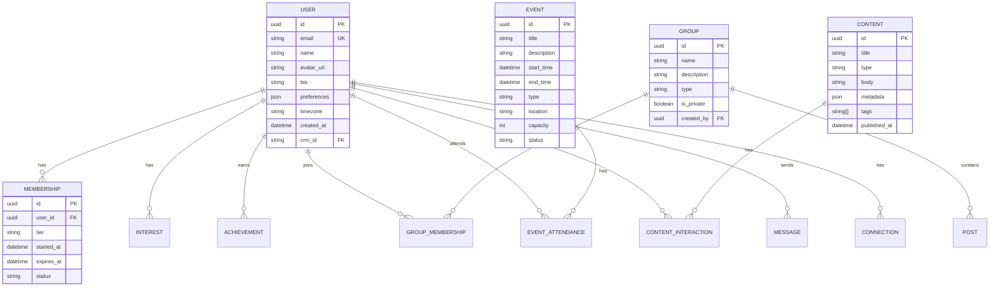

# ChoZen Community Platform Specification

> *The heart of the Cho Ventures ecosystem—where Tony's community comes together.*

---

## Overview

The ChoZen Community Platform is a mobile-first application that serves as the central gathering place for everyone touched by Tony Cho's vision of regenerative living. It connects book readers, course students, retreat guests, and regenerative enthusiasts into a thriving community.

---

## Platform Vision

---

## User Personas

### Primary Personas

| Persona | Description | Primary Needs |
|---------|-------------|---------------|
| **The Seeker** | Discovered Tony through book/media, wants to learn | Education, inspiration, community |
| **The Practitioner** | Taking the course, applying principles | Structured learning, support, accountability |
| **The Retreat Guest** | Visited ChoZen, wants to stay connected | Community, continued practice, return visits |
| **The Developer** | Real estate/development professional | Professional network, methodology, projects |
| **The Activist** | Climate/community focused | Action opportunities, like-minded network |
| **The Entrepreneur** | Building regenerative business | Resources, mentorship, partnerships |

### Persona Journeys

---

## Feature Specification

### Core Features (MVP)

### Full Platform Features

| Category | MVP Features | Future Features |
|----------|-------------|-----------------|
| **Onboarding** | Registration, profile, interests | Progressive profiling, AI-guided setup |
| **Content** | Article/video/practice library | AI recommendations, personalized paths |
| **Community** | Directory, messaging, groups | Forums, local chapters, mentorship matching |
| **Events** | Calendar, RSVP, virtual access | Live streaming, recording library, breakout rooms |
| **Learning** | Course access (if enrolled) | Micro-lessons, quizzes, certificates |
| **Gamification** | Basic progress tracking | Points, badges, levels, challenges |
| **Commerce** | Retreat booking links | In-app purchases, merchandise, credits |
| **Notifications** | Push, email | AI-optimized timing, preference learning |

---

## Technical Architecture

### System Architecture

### Data Model

### Technology Stack

| Layer | Technology | Rationale |
|-------|------------|-----------|
| **iOS** | React Native or Swift | Cross-platform efficiency or native performance |
| **Android** | React Native or Kotlin | Cross-platform efficiency or native performance |
| **Web** | React + Next.js | SEO, PWA capabilities |
| **API** | Node.js/Express or FastAPI | Performance, ecosystem |
| **Database** | PostgreSQL | Reliability, JSON support |
| **Cache** | Redis | Speed, real-time features |
| **Search** | Elasticsearch or Algolia | Fast member/content search |
| **Storage** | AWS S3 + CloudFront | Scalable media delivery |
| **Auth** | Auth0 or Supabase Auth | SSO integration, security |
| **Notifications** | OneSignal or Firebase | Cross-platform push |

---

## AI Integration

### AI-Powered Features

### AI Feature Details

| Feature | Description | AI Approach |
|---------|-------------|-------------|
| **Content Recommendations** | Suggest articles, videos, practices | Collaborative filtering + content similarity |
| **Connection Suggestions** | Match members with similar interests | Profile matching + behavior clustering |
| **Learning Paths** | Personalized course journeys | Progress analysis + goal matching |
| **Q&A Companion** | Answer questions about book/course | RAG over Tony's content |
| **Smart Search** | Semantic search across content | Vector embeddings + search |
| **Re-engagement** | Win back inactive members | Churn prediction + personalized outreach |

---

## Membership Tiers

### Tier Structure

### Tier Benefits

| Feature | Free | Essentials | Premium | Founder |
|---------|------|------------|---------|---------|
| Basic content library | 10 items | Full | Full | Full |
| Community directory | View only | Message | Message | Priority |
| Events | View | RSVP free events | All events | VIP access |
| Interest groups | 1 group | 3 groups | Unlimited | Create groups |
| Course access | Previews | - | Full | Full + extras |
| AI companion | Limited | Standard | Enhanced | Priority |
| Retreat discount | - | 5% | 10% | 15% |
| Live sessions | - | Monthly | Weekly | Private access |
| Tony access | - | - | Q&A sessions | Direct channel |
| Merchandise | - | - | Quarterly gift | Monthly gift |

---

## Content Strategy

### Content Types

| Type | Description | Frequency |
|------|-------------|-----------|
| **Articles** | Written pieces on regenerative topics | 3-5/week |
| **Videos** | Tony's teachings, retreat glimpses | 2-3/week |
| **Practices** | Guided meditations, exercises | 2/week |
| **Podcasts** | Audio content, interviews | 1/week |
| **Courses** | Structured learning modules | Evergreen |
| **Live Sessions** | Real-time events with Tony | Weekly |
| **Member Stories** | Community member features | 2/week |

### Content Pillars

| Pillar | Topics |
|--------|--------|
| **Regenerative Philosophy** | Core principles, Tony's teachings |
| **Place & Design** | Architecture, urban design, development |
| **Personal Practice** | Wellness, mindfulness, daily rituals |
| **Community Building** | Leadership, collaboration, movements |
| **Climate & Impact** | Environment, sustainability, action |
| **Retreat Life** | ChoZen experiences, nature, wildlife |

---

## Event Types

### Virtual Events

| Type | Description | Frequency |
|------|-------------|-----------|
| **Live Q&A** | Tony answers community questions | Weekly |
| **Workshops** | Interactive learning sessions | Bi-weekly |
| **Meditation Sessions** | Guided group practices | Daily |
| **Book Clubs** | Discussion of Tony's book chapters | Monthly |
| **Expert Interviews** | Conversations with regenerative leaders | Bi-weekly |
| **Member Showcases** | Community members share projects | Monthly |

### In-Person Events

| Type | Description | Location |
|------|-------------|----------|
| **Retreat Days** | Single-day ChoZen experiences | Sebastian, FL |
| **City Meetups** | Local community gatherings | Major cities |
| **Annual Summit** | Full community gathering | Rotating |
| **PHX-JAX Events** | Arts and culture programming | Jacksonville, FL |
| **Climate HUB Programs** | Innovation and learning | Miami, FL |

---

## Gamification System

### Progress & Achievements

### Badge Categories

| Category | Badges |
|----------|--------|
| **Learning** | Book Reader, Course Completer, Practice Pro |
| **Community** | Connector, Discussion Leader, Mentor |
| **Events** | Event Regular, Retreat Veteran, Summit Attendee |
| **Contribution** | Content Creator, Volunteer, Ambassador |
| **Milestones** | 1 Year Member, 100 Days Streak, Top Contributor |

---

## Metrics & Analytics

### Key Metrics

| Category | Metrics |
|----------|---------|
| **Growth** | New members, conversion rate, source attribution |
| **Engagement** | DAU/MAU, session length, content consumption |
| **Retention** | Churn rate, cohort retention, tier upgrades |
| **Community** | Messages sent, connections made, group activity |
| **Events** | Attendance rate, satisfaction, repeat attendance |
| **Revenue** | MRR, ARPU, LTV, conversion by tier |

### Health Dashboard

```mermaid
flowchart LR
    subgraph METRICS["COMMUNITY HEALTH DASHBOARD"]
        GROWTH[Growth<br/>📈 +12%]
        ENGAGEMENT[Engagement<br/>⚡ 68% MAU]
        RETENTION[Retention<br/>🔄 85%]
        NPS[NPS<br/>💜 72]
    end
```

---

## Integration Points

### Ecosystem Hub Integration

| Data Flow | Description |
|-----------|-------------|
| **Member Sync** | All members synced to central CRM |
| **Activity Events** | Key actions sent to CRM for scoring |
| **Segment Sync** | CRM segments available for targeting |
| **Automation Triggers** | Community actions trigger hub workflows |

### Course Platform Integration

| Integration | Description |
|-------------|-------------|
| **Progress Sync** | Course progress visible in app |
| **Certificate Display** | Certificates shown on profile |
| **Deep Links** | Course content accessible from app |
| **AI Companion** | Course tutor available in community |

### Retreat Integration

| Integration | Description |
|-------------|-------------|
| **Booking Flow** | Reserve retreats from app |
| **Past Stays** | Visit history on profile |
| **Pre-Arrival** | Content and prep before visit |
| **Post-Stay** | Community engagement after retreat |

---

## Security & Privacy

### Data Protection

| Measure | Implementation |
|---------|----------------|
| **Authentication** | OAuth 2.0, MFA optional |
| **Authorization** | Role-based access control |
| **Encryption** | TLS in transit, AES-256 at rest |
| **Privacy** | GDPR/CCPA compliance, consent management |
| **Moderation** | AI-assisted + human review |

### Privacy Controls

| Control | Description |
|---------|-------------|
| **Profile Visibility** | Public, members-only, private |
| **Message Settings** | Anyone, connections, none |
| **Activity Visibility** | Show/hide activity feed |
| **Data Export** | Download all personal data |
| **Deletion** | Full account deletion |

---

## Development Roadmap

### MVP (Months 1-3)

- [ ] Core authentication and profiles
- [ ] Basic content library
- [ ] Member directory and messaging
- [ ] Event calendar and RSVP
- [ ] Push notifications
- [ ] Retreat booking integration

### V1.0 (Months 4-6)

- [ ] Interest groups
- [ ] Enhanced content recommendations
- [ ] Basic gamification
- [ ] Course integration
- [ ] AI Q&A companion
- [ ] Improved onboarding

### V2.0 (Months 7-12)

- [ ] Local chapters
- [ ] Full gamification system
- [ ] Live streaming
- [ ] Advanced AI features
- [ ] In-app purchases
- [ ] Mentorship matching

---

*The ChoZen Community Platform—where regenerative living becomes a movement.*
