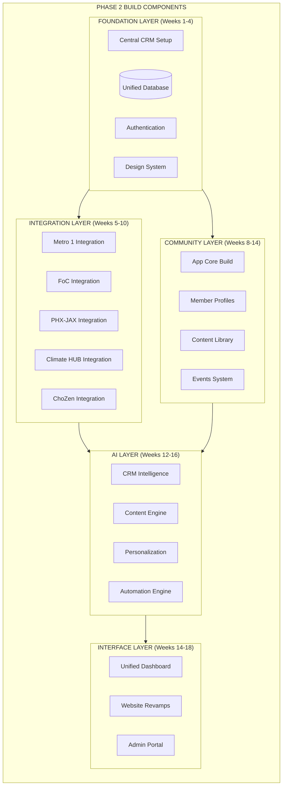
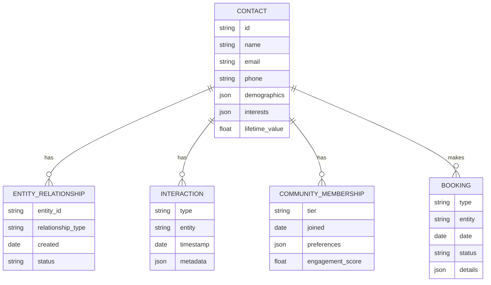
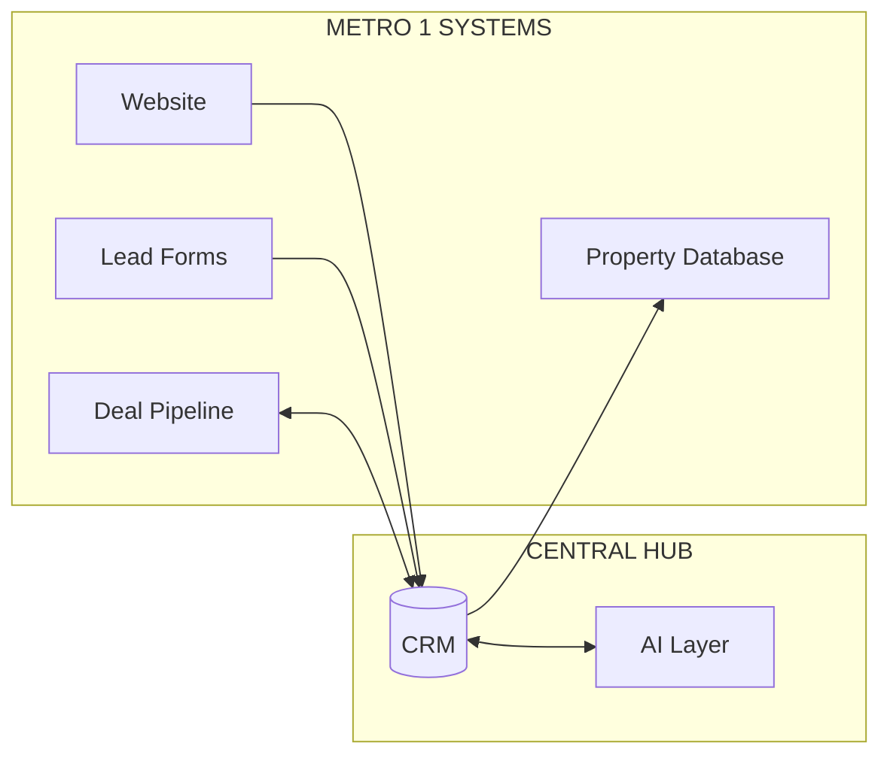
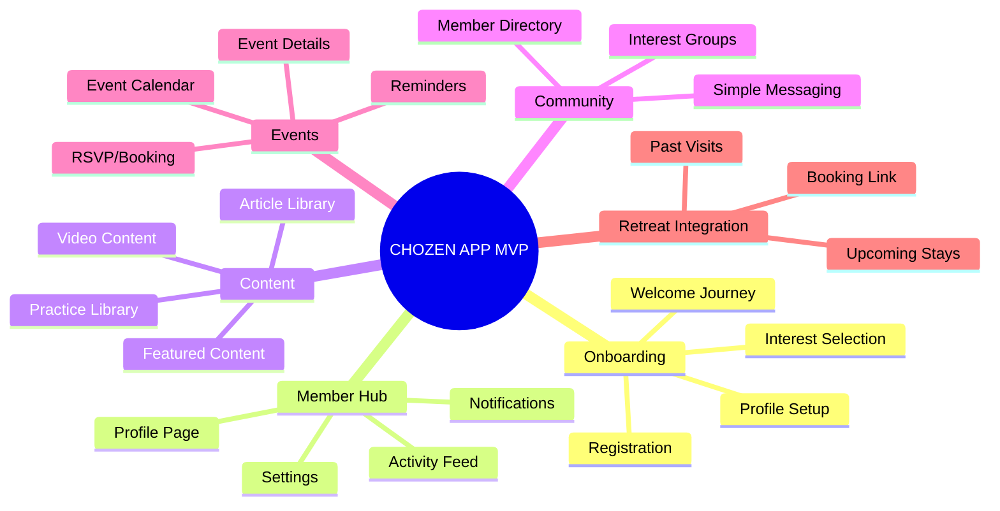
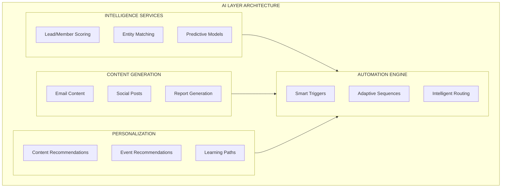
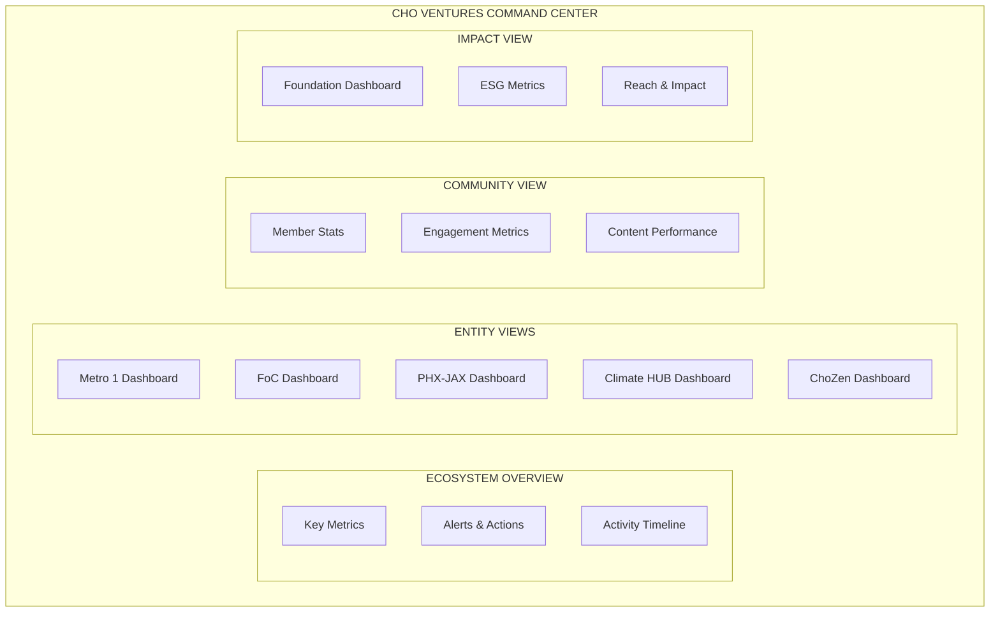

# Phase 2: Implementation & Build

> *Building the AI-powered infrastructure that unifies the Cho Ventures ecosystem.*

---

## Overview

Phase 2 transforms the Phase 1 master plan into operational reality. This phase builds the central hub, connects all entities, deploys the community platform MVP, and activates the AI layer that makes everything intelligent.

**Duration:** 4-6 months
**Prerequisite:** Phase 1 completed

---

## Implementation Architecture

---

## Phase 2A: Foundation Layer

**Duration:** Weeks 1-4
**Goal:** Establish the central infrastructure that everything else builds on

### Central CRM Setup

**Platform:** HubSpot or GoHighLevel (determined in Phase 1)

| Component | Description |
|-----------|-------------|
| Account Structure | Multi-entity setup with proper permissions |
| Contact Properties | Unified schema across all entities |
| Pipeline Configuration | Entity-specific pipelines |
| Automation Foundation | Core workflow templates |
| Email/SMS Setup | Unified communication infrastructure |
| Calendar Integration | Shared scheduling system |

### Unified Database Architecture

### Authentication & SSO

| Feature | Description |
|---------|-------------|
| Unified Login | Single sign-on across all platforms |
| Member Portal | ChoZen community access |
| Admin Portal | Staff access with role-based permissions |
| API Authentication | Secure entity system integrations |

### Design System

| Component | Description |
|-----------|-------------|
| Brand Guidelines | Unified Cho Ventures visual identity |
| Component Library | Reusable UI components |
| Email Templates | Consistent communication design |
| Website Templates | Standardized page layouts |

### Foundation Deliverables

- [ ] CRM fully configured with multi-entity structure
- [ ] Unified contact database live
- [ ] Authentication system operational
- [ ] Design system documented and ready

---

## Phase 2B: Entity Integrations

**Duration:** Weeks 5-10
**Goal:** Connect every entity to the central hub

### Metro 1 Commercial Integration

| Integration Point | Description |
|-------------------|-------------|
| Website Lead Capture | All forms flow to central CRM |
| Property Sync | Listings synchronized with central database |
| Deal Pipeline | Opportunities tracked in unified system |
| Team Calendars | Unified scheduling |
| Cross-Referral Triggers | Automatic routing to other entities |

### Future of Cities Integration

| Integration Point | Description |
|-------------------|-------------|
| Project Pipeline | Development projects tracked centrally |
| Stakeholder Database | All contacts in unified CRM |
| Impact Metrics | ESG data feeds to central dashboard |
| Investor Communications | Managed through central system |

### PHX-JAX District Integration

| Integration Point | Description |
|-------------------|-------------|
| Tenant Database | Leasing leads and tenants in CRM |
| Event System | Events synced with community platform |
| Space Availability | Real-time occupancy tracking |
| Community Directory | Tenant connections facilitated |

### Climate + Innovation HUB Integration

| Integration Point | Description |
|-------------------|-------------|
| Startup Portfolio | Companies tracked in CRM |
| Program Management | Cohorts and participants managed |
| Mentor Network | Connections facilitated through platform |
| Impact Dashboard | Metrics fed to central analytics |

### ChoZen Retreat Integration

| Integration Point | Description |
|-------------------|-------------|
| Booking System | Reservations sync to CRM |
| Guest Profiles | Complete history in unified database |
| Program Calendar | Events connected to community app |
| Post-Stay Automation | Follow-up sequences triggered |

### Integration Deliverables

- [ ] All entity websites connected to central CRM
- [ ] Lead flows operational for each entity
- [ ] Cross-referral automation live
- [ ] Entity-specific dashboards created
- [ ] Team training completed

---

## Phase 2C: Community Platform MVP

**Duration:** Weeks 8-14 (overlaps with integrations)
**Goal:** Launch the ChoZen Community App core functionality

### MVP Feature Set

### Core Features Detail

| Feature | MVP Scope | Future Scope |
|---------|-----------|--------------|
| **Onboarding** | Basic registration, profile, interests | Progressive profiling, AI-guided setup |
| **Content Library** | Static content, basic categories | AI recommendations, personalization |
| **Member Directory** | Search, basic profiles | AI-suggested connections |
| **Events** | Calendar, RSVP | Smart recommendations, virtual events |
| **Messaging** | Direct messages | Group chats, forums |
| **Retreat Integration** | Booking links, history | Credits, loyalty, upgrades |

### Technical Architecture

| Component | Technology |
|-----------|------------|
| Frontend | React Native (iOS/Android) or Progressive Web App |
| Backend | Node.js/Python with REST/GraphQL APIs |
| Database | PostgreSQL with CRM sync |
| Auth | Integration with central SSO |
| Hosting | AWS/GCP with CDN |

### Community MVP Deliverables

- [ ] App available on iOS and Android (or PWA)
- [ ] Member onboarding flow complete
- [ ] Content library populated
- [ ] Event system operational
- [ ] Retreat booking integrated
- [ ] 500+ founding members onboarded

---

## Phase 2D: AI Layer Deployment

**Duration:** Weeks 12-16
**Goal:** Activate intelligence across the platform

### AI Components

### AI Implementation Details

#### Lead & Member Scoring

| Model | Inputs | Output |
|-------|--------|--------|
| Lead Quality | Demographics, behavior, source | Score 0-100 |
| Entity Fit | Profile, interests, history | Best-fit entity ranking |
| Engagement Propensity | Activity, recency, content consumption | Engagement likelihood |
| Conversion Potential | All above + pipeline stage | Conversion probability |

#### Content Generation

| Use Case | AI Approach |
|----------|-------------|
| Email Subject Lines | A/B variants generated |
| Email Body | Template + personalized elements |
| Social Posts | Entity-specific voice, topic-based |
| Reports | Narrative generation from data |

#### Intelligent Automation

| Trigger | Action | AI Role |
|---------|--------|---------|
| New Lead | Route to entity | AI determines best fit |
| Low Engagement | Re-engagement sequence | AI selects content |
| High Score | Priority notification | AI identifies opportunities |
| Cross-Entity Signal | Referral trigger | AI routes appropriately |

#### Personalization Engine

| Context | Personalization |
|---------|-----------------|
| Community App | Content recommendations based on interests |
| Email | Dynamic content blocks based on profile |
| Events | Event suggestions based on history |
| Course | Learning path based on progress and goals |

### AI Layer Deliverables

- [ ] Scoring models trained and deployed
- [ ] Content generation integrated with CRM
- [ ] Automation engine operational
- [ ] Personalization live in community app
- [ ] AI performance dashboards created

---

## Phase 2E: Interface Layer

**Duration:** Weeks 14-18
**Goal:** Create the user-facing experiences that tie everything together

### Unified Dashboard

| Dashboard Component | Metrics |
|--------------------|---------|
| **Ecosystem KPIs** | Total contacts, active members, revenue pipeline |
| **Entity Health** | Per-entity leads, deals, engagement |
| **Community Health** | Active members, content consumption, event attendance |
| **Impact Metrics** | Foundation reach, ESG scores, lives touched |
| **AI Performance** | Automation ROI, personalization lift, content performance |

### Website Revamps

| Website | Updates |
|---------|---------|
| cho.ventures | Central hub, portfolio overview, Tony's bio |
| metro1.com | CRM integration, lead capture, property search |
| focities.com | Project showcase, stakeholder portal |
| phxjax.com | Tenant directory, event calendar, booking |
| chozenretreat.com | Booking system, community integration |

### Admin Portal

| Feature | Description |
|---------|-------------|
| User Management | Permissions across all entities |
| Content Management | Unified content publishing |
| Analytics Access | Cross-entity reporting |
| AI Configuration | Model tuning and monitoring |
| System Health | Integration status and alerts |

### Interface Deliverables

- [ ] Command center dashboard live
- [ ] All websites revamped and connected
- [ ] Admin portal operational
- [ ] Training completed for all staff

---

## Training & Adoption

### Training Program

| Audience | Content | Duration |
|----------|---------|----------|
| Leadership | Dashboard, strategy, AI capabilities | 4 hours |
| Entity Managers | Entity-specific features, automation | 8 hours |
| Sales/Operations | CRM workflows, lead management | 8 hours |
| Community Team | App admin, member engagement | 8 hours |
| Content Team | Content system, AI generation | 6 hours |

### Documentation

- System administration guide
- User workflow guides (per role)
- AI capability documentation
- Integration maintenance guide
- Troubleshooting playbooks

### Adoption Support

| Week | Focus |
|------|-------|
| Week 1-2 | Go-live support, rapid issue resolution |
| Week 3-4 | Workflow optimization, advanced training |
| Week 5-8 | Performance monitoring, adjustment |
| Ongoing | Monthly review calls, continuous improvement |

---

## Phase 2 Investment

### Pricing Structure

*Pricing determined by Phase 1 scope and complexity*

| Component | Investment Range |
|-----------|-----------------|
| Foundation Layer | $25,000 - $40,000 |
| Entity Integrations (5 entities) | $30,000 - $50,000 |
| Community Platform MVP | $50,000 - $80,000 |
| AI Layer | $25,000 - $40,000 |
| Interface Layer | $20,000 - $35,000 |
| Training & Documentation | $10,000 - $15,000 |
| **Total Phase 2** | **$160,000 - $260,000** |

### Monthly Operating Costs

| Component | Monthly Cost |
|-----------|-------------|
| CRM Platform | $500 - $2,000 |
| Hosting Infrastructure | $500 - $1,500 |
| AI API Costs | $500 - $2,000 |
| Community Platform | $1,000 - $3,000 |
| Support & Maintenance | $2,000 - $5,000 |
| **Total Monthly** | **$4,500 - $13,500** |

---

## Phase 2 Success Criteria

Phase 2 is complete when:

- [ ] Central CRM operational with all contacts migrated
- [ ] All five entities integrated and flowing data
- [ ] Community app live with 500+ founding members
- [ ] AI layer active with measurable performance
- [ ] Unified dashboard accessible to leadership
- [ ] All websites updated and connected
- [ ] Training completed for all users
- [ ] Documentation delivered
- [ ] 30-day stability achieved

---

## Transition to Phase 3

With Phase 2 infrastructure in place, Phase 3 activates the authority platform:

- Book launch with full marketing automation
- Course platform build and launch
- Community scale to 10,000+ members
- Speaking and media engine activation
- Full content amplification strategy

---

*Phase 2 builds the machine. Phase 3 turns it on.*
