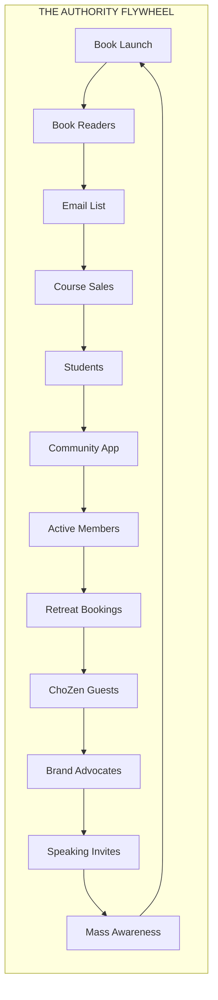
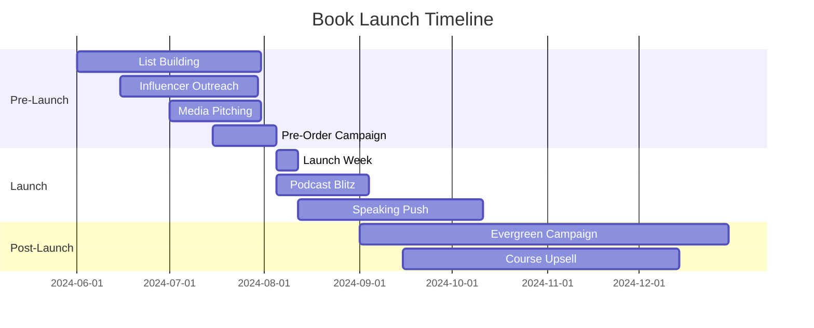
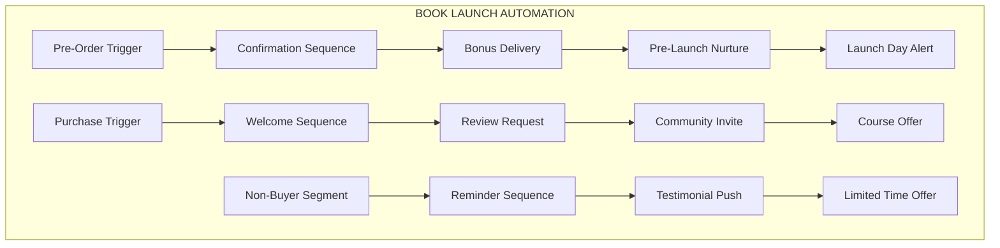
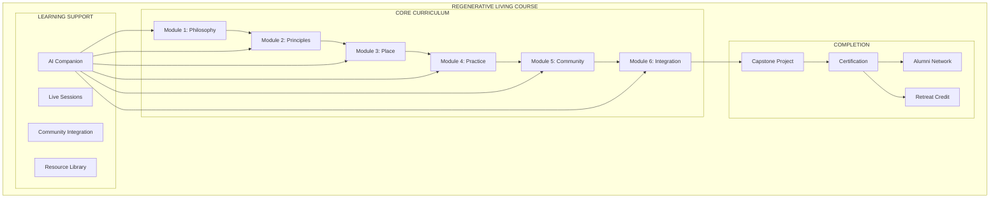
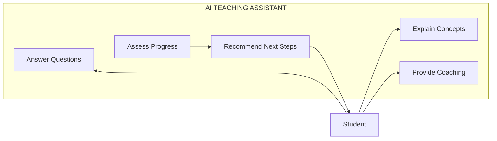
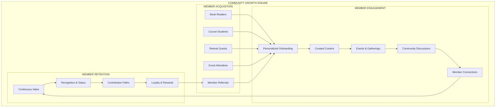
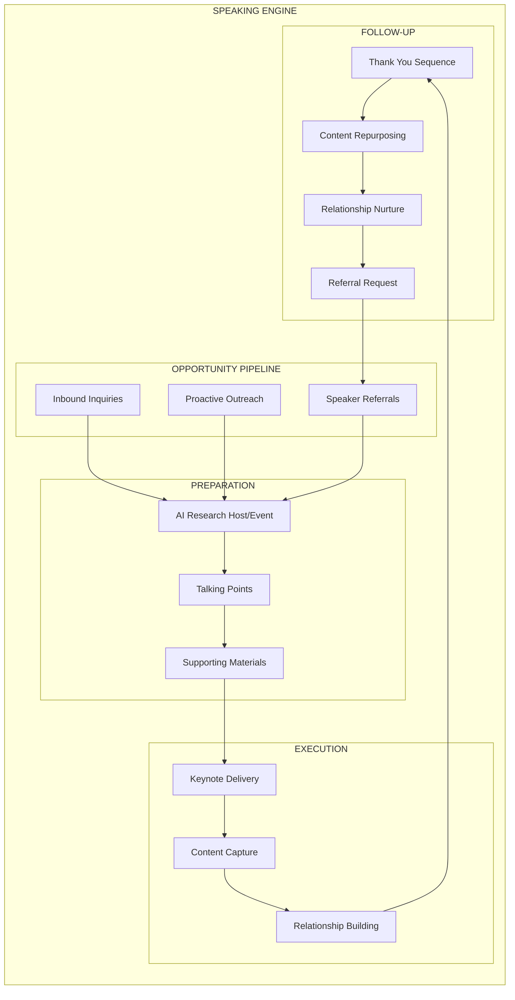
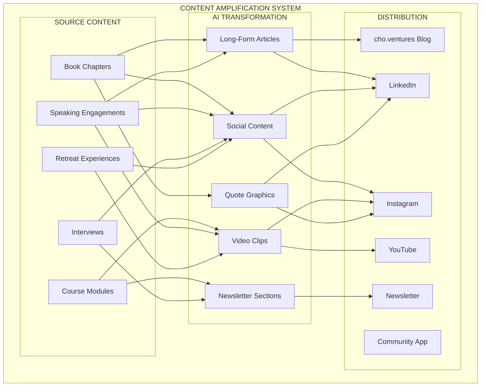

# Phase 3: Authority Platform Launch

> *Positioning Tony Cho as the definitive voice in regenerative placemaking.*

---

## Overview

Phase 3 transforms Tony's vision into global reach. With the AI-powered infrastructure from Phase 2 operational, Phase 3 launches the authority platform: the book, the course, the speaking engine, and the scaled community that positions Tony as the leading voice in regenerative development.

**Duration:** 4-6 months (ongoing evolution)
**Prerequisite:** Phase 2 infrastructure operational

---

## The Authority Flywheel

Every component feeds the others:
- **Book** drives list growth and course sales
- **Course** builds engaged community members
- **Community** generates retreat bookings
- **Retreats** create advocates who spread the message
- **Speaking** reaches new audiences who buy the book

---

## Phase 3A: Book Launch Strategy

### Pre-Launch Campaign

**Timeline:** 12-16 weeks before publication

### List Building Engine

| Channel | Strategy | AI Role |
|---------|----------|---------|
| Existing Entities | Cross-promote to all entity contacts | AI segments and personalizes |
| Content Marketing | Articles, videos from book themes | AI generates drafts |
| Speaking | Book as topic driver | AI prepares talking points |
| Partnerships | Co-promotion with aligned voices | AI identifies potential partners |
| Paid Media | Targeted ads to book audience | AI optimizes creative |

**Target:** 25,000+ pre-launch email subscribers

### Pre-Order Campaign

| Component | Description |
|-----------|-------------|
| Landing Page | Book overview, author credibility, testimonials |
| Bonuses | First chapter, video series, community access |
| Email Sequence | 7-email nurture to pre-order |
| Social Campaign | Daily content countdown to launch |
| Influencer Push | Key voices sharing pre-order |

### Launch Week Activation

| Day | Activity |
|-----|----------|
| Day 1 | Book available, full email blast, social blitz |
| Day 2-3 | Podcast appearances, media interviews |
| Day 4-5 | Live events, Q&A sessions, community celebration |
| Day 6-7 | Testimonial push, review requests, sustained promotion |

### AI-Powered Launch Automation

### Book Companion AI

| Feature | Description |
|---------|-------------|
| Concept Explainer | AI chatbot that explains book concepts |
| Discussion Guide | AI-generated questions for book clubs |
| Implementation Support | AI helps readers apply principles |
| Progress Companion | AI tracks reading and engagement |

### Book Launch Deliverables

- [ ] 25,000+ email subscribers at launch
- [ ] Pre-order campaign with 2,000+ orders
- [ ] Launch week bestseller push
- [ ] 50+ podcast appearances booked
- [ ] 100+ reviews within 30 days
- [ ] Evergreen sales funnel operational

---

## Phase 3B: Online Course Platform

### Course Architecture

### Course Modules

| Module | Title | Content |
|--------|-------|---------|
| **Module 1** | The Regenerative Philosophy | Tony's story, core principles, why now |
| **Module 2** | Regenerative Principles | Biomimicry, systems thinking, circularity |
| **Module 3** | Regenerative Place | Site selection, design principles, case studies |
| **Module 4** | Regenerative Practice | Daily integration, personal sustainability |
| **Module 5** | Regenerative Community | Building movements, stakeholder engagement |
| **Module 6** | Integration & Impact | Putting it together, measuring success |

### AI Course Companion

| AI Feature | Description |
|------------|-------------|
| Concept Q&A | Answer questions about course material |
| Application Coaching | Help apply principles to student's context |
| Progress Assessment | Evaluate understanding and completion |
| Personalized Paths | Suggest focus areas based on goals |
| Capstone Support | Guide through final project |

### Course Platform Features

| Feature | Description |
|---------|-------------|
| Video Lessons | High-quality filmed content |
| Worksheets | Downloadable implementation guides |
| AI Companion | 24/7 learning support |
| Live Sessions | Monthly live Q&A with Tony |
| Community | Course-specific discussion space |
| Progress Tracking | Badges, completion, certificates |
| Mobile App | Learn anywhere via ChoZen app |

### Certification Tiers

| Tier | Requirements | Benefits |
|------|--------------|----------|
| **Reader** | Complete book | Community access |
| **Practitioner** | Complete course | Certificate, retreat discount |
| **Professional** | Course + project | Alumni network, referral program |
| **Ambassador** | Above + contribution | Speaking opportunities, co-creation |

### Course Integration with Ecosystem

| Integration | Description |
|-------------|-------------|
| Community App | Course content accessible in app |
| Retreat Credits | Course completion = retreat discount |
| Climate HUB | Professional grads can mentor startups |
| Foundations | Alumni volunteer opportunities |
| Speaking | Top grads featured in events |

### Course Platform Deliverables

- [ ] 6-module curriculum filmed and produced
- [ ] AI companion trained and deployed
- [ ] Platform configured with all features
- [ ] Community integration complete
- [ ] 1,000+ students enrolled in Year 1
- [ ] 80%+ completion rate achieved

---

## Phase 3C: Community Scale-Up

### Community Growth Strategy

### Community Features (Full Platform)

| Feature Category | Features |
|------------------|----------|
| **Profiles** | Rich profiles, interests, contributions, connections |
| **Content** | Articles, videos, practices, Tony's teachings, member stories |
| **Events** | Virtual events, in-person gatherings, retreat bookings |
| **Discussions** | Topic-based forums, interest groups, local chapters |
| **Connections** | Member matching, mentorship, collaboration |
| **Learning** | Course access, learning paths, certifications |
| **Commerce** | Retreat booking, merchandise, exclusive offers |
| **Gamification** | Points, badges, levels, challenges, leaderboards |

### AI-Powered Community Features

| Feature | AI Role |
|---------|---------|
| Personalized Feed | AI curates content for each member |
| Connection Suggestions | AI matches members with similar interests |
| Event Recommendations | AI suggests relevant events |
| Engagement Prompts | AI re-engages inactive members |
| Discussion Facilitation | AI moderates and stimulates discussion |
| Learning Paths | AI personalizes educational journeys |

### Membership Tiers

| Tier | Price | Access |
|------|-------|--------|
| **Free** | $0/month | Basic content, limited features |
| **Essentials** | $29/month | Full content, community, events |
| **Premium** | $79/month | Above + course, retreat discounts |
| **Founder** | $199/month | Above + live access, exclusive content |

### Community Scaling Milestones

| Milestone | Target | Timeline |
|-----------|--------|----------|
| Founding Members | 500 | Phase 2 |
| Early Adopters | 2,000 | Month 1 (Phase 3) |
| Growth Phase | 5,000 | Month 3 |
| Scale Phase | 10,000 | Month 6 |
| Maturity | 25,000+ | Year 1+ |

### Community Deliverables

- [ ] Full-featured community platform live
- [ ] 10,000+ members within 6 months
- [ ] 80%+ monthly active rate
- [ ] 50+ events per month (virtual + in-person)
- [ ] Self-sustaining engagement (user-generated content)
- [ ] Net positive unit economics

---

## Phase 3D: Speaking & Media Engine

### Speaking Strategy

### Speaking Topics

| Topic | Audience | Core Message |
|-------|----------|--------------|
| **Regenerative Placemaking** | Real estate, developers | Beyond sustainability to regeneration |
| **Blue Zone Development** | Health, wellness, urban planning | Designing for human flourishing |
| **Climate Innovation** | Tech, investors, entrepreneurs | The business case for climate solutions |
| **Community-Driven Development** | Civic, nonprofit, urban | Building places that build people |
| **The Ashram to the Boardroom** | Entrepreneurs, leaders | Tony's personal journey and lessons |

### AI Speaking Support

| Function | AI Role |
|----------|---------|
| Event Research | AI researches host, audience, context |
| Talking Points | AI generates customized key messages |
| Q&A Prep | AI predicts likely questions |
| Bio Variations | AI adapts bio for context |
| Follow-up | AI drafts thank-you and nurture emails |
| Content Repurposing | AI transforms talks into articles, posts |

### Media & PR Strategy

| Channel | Strategy |
|---------|----------|
| Podcasts | Guest appearances on aligned shows |
| Business Press | Bylined articles, expert quotes |
| Industry Publications | Real estate, sustainability outlets |
| Mainstream Media | Feature stories, profile pieces |
| Video Content | YouTube, LinkedIn, Instagram |

### Speaking & Media Deliverables

- [ ] Speaker one-sheet and kit created
- [ ] 24+ speaking engagements per year
- [ ] 50+ podcast appearances per year
- [ ] Monthly bylined articles
- [ ] Quarterly major media features
- [ ] Content repurposing pipeline operational

---

## Phase 3E: Content Amplification

### Content Strategy Architecture

### Content Calendar

| Day | LinkedIn | Instagram | Newsletter | Blog |
|-----|----------|-----------|------------|------|
| Monday | Insight post | Quote graphic | - | - |
| Tuesday | - | Behind scenes | - | - |
| Wednesday | Article | Carousel | Weekly send | Weekly article |
| Thursday | Engagement | Video clip | - | - |
| Friday | - | Community feature | - | - |

### AI Content Workflow

| Step | AI Role | Human Role |
|------|---------|------------|
| Ideation | AI suggests topics from source content | Approve/modify |
| Drafting | AI creates first draft | Edit/refine |
| Optimization | AI optimizes for platform | Final review |
| Scheduling | AI suggests optimal times | Approve schedule |
| Analysis | AI reports performance | Strategic decisions |

### Newsletter Strategy

**The Regenerative Report** — Weekly newsletter

| Section | Content |
|---------|---------|
| Tony's Insight | Short thought leadership piece |
| Featured Content | Blog post or video highlight |
| Community Spotlight | Member or project feature |
| Retreat Highlight | ChoZen program or experience |
| Resource of the Week | Book, article, or tool |

### Content Amplification Deliverables

- [ ] Content calendar operational
- [ ] AI workflow producing 30+ pieces/month
- [ ] Newsletter at 50,000+ subscribers
- [ ] LinkedIn at 100,000+ followers
- [ ] Instagram at 50,000+ followers
- [ ] YouTube at 25,000+ subscribers

---

## Phase 3 Investment

### Pricing Structure

| Component | Investment Range |
|-----------|-----------------|
| Book Launch Campaign | $30,000 - $50,000 |
| Course Platform Build | $50,000 - $75,000 |
| Community Scale-Up | $30,000 - $50,000 |
| Speaking Engine | $15,000 - $25,000 |
| Content Amplification | $20,000 - $35,000 |
| **Total Phase 3** | **$145,000 - $235,000** |

### Ongoing Monthly Costs

| Component | Monthly Cost |
|-----------|-------------|
| Content Production | $5,000 - $10,000 |
| Community Management | $3,000 - $6,000 |
| PR & Media | $5,000 - $10,000 |
| Platform Operations | $2,000 - $4,000 |
| AI Services | $1,000 - $3,000 |
| **Total Monthly** | **$16,000 - $33,000** |

---

## Phase 3 Success Criteria

Phase 3 is complete when:

- [ ] Book launched successfully with 5,000+ copies sold in first quarter
- [ ] Course live with 1,000+ enrolled students
- [ ] Community at 10,000+ active members
- [ ] 24+ speaking engagements booked annually
- [ ] 50+ podcast appearances annually
- [ ] Content engine producing 30+ pieces monthly
- [ ] Newsletter at 50,000+ subscribers
- [ ] Self-sustaining flywheel demonstrated

---

## Beyond Phase 3: Continuous Evolution

With the authority platform established, ongoing evolution includes:

- **Book sequels** and derivatives
- **Advanced courses** and certifications
- **In-person programs** and intensives
- **Partnership expansions** with aligned organizations
- **Media expansion** (podcast, video series)
- **International reach** and localization
- **Franchise opportunities** for regenerative development methodology

---

*Phase 3 launches the movement. The ecosystem grows from here.*
