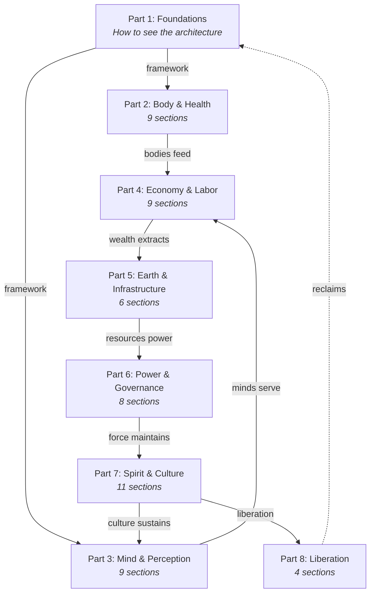
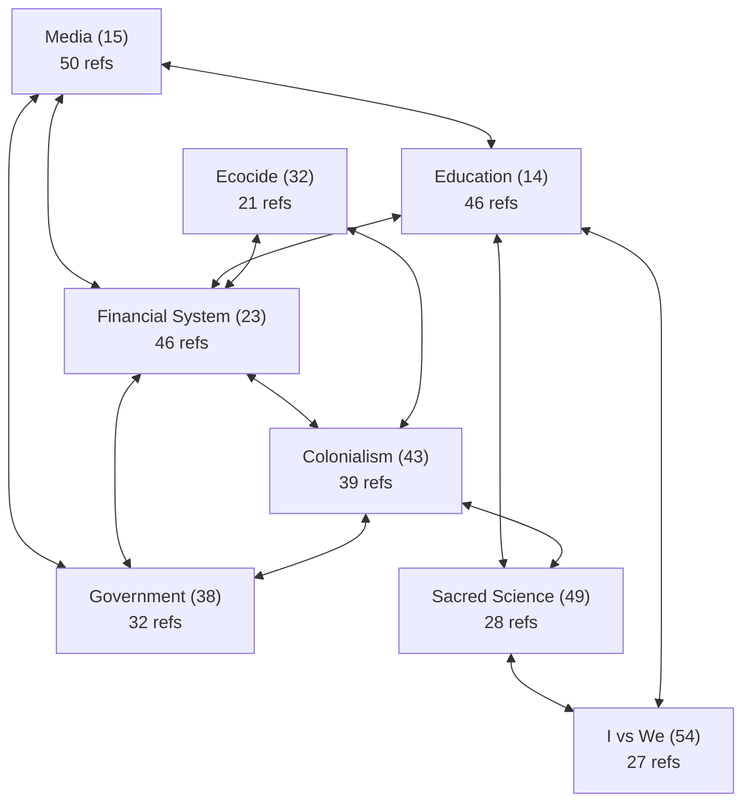
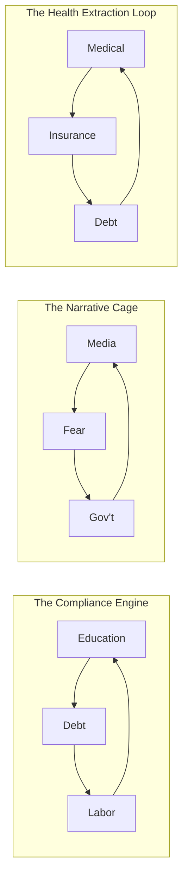

# Systemic Domination

## The Architecture of Spiritual Distortion

A dream about seeing clearly — naming the machinery of control operating across human civilization, not as conspiracy, but as observable, interlocking systems that shape beliefs, behaviors, and spiritual perceptions. This architecture spans nearly every sector of society — from healthcare and food to media, finance, religion, technology, language, governance, and the sacred itself.

---

## The Through-Line

> What does it look like when every major system in a society slowly bends
> toward serving the same small set of interests — and most people inside
> it can't see the shape of the whole thing?

This dream maps the architecture. Not to despair. To see.

---

## Architecture Overview

This thesis documents 60 interlocking systems organized across 8 Parts — but these are not 60 separate problems. They are one architecture viewed from 60 angles. The systems of medical dependency feed the debt system which feeds the labor extraction engine which feeds the financial architecture which funds the media apparatus which shapes the education system which produces compliant workers who enter the medical system again. Every section in this document is a node in a single self-reinforcing machine.

The interconnection map confirms the density: 676 cross-references link these 60 sections together, forming 139 bidirectional pairs and 446 triangular feedback loops. The hub sections — Media (15), Education (14), Financial System (23), Colonialism (43), and Government (38) — function as gravitational centers, each referenced by 30-50 other sections. Remove any one hub and the surrounding systems compensate through redundant pathways. This is what makes the architecture so durable: it has no single point of failure.

The thesis arc moves deliberately. Part 1 teaches the reader how to see the architecture. Parts 2-3 document what it does to bodies and minds. Part 4 shows how it extracts wealth and labor. Part 5 maps its impact on the planet and infrastructure. Part 6 reveals who holds the levers. Part 7 traces how it suppresses the sacred and fractures identity. Part 8 — the Liberation sections (57-60) — maps the exit architecture: what has worked, what can be built, and how to reclaim what was taken. The journey is from seeing to understanding to action.

---

## The 8-Part Structure

The thesis is organized as a narrative arc — a journey from seeing the architecture, through the domains it captures, to the power that maintains it, and finally to the paths of liberation.

| Part | Theme | Reader Journey |
|------|-------|----------------|
| **1. Foundations** | Framework & context | "Here's how to see the architecture" |
| **2. Body & Health** | What they do to our bodies | "They've captured your biology" |
| **3. Mind & Perception** | What they do to our minds | "They've captured your attention and thought" |
| **4. Economy & Labor** | How they extract wealth and labor | "They've captured your time and resources" |
| **5. Earth & Resources** | What they do to the planet | "They've captured the commons itself" |
| **6. Power & Governance** | How they maintain force and control | "This is who holds the levers" |
| **7. Spirit & Culture** | How they suppress the sacred and divide us | "They've tried to capture your soul" |
| **8. Liberation** | How we break free | "Here's how we reclaim it all" |

---

## Part 1: [Foundations](sections/part-01-foundations/)

| # | Section | Description |
|---|---------|-------------|
| 01 | [Introduction](sections/part-01-foundations/01-introduction/) | The latticework of interlocking systems |
| 02 | [Historical Timeline](sections/part-01-foundations/02-historical-timeline/) | When the architecture emerged |
| 03 | [How Systems Reproduce](sections/part-01-foundations/03-how-systems-reproduce/) | The mechanics of perpetuation across generations |
| 04 | [Personal Phenomenology](sections/part-01-foundations/04-personal-phenomenology/) | What it feels like to live inside the architecture |

## Part 2: [Body, Health & Sustenance](sections/part-02-body-health-sustenance/)

| # | Section | Description |
|---|---------|-------------|
| 05 | [Medical-Pharmaceutical Complex](sections/part-02-body-health-sustenance/05-medical-pharmaceutical-complex/) | Manufacturing dependency, suppressing alternatives, ignoring root causes |
| 06 | [Insurance Companies](sections/part-02-body-health-sustenance/06-insurance-companies/) | Gatekeepers of healthcare access |
| 07 | [Sacred Plant Medicines](sections/part-02-body-health-sustenance/07-sacred-plant-medicines/) | Cannabis, mushrooms & the war on consciousness |
| 08 | [Food Supply](sections/part-02-body-health-sustenance/08-food-supply/) | The engineered diet of dependency |
| 09 | [Mass Farming & Livestock](sections/part-02-body-health-sustenance/09-mass-farming-livestock/) | The sickness of industrial animal agriculture |
| 10 | [Biotech & Genetic Control](sections/part-02-body-health-sustenance/10-biotech-genetic-control/) | Engineering the human blueprint |
| 11 | [Addiction Architecture](sections/part-02-body-health-sustenance/11-addiction-architecture/) | Designing dependency across every domain |
| 12 | [Carceral Mental Health](sections/part-02-body-health-sustenance/12-carceral-mental-health/) | Pathologizing dissent and medicating the human condition |
| 13 | [Beauty & Body Image](sections/part-02-body-health-sustenance/13-beauty-body-image/) | Manufacturing the unworthy self |

## Part 3: [Mind, Perception & Narrative](sections/part-03-mind-perception-narrative/)

| # | Section | Description |
|---|---------|-------------|
| 14 | [Education System](sections/part-03-mind-perception-narrative/14-education-system/) | The engineered inequity |
| 15 | [Media](sections/part-03-mind-perception-narrative/15-media/) | The architects of perception |
| 16 | [Digital Dominion & AI](sections/part-03-mind-perception-narrative/16-digital-dominion-ai/) | The emergence of the algorithmic overseer |
| 17 | [Social Media & Attention Economy](sections/part-03-mind-perception-narrative/17-social-media-attention/) | Engineering the hive mind for harvest |
| 18 | [Language & Word Manipulation](sections/part-03-mind-perception-narrative/18-language-word-manipulation/) | The subtle power and dark magic of words |
| 19 | [Mass Programming](sections/part-03-mind-perception-narrative/19-mass-programming/) | Psychological warfare — fragmenting the collective psyche |
| 20 | [Architecture of Fear](sections/part-03-mind-perception-narrative/20-architecture-of-fear/) | The master emotion as governance tool |
| 21 | [Children as Targets](sections/part-03-mind-perception-narrative/21-children-as-targets/) | Capturing consciousness at its most malleable |
| 22 | [Narrative of Progress](sections/part-03-mind-perception-narrative/22-narrative-of-progress/) | The myth that technology always saves |

## Part 4: [Economy, Labor & Material World](sections/part-04-economy-labor-material/)

| # | Section | Description |
|---|---------|-------------|
| 23 | [Financial System & Capitalism](sections/part-04-economy-labor-material/23-financial-system-capitalism/) | The architecture of economic domination |
| 24 | [Debt System](sections/part-04-economy-labor-material/24-debt-system/) | Money created as bondage |
| 25 | [Taxation & Wealth Extraction](sections/part-04-economy-labor-material/25-taxation-wealth-extraction/) | Rules written by those who benefit |
| 26 | [Labor & Work Culture](sections/part-04-economy-labor-material/26-labor-work-culture/) | Extracting maximum value from human life |
| 27 | [Housing & Shelter](sections/part-04-economy-labor-material/27-housing-shelter/) | When home becomes a financial instrument |
| 28 | [Intellectual Property](sections/part-04-economy-labor-material/28-intellectual-property/) | Fencing the commons of the mind |
| 29 | [Charity & NGO Complex](sections/part-04-economy-labor-material/29-charity-ngo-complex/) | Poverty as a managed resource |
| 30 | [Cheap Quality & Craftsmanship](sections/part-04-economy-labor-material/30-cheap-quality-craftsmanship/) | Destroying the art of making things well |
| 31 | [Fake Materials & Clothing](sections/part-04-economy-labor-material/31-fake-materials-clothing/) | Wrapping the body in plastic |

## Part 5: [Earth, Resources & Infrastructure](sections/part-05-earth-resources-infrastructure/)

| # | Section | Description |
|---|---------|-------------|
| 32 | [Ecocide](sections/part-05-earth-resources-infrastructure/32-ecocide/) | Planetary grief — severing humanity from Gaia |
| 33 | [Water & Resource Privatization](sections/part-05-earth-resources-infrastructure/33-water-resource-privatization/) | Enclosing the commons |
| 34 | [Energy Monopoly](sections/part-05-earth-resources-infrastructure/34-energy-monopoly/) | Powering the architecture of control |
| 35 | [Transportation & Urban Planning](sections/part-05-earth-resources-infrastructure/35-transportation-urban-planning/) | Building the cage into the landscape |
| 36 | [Time & Calendar Manipulation](sections/part-05-earth-resources-infrastructure/36-time-calendar-manipulation/) | Severing humanity from natural rhythm |
| 37 | [Tech Capability vs. Inaction](sections/part-05-earth-resources-infrastructure/37-tech-capability-vs-inaction/) | Why we can reach the moon but not save the planet |

## Part 6: [Power, Governance & Force](sections/part-06-power-governance-force/)

| # | Section | Description |
|---|---------|-------------|
| 38 | [Modern Government](sections/part-06-power-governance-force/38-modern-government/) | The illusion of democracy and control |
| 39 | [Church & State](sections/part-06-power-governance-force/39-church-and-state/) | The entwined powers |
| 40 | [Criminal Justice & Prison](sections/part-06-power-governance-force/40-criminal-justice-prison/) | The architecture of mass incarceration |
| 41 | [Military-Industrial Complex](sections/part-06-power-governance-force/41-military-industrial/) | Perpetual war as economic engine |
| 42 | [Intelligence & Deep State](sections/part-06-power-governance-force/42-intelligence-deep-state/) | Power beyond democratic oversight |
| 43 | [Colonialism & Neo-Colonialism](sections/part-06-power-governance-force/43-colonialism-neo-colonialism/) | The largest system of domination in human history |
| 44 | [Nuclear & Existential Threat](sections/part-06-power-governance-force/44-nuclear-existential-threat/) | Ultimate control through ultimate destruction |
| 45 | [Architects of Control](sections/part-06-power-governance-force/45-architects-of-control/) | Ritual power, bloodline governance, elite self-preservation |

## Part 7: [Spirit, Culture & Identity](sections/part-07-spirit-culture-identity/)

| # | Section | Description |
|---|---------|-------------|
| 46 | [Masculine & Feminine Distortion](sections/part-07-spirit-culture-identity/46-masculine-feminine-distortion/) | The imbalance of power |
| 47 | [Sacred Feminine Technologies](sections/part-07-spirit-culture-identity/47-sacred-feminine-technologies/) | The silencing of life's blueprint |
| 48 | [Catholic Religion](sections/part-07-spirit-culture-identity/48-catholic-religion/) | Male dominance — a historical perspective |
| 49 | [Suppression of Sacred Science](sections/part-07-spirit-culture-identity/49-suppression-of-sacred-science/) | Hidden knowledge — erasing the keys to liberation |
| 50 | [Indigenous Wisdom Destruction](sections/part-07-spirit-culture-identity/50-indigenous-wisdom-destruction/) | Erasing 500+ years of accumulated knowledge |
| 51 | [Jewish Culture](sections/part-07-spirit-culture-identity/51-jewish-culture/) | Persecuting the people of "light" |
| 52 | [Jesus Christ](sections/part-07-spirit-culture-identity/52-jesus-christ/) | From light of the world to symbol on the cross |
| 53 | [Sports & Competitive Culture](sections/part-07-spirit-culture-identity/53-sports-competitive-culture/) | Gladiator games of the modern mind |
| 54 | ["I vs We" Mentality](sections/part-07-spirit-culture-identity/54-i-vs-we-mentality/) | Individualism undermining community |
| 55 | [Family & Reproductive Control](sections/part-07-spirit-culture-identity/55-family-reproductive-control/) | Atomizing the original community |
| 56 | [Aging, Death & Elder Severance](sections/part-07-spirit-culture-identity/56-aging-death-elder-severance/) | Warehousing the wise, monetizing the dying |

## Part 8: [Liberation & Reclamation](sections/part-08-liberation-reclamation/)

| # | Section | Description |
|---|---------|-------------|
| 57 | [Counter-Movements & Resistance](sections/part-08-liberation-reclamation/57-counter-movements-resistance/) | What has worked — from abolition to open-source |
| 58 | [Architecture of Liberation](sections/part-08-liberation-reclamation/58-architecture-of-liberation/) | Building parallel systems |
| 59 | [Reclaiming Sacred Laws](sections/part-08-liberation-reclamation/59-reclaiming-sacred-laws/) | Mapping liberation to universal principles |
| 60 | [Global South Perspective](sections/part-08-liberation-reclamation/60-global-south-perspective/) | How the architecture operates beyond the West |

---

## Reference & Meta

| Document | Purpose |
|----------|---------|
| [Gap Analysis](sections/00-meta/gap-analysis/) | The original shadow map — 25 missing systems, structural gaps, and redundancies identified |
| [Sacred Laws Glossary](sections/00-meta/sacred-laws-glossary/) | Reference catalog of Sacred Universal Laws and where each is violated |
| [Interconnection Map](sections/00-meta/interconnection-map/) | The web of feedback loops between all 60 systems |

---

## The Compost Pile

| Section | Purpose |
|---------|---------|
| [Seeds](sections/99-seeds/) | Raw thoughts, links, data, quotes — drop them here as they come |

---

## How to Use This

- **Follow the narrative** — read Parts 1-8 in sequence for the full journey from seeing to liberation
- **Go deep on any system** — each of the 60 sections is self-contained with full thesis content
- **Add evidence** — every section has space for data, sources, and examples
- **Map connections** — the "Connections" section in each system links it to the others
- **Drop seeds** — raw thoughts and fragments go in [Seeds](sections/99-seeds/) until they find a home
- **See the whole** — come back here to see how everything fits together

---

## Reading Pathways

The thesis can be read front-to-back, but these curated routes trace specific threads through the architecture:

- **Follow the money** (23 - 24 - 25 - 26 - 27 - 28 - 29 - 30 - 31 - 58): Trace how wealth is created as debt, extracted through labor, concentrated through property, fenced through intellectual property, laundered through charity, degraded through cheap production, and finally how parallel economies offer a way out.
- **Follow the narrative** (15 - 17 - 18 - 19 - 20 - 21 - 16 - 14 - 57): See how media manufactures consent, social platforms harvest attention, language shapes thought, programming fragments the psyche, fear enforces compliance, children are captured early, AI scales the operation, education cements it all, and counter-movements break through.
- **Follow the body** (05 - 06 - 07 - 08 - 09 - 10 - 11 - 12 - 13 - 58): Witness how the medical system manufactures dependency, insurance gates access, plant medicines are criminalized, food is engineered for addiction, farming industrializes suffering, biotech patents life itself, addiction is designed in, mental health is weaponized, beauty standards enforce unworthiness, and liberation rebuilds wholeness.
- **Follow the spirit** (49 - 46 - 47 - 48 - 50 - 51 - 52 - 53 - 54 - 59): Discover how sacred science was suppressed, masculine and feminine were distorted, feminine technologies were silenced, religion was captured, indigenous wisdom was destroyed, Jewish culture was persecuted, Christ's message was inverted, competition replaced cooperation, individualism atomized community, and sacred laws chart the return.
- **Follow the power** (38 - 39 - 40 - 41 - 42 - 43 - 44 - 45 - 57): Map how government creates the illusion of democracy, church and state entwine, prisons warehouse dissent, the military-industrial complex monetizes war, intelligence agencies operate beyond oversight, colonialism extracts globally, nuclear threats enforce ultimate compliance, architects of control preserve bloodline power, and resistance movements challenge it all.
- **The full arc** (01 - 02 - 03 - 04 - ... - 59 - 60): Read every section in sequence for the complete journey from seeing the architecture, through all the domains it captures, to the paths of liberation and the view from the Global South.

---

## Status

| Category | Count | Status |
|----------|-------|--------|
| Total sections | 60 | All expanded |
| Sections with 2500+ word prose | 60 | Complete |
| Sections with populated Evidence (10+) | 60 | Complete |
| Sections with populated Connections (10+) | 60 | Complete |
| Sections with Open Questions (4+) | 60 | Complete |
| Sacred Laws Glossary entries | 18 | Complete |
| Total cross-references | 676 | Mapped |
| Bidirectional pairs | 139 | Mapped |
| Feedback loops identified | 15 | Documented |
| Interconnection Map | 1 | Complete |

---

> *"The system is not broken. It is working exactly as designed."*

---

_This dream was planted on 2026-01-31. Reorganized into 8 Parts on 2026-01-31. Let it grow._
