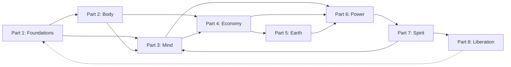

# Systems Interconnection Map

_A reference document for the [Systemic Domination](../../../README.md) thesis._

---

## Purpose

This document maps the web of connections between all 60 systems documented in the thesis. Where System A feeds System B feeds System C, those feedback loops are documented here. The goal is to transform the thesis from a catalog of individual systems into a visible network -- showing how the architecture holds together and where its structural vulnerabilities lie.

The thesis is not a list of 60 independent problems. It is a single architecture -- a lattice where every system reinforces, legitimizes, or depends on several others. Education narrows the mind so media can fill it. Media manufactures fear so government can exploit it. Government writes policy so capital can extract through it. Capital funds the education that narrows the mind. Remove any single system from the catalog and the others compensate, adapt, and maintain the structure. This is what makes the architecture so durable: it has no single point of failure, only concentrations of load.

This map makes the architecture visible. It documents the feedback loops that keep the system self-reinforcing, the chokepoints where disruption would cascade most widely, the load-bearing walls without which the structure cannot stand, and the orphan sections whose connections to the network deserve further examination. The purpose is not academic. It is strategic. If the architecture of domination is a wiring diagram, this document is the blueprint that shows where to cut.

---

## Network Statistics

| Metric | Value |
|--------|-------|
| Total sections | 60 |
| Total outbound connections | 676 |
| Bidirectional pairs (A<->B) | 139 |
| Triangular feedback loops | 446 |

### Most-Referenced Sections (Network Hubs)

These are the sections most frequently cited by other sections -- the nodes through which the most connections pass. They function as the nervous system of the architecture.

| Rank | Section | Inbound References |
|------|---------|-------------------|
| 1 | Media (15) | 50 |
| 2 | Education System (14) | 46 |
| 3 | Financial System & Capitalism (23) | 46 |
| 4 | Colonialism & Neo-Colonialism (43) | 39 |
| 5 | Architecture of Liberation (58) | 35 |
| 6 | Modern Government (38) | 32 |
| 7 | Suppression of Sacred Science (49) | 28 |
| 8 | "I vs We" Mentality (54) | 27 |

Note that the top three hubs -- Media, Education, and Finance -- together account for 142 inbound references. These three systems form a triangle that appears in nearly every feedback loop documented below. The Architecture of Liberation (58) ranks fifth not because it is a system of domination but because every system of domination defines itself in opposition to it -- making liberation the implied reference point of the entire architecture.

---

## Feedback Loops

The following loops document circular dependencies where systems reinforce each other in closed cycles. Each loop is self-sustaining: disrupting one link weakens the cycle, but the remaining links will attempt to compensate. The most effective interventions target multiple links within the same loop simultaneously.

### 1. The Compliance Engine

Education (14) --> Financial Ignorance --> Debt System (24) --> Labor compliance (26) --> Education funding cuts --> Education (14)

_Education omits financial literacy by design. Graduates enter adulthood unable to navigate debt instruments, making them vulnerable to predatory lending. Debt creates desperation that forces compliance with exploitative labor conditions. Low-wage workers cannot fund schools through property taxes, so education budgets shrink further, and the cycle narrows the curriculum even more. Each generation emerges less equipped to see the trap than the last._

### 2. The Narrative Cage

Media (15) --> Architecture of Fear (20) --> Government legitimacy (38) --> Policy serving capital (23) --> Media ownership consolidation --> Media (15)

_Media manufactures fear -- of crime, terrorism, economic collapse, the other. Fear drives demand for strong government response. Government uses that mandate to pass policies that serve concentrated capital: deregulation, tax cuts, surveillance infrastructure. Capital uses its growing resources to consolidate media ownership, ensuring the next cycle of fear serves its interests even more precisely. The cage tightens with each rotation._

### 3. The Health Extraction Loop

Medical-Pharma (05) --> Insurance gatekeeping (06) --> Debt (24) --> Labor desperation (26) --> Stress-related illness --> Medical-Pharma (05)

_The medical-pharmaceutical complex treats symptoms rather than causes, generating recurring revenue. Insurance companies gatekeep access, forcing patients into debt for necessary care. Medical debt creates labor desperation -- people take and keep jobs they would otherwise leave, purely for health coverage. The stress, toxicity, and physical toll of desperate labor produces more illness. Patients return to the same system that failed to heal them. The sicker the population, the more profitable the loop._

### 4. The Colonial Resource Cycle

Colonialism (43) --> Resource privatization (33) --> Financial system extraction (23) --> Debt diplomacy --> Government capture (38) --> Colonial continuation (43)

_Colonial relationships privatized the resources of the Global South -- water, minerals, land, labor. Those privatized resources feed the financial system of the Global North through trade relationships structured to extract value. The financial system extends debt to Global South governments on terms that guarantee dependency. Indebted governments accept structural adjustment programs that open their economies further to extraction. The colonial relationship continues under new names: development, aid, free trade. The resource flow never reverses._

### 5. The Consciousness Suppression Spiral

Suppression of Sacred Science (49) --> Education narrowed (14) --> Media materialist narrative (15) --> "I vs We" mentality (54) --> Sacred science remains suppressed (49)

_When sacred science is suppressed -- consciousness research, energy healing, indigenous cosmology -- the boundaries of acceptable knowledge contract. Education teaches only what fits the materialist paradigm. Media reinforces the narrative that anything outside measurable, monetizable reality is superstition. This produces atomized individuals who see themselves as separate from each other and from nature -- the "I vs We" mentality. Isolated individuals lack the communal frameworks that would transmit sacred knowledge, so it remains suppressed. Each generation loses more of what the previous generation could not pass on._

### 6. The Digital Panopticon

Digital Dominion (16) --> Social Media (17) --> Mass Programming (19) --> Architecture of Fear (20) --> Digital surveillance demand --> Digital Dominion (16)

_AI and digital infrastructure create the capacity for total surveillance. Social media platforms become the delivery mechanism -- voluntary self-reporting of location, relationships, beliefs, and behavior. Mass programming techniques use this data to fragment attention and manufacture consensus. The resulting anxiety and fear create public demand for more surveillance: security cameras, predictive policing, content monitoring. Each demand expands the digital dominion that started the cycle. The panopticon is built by its own inmates._

### 7. The Food-Health-Labor Triangle

Food Supply (08) --> Medical-Pharma (05) --> Debt (24) --> Labor (26) --> Cheap food demand --> Food Supply (08)

_Industrialized food -- processed, chemical-laden, nutrient-depleted -- produces chronic illness at population scale: diabetes, heart disease, autoimmune conditions, cancer. The medical-pharmaceutical complex treats these conditions with expensive, ongoing interventions rather than dietary change. Treatment costs generate debt. Debt forces people into longer hours and multiple jobs, leaving no time to cook or grow food. Exhausted workers demand the cheapest, fastest food available. The food industry supplies exactly that. The triangle spins faster with each rotation._

### 8. The Spiritual Capture Loop

Catholic Religion (48) --> Church & State (39) --> Education controlled (14) --> Sacred science suppressed (49) --> Feminine technologies suppressed (47) --> Catholic Religion maintains authority (48)

_Organized religion -- the Catholic Church as historical archetype -- established itself as the sole intermediary between humanity and the divine. Church-state alliances gave religious authority the force of law. That authority shaped education: what could be taught, what was heresy, what was legitimate knowledge. Sacred science -- direct experience of consciousness, energy, spirit -- was suppressed as pagan or demonic. The sacred feminine technologies (birth rites, plant medicine, intuitive knowing, body wisdom) were specifically targeted as witchcraft. With all alternative spiritual paths eliminated, the Church maintained its monopoly on the sacred. The loop is centuries old and its effects persist in secular institutions that inherited the same epistemological boundaries._

### 9. The Incarceration Pipeline

Children as Targets (21) --> Education failure (14) --> Criminal Justice (40) --> Labor exploitation (26) --> Family disruption (55) --> Children as Targets (21)

_Children in under-resourced communities are targeted by marketing, militarized policing, and zero-tolerance school policies from birth. Underfunded education fails them by design -- low literacy, no economic skills, no critical thinking. The criminal justice system captures those the education system discarded: school-to-prison pipeline. Inside prison, labor is extracted at pennies per hour. Incarceration disrupts families -- children grow up without parents, support networks collapse. Those children become the next generation of targets. The pipeline is self-filling._

### 10. The Military-Financial Complex

Military-Industrial Complex (41) --> Intelligence/Deep State (42) --> Government (38) --> Financial System (23) --> Defense contracts --> Military-Industrial Complex (41)

_The military-industrial complex generates demand for weapons, surveillance technology, and permanent war infrastructure. Intelligence agencies and deep state actors identify threats -- or manufacture them -- to justify continued military spending. Government authorizes budgets and operations, often with classified line items beyond public oversight. The financial system processes these transactions, with defense contractors among the most profitable investments on Wall Street. Profits fund lobbying for more defense contracts. The complex feeds itself through the institutions designed to oversee it._

### 11. The Housing Trap

Housing speculation (27) --> Debt (24) --> Labor desperation (26) --> Low wages --> Housing unaffordability --> Housing speculation (27)

_Housing becomes an investment vehicle rather than shelter. Speculation drives prices beyond what wages can support. Buyers take on massive debt -- 30-year mortgages, adjustable rates, overextended borrowing. Debt creates labor desperation: you cannot quit, you cannot strike, you cannot take risks, because the mortgage payment arrives every month. Desperate workers accept wage suppression. Low wages make housing even less affordable. More speculation fills the gap between what people earn and what housing costs. The trap converts a basic human need into a financial instrument of control._

### 12. The Cultural Erasure Cycle

Indigenous Wisdom Destruction (50) --> Language manipulation (18) --> Education colonized (14) --> Colonialism normalized (43) --> Indigenous Wisdom Destruction continues (50)

_Indigenous wisdom traditions are destroyed -- languages banned, ceremonies criminalized, knowledge holders killed or assimilated. Language manipulation reframes this destruction: "civilizing," "modernizing," "developing." Colonized education teaches the colonizer's history, the colonizer's science, the colonizer's values. Students learn to see colonialism as progress rather than extraction. That normalization permits the ongoing destruction of whatever indigenous wisdom survived the last cycle. Each rotation erases more of the knowledge that predates and contradicts the architecture of domination._

### 13. The Ecocide Feedback

Ecocide (32) --> Resource scarcity --> Privatization (33) --> Energy monopoly (34) --> More extraction --> Ecocide (32)

_Environmental destruction creates resource scarcity -- depleted aquifers, collapsed fisheries, degraded soil. Scarcity creates profit opportunity: what was once abundant and free becomes scarce and privatizable. Privatized resources feed energy monopolies that depend on extraction: fossil fuels, mining, industrial agriculture. Extraction at scale produces more environmental destruction. The feedback loop turns ecological collapse into a business model. The scarcer the resource, the more profitable its enclosure. The more profitable the enclosure, the more incentive to accelerate the scarcity._

### 14. The Fear-Consumption Loop

Architecture of Fear (20) --> Addiction architecture (11) --> Financial extraction (23) --> Media advertising (15) --> Fear maintenance (20)

_Fear creates anxiety at the population level -- existential dread with no clear resolution. The addiction architecture offers relief: alcohol, shopping, social media, gambling, food, pharmaceuticals. Each addictive behavior generates revenue that flows into the financial system. Capital deploys that revenue through media advertising, which simultaneously sells products and maintains the ambient fear that drives consumption. The loop converts human suffering into economic activity. The more afraid the population, the more it consumes. The more it consumes, the more profitable it becomes to maintain the fear._

### 15. The Identity Atomization Spiral

"I vs We" Mentality (54) --> Family disruption (55) --> Elder severance (56) --> Loss of cultural transmission --> "I vs We" deepened (54)

_Atomized individualism fragments the family unit -- fewer multi-generational households, weaker extended family bonds, children raised in isolation from community. As families atomize, elders are severed from their role as wisdom-keepers: warehoused in institutions, medicalized, removed from daily life. Without elders transmitting culture, history, and values, each generation starts from scratch -- dependent on media and institutions rather than lineage for its sense of identity. Without cultural roots, individualism deepens further. The spiral strips away every layer of collective identity until only the isolated consumer remains._

---

## Chokepoints

Chokepoints are systems that appear in so many feedback loops that their disruption would cascade across the widest portion of the network. These are not necessarily the most visible systems -- they are the most structurally connected.

### Media (Section 15)

50 inbound references. Controls narrative reality. Media determines what is thinkable, what is normal, what is feared, and what is invisible. Disruption cascades to: the Architecture of Fear (which depends on media to distribute fear), government legitimacy (which depends on media to manufacture consent), consumer behavior (which depends on advertising to direct spending), cultural identity (which depends on media to define acceptable selfhood), and every system that relies on public ignorance of its operations. Media is the single most connected node in the network.

### Education System (Section 14)

46 inbound references. Controls knowledge formation. Education determines what each generation knows, what it can think critically about, and what it accepts without question. Disruption cascades to: financial literacy (enabling resistance to debt traps), sacred science access (opening the boundaries of acceptable knowledge), critical thinking capacity (enabling citizens to see the architecture), and labor compliance (as educated populations demand better conditions). Education is the reproductive system of domination -- it produces the next generation of compliant participants.

### Financial System & Capitalism (Section 23)

46 inbound references. Controls resource allocation at every scale -- personal, institutional, national, global. Disruption cascades to: debt creation and enforcement, housing markets, labor conditions, government budgets, military funding, media ownership, NGO operations, and the material basis of every other system. The financial system is the circulatory system through which the architecture of domination moves energy. Without it, no other system can fund its operations.

### Colonialism & Neo-Colonialism (Section 43)

39 inbound references. The foundational operating system of the modern world. Colonialism established the resource extraction relationships, governance structures, cultural hierarchies, and epistemological boundaries that every subsequent system inherited. Disruption cascades to: Global North/South economic relations, resource privatization frameworks, governance models, cultural identity, education curricula, and the legitimacy of institutions built on colonial foundations. Colonialism is not historical -- it is the still-running operating system.

### Modern Government (Section 38)

32 inbound references. Controls policy, regulation, enforcement, and the legitimate use of force. Disruption cascades to: military authorization, criminal justice operations, church-state relations, financial regulation (or deregulation), education mandates, environmental policy, and the legal framework that enables or constrains every other system. Government is the enforcement arm of the architecture -- the system that gives the others the force of law.

### Suppression of Sacred Science (Section 49)

28 inbound references. Controls the boundaries of acceptable knowledge. Disruption cascades to: education curricula (what can be taught), health alternatives (what modalities are legitimate), consciousness research (what questions can be funded), spiritual practice (what is protected vs. criminalized), and the epistemological framework that defines "real" knowledge. This chokepoint is uniquely dangerous to the architecture because it controls the meta-level -- not any specific system, but the rules about what counts as a system.

### "I vs We" Mentality (Section 54)

27 inbound references. Controls social cohesion and the capacity for collective action. Disruption cascades to: family structure, community resilience, mutual aid networks, labor organizing, political solidarity, and every form of collective resistance. Atomized individuals cannot mount collective challenges to systemic power. This chokepoint is the psychological foundation on which every other system depends -- isolated people are controllable people.

### Debt System (Section 24)

Present in 6 of the 15 documented feedback loops -- more than any other single section. Disruption cascades to: housing affordability, labor conditions, education access, government fiscal policy, consumer behavior, and medical treatment decisions. Debt is the mechanism that converts abstract financial power into lived material control. It is the chain that links the financial system to the individual body.

---

## Load-Bearing Walls

If chokepoints are the most-connected nodes, load-bearing walls are the foundational ones. These are the systems without which the architecture cannot merely adapt -- it must fundamentally reorganize. Remove a chokepoint and the architecture compensates. Remove a load-bearing wall and the architecture collapses.

### Financial System & Capitalism (Section 23)

The monetary architecture is the circulatory system of domination. Every other system depends on resource allocation controlled through debt-based money creation, central banking, and capital markets. The military needs budgets. The media needs advertising revenue. Education needs funding. Government needs tax revenue and bond markets. Prisons need contracts. Hospitals need insurance payments. Without the financial system as currently constructed -- where money is created as debt, where capital accumulates through extraction, where markets price everything including human life -- the mechanisms of enclosure, extraction, and dependency lose their primary instrument. This is the deepest load-bearing wall. Every liberation movement that has ever been crushed was crushed through financial strangulation.

### Media (Section 15)

The narrative system is the nervous system of domination. Without manufactured consent, the architecture loses its ability to make domination appear natural, normal, and inevitable. Every other system depends on media to suppress awareness of alternatives: the financial system needs people to believe there is no alternative to capitalism; government needs people to believe voting is democracy; the medical system needs people to believe pharmaceuticals are the only medicine; the education system needs people to believe credentials equal knowledge. Without narrative control, each system would have to justify itself on its own merits -- and most cannot survive that scrutiny. Media is the wall that prevents seeing. When people see, they move.

### Education (Section 14)

The knowledge formation system is the reproductive system of domination. Without controlled education, each generation would develop critical thinking, financial literacy, ecological awareness, historical consciousness, and access to suppressed knowledge traditions. An educated population -- genuinely educated rather than credentialed -- would be resistant to every other system of control. They would see through media narratives, understand debt instruments before signing them, question government authority, demand health alternatives, and organize collectively. Education is the wall that ensures each generation arrives pre-shaped for compliance. Remove it, and the architecture must reshape every adult individually rather than capturing every child collectively.

### Colonialism & Neo-Colonialism (Section 43)

The foundational operating system. The resource extraction relationships that power the Global North economy, the governance structures that maintain them, the cultural hierarchies that justify them, and the epistemological frameworks that render them invisible -- all trace to colonial architecture. Without the colonial framework, the Global North/South extraction relationship collapses. Without extraction, the material basis of Global North consumption collapses. Without that consumption, the financial system collapses. Colonialism is the load-bearing wall that is most invisible to those who benefit from it -- which is precisely what makes it so durable. It operates below the level of conscious awareness for most of the Global North population, like the foundation of a building that no one sees but everyone stands on.

### "I vs We" Mentality (Section 54)

The psychological foundation. Without atomized individualism, people would naturally organize collectively, share resources, resist extraction, and rebuild the commons. Every system of control depends on isolated individuals who cannot mount collective resistance: the financial system needs individual debtors who cannot organize; the labor system needs individual workers who cannot strike; the political system needs individual voters who cannot build movements; the media system needs individual consumers who cannot create alternative narratives. The "I vs We" wall is the most subtle and the most foundational. It operates at the level of identity itself -- convincing people that they are fundamentally separate, that self-interest is rational, that collective action is naive. Remove this wall and the others lose the atomized population they require to function.

---

## Cluster Web

The 8 Parts of the thesis are not isolated categories. They form interconnected clusters, with dense internal connections and significant cross-Part bridges.

### Strongest Cross-Part Connections

| Source | Target | Connections | Relationship |
|--------|--------|-------------|-------------|
| Part 3 (Mind & Perception) | Part 6 (Power & Governance) | 25 | Power requires narrative control to maintain legitimacy |
| Part 7 (Spirit & Culture) | Part 3 (Mind & Perception) | 27 | Cultural identity shapes what the mind perceives as real |
| Part 7 (Spirit & Culture) | Part 6 (Power & Governance) | 21 | Spiritual systems legitimize and sanctify power structures |
| Part 4 (Economy & Labor) | Part 3 (Mind & Perception) | 17 | Economic systems need ideological cover to appear natural |
| Part 4 (Economy & Labor) | Part 6 (Power & Governance) | 17 | Economic power and political power interlock and co-depend |

### How the Parts Interlock

**Part 1 (Foundations)** provides the framework -- how to see the architecture, how it reproduces, and what it feels like from inside. It feeds into every other Part as the lens through which the systems become visible.

**Part 2 (Body & Health)** captures the biological dimension: how the architecture controls bodies through food, medicine, addiction, and beauty standards. It connects most strongly to Part 4 (the economic extraction of health) and Part 3 (the narrative that legitimizes medical authority).

**Part 3 (Mind & Perception)** is the densest internal cluster. Media, education, digital technology, social media, language, fear, mass programming, and the targeting of children form a tightly coupled network where each system reinforces the others. This cluster's primary outbound connections flow to Part 6 (providing the narrative infrastructure that legitimizes power).

**Part 4 (Economy & Labor)** is the material engine. Finance, debt, taxation, labor, housing, and intellectual property form the extraction apparatus. Its strongest outbound connections flow to Part 3 (needing ideological cover) and Part 6 (needing policy support).

**Part 5 (Earth & Resources)** connects the architecture to the physical planet. Ecocide, privatization, energy monopoly, and transportation link to Part 4 (providing the raw materials for extraction) and Part 6 (requiring government authorization for resource exploitation).

**Part 6 (Power & Governance)** is the enforcement cluster. Government, church-state relations, criminal justice, military, intelligence, and colonialism form the coercive apparatus. Its strongest inbound connections come from Part 3 (narrative legitimacy) and Part 4 (financial power). Its primary outbound connection flows to Part 7 (spiritual and cultural control as a governance strategy).

**Part 7 (Spirit & Culture)** is the identity and meaning cluster. Gender distortion, sacred feminine, organized religion, sacred science, indigenous wisdom, competitive culture, individualism, family, and elder severance form the fabric of cultural control. This cluster sends its strongest connections back to Part 3 (cultural identity shaping perception) and to Part 6 (spiritual systems legitimizing power).

**Part 8 (Liberation)** receives connections from every other Part -- it is the convergence point. Counter-movements, the architecture of liberation, sacred laws, and the Global South perspective represent the paths through which the architecture can be dismantled. Its dotted-line connection back to Part 1 represents the cycle: seeing the architecture is the first step toward liberating from it.

### Part Interconnection Diagram

The dotted line from Part 8 back to Part 1 represents the central insight of the thesis: liberation begins with seeing. The architecture of domination depends on invisibility. Once seen, it loses its primary defense. The loop from Liberation back to Foundations is the only feedback loop in the thesis that works against the architecture rather than for it.

---

## Orphan Sections

The following sections have the fewest inbound references from other sections. They sit at the periphery of the current network rather than at its center.

| Section | Inbound References |
|---------|--------------------|
| Nuclear & Existential Threat (44) | 0 |
| Jewish Culture (51) | 0 |
| Narrative of Progress (22) | 1 |
| Intellectual Property (28) | 1 |
| Charity & NGO Complex (29) | 1 |
| Fake Materials & Clothing (31) | 1 |
| Time & Calendar Manipulation (36) | 1 |
| Jesus Christ (52) | 1 |

### A Note on Orphan Status

These are not unimportant sections. They are sections whose connections to the wider network are least visible in the current cross-reference structure. Several deserve specific attention:

**Nuclear & Existential Threat (44)** and **Jewish Culture (51)** have zero inbound references, meaning no other section currently points to them. Nuclear threat arguably connects to the Military-Industrial Complex (41), Intelligence/Deep State (42), Government (38), and the Architecture of Fear (20). Jewish Culture connects to Catholic Religion (48), Colonialism (43), and the broader pattern of scapegoating that the architecture uses to divide populations.

**Narrative of Progress (22)** is arguably referenced implicitly by many sections -- it is the ideological wrapper around technology, colonialism, and extraction -- but these connections are not yet explicit in the cross-reference structure.

**Time & Calendar Manipulation (36)** connects to Indigenous Wisdom Destruction (50), Sacred Science (49), and Labor (26) -- the industrial clock as a tool of labor extraction -- but these connections remain undocumented.

**Intellectual Property (28)** connects to Sacred Science suppression, Indigenous Wisdom Destruction, the Financial System, and Digital Dominion -- the enclosure of knowledge as a form of resource privatization -- but the connections are not yet formalized.

These orphan sections represent the strongest candidates for integration work in future revisions. Each revision that adds explicit cross-references from other sections to these orphans will strengthen the network and reveal relationships that are currently invisible.

---

## How to Read This

This document is a map, not a narrative. There are many ways to navigate it.

- **Start with any system** and follow its connections outward. Each connection leads to another system, and each of those has its own connections. Within a few hops, you will reach every corner of the architecture.

- **Look for clusters** -- groups of systems that form tight feedback loops. These clusters are where the architecture is strongest and where interventions must be most coordinated.

- **Identify the chokepoints** -- these are where liberation efforts may have the most leverage. A single intervention that disrupts a chokepoint reverberates across dozens of connected systems.

- **Follow the feedback loops** to see how the architecture maintains itself. The loops are the self-repair mechanisms: even when one system is disrupted, the loop routes around the disruption and rebuilds it. Effective intervention must break the loop, not just damage a node.

- **Compare the load-bearing walls** to the liberation architecture (Part 8) to see where the alternatives target the most foundational systems. The counter-movements and parallel systems documented in Sections 57-60 are most powerful when they address load-bearing walls rather than surface symptoms.

- **Notice the orphan sections** -- these are not weak points in the thesis but blind spots in the current analysis. The sections with the fewest connections may be the ones whose role in the architecture is least understood, making them worth the most investigation.

- **Read the cluster web** to see how the 8 Parts relate as groups rather than as 60 individual sections. The Part-level view reveals the macro-architecture: body captured, mind shaped, wealth extracted, earth exploited, power enforced, spirit suppressed, liberation possible.

The architecture of domination is a network, not a hierarchy. It has no single head to cut off. But it has structure, and structure has vulnerabilities. This map is designed to make those vulnerabilities visible.

---

_This section is soil. Plant what you find._
