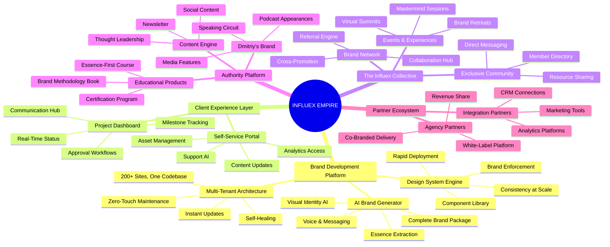

# Influex Elite Ecosystem: Master Plan

> *Transforming a premium brand agency into an AI-powered brand development empire.*

---

## Table of Contents

1. [Executive Summary](#executive-summary)
2. [The Influex Empire Vision](#the-influex-empire-vision)
3. [Current State: The WordPress Trap](#current-state-the-wordpress-trap)
4. [The Transformation Architecture](#the-transformation-architecture)
5. [The Six Pillars of the Elite Platform](#the-six-pillars-of-the-elite-platform)
6. [AI Integration Map](#ai-integration-map)
7. [Client Journey Transformation](#client-journey-transformation)
8. [Authority Platform Strategy](#authority-platform-strategy)
9. [Network Effect: The Influex Collective](#network-effect-the-influex-collective)
10. [Three-Phase Framework](#three-phase-framework)
11. [Financial Transformation](#financial-transformation)
12. [Success Metrics](#success-metrics)

---

## Executive Summary

### The Opportunity

Dmitriy Kozlov has built something rare: a brand development agency that serves the world's most influential thought leaders — Jim Kwik, Lewis Howes, Dave Asprey, Ryan Deiss, Frank Kern, Daymond John. The client roster reads like a who's who of the personal development and business coaching world. But this exceptional positioning is trapped inside an architecture that can't scale.

**The opportunity is transformational:**

1. **Liberation** — Free Influex from the WordPress tax that consumes all margin
2. **Amplification** — Turn 200 client relationships into a connected brand network
3. **Domination** — Position Influex as THE platform for elite personal brands
4. **Authority** — Elevate Dmitriy as the architect of the modern personal brand

### The Stakes

Influex sits at an inflection point:
- **~$100K/month costs** consuming nearly all revenue
- **200+ premium clients** who could be interconnected
- **Proven methodology** (Essence-First Branding) ready to scale
- **AI moment** — the tools to build this didn't exist 2 years ago

The agencies that build AI-native platforms now will:
- **Operate at 70%+ margins** instead of break-even
- **Scale to 2,000+ clients** with the same team
- **Create network effects** between premium brands
- **Own the category** of AI-powered brand development

### The Solution

A comprehensive transformation that replaces fragmented WordPress operations with a unified, AI-powered brand development ecosystem:

```
┌─────────────────────────────────────────────────────────────────────────────┐
│                     INFLUEX ELITE ECOSYSTEM                                  │
├─────────────────────────────────────────────────────────────────────────────┤
│                                                                              │
│   BRAND INTELLIGENCE      CLIENT EXPERIENCE       NETWORK LAYER             │
│   ─────────────────       ─────────────────       ─────────────             │
│   • AI Brand Generator    • Self-Service Portal  • Influex Collective      │
│   • Design System Engine  • Asset Manager        • Cross-Promotion         │
│   • Content AI            • Analytics Dashboard  • Referral Engine         │
│   • Voice Cloning         • Project Tracker      • Event Coordination      │
│                           • Support AI                                      │
│                                                                              │
│   PLATFORM CORE           AI LAYER               AUTHORITY ENGINE           │
│   ─────────────           ────────               ────────────────           │
│   • Multi-Tenant Sites    • Brand Intelligence   • Dmitriy's Platform      │
│   • Unified Codebase      • Content Generation   • Essence-First Course    │
│   • Auto Maintenance      • Design Automation    • Speaking/Podcasts       │
│   • Zero-Touch Deploy     • Personalization      • The Influex Method Book │
│   • Self-Healing Infra    • Predictive Insights  • Newsletter/Community    │
│                                                                              │
│   PARTNER LAYER           DATA LAYER             OPERATIONS                 │
│   ─────────────           ──────────             ──────────                 │
│   • White-Label Option    • Unified Database     • Automated Workflows     │
│   • Agency Partnerships   • Cross-Brand Intel    • AI Project Management   │
│   • API Access            • Performance Metrics  • Quality Gates           │
│   • Referral Network      • Trend Analysis       • Client Success AI       │
│                                                                              │
└─────────────────────────────────────────────────────────────────────────────┘
```

---

## The Influex Empire Vision

### From Agency to Platform



### The Unified Story

Every component serves a singular mission: **Empowering the world's most influential voices to express their authentic essence and amplify their impact.**

- **Brand Intelligence Platform** generates brands that capture true essence
- **Design System Engine** ensures visual excellence at any scale
- **Client Portal** gives clients ownership without dependency
- **The Influex Collective** connects premium brands for mutual amplification
- **Authority Platform** positions Dmitriy as the category architect
- **Partner Layer** extends the platform's reach through other agencies

---

## Current State: The WordPress Trap

### The Problem in Numbers

```
┌─────────────────────────────────────────────────────────────────────────────┐
│                        CURRENT OPERATIONAL REALITY                           │
├─────────────────────────────────────────────────────────────────────────────┤
│                                                                              │
│   THE WORDPRESS TAX                                                         │
│   ─────────────────                                                         │
│                                                                              │
│   Monthly Costs         Revenue Reality         The Result                  │
│   ┌─────────────┐      ┌─────────────┐         ┌─────────────┐             │
│   │             │      │             │         │             │             │
│   │   ~$100K    │  -   │   ~$105K    │    =    │    ~$5K     │             │
│   │   /month    │      │   /month    │         │   profit    │             │
│   │             │      │             │         │             │             │
│   └─────────────┘      └─────────────┘         └─────────────┘             │
│                                                                              │
│   WHERE THE $100K GOES:                                                     │
│   ┌────────────────────────────────────────────────────────────────────┐   │
│   │ Hosting & Infrastructure    ████████████████████ $25K (25%)        │   │
│   │ Maintenance & Updates       ██████████████████████████ $30K (30%)  │   │
│   │ Development Labor           ██████████████████████████████ $35K    │   │
│   │ Support & Client Service    ████████ $10K (10%)                    │   │
│   └────────────────────────────────────────────────────────────────────┘   │
│                                                                              │
│   THE SCALING PARADOX:                                                      │
│   Every new client ADDS cost, not profit                                    │
│   200 sites = 200 separate codebases to maintain                            │
│   More success = more burden                                                │
│                                                                              │
└─────────────────────────────────────────────────────────────────────────────┘
```

### The Hidden Costs

| Hidden Cost | Impact | Yearly Waste |
|-------------|--------|--------------|
| **Plugin Conflicts** | Emergency fixes, client downtime | $50K+ in reactive labor |
| **Security Patches** | 200 sites × constant vigilance | Immeasurable risk |
| **Design Inconsistency** | Each site is a one-off | Brand dilution |
| **Manual Updates** | Hours per site, weekly | $100K+ in overhead |
| **No Self-Service** | Every change requires support | Bottleneck on growth |
| **Fragmented Data** | No cross-client insights | Lost intelligence |

### The Broken Architecture

```
┌─────────────────────────────────────────────────────────────────────────────┐
│                           CURRENT FRAGMENTED STATE                           │
├─────────────────────────────────────────────────────────────────────────────┤
│                                                                              │
│   CLIENT 1        CLIENT 2        CLIENT 3        ...        CLIENT 200     │
│   ┌─────────┐    ┌─────────┐    ┌─────────┐                 ┌─────────┐    │
│   │WordPress│    │WordPress│    │WordPress│      ...        │WordPress│    │
│   │Elementor│    │Elementor│    │Elementor│                 │Elementor│    │
│   │Plugins  │    │Plugins  │    │Plugins  │                 │Plugins  │    │
│   │Theme    │    │Theme    │    │Theme    │                 │Theme    │    │
│   └────┬────┘    └────┬────┘    └────┬────┘                 └────┬────┘    │
│        │              │              │                            │         │
│        └──────────────┼──────────────┼────────────────────────────┘         │
│                       ▼                                                      │
│                 MANUAL MAINTENANCE                                          │
│                 (consuming all margin)                                      │
│                                                                              │
│   Problems:                                                                 │
│   • 200 separate codebases                                                  │
│   • 200 sets of plugins to update                                           │
│   • 200 security surfaces to protect                                        │
│   • 200 performance profiles to optimize                                    │
│   • Zero shared learnings between sites                                     │
│   • No cross-client intelligence                                            │
│   • Each improvement must be made 200 times                                 │
│                                                                              │
└─────────────────────────────────────────────────────────────────────────────┘
```

---

## The Transformation Architecture

### The Unified Platform Vision

```
┌─────────────────────────────────────────────────────────────────────────────┐
│                         ELITE PLATFORM ARCHITECTURE                          │
├─────────────────────────────────────────────────────────────────────────────┤
│                                                                              │
│                        ┌─────────────────────────┐                          │
│                        │    INFLUEX COMMAND      │                          │
│                        │        CENTER           │                          │
│                        │                         │                          │
│                        │  • Unified Dashboard    │                          │
│                        │  • AI Orchestration     │                          │
│                        │  • Analytics Hub        │                          │
│                        │  • Client Intelligence  │                          │
│                        └───────────┬─────────────┘                          │
│                                    │                                         │
│              ┌─────────────────────┼─────────────────────┐                  │
│              │                     │                     │                  │
│              ▼                     ▼                     ▼                  │
│   ┌─────────────────┐   ┌─────────────────┐   ┌─────────────────┐          │
│   │  BRAND ENGINE   │   │  PLATFORM CORE  │   │ CLIENT PORTAL   │          │
│   │                 │   │                 │   │                 │          │
│   │ • AI Generator  │   │ • Multi-Tenant  │   │ • Self-Service  │          │
│   │ • Design System │   │ • Zero-Touch    │   │ • Asset Manager │          │
│   │ • Content AI    │   │ • Self-Healing  │   │ • Analytics     │          │
│   │ • Voice Clone   │   │ • Auto-Scale    │   │ • Support AI    │          │
│   └────────┬────────┘   └────────┬────────┘   └────────┬────────┘          │
│            │                     │                     │                    │
│            └─────────────────────┼─────────────────────┘                    │
│                                  ▼                                          │
│                     ┌─────────────────────────┐                             │
│                     │    UNIFIED DATABASE     │                             │
│                     │                         │                             │
│                     │  200+ Brands            │                             │
│                     │  One Codebase           │                             │
│                     │  Shared Intelligence    │                             │
│                     │  Network Effects        │                             │
│                     └─────────────────────────┘                             │
│                                                                              │
└─────────────────────────────────────────────────────────────────────────────┘
```

### Technology Foundation

| Layer | Technology | Purpose |
|-------|------------|---------|
| **Frontend** | Next.js 14, React, Tailwind CSS | Blazing fast, SEO-optimized sites |
| **Backend** | Node.js, tRPC, Prisma | Type-safe, scalable API layer |
| **Database** | Supabase (PostgreSQL) | Multi-tenant data with real-time sync |
| **AI Layer** | Claude API, OpenAI, Stable Diffusion | Brand intelligence and generation |
| **Infrastructure** | Vercel, Cloudflare, AWS S3 | Global edge deployment, auto-scaling |
| **Design System** | Custom component library | Brand-enforced consistency |

---

## The Six Pillars of the Elite Platform

### Pillar 1: AI Brand Intelligence Engine

```
┌─────────────────────────────────────────────────────────────────────────────┐
│                      AI BRAND INTELLIGENCE ENGINE                            │
├─────────────────────────────────────────────────────────────────────────────┤
│                                                                              │
│   ESSENCE EXTRACTION                                                        │
│   ──────────────────                                                        │
│   Client inputs their vision, values, audience, and aspirations             │
│   AI distills the authentic essence that makes them unique                  │
│                                                                              │
│   ┌──────────────┐     ┌──────────────┐     ┌──────────────┐               │
│   │   VISION     │────▶│   ESSENCE    │────▶│   COMPLETE   │               │
│   │   INPUT      │     │   AI         │     │   BRAND      │               │
│   │              │     │              │     │   PACKAGE    │               │
│   │ • Story      │     │ • Analysis   │     │              │               │
│   │ • Values     │     │ • Pattern    │     │ • Colors     │               │
│   │ • Audience   │     │   Matching   │     │ • Typography │               │
│   │ • Goals      │     │ • Generation │     │ • Voice      │               │
│   │ • Style      │     │ • Refinement │     │ • Imagery    │               │
│   └──────────────┘     └──────────────┘     │ • Messaging  │               │
│                                              │ • Guidelines │               │
│                                              └──────────────┘               │
│                                                                              │
│   TRAINED ON:                                                               │
│   • 200+ Influex brand projects                                             │
│   • Essence-First methodology                                               │
│   • Premium brand psychology                                                │
│   • Thought leader positioning patterns                                     │
│                                                                              │
└─────────────────────────────────────────────────────────────────────────────┘
```

**Capabilities:**
| Capability | Description |
|------------|-------------|
| **Essence Extraction** | AI interviews client, extracts authentic brand DNA |
| **Visual Identity Generation** | Color palettes, typography, imagery direction |
| **Voice & Tone Mapping** | Brand voice guidelines from communication samples |
| **Competitive Positioning** | Market analysis and differentiation strategy |
| **Complete Brand Package** | Full brand guidelines in hours, not weeks |

---

### Pillar 2: Design System Engine

```
┌─────────────────────────────────────────────────────────────────────────────┐
│                        DESIGN SYSTEM ENGINE                                  │
├─────────────────────────────────────────────────────────────────────────────┤
│                                                                              │
│   COMPONENT LIBRARY                        BRAND ENFORCEMENT                │
│   ─────────────────                        ─────────────────                │
│                                                                              │
│   ┌─────────┐ ┌─────────┐ ┌─────────┐     ┌─────────────────────────┐      │
│   │  Hero   │ │ Feature │ │  CTA    │     │   BRAND RULES ENGINE    │      │
│   │ Blocks  │ │ Sections│ │ Modules │     │                         │      │
│   └─────────┘ └─────────┘ └─────────┘     │ Every component auto-   │      │
│   ┌─────────┐ ┌─────────┐ ┌─────────┐     │ applies the client's:   │      │
│   │  About  │ │Services │ │Testimon-│     │ • Colors                │      │
│   │ Sections│ │ Grids   │ │ials     │     │ • Typography            │      │
│   └─────────┘ └─────────┘ └─────────┘     │ • Spacing               │      │
│   ┌─────────┐ ┌─────────┐ ┌─────────┐     │ • Imagery style         │      │
│   │ Contact │ │ Footer  │ │ Blog    │     │ • Voice guidelines      │      │
│   │ Forms   │ │ Layouts │ │ Layouts │     │                         │      │
│   └─────────┘ └─────────┘ └─────────┘     └─────────────────────────┘      │
│                                                                              │
│   RESULT: Any component + Any brand = Perfect on-brand output              │
│                                                                              │
│   50+ Premium Components × 200+ Brands = Infinite Combinations              │
│   All maintained in one place. All updates instant.                         │
│                                                                              │
└─────────────────────────────────────────────────────────────────────────────┘
```

**Benefits:**
| Benefit | Impact |
|---------|--------|
| **Consistency Guaranteed** | Every page matches brand guidelines automatically |
| **Rapid Development** | New pages in minutes, not days |
| **One-Time Updates** | Improve a component, all 200+ sites benefit |
| **Quality at Scale** | Premium design without premium time investment |
| **Client Empowerment** | Clients can build pages without breaking brand |

---

### Pillar 3: Multi-Tenant Platform Core

```
┌─────────────────────────────────────────────────────────────────────────────┐
│                       MULTI-TENANT PLATFORM CORE                             │
├─────────────────────────────────────────────────────────────────────────────┤
│                                                                              │
│   ONE CODEBASE. 200+ BRANDS. ZERO MAINTENANCE OVERHEAD.                     │
│                                                                              │
│   ┌────────────────────────────────────────────────────────────────────┐    │
│   │                      UNIFIED CODEBASE                               │    │
│   │                                                                     │    │
│   │   ┌─────────┐ ┌─────────┐ ┌─────────┐ ┌─────────┐ ┌─────────┐    │    │
│   │   │ Brand A │ │ Brand B │ │ Brand C │ │  ...    │ │Brand 200│    │    │
│   │   │ Config  │ │ Config  │ │ Config  │ │         │ │ Config  │    │    │
│   │   └─────────┘ └─────────┘ └─────────┘ └─────────┘ └─────────┘    │    │
│   │                              │                                     │    │
│   │                              ▼                                     │    │
│   │                    ┌─────────────────┐                            │    │
│   │                    │ SHARED PLATFORM │                            │    │
│   │                    │                 │                            │    │
│   │                    │ • Components    │                            │    │
│   │                    │ • Features      │                            │    │
│   │                    │ • Security      │                            │    │
│   │                    │ • Performance   │                            │    │
│   │                    │ • Updates       │                            │    │
│   │                    └─────────────────┘                            │    │
│   │                                                                     │    │
│   └────────────────────────────────────────────────────────────────────┘    │
│                                                                              │
│   AUTO-OPERATIONS:                                                          │
│   ┌──────────────┐  ┌──────────────┐  ┌──────────────┐  ┌──────────────┐   │
│   │ Zero-Touch   │  │ Self-Healing │  │    Auto      │  │  Instant     │   │
│   │   Deploy     │  │Infrastructure│  │   Scaling    │  │   Updates    │   │
│   │              │  │              │  │              │  │              │   │
│   │ Push once,   │  │ Problems     │  │ Traffic      │  │ Update once, │   │
│   │ deploy to    │  │ detected and │  │ spikes       │  │ all sites    │   │
│   │ all sites    │  │ resolved     │  │ handled      │  │ upgraded     │   │
│   │ instantly    │  │ automatically│  │ automatically│  │ instantly    │   │
│   └──────────────┘  └──────────────┘  └──────────────┘  └──────────────┘   │
│                                                                              │
└─────────────────────────────────────────────────────────────────────────────┘
```

---

### Pillar 4: Client Self-Service Portal

```
┌─────────────────────────────────────────────────────────────────────────────┐
│                       CLIENT SELF-SERVICE PORTAL                             │
├─────────────────────────────────────────────────────────────────────────────┤
│                                                                              │
│   EMPOWERMENT WITHOUT DEPENDENCY                                            │
│                                                                              │
│   ┌─────────────────────────────────────────────────────────────────────┐   │
│   │                        CLIENT DASHBOARD                              │   │
│   ├─────────────────────────────────────────────────────────────────────┤   │
│   │                                                                      │   │
│   │   ┌────────────┐  ┌────────────┐  ┌────────────┐  ┌────────────┐   │   │
│   │   │   BRAND    │  │  CONTENT   │  │ ANALYTICS  │  │  SUPPORT   │   │   │
│   │   │   ASSETS   │  │   EDITOR   │  │ DASHBOARD  │  │    AI      │   │   │
│   │   │            │  │            │  │            │  │            │   │   │
│   │   │ • Logos    │  │ • Pages    │  │ • Traffic  │  │ • Instant  │   │   │
│   │   │ • Colors   │  │ • Blog     │  │ • Leads    │  │   Answers  │   │   │
│   │   │ • Fonts    │  │ • Updates  │  │ • SEO      │  │ • Training │   │   │
│   │   │ • Images   │  │ • Media    │  │ • Goals    │  │ • Requests │   │   │
│   │   │ • Guides   │  │            │  │            │  │            │   │   │
│   │   └────────────┘  └────────────┘  └────────────┘  └────────────┘   │   │
│   │                                                                      │   │
│   │   ┌────────────┐  ┌────────────┐  ┌────────────┐  ┌────────────┐   │   │
│   │   │  PROJECT   │  │  BILLING   │  │  NETWORK   │  │   LEARN    │   │   │
│   │   │   STATUS   │  │  PORTAL    │  │   ACCESS   │  │  CENTER    │   │   │
│   │   │            │  │            │  │            │  │            │   │   │
│   │   │ • Timeline │  │ • Invoices │  │ • Member   │  │ • Tutorials│   │   │
│   │   │ • Tasks    │  │ • Payments │  │   Directory│  │ • Best     │   │   │
│   │   │ • Approvals│  │ • History  │  │ • Connect  │  │   Practices│   │   │
│   │   │ • Feedback │  │ • Plans    │  │ • Collab   │  │ • Updates  │   │   │
│   │   └────────────┘  └────────────┘  └────────────┘  └────────────┘   │   │
│   │                                                                      │   │
│   └─────────────────────────────────────────────────────────────────────┘   │
│                                                                              │
│   SUPPORT REDUCTION: 80% of requests handled without human intervention     │
│                                                                              │
└─────────────────────────────────────────────────────────────────────────────┘
```

---

### Pillar 5: The Influex Collective (Network Layer)

```
┌─────────────────────────────────────────────────────────────────────────────┐
│                        THE INFLUEX COLLECTIVE                                │
├─────────────────────────────────────────────────────────────────────────────┤
│                                                                              │
│   200+ PREMIUM BRANDS. CONNECTED. AMPLIFYING EACH OTHER.                    │
│                                                                              │
│   ┌─────────────────────────────────────────────────────────────────────┐   │
│   │                                                                      │   │
│   │                      THE NETWORK EFFECT                              │   │
│   │                                                                      │   │
│   │     Jim Kwik ◄──────────► Lewis Howes                               │   │
│   │         │                      │                                     │   │
│   │         │    ┌────────────┐   │                                     │   │
│   │         └───►│  INFLUEX   │◄──┘                                     │   │
│   │              │ COLLECTIVE │                                          │   │
│   │         ┌───►│            │◄──┐                                     │   │
│   │         │    └────────────┘   │                                     │   │
│   │         │                      │                                     │   │
│   │    Dave Asprey ◄──────────► Ryan Deiss                              │   │
│   │                                                                      │   │
│   │   Every connection = cross-promotion opportunity                     │   │
│   │   Every collaboration = value for both parties                       │   │
│   │   Influex facilitates, earns loyalty                                 │   │
│   │                                                                      │   │
│   └─────────────────────────────────────────────────────────────────────┘   │
│                                                                              │
│   COLLECTIVE FEATURES:                                                      │
│                                                                              │
│   ┌────────────────┐  ┌────────────────┐  ┌────────────────┐               │
│   │    MEMBER      │  │     CROSS      │  │    REFERRAL    │               │
│   │   DIRECTORY    │  │   PROMOTION    │  │     ENGINE     │               │
│   │                │  │                │  │                │               │
│   │ • Verified     │  │ • AI-matched   │  │ • Automated    │               │
│   │   profiles     │  │   partnerships │  │   commission   │               │
│   │ • Expertise    │  │ • Guest        │  │ • Tracking     │               │
│   │   tags         │  │   appearances  │  │   dashboard    │               │
│   │ • Connect      │  │ • Bundle       │  │ • Network      │               │
│   │   requests     │  │   offers       │  │   credits      │               │
│   └────────────────┘  └────────────────┘  └────────────────┘               │
│                                                                              │
│   ┌────────────────┐  ┌────────────────┐  ┌────────────────┐               │
│   │    EVENTS &    │  │   MASTERMIND   │  │   EXCLUSIVE    │               │
│   │   EXPERIENCES  │  │    MATCHING    │  │    CONTENT     │               │
│   │                │  │                │  │                │               │
│   │ • Virtual      │  │ • AI groups    │  │ • Member-only  │               │
│   │   summits      │  │   similar      │  │   resources    │               │
│   │ • IRL          │  │   challenges   │  │ • Early access │               │
│   │   retreats     │  │ • Peer         │  │ • Shared       │               │
│   │ • Brand        │  │   advisory     │  │   learnings    │               │
│   │   showcases    │  │   circles      │  │                │               │
│   └────────────────┘  └────────────────┘  └────────────────┘               │
│                                                                              │
│   VALUE: Clients don't just get a website — they join an exclusive          │
│   network of the world's most influential personal brands.                  │
│                                                                              │
└─────────────────────────────────────────────────────────────────────────────┘
```

---

### Pillar 6: Authority Platform (Dmitriy's Empire)

```
┌─────────────────────────────────────────────────────────────────────────────┐
│                      DMITRIY'S AUTHORITY PLATFORM                            │
├─────────────────────────────────────────────────────────────────────────────┤
│                                                                              │
│   POSITIONING: The Architect of the Modern Personal Brand                   │
│                                                                              │
│   ┌─────────────────────────────────────────────────────────────────────┐   │
│   │                                                                      │   │
│   │                    THE AUTHORITY FLYWHEEL                            │   │
│   │                                                                      │   │
│   │         ┌─────────────┐                                              │   │
│   │         │    BOOK     │                                              │   │
│   │         │ "The Essence│                                              │   │
│   │         │   Method"   │                                              │   │
│   │         └──────┬──────┘                                              │   │
│   │                │                                                     │   │
│   │                ▼                                                     │   │
│   │   ┌────────────────────────┐       ┌────────────────────────┐       │   │
│   │   │        COURSE          │──────▶│      CERTIFICATION     │       │   │
│   │   │   "Essence-First       │       │   "Certified Essence   │       │   │
│   │   │    Brand Building"     │       │    Brand Strategist"   │       │   │
│   │   └────────────────────────┘       └───────────┬────────────┘       │   │
│   │                                                 │                    │   │
│   │                ┌────────────────────────────────┘                    │   │
│   │                ▼                                                     │   │
│   │   ┌────────────────────────┐       ┌────────────────────────┐       │   │
│   │   │      COMMUNITY         │──────▶│     AGENCY PARTNERS    │       │   │
│   │   │  "The Essence Circle"  │       │  (White-label platform)│       │   │
│   │   └────────────────────────┘       └───────────┬────────────┘       │   │
│   │                                                 │                    │   │
│   │                ┌────────────────────────────────┘                    │   │
│   │                ▼                                                     │   │
│   │   ┌────────────────────────┐       ┌────────────────────────┐       │   │
│   │   │      SPEAKING          │──────▶│     MEDIA & PODCASTS   │       │   │
│   │   │   Keynotes at major    │       │  Guest on every major  │       │   │
│   │   │   marketing events     │       │  business podcast      │       │   │
│   │   └────────────────────────┘       └────────────────────────┘       │   │
│   │                                                                      │   │
│   └─────────────────────────────────────────────────────────────────────┘   │
│                                                                              │
│   AUTHORITY COMPONENTS:                                                     │
│                                                                              │
│   ┌──────────────────┐  ┌──────────────────┐  ┌──────────────────┐         │
│   │      BOOK        │  │      COURSE      │  │   CERTIFICATION  │         │
│   │                  │  │                  │  │                  │         │
│   │ "The Essence     │  │ 12-module        │  │ Trained brand    │         │
│   │ Method: Building │  │ program teaching │  │ strategists who  │         │
│   │ Brands That      │  │ the Influex      │  │ can use the      │         │
│   │ Express Your     │  │ methodology      │  │ platform         │         │
│   │ Authentic Self"  │  │                  │  │                  │         │
│   │                  │  │ $2,997 - $9,997  │  │ $4,997 - $14,997 │         │
│   └──────────────────┘  └──────────────────┘  └──────────────────┘         │
│                                                                              │
│   ┌──────────────────┐  ┌──────────────────┐  ┌──────────────────┐         │
│   │    NEWSLETTER    │  │     PODCAST      │  │  SPEAKING REEL   │         │
│   │                  │  │                  │  │                  │         │
│   │ "Essence Weekly" │  │ "Express Your    │  │ Available for    │         │
│   │ 50K+ subscribers │  │ Essence"         │  │ keynotes,        │         │
│   │ Brand strategy   │  │ Interviews with  │  │ workshops,       │         │
│   │ insights         │  │ thought leaders  │  │ corporate events │         │
│   └──────────────────┘  └──────────────────┘  └──────────────────┘         │
│                                                                              │
└─────────────────────────────────────────────────────────────────────────────┘
```

---

## AI Integration Map

### AI Touchpoints Across the Ecosystem

```
┌─────────────────────────────────────────────────────────────────────────────┐
│                        AI INTEGRATION ARCHITECTURE                           │
├─────────────────────────────────────────────────────────────────────────────┤
│                                                                              │
│   BRAND INTELLIGENCE          CONTENT GENERATION         DESIGN AUTOMATION  │
│   ──────────────────          ──────────────────         ─────────────────  │
│                                                                              │
│   ┌──────────────┐           ┌──────────────┐           ┌──────────────┐   │
│   │ Essence      │           │ Website Copy │           │ Layout       │   │
│   │ Extraction   │           │ Generation   │           │ Generation   │   │
│   ├──────────────┤           ├──────────────┤           ├──────────────┤   │
│   │ Visual       │           │ Blog Post    │           │ Component    │   │
│   │ Identity AI  │           │ Creation     │           │ Selection    │   │
│   ├──────────────┤           ├──────────────┤           ├──────────────┤   │
│   │ Voice        │           │ Social       │           │ Image        │   │
│   │ Profiling    │           │ Content AI   │           │ Curation     │   │
│   ├──────────────┤           ├──────────────┤           ├──────────────┤   │
│   │ Competitive  │           │ Email        │           │ Color        │   │
│   │ Positioning  │           │ Sequences    │           │ Optimization │   │
│   └──────────────┘           └──────────────┘           └──────────────┘   │
│                                                                              │
│   CLIENT INTELLIGENCE        OPERATIONS AI              NETWORK AI          │
│   ───────────────────        ─────────────              ──────────          │
│                                                                              │
│   ┌──────────────┐           ┌──────────────┐           ┌──────────────┐   │
│   │ Behavior     │           │ Auto         │           │ Cross-Promo  │   │
│   │ Analytics    │           │ Maintenance  │           │ Matching     │   │
│   ├──────────────┤           ├──────────────┤           ├──────────────┤   │
│   │ Churn        │           │ Performance  │           │ Collaboration│   │
│   │ Prediction   │           │ Optimization │           │ Suggestions  │   │
│   ├──────────────┤           ├──────────────┤           ├──────────────┤   │
│   │ Upsell       │           │ Security     │           │ Event        │   │
│   │ Opportunities│           │ Monitoring   │           │ Coordination │   │
│   ├──────────────┤           ├──────────────┤           ├──────────────┤   │
│   │ Support      │           │ Issue        │           │ Referral     │   │
│   │ Automation   │           │ Resolution   │           │ Intelligence │   │
│   └──────────────┘           └──────────────┘           └──────────────┘   │
│                                                                              │
└─────────────────────────────────────────────────────────────────────────────┘
```

### Priority AI Implementations

#### Priority 1: AI Brand Generator
**Problem:** Brand development takes weeks and consumes designer/strategist time
**Solution:** AI extracts essence and generates complete brand packages
**Impact:** 10x faster brand delivery, consistent quality

#### Priority 2: Design System + Page Builder
**Problem:** Every page requires custom development
**Solution:** AI selects components, enforces brand, generates pages from prompts
**Impact:** Pages in minutes, not days

#### Priority 3: Content Engine
**Problem:** Clients need constant content but can't write in their voice
**Solution:** AI trained on each client's voice generates on-brand content
**Impact:** Unlimited content capacity, zero additional labor

#### Priority 4: Self-Service Portal with Support AI
**Problem:** Every minor update requires Influex team intervention
**Solution:** Clients handle 80% of tasks themselves, AI handles questions
**Impact:** 80% support reduction, happier clients

---

## Client Journey Transformation

### Before: The WordPress Nightmare

```
PROSPECT ──► Discovery Call ──► Proposal ──► Contract ──► [WEEKS OF WAITING]
                                                                    │
              ┌─────────────────────────────────────────────────────┘
              ▼
        Brand Strategy ──► Design Mockups ──► Revisions ──► WordPress Build
              │                   │              │               │
         [Manual]            [Manual]       [Endless]      [Complex]
              │                   │              │               │
              └───────────────────┴──────────────┴───────────────┘
                                      │
                                      ▼
                            LAUNCH ──► Maintenance Hell
                                            │
                               ┌────────────┴────────────┐
                               │                         │
                          Every update              Every issue
                          needs Influex             needs Influex
```

### After: The Elite Experience

```
┌─────────────────────────────────────────────────────────────────────────────┐
│                        THE ELITE CLIENT JOURNEY                              │
├─────────────────────────────────────────────────────────────────────────────┤
│                                                                              │
│   DAY 1: ONBOARDING                                                         │
│   ┌─────────────────────────────────────────────────────────────────────┐   │
│   │  Client completes AI-guided brand discovery                          │   │
│   │  → Vision, values, audience, aspirations captured                    │   │
│   │  → AI generates initial brand direction                              │   │
│   │  → Strategist reviews and refines                                    │   │
│   └─────────────────────────────────────────────────────────────────────┘   │
│                                      │                                       │
│                                      ▼                                       │
│   DAY 2-3: BRAND GENERATION                                                 │
│   ┌─────────────────────────────────────────────────────────────────────┐   │
│   │  AI Brand Engine generates complete brand package                    │   │
│   │  → Color palette, typography, imagery direction                      │   │
│   │  → Voice and messaging guidelines                                    │   │
│   │  → Initial website mockup                                            │   │
│   │  → Client reviews in portal, provides feedback                       │   │
│   └─────────────────────────────────────────────────────────────────────┘   │
│                                      │                                       │
│                                      ▼                                       │
│   DAY 4-7: WEBSITE BUILD                                                    │
│   ┌─────────────────────────────────────────────────────────────────────┐   │
│   │  AI Page Builder generates pages from approved brand                 │   │
│   │  → Design system enforces consistency                                │   │
│   │  → Content AI generates copy in client's voice                       │   │
│   │  → Designer polishes premium touches                                 │   │
│   │  → Client approves in portal                                         │   │
│   └─────────────────────────────────────────────────────────────────────┘   │
│                                      │                                       │
│                                      ▼                                       │
│   DAY 8: LAUNCH                                                             │
│   ┌─────────────────────────────────────────────────────────────────────┐   │
│   │  One-click deploy to production                                      │   │
│   │  → Automatic SSL, CDN, optimization                                  │   │
│   │  → Client gets portal access                                         │   │
│   │  → Welcome to The Influex Collective                                 │   │
│   └─────────────────────────────────────────────────────────────────────┘   │
│                                      │                                       │
│                                      ▼                                       │
│   ONGOING: THE ELITE EXPERIENCE                                             │
│   ┌─────────────────────────────────────────────────────────────────────┐   │
│   │  • Self-service updates through portal                               │   │
│   │  • AI-powered support for questions                                  │   │
│   │  • Automatic maintenance and security                                │   │
│   │  • Analytics dashboard with insights                                 │   │
│   │  • Network access to other premium brands                            │   │
│   │  • Invitations to exclusive events                                   │   │
│   │  • Cross-promotion opportunities                                     │   │
│   └─────────────────────────────────────────────────────────────────────┘   │
│                                                                              │
│   TOTAL TIME: 1-2 WEEKS (down from 6-8 weeks)                               │
│   ONGOING SUPPORT REQUIRED: Near-Zero (down from constant)                  │
│                                                                              │
└─────────────────────────────────────────────────────────────────────────────┘
```

---

## Three-Phase Framework

### Overview

```
┌─────────────────────────────────────────────────────────────────────────────┐
│                     TRANSFORMATION TIMELINE                                  │
├─────────────────────────────────────────────────────────────────────────────┤
│                                                                              │
│   PHASE 1              PHASE 2                    PHASE 3                   │
│   Discovery            Platform Build             Scale & Dominate          │
│                                                                              │
│   ┌─────────────┐     ┌───────────────────┐     ┌───────────────────┐      │
│   │             │     │                   │     │                   │      │
│   │  Ecosystem  │────▶│   MVP Launch      │────▶│  Full Migration   │      │
│   │  Mapping    │     │   + Pilot         │     │  + Network Launch │      │
│   │             │     │                   │     │                   │      │
│   │  Strategy   │     │   AI Brand Engine │     │  Authority        │      │
│   │  & Planning │     │   + Design System │     │  Platform Launch  │      │
│   │             │     │                   │     │                   │      │
│   └─────────────┘     └───────────────────┘     └───────────────────┘      │
│                                                                              │
│   ~3 weeks                    ~4-6 months               ~4-6 months         │
│                                                                              │
│   Investment: $5K      Investment: TBD          Investment: TBD            │
│   (Discovery)          (Scoped post-discovery)  (Scoped post-Phase 2)      │
│                                                                              │
└─────────────────────────────────────────────────────────────────────────────┘
```

### Phase 1: Discovery & Strategy (3 weeks)

**Objective:** Complete ecosystem analysis, validate assumptions, design transformation architecture

| Week | Focus | Activities |
|------|-------|------------|
| **Week 1** | Discovery | Stakeholder interviews, system access, data gathering |
| **Week 2** | Analysis | Tech audit, process mapping, AI opportunity assessment |
| **Week 3** | Strategy | Architecture design, roadmap, presentation |

**Deliverables:**
1. Complete Ecosystem Audit
2. AI Opportunity Matrix (validated)
3. Platform Architecture Design
4. Migration Strategy
5. Investment Framework
6. Executive Presentation

**Investment:** $5,000

---

### Phase 2: Platform Build & Pilot (4-6 months)

**Objective:** Build core platform, migrate pilot clients, prove the model

#### Platform Core

| Component | Priority | Description |
|-----------|----------|-------------|
| Multi-tenant Architecture | Critical | One codebase serving all brands |
| Design System Engine | Critical | AI-powered component library |
| AI Brand Generator | Critical | Essence extraction and brand creation |
| Client Portal v1 | High | Self-service management |
| Admin Dashboard | High | Influex operations center |
| Migration Toolkit | High | WordPress → Platform tools |

#### Pilot Program

| Stage | Clients | Approach |
|-------|---------|----------|
| Alpha | 3-5 hand-selected | Intensive collaboration, rapid iteration |
| Beta | 15-20 volunteers | Semi-automated, active feedback |
| Validation | Prove metrics | Document ROI, refine process |

---

### Phase 3: Scale & Dominate (4-6 months)

**Objective:** Full client migration, network launch, authority platform activation

#### Full Migration

- Complete migration of all 200+ clients
- Retire WordPress infrastructure
- Activate self-service for all clients

#### The Influex Collective Launch

- Member directory and profiles
- Cross-promotion engine
- Event coordination platform
- Referral tracking system

#### Authority Platform Activation

- Course platform launch
- Newsletter scaling
- Podcast/speaking engine
- Agency partner program

---

## Financial Transformation

### The Math That Changes Everything

```
┌─────────────────────────────────────────────────────────────────────────────┐
│                      FINANCIAL TRANSFORMATION                                │
├─────────────────────────────────────────────────────────────────────────────┤
│                                                                              │
│   CURRENT STATE                         FUTURE STATE                        │
│   ─────────────                         ────────────                        │
│                                                                              │
│   Monthly Costs: ~$100K                 Monthly Costs: ~$25K                │
│   ┌────────────────────────────┐        ┌────────────────────────────┐     │
│   │ Hosting/Infra     $25K     │        │ Platform Infra    $5K      │     │
│   │ Maintenance       $30K     │   ──►  │ AI Services       $3K      │     │
│   │ Dev Labor         $35K     │        │ Lean Dev Team     $15K     │     │
│   │ Support           $10K     │        │ AI Support        $2K      │     │
│   └────────────────────────────┘        └────────────────────────────┘     │
│                                                                              │
│   Monthly Revenue: ~$105K               Monthly Revenue: ~$150K+            │
│   (barely above costs)                  (same clients, premium pricing)     │
│                                                                              │
│   Monthly Profit: ~$5K                  Monthly Profit: ~$125K              │
│   (5% margin)                           (80%+ margin)                       │
│                                                                              │
│   ════════════════════════════════════════════════════════════════════     │
│                                                                              │
│   CAPACITY TRANSFORMATION                                                   │
│   ───────────────────────                                                   │
│                                                                              │
│   Current: 200 sites (maxed out)        Future: 2,000+ sites               │
│                                         10x capacity, same team             │
│                                                                              │
│   TIME TRANSFORMATION                                                       │
│   ───────────────────                                                       │
│                                                                              │
│   Current: 6-8 weeks to launch          Future: 1-2 weeks to launch        │
│                                         4-6x faster delivery               │
│                                                                              │
└─────────────────────────────────────────────────────────────────────────────┘
```

### New Revenue Streams

| Stream | Description | Potential |
|--------|-------------|-----------|
| **Platform Subscriptions** | Monthly access to AI tools + hosting | $500-2K/client/month |
| **The Influex Collective** | Network membership fees | $197-497/month |
| **Authority Course** | Essence-First Brand Building | $2,997-9,997/student |
| **Certification Program** | Certified Essence Brand Strategist | $4,997-14,997/person |
| **White-Label Platform** | Agency partners using the platform | $2,500-10K/agency/month |
| **Event Revenue** | Mastermind sessions, retreats | $5K-25K/participant |

### 3-Year Projection

| Year | Clients | Monthly Revenue | Monthly Costs | Monthly Profit | Annual Profit |
|------|---------|-----------------|---------------|----------------|---------------|
| Current | 200 | $105K | $100K | $5K | $60K |
| Year 1 | 300 | $225K | $40K | $185K | $2.2M |
| Year 2 | 600 | $450K | $60K | $390K | $4.7M |
| Year 3 | 1,200 | $900K | $100K | $800K | $9.6M |

---

## Success Metrics

### Platform Metrics

| Metric | Current | Phase 2 | Phase 3 |
|--------|---------|---------|---------|
| Sites on Platform | 0 | 50 | 200+ |
| Time to Launch | 6-8 weeks | 2-3 weeks | 1-2 weeks |
| Monthly Costs | $100K | $60K | $25K |
| Profit Margin | ~5% | 40% | 80%+ |
| Support Tickets | High | -50% | -80% |

### Client Experience Metrics

| Metric | Current | Target |
|--------|---------|--------|
| Client Self-Service Rate | 0% | 80% |
| Time to Content Update | Hours/Days | Minutes |
| Client Satisfaction (NPS) | Unknown | 70+ |
| Client Retention | Unknown | 95%+ |

### Network Metrics

| Metric | Target (Year 1) |
|--------|-----------------|
| Collective Members | 150+ |
| Cross-Promotions Facilitated | 50+ |
| Event Participants | 200+ |
| Referrals Generated | 30+ new clients |

### Authority Metrics

| Metric | Target (Year 1) |
|--------|-----------------|
| Newsletter Subscribers | 25,000+ |
| Course Enrollments | 200+ |
| Certified Strategists | 50+ |
| Speaking Engagements | 12+ |
| Podcast Appearances | 30+ |

---

## Why This is Irresistible

### For Influex Leadership

1. **Financial Liberation**: From break-even to 80% margins
2. **Scale Without Pain**: 10x clients without 10x headcount
3. **Category Ownership**: Own "AI-powered personal branding"
4. **Network Effects**: Each client makes the platform more valuable
5. **Exit Optionality**: Platform companies command premium valuations

### For Influex Clients

1. **Speed**: Weeks instead of months
2. **Control**: Self-service without dependency
3. **Connection**: Network of elite personal brands
4. **Support**: AI-powered, instant, 24/7
5. **Growth**: Cross-promotion and referral opportunities

### For Dmitriy Personally

1. **Authority**: THE architect of modern personal branding
2. **Revenue Streams**: Book, course, speaking, certification
3. **Legacy**: Built the platform that powers influence
4. **Freedom**: Platform runs while he creates

---

## Next Steps

### To Begin Phase 1

1. **Confirm Engagement** — Approve AI Readiness Diagnostic ($5,000)
2. **Schedule Kickoff** — Align on discovery session calendar
3. **Grant Access** — System credentials, documentation
4. **Begin Discovery** — Deep-dive interviews and audits
5. **Receive Strategy** — Complete ecosystem and transformation plan
6. **Decide Phase 2** — Proceed with platform build

### The Question

This is not a question of whether to transform — WordPress is consuming your margin today, and AI platforms are eating traditional agencies for lunch.

The question is: **Will Influex be the predator or the prey?**

---

*Influex Elite Ecosystem Map — January 2026*
*Light Brand Consulting — Building What's Next*
