# Light Brands Ecosystem Map

## Complete Visualization of the Light Brands Universe

---

## Overview

This document provides visual representations of the Light Brands ecosystem, showing how all components interconnect across the Consulting and Development divisions.

---

## 1. The Two-Division Architecture

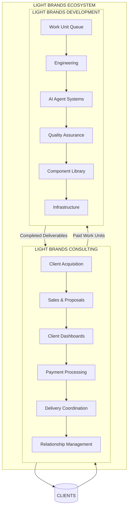

---

## 2. Client Journey Flow

```mermaid
flowchart LR
    subgraph AWARENESS["AWARENESS"]
        A1[Content Marketing]
        A2[Referrals]
        A3[Speaking Events]
    end

    subgraph INTEREST["INTEREST"]
        B1[Website Visit]
        B2[Case Studies]
        B3[Free Resources]
    end

    subgraph CONSIDER["CONSIDERATION"]
        C1["Illumination Session<br/>$500"]
    end

    subgraph DECIDE["DECISION"]
        D1[Custom Proposal]
        D2[Contract Signing]
        D3[Payment]
    end

    subgraph ENGAGE["ENGAGEMENT"]
        E1[Dashboard Access]
        E2[Project Kickoff]
        E3[Ongoing Communication]
    end

    subgraph DELIVER["DELIVERY"]
        F1[Work Completion]
        F2[Review & Approval]
        F3[Final Delivery]
    end

    subgraph ADVOCATE["ADVOCACY"]
        G1[Testimonial]
        G2[Referral]
        G3[Repeat Business]
    end

    AWARENESS --> INTEREST
    INTEREST --> CONSIDER
    CONSIDER --> DECIDE
    DECIDE --> ENGAGE
    ENGAGE --> DELIVER
    DELIVER --> ADVOCATE
    ADVOCATE -.->|"New Referrals"| AWARENESS
```

---

## 3. Work Unit Lifecycle

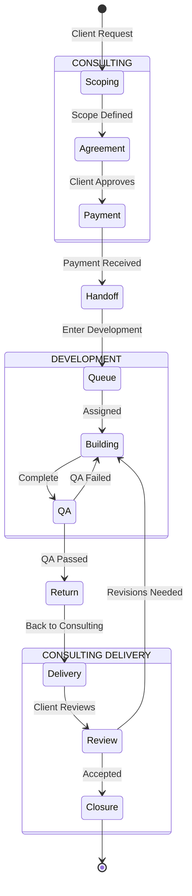

---

## 4. Service Tier Pyramid

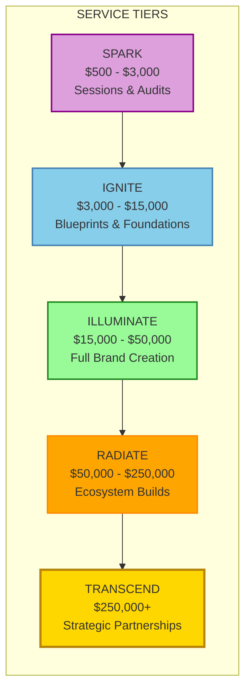

---

## 5. Light Brand Agency (AI Agents)

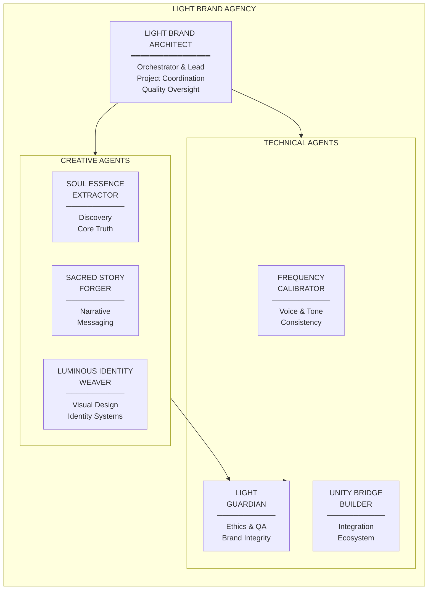

---

## 6. Technology Stack Map

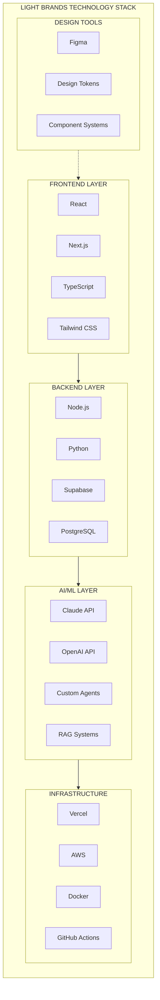

---

## 7. Portfolio Brands Network

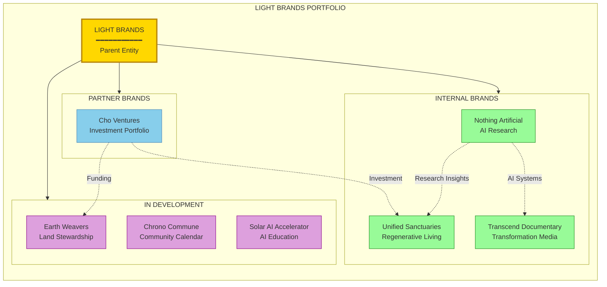

---

## 8. Financial Flow

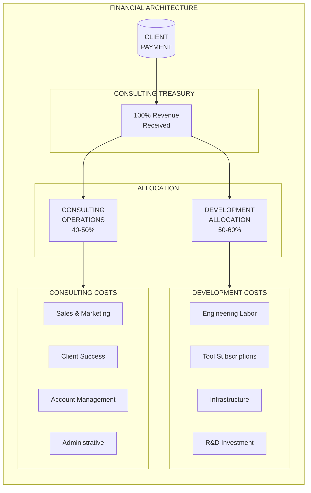

---

## 9. Client Dashboard Architecture

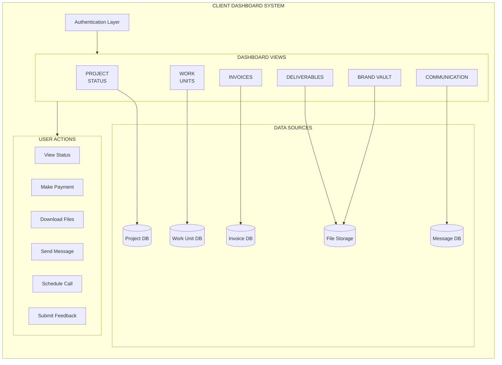

---

## 10. Handoff Protocol Visualization

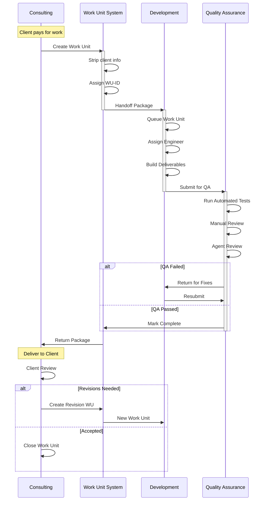

---

## 11. Growth Path Timeline

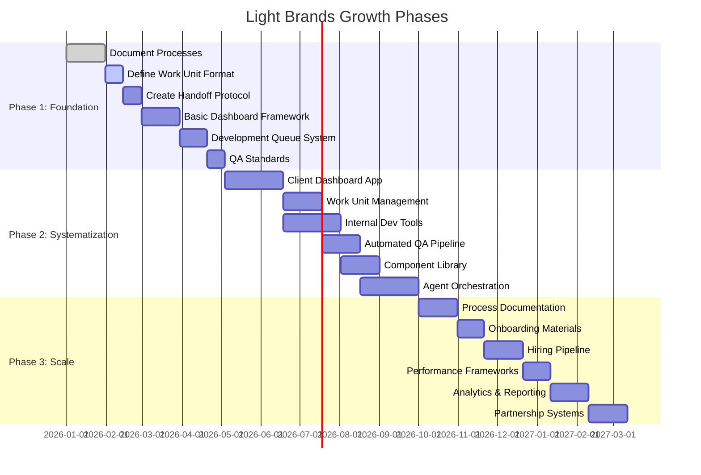

---

## 12. Organizational Evolution

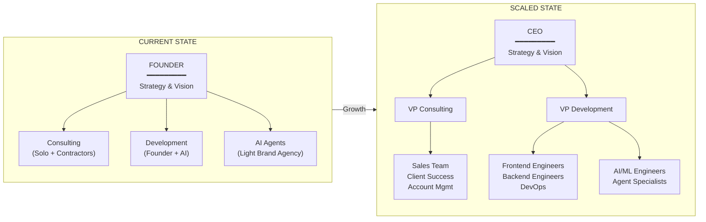

---

## 13. Integration Ecosystem

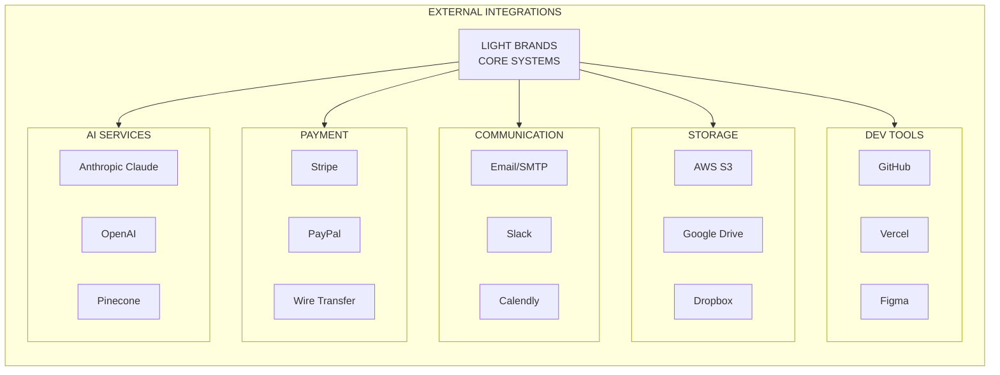

---

## 14. Success Metrics Dashboard Concept

```
┌─────────────────────────────────────────────────────────────────────────────┐
│                    LIGHT BRANDS EXECUTIVE DASHBOARD                          │
├─────────────────────────────────────────────────────────────────────────────┤
│                                                                              │
│  ┌───────────────────────────────────────────────────────────────────────┐  │
│  │  REVENUE                    │  CONSULTING METRICS                      │  │
│  │  ─────────────────────────  │  ─────────────────────────────────────  │  │
│  │                             │                                          │  │
│  │  MTD: $47,500               │  Lead Conversion    ████████░░  32%     │  │
│  │  YTD: $312,000              │  Client Satisfaction ██████████ 9.2    │  │
│  │  Target: $500,000           │  Client Retention   ████████░░  67%     │  │
│  │  Progress: ████████░░ 62%   │  Avg Project Value  $18,500             │  │
│  │                             │  Pipeline           $125,000             │  │
│  └───────────────────────────────────────────────────────────────────────┘  │
│                                                                              │
│  ┌───────────────────────────────────────────────────────────────────────┐  │
│  │  DEVELOPMENT METRICS        │  WORK UNIT STATUS                        │  │
│  │  ─────────────────────────  │  ─────────────────────────────────────  │  │
│  │                             │                                          │  │
│  │  On-Time Delivery  ██████████ 97%    Queued:      ████░░░░░░  4       │  │
│  │  Quality Score     ██████████ 99%    In Progress: ██████░░░░  6       │  │
│  │  Reusability       ████████░░ 45%    QA:          ██░░░░░░░░  2       │  │
│  │  Tech Debt Ratio   ██░░░░░░░░ 12%    Completed:   ████████████ 127   │  │
│  │  Agent Assist      █████████░ 78%                                      │  │
│  └───────────────────────────────────────────────────────────────────────┘  │
│                                                                              │
│  ┌───────────────────────────────────────────────────────────────────────┐  │
│  │  ACTIVE PROJECTS                                                       │  │
│  │  ─────────────────────────────────────────────────────────────────── │  │
│  │                                                                        │  │
│  │  Project           Tier        Status           Progress              │  │
│  │  ─────────────────────────────────────────────────────────────────── │  │
│  │  [Redacted]        Illuminate  Development      ████████░░ 80%       │  │
│  │  [Redacted]        Ignite      QA               ██████████ 95%       │  │
│  │  [Redacted]        Radiate     Discovery        ████░░░░░░ 40%       │  │
│  │  [Redacted]        Spark       Completed        ██████████ 100%      │  │
│  │                                                                        │  │
│  └───────────────────────────────────────────────────────────────────────┘  │
│                                                                              │
└─────────────────────────────────────────────────────────────────────────────┘
```

---

## 15. The Light Brands Mind Map

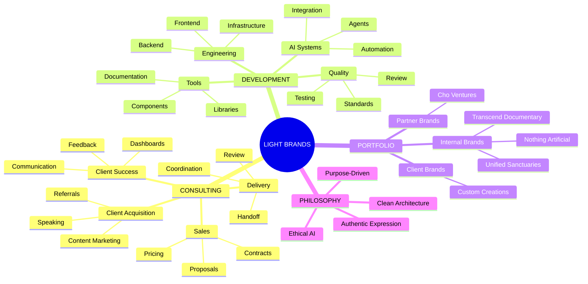

---

## Summary

This ecosystem map provides visual clarity on how Light Brands operates as a unified system. The clean division between Consulting (client-facing) and Development (engineering-focused) ensures:

1. **Clients** receive focused attention and clear communication
2. **Developers** work without interruption on quality deliverables
3. **Work flows** predictably through defined handoff protocols
4. **Quality** is maintained through systematic QA processes
5. **Growth** follows a clear path from solo to scaled operations

The portfolio of brands demonstrates the methodology in action, while the financial and organizational structures ensure sustainable growth.

---

*Ecosystem Map Version: 1.0*
*Last Updated: January 2026*
