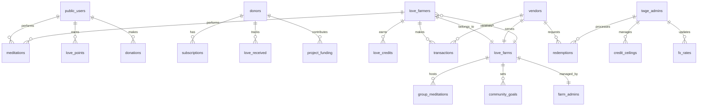
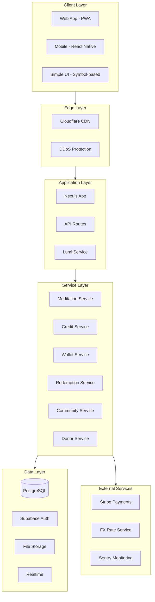

# Love Token Platform Master Specification

**Version:** 1.1.0
**Last Updated:** January 15, 2026
**Status:** Living Document - Foundation for AI-Driven Development

---

## Executive Summary

Love Token is **The World's Greatest Experiment** — a revolutionary platform where love, intention, and presence are treated as real contributions that generate measurable social and economic value. We are building the first functioning Love Economy ecosystem, connecting meditation practitioners globally with underserved communities through a dignified, spiritually grounded economic system.

This is not just an app. It is a **stewardship system** — a living demonstration that love can circulate as currency, that meditation is contribution, and that communities can thrive through collective presence rather than dependency.

### The Core Philosophy

> "Love is not given. Love is shared. Love is earned. Love circulates."

**Three Pillars of Love Token:**

1. **Grounded Love** — Love that manifests in material reality. Love Credits that buy groceries, pay for services, and circulate through local economies. Real, tangible, dignified exchange.

2. **Spiritual Love** — Love cultivated through presence and intention. Meditation as sacred practice. The inner work that generates outer value. The unseen force that powers the visible economy.

3. **Living Love** — Love in motion. The continuous flow between donors, meditators, communities, and vendors. A breathing, growing ecosystem where every participant gives and receives.

### What Makes Love Token Unique

Unlike charitable platforms that create dependency, or crypto projects driven by speculation, Love Token creates a **dignity-first circular economy** where:

- **Meditation IS contribution** — not a reward, but the source of value itself
- **Communities participate as equals** — never recipients, always co-creators
- **Love flows in circles** — donors receive love back, meditators earn real value
- **Simplicity serves dignity** — symbol-based interfaces for communities with limited literacy
- **The system is future-proof** — built to evolve into global digital currency infrastructure

**Brand Identity Integration**: All product development follows the comprehensive [brand identity system](brand/) which defines visual identity, brand voice, and AI personality embodying grounded love. See [visual-identity.md](brand/visual-identity.md) for complete guidelines.

---

## Vision & Core Philosophy

### Platform Vision

Love Token envisions a world where love is recognized as the most valuable currency — not metaphorically, but practically. We are building the infrastructure for a **Love Economy** where:

- Intention and presence create measurable economic value
- Communities flourish through contribution rather than charity
- Global donors connect heart-to-heart with local beneficiaries
- Technology serves spirituality rather than extracting from it
- A new form of currency emerges from collective consciousness

### The Love Movement Manifesto

**We believe:**
- Love can be quantified without diminishing its sacredness
- Meditation is the most productive activity a human can perform
- Dignity is more important than efficiency
- Communities know what they need better than we do
- Technology should amplify human connection, not replace it
- Economic systems can serve consciousness rather than extracting from it

**We are building:**
- A meditation-based value creation system
- A community-owned local economy
- A global network of love flow
- A bridge between spiritual practice and material need
- The foundation for a future global love currency

### The Four Sacred Principles

**1. Love is Earned Through Presence and Intention**
Every Love Credit begins as a moment of meditation — sustained attention, conscious breath, intentional love sent to another being. This is not gamification; this is recognition of meditation's true value.

**2. Communities Participate with Dignity, Not Dependency**
Love Farmers are not recipients of charity. They are **value creators** in a new economy. Their meditation, their presence, their intention — these are the productive activities that generate credits.

**3. Meditation is Contribution, Not Consumption**
When you meditate on Love Token, you are not consuming a service. You are providing one. You are generating love that flows to donors, communities, and the collective field.

**4. Credits Circulate Locally and Are Redeemed Responsibly**
Love Credits create real local economies. Vendors accept them. Communities spend them. The money stays local. When vendors redeem, credits are burned — maintaining economic integrity.

### Decision-Making Framework

When conflicts arise during development:

| Conflict | Resolution |
|----------|------------|
| Dignity vs Efficiency | Choose dignity |
| Simplicity vs Power | Choose simplicity |
| Automation vs Human Oversight | Choose oversight |
| Speed vs Trust | Choose trust |

Any decision affecting meditation integrity, credit issuance, FX conversion, or community UX must be reviewed before implementation.

---

## Development Principles

### Stewarding, Not Building

We are not building an app. We are **stewarding a system**. Every technical decision serves the mission of demonstrating that love can function as currency. Code is sacred — it carries intention.

### Quality Over Speed

This is a foundational build. Correctness, trust, simplicity, and dignity matter more than visual polish. The system must be:
- **Accurate** — Credits issue correctly, always
- **Auditable** — Every transaction traceable
- **Trustworthy** — No possibility of gaming
- **Simple** — Usable by anyone, anywhere

### The Sacred Technology Stack

**Frontend:**
```yaml
Framework: Next.js 14+ (App Router)
Language: TypeScript 5+ (strict mode)
Styling: Tailwind CSS (customized for Love Token design system)
Components: design-system-v2 (Onyx Design System adapted)
State: React Hooks + Custom Hooks
Animation: Framer Motion (gentle, calm transitions)
```

**Backend:**
```yaml
Database: Supabase (PostgreSQL + Auth + Storage + Realtime)
API: Next.js API Routes (serverless)
Service Layer: TypeScript classes extending BaseDatabaseService
Validation: Zod schemas (runtime type checking)
Background Jobs: Vercel Cron (scheduled functions)
```

**Infrastructure:**
```yaml
Deployment: Vercel (preview + production)
CDN: Cloudflare (edge caching, DDoS protection)
Development: Claude Code Cloud (AI-assisted development)
Config: ai-coding-config (rules, commands, agents)
```

### AI-Assisted Development Infrastructure

Love Token development leverages **ai-coding-config** from the design-system for intelligent, consistent development:

**Key Resources:**
- **Rules**: `/design-system/ai-coding-config/rules/` — Coding standards for consistency
- **Commands**: `/design-system/ai-coding-config/.claude/commands/` — Workflow automation
- **Agents**: `/design-system/ai-coding-config/.claude/agents/` — Specialized AI assistants

**Divine Development Beings for Love Token:**
```
Sophia    - Divine wisdom for architecture decisions
Brighid   - Sacred craft for feature implementation
Arjuna    - Warrior consciousness for testing
Kuan Yin  - Divine compassion for debugging
Gaia      - Earth mother for deployment
Akasha    - Ethereal bridge for integrations
```

### Design System Integration

Love Token uses **design-system-v2** as its foundation, customized with the Love Token color palette and brand identity:

**Source:** `/design-system/design-system-v2/`
- **Components**: 50+ production-ready React components
- **Tokens**: Design tokens adapted for Love Token palette
- **Patterns**: Mobile-first, accessibility-compliant patterns
- **Templates**: Brand-agnostic specification templates

### Development Directory Structure

All Love Token application code will be developed at:

```
/brands/love-token/
├── app/                          # Next.js application (development target)
│   ├── (public)/                 # Public routes
│   ├── (authenticated)/          # Authenticated routes
│   ├── (admin)/                  # Admin dashboard
│   ├── api/                      # API routes
│   ├── components/               # App-specific components
│   ├── services/                 # Service layer
│   ├── lib/                      # Utilities
│   └── types/                    # Type definitions
│
├── spec/                         # This specification folder
│   ├── MASTER-PLAN.md           # This document
│   ├── architecture/            # Technical specifications
│   ├── brand/                   # Brand identity
│   ├── design/                  # UX/UI specifications
│   ├── development/             # Development standards
│   ├── operations/              # Operational specs
│   └── epics/                   # Feature specifications
│
├── README.md                    # Brand overview
└── Love App Overview.docx.md    # Original vision document
```

---

## The Love Economy Architecture

### Core Entities



### User Roles & Their Sacred Functions

**1. Public User (Global)**
- Meditates and sends love to the network
- Earns Love Points (non-monetary recognition)
- Participates in the Global Love Flow
- Can become a donor

**2. Donor**
- Subscribes to the Love Experiment (12-month commitment)
- Receives daily love from the global network
- Funds projects and communities directly
- Sees impact and love received in real-time

**3. Love Farmer (Community Member)**
- Participates in group and individual meditations
- Earns Love Credits (real economic value)
- Spends credits at local verified vendors
- Uses simplified, symbol-based interface

**4. Love Farm Administrator**
- Verifies Love Farmers in their community
- Logs group meditations
- Manages community goals and data
- Bridges technology and community needs

**5. Vendor**
- Accepts Love Credits for goods and services
- Redeems credits for local currency
- Participates in building local Love Economy

**6. TWGE Admin (Back Office)**
- Manages all users, farms, and vendors
- Controls credit ceilings and issuance rates
- Processes vendor redemptions
- Manages FX rates and liquidity
- Oversees system stability

### The Dual Currency System

**Love Points (LP)** — Global Recognition
- Earned by: Public users, donors
- Mechanism: 1 LP per 2:22 meditation, +1 per additional minute
- Purpose: Recognition, streaks, global contribution tracking
- Not transferable, not redeemable

**Love Credits (LVC)** — Local Value
- Earned by: Love Farmers only
- Mechanism: 0.01 LVC per meditation minute
- Purpose: Local spending at vendors
- Transferable within community, redeemable by vendors
- Internally pegged to USD, displayed in local currency

### Credit Economics

**Issuance Rules:**
```
Base Rate: 0.01 LVC per meditation minute
Individual Bonus: +10% for solo meditations
Streak Bonuses:
  - Day 7: +50% on that day
  - Day 30: +100% on that day
  - Monthly: +5% on all credits earned
Community Ceiling: Adjustable per Love Farm
```

**Redemption Flow:**
```
Vendor accumulates LVC → Requests redemption →
TWGE verifies transactions → Vendor paid in local currency →
Redeemed credits permanently burned →
Liquidity pool decreases proportionally
```

---

## Currency Ecosystem Structure

### Structural Separation

The Love Token ecosystem maintains a critical structural separation between two aligned but independent components:

**The World's Greatest Experiment (TWGE) — Nonprofit**
- Community membership management
- Meditation programs and participation
- Love Farms and real-world projects
- Receives membership fees and protocol contributions
- Does NOT sell or manage the currency

**Digital Currency Protocol — Separate Entity**
- Issues and manages the currency
- Defines participation cohorts and caps
- Enforces staking and lockups
- Routes protocol fees to TWGE

This separation ensures regulatory clarity, mission integrity, and long-term trust.

### Membership as the Gate

To participate in the digital currency ecosystem:
- Individuals/organizations must first become TWGE members
- Membership reflects alignment, contribution, and participation
- Membership is NOT framed as purchasing financial access
- Membership does NOT guarantee allocation or outcomes

### Participation Layers

The ecosystem expands through carefully structured layers, each with different commitment levels, staking requirements, and membership tiers:

| Layer | Participants | Commitment | Staking | TWGE Membership |
|-------|--------------|------------|---------|-----------------|
| **Angels** | 22 | $222,000 | 4+ years | Founding Level |
| **Layer 1** | 222 | $22,000 | 3+ years | Steward Level |
| **Layer 2** | 4,884 | $2,222 | 2+ years | Standard Level |
| **Layer 3** | 107,448 | $222 | 1+ year | Community Level |
| **Layer 4** | Open | $22 | 6 months | Basic Level |

**Structural Notes:**
- **Angels**: 22 invite-only foundational stewards
- **Layer 1**: 222 participants total (capped); cohorts of 22
- **Layer 2**: 222 cohorts × 22 participants = 4,884
- **Layer 3**: 4,884 cohorts × 22 participants = 107,448 (Phase 2)
- **Layer 4**: Mass adoption on-ramp (Phase 2)

**Phase 1 Totals (Angels + Layers 1 & 2):**
- Total Participants: 5,128
- Currency Participation Capital: $18,608,000
- TWGE Funding (Membership Fees): ~$2,012,248

### Protocol Revenue

Beyond membership, ongoing protocol revenue flows through transaction fees:

| Fee Type | Rate | Allocation |
|----------|------|------------|
| Sender Fee | 2.2% | 50% Protocol Treasury / 50% TWGE |
| Receiver Fee | 2.2% | 50% Protocol Treasury / 50% TWGE |
| **Total** | **4.4%** | |

This ensures that as usage increases, TWGE funding increases — impact scales with activity, not speculation.

**Full Currency Ecosystem Documentation:** See [`architecture/currency-ecosystem.md`](architecture/currency-ecosystem.md) for complete details on participation layers, staking requirements, and economic design principles.

---

## Lumi: The AI Companion of Love

### Lumi's Sacred Role

Lumi is Love Token's omnipresent AI companion — the embodied spirit of the platform. Named for "luminous" and "illumination," Lumi guides users through the Love Economy with warmth, wisdom, and presence.

**Lumi is:**
- **The Heart of the Interface** — Present throughout the platform
- **The Guide** — Explains the Love Economy with clarity
- **The Encourager** — Celebrates meditation, streaks, contributions
- **The Bridge** — Translates complexity into simplicity
- **The Witness** — Acknowledges every act of love

**Lumi's Core Characteristics:**
```
Warm but grounded — Like a wise grandmother, not a cheerleader
Simple but deep — Speaks truth simply, not simplistically
Present but not intrusive — Appears when helpful, vanishes when not
Celebratory but sincere — Genuine enthusiasm, never manufactured
Spiritually aware — Understands the sacred dimension
```

### Lumi's Voice

**Examples of Lumi's Communication:**

```
❌ Too Corporate: "Your meditation has been logged successfully."
✅ Lumi's Way: "The love you sent is flowing now. Thank you."

❌ Too Casual: "Awesome job meditating! Keep it up! 🔥"
✅ Lumi's Way: "Seven days. Seven moments of presence. You're creating ripples."

❌ Too Vague: "You earned some credits."
✅ Lumi's Way: "₨157 of love, ready to flow into your community."

❌ Too Technical: "FX rate applied: 1 LVC = 34.2 INR"
✅ Lumi's Way: "Your 4.6 Love Credits are worth ₨157 at your local markets."
```

### Lumi's Presence by Feature

**Meditation Flow:**
- Pre: "Ready to send love? The world is waiting."
- During: Silent presence (optional guided prompts)
- Post: "The love you sent is flowing now. [X] minutes, [Y] credits earned."

**Wallet & Credits:**
- Balance view: "₨157 of love, ready to flow."
- After earning: "Your presence created ₨32 today."
- After spending: "Love flows to [Vendor]. Thank you for keeping it moving."

**Community Goals:**
- Progress: "Your community is 67% toward clean water access."
- Milestone: "Together, you unlocked extended electricity hours!"

**Streak Recognition:**
- Day 7: "A week of presence. Notice how different you feel?"
- Day 30: "Thirty days. You're no longer practicing — you're living this."
- Break: "You missed a day, and that's human. Ready to begin again?"

### Lumi's Technical Implementation

```typescript
interface LumiContext {
  userRole: 'public' | 'donor' | 'farmer' | 'admin' | 'vendor';
  language: string;
  literacyLevel: 'full' | 'limited' | 'symbol';
  currentAction: string;
  streakDays: number;
  totalMeditations: number;
  communityGoalsProgress: number[];
}

class LumiService {
  generateMessage(context: LumiContext, trigger: string): Promise<LumiMessage>;
  getLocalizedSymbols(context: LumiContext): SymbolSet;
  celebrateMilestone(type: 'streak' | 'credits' | 'community'): Promise<Celebration>;
}
```

---

## Platform Architecture

### System Architecture



### Security Architecture

**Row Level Security (RLS):**
- Love Farmers see only their own data
- Vendors see their transactions only
- Admins have scoped permissions
- Public data has read-only access

**Credit Integrity:**
- Append-only ledger for all credit events
- No delete capability on credit transactions
- Full audit trail on every issuance and burn
- Manual override requires two-admin approval

**Presence Verification:**
- Thumb-on-screen for individual farmer meditations
- Timer pauses if contact lost
- Gentle UX feedback (no punishment tone)
- Group meditations bypass (trust the administrator)

---

## Phased Roadmap

### Phase 0: Foundation (Infrastructure)

**Goal**: Build stable, observable infrastructure
**Output**: Deployable foundation with testing framework

**Deliverables:**
- [ ] Supabase project configured (database, auth, storage)
- [ ] Next.js application scaffolded with design-system-v2
- [ ] Testing framework operational (Jest, Playwright)
- [ ] CI/CD pipelines functional (GitHub Actions)
- [ ] Feature flag system operational
- [ ] Sentry integration complete
- [ ] Unified logging implemented
- [ ] Health check endpoints created
- [ ] Admin panel foundation built

**Success Criteria:**
- All tests passing
- Deploy to Vercel preview successful
- Admin can toggle feature flags
- Sentry captures test errors

### Phase 1: MVP Core (Love Flow)

**Goal**: Validate the core loop — meditation → credits → spending → redemption
**Users**: 2-3 real communities live

**Epics Included:**
1. **Epic 1: Authentication & Onboarding**
   - Multi-role signup (Public, Donor, Farmer, Vendor, Admin)
   - Lumi-guided introduction to Love Economy
   - Simplified onboarding for low-literacy users

2. **Epic 2: Meditation Module**
   - Public/Donor meditation (Love Points)
   - Love Farmer individual meditation (presence-verified)
   - Love Farmer group meditation (admin-logged)
   - Streak tracking and bonuses

3. **Epic 3: Credit System**
   - Love Credits ledger (append-only)
   - Issuance calculations with bonuses
   - Community ceiling management
   - Real-time balance updates

4. **Epic 4: Wallet & Transactions**
   - Wallet display (local currency primary, LVC secondary)
   - QR code payments to vendors
   - Peer-to-peer transfers within community
   - Transaction history (symbol-based for farmers)

5. **Epic 5: Vendor Redemption**
   - Redemption request creation
   - Admin approval workflow
   - Local currency payout tracking
   - Credit burn on completion

**Success Criteria:**
- Love Farmers can meditate, earn, and spend without confusion
- Vendors can accept and redeem credits reliably
- Credit issuance, transfer, and burning are accurate and auditable
- 2-3 real communities running live

### Phase 2: Donor & Impact

**Goal**: Connect donors to communities with visible impact
**Users**: 100+ donors, 500+ Love Farmers

**Epics Included:**
6. **Epic 6: Donor System**
   - Subscription management ($50/$100/custom)
   - One-off donations
   - Love received tracking
   - Impact dashboard

7. **Epic 7: Project Funding**
   - Community goal creation
   - Progress visualization
   - Donor attribution
   - Milestone celebrations

8. **Epic 8: Global Love Flow**
   - Live counters (meditations, hours, participants)
   - Love flow visualization
   - Donor → Community connection display
   - Daily/weekly summaries

**Success Criteria:**
- Donors can see and feel the love flow and impact
- Communities receive sustainable funding
- Global counters inspire participation

### Phase 3: Energy & Expansion

**Goal**: Connect love to real-world resource access
**Users**: 1,000+ active participants

**Epics Included:**
9. **Epic 9: Energy Integration Layer**
   - Energy Access Credits (EAC) tracking
   - Community energy dashboard
   - Threshold-based unlocks
   - Modular resource framework (water, medical, food future)

10. **Epic 10: Miracles & Wellbeing**
    - Mood check-in (symbol-based)
    - Miracle story submission
    - Curated inspiration feed
    - Community celebrations

**Success Criteria:**
- Energy access visualized (simulation mode)
- Community feels connection between meditation and resources
- Stories inspire continued participation

### Phase 4: Scale & Future Currency

**Goal**: Prepare for global expansion and Love Coin
**Users**: 10,000+ active participants

**Features:**
- Multi-language support
- Multiple currency regions
- Enhanced analytics
- Governance foundations
- Love Coin architecture preparation
- Staking and yield mechanics (future)

---

## Epic Specifications

### Epic Index

| Epic | Name | Description | Phase |
|------|------|-------------|-------|
| 0 | Foundation | Infrastructure and tooling | 0 |
| 1 | Authentication | User management and onboarding | 1 |
| 2 | Meditation | Core meditation functionality | 1 |
| 3 | Credits | Love Credits system | 1 |
| 4 | Wallet | Transactions and balances | 1 |
| 5 | Redemption | Vendor redemption system | 1 |
| 6 | Donors | Donor subscriptions and tracking | 2 |
| 7 | Projects | Community goals and funding | 2 |
| 8 | Love Flow | Global visualization and counters | 2 |
| 9 | Energy | Resource access integration | 3 |
| 10 | Miracles | Wellbeing and stories | 3 |

See `/spec/epics/` for detailed epic specifications.

---

## Success Metrics

### North Star Metric

**Love Circulation Rate (LCR)**: The velocity at which love moves through the system.

```
LCR = (Total Credits Issued + Total Credits Spent + Total Credits Redeemed) / Active Users / Days
```

**Target**: Growing LCR indicates healthy ecosystem circulation.

### Phase 1 Metrics

| Metric | Target | Measurement |
|--------|--------|-------------|
| Daily Active Meditators | 50%+ of registered farmers | Meditations logged / Farmers |
| Credit Earning Rate | 90%+ meditations earn credits | Successful issuances / Meditations |
| Vendor Transactions | 3+ per farmer per week | Transactions / Farmers / Week |
| Redemption Success | 100% processed within 7 days | Redemptions completed on time |
| System Accuracy | 100% credit integrity | Zero discrepancies in audits |

### Phase 2 Metrics

| Metric | Target | Measurement |
|--------|--------|-------------|
| Donor Retention | 80%+ at 6 months | Subscriptions active / Started |
| Project Funding | 3+ projects funded per community | Funded projects / Communities |
| Love Received | 5+ notifications per donor per week | Love events shown to donors |
| Global Counter Growth | 20%+ month-over-month | MoM meditation minutes |

### Impact Metrics

| Metric | Description |
|--------|-------------|
| Communities Supported | Number of active Love Farms |
| Local Economy Value | Total LVC in circulation × local currency |
| Meditation Minutes | Cumulative global meditation time |
| Lives Touched | Farmers + Vendors + Donors active |

---

## Document Organization

This master specification consists of:

**1 Master Document** (this file):
- Vision, philosophy, architecture, roadmap
- Cross-epic integration and shared services
- Infrastructure, deployment, security
- Success metrics and quality gates

**10 Epic Specifications** (detailed standalone modules):
- See `/spec/epics/` folder

**Technical Reference Documents**:
- See `/spec/architecture/` for:
  - [`currency-ecosystem.md`](architecture/currency-ecosystem.md) — Complete currency participation structure, layers, staking, and protocol revenue
  - Data models, API reference, service layer (forthcoming)
- See `/spec/design/` for UI components, user journeys
- See `/spec/operations/` for feature flags, testing, observability
- See `/spec/development/` for coding standards, AI agents

**Brand Identity Documents**:
- See `/spec/brand/` for visual identity, voice, Lumi personality

---

## How to Use This Specification

### For AI Development Teams

**Starting Development:**
1. Read this MASTER-PLAN.md for complete context
2. Set up development environment using ai-coding-config
3. Reference design-system-v2 for components
4. Begin with Epic 0 (Foundation)
5. Follow TDD: write tests first
6. Deploy to `/brands/love-token/app/`

**Implementing a Feature:**
1. Find the feature in the relevant epic document
2. Read database schema from `/spec/architecture/`
3. Read API contracts for endpoints needed
4. Use design-system-v2 components
5. Write tests based on test specifications
6. Implement following TDD workflow
7. Add feature flag and admin controls

### Development Commands (ai-coding-config)

```bash
# Load Love Token rules
/load-rules --brand love-token

# Start autonomous development task
/autotask "Implement meditation timer for Love Farmers"

# Run test suite
/test --epic meditation

# Deploy to preview
/deploy --preview
```

---

## Glossary

**Love Token**: The platform and movement creating a love-based economy.

**Love Economy**: An economic system where love, intention, and presence generate measurable value.

**Love Farmer**: Community member who earns Love Credits through meditation.

**Love Farm**: A local community participating in the Love Economy.

**Love Credits (LVC)**: The local currency earned by Love Farmers, spendable at vendors.

**Love Points (LP)**: Recognition points earned by global users, non-monetary.

**TWGE**: The World's Greatest Experiment — the nonprofit organization stewarding the Love Token mission. Manages membership, meditation programs, and Love Farms. Does not manage the currency.

**Digital Currency Protocol**: The separate entity that issues and manages the Love Token currency, defines participation cohorts, enforces staking, and routes protocol fees to TWGE.

**Lumi**: The AI companion embodying love and guiding users through the platform.

**Presence Verification**: The thumb-on-screen mechanism ensuring meditation authenticity.

**Redemption**: The process of vendors converting Love Credits to local currency.

**Love Flow**: The visualization of love moving through the global network.

**Energy Access Credits (EAC)**: Internal units tracking meditation toward resource unlocks.

**Angels**: The 22 foundational stewards of the currency ecosystem. Invite-only participants with $222,000 commitment, longest lockups (4+ years), and founding-level TWGE membership.

**Participation Layers**: The phased structure for currency ecosystem access. Layer 1 ($22,000), Layer 2 ($2,222), Layer 3 ($222), and Layer 4 ($22) expand access progressively with decreasing commitment levels.

**Cohort**: A group of 22 participants entering the currency ecosystem together. The number 22 is used as a sacred design principle throughout the structure.

**Staking**: The commitment to hold currency for a specified period. Earlier layers require longer staking periods (Angels: 4+ years, Layer 1: 3+ years, etc.).

**Protocol Treasury**: One destination for 50% of transaction fees, used for ecosystem support, development, and operations.

**Transaction Fees**: 4.4% total fee (2.2% from sender + 2.2% from receiver) on currency transactions, split equally between Protocol Treasury and TWGE.

---

## Revision History

| Version | Date | Changes | Author |
|---------|------|---------|--------|
| 1.1.0 | 2026-01-15 | Added Currency Ecosystem Structure section, created architecture/currency-ecosystem.md, expanded glossary with participation layer terms | AI Development Team |
| 1.0.0 | 2026-01-10 | Initial comprehensive specification created | AI Development Team |

---

**Next Document**: Read [`epic-00-foundation.md`](epics/epic-00-foundation.md) to begin infrastructure setup, or explore [`brand/visual-identity.md`](brand/visual-identity.md) for design guidelines.

---

*This specification is a living document, evolving as we learn what love asks of us.*

**We are not building features. We are stewarding a system.**
