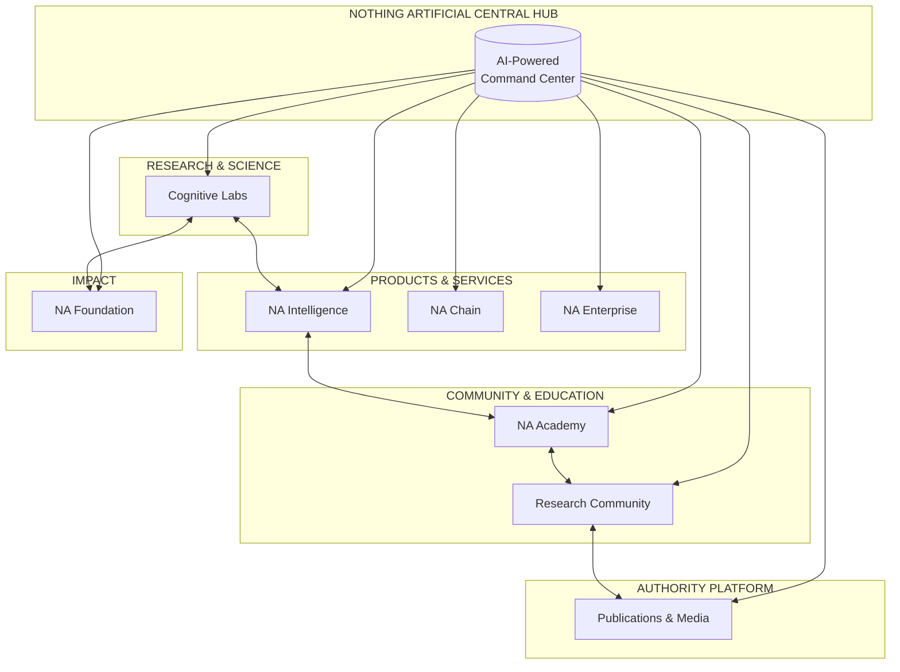

# Nothing Artificial

**Enhancing Humans — Technology in Service of Human Intelligence**

> *Founded within Montreal's scientific community with a clear directive: to enhance Human Intelligence.*

---

## Quick Summary

This is a comprehensive ecosystem strategy for Nothing Artificial, transforming human-centric technology initiatives into a unified, AI-powered platform. The plan provides a roadmap for connecting all entities—from Cognitive Labs research to NA Intelligence products, from the Research Community to NA Academy—into a cohesive ecosystem that amplifies the mission of enhancing human intelligence.

## The Vision

Nothing Artificial has built a unique position at the intersection of cognitive science, artificial intelligence, and blockchain technology—all unified by a singular philosophy: **technology should enhance human intelligence, not replace it.**

This strategy brings everything together through:

- **A Central Hub** — One unified platform connecting all entities
- **AI Infrastructure** — Intelligent systems powering operations across the portfolio
- **Community Platform** — Research community app as the heart of engagement
- **Authority Engine** — Academy, publications, and thought leadership amplification
- **Trust Layer** — Blockchain-based verification and credentials

---

## The Nothing Artificial Ecosystem

---

## Three-Phase Approach

| Phase | Focus | Deliverable |
|-------|-------|-------------|
| **Phase 1: Discovery** | Strategic Planning Session | Master Plan for Complete Integration |
| **Phase 2: Implementation** | Build & Deploy | Unified AI Infrastructure |
| **Phase 3: Authority** | Platform Launch | Academy, Community, Thought Leadership Position |

---

## Documentation

### Strategic Plan
- [MASTER-PLAN.md](./spec/MASTER-PLAN.md) — Complete strategic specification

### Implementation Phases
- [Phase 1: Discovery](./spec/phases/01-discovery.md) — Strategic Planning Session
- [Phase 2: Implementation](./spec/phases/02-implementation.md) — Build & Deploy Framework
- [Phase 3: Authority](./spec/phases/03-authority.md) — Platform Launch

### Architecture Specifications
- [Ecosystem Hub Architecture](./spec/architecture/ecosystem-hub.md) — Central Platform Design
- [AI Integration Map](./spec/architecture/ai-integration-map.md) — AI Touchpoints Across Portfolio
- [Community Platform](./spec/architecture/community-platform.md) — Research Community Specification

### Interactive Visualization
- [Ecosystem App](./app/) — Interactive ecosystem map (React Flow visualization)

---

## Core Focus Areas

Nothing Artificial operates across three integrated domains:

| Domain | Description |
|--------|-------------|
| **Cognitive Science** | Leveraging deep research into how humans think, learn, and process information |
| **Artificial Intelligence** | Developing AI-powered solutions that enhance rather than replace human capabilities |
| **Blockchain Technology** | Integrating distributed ledger systems for transparency, trust, and decentralized solutions |

---

## Philosophy

### "Nothing Artificial" — The Name Says It All

Despite working with artificial intelligence, the name reflects a deeper commitment: technology should feel natural, not forced. The goal isn't to create artificial experiences but to enhance authentic human ones.

### Human-Centric Technology

- **Augmentation over Automation** — Tools that make humans more capable, not obsolete
- **Intelligence Enhancement** — Expanding human cognitive capabilities through thoughtful technology
- **Integrated Solutions** — Combining multiple disciplines (cognitive science, AI, blockchain) for holistic approaches

---

## Company Details

| Attribute | Detail |
|-----------|--------|
| **Location** | Montreal, Quebec, Canada |
| **Founded** | ~2017 |
| **Website** | [nothingartificial.ai](https://nothingartificial.ai) |
| **Community** | Rooted in Montreal's scientific and research ecosystem |

---

## What They Represent

Nothing Artificial represents a thoughtful counterpoint to the "AI will replace everything" narrative. Their positioning suggests:

1. **Technology as Tool, Not Master** — AI and blockchain serve human goals, not the reverse
2. **Scientific Rigor** — Born from Montreal's research community, grounded in cognitive science
3. **Practical Innovation** — Products and services that deliver real value through integrated technology
4. **Human Dignity** — Enhancement of human intelligence preserves what makes us uniquely human

---

## Ecosystem Entities

| Entity | Type | Description |
|--------|------|-------------|
| **Nothing Artificial Hub** | Central Command | Portfolio management, AI orchestration, unified operations |
| **Cognitive Labs** | Research | Human cognition research, scientific foundation |
| **NA Intelligence** | Products | AI tools and products for human enhancement |
| **NA Chain** | Blockchain | Trust infrastructure, transparency protocols |
| **NA Enterprise** | B2B | Enterprise solutions, consulting, integration |
| **NA Academy** | Education | Courses, certifications, practitioner training |
| **Research Community** | Community | Member network, forums, events, collaboration |
| **Publications & Media** | Authority | Thought leadership, content, speaking |
| **NA Foundation** | Impact | Grants, open source, policy advocacy |

---

## Brand Character

### Voice

Scientific yet accessible. Confident in the value of human intelligence. Optimistic about technology's potential when properly directed.

### Positioning

*"We don't build artificial intelligence to replace human intelligence — we build tools that make human intelligence more powerful."*

---

## Next Steps

To begin the ecosystem transformation:

1. **Review the Master Plan** — [MASTER-PLAN.md](./spec/MASTER-PLAN.md)
2. **Understand Phase 1** — [Discovery Session](./spec/phases/01-discovery.md)
3. **Explore the Architecture** — [Ecosystem Hub](./spec/architecture/ecosystem-hub.md)
4. **See the Vision** — [Interactive Ecosystem Map](./app/)

---

*Nothing Artificial — Where technology enhances, rather than replaces, what makes us human.*

**A Light Brands project**
