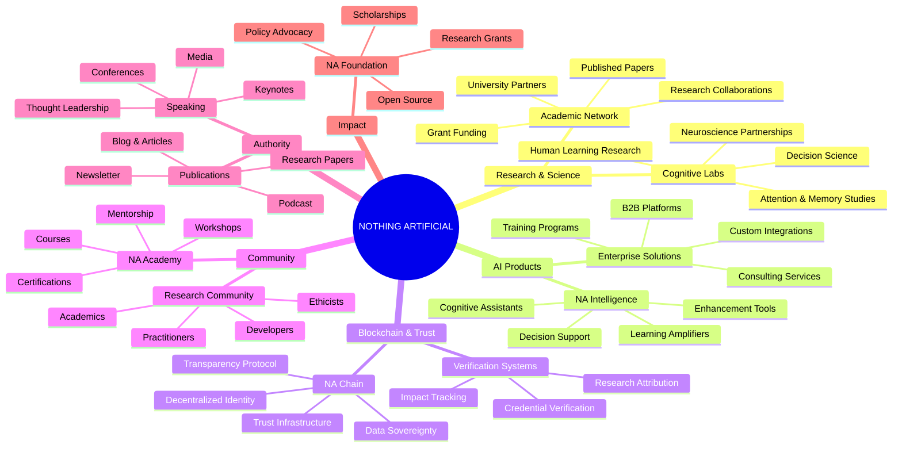
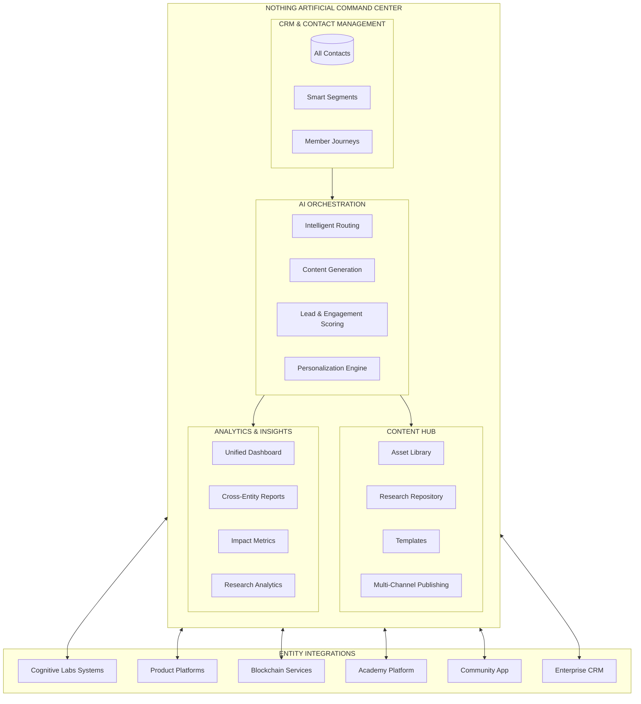
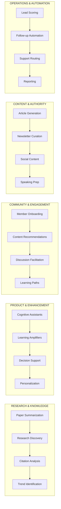
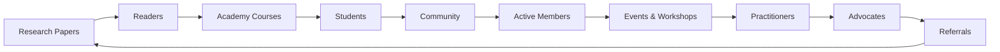
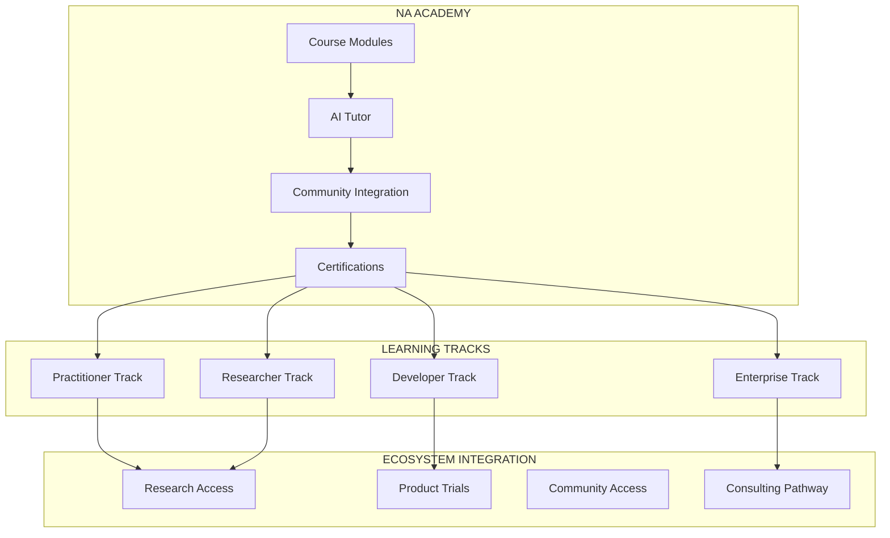
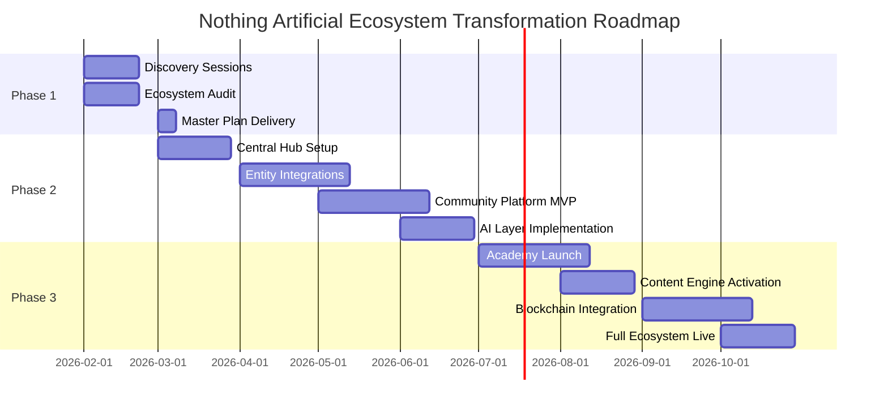
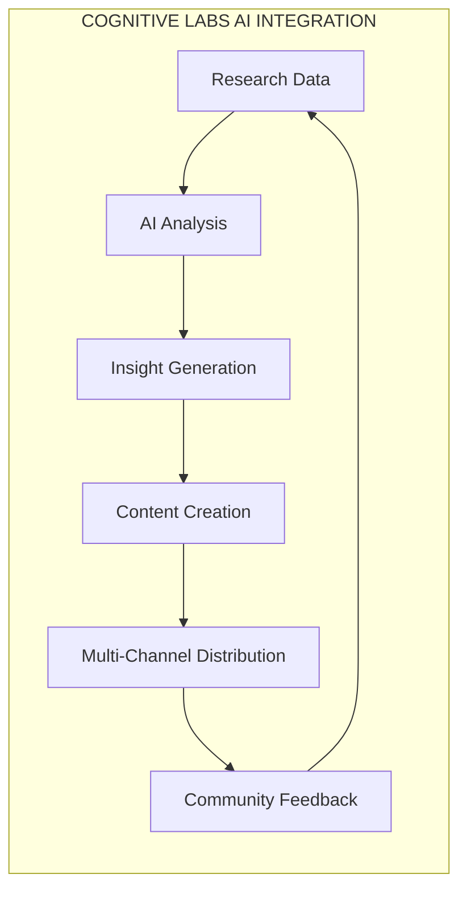

# Nothing Artificial Ecosystem: Master Plan

> *Transforming human-centric technology into an integrated ecosystem that enhances human intelligence across every touchpoint.*

---

## Table of Contents

1. [Executive Summary](#executive-summary)
2. [The Nothing Artificial Ecosystem](#the-nothing-artificial-ecosystem)
3. [Current State Assessment](#current-state-assessment)
4. [The Transformation Vision](#the-transformation-vision)
5. [Central Hub Architecture](#central-hub-architecture)
6. [AI Integration Map](#ai-integration-map)
7. [Authority Platform Strategy](#authority-platform-strategy)
8. [Three-Phase Framework](#three-phase-framework)
9. [Entity-Specific AI Strategies](#entity-specific-ai-strategies)
10. [Success Metrics](#success-metrics)

---

## Executive Summary

### The Opportunity

Nothing Artificial has built a unique position at the intersection of cognitive science, artificial intelligence, and blockchain technology—all unified by a singular philosophy: **technology should enhance human intelligence, not replace it.** Born from Montreal's thriving research community, the company is poised to become the definitive voice in human-centric technology.

**The opportunity is threefold:**

1. **Unification** — Connect all research, products, and services through an AI-powered central hub
2. **Amplification** — Use AI to multiply the reach and impact of human enhancement technology
3. **Authority** — Position Nothing Artificial as the global leader in human-centric AI philosophy

### The Stakes

Nothing Artificial is at an inflection point:
- **Growing AI anxiety** — The world needs a counter-narrative to "AI will replace humans"
- **Research momentum** — Montreal's AI ecosystem is flourishing
- **Market timing** — Organizations are seeking ethical, human-centered AI solutions
- **Community demand** — Practitioners want frameworks for human-AI collaboration

The organizations that establish thought leadership in human-centric AI now will:
- **Shape the narrative** around AI's role in society
- **Attract top talent** who believe in enhancement over replacement
- **Build loyal communities** of practitioners and believers
- **Lead enterprise adoption** of ethical AI practices

### The Solution

A comprehensive ecosystem transformation that:

```
┌─────────────────────────────────────────────────────────────────────────┐
│                   NOTHING ARTIFICIAL UNIFIED ECOSYSTEM                    │
├─────────────────────────────────────────────────────────────────────────┤
│                                                                          │
│   CENTRAL HUB          RESEARCH LAYER          PRODUCT LAYER            │
│   ───────────          ─────────────          ─────────────             │
│   • Command Center     • Cognitive Labs        • NA Intelligence        │
│   • AI Orchestration   • Research Papers       • Enhancement Tools      │
│   • Unified CRM        • Academic Partners     • Enterprise Solutions   │
│   • Content Engine     • Open Source           • Developer APIs         │
│   • Analytics          • Data Science                                    │
│                                                                          │
│   COMMUNITY LAYER      AUTHORITY LAYER         BLOCKCHAIN LAYER         │
│   ───────────────      ───────────────         ────────────────         │
│   • Member Platform    • Publications          • NA Chain               │
│   • Forums & Events    • Speaking & Podcasts   • Transparency Tools     │
│   • Learning Paths     • NA Academy            • Trust Infrastructure   │
│   • Certifications     • Thought Leadership    • Decentralized ID       │
│                                                                          │
│   AI LAYER             DATA LAYER              IMPACT LAYER             │
│   ────────             ──────────              ────────────             │
│   • Cognitive Models   • Unified Database      • Research Grants        │
│   • Enhancement AI     • Cross-Entity Intel    • Academic Partnerships  │
│   • Personalization    • Community Insights    • Open Source Projects   │
│   • Automation         • Impact Metrics        • Policy Influence       │
│                                                                          │
└─────────────────────────────────────────────────────────────────────────┘
```

---

## The Nothing Artificial Ecosystem

### Portfolio Overview



### Entity Profiles

| Entity | Type | Location | Core Function |
|--------|------|----------|---------------|
| **Nothing Artificial Hub** | Central Command | Montreal | Portfolio management, AI orchestration, unified operations |
| **Cognitive Labs** | Research Division | Montreal | Human cognition research, scientific foundation |
| **NA Intelligence** | Product Division | Montreal/Remote | AI tools and products for human enhancement |
| **NA Chain** | Blockchain Division | Montreal | Trust infrastructure, transparency protocols |
| **NA Enterprise** | B2B Division | Global | Enterprise solutions, consulting, integration |
| **NA Academy** | Education Platform | Digital | Courses, certifications, practitioner training |
| **Research Community** | Community Platform | Digital | Member network, forums, events, collaboration |
| **Publications & Media** | Authority Platform | Global | Thought leadership, content, speaking |
| **NA Foundation** | Impact Organization | Montreal | Grants, open source, policy advocacy |

### The Unified Story

Every entity serves the same mission: **demonstrating that technology can enhance human intelligence without diminishing human dignity.**

- **Cognitive Labs** provides the scientific foundation for all products
- **NA Intelligence** translates research into practical enhancement tools
- **NA Chain** ensures trust, transparency, and data sovereignty
- **NA Enterprise** brings human-centric AI to organizations
- **NA Academy** educates the next generation of practitioners
- **Research Community** connects believers and advances the field
- **Publications & Media** spreads the human-centric philosophy globally
- **NA Foundation** ensures the mission extends beyond profit

The ecosystem strategy must honor and amplify this unified story while enabling each entity to operate efficiently.

---

## Current State Assessment

### Likely Current State (To Be Validated in Discovery)

```
┌─────────────────────────────────────────────────────────────────────────┐
│                        CURRENT OPERATIONAL STATE                         │
├─────────────────────────────────────────────────────────────────────────┤
│                                                                          │
│   RESEARCH SILOS       PRODUCT GAPS            COMMUNITY ABSENT         │
│   ──────────────       ────────────            ─────────────────        │
│   • Papers scattered   • No product suite      • No unified platform    │
│   • No central repo    • Ideas not products    • Manual engagement      │
│   • Data fragmented    • MVP stage             • Events ad-hoc          │
│   • Collaboration      • Integration needed    • No member journey      │
│     manual                                                               │
│                                                                          │
│   AUTHORITY GAPS       OPERATIONS              BLOCKCHAIN POTENTIAL     │
│   ──────────────       ──────────              ────────────────────     │
│   • No course platform • Manual processes      • Concept stage          │
│   • Content scattered  • Email overwhelm       • No products yet        │
│   • Speaking ad-hoc    • Follow-up gaps        • Infrastructure needed  │
│   • List not unified   • No unified CRM        • Use cases undefined    │
│                                                                          │
└─────────────────────────────────────────────────────────────────────────┘
```

### Integration Challenges

| Challenge | Impact | Current State |
|-----------|--------|---------------|
| **No unified platform** | Lost synergies, scattered efforts | Research, products, content disconnected |
| **No community hub** | Limited reach and engagement | Manual outreach, no member tracking |
| **Research not productized** | Untapped commercial potential | Papers ≠ products |
| **No CRM** | Relationships fragmented | Contacts in spreadsheets/email |
| **Content scattered** | Diluted brand impact | No content strategy |
| **Blockchain not built** | Differentiation unrealized | Conceptual only |

### The Hidden Potential

Every person who interacts with Nothing Artificial is a potential:
- **Research Community member** interested in human-centric AI
- **NA Intelligence customer** seeking enhancement tools
- **NA Academy student** wanting to learn the philosophy
- **Enterprise client** looking for ethical AI solutions
- **Publication reader** spreading the message
- **Foundation supporter** advancing the mission

Currently, these connections are made manually, if at all. A unified ecosystem changes everything.

---

## The Transformation Vision

### The Unified Ecosystem

```mermaid
flowchart TB
    subgraph AUDIENCE["AUDIENCE TOUCHPOINTS"]
        WEB[Websites]
        SOCIAL[Social Media]
        EVENTS[Events & Conferences]
        MEDIA[Media & Podcasts]
        REFERRAL[Academic Referrals]
        RESEARCH[Research Publications]
    end

    subgraph HUB["CENTRAL AI HUB"]
        CRM[("Unified CRM<br/>All Contacts")]
        AI_ENGINE[AI Engine]
        CONTENT[Content Engine]
        ANALYTICS[Analytics]
    end

    subgraph RESEARCH["RESEARCH LAYER"]
        COGNITIVE[Cognitive Labs]
        PAPERS[Publications]
        DATA[Research Data]
        PARTNERS[Academic Partners]
    end

    subgraph PRODUCTS["PRODUCT LAYER"]
        INTELLIGENCE[NA Intelligence]
        ENTERPRISE[NA Enterprise]
        CHAIN[NA Chain]
        APIS[Developer APIs]
    end

    subgraph COMMUNITY["COMMUNITY PLATFORM"]
        APP[Community App]
        PORTAL[Member Portal]
        LEARNING[Academy Platform]
        FORUMS[Discussion Forums]
    end

    subgraph AUTHORITY["AUTHORITY ENGINE"]
        COURSES[Online Courses]
        NEWSLETTER[Newsletter]
        SPEAKING[Speaking/Podcasts]
        THOUGHT[Thought Leadership]
    end

    WEB --> CRM
    SOCIAL --> CRM
    EVENTS --> CRM
    MEDIA --> CRM
    REFERRAL --> CRM
    RESEARCH --> CRM

    CRM --> AI_ENGINE
    AI_ENGINE --> CONTENT
    AI_ENGINE --> ANALYTICS

    CRM <--> COGNITIVE
    CRM <--> PAPERS
    CRM <--> DATA
    CRM <--> PARTNERS

    CRM <--> INTELLIGENCE
    CRM <--> ENTERPRISE
    CRM <--> CHAIN
    CRM <--> APIS

    CRM <--> APP
    APP <--> PORTAL
    APP <--> LEARNING
    APP <--> FORUMS

    CRM <--> COURSES
    COURSES <--> LEARNING
    CRM <--> NEWSLETTER
    CRM <--> SPEAKING
```



### Core Capabilities

| Capability | Description | Impact |
|------------|-------------|--------|
| **Unified Contact Hub** | Every relationship across all entities in one system | Complete visibility, no lost connections |
| **Research-to-Product Pipeline** | AI tracks research for commercialization potential | Faster innovation cycles |
| **Community Platform** | Member app as the heart of engagement | Scalable community at depth |
| **Authority Engine** | Academy, newsletter, speaking integrated | Thought leadership amplification |
| **AI Content Generation** | Consistent content across all entities | Brand cohesion, reduced effort |
| **Unified Dashboard** | Real-time visibility across portfolio | Informed decisions, impact tracking |
| **Blockchain Infrastructure** | Trust layer for all interactions | Differentiated, verified experiences |

---

## Central Hub Architecture

### The Command Center



### Technology Stack Recommendations

| Layer | Recommended Tools | Purpose |
|-------|------------------|---------|
| **CRM Core** | HubSpot or Salesforce | Contact management, automation, pipeline |
| **AI Layer** | Claude API, Custom Models | Content, intelligence, personalization |
| **Community App** | Custom Build or Circle.so | Research community platform |
| **Academy Platform** | Teachable, Thinkific, or Custom | Courses, certifications |
| **Research Repository** | Custom + GitHub | Papers, data, code |
| **Blockchain Layer** | Ethereum/Polygon or Custom | Trust infrastructure |
| **Analytics** | Custom Dashboard + Mixpanel | Cross-entity visibility |
| **Websites** | Next.js + Headless CMS | Unified design system |

---

## AI Integration Map

### AI Touchpoints Across the Ecosystem



### Priority AI Implementations

#### Priority 1: Unified CRM with Cross-Entity Intelligence
**Problem:** Contacts and relationships scattered across entities
**Solution:** Single CRM with AI that identifies cross-entity opportunities
**Example:** A researcher interested in cognitive science gets invited to NA Academy courses and community events

#### Priority 2: Community Platform with AI Engagement
**Problem:** Community engagement requires manual effort that doesn't scale
**Solution:** Community app with AI that personalizes member experience
**Example:** AI recommends papers, courses, and connections based on member interests and expertise

#### Priority 3: Research-to-Content Pipeline
**Problem:** Research insights don't reach broader audience
**Solution:** AI-powered content system that translates research into accessible content
**Example:** AI generates blog posts, social content, and newsletter segments from research papers

#### Priority 4: Academy Learning Intelligence
**Problem:** One-size-fits-all learning doesn't serve diverse practitioners
**Solution:** AI-personalized learning paths based on background and goals
**Example:** AI creates custom certification tracks for different practitioner types

---

## Authority Platform Strategy

### The Authority Flywheel



### Content Strategy

**Nothing Artificial's content** positions the company as the definitive voice in human-centric AI. The ecosystem supports:

| Component | AI Role |
|-----------|---------|
| **Research Dissemination** | AI translates papers into accessible content |
| **Newsletter Curation** | AI personalizes content for different segments |
| **Social Presence** | AI generates platform-specific content |
| **Speaking Support** | AI prepares talking points, researches hosts |
| **Course Content** | AI assists in curriculum development |

### Academy Platform Architecture



### Course Offerings

| Track | Target Audience | Outcome |
|-------|-----------------|---------|
| **Human-Centric AI Foundations** | All practitioners | Understanding the philosophy |
| **Cognitive Science for Technologists** | Developers, PMs | Apply cognitive principles to products |
| **Enterprise Human-AI Integration** | Business leaders | Implement ethical AI in organizations |
| **Research Methods in Enhancement** | Academics, researchers | Conduct human-centric research |
| **Blockchain for Trust** | Developers, architects | Build transparent systems |

### Speaking & Media Engine

| Component | Description |
|-----------|-------------|
| **Speaking Kit** | AI-generated speaker materials, topic variations, bio versions |
| **Podcast Prep** | AI researches hosts, suggests talking points, prepares questions |
| **Conference Strategy** | AI identifies relevant conferences and speaking opportunities |
| **Media Follow-up** | Automated thank-you and stay-in-touch sequences |
| **Content Repurposing** | AI turns speaking content into articles, social, newsletter |

---

## Three-Phase Framework

### Overview



### Phase 1: Discovery & Strategy

**Duration:** 2-3 weeks
**Deliverable:** Comprehensive Master Plan

#### Discovery Sessions

| Session | Focus | Participants |
|---------|-------|--------------|
| **Session 1** | Vision Alignment & Philosophy Deep-Dive | Leadership |
| **Session 2** | Research & Cognitive Labs Assessment | Research Team |
| **Session 3** | Product & Technology Audit | Product/Engineering |
| **Session 4** | Community & Academy Vision | Community/Education Leads |
| **Session 5** | Enterprise & Market Strategy | Business Development |
| **Session 6** | Roadmap Presentation & Decision | All Stakeholders |

#### Phase 1 Deliverables

1. **Ecosystem Audit Report** — Current state of all entities, systems, and processes
2. **AI Opportunity Matrix** — Prioritized opportunities across all entities
3. **Unified Architecture Design** — Target state system diagram
4. **Community Platform Specification** — Research community app requirements
5. **Academy Platform Plan** — Courses, certifications, learning paths
6. **Implementation Roadmap** — Phased plan with dependencies
7. **Investment Framework** — Costs, timeline, ROI projections

### Phase 2: Implementation

**Duration:** 4-6 months
**Deliverable:** Operational AI-Powered Infrastructure

#### Implementation Components

| Component | Description | Dependencies |
|-----------|-------------|--------------|
| **Central Hub** | CRM setup, unified database, core workflows | None |
| **Research Integration** | Connect Cognitive Labs to central hub | Central Hub |
| **Product Integration** | Connect NA Intelligence platforms | Central Hub |
| **Community Platform MVP** | Research community core functionality | Central Hub |
| **AI Layer** | Intelligence, automation, personalization | All Above |
| **Dashboard** | Cross-entity visibility | All Above |

### Phase 3: Authority Launch

**Duration:** 4-6 months
**Deliverable:** Full Authority Platform + Community Engagement

#### Authority Components

| Component | Description |
|-----------|-------------|
| **Academy Launch** | Courses, AI tutor, certification system |
| **Content Engine** | Multi-channel, AI-generated content strategy |
| **Blockchain Layer** | Trust infrastructure, verification systems |
| **Community Scale** | Full features, engagement programs |
| **Enterprise Platform** | B2B portal, consulting pipeline |

---

## Entity-Specific AI Strategies

### Cognitive Labs



| AI Application | Description |
|----------------|-------------|
| Research Discovery | AI monitors literature for relevant papers |
| Data Analysis | AI assists in analyzing cognitive research data |
| Paper Summarization | AI creates accessible summaries of research |
| Collaboration Matching | AI identifies potential research collaborators |
| Grant Intelligence | AI tracks funding opportunities |

### NA Intelligence (Products)

| AI Application | Description |
|----------------|-------------|
| Product Personalization | AI tailors enhancement tools to user profiles |
| Usage Analytics | AI identifies patterns to improve products |
| Customer Success | AI predicts churn and triggers intervention |
| Feature Discovery | AI surfaces relevant features based on usage |
| Integration Recommendations | AI suggests optimal product configurations |

### NA Enterprise

| AI Application | Description |
|----------------|-------------|
| Lead Qualification | AI scores and routes enterprise inquiries |
| Proposal Generation | AI assists in creating custom proposals |
| Account Intelligence | AI monitors client needs and opportunities |
| ROI Modeling | AI helps demonstrate value to prospects |
| Implementation Support | AI guides enterprise deployments |

### NA Academy

| AI Application | Description |
|----------------|-------------|
| Learning Path Personalization | AI creates custom curricula based on goals |
| AI Tutor | Real-time assistance during courses |
| Progress Prediction | AI identifies at-risk students |
| Content Recommendations | AI suggests supplementary materials |
| Certification Intelligence | AI verifies competency and readiness |

### Research Community

| AI Application | Description |
|----------------|-------------|
| Member Matching | AI connects members with shared interests |
| Content Curation | AI personalizes member feeds |
| Discussion Facilitation | AI highlights important threads |
| Event Recommendations | AI suggests relevant events and workshops |
| Expertise Mapping | AI tracks and surfaces member expertise |

### NA Chain (Blockchain)

| AI Application | Description |
|----------------|-------------|
| Verification Automation | AI triggers blockchain verification |
| Anomaly Detection | AI monitors for trust violations |
| Attribution Tracking | AI ensures proper credit in research |
| Identity Management | AI assists in decentralized identity |
| Impact Certification | AI verifies impact claims on-chain |

### NA Foundation

| AI Application | Description |
|----------------|-------------|
| Grant Screening | AI evaluates grant applications |
| Impact Measurement | AI tracks and reports foundation impact |
| Donor Intelligence | AI identifies potential supporters |
| Research Prioritization | AI helps allocate research funding |
| Open Source Triage | AI manages open source contributions |

---

## Success Metrics

### Ecosystem Metrics

| Metric | Current State | Target State |
|--------|--------------|--------------|
| Unified Contact Database | Siloed | 100% in one system |
| Cross-Entity Engagement | Manual/rare | Automated, 10x increase |
| Community Members (App) | N/A | 25,000+ active |
| Newsletter Subscribers | Fragmented | Unified, 100,000+ |
| Content Velocity | Manual, slow | AI-assisted, 5x faster |
| Research-to-Content Time | Months | Days |

### Authority Metrics

| Metric | Target |
|--------|--------|
| Academy Enrollments (Year 1) | 2,500+ |
| Certifications Issued (Year 1) | 1,000+ |
| Newsletter Subscribers | 50,000+ |
| Speaking Engagements | 36+/year |
| Podcast Appearances | 75+/year |
| Media Mentions | 150+/year |

### Entity Metrics

| Entity | Key AI-Enabled Metric |
|--------|----------------------|
| Cognitive Labs | Research-to-content conversion 90%+ |
| NA Intelligence | User engagement 3x improvement |
| NA Enterprise | Lead response time < 5 minutes |
| NA Academy | Course completion rate 80%+ |
| Research Community | Member active rate 40%+ |
| NA Foundation | Grant processing time 50% reduction |

### Impact Metrics

| Metric | Description |
|--------|-------------|
| Philosophy Adoption | Organizations implementing human-centric AI |
| Practitioner Training | Certified human-centric AI practitioners |
| Research Output | Papers and studies advancing the field |
| Open Source Impact | Projects and contributions |
| Policy Influence | Engagement with policymakers on ethical AI |

---

## Investment Framework

### Phase Investment Summary

| Phase | Duration | Investment Range |
|-------|----------|-----------------|
| **Phase 1: Discovery** | 2-3 weeks | $15,000 - $25,000 |
| **Phase 2: Implementation** | 4-6 months | $75,000 - $150,000 |
| **Phase 3: Authority Launch** | 4-6 months | $60,000 - $120,000 |
| **Optional: Team Training** | Ongoing | $5,000 - $50,000 |

### ROI Projections

| Area | Investment | Expected Return |
|------|------------|-----------------|
| Community Platform | $40K | 25,000 engaged members |
| Academy Launch | $35K | $250K+ annual revenue |
| Content Engine | $20K | 5x content velocity |
| Enterprise Pipeline | $30K | $500K+ annual contracts |
| Research Efficiency | $25K | 3x research output |

---

## Next Steps

### To Begin Phase 1

1. **Schedule Discovery Kickoff** — Align on vision, timeline, participants
2. **Complete Ecosystem Questionnaire** — Baseline information gathering
3. **Confirm Session Schedule** — Book 6 discovery sessions
4. **Execute Discovery** — Deep-dive sessions across all entities
5. **Receive Master Plan** — Comprehensive deliverable with recommendations
6. **Decide on Phase 2** — Proceed with implementation

### Immediate Priorities

1. **Define entity boundaries** — Clarify what exists vs. what needs to be built
2. **Identify key stakeholders** — Who drives each entity?
3. **Technology audit** — What systems currently exist?
4. **Research inventory** — What cognitive science assets exist?
5. **Community baseline** — Current audience and engagement

---

*Nothing Artificial — Where technology enhances, rather than replaces, what makes us human.*

**The future of AI is human. Let's build it together.**
