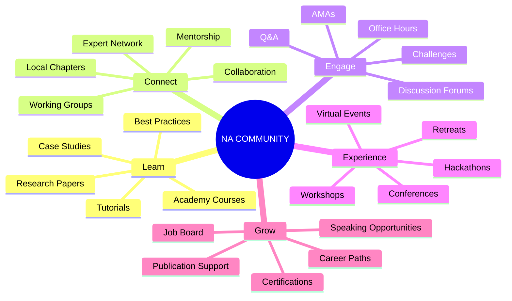
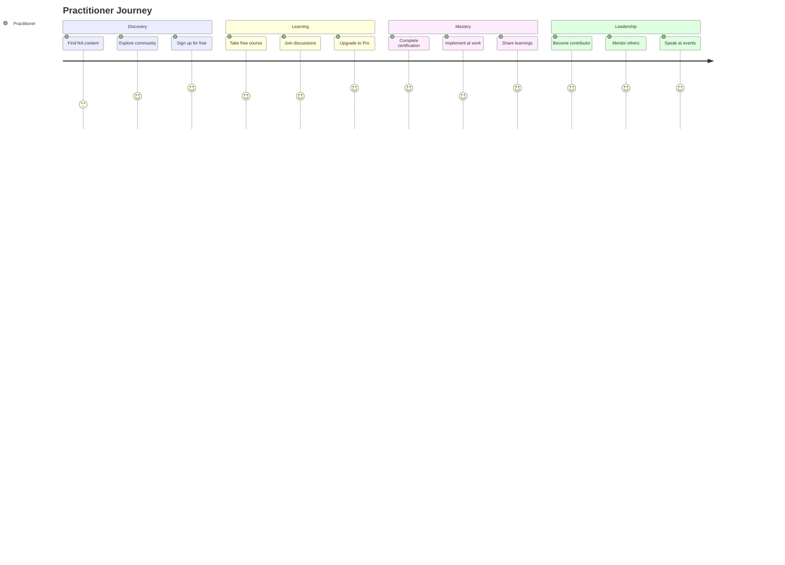
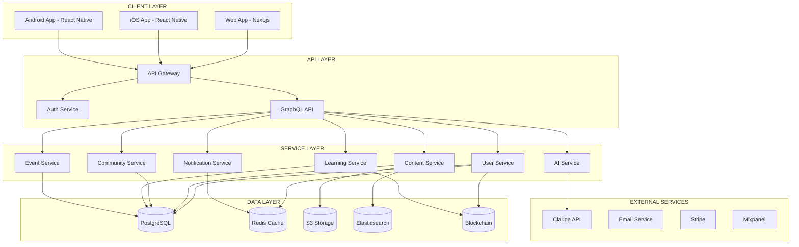
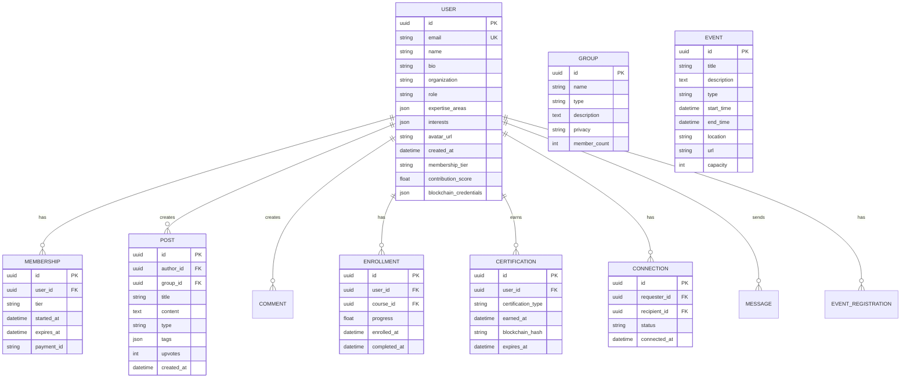
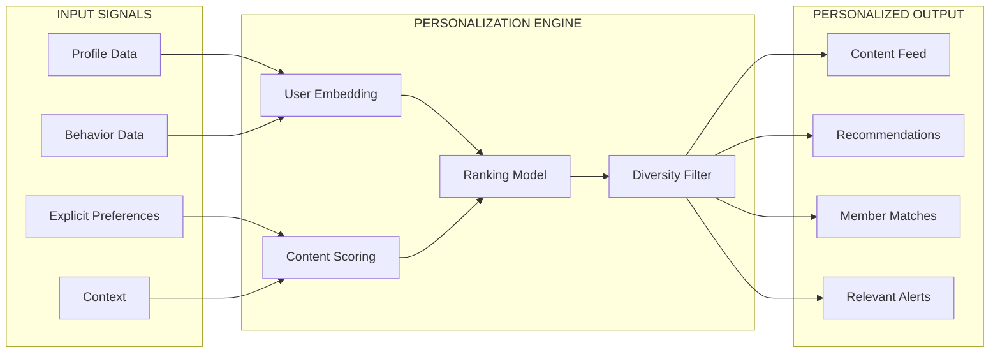
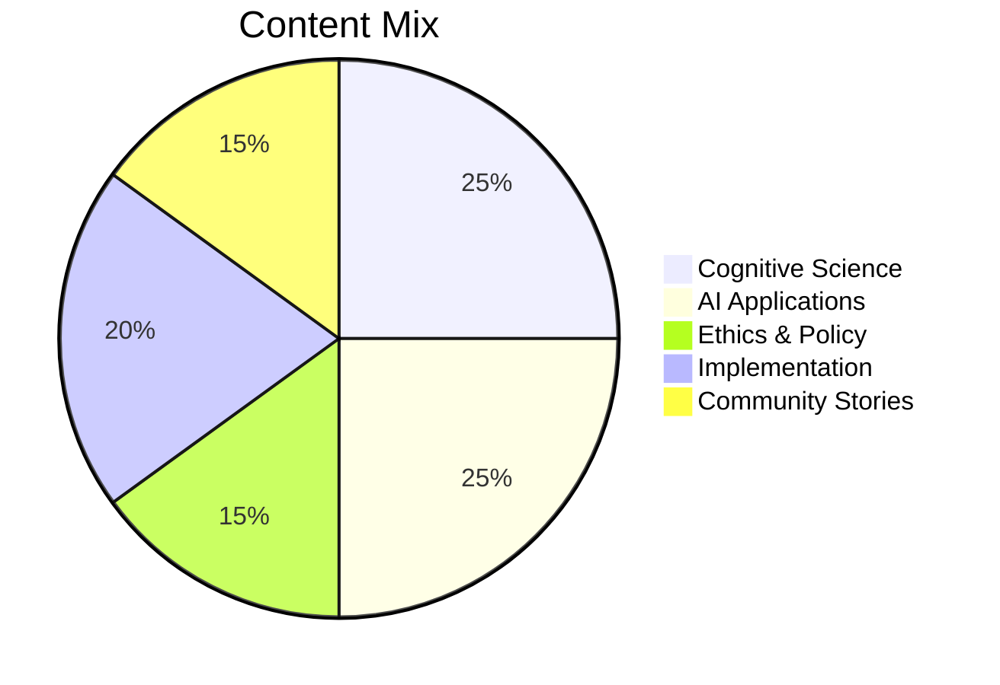

# Nothing Artificial Community Platform Specification

> *A community platform for researchers, practitioners, and believers in human-centric technology.*

---

## Overview

The Nothing Artificial Community Platform is the digital home for everyone who believes technology should enhance human intelligence, not replace it. It connects researchers, practitioners, developers, and thought leaders in a vibrant ecosystem of learning, collaboration, and shared purpose.

---

## Platform Vision

---

## User Personas

### Primary Personas

#### 1. The Researcher
**Profile:** Academic or industry researcher focused on cognitive science, AI, or human-computer interaction
**Needs:**
- Access to relevant papers and research
- Collaboration with peers
- Platform for sharing findings
- Grant and funding information
**Journey:** Paper discovery → Community join → Collaboration → Publication

#### 2. The Practitioner
**Profile:** Professional implementing human-centric AI in organizations
**Needs:**
- Practical frameworks and tools
- Peer learning and support
- Certification and credentials
- Case studies and examples
**Journey:** Learning → Certification → Implementation → Knowledge sharing

#### 3. The Developer
**Profile:** Engineer building AI products and tools
**Needs:**
- Technical documentation
- API access and SDKs
- Code examples and templates
- Technical community
**Journey:** Documentation → Building → Feedback → Contribution

#### 4. The Enterprise Leader
**Profile:** Executive or manager driving AI strategy in organizations
**Needs:**
- Strategic frameworks
- ROI evidence
- Peer network
- Consulting access
**Journey:** Learning → Strategy → Implementation → Advocacy

#### 5. The Ethicist
**Profile:** Professional focused on AI ethics and responsible technology
**Needs:**
- Policy discussions
- Ethical frameworks
- Multi-stakeholder dialogue
- Influence opportunities
**Journey:** Discussion → Contribution → Leadership → Policy influence

#### 6. The Student
**Profile:** Graduate student or career changer learning human-centric AI
**Needs:**
- Structured learning paths
- Mentorship
- Entry-level opportunities
- Credentials
**Journey:** Learning → Mentorship → Projects → Employment

### User Journey Maps

---

## Feature Specification

### MVP Features (Phase 2)

| Feature | Description | Priority |
|---------|-------------|----------|
| **Member Profiles** | Rich profiles with expertise, interests, work | P0 |
| **Research Library** | Curated papers with AI summaries | P0 |
| **Discussion Forums** | Threaded discussions by topic | P0 |
| **Event Calendar** | Virtual and in-person events | P0 |
| **Basic Learning** | Free course content access | P0 |
| **Member Directory** | Searchable member database | P1 |
| **Direct Messaging** | Member-to-member communication | P1 |
| **Notifications** | Activity and content alerts | P1 |
| **Mobile App** | iOS and Android apps | P2 |

### Full Platform Features (Phase 3)

| Feature | Description | Priority |
|---------|-------------|----------|
| **AI-Powered Matching** | Connect members by interest/expertise | P0 |
| **Learning Paths** | Personalized learning journeys | P0 |
| **Certifications** | Verified credentials on blockchain | P0 |
| **Working Groups** | Focused collaboration spaces | P1 |
| **Job Board** | Human-centric AI opportunities | P1 |
| **Project Showcase** | Member project portfolio | P1 |
| **Mentorship Program** | Structured mentor matching | P1 |
| **Office Hours** | Expert Q&A sessions | P2 |
| **Local Chapters** | Geographic community groups | P2 |
| **Gamification** | Points, badges, leaderboards | P2 |

---

## Technical Architecture

### Data Model

---

## AI Integration

### AI-Powered Features

| Feature | AI Application | User Benefit |
|---------|---------------|--------------|
| **Personalized Feed** | Content curation based on interests | Relevant content, reduced noise |
| **Expert Matching** | Similarity matching on expertise | Valuable connections |
| **Research Discovery** | Paper recommendations | Stay current in field |
| **Learning Recommendations** | Course suggestions based on goals | Efficient skill building |
| **Discussion Highlights** | Important thread identification | Don't miss key discussions |
| **Q&A Assistance** | AI-assisted answers with expert routing | Faster answers |
| **Event Recommendations** | Event matching based on profile | Relevant opportunities |

### Personalization Engine

---

## Membership Tiers

### Tier Structure

| Tier | Price | Target Audience |
|------|-------|-----------------|
| **Free** | $0 | Everyone |
| **Pro** | $29/month | Active practitioners |
| **Expert** | $99/month | Senior professionals |
| **Enterprise** | Custom | Organizations |

### Tier Benefits Matrix

| Feature | Free | Pro | Expert | Enterprise |
|---------|------|-----|--------|------------|
| Research library access | Limited | Full | Full | Full |
| Discussion forums | Read + 5 posts/month | Unlimited | Unlimited | Unlimited |
| Member directory | Basic search | Advanced search | Advanced search | API access |
| Direct messaging | 5/month | Unlimited | Unlimited | Unlimited |
| Events | Free events only | All virtual | All events | Custom events |
| Courses | Free courses | All courses | All + early access | Custom training |
| Certifications | None | Standard | Premium + mentorship | Custom |
| AI features | Basic | Advanced | Priority | Custom |
| Support | Community | Email | Priority | Dedicated |
| Job board | View only | Apply + post | Featured | Branded |
| Analytics | None | Personal | Personal + network | Org-wide |

---

## Content Strategy

### Content Types

| Type | Description | Frequency |
|------|-------------|-----------|
| **Research Summaries** | AI-generated paper summaries | Daily |
| **Expert Articles** | Long-form thought leadership | Weekly |
| **Case Studies** | Implementation examples | Bi-weekly |
| **Tutorials** | How-to guides and walkthroughs | Weekly |
| **News Roundup** | Industry news curation | Daily |
| **Expert Interviews** | Q&A with leaders | Monthly |
| **Community Spotlights** | Member stories | Weekly |

### Content Pillars

### Editorial Calendar

| Day | Content Type |
|-----|--------------|
| Monday | Research roundup |
| Tuesday | Tutorial or how-to |
| Wednesday | Expert article |
| Thursday | Community spotlight |
| Friday | News and discussion |

---

## Event Types

### Virtual Events

| Event Type | Frequency | Duration |
|------------|-----------|----------|
| **Webinars** | Weekly | 60 min |
| **Office Hours** | Weekly | 30 min |
| **AMAs** | Monthly | 60 min |
| **Workshops** | Monthly | 2-4 hours |
| **Conference Sessions** | Quarterly | Multi-day |

### In-Person Events

| Event Type | Frequency | Description |
|------------|-----------|-------------|
| **Local Meetups** | Monthly | Chapter gatherings |
| **Workshops** | Quarterly | Hands-on training |
| **Summits** | Annual | Major conference |
| **Retreats** | Annual | Intensive immersion |

---

## Gamification System

### Progress Mechanics

| Element | Description |
|---------|-------------|
| **Experience Points (XP)** | Earned through all activities |
| **Levels** | Progress tiers based on XP |
| **Streaks** | Consecutive daily engagement |
| **Contribution Score** | Quality of community contributions |

### Achievement Badges

| Category | Badges |
|----------|--------|
| **Learning** | Course Complete, Certification Earned, Learning Streak |
| **Contributing** | First Post, Helpful Answer, Top Contributor |
| **Connecting** | First Connection, Mentor, Network Builder |
| **Events** | First Event, Event Host, Conference Speaker |
| **Special** | Founding Member, Open Source Contributor, Research Publisher |

### Recognition System

| Recognition | Criteria |
|-------------|----------|
| **Weekly Top Contributors** | Most helpful members |
| **Expert of the Month** | Outstanding expertise sharing |
| **Rising Star** | Fastest growing new member |
| **Community Champion** | Overall community impact |

---

## Metrics & Analytics

### Growth Metrics

| Metric | Definition | Target |
|--------|------------|--------|
| **Total Members** | All registered users | 25,000 (Year 1) |
| **Monthly Active** | Active in last 30 days | 40% of total |
| **New Members** | Monthly signups | 2,000/month |
| **Conversion Rate** | Free to paid | 5% |

### Engagement Metrics

| Metric | Definition | Target |
|--------|------------|--------|
| **DAU/MAU** | Daily/Monthly active ratio | 25% |
| **Posts per User** | Average monthly posts | 2+ |
| **Time in Platform** | Average session duration | 15+ min |
| **Return Visits** | Weekly return rate | 50% |

### Retention Metrics

| Metric | Definition | Target |
|--------|------------|--------|
| **D7 Retention** | Active 7 days after join | 40% |
| **D30 Retention** | Active 30 days after join | 30% |
| **Annual Retention** | Paid member renewal | 80% |
| **Churn Rate** | Monthly paid churn | < 3% |

### Revenue Metrics

| Metric | Definition | Target |
|--------|------------|--------|
| **MRR** | Monthly Recurring Revenue | $75K (Year 1) |
| **ARPU** | Average Revenue Per User | $15 |
| **LTV** | Lifetime Value | $300 |
| **CAC** | Customer Acquisition Cost | < $50 |

---

## Security & Privacy

### Authentication

| Method | Implementation |
|--------|----------------|
| Email/Password | Standard with strong requirements |
| Social Login | Google, GitHub, LinkedIn |
| SSO | Enterprise SAML/OIDC |
| MFA | Optional TOTP |
| DID | Blockchain-based identity (Phase 3) |

### Authorization

| Role | Permissions |
|------|-------------|
| Member | Read, create content, message |
| Pro Member | + Advanced features |
| Expert | + Moderation, mentorship |
| Moderator | + Content moderation |
| Admin | Full platform access |

### Privacy Controls

| Control | Description |
|---------|-------------|
| Profile Visibility | Public, members-only, private |
| Activity Visibility | Show/hide activity |
| Contact Preferences | Message, email preferences |
| Data Export | GDPR-compliant export |
| Account Deletion | Full data removal |

---

## Development Roadmap

### MVP (Phase 2: Month 1-3)

- [ ] User registration and profiles
- [ ] Basic research library
- [ ] Discussion forums
- [ ] Event calendar
- [ ] Basic notifications
- [ ] Membership tiers

### V1.0 (Phase 2: Month 4-6)

- [ ] AI-powered content curation
- [ ] Member matching
- [ ] Advanced search
- [ ] Mobile apps
- [ ] Gamification basics
- [ ] Analytics dashboard

### V2.0 (Phase 3: Month 7-10)

- [ ] Certification system
- [ ] Blockchain credentials
- [ ] Working groups
- [ ] Job board
- [ ] Mentorship program
- [ ] Advanced AI features

### Future Roadmap

- Local chapters and meetups
- Marketplace for services
- Research collaboration tools
- Policy advocacy platform
- Integration with academic systems

---

## Success Criteria

### Phase 2 Success

- [ ] 5,000 registered members
- [ ] 2,000 monthly active users
- [ ] 500 Pro/Expert subscribers
- [ ] 4.0+ app store rating
- [ ] 30% D30 retention

### Phase 3 Success

- [ ] 25,000 registered members
- [ ] 10,000 monthly active users
- [ ] 2,500 paying subscribers
- [ ] 1,000 certifications issued
- [ ] 80% subscriber renewal

---

*A community of humans building technology that serves humanity. Join us.*
