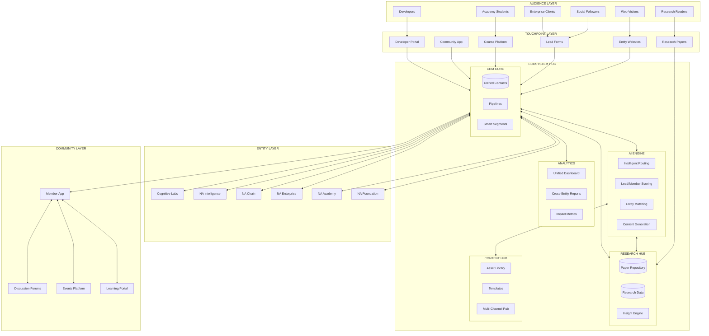
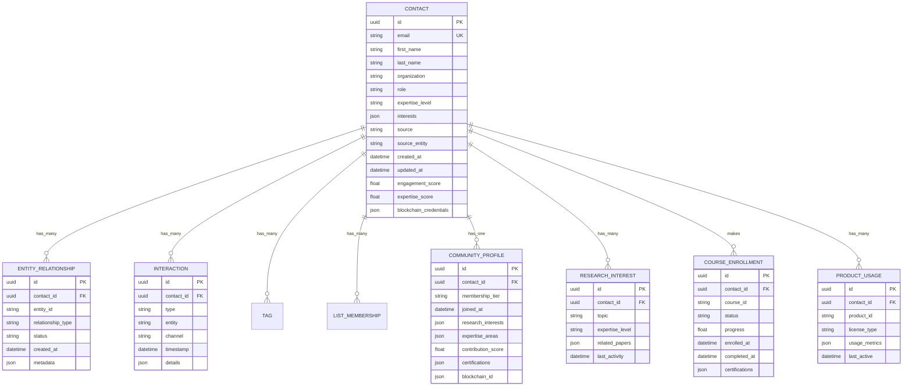
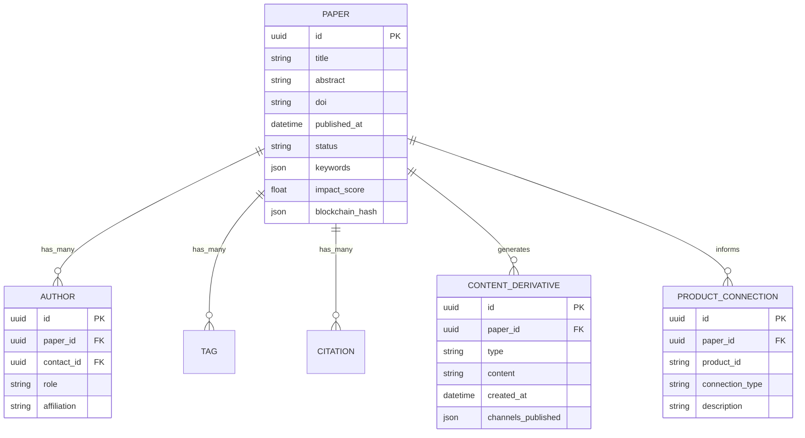
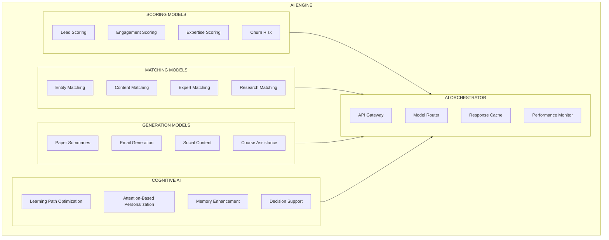
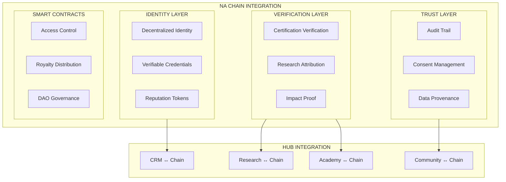
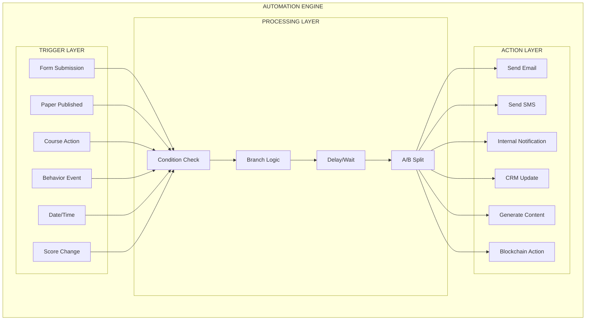
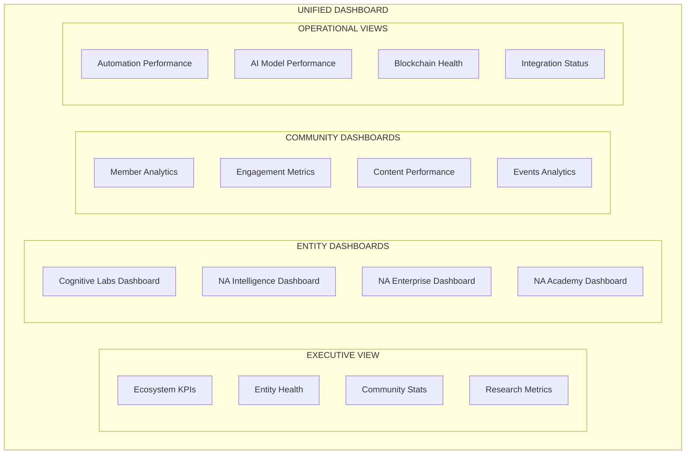
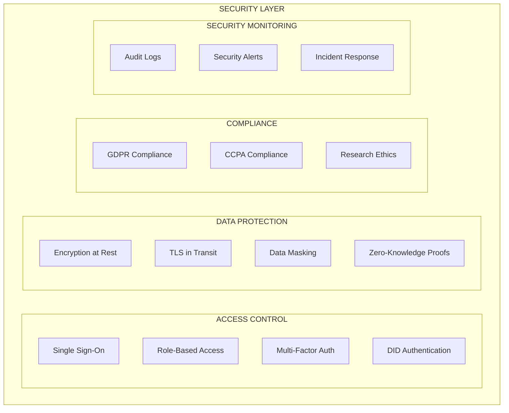

# Nothing Artificial Ecosystem Hub Architecture

> *The central nervous system connecting all Nothing Artificial entities.*

---

## Overview

The Ecosystem Hub is the AI-powered command center that unifies all Nothing Artificial entities. It serves as the single source of truth for contacts, research, content, and intelligence—enabling seamless cross-entity experiences and operational efficiency while maintaining the human-centric philosophy at its core.

---

## High-Level Architecture

---

## CRM Core Architecture

### Unified Contact Model

### Entity Relationship Types

| Entity | Relationship Types |
|--------|-------------------|
| **Cognitive Labs** | Researcher, Collaborator, Reviewer, Interested |
| **NA Intelligence** | User (Free), User (Pro), User (Enterprise), Trial |
| **NA Chain** | Developer, Node Operator, Partner, Interested |
| **NA Enterprise** | Lead, Prospect, Client, Partner, Churned |
| **NA Academy** | Student (Active), Alumni, Instructor, Certified |
| **Research Community** | Free Member, Pro Member, Contributor, Expert |
| **NA Foundation** | Donor, Grantee, Volunteer, Advisor |
| **Publications** | Subscriber, Author, Reviewer |

---

## Research Hub Architecture

### Research Repository Model

### Research Intelligence Features

| Feature | Description |
|---------|-------------|
| **Literature Monitoring** | AI scans journals for relevant papers |
| **Citation Network** | Track influence and connections |
| **Trend Analysis** | Identify emerging research areas |
| **Collaboration Matching** | Connect researchers with shared interests |
| **Content Generation** | Auto-generate accessible summaries |
| **Product Linkage** | Connect research to commercial applications |

---

## AI Engine Architecture

### AI Model Specifications

| Model | Input | Output | Use Case |
|-------|-------|--------|----------|
| **Lead Scoring** | Contact attributes, behavior | Score 0-100 | Prioritize outreach |
| **Expertise Scoring** | Interactions, content, certifications | Expertise level | Community matching |
| **Entity Matching** | Contact profile, interests | Ranked entity list | Cross-referral |
| **Research Summarization** | Paper text | Accessible summary | Content generation |
| **Learning Path Optimization** | Student profile, goals | Custom curriculum | Personalization |
| **Expert Matching** | Query, expertise map | Expert recommendations | Community value |

### Human-Centric AI Principles

The AI Engine operates on Nothing Artificial's core principles:

| Principle | Implementation |
|-----------|----------------|
| **Augmentation over Automation** | AI suggests, humans decide |
| **Transparency** | All AI decisions are explainable |
| **User Control** | Members can adjust AI preferences |
| **Privacy First** | Minimal data collection, maximum value |
| **Cognitive Enhancement** | AI designed to improve human thinking |

---

## Blockchain Integration Architecture

### Blockchain Use Cases

| Use Case | Description | Benefit |
|----------|-------------|---------|
| **Credential Verification** | On-chain certification records | Tamper-proof credentials |
| **Research Attribution** | Immutable authorship records | Proper credit, plagiarism prevention |
| **Impact Tracking** | Verified impact metrics | Trusted reporting |
| **Data Consent** | User-controlled data permissions | Privacy and trust |
| **Community Reputation** | Contribution-based reputation | Fair recognition |
| **Royalty Distribution** | Automated creator payments | Fair compensation |

---

## Automation Engine Architecture

### Core Workflows

| Workflow | Trigger | Sequence |
|----------|---------|----------|
| **New Researcher Interest** | Paper download | Welcome → Related research → Community invite |
| **Course Enrollment** | Purchase | Welcome → Onboarding → Progress check-ins |
| **Community Join** | Registration | Welcome → Interest survey → First week engagement |
| **Enterprise Lead** | Form submission | Qualification → Routing → Personalized follow-up |
| **Research Publication** | Paper published | Generate summaries → Distribute to segments → Social |
| **Certification Earned** | Course completion | Blockchain record → Badge → Community recognition |

---

## Dashboard Architecture

### Key Metrics by View

| Dashboard | Key Metrics |
|-----------|-------------|
| **Ecosystem** | Total contacts, cross-entity conversions, engagement, research output |
| **Cognitive Labs** | Papers published, citations, collaborations, insights generated |
| **NA Intelligence** | Users, engagement, feature usage, satisfaction |
| **NA Enterprise** | Leads, pipeline value, close rate, client health |
| **NA Academy** | Enrollments, completion rate, certifications, NPS |
| **Community** | Members, active rate, contributions, expertise distribution |
| **Research** | Papers tracked, summaries generated, content created |
| **Blockchain** | Credentials issued, verifications, reputation scores |

---

## Security Architecture

### Security Measures

| Layer | Measures |
|-------|----------|
| **Authentication** | SSO, MFA, DID-based auth, session management |
| **Authorization** | Role-based access, entity-level permissions |
| **Data** | AES-256 encryption, TLS 1.3, PII masking |
| **Research Data** | Ethical guidelines, consent tracking, anonymization |
| **Compliance** | GDPR consent, data portability, right to deletion |
| **Blockchain** | Zero-knowledge proofs for privacy, audit trails |
| **Monitoring** | Audit logging, anomaly detection, alerts |

---

## Technical Stack Recommendations

| Layer | Recommended Technology |
|-------|----------------------|
| **CRM Platform** | HubSpot Enterprise or Salesforce |
| **Database** | PostgreSQL with read replicas |
| **Research DB** | Neo4j for citation graphs + PostgreSQL |
| **API Layer** | Node.js/Express or FastAPI |
| **AI Services** | Claude API, custom fine-tuned models |
| **Blockchain** | Polygon (L2) or custom chain |
| **Email** | SendGrid or Postmark |
| **Analytics** | Mixpanel + custom dashboards |
| **Hosting** | AWS or GCP |
| **CDN** | CloudFlare |
| **Monitoring** | Datadog or New Relic |

---

## Scalability Considerations

### Horizontal Scaling

| Component | Scaling Strategy |
|-----------|-----------------|
| API Layer | Auto-scaling containers |
| Database | Read replicas, sharding if needed |
| Research Graph | Distributed graph database |
| Automation | Queue-based processing |
| AI Services | Rate limiting, caching, edge deployment |
| Blockchain | L2 scaling solutions |

### Performance Targets

| Metric | Target |
|--------|--------|
| API Response Time | < 200ms (p95) |
| Webhook Processing | < 5 seconds |
| Email Delivery | < 30 seconds |
| Dashboard Load | < 3 seconds |
| AI Response | < 2 seconds |
| Blockchain Confirmation | < 30 seconds |

---

*The Ecosystem Hub is the foundation. Everything connects through here—research, products, community, and impact.*
