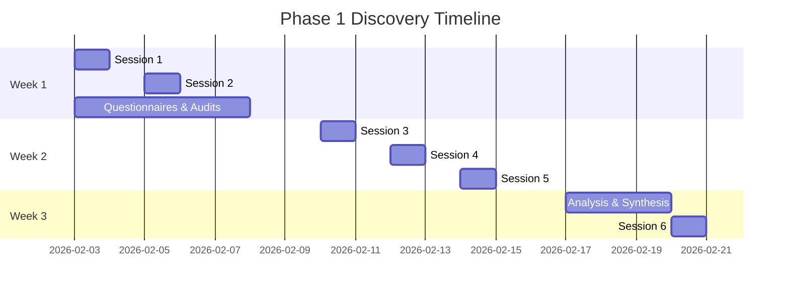

# Phase 1: Discovery & Strategy Session

> *The strategic planning session that maps the path to a unified, AI-empowered Nothing Artificial ecosystem.*

---

## Overview

Phase 1 is a comprehensive deep-dive into every aspect of the Nothing Artificial portfolio. This discovery session maps relationships, synergies, and opportunities across the entire ecosystem—from Cognitive Labs research to enterprise solutions, from community building to thought leadership.

The deliverable is a unified master plan that provides the blueprint for transforming disconnected initiatives into an AI-powered ecosystem that enhances human intelligence at every touchpoint.

---

## Discovery Session Structure

---

## Session 1: Vision Alignment & Philosophy Deep-Dive

**Duration:** 3-4 hours
**Participants:** Founders, Core Leadership Team, Key Advisors

### Agenda

#### 1. The Nothing Artificial Philosophy (60 min)
- The origin story and founding vision
- What "enhancing human intelligence" means in practice
- The relationship between cognitive science, AI, and blockchain
- Where Nothing Artificial fits in the AI landscape
- The counter-narrative to "AI will replace humans"
- Long-term vision: Where does NA go in 10 years?

#### 2. Ecosystem Mapping (60 min)
- Current entities and initiatives
- How research, products, and community currently interact (or don't)
- Shared resources and duplication of effort
- Communication flows between initiatives
- Montreal ecosystem connections

#### 3. Relationship Network (45 min)
- Key relationships in academic community
- Industry partnerships and potential
- Media and thought leadership connections
- Investor and funding relationships
- Strategic relationships to nurture

#### 4. Priority Alignment (45 min)
- What's most urgent for the business?
- What's most important for the mission?
- Known blockers and constraints
- Resources available for transformation
- Risk tolerance and appetite for change

### Session 1 Outputs

- [ ] Vision and philosophy articulated and documented
- [ ] Ecosystem relationship map (first draft)
- [ ] Entity interaction matrix
- [ ] Priority ranking for transformation
- [ ] Key stakeholders identified for deeper dives

---

## Session 2: Research & Science Assessment

**Duration:** 4-5 hours
**Participants:** Research leadership, Cognitive Labs team, Academic partners

### Cognitive Labs Deep-Dive (90 min)

#### Current State
- Active research programs and focus areas
- Published papers and ongoing studies
- Research team structure and capabilities
- Lab equipment and infrastructure
- Funding sources and grant status
- University and institutional partnerships

#### Research Assets
- Paper repository and organization
- Research data and datasets
- Protocols and methodologies
- Intellectual property status

#### AI Opportunity Areas
- Literature discovery and monitoring
- Research data analysis
- Collaboration matching
- Grant intelligence
- Research-to-product pipeline

### Academic Network Assessment (60 min)

#### Current Partnerships
- University affiliations
- Co-research relationships
- Advisory board composition
- Conference and publication presence

#### Partnership Potential
- Unrealized academic connections
- Research collaboration opportunities
- Joint grant applications
- Student programs and internships

### Research Commercialization (60 min)

#### Current State
- Research-to-product pathway
- Technology transfer processes
- Patent and IP status
- Commercial applications of research

#### Opportunity Areas
- Untapped commercial potential
- Licensing opportunities
- Product development pipeline
- Enterprise applications

### Session 2 Outputs

- [ ] Research program inventory
- [ ] Academic partnership map
- [ ] Research asset catalog
- [ ] Commercialization opportunity matrix
- [ ] AI integration points for research

---

## Session 3: Products & Technology Audit

**Duration:** 4-5 hours
**Participants:** Product leadership, Engineering team, CTO

### NA Intelligence Products Deep-Dive (90 min)

#### Current Products
- Existing product portfolio
- Product maturity and status
- User base and engagement
- Revenue and business model
- Technical architecture

#### Product Vision
- Roadmap and planned features
- Market positioning
- Competitive landscape
- Integration opportunities

#### AI Integration
- Current AI capabilities
- Enhancement opportunities
- Cognitive science application
- User experience improvements

### Technology Stack Assessment (90 min)

#### Infrastructure Inventory
- Cloud services and hosting
- Databases and data stores
- APIs and integrations
- Development tools and practices
- Security and compliance

#### Technical Debt
- Legacy systems and constraints
- Migration needs
- Scalability concerns
- Performance issues

### Blockchain Strategy (60 min)

#### NA Chain Vision
- Blockchain use cases
- Trust and transparency applications
- Decentralized identity plans
- Token economics (if applicable)

#### Implementation Status
- Current blockchain capabilities
- Partnerships and ecosystem
- Technical requirements
- Timeline and priorities

### Session 3 Outputs

- [ ] Product portfolio documentation
- [ ] Technology stack inventory
- [ ] Technical debt assessment
- [ ] Blockchain strategy document
- [ ] Integration architecture (draft)

---

## Session 4: Community & Academy Vision

**Duration:** 3-4 hours
**Participants:** Community leads, Education/content team, Marketing

### Community Platform Vision (90 min)

#### Target Community
- Who are the ideal community members?
- What brings them together?
- What value do they seek?
- How large can this community grow?

#### Current Community State
- Existing audience and channels
- Engagement levels and patterns
- Community tools in use
- Success stories and challenges

#### Platform Features Brainstorm
- Member profiles and networking
- Content and resources
- Discussion and collaboration
- Events and programming
- Gamification and recognition

### NA Academy Deep-Dive (90 min)

#### Education Vision
- Course topics and curriculum
- Target learners and outcomes
- Certification and credentials
- Business model and pricing

#### Current State
- Existing educational content
- Distribution channels
- Learner feedback and data

#### Platform Requirements
- Course delivery needs
- Assessment and certification
- AI tutor capabilities
- Community integration

### Content Strategy (60 min)

#### Content Inventory
- Existing content assets
- Content creation process
- Distribution channels
- Performance metrics

#### Content Opportunities
- Research-to-content pipeline
- Thought leadership development
- Content repurposing
- AI-assisted creation

### Session 4 Outputs

- [ ] Community platform specification
- [ ] Academy curriculum outline
- [ ] Content strategy document
- [ ] Member journey map
- [ ] Feature priority matrix

---

## Session 5: Enterprise & Market Strategy

**Duration:** 3-4 hours
**Participants:** Business development, Sales, Enterprise clients (optional)

### Enterprise Market Assessment (90 min)

#### Target Market
- Ideal enterprise customer profile
- Industry verticals and segments
- Geographic focus
- Deal size and sales cycle

#### Current State
- Existing enterprise clients
- Pipeline and opportunities
- Sales process and team
- Win/loss analysis

#### Value Proposition
- What problems do we solve for enterprises?
- How do we differentiate?
- ROI and business case
- Implementation approach

### Competitive Landscape (60 min)

#### Direct Competitors
- Who else is doing human-centric AI?
- Competitive strengths and weaknesses
- Market positioning
- Pricing comparison

#### Indirect Competitors
- Adjacent solutions
- Potential threats
- Partnership opportunities

### Go-to-Market Strategy (60 min)

#### Current Approach
- Marketing channels and effectiveness
- Sales motion and process
- Partner channels
- Brand awareness

#### Growth Opportunities
- Untapped channels
- Partnership potential
- Geographic expansion
- Vertical specialization

### Session 5 Outputs

- [ ] Enterprise market assessment
- [ ] Competitive analysis document
- [ ] Go-to-market strategy
- [ ] Partnership opportunity map
- [ ] Sales process optimization plan

---

## Session 6: Roadmap Presentation & Decision

**Duration:** 2-3 hours
**Participants:** All Stakeholders, Decision-Makers

### Discovery Findings Summary (45 min)

- Key insights from all sessions
- Biggest opportunities identified
- Critical gaps to address
- Quick wins available
- Risk factors and mitigation

### Unified Architecture Presentation (30 min)

- Central hub design
- Entity integration map
- Community platform architecture
- Academy platform design
- AI layer overview
- Blockchain integration

### Implementation Roadmap (45 min)

- Phase 2 detailed plan
- Phase 3 overview
- Dependencies and sequencing
- Resource requirements
- Timeline and milestones

### Investment Framework (30 min)

- Phase 2 pricing options
- Phase 3 estimates
- Monthly operating costs
- ROI projections
- Build vs. buy recommendations

### Decision & Next Steps (30 min)

- Questions and clarifications
- Scope confirmation
- Timeline agreement
- Phase 2 commitment
- Kickoff planning

### Session 6 Outputs

- [ ] Final presentation deck
- [ ] Executive summary document
- [ ] Phase 2 proposal
- [ ] Agreement on scope and timeline
- [ ] Kickoff date for Phase 2

---

## Pre-Discovery Questionnaires

### Vision & Philosophy Questionnaire

*To be completed by founders/leadership before Session 1*

1. How would you articulate the Nothing Artificial mission in one paragraph?

2. What does "enhancing human intelligence" mean in practical terms?

3. How do cognitive science, AI, and blockchain connect in your vision?

4. What makes Nothing Artificial different from other AI companies?

5. Where do you see Nothing Artificial in 5 years? 10 years?

6. What is the biggest barrier to achieving that vision today?

7. Who are your competitors, and how do you differentiate?

8. What does success look like for this ecosystem transformation?

9. What are you most excited about? Most concerned about?

10. What resources are available for this transformation?

### Research & Science Questionnaire

*To be completed by research leadership*

1. What are the current active research programs?

2. How many papers have been published? Where?

3. What is the current research team structure?

4. What university and institutional partnerships exist?

5. What research data and datasets are available?

6. What is the current IP/patent situation?

7. How does research currently inform product development?

8. What are the biggest research challenges?

9. What grants or funding are currently active?

10. What collaboration opportunities are unrealized?

### Technology Audit Form

*For each system in use*

| Field | Response |
|-------|----------|
| System name | |
| Purpose | |
| Monthly cost | |
| Users/administrators | |
| Integration capabilities | |
| Data it contains | |
| Pain points | |
| Replacement consideration | |

---

## Deliverables Specification

### 1. Ecosystem Audit Report

**Format:** PDF + Interactive Diagrams

**Contents:**
- Executive summary
- Entity profiles (current state)
- Relationship mapping
- Technology inventory
- Integration gap analysis
- Pain point priority matrix
- Opportunity sizing

### 2. Unified Architecture Design

**Format:** Interactive Diagrams + Specification Document

**Contents:**
- Central hub architecture
- Entity integration map
- Community platform design
- Academy platform design
- AI layer specification
- Blockchain integration
- Data flow diagrams
- User experience maps

### 3. AI Opportunity Matrix

**Format:** Spreadsheet + Visual Summary

**Contents:**
| Opportunity | Entity | Impact | Effort | Priority | AI Tech | Est. Value |
|-------------|--------|--------|--------|----------|---------|------------|
| Research summarization | Cognitive Labs | High | Low | 1 | Claude | $50K/year |
| Learning path optimization | Academy | High | Medium | 2 | Custom | $100K/year |
| Member matching | Community | Medium | Low | 3 | Embeddings | $25K/year |

### 4. Community Platform Specification

**Format:** Product Requirements Document

**Contents:**
- Vision and objectives
- User personas
- Feature list (prioritized)
- Technical requirements
- Integration points
- MVP scope
- Full product scope

### 5. Academy Platform Plan

**Format:** Strategy Document

**Contents:**
- Course catalog and curriculum
- Learning path design
- Certification framework
- AI tutor specification
- Platform technical requirements
- Business model
- Timeline and milestones

### 6. Implementation Roadmap

**Format:** Visual Roadmap + Detailed Plan

**Contents:**
- Phase 2 breakdown
- Phase 3 overview
- Dependencies mapped
- Resource requirements
- Risk mitigation
- Success criteria

### 7. Investment Framework

**Format:** Proposal Document

**Contents:**
- Phase 2 scope options
- Phase 3 estimates
- Monthly operating costs
- ROI projections
- Recommended approach

---

## Success Criteria for Phase 1

Phase 1 is complete when:

- [ ] All six sessions conducted
- [ ] All questionnaires completed
- [ ] Every entity's current state documented
- [ ] All AI opportunities identified and prioritized
- [ ] Unified architecture designed
- [ ] Community platform specified
- [ ] Academy platform planned
- [ ] Implementation roadmap created
- [ ] Investment framework presented
- [ ] Decision made on Phase 2 scope

---

## Investment

**Phase 1: Discovery & Strategy Session**

| Component | Included |
|-----------|----------|
| Pre-discovery questionnaires | Yes |
| 6 structured sessions (18-24 hours) | Yes |
| Ecosystem audit report | Yes |
| Unified architecture design | Yes |
| AI opportunity matrix | Yes |
| Community platform specification | Yes |
| Academy platform plan | Yes |
| Implementation roadmap | Yes |
| Investment framework | Yes |
| Final presentation | Yes |

**Investment Range:** $15,000 - $25,000 depending on complexity

**Duration:** 2-3 weeks

---

## What Happens After Phase 1?

### Proceed to Phase 2

With the master plan in hand, Phase 2 builds the infrastructure:
- Central hub implementation
- Entity integrations
- Community platform MVP
- Academy platform MVP
- AI layer deployment
- Dashboard creation

### Proceed to Phase 3

After infrastructure is in place, Phase 3 launches the authority platform:
- Full Academy launch
- Content engine activation
- Blockchain integration
- Community scale-up
- Enterprise platform
- Full ecosystem integration

**All Phase 1 deliverables are standalone and actionable regardless of implementation partner.**

---

*Phase 1 maps the territory. Phases 2 and 3 build the future of human-centric technology.*
