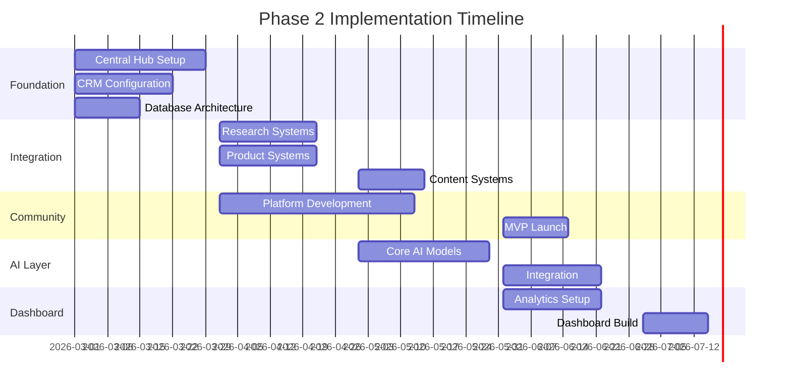
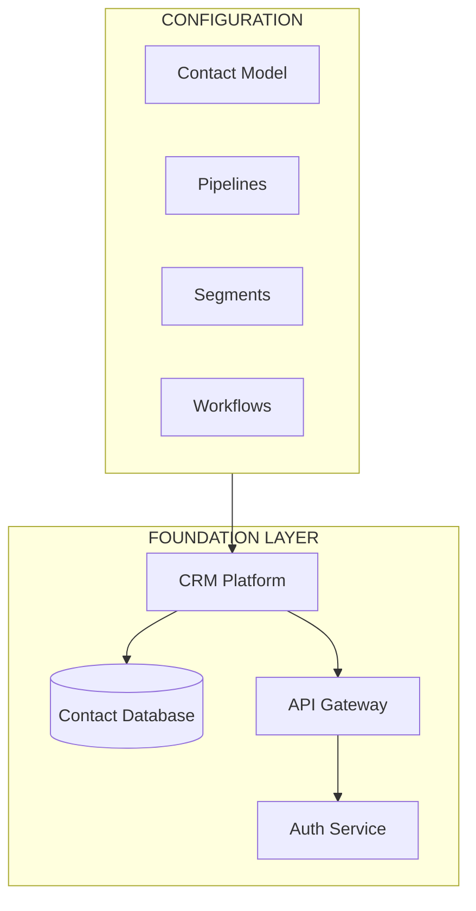
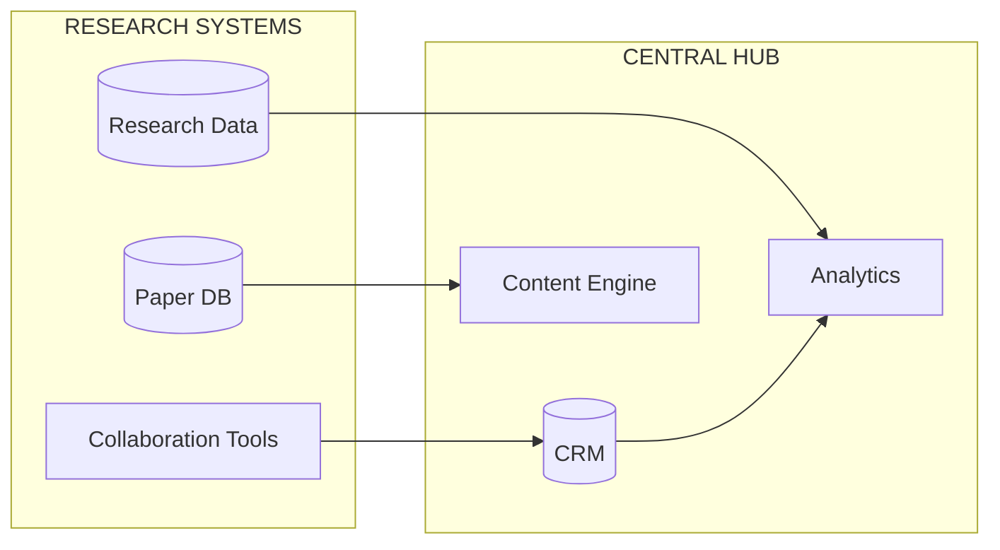
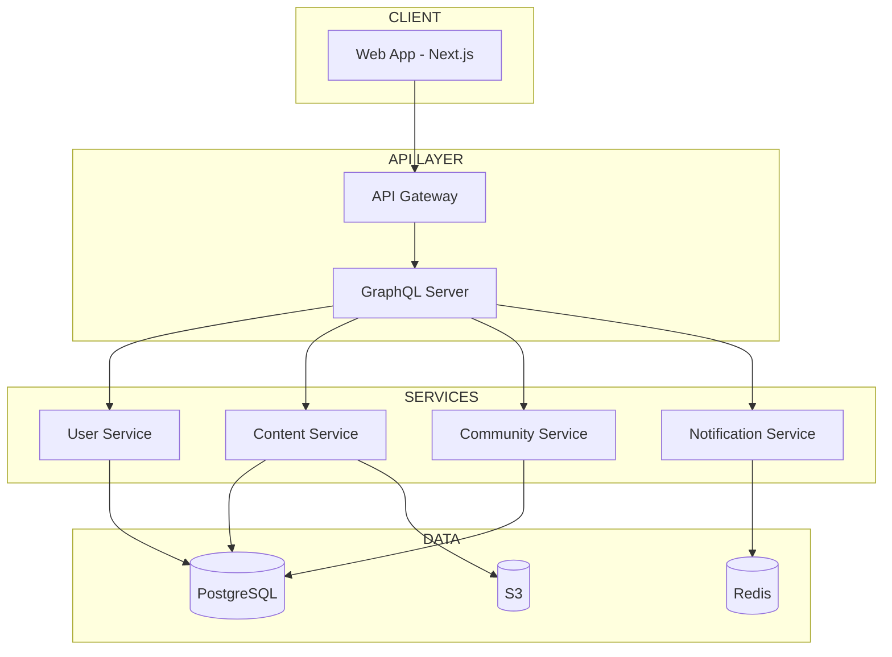
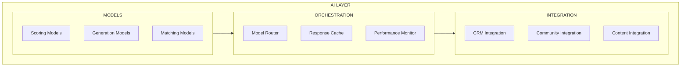
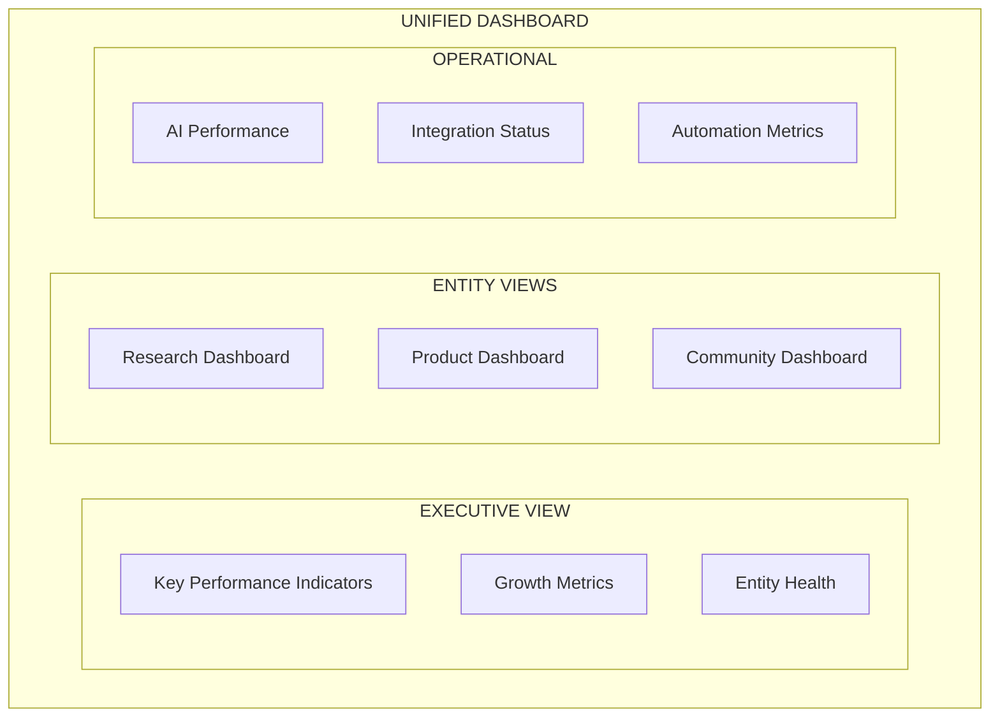

# Phase 2: Implementation

> *Building the AI-powered infrastructure that unifies the Nothing Artificial ecosystem.*

---

## Overview

Phase 2 transforms the discovery insights into operational reality. This phase builds the central hub, connects all entities, launches the community platform MVP, and deploys the initial AI layer—creating the foundation for a unified ecosystem that enhances human intelligence at scale.

---

## Phase 2 Timeline

---

## Phase 2A: Foundation (Weeks 1-6)

### Central Hub Setup

#### Objectives
- Establish the unified command center
- Configure CRM for all entities
- Set up unified contact database
- Implement core automation workflows

#### Deliverables

| Deliverable | Description | Timeline |
|-------------|-------------|----------|
| CRM Platform | Configured HubSpot/Salesforce instance | Week 1-2 |
| Contact Model | Unified schema for all entity contacts | Week 2 |
| Pipeline Setup | Pipelines for each entity | Week 3 |
| Automation Core | Basic workflows for lead handling | Week 4 |
| Integration Framework | API connections foundation | Week 4-6 |

#### Technical Setup

### Database Architecture

| Table | Purpose | Key Fields |
|-------|---------|------------|
| contacts | Unified contact records | id, email, name, source, entity_relationships |
| interactions | All touchpoints | contact_id, type, entity, timestamp |
| research_interests | Research preferences | contact_id, topics, expertise_level |
| memberships | Community membership | contact_id, tier, status |
| enrollments | Academy enrollments | contact_id, course_id, progress |

### Core Workflows

| Workflow | Trigger | Actions |
|----------|---------|---------|
| New Contact | Form submission | Create record → Tag source → Welcome email → Segment |
| Research Interest | Paper download | Tag interest → Add to segment → Nurture sequence |
| Community Interest | Community page visit | Tag intent → Invite sequence → Follow-up |
| Enterprise Lead | Contact form | Qualify → Route → Alert team → Sequence |

---

## Phase 2B: Entity Integrations (Weeks 4-10)

### Research Systems Integration

#### Cognitive Labs Connection

| System | Integration Type | Data Flow |
|--------|-----------------|-----------|
| Paper Repository | API sync | Papers → Hub → Content engine |
| Research Database | Webhook | New research → CRM updates |
| Grant Tracking | API | Funding data → Dashboard |
| Collaboration Tools | SSO | Single sign-on access |

#### Integration Architecture

### Product Systems Integration

#### NA Intelligence Connection

| System | Integration Type | Data Flow |
|--------|-----------------|-----------|
| Product Platform | API | User data → CRM |
| Billing System | Webhook | Purchases → CRM records |
| Support System | API | Tickets → Contact history |
| Analytics | Events | Usage data → Dashboard |

### Content Systems Integration

#### Content Hub Setup

| Component | Implementation |
|-----------|----------------|
| Asset Library | S3 + CDN for all content |
| CMS Integration | Headless CMS API connection |
| Social Channels | Buffer/Hootsuite integration |
| Newsletter | Email platform connection |

---

## Phase 2C: Community Platform MVP (Weeks 6-14)

### MVP Feature Set

| Feature | Priority | Description |
|---------|----------|-------------|
| User Registration | P0 | Email/social sign-up, profile creation |
| Member Profiles | P0 | Bio, expertise, interests |
| Research Library | P0 | Curated papers with summaries |
| Discussion Forums | P0 | Topic-based conversations |
| Event Calendar | P0 | Virtual and in-person events |
| Basic Search | P1 | Member and content search |
| Notifications | P1 | Activity and content alerts |
| Direct Messaging | P1 | Member-to-member chat |

### Technical Implementation

### Development Sprints

| Sprint | Duration | Focus |
|--------|----------|-------|
| Sprint 1 | 2 weeks | Auth, user profiles, basic UI |
| Sprint 2 | 2 weeks | Research library, content display |
| Sprint 3 | 2 weeks | Discussion forums, posting |
| Sprint 4 | 2 weeks | Events, notifications, polish |
| Sprint 5 | 2 weeks | Testing, bug fixes, soft launch |

### MVP Launch Checklist

- [ ] User registration and authentication
- [ ] Profile creation and editing
- [ ] Research library with 100+ papers
- [ ] 10+ active discussion topics
- [ ] Event calendar populated
- [ ] Email notifications working
- [ ] Mobile-responsive design
- [ ] Performance targets met (< 3s load)
- [ ] Security audit complete
- [ ] GDPR compliance verified

---

## Phase 2D: AI Layer Implementation (Weeks 10-16)

### Core AI Models

| Model | Purpose | Technology |
|-------|---------|------------|
| Lead Scoring | Prioritize contacts | XGBoost |
| Content Scoring | Engagement prediction | Custom ML |
| Paper Summarization | Accessible summaries | Claude API |
| Member Matching | Connect similar members | Embeddings |
| Content Curation | Personalized feeds | Recommendation engine |

### AI Integration Architecture

### AI Implementation Priorities

#### Priority 1: Lead Scoring (Week 10-11)
- Train model on historical data
- Integrate with CRM
- Configure scoring rules
- Set up alerts for high scores

#### Priority 2: Paper Summarization (Week 11-13)
- Configure Claude API
- Build summarization pipeline
- Quality assurance process
- Integration with research library

#### Priority 3: Member Matching (Week 13-15)
- Generate member embeddings
- Build similarity engine
- Integrate with community platform
- A/B test recommendations

#### Priority 4: Content Curation (Week 15-16)
- Build content scoring model
- Implement personalization logic
- Integrate with feeds
- Monitor engagement

---

## Phase 2E: Dashboard & Analytics (Weeks 14-18)

### Dashboard Components

### Key Metrics

| Category | Metrics |
|----------|---------|
| **Growth** | New contacts, community members, enterprise leads |
| **Engagement** | Active users, content consumption, forum activity |
| **Conversion** | Lead → opportunity, free → paid, visitor → member |
| **Health** | NPS, churn rate, support tickets |
| **AI** | Model accuracy, response times, usage |

### Analytics Implementation

| Component | Technology |
|-----------|------------|
| Data Pipeline | Apache Kafka / AWS Kinesis |
| Data Warehouse | PostgreSQL / Snowflake |
| Visualization | Custom React + D3.js |
| Alerting | PagerDuty / Slack integration |

---

## Team & Resources

### Required Roles

| Role | FTE | Responsibilities |
|------|-----|------------------|
| Project Manager | 1.0 | Overall coordination, timeline, stakeholders |
| Backend Engineer | 2.0 | API, services, integrations |
| Frontend Engineer | 1.5 | Web app, dashboard |
| ML Engineer | 1.0 | AI models, integration |
| DevOps | 0.5 | Infrastructure, CI/CD |
| Designer | 0.5 | UI/UX, design system |
| QA | 0.5 | Testing, quality assurance |

### External Resources

| Resource | Purpose | Duration |
|----------|---------|----------|
| CRM Consultant | HubSpot/Salesforce setup | 2 weeks |
| Security Auditor | Security review | 1 week |
| AI Consultant | Model architecture | 2 weeks |

---

## Risk Management

### Technical Risks

| Risk | Probability | Impact | Mitigation |
|------|-------------|--------|------------|
| Integration delays | Medium | High | Early API testing, fallback plans |
| AI model accuracy | Medium | Medium | Iterative training, human review |
| Performance issues | Low | High | Load testing, scalability planning |
| Security vulnerabilities | Low | High | Security audit, pen testing |

### Schedule Risks

| Risk | Probability | Impact | Mitigation |
|------|-------------|--------|------------|
| Scope creep | High | Medium | Strict change control |
| Resource availability | Medium | High | Early hiring, contractor backup |
| Third-party dependencies | Medium | Medium | Alternative vendor planning |

---

## Budget Estimate

### Development Costs

| Category | Estimate |
|----------|----------|
| CRM Platform (annual) | $15,000 - $30,000 |
| Cloud Infrastructure | $2,000 - $5,000/month |
| AI API Costs | $1,000 - $3,000/month |
| Development Team | $40,000 - $80,000 |
| External Consultants | $10,000 - $20,000 |
| Tools & Licenses | $3,000 - $6,000 |

### Total Phase 2 Investment

| Scenario | Total |
|----------|-------|
| Minimum | $75,000 |
| Target | $100,000 |
| Maximum | $150,000 |

---

## Success Criteria

### Phase 2 Complete When:

- [ ] Central hub operational with all contacts unified
- [ ] Research systems integrated and syncing
- [ ] Product systems integrated and syncing
- [ ] Community platform MVP live with 500+ members
- [ ] AI layer deployed with core models operational
- [ ] Dashboard live with real-time metrics
- [ ] All integrations tested and documented
- [ ] Team trained on new systems
- [ ] Security audit passed
- [ ] Performance targets met

### Key Performance Indicators

| KPI | Target |
|-----|--------|
| Contact unification | 100% of contacts in single system |
| Community MVP users | 500+ registered, 200+ active |
| AI model accuracy | 75%+ for scoring models |
| System uptime | 99.5%+ |
| API response time | < 200ms (p95) |
| Dashboard load time | < 3 seconds |

---

## Handoff to Phase 3

### Documentation Required

- [ ] Architecture documentation
- [ ] API documentation
- [ ] Runbook for operations
- [ ] AI model documentation
- [ ] Integration specifications
- [ ] User guides

### Phase 3 Readiness Checklist

- [ ] All Phase 2 KPIs met
- [ ] Team capacity confirmed
- [ ] Budget approved
- [ ] Community feedback incorporated
- [ ] Technical debt addressed
- [ ] Stakeholder alignment confirmed

---

*Phase 2 builds the foundation. Everything connects here.*
