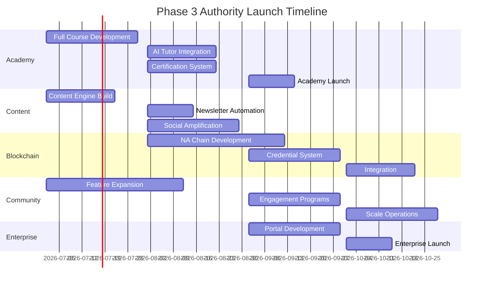
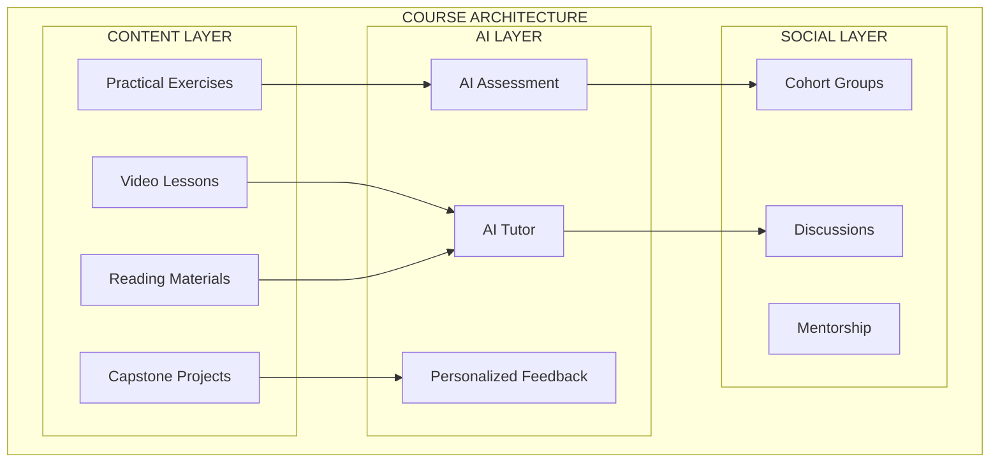
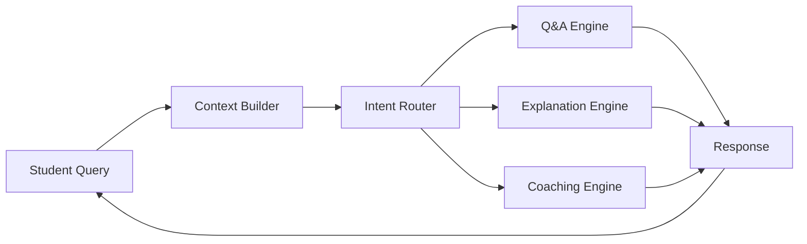
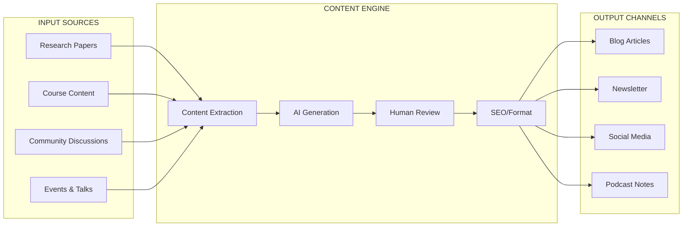
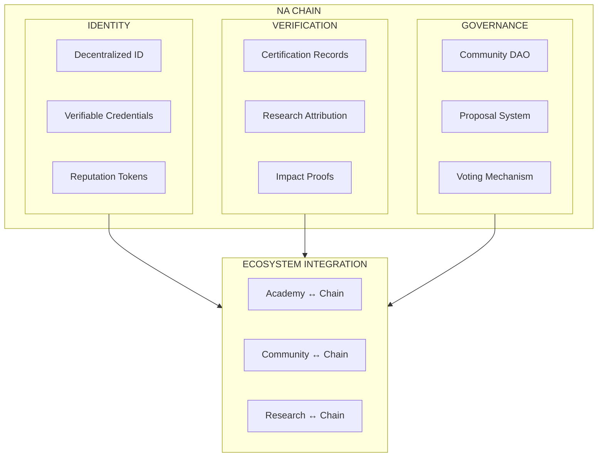
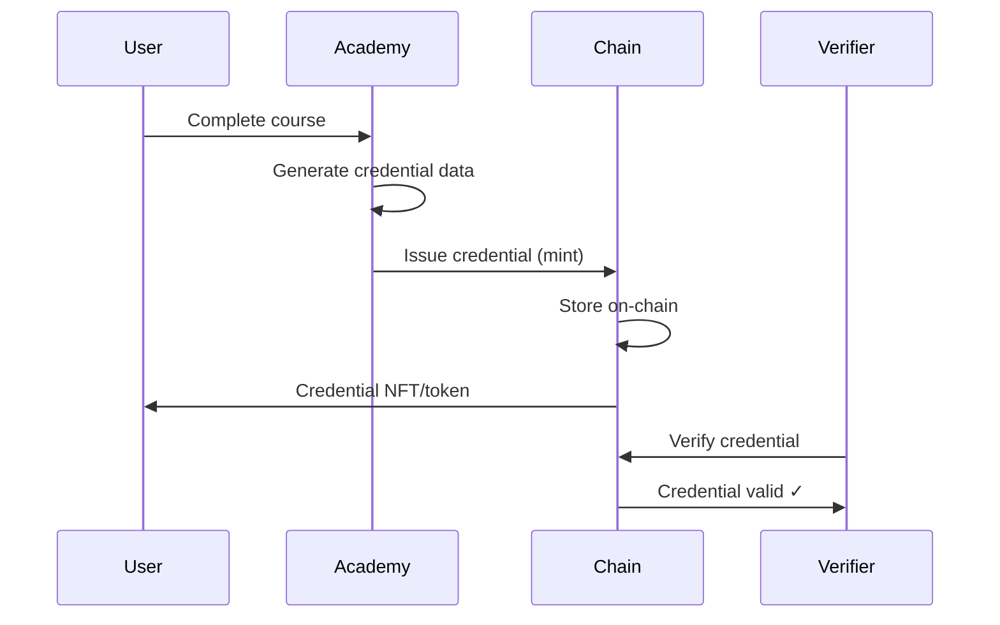
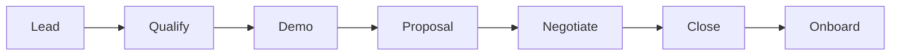

# Phase 3: Authority Launch

> *Establishing Nothing Artificial as the definitive voice in human-centric technology.*

---

## Overview

Phase 3 activates the full authority platform, scales the community, launches the complete Academy, integrates blockchain infrastructure, and establishes Nothing Artificial as the global leader in human-centric AI. This phase transforms infrastructure into influence.

---

## Phase 3 Timeline

---

## Phase 3A: Academy Full Launch (Weeks 1-10)

### Course Development

#### Core Curriculum

| Course | Level | Duration | Description |
|--------|-------|----------|-------------|
| **Human-Centric AI Foundations** | Beginner | 4 weeks | The philosophy and principles |
| **Cognitive Science for Technologists** | Intermediate | 6 weeks | Apply cognitive science to products |
| **Enterprise Human-AI Integration** | Advanced | 8 weeks | Implement ethical AI in organizations |
| **Research Methods in Enhancement** | Advanced | 6 weeks | Conduct human-centric research |
| **Blockchain for Trust** | Intermediate | 4 weeks | Build transparent systems |
| **AI Ethics & Governance** | Intermediate | 4 weeks | Navigate ethical challenges |

#### Course Structure

### AI Tutor Implementation

#### Tutor Capabilities

| Capability | Description |
|------------|-------------|
| **Question Answering** | Answer student questions about course material |
| **Concept Explanation** | Explain complex concepts in multiple ways |
| **Exercise Assistance** | Guide students through exercises without giving answers |
| **Progress Coaching** | Motivate and guide based on progress |
| **Resource Suggestion** | Recommend supplementary materials |

#### Tutor Architecture

### Certification System

#### Certification Tiers

| Certification | Requirements | Benefits |
|---------------|-------------|----------|
| **Practitioner** | Foundation course + exam | Basic credential |
| **Specialist** | 2+ intermediate courses + project | Advanced credential |
| **Expert** | 3+ courses + capstone + peer review | Premium credential |
| **Master** | Full curriculum + contribution + mentorship | Top credential |

#### Blockchain Certification

- Credentials issued as verifiable on-chain records
- Tamper-proof verification
- Portable across platforms
- Employer verification portal

---

## Phase 3B: Content Engine Activation (Weeks 1-8)

### Content Automation Pipeline

### Content Calendar

| Day | Content Type | Channel |
|-----|--------------|---------|
| Monday | Research roundup | Newsletter, Blog |
| Tuesday | Tutorial | Blog, YouTube |
| Wednesday | Thought leadership | LinkedIn, Blog |
| Thursday | Community spotlight | Social, Newsletter |
| Friday | News + discussion | Social, Community |

### Newsletter Automation

#### Segments

| Segment | Content Focus | Frequency |
|---------|---------------|-----------|
| Researchers | Papers, grants, collaborations | Weekly |
| Practitioners | Tools, case studies, techniques | Weekly |
| Enterprise | ROI, case studies, industry | Bi-weekly |
| Developers | APIs, tutorials, open source | Weekly |
| General | Philosophy, news, events | Weekly |

#### Personalization

- AI-curated content based on interests
- Dynamic content blocks per segment
- Engagement-based sending optimization
- A/B testing for subject lines and content

### Speaking & Media Engine

#### Speaking Kit Components

| Component | Description |
|-----------|-------------|
| Speaker bio | Multiple lengths (50, 100, 250 words) |
| Topic menu | 10+ topics with descriptions |
| Headshot package | Multiple formats and backgrounds |
| One-sheet | Visual summary for event organizers |
| Video reel | Highlight clips from past talks |

#### Podcast Prep System

| Step | AI Assistance |
|------|---------------|
| Research host | AI researches host background, past episodes |
| Prepare talking points | AI generates relevant discussion topics |
| Draft questions | AI suggests questions to prepare for |
| Post-episode | AI generates social content from episode |

---

## Phase 3C: Blockchain Integration (Weeks 6-16)

### NA Chain Architecture

### Credential System

#### On-Chain Credentials

| Credential Type | Data Stored | Verification |
|-----------------|-------------|--------------|
| Certifications | Course ID, date, score, issuer | QR code, URL |
| Research Attribution | Paper hash, authors, contribution | DOI link |
| Community Reputation | Contribution score, badges | Profile link |
| Impact Claims | Impact type, evidence hash | Dashboard |

#### Implementation

### Trust Infrastructure

| Use Case | Blockchain Application |
|----------|----------------------|
| **Credential Verification** | Employers verify certifications |
| **Research Attribution** | Immutable authorship records |
| **Community Reputation** | Contribution-based reputation |
| **Data Consent** | User-controlled permissions |
| **Impact Tracking** | Verified impact metrics |

---

## Phase 3D: Community Scale (Weeks 1-16)

### Feature Expansion

#### New Features

| Feature | Description | Timeline |
|---------|-------------|----------|
| **Working Groups** | Focused collaboration spaces | Week 1-4 |
| **Mentorship Program** | Structured mentor matching | Week 3-6 |
| **Job Board** | Human-centric AI opportunities | Week 5-8 |
| **Project Showcase** | Member project portfolio | Week 7-10 |
| **Expert Office Hours** | Live Q&A sessions | Week 9-12 |
| **Local Chapters** | Geographic community groups | Week 11-16 |

### Engagement Programs

#### Program Types

| Program | Description | Frequency |
|---------|-------------|-----------|
| **New Member Onboarding** | Welcome sequence, orientation | Continuous |
| **Weekly Challenges** | Skill-building activities | Weekly |
| **Monthly Showcase** | Member project presentations | Monthly |
| **Expert AMAs** | Ask-me-anything sessions | Bi-weekly |
| **Quarterly Hackathons** | Collaborative building events | Quarterly |
| **Annual Summit** | Major community gathering | Annual |

### Community Health Metrics

| Metric | Target | Measurement |
|--------|--------|-------------|
| Monthly Active Rate | 40%+ | MAU/Total members |
| Contribution Rate | 20%+ | Members who post/month |
| Connection Rate | 60%+ | Members with 3+ connections |
| Retention (D30) | 30%+ | Active after 30 days |
| NPS | 50+ | Quarterly survey |

---

## Phase 3E: Enterprise Platform (Weeks 8-14)

### Enterprise Portal Features

| Feature | Description |
|---------|-------------|
| **Company Dashboard** | Overview of all team members |
| **Team Management** | Add/remove team members |
| **Learning Paths** | Custom curricula for teams |
| **Progress Tracking** | Team learning analytics |
| **Bulk Enrollment** | Enroll teams in courses |
| **Custom Content** | Organization-specific materials |
| **SSO Integration** | Single sign-on setup |
| **API Access** | Programmatic integration |

### Enterprise Services

| Service | Description |
|---------|-------------|
| **Custom Training** | Tailored courses for organization |
| **Consulting** | Implementation guidance |
| **Assessment** | Human-centric AI readiness |
| **Workshops** | On-site or virtual sessions |
| **Certification Programs** | Internal certification |

### Sales Pipeline

---

## Authority Metrics

### Thought Leadership KPIs

| Metric | Target (Year 1) |
|--------|-----------------|
| Newsletter subscribers | 50,000+ |
| Blog monthly visitors | 100,000+ |
| Social followers (total) | 50,000+ |
| Podcast downloads | 100,000+ |
| Media mentions | 150+ |
| Speaking engagements | 36+ |

### Academy KPIs

| Metric | Target (Year 1) |
|--------|-----------------|
| Course enrollments | 2,500+ |
| Certifications issued | 1,000+ |
| Course completion rate | 70%+ |
| Student NPS | 60+ |
| Revenue | $250K+ |

### Community KPIs

| Metric | Target (Year 1) |
|--------|-----------------|
| Total members | 25,000+ |
| Monthly active | 10,000+ |
| Paid members | 2,500+ |
| Events hosted | 100+ |
| Member retention | 70%+ |

### Enterprise KPIs

| Metric | Target (Year 1) |
|--------|-----------------|
| Enterprise clients | 25+ |
| Annual contract value | $500K+ |
| Client retention | 90%+ |
| Client NPS | 50+ |

---

## Budget Estimate

### Phase 3 Costs

| Category | Estimate |
|----------|----------|
| Course development | $20,000 - $40,000 |
| AI tutor enhancement | $10,000 - $20,000 |
| Blockchain development | $15,000 - $30,000 |
| Community features | $10,000 - $20,000 |
| Enterprise portal | $15,000 - $25,000 |
| Content production | $10,000 - $20,000 |
| Marketing & events | $10,000 - $25,000 |

### Total Phase 3 Investment

| Scenario | Total |
|----------|-------|
| Minimum | $60,000 |
| Target | $90,000 |
| Maximum | $120,000 |

---

## Team Requirements

### Additional Roles

| Role | FTE | Phase 3 Focus |
|------|-----|---------------|
| Content Lead | 1.0 | Course development, content strategy |
| Community Manager | 1.0 | Community growth, engagement |
| Enterprise Sales | 1.0 | B2B sales, client success |
| Blockchain Developer | 0.5 | NA Chain, credentials |
| Events Coordinator | 0.5 | Virtual and in-person events |

---

## Success Criteria

### Phase 3 Complete When:

- [ ] Full Academy live with 5+ courses
- [ ] AI Tutor operational with 80%+ satisfaction
- [ ] Certification system issuing credentials
- [ ] Blockchain credentials verifiable
- [ ] Content engine producing 10+ pieces/week
- [ ] Newsletter reaching 50K+ subscribers
- [ ] Community at 25K+ members
- [ ] Enterprise portal live with 10+ clients
- [ ] Speaking/podcast cadence established
- [ ] All KPIs on track for Year 1 targets

### Authority Position Validated When:

- [ ] Nothing Artificial recognized as thought leader
- [ ] Academy certifications valued by employers
- [ ] Community is destination for practitioners
- [ ] Enterprise clients citing NA as differentiator
- [ ] Media requests inbound regularly
- [ ] Conference speaking invitations increasing

---

## Transition to Ongoing Operations

### Operational Handoff

| Area | Owner | Cadence |
|------|-------|---------|
| Academy | Education Team | Continuous |
| Community | Community Team | Continuous |
| Content | Marketing Team | Weekly |
| Enterprise | Sales Team | Continuous |
| Blockchain | Engineering Team | Quarterly releases |

### Continuous Improvement

| Activity | Frequency |
|----------|-----------|
| Course content updates | Quarterly |
| Community feedback review | Monthly |
| AI model retraining | Quarterly |
| Blockchain feature releases | Quarterly |
| Strategy review | Quarterly |
| Annual planning | Annually |

---

*Phase 3 establishes authority. Nothing Artificial becomes the voice of human-centric technology.*
