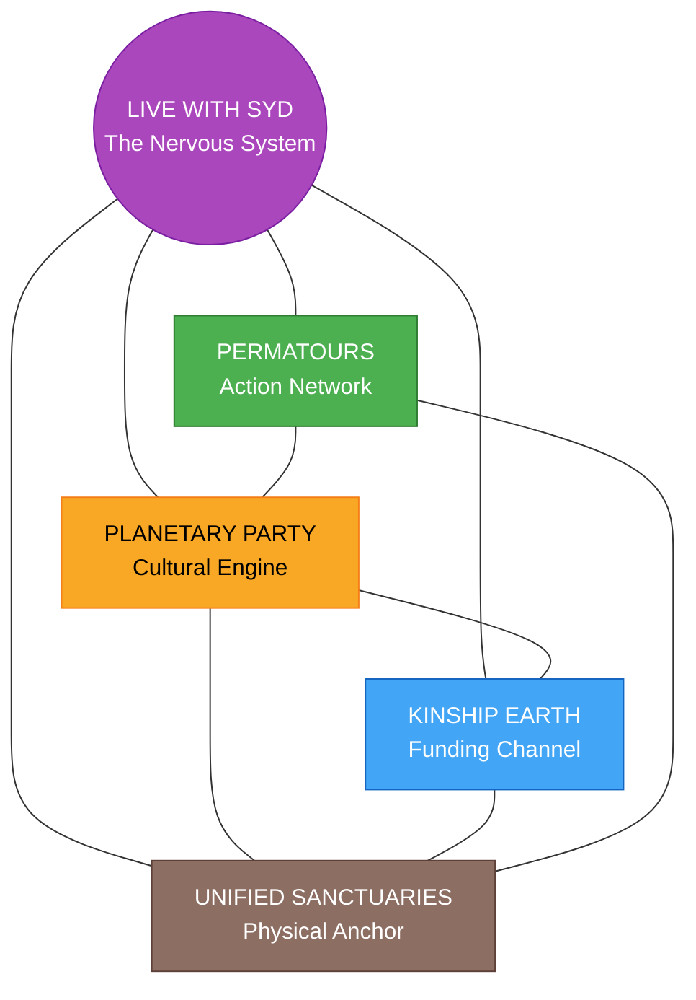

# Sydney's Projects

> *An interconnected ecosystem of four regenerative projects building a new paradigm for community, land stewardship, and collective action.*

## The Force Behind It All

Syd Harvey Griffith is a community organizer, movement builder, and regenerative powerhouse operating at the intersection of grassroots action and regenerative finance. She doesn't just talk about a better world -- she architects it, funds it, and builds it with her own hands and an ever-growing network of co-conspirators.

As **Executive Director of Kinship Earth**, Syd is reshaping how capital moves -- pioneering Bioregional Flow Funding that shifts financial decision-making away from institutional gatekeepers and into the hands of grassroots leaders embedded in their communities. No grant applications. No burdensome reporting. Just trust-based resources flowing directly to the change-makers healing the places they call home.

As **Co-founder of Permatours**, she's built a permaculture-action network that has supported **40+ land-based projects** throughout the Northeast of Turtle Island -- rallying communities through educational festivals and mutual aid to strengthen local capacity for affordable housing, healthy food, and grassroots infrastructure.

Her latest and most ambitious creation is the **Planetary Party** -- a federated ecosystem designing a community engagement process to weave regenerative networks and catalyze systemic transformation at a local level. Its gatherings serve as peak opportunities for communities to confront pressing challenges, showcase solutions both local and global, and unlock capital in service of people and planet.

All four of her projects converge in **Unified Sanctuaries** -- the physical anchor where the vision becomes land, the land becomes community, and the community becomes a living blueprint for what's possible when you let an eco boss lead.

Syd is the rare leader who can hold a singing circle and a cap table in the same breath -- moving between festival stages and funding pipelines, soil science and systems design, ritual theater and real estate. Every project she touches is interconnected by design, because she understands that the only way to build a regenerative future is to build it as a whole system, not in silos.

## The Four Projects

| Project | Role | Description |
|---------|------|-------------|
| [Planetary Party](./planetary-party/) | Ecosystem, Community Engagement & Festivals | The cultural heartbeat -- events, festivals, and gatherings that build community and generate visibility |
| [Permatours](./permatours/) | Permaculture Action & Mutual Aid Network | A network of permaculture practitioners, NE bioregional hubs, and mutual aid connecting projects across the region |
| [Unified Sanctuaries](./unified-sanctuaries/) | Land-Based Project & Community | The physical anchor -- a regenerative village with farm, retreat center, event venue, and community living |
| [Kinship Earth](./kinship-earth/) | Flow Funding & Grants | The nonprofit funding vehicle channeling grants and flow funding to support the ecosystem |

## How They Connect

The four projects form a circular, self-reinforcing ecosystem:



- **Planetary Party** generates community engagement, visibility, and culture that feeds all three other projects
- **Permatours** brings volunteers, partnerships, and a regional network that strengthens the land project and events
- **Unified Sanctuaries** provides the physical home base where gatherings happen, the network converges, and the vision is lived
- **Kinship Earth** channels grants and flow funding to support the land project and sustain the broader ecosystem
- **Live with Syd** weaves all four pillars together through weekly sessions, content generation, and community cultivation

See [ecosystem-map.md](./ecosystem-map.md) for detailed relationship mapping.

## Current Phase

**Planning & Scoping** -- Defining each project's scope, identity, and initial action steps while building on existing work in Unified Sanctuaries and established relationships across all four domains.

## Folder Structure

```
sydney/
├── README.md                  # This file -- ecosystem overview
├── metadata.json              # Brand metadata
├── ecosystem-map.md           # Detailed project relationships and flows
├── planetary-party/           # Project 1
│   └── README.md
├── permatours/                # Project 2
│   └── README.md
├── unified-sanctuaries/       # Project 3
│   └── README.md
└── kinship-earth/             # Project 4
    └── README.md
```

## Related

- Full Unified Sanctuaries brand documentation: [`brands/unified-sanctuaries/`](../unified-sanctuaries/)

---

*These projects are stewarded by Syd Harvey Griffith -- community organizer, movement builder, and the driving force behind a regenerative ecosystem that is rewriting the rules of how communities fund, build, and sustain themselves.*
