# Ecosystem Map

> *How the four projects flow into and reinforce each other -- and how Live with Syd weaves them into one living system.*

This document maps the relationships, resource flows, community infrastructure, and interdependencies across the ecosystem stewarded by Syd Harvey Griffith. It draws from the full body of Live with Syd documentation to present a comprehensive view of how culture, network, land, capital, and connective programming operate as a single regenerative engine.

---

## The Architect

At the center of this ecosystem is Syd -- a community organizer, movement builder, and regenerative finance leader who designed these four projects to function as one living system. She isn't just managing a portfolio; she's orchestrating a regenerative engine where culture funds the land, the land hosts the network, the network feeds the movement, and the movement attracts the capital.

Syd holds Executive Director roles, co-founder titles, and lead design seats across all four projects -- but more than titles, she holds the connective vision that makes the whole thing work. She's supported 40+ land-based projects, pioneered trust-based flow funding, and built a federated ecosystem that turns festivals into funding pipelines and mutual aid into systemic transformation.

Through Live with Syd, she also serves as the ecosystem's primary facilitator, educator, and public interface -- hosting weekly sessions that make the invisible connective tissue between projects visible and participatory.

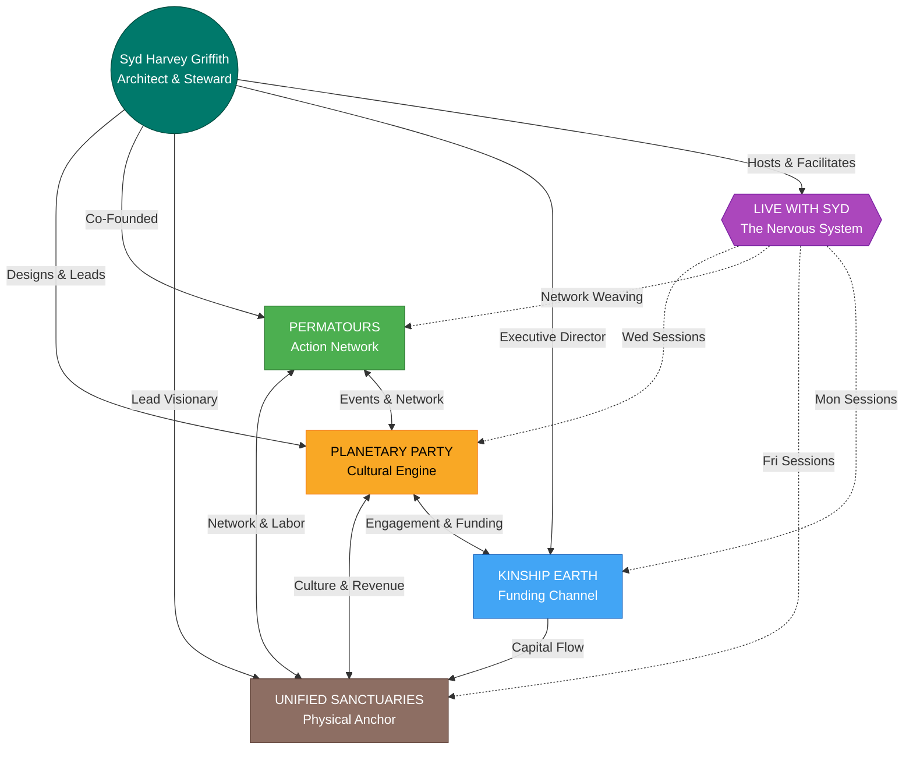

---

## The Four Pillars

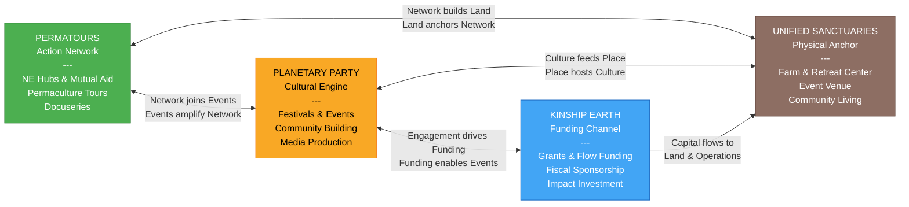

### 1. Planetary Party -- The Cultural Engine
**Role**: Ecosystem, Community Engagement & Festivals

The outward-facing cultural layer -- festivals, events, and community gatherings that bring people into the ecosystem, generate visibility, and build the relational fabric that holds everything together.

**What It Activates:**
- Regenerative festivals (e.g., Leave a Positive Trace) as entry points into the ecosystem
- Cultural gatherings: singing circles, theater, immersive arts, ritual
- Educational events: governance, permaculture, community-building workshops
- Ecosystem events that bring together Permatours network, Kinship Earth donors, and Unified Sanctuaries community
- Built-in media production for storytelling, documentary, and online distribution

**Weekly Programming (Live with Syd -- Wednesdays):**
- Guild-building and role clarity
- Governance design and experimentation
- Bioregional coordination models
- Cultural rituals and myth-making
- Collective intelligence practices
- DAO-inspired coordination tools
- Cross-bioregional collaboration
- Sensemaking around global crises
- Systems mapping and leverage points

**Who It Draws In:** Systems thinkers, DAO/governance designers, cultural workers, bioregional organizers, regen finance innovators, technologists, community weavers

**Key People:** Syd Harvey Griffith (lead designer), Eslerh (film, multimedia, ritual theater), Michael/Fuego (festival production, financial operations)

---

### 2. Permatours -- The Action Network
**Role**: Permaculture Action & Mutual Aid Network

The connective tissue across the NE bioregion. Permatours links permaculture practitioners, projects, and hubs into a mutual aid network. It brings volunteers, skills, and aligned partnerships into the ecosystem while extending reach outward through regional NE Hubs.

**What It Activates:**
- NE Hubs: self-organizing distributed nodes across the Northeast bioregion
- Mutual aid coordination and reciprocity-based resource sharing
- Permaculture education tours and hands-on work days, builds, plantings
- Documentary storytelling (Permatours docuseries -- every tour documented)
- Partnership building across land-based projects

**Network Model:** Not a single project but a network -- action-first, with mutual aid at its core. NE Hubs feed into and draw from the central network, creating a self-reinforcing regional web.

**Key People:** Syd Harvey Griffith (co-founder, 40+ projects supported), Pato (permaculture installations, global hub partnerships), Scotty (soil science, compost, natural building, educator)

---

### 3. Unified Sanctuaries -- The Physical Anchor
**Role**: Land-Based Project & Community

The ground truth. A regenerative village in Southern Vermont integrating farm, retreat center, event venue, and community living. This is where the vision becomes physical -- food is grown, people live, retreats happen, and the circular economy operates.

**Four Sub-Pillars:**

| Sub-Pillar | What It Does | Revenue Potential |
|---|---|---|
| Permaculture Farm & Education Center | Food production, agri-tourism, education | $315k -- $1M+ |
| Retreat & Healing Arts Center + Bathhouse | Healing programs, ceremonies, somatic work | $570k -- $1.75M |
| Event Venue + Innovation Hall | Festivals, conferences, governance labs | $310k -- $1.16M |
| Community Living / Regenerative Neighborhood | 20+ homes, cooperative housing | $195k -- $580k |
| **Total Ecosystem Revenue Potential** | | **$1.4M -- $4.5M+** |

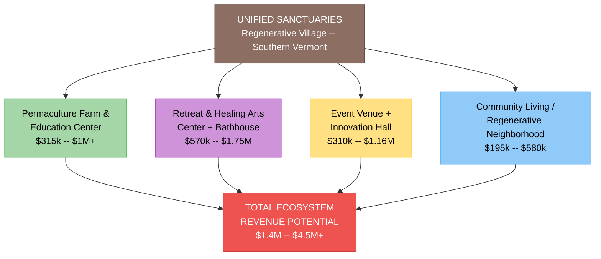

**Weekly Programming (Live with Syd -- Fridays):**
- Land acquisition and stewardship models
- Community land trusts and nested trust structures
- Governance and decision-making frameworks
- Cooperative living and shared ownership
- Regenerative agriculture and permaculture design
- Housing, infrastructure, and zoning navigation
- Healing arts, retreat, and education programming
- Financing land access: tokenization, community investment, membership models
- Replication pathways for other bioregions

**Governance Design:**
- Non-speculative land stewardship held in trust
- Earned equity through contribution (stewardship, not just capital)
- Anchor Circle governance (consent-based, rotating leadership)
- Circular economy with Sol Token (utility) and Voice Token (governance)
- Open-source blueprint shared for replication

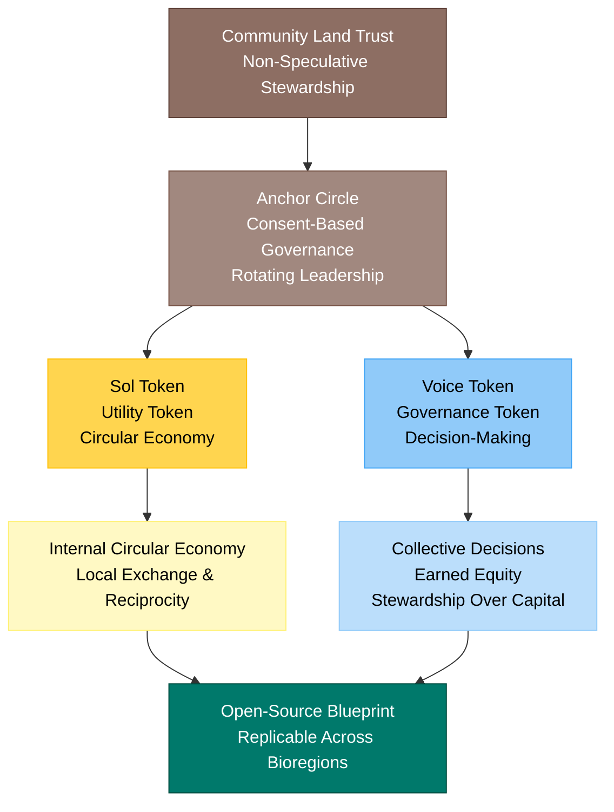

**Who It Draws In:** Land stewards, permaculture designers, regenerative farmers, architects, natural builders, legal/financial innovators, healers, facilitators, cooperative housing advocates

**Key People:** Syd Harvey Griffith (lead visionary), Lynney, Nina, Josie, Tiff, Eslerh, Scotty, Jess, Michael/Fuego, Pato (farm, storytelling, earth law, somatic therapy, film, soil science, bathhouse, accounting, permaculture)

**Status:** Phase: Pre-acquisition / Planning

---

### 4. Kinship Earth -- The Funding Channel
**Role**: Flow Funding & Grants

The nonprofit vehicle that channels grants, flow funding, and philanthropic capital into the ecosystem. Kinship Earth provides the fiscal infrastructure and legitimacy to attract institutional and foundation support.

**What It Activates:**
- Grant acquisition from foundations, government, and climate programs
- Flow funding: capital moves where needed, not locked in rigid budgets
- Fiscal sponsorship for ecosystem projects
- Donor engagement and stewardship
- Impact reporting and storytelling-driven fundraising
- Event-integrated fundraising (Planetary Party events as donor cultivation)

**Weekly Programming (Live with Syd -- Mondays):**
- Bioregional flow funding and participatory grantmaking
- Trust-based philanthropy and direct giving models
- Carbon, biodiversity, and ecosystem service credit markets
- Regenerative crypto, DAOs, Web3 coordination tools
- Green bonds and blended finance
- Social impact investing and community wealth-building
- Cooperative structures and shared ownership
- Resource pooling and commitment pooling
- Data collection, impact measurement, and storytelling
- Alternative metrics beyond GDP
- Funding land access, food sovereignty, community infrastructure

**Funding Targets:**
- USDA (Beginning Farmer, Community Facilities)
- Vermont Housing & Conservation Board
- Vermont Community Foundation
- Climate and soil carbon credit programs
- Family foundations (regenerative agriculture, land access, community resilience)
- Flow funding networks (RSF Social Finance, Thousand Currents)
- Impact investors (regenerative real estate, land stewardship)

**Who It Draws In:** Funders, grassroots organizers, regenerative entrepreneurs, DAO builders, philanthropy reformers, community leaders

**Key People:** Syd Harvey Griffith (Executive Director, pioneered Bioregional Flow Funding), Michael/Fuego (financial operations, accounting, compliance)

---

## Live with Syd -- The Nervous System

Live with Syd is not a fifth project -- it is the connective tissue that makes the four pillars one living system. These recurring, co-creative live sessions are where the ecosystem meets itself, processes together, builds coherence, and invites others in.

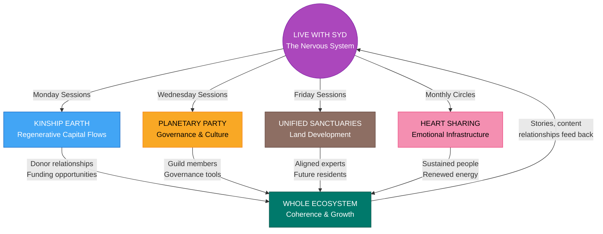

### Weekly Rhythm

| Day | Theme | Pillar Served |
|---|---|---|
| **Monday** | Regenerative Capital Flows | Kinship Earth + whole ecosystem |
| **Wednesday** | Planetary Party Ecosystem | Planetary Party + governance layer |
| **Friday** | Unified Sanctuaries Development | Unified Sanctuaries + land projects |
| **Monthly** | Heart Sharing & Grief Transmutation | Whole ecosystem (emotional infrastructure) |

### What It Does for the Ecosystem

- **Makes the invisible visible**: Resource flows, governance experiments, and funding strategies are discussed openly, creating shared understanding across the ecosystem
- **Recruits and filters**: Registration and intentionality screening bring in values-aligned participants who become volunteers, donors, collaborators, residents, and guild members
- **Generates content**: Every session becomes replays, clips, newsletters, and social media -- feeding the storytelling engine that powers fundraising and community growth
- **Builds relational trust**: Co-creative format cultivates the trust that makes flow funding, mutual aid, and consent-based governance possible
- **Processes grief and burnout**: Monthly heart sharing circles provide the emotional infrastructure that sustains long-haul movement work

### Heart Sharing & Grief Transmutation Circles

A distinct offering that serves the whole ecosystem. Non-recorded, sacred containers for processing:
- Grief for ecosystems, species, landscapes, lost futures
- Burnout from organizing, funding, and building
- Rage, despair, numbness, overwhelm
- Tenderness, gratitude, remembrance

**Practices:** Guided grounding, breathwork, somatic awareness, gentle movement, sound/song/silence, council-style sharing, ritual and symbolic acts, collective witnessing, grief transmutation into clarity and action.

**Design:** Always non-recorded. Closed, intentional container. Trauma-informed facilitation. No fixing, no advice-giving. Deep listening and mutual care.

---

## Resource Flows

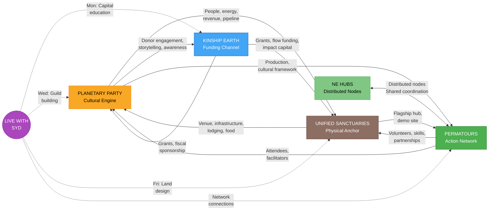

### Planetary Party <-> Unified Sanctuaries
**Culture and Place (Gold Arrows)**

- **PP -> US**: Events bring people, energy, and revenue to the land. Festivals generate ticket sales, visibility, and pipeline for future residents/stewards.
- **US -> PP**: The land provides physical venue, infrastructure, lodging, and food systems. The land is the stage.

### Planetary Party <-> Kinship Earth
**Engagement and Funding (Blue Arrows)**

- **PP -> KE**: Events generate donor engagement, storytelling content, and awareness that fuels fundraising. Attendees become donors and advocates.
- **KE -> PP**: Kinship Earth provides grant funding and fiscal sponsorship for event production and community programming.

### Kinship Earth -> Unified Sanctuaries
**Capital Flow (Blue Arrow)**

- Kinship Earth channels grants, flow funding, and impact capital into Unified Sanctuaries for land acquisition, infrastructure, and operations. This is the primary financial pipeline from the philanthropic world into the land project.

### Permatours <-> Unified Sanctuaries
**Network and Labor (Dashed Arrows)**

- **PT -> US**: Permatours brings volunteers, skilled practitioners, and partnerships that reduce costs and increase capacity.
- **US -> PT**: Unified Sanctuaries serves as flagship hub and demonstration site. A home base and replicable model.

### NE Hubs <-> Permatours
**Regional Network (Dashed Arrows)**

- NE Hubs are distributed nodes across the Northeast bioregion. They feed into the central network and benefit from shared coordination and resources.

### Permatours <-> Planetary Party
**Events and Network (Implied)**

- Permatours gatherings are hosted through Planetary Party events. The network provides attendees and facilitators; the event platform provides production and cultural framework.

### Live with Syd -> All Four Pillars
**Programming, Recruitment, and Coherence (New)**

- **LWS -> Kinship Earth**: Monday sessions educate around regenerative capital, cultivate donor relationships, and surface funding opportunities.
- **LWS -> Planetary Party**: Wednesday sessions build guild membership, test governance models, and recruit systems thinkers into active co-creation.
- **LWS -> Unified Sanctuaries**: Friday sessions advance land project design in public, attract aligned experts (legal, permaculture, finance), and build the future resident/steward pipeline.
- **LWS -> Permatours**: Sessions surface volunteer energy, bioregional partnerships, and mutual aid connections that flow into the network.
- **LWS -> All**: Heart sharing circles sustain the emotional health of people across every pillar. Content pipeline feeds storytelling across all projects.

---

## Community Infrastructure

### Discord Architecture (4 Servers)

Each server maps to a core pillar, creating dedicated spaces for the communities that form around each:

| Server | Purpose | Tone | Growth Target |
|---|---|---|---|
| **Regenerative Capital Flows** | Learning and collaboration hub for unlocking capital | Strategic, experimental, grounded | 100 -- 500+ |
| **Planetary Party** | Coordination and governance laboratory | Visionary, mythic, strategic | 100 -- 1,000+ |
| **Unified Sanctuaries** | Real-time co-creation of land project | Place-based, grounded, practical | 50 -- 300 |
| **Grief & Transmutation Circles** | Sacred container for emotional processing | Gentle, quiet, reverent | 20 -- 150 |

**Cross-Server Patterns:** Each server includes welcome/orientation, general community space, topic-specific channels, collaboration zones, archives (replays + resources), and private mod/strategy channels. Unified Sanctuaries adds detailed channels for land, governance, design/build, funding, and programming. Planetary Party adds guild channels and bioregional hub channels.

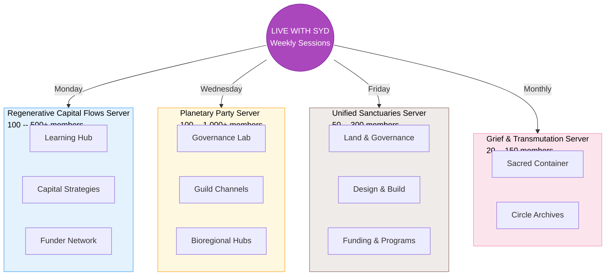

### Participation Design

**Tiered Roles (fluid, not hierarchical):**
- **Listeners** -- Mic muted, camera optional, participate via chat
- **Contributors** -- Share reflections/questions when invited by moderators
- **Presenters/Guests** -- Offer talks, practices, case studies (confirmed in advance)

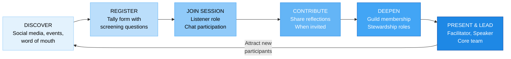

**Who It's For:** Curious, collaborative, values-aligned people oriented toward regeneration -- willing to listen, reflect, and co-create. Comfortable with ambiguity and emergence. Committed to care, consent, and respect.

**Who It's Not For:** Sales pitches, self-promotion, ideological combativeness, financial speculation, harassment, domination behaviors, or anyone unwilling to honor community agreements.

**Community Agreements (10 Core):**
1. Come with presence and intention
2. Honor confidentiality
3. Speak from lived experience
4. No harassment, hate, or harmful speech
5. Respect the container (raise-hand, wait to be invited)
6. Consent before recording or sharing
7. Honor time and space
8. Stay curious, not combative
9. Support collective coherence
10. Right to removal (moderators may mute, remove, or ban)

**Conflict & Accountability Pathway:**
1. Message moderator privately
2. Moderators may pause or redirect session
3. Serious cases: muted or removed
4. Follow-up dialogue or repair offered

---

## Content & Storytelling Pipeline

Storytelling is not an afterthought -- it is infrastructure. Every session, event, and gathering generates content that serves fundraising, community growth, and movement building.

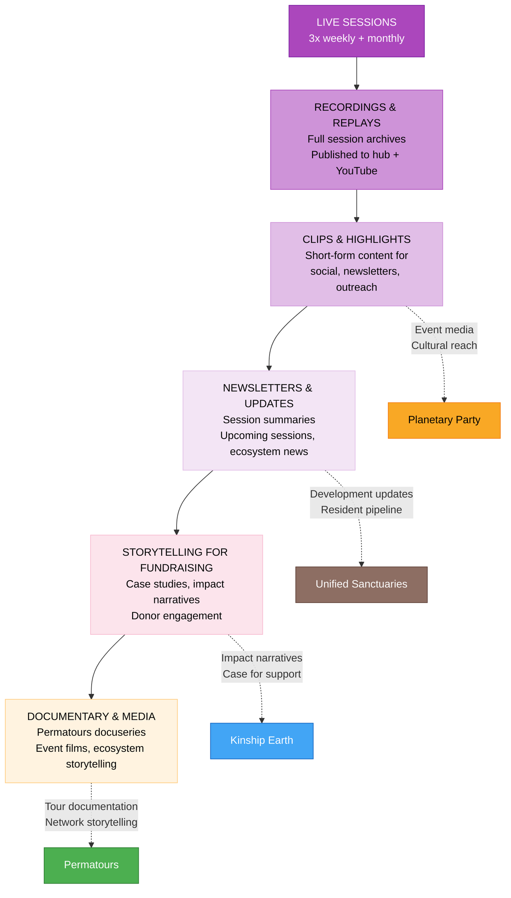

**Content serves every pillar:**
- **Kinship Earth**: Impact narratives and case studies become the case for support
- **Planetary Party**: Event media drives visibility and cultural reach
- **Permatours**: Tour documentation feeds the docuseries and network storytelling
- **Unified Sanctuaries**: Development updates build the future resident pipeline and donor trust

---

## Operational Ecosystem

### Support Team Architecture (12 Roles, 6 Categories)

The Live with Syd documentation defines the operational team needed to run the ecosystem's connective programming:

```mermaid
flowchart TD
    TEAM["LIVE WITH SYD\nOPERATIONAL TEAM\n12 Roles across 6 Categories"]

    TEAM --> TECH["TECH INFRASTRUCTURE\n& SYSTEMS"]
    TEAM --> OPS["LIVE SESSION\nOPERATIONS"]
    TEAM --> CONTENT["CONTENT &\nPUBLISHING"]
    TEAM --> COMMUNITY["COMMUNITY &\nRELATIONSHIPS"]
    TEAM --> PROGRAM["PROGRAM DESIGN\n& FACILITATION"]
    TEAM --> ADMIN["ADMINISTRATION\n& FUNDING"]

    TECH --> T1["Tech Architect /\nSystems Integrator"]
    TECH --> T2["Automation\nEngineer"]
    TECH --> T3["Studio / On-Site\nTech Specialist"]

    OPS --> O1["Live Session\nModerator"]
    OPS --> O2["Backup\nModerator Pool"]

    CONTENT --> C1["Content Producer\n/ Editor"]
    CONTENT --> C2["Streaming\nProducer"]

    COMMUNITY --> CM1["Community\nManager"]
    COMMUNITY --> CM2["Guest Liaison /\nSpeaker Coordinator"]

    PROGRAM --> P1["Heart Sharing\nCircle Facilitators"]
    PROGRAM --> P2["Program\nCurator"]

    ADMIN --> A1["Administrator /\nOps Manager"]
    ADMIN --> A2["Fundraising /\nResource Mobilization"]

    style TEAM fill:#AB47BC,stroke:#7B1FA2,color:#fff
    style TECH fill:#42A5F5,stroke:#1565C0,color:#fff
    style OPS fill:#66BB6A,stroke:#43A047,color:#fff
    style CONTENT fill:#FFA726,stroke:#FB8C00,color:#000
    style COMMUNITY fill:#EC407A,stroke:#C62828,color:#fff
    style PROGRAM fill:#7E57C2,stroke:#512DA8,color:#fff
    style ADMIN fill:#78909C,stroke:#546E7A,color:#fff
```

**Minimum Viable Team:** 4-6 people covering: tech + automation, moderation + community, content + streaming, guest coordination + curation, heart sharing facilitation, administration.

### Tech Stack (Privacy-First, Open-Source)

| Layer | Tool | Why |
|---|---|---|
| Live Rooms | Jitsi (self-hosted) or BigBlueButton | Open-source, no accounts required, full moderator control |
| Registration | Tally Forms | Privacy-first, reCAPTCHA, email verification |
| Backend Database | Airtable | Speaker intake, session tracking, approval workflows |
| Public Hub | Notion (Phase 1) or WordPress/Ghost (Phase 2) | Low-friction launch, embeddable databases |
| Streaming & Recording | OBS Studio | Open-source, scene management, local recording |
| Automation | Tally -> Airtable -> Email -> Notion | Registration confirmations, reminders, replay links |
| Community | Discord (4 servers) | Pillar-aligned, role-gated, moderated |

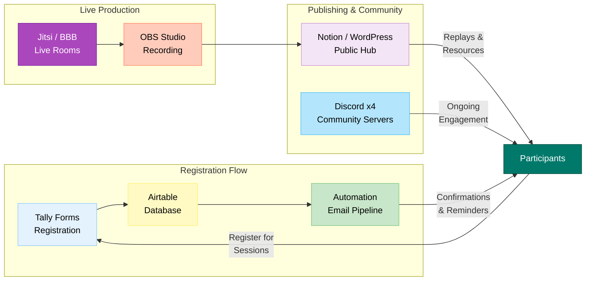

**Non-Negotiable Guardrails:**
- No Zoom or Meta platforms
- No data resale or third-party sharing
- No ambiguous media rights clauses
- GDPR-friendly defaults
- Minimal data collection
- All recordings owned by Syd
- Participant opt-out supported at any time
- No forced account creation

---

## Economic Design

### Revenue Streams by Pillar

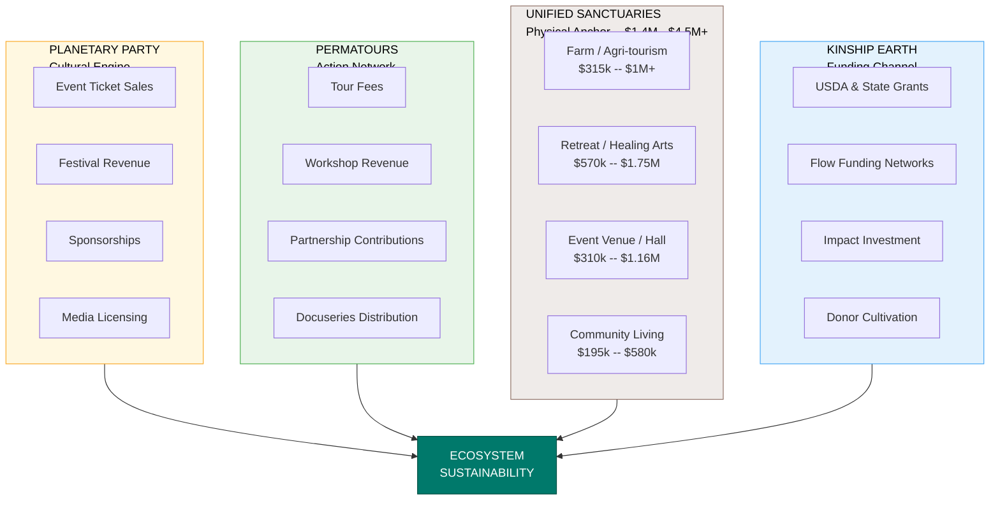

### Participation Economy (Live with Syd)

Offered in a spirit of generosity and reciprocity. No one turned away for lack of funds.

- **Sliding-scale donations** per session or monthly
- **Stewardship memberships** for ongoing supporters
- **Project-specific funding pools** for targeted contributions
- **Speaker/educator contributions** (co-creative, not transactional)

### Impact Tracking

- Number of sessions held
- Number of participants engaged
- Cross-bioregional collaborations formed
- Funding pathways unlocked
- Land/infrastructure projects seeded
- Governance experiments launched
- Stories of personal and community transformation

---

## Value Circulation Summary

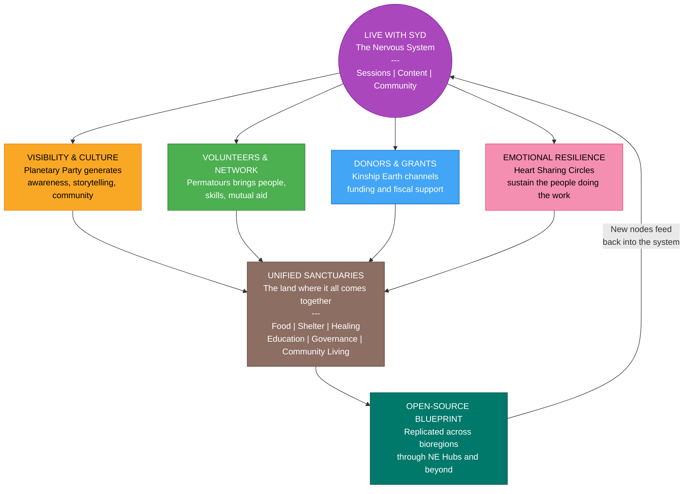

---

## Key Insight

No single project works in isolation. The ecosystem's strength is its interdependence:

- Without **Planetary Party**, there's no cultural engine to attract people and tell the story
- Without **Permatours**, there's no regional network feeding skills, labor, and partnerships
- Without **Unified Sanctuaries**, there's no physical anchor where the vision is lived
- Without **Kinship Earth**, there's no institutional funding pipeline to sustain the work
- Without **Live with Syd**, there's no nervous system weaving it all into coherent, participatory, living practice

Each project solves a piece of the puzzle that the others cannot. Live with Syd makes the connections between them visible, cultivates the relationships that power them, generates the content that tells their story, and holds the emotional container that sustains the people doing the work.

And it's Syd who sees the whole picture -- the rare builder who moves fluently between soil and spreadsheets, singing circles and capital campaigns, governance design and festival production, grief circles and grant applications. That cross-domain fluency is the ecosystem's secret weapon.

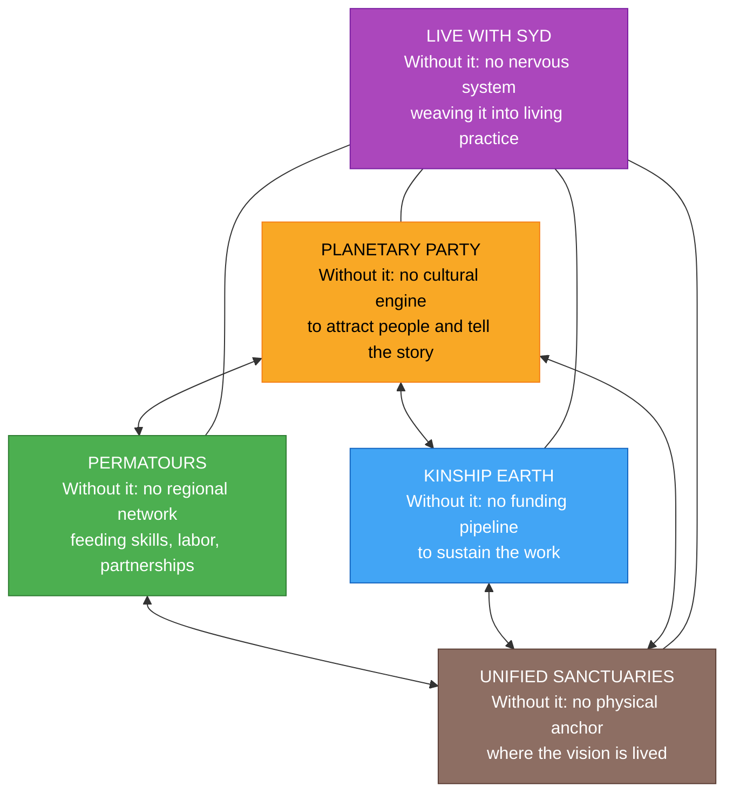

---

## What Participants Walk Away With

**Mondays (Capital Flows):**
- New funding models applicable to their own work
- Introductions to aligned funders and collaborators
- Clarity on project next steps
- Templates, tools, and case studies
- Stronger narrative for their work

**Wednesdays (Planetary Party):**
- Role or guild invitation within the ecosystem
- Governance tools they can adapt
- New collaborators in their bioregion
- Strategic clarity on systems change
- Felt sense of belonging to something larger

**Fridays (Unified Sanctuaries):**
- Practical land access and stewardship insights
- Governance and trust models to study
- Pathways into regenerative living
- Collaboration opportunities on the land project
- A real-world prototype to learn from

**Heart Sharing Circles:**
- Lighter nervous system
- Greater emotional clarity
- Sense of being witnessed and held
- Renewed energy for the work
- Tools for ongoing self-regulation
