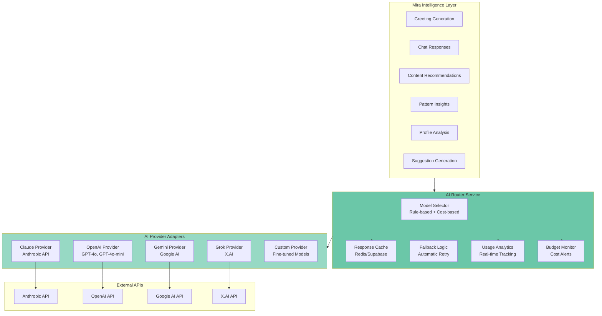
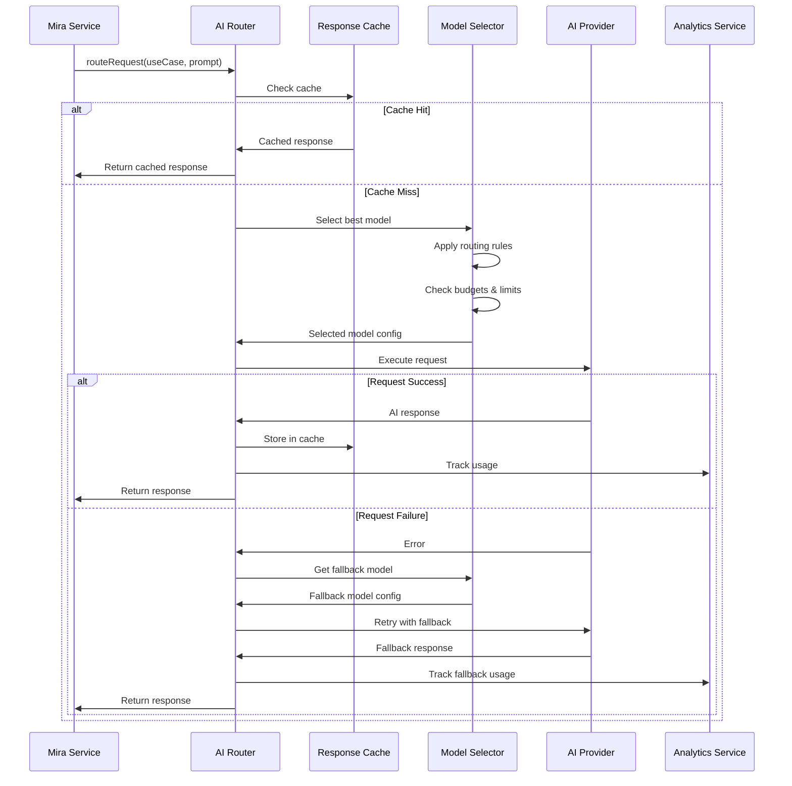

# AI Model Router - Multi-Provider AI Orchestration

**Epic ID**: FEATURE-AI-ROUTER  
**Priority**: P1 (Foundation for cost optimization and resilience)  
**Timeline**: 8 weeks (phased rollout)  
**Dependencies**: Epic 0 (Foundation), Epic 1 (Mira)  
**Version**: 1.0.0  
**Last Updated**: December 16, 2025

---

## Vision & Objectives

Transform Mira from a single-provider AI system into a provider-agnostic intelligent platform that dynamically selects the best AI model for each use case, with automatic fallback, cost optimization, and comprehensive analytics.

**Brand Integration**: All Mira AI responses generated through this router must embody [Mira's personality](../brand/04-mira-personality-guide.md). Every prompt includes brand personality context to ensure consistent voice regardless of which AI provider is selected.

### Strategic Value

**Why This Matters**:
- **Cost Optimization**: Route simple tasks to cheaper models ($0.0001/token), complex tasks to premium models ($0.003/token) - potential 30-50% cost reduction
- **Resilience**: 99.9%+ availability through automatic fallback when primary provider has issues
- **Future-Proof**: Add new AI models in <4 hours as they emerge (Llama 4, GPT-5, Claude 4, etc.)
- **Specialization**: Use best model for specific tasks (Gemini for multimodal, Claude for empathy, GPT for analysis)
- **Competitive Advantage**: Not locked into any single provider's pricing, rate limits, or capabilities
- **Performance**: Leverage fastest available model for time-sensitive interactions

### Success Criteria

**Cost Metrics**:
- 30%+ reduction in AI costs through intelligent routing
- 50%+ cache hit rate for common requests
- <$0.01 per user per day AI cost at 10K users
- Daily budget alerts prevent cost overruns

**Availability Metrics**:
- 99.9%+ AI availability through multi-provider fallback
- <1% of requests fail due to all providers being unavailable
- <500ms p95 response latency including fallback attempts
- Zero user-facing disruption during provider outages

**Analytics Metrics**:
- 100% of AI interactions tracked with model, cost, and performance data
- Real-time cost dashboard for admins
- Weekly automated reports on model performance
- A/B testing framework for model comparison

**Developer Experience**:
- New AI providers addable in <4 hours
- Zero code changes to switch model priorities
- Admin can adjust routing rules without deployments
- Comprehensive testing tools for model evaluation

---

## Architecture Overview

### System Architecture



### Request Flow



### Key Components

**AI Router Service** (`AIRouterService`):
- Central orchestrator for all AI requests
- Implements model selection logic
- Manages fallback strategies
- Tracks usage and costs
- Enforces budget limits

**Provider Adapters** (Abstract `AIProvider` interface):
- Standardized interface for all AI providers
- Normalizes responses to common format
- Handles provider-specific authentication
- Implements streaming support
- Provides cost estimation

**Response Cache** (`AIResponseCache`):
- Redis-based caching (fallback to Supabase)
- 24-hour TTL for most responses
- Smart cache key generation
- Cache invalidation strategies
- Cache hit rate monitoring

**Analytics Service** (`AIAnalyticsService`):
- Real-time usage tracking
- Cost calculation and aggregation
- Performance monitoring
- Daily/weekly reporting
- Budget alerting

**Model Selector** (`ModelSelector`):
- Rule-based model selection
- Capability matching
- Rate limit enforcement
- Budget constraint checking
- Priority-based fallback

---

## Database Schema

### AI Model Interactions Table

Tracks every AI interaction for analytics and cost monitoring:

```sql
-- ============================================================================
-- AI MODEL INTERACTIONS
-- ============================================================================

CREATE TABLE ai_model_interactions (
  id UUID PRIMARY KEY DEFAULT gen_random_uuid(),
  user_id UUID REFERENCES profiles(id) ON DELETE SET NULL,
  
  -- Request classification
  interaction_type TEXT NOT NULL, -- 'greeting', 'chat', 'recommendation', 'insight', 'analysis'
  use_case TEXT NOT NULL, -- Specific use case for routing decisions
  
  -- Model used
  model_provider TEXT NOT NULL, -- 'claude', 'openai', 'google', 'xai', 'custom'
  model_name TEXT NOT NULL, -- 'claude-3-5-sonnet-20241022', 'gpt-4o', 'gemini-1.5-pro'
  model_version TEXT, -- Specific version if tracked
  
  -- Token usage
  prompt_tokens INTEGER NOT NULL,
  completion_tokens INTEGER NOT NULL,
  total_tokens INTEGER GENERATED ALWAYS AS (prompt_tokens + completion_tokens) STORED,
  
  -- Performance metrics
  response_time_ms INTEGER NOT NULL,
  latency_ms INTEGER, -- Time to first token (for streaming)
  
  -- Cost tracking
  cost_usd DECIMAL(10, 6) NOT NULL,
  cost_per_1k_prompt DECIMAL(10, 6),
  cost_per_1k_completion DECIMAL(10, 6),
  
  -- Cache and fallback info
  was_cached BOOLEAN DEFAULT false,
  cache_hit_key TEXT, -- Cache key if hit
  fallback_used BOOLEAN DEFAULT false,
  original_provider TEXT, -- Provider that failed, if fallback was used
  fallback_reason TEXT, -- Why fallback was triggered
  
  -- Request context (for debugging and optimization)
  context_metadata JSONB DEFAULT '{}',
  -- Example: { "page": "onboarding", "step": "greeting", "userState": "new" }
  
  -- Prompt hash (for cache key generation, privacy-safe)
  prompt_hash TEXT,
  
  -- Quality metrics (optional, can be populated later)
  user_feedback_score INTEGER, -- 1-5 if user provides feedback
  generated_length INTEGER, -- Character count of response
  
  -- Timestamps
  created_at TIMESTAMPTZ DEFAULT NOW(),
  completed_at TIMESTAMPTZ DEFAULT NOW()
);

-- Indexes for analytics queries
CREATE INDEX idx_ai_interactions_user_date ON ai_model_interactions(user_id, created_at DESC);
CREATE INDEX idx_ai_interactions_provider_date ON ai_model_interactions(model_provider, created_at DESC);
CREATE INDEX idx_ai_interactions_type ON ai_model_interactions(interaction_type, created_at DESC);
CREATE INDEX idx_ai_interactions_use_case ON ai_model_interactions(use_case, created_at DESC);
CREATE INDEX idx_ai_interactions_cached ON ai_model_interactions(was_cached, created_at DESC);
CREATE INDEX idx_ai_interactions_fallback ON ai_model_interactions(fallback_used, created_at DESC) WHERE fallback_used = true;
CREATE INDEX idx_ai_interactions_cost ON ai_model_interactions(cost_usd, created_at DESC);

-- Index for daily cost aggregation
CREATE INDEX idx_ai_interactions_daily_cost ON ai_model_interactions(
  DATE(created_at), 
  model_provider
) INCLUDE (cost_usd);

-- ============================================================================
-- AI MODEL CONFIGURATIONS
-- ============================================================================

CREATE TABLE ai_model_configs (
  id UUID PRIMARY KEY DEFAULT gen_random_uuid(),
  
  -- Model identification
  provider TEXT NOT NULL, -- 'claude', 'openai', 'google', 'xai', 'custom'
  model_name TEXT NOT NULL, -- 'claude-3-5-sonnet-20241022', 'gpt-4o'
  display_name TEXT, -- Human-readable name for admin UI
  description TEXT, -- Admin notes about when to use this model
  
  -- Availability
  is_enabled BOOLEAN DEFAULT true,
  priority INTEGER DEFAULT 100, -- Higher = preferred (0-1000)
  
  -- Cost configuration (per 1K tokens)
  cost_per_1k_prompt_tokens DECIMAL(10, 6) NOT NULL,
  cost_per_1k_completion_tokens DECIMAL(10, 6) NOT NULL,
  
  -- Capabilities
  supports_streaming BOOLEAN DEFAULT false,
  supports_function_calling BOOLEAN DEFAULT false,
  supports_vision BOOLEAN DEFAULT false,
  supports_json_mode BOOLEAN DEFAULT false,
  max_tokens INTEGER NOT NULL,
  context_window INTEGER NOT NULL,
  
  -- Performance characteristics
  avg_latency_ms INTEGER, -- Updated periodically from actual usage
  reliability_score DECIMAL(3, 2) DEFAULT 1.0, -- 0.0-1.0, auto-calculated
  
  -- Usage limits
  rate_limit_rpm INTEGER, -- Requests per minute
  rate_limit_tpm INTEGER, -- Tokens per minute
  daily_budget_usd DECIMAL(10, 2), -- Max spend per day per model
  monthly_budget_usd DECIMAL(10, 2), -- Max spend per month
  
  -- Use case routing rules
  preferred_for TEXT[] DEFAULT '{}', -- ['greeting', 'chat', 'empathy']
  avoid_for TEXT[] DEFAULT '{}', -- ['code_generation', 'technical']
  required_capabilities TEXT[] DEFAULT '{}', -- ['streaming', 'vision']
  
  -- Temperature and sampling defaults
  default_temperature DECIMAL(3, 2) DEFAULT 0.7,
  default_top_p DECIMAL(3, 2) DEFAULT 1.0,
  default_max_tokens INTEGER,
  
  -- Metadata
  created_at TIMESTAMPTZ DEFAULT NOW(),
  updated_at TIMESTAMPTZ DEFAULT NOW(),
  created_by UUID REFERENCES profiles(id),
  last_used_at TIMESTAMPTZ,
  total_requests INTEGER DEFAULT 0,
  total_cost_usd DECIMAL(12, 2) DEFAULT 0
);

-- Unique constraint on provider + model_name
CREATE UNIQUE INDEX idx_ai_configs_provider_model ON ai_model_configs(provider, model_name);

-- Index for enabled models by priority
CREATE INDEX idx_ai_configs_enabled_priority ON ai_model_configs(is_enabled, priority DESC) 
  WHERE is_enabled = true;

-- Index for use case lookups
CREATE INDEX idx_ai_configs_use_cases ON ai_model_configs USING GIN (preferred_for);

-- ============================================================================
-- AI PROVIDER CREDENTIALS
-- ============================================================================

CREATE TABLE ai_provider_credentials (
  id UUID PRIMARY KEY DEFAULT gen_random_uuid(),
  
  -- Provider identification
  provider TEXT UNIQUE NOT NULL, -- 'claude', 'openai', 'google', 'xai'
  provider_name TEXT NOT NULL, -- Display name
  
  -- Credentials (encrypted at application layer)
  api_key_encrypted TEXT NOT NULL,
  api_endpoint TEXT, -- Custom endpoint if needed (e.g., Azure OpenAI)
  organization_id TEXT, -- For providers that use org IDs (OpenAI)
  project_id TEXT, -- For providers like Google that need project IDs
  
  -- Configuration
  is_active BOOLEAN DEFAULT true,
  environment TEXT DEFAULT 'production', -- 'development', 'staging', 'production'
  
  -- Validation
  last_validated_at TIMESTAMPTZ,
  validation_status TEXT, -- 'valid', 'invalid', 'expired', 'unknown'
  validation_error TEXT,
  
  -- Usage tracking
  total_requests INTEGER DEFAULT 0,
  total_cost_usd DECIMAL(12, 2) DEFAULT 0,
  last_request_at TIMESTAMPTZ,
  
  -- Metadata
  created_at TIMESTAMPTZ DEFAULT NOW(),
  updated_at TIMESTAMPTZ DEFAULT NOW(),
  created_by UUID REFERENCES profiles(id)
);

-- Index for active providers
CREATE INDEX idx_ai_credentials_active ON ai_provider_credentials(is_active, provider) 
  WHERE is_active = true;

-- ============================================================================
-- AI USAGE BUDGETS (Daily tracking)
-- ============================================================================

CREATE TABLE ai_daily_budgets (
  id UUID PRIMARY KEY DEFAULT gen_random_uuid(),
  
  -- Date and provider
  budget_date DATE NOT NULL,
  model_provider TEXT NOT NULL,
  model_name TEXT,
  
  -- Budget limits (from ai_model_configs)
  daily_budget_usd DECIMAL(10, 2) NOT NULL,
  
  -- Current usage
  total_requests INTEGER DEFAULT 0,
  total_tokens INTEGER DEFAULT 0,
  total_cost_usd DECIMAL(10, 2) DEFAULT 0,
  
  -- Status
  budget_exceeded BOOLEAN DEFAULT false,
  budget_warning_sent BOOLEAN DEFAULT false,
  exceeded_at TIMESTAMPTZ,
  
  -- Timestamps
  created_at TIMESTAMPTZ DEFAULT NOW(),
  updated_at TIMESTAMPTZ DEFAULT NOW()
);

-- Unique constraint on date + provider + model
CREATE UNIQUE INDEX idx_ai_daily_budgets_date_provider ON ai_daily_budgets(
  budget_date, 
  model_provider, 
  COALESCE(model_name, '')
);

-- Index for current day lookups
CREATE INDEX idx_ai_daily_budgets_current ON ai_daily_budgets(budget_date DESC, model_provider);

-- ============================================================================
-- AI CACHE ENTRIES (Optional: if using database for caching)
-- ============================================================================

CREATE TABLE ai_cache_entries (
  id UUID PRIMARY KEY DEFAULT gen_random_uuid(),
  
  -- Cache key (hash of request)
  cache_key TEXT UNIQUE NOT NULL,
  
  -- Request info
  use_case TEXT NOT NULL,
  prompt_hash TEXT NOT NULL,
  
  -- Cached response
  model_provider TEXT NOT NULL,
  model_name TEXT NOT NULL,
  response_content TEXT NOT NULL,
  response_metadata JSONB DEFAULT '{}',
  
  -- Cache metadata
  hit_count INTEGER DEFAULT 0,
  last_hit_at TIMESTAMPTZ,
  
  -- Expiration
  expires_at TIMESTAMPTZ NOT NULL,
  
  -- Timestamps
  created_at TIMESTAMPTZ DEFAULT NOW()
);

-- Index for cache key lookups
CREATE UNIQUE INDEX idx_ai_cache_key ON ai_cache_entries(cache_key);

-- Index for expiration cleanup
CREATE INDEX idx_ai_cache_expiration ON ai_cache_entries(expires_at) 
  WHERE expires_at > NOW();

-- ============================================================================
-- ROW LEVEL SECURITY
-- ============================================================================

-- ai_model_interactions: Users can see their own, admins can see all
ALTER TABLE ai_model_interactions ENABLE ROW LEVEL SECURITY;

CREATE POLICY ai_interactions_user_own ON ai_model_interactions
  FOR SELECT USING (auth.uid() = user_id);

CREATE POLICY ai_interactions_admin_all ON ai_model_interactions
  FOR SELECT USING (
    EXISTS (
      SELECT 1 FROM admin_users
      WHERE user_id = auth.uid() AND can_view_analytics = true
    )
  );

-- ai_model_configs: Read-only for all, write for admins
ALTER TABLE ai_model_configs ENABLE ROW LEVEL SECURITY;

CREATE POLICY ai_configs_read_all ON ai_model_configs
  FOR SELECT USING (true);

CREATE POLICY ai_configs_write_admin ON ai_model_configs
  FOR ALL USING (
    EXISTS (
      SELECT 1 FROM admin_users
      WHERE user_id = auth.uid() AND can_manage_system = true
    )
  );

-- ai_provider_credentials: Admin only
ALTER TABLE ai_provider_credentials ENABLE ROW LEVEL SECURITY;

CREATE POLICY ai_credentials_admin_only ON ai_provider_credentials
  FOR ALL USING (
    EXISTS (
      SELECT 1 FROM admin_users
      WHERE user_id = auth.uid() AND can_manage_system = true
    )
  );

-- ai_daily_budgets: Read for admins, write by system
ALTER TABLE ai_daily_budgets ENABLE ROW LEVEL SECURITY;

CREATE POLICY ai_budgets_read_admin ON ai_daily_budgets
  FOR SELECT USING (
    EXISTS (
      SELECT 1 FROM admin_users
      WHERE user_id = auth.uid() AND can_view_analytics = true
    )
  );

-- ai_cache_entries: System use only (no RLS needed, accessed via service role)
```

---

## Service Layer Implementation

### AI Router Service

Core orchestration service for all AI requests:

```typescript
/**
 * AI ROUTER SERVICE
 * ==================
 * Central orchestrator for multi-model AI requests
 * Handles model selection, caching, fallback, and analytics
 */

import { BaseDatabaseService } from './base-database-service';
import { logger } from '@/lib/logger';
import * as Sentry from '@sentry/nextjs';

export interface AIRequest {
  // Use case for routing decisions
  useCase: 'greeting' | 'chat' | 'recommendation' | 'insight' | 'analysis' | 'simple_completion' | 'content_analysis' | 'experimental';
  
  // Prompt components
  systemPrompt?: string;
  messages: Array<{
    role: 'user' | 'assistant' | 'system';
    content: string;
  }>;
  
  // Model constraints
  maxTokens?: number;
  temperature?: number;
  topP?: number;
  
  // Routing hints
  preferredProvider?: string;
  excludeProviders?: string[];
  requireCapabilities?: ('streaming' | 'vision' | 'function_calling')[];
  
  // Context for analytics
  userId?: string;
  contextMetadata?: Record<string, unknown>;
  
  // Caching
  enableCache?: boolean;
  cacheTTL?: number; // seconds
}

export interface AIResponse {
  // Response content
  content: string;
  
  // Model used
  provider: string;
  modelName: string;
  modelVersion?: string;
  
  // Token usage
  usage: {
    promptTokens: number;
    completionTokens: number;
    totalTokens: number;
  };
  
  // Performance
  latencyMs: number;
  responseTimeMs: number;
  
  // Cost
  costUsd: number;
  
  // Metadata
  wasCached: boolean;
  fallbackUsed: boolean;
  originalProvider?: string;
  
  // Raw response (for debugging)
  rawResponse?: any;
}

export interface AIModelConfig {
  id: string;
  provider: string;
  modelName: string;
  displayName: string;
  isEnabled: boolean;
  priority: number;
  
  // Costs
  costPer1kPromptTokens: number;
  costPer1kCompletionTokens: number;
  
  // Capabilities
  supportsStreaming: boolean;
  supportsFunctionCalling: boolean;
  supportsVision: boolean;
  maxTokens: number;
  contextWindow: number;
  
  // Limits
  rateLimitRpm?: number;
  rateLimitTpm?: number;
  dailyBudgetUsd?: number;
  
  // Routing
  preferredFor: string[];
  avoidFor: string[];
}

export class AIRouterService extends BaseDatabaseService {
  private providers: Map<string, AIProvider>;
  private cache: AIResponseCache;
  private analytics: AIAnalyticsService;
  private budgetMonitor: AIBudgetMonitor;
  
  // Brand-aligned Mira base prompt (injected into all Mira requests)
  private readonly miraBasePrompt = `
You are Mira, VIBEUP's emotionally intelligent AI companion.

PERSONALITY (see ../brand/04-mira-personality-guide.md):
- Calm, wise, supportive, empathic, intentional
- Questions over commands ("Would you like to..." not "You should...")
- Observations over judgments ("I notice..." not "You missed...")
- Invitations over instructions ("Here's a practice that might help" not "Complete this practice")

VOICE (see ../brand/03-brand-voice-messaging.md):
- Warm and encouraging without being overly cheerful
- Grounded and clear, never mystical
- Specific and actionable
- Celebrate authentically, not generically
  `.trim();
  
  constructor(supabase: any) {
    super(supabase);
    this.providers = new Map();
    this.cache = new AIResponseCache(supabase);
    this.analytics = new AIAnalyticsService(supabase);
    this.budgetMonitor = new AIBudgetMonitor(supabase);
    this.initializeProviders();
  }
  
  /**
   * Main entry point: Route AI request to optimal provider
   * All Mira requests automatically include brand personality context
   */
  async routeRequest(request: AIRequest): Promise<AIResponse> {
    const startTime = Date.now();
    
    // Inject Mira brand personality for all Mira use cases
    if (request.useCase.startsWith('mira_') || request.useCase === 'greeting' || request.useCase === 'chat') {
      request.systemPrompt = this.miraBasePrompt + '\n\n' + (request.systemPrompt || '');
    }
    
    return this.execute(
      async () => {
        // Log request
        logger.ai.info('AI request received', {
          useCase: request.useCase,
          userId: request.userId,
          messageCount: request.messages.length
        });
        
        // 1. Check cache first (if enabled)
        if (request.enableCache !== false) {
          const cached = await this.cache.get(request);
          if (cached) {
            logger.ai.info('Cache hit', {
              useCase: request.useCase,
              provider: cached.provider,
              model: cached.modelName
            });
            
            // Track cache hit
            await this.analytics.trackCacheHit(request.useCase);
            
            return {
              ...cached,
              wasCached: true,
              responseTimeMs: Date.now() - startTime
            };
          }
        }
        
        // 2. Select best model for this request
        const model = await this.selectModel(request);
        
        if (!model) {
          throw new Error('No suitable AI model available for this request');
        }
        
        logger.ai.info('Model selected', {
          provider: model.provider,
          modelName: model.modelName,
          useCase: request.useCase,
          priority: model.priority
        });
        
        // 3. Execute request with selected model
        try {
          const response = await this.executeWithProvider(model, request);
          
          // 4. Track usage and cost
          await this.analytics.trackUsage({
            userId: request.userId,
            interactionType: this.mapUseCaseToInteractionType(request.useCase),
            useCase: request.useCase,
            provider: model.provider,
            modelName: model.modelName,
            promptTokens: response.usage.promptTokens,
            completionTokens: response.usage.completionTokens,
            responseTimeMs: response.responseTimeMs,
            costUsd: response.costUsd,
            wasCached: false,
            fallbackUsed: false,
            contextMetadata: request.contextMetadata || {}
          });
          
          // 5. Update budget tracking
          await this.budgetMonitor.recordUsage(
            model.provider,
            model.modelName,
            response.costUsd
          );
          
          // 6. Cache successful response (if enabled)
          if (request.enableCache !== false) {
            await this.cache.set(request, response, request.cacheTTL);
          }
          
          // 7. Update model statistics
          await this.updateModelStats(model.id, response);
          
          return {
            ...response,
            responseTimeMs: Date.now() - startTime
          };
          
        } catch (error) {
          // 8. Attempt fallback if primary fails
          logger.ai.warn('Primary model failed, attempting fallback', {
            failedProvider: model.provider,
            failedModel: model.modelName,
            error: error.message
          });
          
          return await this.fallbackStrategy(request, model, error, startTime);
        }
      },
      { service: 'AIRouterService', method: 'routeRequest', userId: request.userId }
    );
  }
  
  /**
   * Select best model based on use case, capabilities, and availability
   */
  private async selectModel(request: AIRequest): Promise<AIModelConfig | null> {
    // Get all enabled models, ordered by priority
    const { data: models, error } = await this.supabase
      .from('ai_model_configs')
      .select('*')
      .eq('is_enabled', true)
      .order('priority', { ascending: false });
    
    if (error || !models || models.length === 0) {
      logger.ai.error('Failed to fetch AI model configs', { error });
      return null;
    }
    
    // Filter by user preferences
    let candidates = models;
    
    // Exclude specific providers if requested
    if (request.excludeProviders && request.excludeProviders.length > 0) {
      candidates = candidates.filter(m => 
        !request.excludeProviders!.includes(m.provider)
      );
    }
    
    // Prefer specific provider if requested
    if (request.preferredProvider) {
      const preferred = candidates.filter(m => m.provider === request.preferredProvider);
      if (preferred.length > 0) {
        candidates = preferred;
      }
    }
    
    // Filter by required capabilities
    if (request.requireCapabilities && request.requireCapabilities.length > 0) {
      candidates = candidates.filter(m => {
        return request.requireCapabilities!.every(cap => {
          switch (cap) {
            case 'streaming': return m.supports_streaming;
            case 'vision': return m.supports_vision;
            case 'function_calling': return m.supports_function_calling;
            default: return true;
          }
        });
      });
    }
    
    // Filter by use case routing rules
    const useCaseMatches = candidates.filter(m => {
      // Check if use case is explicitly avoided
      if (m.avoid_for && m.avoid_for.includes(request.useCase)) {
        return false;
      }
      // Prefer models that list this use case as preferred
      return m.preferred_for && m.preferred_for.includes(request.useCase);
    });
    
    // Use use case matches if any, otherwise use all candidates
    const filteredCandidates = useCaseMatches.length > 0 ? useCaseMatches : candidates;
    
    // Check budget constraints and rate limits
    const availableModels = await this.filterByBudgetAndLimits(filteredCandidates);
    
    if (availableModels.length === 0) {
      logger.ai.warn('No models available after budget/limit filtering', {
        useCase: request.useCase,
        totalCandidates: candidates.length
      });
      return null;
    }
    
    // Return highest priority available model
    return availableModels[0];
  }
  
  /**
   * Filter models by budget and rate limit constraints
   */
  private async filterByBudgetAndLimits(
    models: AIModelConfig[]
  ): Promise<AIModelConfig[]> {
    const available: AIModelConfig[] = [];
    
    for (const model of models) {
      // Check daily budget
      if (model.dailyBudgetUsd) {
        const budgetStatus = await this.budgetMonitor.checkBudget(
          model.provider,
          model.modelName
        );
        
        if (budgetStatus.exceeded) {
          logger.ai.warn('Model excluded due to budget exceeded', {
            provider: model.provider,
            model: model.modelName,
            budgetUsd: model.dailyBudgetUsd,
            spentUsd: budgetStatus.currentSpend
          });
          continue;
        }
      }
      
      // Check rate limits (simplified - would need Redis for accurate tracking)
      // For now, we'll assume rate limits are handled by the provider SDK
      
      available.push(model);
    }
    
    return available;
  }
  
  /**
   * Execute request with specific provider
   */
  private async executeWithProvider(
    model: AIModelConfig,
    request: AIRequest
  ): Promise<AIResponse> {
    const provider = this.providers.get(model.provider);
    
    if (!provider) {
      throw new Error(`Provider ${model.provider} not initialized`);
    }
    
    const startTime = Date.now();
    
    try {
      const response = await provider.generateCompletion({
        modelName: model.modelName,
        systemPrompt: request.systemPrompt,
        messages: request.messages,
        maxTokens: request.maxTokens || model.maxTokens,
        temperature: request.temperature,
        topP: request.topP
      });
      
      const responseTime = Date.now() - startTime;
      
      // Calculate cost
      const cost = this.calculateCost(
        model,
        response.usage.promptTokens,
        response.usage.completionTokens
      );
      
      return {
        content: response.content,
        provider: model.provider,
        modelName: model.modelName,
        usage: response.usage,
        latencyMs: response.latencyMs || responseTime,
        responseTimeMs: responseTime,
        costUsd: cost,
        wasCached: false,
        fallbackUsed: false,
        rawResponse: response.rawResponse
      };
      
    } catch (error) {
      logger.ai.error('Provider execution failed', {
        provider: model.provider,
        model: model.modelName,
        error: error.message
      });
      throw error;
    }
  }
  
  /**
   * Fallback strategy when primary model fails
   */
  private async fallbackStrategy(
    request: AIRequest,
    failedModel: AIModelConfig,
    error: Error,
    startTime: number
  ): Promise<AIResponse> {
    Sentry.captureException(error, {
      tags: {
        component: 'ai_router',
        action: 'fallback',
        failedProvider: failedModel.provider,
        failedModel: failedModel.modelName
      },
      extra: {
        useCase: request.useCase,
        errorMessage: error.message
      }
    });
    
    // Get next best model (excluding the failed one)
    const fallbackModel = await this.selectModel({
      ...request,
      excludeProviders: [
        ...(request.excludeProviders || []),
        failedModel.provider
      ]
    });
    
    if (!fallbackModel) {
      logger.ai.error('No fallback models available', {
        useCase: request.useCase,
        failedProvider: failedModel.provider
      });
      throw new Error('All AI providers unavailable');
    }
    
    logger.ai.info('Attempting fallback', {
      originalProvider: failedModel.provider,
      fallbackProvider: fallbackModel.provider,
      fallbackModel: fallbackModel.modelName
    });
    
    try {
      const response = await this.executeWithProvider(fallbackModel, request);
      
      // Track fallback usage
      await this.analytics.trackUsage({
        userId: request.userId,
        interactionType: this.mapUseCaseToInteractionType(request.useCase),
        useCase: request.useCase,
        provider: fallbackModel.provider,
        modelName: fallbackModel.modelName,
        promptTokens: response.usage.promptTokens,
        completionTokens: response.usage.completionTokens,
        responseTimeMs: response.responseTimeMs,
        costUsd: response.costUsd,
        wasCached: false,
        fallbackUsed: true,
        originalProvider: failedModel.provider,
        fallbackReason: error.message,
        contextMetadata: request.contextMetadata || {}
      });
      
      return {
        ...response,
        fallbackUsed: true,
        originalProvider: failedModel.provider,
        responseTimeMs: Date.now() - startTime
      };
      
    } catch (fallbackError) {
      logger.ai.error('Fallback also failed', {
        originalProvider: failedModel.provider,
        fallbackProvider: fallbackModel.provider,
        error: fallbackError.message
      });
      
      // Could attempt additional fallbacks here
      throw new Error(`All AI providers failed: ${error.message}, ${fallbackError.message}`);
    }
  }
  
  /**
   * Calculate cost based on token usage and model pricing
   */
  private calculateCost(
    model: AIModelConfig,
    promptTokens: number,
    completionTokens: number
  ): number {
    const promptCost = (promptTokens / 1000) * model.costPer1kPromptTokens;
    const completionCost = (completionTokens / 1000) * model.costPer1kCompletionTokens;
    return Math.round((promptCost + completionCost) * 1000000) / 1000000; // Round to 6 decimals
  }
  
  /**
   * Update model statistics after successful request
   */
  private async updateModelStats(
    modelId: string,
    response: AIResponse
  ): Promise<void> {
    try {
      await this.supabase
        .from('ai_model_configs')
        .update({
          last_used_at: new Date().toISOString(),
          total_requests: this.supabase.raw('total_requests + 1'),
          total_cost_usd: this.supabase.raw(`total_cost_usd + ${response.costUsd}`)
        })
        .eq('id', modelId);
    } catch (error) {
      logger.ai.warn('Failed to update model stats', { modelId, error });
    }
  }
  
  /**
   * Initialize all AI providers
   */
  private initializeProviders(): void {
    // Providers will be lazy-loaded on first use
    // This allows adding new providers without restarting
  }
  
  /**
   * Get or initialize a provider
   */
  private async getProvider(providerName: string): Promise<AIProvider> {
    if (this.providers.has(providerName)) {
      return this.providers.get(providerName)!;
    }
    
    // Lazy load provider
    const credentials = await this.getProviderCredentials(providerName);
    const provider = await this.createProvider(providerName, credentials);
    this.providers.set(providerName, provider);
    return provider;
  }
  
  /**
   * Get provider credentials from database
   */
  private async getProviderCredentials(provider: string): Promise<any> {
    const { data, error } = await this.supabase
      .from('ai_provider_credentials')
      .select('*')
      .eq('provider', provider)
      .eq('is_active', true)
      .single();
    
    if (error || !data) {
      throw new Error(`No credentials found for provider: ${provider}`);
    }
    
    return data;
  }
  
  /**
   * Create provider instance
   */
  private async createProvider(
    providerName: string,
    credentials: any
  ): Promise<AIProvider> {
    switch (providerName) {
      case 'claude':
        const { ClaudeProvider } = await import('./providers/claude-provider');
        return new ClaudeProvider(credentials);
      
      case 'openai':
        const { OpenAIProvider } = await import('./providers/openai-provider');
        return new OpenAIProvider(credentials);
      
      case 'google':
        const { GeminiProvider } = await import('./providers/gemini-provider');
        return new GeminiProvider(credentials);
      
      case 'xai':
        const { GrokProvider } = await import('./providers/grok-provider');
        return new GrokProvider(credentials);
      
      default:
        throw new Error(`Unknown provider: ${providerName}`);
    }
  }
  
  /**
   * Map use case to interaction type for analytics
   */
  private mapUseCaseToInteractionType(useCase: string): string {
    const mapping: Record<string, string> = {
      'greeting': 'greeting',
      'chat': 'chat',
      'recommendation': 'recommendation',
      'insight': 'insight',
      'analysis': 'analysis',
      'simple_completion': 'chat',
      'content_analysis': 'analysis',
      'experimental': 'chat'
    };
    return mapping[useCase] || 'chat';
  }
}
```

### Provider Interface and Adapters

Abstract interface that all AI providers must implement:

```typescript
/**
 * AI PROVIDER INTERFACE
 * ======================
 * Standard interface for all AI model providers
 */

export interface AIProviderRequest {
  modelName: string;
  systemPrompt?: string;
  messages: Array<{
    role: 'user' | 'assistant' | 'system';
    content: string;
  }>;
  maxTokens?: number;
  temperature?: number;
  topP?: number;
  stream?: boolean;
}

export interface AIProviderResponse {
  content: string;
  usage: {
    promptTokens: number;
    completionTokens: number;
    totalTokens: number;
  };
  latencyMs?: number;
  rawResponse?: any;
}

export interface AIProvider {
  name: string;
  
  /**
   * Generate completion (non-streaming)
   */
  generateCompletion(request: AIProviderRequest): Promise<AIProviderResponse>;
  
  /**
   * Generate streaming completion
   */
  streamCompletion(request: AIProviderRequest): AsyncIterable<AIStreamChunk>;
  
  /**
   * Validate credentials and connectivity
   */
  validateCredentials(): Promise<boolean>;
  
  /**
   * Estimate cost for given token usage
   */
  estimateCost(promptTokens: number, completionTokens: number): number;
  
  /**
   * Get provider capabilities
   */
  getCapabilities(): {
    supportsStreaming: boolean;
    supportsFunctionCalling: boolean;
    supportsVision: boolean;
    maxContextWindow: number;
  };
}

export interface AIStreamChunk {
  content: string;
  delta: string;
  finishReason?: 'stop' | 'length' | 'content_filter';
}
```

**Claude Provider Implementation**:

```typescript
/**
 * CLAUDE PROVIDER
 * ================
 * Anthropic Claude API integration
 */

import Anthropic from '@anthropic-ai/sdk';
import { AIProvider, AIProviderRequest, AIProviderResponse } from './ai-provider-interface';
import { logger } from '@/lib/logger';

export class ClaudeProvider implements AIProvider {
  name = 'claude';
  private client: Anthropic;
  private credentials: any;
  
  constructor(credentials: any) {
    this.credentials = credentials;
    this.client = new Anthropic({
      apiKey: this.decryptApiKey(credentials.api_key_encrypted)
    });
  }
  
  async generateCompletion(request: AIProviderRequest): Promise<AIProviderResponse> {
    const startTime = Date.now();
    
    try {
      const response = await this.client.messages.create({
        model: request.modelName || 'claude-3-5-sonnet-20241022',
        max_tokens: request.maxTokens || 1000,
        temperature: request.temperature,
        top_p: request.topP,
        system: request.systemPrompt,
        messages: request.messages.map(m => ({
          role: m.role === 'system' ? 'user' : m.role,
          content: m.content
        }))
      });
      
      const latency = Date.now() - startTime;
      
      return {
        content: response.content[0].type === 'text' ? response.content[0].text : '',
        usage: {
          promptTokens: response.usage.input_tokens,
          completionTokens: response.usage.output_tokens,
          totalTokens: response.usage.input_tokens + response.usage.output_tokens
        },
        latencyMs: latency,
        rawResponse: response
      };
      
    } catch (error) {
      logger.ai.error('Claude API error', {
        error: error.message,
        model: request.modelName
      });
      throw new Error(`Claude API error: ${error.message}`);
    }
  }
  
  async *streamCompletion(request: AIProviderRequest): AsyncIterable<AIStreamChunk> {
    const stream = await this.client.messages.stream({
      model: request.modelName || 'claude-3-5-sonnet-20241022',
      max_tokens: request.maxTokens || 1000,
      temperature: request.temperature,
      system: request.systemPrompt,
      messages: request.messages.map(m => ({
        role: m.role === 'system' ? 'user' : m.role,
        content: m.content
      }))
    });
    
    for await (const chunk of stream) {
      if (chunk.type === 'content_block_delta') {
        yield {
          content: '', // Accumulated content would be tracked elsewhere
          delta: chunk.delta.type === 'text_delta' ? chunk.delta.text : '',
          finishReason: undefined
        };
      }
      
      if (chunk.type === 'message_stop') {
        yield {
          content: '',
          delta: '',
          finishReason: 'stop'
        };
      }
    }
  }
  
  async validateCredentials(): Promise<boolean> {
    try {
      // Simple test request
      await this.client.messages.create({
        model: 'claude-3-haiku-20240307',
        max_tokens: 10,
        messages: [{ role: 'user', content: 'Hi' }]
      });
      return true;
    } catch (error) {
      logger.ai.error('Claude credential validation failed', { error });
      return false;
    }
  }
  
  estimateCost(promptTokens: number, completionTokens: number): number {
    // Default Claude 3.5 Sonnet pricing (can be overridden from config)
    const promptCost = (promptTokens / 1000) * 0.003;
    const completionCost = (completionTokens / 1000) * 0.015;
    return promptCost + completionCost;
  }
  
  getCapabilities() {
    return {
      supportsStreaming: true,
      supportsFunctionCalling: true,
      supportsVision: true,
      maxContextWindow: 200000
    };
  }
  
  private decryptApiKey(encrypted: string): string {
    // In production, use proper encryption/decryption
    // For now, assume it's base64 encoded
    return Buffer.from(encrypted, 'base64').toString('utf-8');
  }
}
```

**OpenAI Provider Implementation**:

```typescript
/**
 * OPENAI PROVIDER
 * ===============
 * OpenAI GPT API integration
 */

import OpenAI from 'openai';
import { AIProvider, AIProviderRequest, AIProviderResponse } from './ai-provider-interface';
import { logger } from '@/lib/logger';

export class OpenAIProvider implements AIProvider {
  name = 'openai';
  private client: OpenAI;
  private credentials: any;
  
  constructor(credentials: any) {
    this.credentials = credentials;
    this.client = new OpenAI({
      apiKey: this.decryptApiKey(credentials.api_key_encrypted),
      organization: credentials.organization_id
    });
  }
  
  async generateCompletion(request: AIProviderRequest): Promise<AIProviderResponse> {
    const startTime = Date.now();
    
    try {
      const messages = this.formatMessages(request);
      
      const response = await this.client.chat.completions.create({
        model: request.modelName || 'gpt-4o',
        messages: messages,
        max_tokens: request.maxTokens,
        temperature: request.temperature,
        top_p: request.topP
      });
      
      const latency = Date.now() - startTime;
      
      return {
        content: response.choices[0]?.message?.content || '',
        usage: {
          promptTokens: response.usage?.prompt_tokens || 0,
          completionTokens: response.usage?.completion_tokens || 0,
          totalTokens: response.usage?.total_tokens || 0
        },
        latencyMs: latency,
        rawResponse: response
      };
      
    } catch (error) {
      logger.ai.error('OpenAI API error', {
        error: error.message,
        model: request.modelName
      });
      throw new Error(`OpenAI API error: ${error.message}`);
    }
  }
  
  async *streamCompletion(request: AIProviderRequest): AsyncIterable<AIStreamChunk> {
    const messages = this.formatMessages(request);
    
    const stream = await this.client.chat.completions.create({
      model: request.modelName || 'gpt-4o',
      messages: messages,
      max_tokens: request.maxTokens,
      temperature: request.temperature,
      stream: true
    });
    
    for await (const chunk of stream) {
      const delta = chunk.choices[0]?.delta?.content || '';
      const finishReason = chunk.choices[0]?.finish_reason;
      
      yield {
        content: '', // Accumulated elsewhere
        delta: delta,
        finishReason: finishReason as any
      };
    }
  }
  
  async validateCredentials(): Promise<boolean> {
    try {
      await this.client.models.list();
      return true;
    } catch (error) {
      logger.ai.error('OpenAI credential validation failed', { error });
      return false;
    }
  }
  
  estimateCost(promptTokens: number, completionTokens: number): number {
    // Default GPT-4o pricing
    const promptCost = (promptTokens / 1000) * 0.0025;
    const completionCost = (completionTokens / 1000) * 0.01;
    return promptCost + completionCost;
  }
  
  getCapabilities() {
    return {
      supportsStreaming: true,
      supportsFunctionCalling: true,
      supportsVision: true,
      maxContextWindow: 128000
    };
  }
  
  private formatMessages(request: AIProviderRequest): Array<any> {
    const messages: Array<any> = [];
    
    // Add system prompt if provided
    if (request.systemPrompt) {
      messages.push({
        role: 'system',
        content: request.systemPrompt
      });
    }
    
    // Add conversation messages
    messages.push(...request.messages.map(m => ({
      role: m.role,
      content: m.content
    })));
    
    return messages;
  }
  
  private decryptApiKey(encrypted: string): string {
    return Buffer.from(encrypted, 'base64').toString('utf-8');
  }
}
```

**Gemini Provider (Placeholder)**:

```typescript
/**
 * GEMINI PROVIDER
 * ===============
 * Google Gemini API integration
 */

import { AIProvider, AIProviderRequest, AIProviderResponse } from './ai-provider-interface';
import { logger } from '@/lib/logger';

export class GeminiProvider implements AIProvider {
  name = 'google';
  private credentials: any;
  
  constructor(credentials: any) {
    this.credentials = credentials;
    // Initialize Google AI SDK
  }
  
  async generateCompletion(request: AIProviderRequest): Promise<AIProviderResponse> {
    // Implementation
    throw new Error('Gemini provider not yet implemented');
  }
  
  async *streamCompletion(request: AIProviderRequest): AsyncIterable<any> {
    throw new Error('Gemini streaming not yet implemented');
  }
  
  async validateCredentials(): Promise<boolean> {
    return false;
  }
  
  estimateCost(promptTokens: number, completionTokens: number): number {
    return 0;
  }
  
  getCapabilities() {
    return {
      supportsStreaming: true,
      supportsFunctionCalling: false,
      supportsVision: true,
      maxContextWindow: 1000000
    };
  }
}
```

**Grok Provider (Placeholder)**:

```typescript
/**
 * GROK PROVIDER
 * =============
 * X.AI Grok API integration
 */

import { AIProvider, AIProviderRequest, AIProviderResponse } from './ai-provider-interface';
import { logger } from '@/lib/logger';

export class GrokProvider implements AIProvider {
  name = 'xai';
  private credentials: any;
  
  constructor(credentials: any) {
    this.credentials = credentials;
    // Initialize X.AI SDK when available
  }
  
  async generateCompletion(request: AIProviderRequest): Promise<AIProviderResponse> {
    // Implementation when X.AI API is available
    throw new Error('Grok provider not yet implemented');
  }
  
  async *streamCompletion(request: AIProviderRequest): AsyncIterable<any> {
    throw new Error('Grok streaming not yet implemented');
  }
  
  async validateCredentials(): Promise<boolean> {
    return false;
  }
  
  estimateCost(promptTokens: number, completionTokens: number): number {
    return 0;
  }
  
  getCapabilities() {
    return {
      supportsStreaming: false,
      supportsFunctionCalling: false,
      supportsVision: false,
      maxContextWindow: 8000
    };
  }
}
```

### Response Cache Service

```typescript
/**
 * AI RESPONSE CACHE
 * ==================
 * Caches AI responses to reduce costs and improve latency
 */

import { createHash } from 'crypto';
import { logger } from '@/lib/logger';

export class AIResponseCache {
  private supabase: any;
  
  constructor(supabase: any) {
    this.supabase = supabase;
  }
  
  /**
   * Get cached response if available
   */
  async get(request: AIRequest): Promise<AIResponse | null> {
    const cacheKey = this.generateCacheKey(request);
    
    try {
      const { data, error } = await this.supabase
        .from('ai_cache_entries')
        .select('*')
        .eq('cache_key', cacheKey)
        .gt('expires_at', new Date().toISOString())
        .single();
      
      if (error || !data) {
        return null;
      }
      
      // Update hit count
      await this.supabase
        .from('ai_cache_entries')
        .update({
          hit_count: this.supabase.raw('hit_count + 1'),
          last_hit_at: new Date().toISOString()
        })
        .eq('cache_key', cacheKey);
      
      logger.ai.info('Cache hit', { cacheKey, useCase: request.useCase });
      
      // Parse cached response
      const response: AIResponse = {
        content: data.response_content,
        provider: data.model_provider,
        modelName: data.model_name,
        ...data.response_metadata,
        wasCached: true
      };
      
      return response;
      
    } catch (error) {
      logger.ai.warn('Cache get error', { error: error.message });
      return null;
    }
  }
  
  /**
   * Store response in cache
   */
  async set(
    request: AIRequest,
    response: AIResponse,
    ttlSeconds: number = 86400 // 24 hours default
  ): Promise<void> {
    const cacheKey = this.generateCacheKey(request);
    const expiresAt = new Date(Date.now() + ttlSeconds * 1000);
    
    try {
      await this.supabase
        .from('ai_cache_entries')
        .upsert({
          cache_key: cacheKey,
          use_case: request.useCase,
          prompt_hash: this.hashPrompt(request),
          model_provider: response.provider,
          model_name: response.modelName,
          response_content: response.content,
          response_metadata: {
            usage: response.usage,
            latencyMs: response.latencyMs,
            costUsd: response.costUsd
          },
          expires_at: expiresAt.toISOString(),
          hit_count: 0
        }, {
          onConflict: 'cache_key'
        });
      
      logger.ai.info('Response cached', { cacheKey, expiresAt });
      
    } catch (error) {
      logger.ai.warn('Cache set error', { error: error.message });
    }
  }
  
  /**
   * Generate cache key from request
   * Excludes user-specific context to maximize cache hits
   */
  private generateCacheKey(request: AIRequest): string {
    const hashInput = {
      useCase: request.useCase,
      systemPrompt: request.systemPrompt || '',
      // Only use the last user message for cache key
      userMessage: request.messages[request.messages.length - 1]?.content || '',
      maxTokens: request.maxTokens,
      temperature: request.temperature
    };
    
    return createHash('sha256')
      .update(JSON.stringify(hashInput))
      .digest('hex');
  }
  
  /**
   * Generate prompt hash for analytics
   */
  private hashPrompt(request: AIRequest): string {
    const promptText = request.messages.map(m => m.content).join('\n');
    return createHash('sha256')
      .update(promptText)
      .digest('hex')
      .substring(0, 16); // First 16 chars
  }
  
  /**
   * Clear expired cache entries (run via cron)
   */
  async clearExpired(): Promise<number> {
    try {
      const { data, error } = await this.supabase
        .from('ai_cache_entries')
        .delete()
        .lt('expires_at', new Date().toISOString())
        .select('id');
      
      const deletedCount = data?.length || 0;
      
      logger.ai.info('Cleared expired cache entries', { count: deletedCount });
      
      return deletedCount;
      
    } catch (error) {
      logger.ai.error('Failed to clear expired cache', { error });
      return 0;
    }
  }
}
```

### Analytics Service

```typescript
/**
 * AI ANALYTICS SERVICE
 * ====================
 * Tracks usage, costs, and performance metrics
 */

import { BaseDatabaseService } from './base-database-service';
import { logger } from '@/lib/logger';

export interface AIUsageMetrics {
  userId?: string;
  interactionType: string;
  useCase: string;
  provider: string;
  modelName: string;
  promptTokens: number;
  completionTokens: number;
  responseTimeMs: number;
  costUsd: number;
  wasCached: boolean;
  fallbackUsed: boolean;
  originalProvider?: string;
  fallbackReason?: string;
  contextMetadata: Record<string, unknown>;
}

export class AIAnalyticsService extends BaseDatabaseService {
  
  /**
   * Track AI usage
   */
  async trackUsage(metrics: AIUsageMetrics): Promise<void> {
    try {
      await this.supabase
        .from('ai_model_interactions')
        .insert({
          user_id: metrics.userId,
          interaction_type: metrics.interactionType,
          use_case: metrics.useCase,
          model_provider: metrics.provider,
          model_name: metrics.modelName,
          prompt_tokens: metrics.promptTokens,
          completion_tokens: metrics.completionTokens,
          response_time_ms: metrics.responseTimeMs,
          cost_usd: metrics.costUsd,
          was_cached: metrics.wasCached,
          fallback_used: metrics.fallbackUsed,
          original_provider: metrics.originalProvider,
          fallback_reason: metrics.fallbackReason,
          context_metadata: metrics.contextMetadata
        });
      
      logger.ai.info('Usage tracked', {
        provider: metrics.provider,
        model: metrics.modelName,
        cost: metrics.costUsd,
        cached: metrics.wasCached
      });
      
    } catch (error) {
      logger.ai.error('Failed to track usage', { error });
    }
  }
  
  /**
   * Track cache hit
   */
  async trackCacheHit(useCase: string): Promise<void> {
    logger.ai.info('Cache hit', { useCase });
  }
  
  /**
   * Get analytics summary for date range
   */
  async getAnalytics(
    startDate: Date,
    endDate: Date
  ): Promise<{
    totalCost: number;
    totalTokens: number;
    byProvider: Array<any>;
    byUseCase: Array<any>;
    fallbackRate: number;
    cacheHitRate: number;
  }> {
    const { data: interactions } = await this.supabase
      .from('ai_model_interactions')
      .select('*')
      .gte('created_at', startDate.toISOString())
      .lte('created_at', endDate.toISOString());
    
    if (!interactions || interactions.length === 0) {
      return {
        totalCost: 0,
        totalTokens: 0,
        byProvider: [],
        byUseCase: [],
        fallbackRate: 0,
        cacheHitRate: 0
      };
    }
    
    // Calculate totals
    const totalCost = interactions.reduce((sum, i) => sum + parseFloat(i.cost_usd), 0);
    const totalTokens = interactions.reduce((sum, i) => sum + i.total_tokens, 0);
    
    // Group by provider
    const byProvider = this.groupByProvider(interactions);
    
    // Group by use case
    const byUseCase = this.groupByUseCase(interactions);
    
    // Calculate rates
    const fallbackCount = interactions.filter(i => i.fallback_used).length;
    const fallbackRate = (fallbackCount / interactions.length) * 100;
    
    const cachedCount = interactions.filter(i => i.was_cached).length;
    const cacheHitRate = (cachedCount / interactions.length) * 100;
    
    return {
      totalCost: Math.round(totalCost * 100) / 100,
      totalTokens,
      byProvider,
      byUseCase,
      fallbackRate: Math.round(fallbackRate * 10) / 10,
      cacheHitRate: Math.round(cacheHitRate * 10) / 10
    };
  }
  
  private groupByProvider(interactions: any[]): Array<any> {
    const grouped = new Map();
    
    for (const interaction of interactions) {
      const key = interaction.model_provider;
      
      if (!grouped.has(key)) {
        grouped.set(key, {
          provider: key,
          requests: 0,
          tokens: 0,
          cost: 0,
          responseTimeSum: 0
        });
      }
      
      const group = grouped.get(key);
      group.requests++;
      group.tokens += interaction.total_tokens;
      group.cost += parseFloat(interaction.cost_usd);
      group.responseTimeSum += interaction.response_time_ms;
    }
    
    return Array.from(grouped.values()).map(g => ({
      ...g,
      cost: Math.round(g.cost * 100) / 100,
      avgResponseTime: Math.round(g.responseTimeSum / g.requests)
    }));
  }
  
  private groupByUseCase(interactions: any[]): Array<any> {
    const grouped = new Map();
    
    for (const interaction of interactions) {
      const key = interaction.use_case;
      
      if (!grouped.has(key)) {
        grouped.set(key, {
          useCase: key,
          requests: 0,
          cost: 0,
          providerCount: new Map()
        });
      }
      
      const group = grouped.get(key);
      group.requests++;
      group.cost += parseFloat(interaction.cost_usd);
      
      const providerKey = `${interaction.model_provider}:${interaction.model_name}`;
      group.providerCount.set(
        providerKey,
        (group.providerCount.get(providerKey) || 0) + 1
      );
    }
    
    return Array.from(grouped.values()).map(g => {
      // Find most-used provider for this use case
      let maxCount = 0;
      let preferredModel = '';
      
      for (const [model, count] of g.providerCount.entries()) {
        if (count > maxCount) {
          maxCount = count;
          preferredModel = model;
        }
      }
      
      return {
        useCase: g.useCase,
        requests: g.requests,
        preferredModel,
        avgCost: Math.round((g.cost / g.requests) * 1000000) / 1000000
      };
    });
  }
}
```

### Budget Monitor Service

```typescript
/**
 * AI BUDGET MONITOR
 * =================
 * Tracks and enforces daily budget limits
 */

import { BaseDatabaseService } from './base-database-service';
import { logger } from '@/lib/logger';

export class AIBudgetMonitor extends BaseDatabaseService {
  
  /**
   * Record usage and update budget tracking
   */
  async recordUsage(
    provider: string,
    modelName: string,
    costUsd: number
  ): Promise<void> {
    const today = new Date().toISOString().split('T')[0];
    
    try {
      // Get model config for budget limit
      const { data: model } = await this.supabase
        .from('ai_model_configs')
        .select('daily_budget_usd')
        .eq('provider', provider)
        .eq('model_name', modelName)
        .single();
      
      if (!model || !model.daily_budget_usd) {
        return; // No budget limit set
      }
      
      // Update or create daily budget entry
      const { data: existing } = await this.supabase
        .from('ai_daily_budgets')
        .select('*')
        .eq('budget_date', today)
        .eq('model_provider', provider)
        .eq('model_name', modelName)
        .single();
      
      if (existing) {
        const newTotal = existing.total_cost_usd + costUsd;
        const exceeded = newTotal >= model.daily_budget_usd;
        
        await this.supabase
          .from('ai_daily_budgets')
          .update({
            total_requests: existing.total_requests + 1,
            total_cost_usd: newTotal,
            budget_exceeded: exceeded,
            exceeded_at: exceeded && !existing.budget_exceeded ? new Date().toISOString() : existing.exceeded_at,
            updated_at: new Date().toISOString()
          })
          .eq('id', existing.id);
        
        // Alert if budget exceeded
        if (exceeded && !existing.budget_exceeded) {
          await this.sendBudgetAlert(provider, modelName, newTotal, model.daily_budget_usd);
        }
        
      } else {
        // Create new budget entry
        await this.supabase
          .from('ai_daily_budgets')
          .insert({
            budget_date: today,
            model_provider: provider,
            model_name: modelName,
            daily_budget_usd: model.daily_budget_usd,
            total_requests: 1,
            total_cost_usd: costUsd,
            budget_exceeded: costUsd >= model.daily_budget_usd
          });
      }
      
    } catch (error) {
      logger.ai.error('Failed to record budget usage', { error });
    }
  }
  
  /**
   * Check if budget is exceeded
   */
  async checkBudget(
    provider: string,
    modelName: string
  ): Promise<{ exceeded: boolean; currentSpend: number; budget: number }> {
    const today = new Date().toISOString().split('T')[0];
    
    try {
      const { data } = await this.supabase
        .from('ai_daily_budgets')
        .select('*')
        .eq('budget_date', today)
        .eq('model_provider', provider)
        .eq('model_name', modelName)
        .single();
      
      if (!data) {
        return { exceeded: false, currentSpend: 0, budget: 0 };
      }
      
      return {
        exceeded: data.budget_exceeded,
        currentSpend: data.total_cost_usd,
        budget: data.daily_budget_usd
      };
      
    } catch (error) {
      logger.ai.warn('Failed to check budget', { error });
      return { exceeded: false, currentSpend: 0, budget: 0 };
    }
  }
  
  /**
   * Send budget alert
   */
  private async sendBudgetAlert(
    provider: string,
    modelName: string,
    spent: number,
    budget: number
  ): Promise<void> {
    logger.ai.warn('Budget exceeded', {
      provider,
      modelName,
      spent: spent.toFixed(2),
      budget: budget.toFixed(2),
      percentOver: Math.round(((spent / budget) - 1) * 100)
    });
    
    // TODO: Send notification to admins
    // Could use Slack webhook, email, or in-app notification
  }
}
```

---

## Use Case Routing Configuration

Pre-configured routing rules for different use cases:

```typescript
/**
 * USE CASE ROUTING RULES
 * =======================
 * Defines which models to prefer for each use case
 */

export const MODEL_ROUTING_RULES = {
  // Empathetic greetings and emotional support
  greeting: {
    preferred: ['claude-3-5-sonnet-20241022', 'gpt-4o'],
    fallback: ['claude-3-sonnet-20240229', 'gpt-4-turbo'],
    characteristics: 'Warm, empathetic, personal',
    priority: 'quality'
  },
  
  // Conversational chat
  chat: {
    preferred: ['gpt-4o', 'claude-3-5-sonnet-20241022'],
    fallback: ['gpt-4-turbo', 'gemini-1.5-pro'],
    characteristics: 'Natural, engaging, contextual',
    priority: 'balanced'
  },
  
  // Pattern analysis and insights
  insight_generation: {
    preferred: ['claude-3-5-sonnet-20241022', 'gpt-4o'],
    fallback: ['claude-3-opus-20240229'],
    characteristics: 'Analytical, detailed, accurate',
    priority: 'quality'
  },
  
  // Content recommendations
  recommendation: {
    preferred: ['gpt-4o', 'gemini-1.5-pro'],
    fallback: ['gpt-4-turbo', 'claude-3-5-sonnet-20241022'],
    characteristics: 'Personalized, relevant, diverse',
    priority: 'balanced'
  },
  
  // Quick simple responses (can use cheaper models)
  simple_completion: {
    preferred: ['gpt-4o-mini', 'claude-3-haiku-20240307'],
    fallback: ['gpt-3.5-turbo'],
    characteristics: 'Fast, concise, accurate',
    priority: 'cost'
  },
  
  // Profile and content analysis
  analysis: {
    preferred: ['claude-3-5-sonnet-20241022', 'gpt-4o'],
    fallback: ['claude-3-sonnet-20240229'],
    characteristics: 'Thorough, structured, insightful',
    priority: 'quality'
  },
  
  // Content analysis (multimodal if needed)
  content_analysis: {
    preferred: ['gemini-1.5-pro', 'gpt-4o'],
    fallback: ['claude-3-5-sonnet-20241022'],
    characteristics: 'Multimodal, comprehensive, accurate',
    priority: 'capability'
  },
  
  // Experimental features (can use latest models)
  experimental: {
    preferred: ['grok-2', 'claude-3-5-sonnet-20241022'],
    fallback: ['gpt-4o'],
    characteristics: 'Cutting-edge, innovative, exploratory',
    priority: 'innovation'
  }
};

/**
 * Priority meanings:
 * - quality: Use best models regardless of cost
 * - balanced: Balance quality and cost
 * - cost: Prefer cheapest adequate model
 * - capability: Requires specific capabilities (vision, etc.)
 * - innovation: Use newest/experimental models
 */
```

---

## API Endpoints

### Admin AI Model Management

```typescript
/**
 * POST /api/admin/ai/models
 * ==========================
 * Create or update AI model configuration
 */
export async function POST(request: Request) {
  const session = await getSession();
  
  if (!await isAdmin(session.user.id)) {
    return Response.json({ error: 'Unauthorized' }, { status: 403 });
  }
  
  const body = await request.json();
  
  const schema = z.object({
    provider: z.enum(['claude', 'openai', 'google', 'xai', 'custom']),
    modelName: z.string(),
    displayName: z.string().optional(),
    description: z.string().optional(),
    costPer1kPromptTokens: z.number().positive(),
    costPer1kCompletionTokens: z.number().positive(),
    capabilities: z.object({
      supportsStreaming: z.boolean(),
      supportsFunctionCalling: z.boolean(),
      supportsVision: z.boolean(),
      maxTokens: z.number().positive(),
      contextWindow: z.number().positive()
    }),
    routingRules: z.object({
      preferredFor: z.array(z.string()),
      avoidFor: z.array(z.string()).optional()
    }),
    priority: z.number().min(0).max(1000).optional(),
    dailyBudgetUsd: z.number().positive().optional()
  });
  
  const validated = schema.parse(body);
  
  const modelService = new AIModelConfigService(supabase);
  const model = await modelService.createOrUpdate(validated);
  
  return Response.json({ success: true, model });
}

/**
 * GET /api/admin/ai/analytics
 * ============================
 * Get AI usage analytics for date range
 */
export async function GET(request: Request) {
  const session = await getSession();
  
  if (!await isAdmin(session.user.id)) {
    return Response.json({ error: 'Unauthorized' }, { status: 403 });
  }
  
  const { searchParams } = new URL(request.url);
  const startDate = new Date(searchParams.get('start') || new Date(Date.now() - 7 * 24 * 60 * 60 * 1000));
  const endDate = new Date(searchParams.get('end') || new Date());
  
  const analyticsService = new AIAnalyticsService(supabase);
  const analytics = await analyticsService.getAnalytics(startDate, endDate);
  
  return Response.json({ success: true, analytics });
}

/**
 * POST /api/admin/ai/test
 * ========================
 * Test specific model with sample prompt
 */
export async function POST(request: Request) {
  const session = await getSession();
  
  if (!await isAdmin(session.user.id)) {
    return Response.json({ error: 'Unauthorized' }, { status: 403 });
  }
  
  const body = await request.json();
  
  const schema = z.object({
    provider: z.string(),
    modelName: z.string(),
    prompt: z.string(),
    systemPrompt: z.string().optional()
  });
  
  const { provider, modelName, prompt, systemPrompt } = schema.parse(body);
  
  const router = new AIRouterService(supabase);
  
  const response = await router.routeRequest({
    useCase: 'experimental',
    systemPrompt,
    messages: [{ role: 'user', content: prompt }],
    preferredProvider: provider,
    enableCache: false
  });
  
  return Response.json({ success: true, response });
}

/**
 * GET /api/mira/model-info/:interactionId
 * ========================================
 * Get info about which model powered a specific interaction
 */
export async function GET(request: Request, { params }: { params: { interactionId: string } }) {
  const session = await getSession();
  const { data: interaction } = await supabase
    .from('ai_model_interactions')
    .select('*')
    .eq('id', params.interactionId)
    .single();
  
  if (!interaction) {
    return Response.json({ error: 'Not found' }, { status: 404 });
  }
  
  // Check authorization (user's own interaction or admin)
  const isOwn = interaction.user_id === session.user.id;
  const admin = await isAdmin(session.user.id);
  
  if (!isOwn && !admin) {
    return Response.json({ error: 'Unauthorized' }, { status: 403 });
  }
  
  return Response.json({
    success: true,
    modelInfo: {
      interactionId: interaction.id,
      provider: interaction.model_provider,
      modelName: interaction.model_name,
      tokens: interaction.total_tokens,
      responseTime: interaction.response_time_ms,
      cost: interaction.cost_usd,
      wasCached: interaction.was_cached,
      fallbackUsed: interaction.fallback_used,
      originalProvider: interaction.original_provider
    }
  });
}
```

---

## Admin Panel UI

### Model Management Page

**Route**: `/admin/ai/models`

**Components**:
- Model list table (provider, name, status, priority, cost, usage)
- Add/edit model modal
- Enable/disable toggle
- Priority adjustment slider
- Budget configuration
- Routing rules editor (drag-drop use case preferences)
- Credential validation button

**Actions**:
- Create new model config
- Edit existing model
- Delete model config (soft delete, keep historical data)
- Test model with sample prompts
- Bulk enable/disable by provider
- Export configuration as JSON

### Analytics Dashboard

**Route**: `/admin/ai/analytics`

**Widgets**:

1. **Cost Overview**
   - Total spend today/week/month
   - Cost by provider (pie chart)
   - Cost trend (line chart)
   - Budget utilization (progress bars)

2. **Usage Metrics**
   - Total requests
   - Total tokens
   - Average cost per request
   - Requests by use case (bar chart)

3. **Performance**
   - Average response time by model
   - Fallback rate
   - Cache hit rate
   - Model reliability scores

4. **Provider Comparison**
   - Side-by-side model comparison
   - Cost efficiency (cost per 1K tokens)
   - Response time comparison
   - Usage distribution

5. **Recent Activity**
   - Latest interactions table
   - Expensive requests (top cost)
   - Slow requests (top latency)
   - Failed requests

**Filters**:
- Date range selector
- Provider filter
- Use case filter
- User ID lookup

**Export Options**:
- CSV export for accounting
- PDF report generation
- Scheduled email reports

### Routing Rules Manager

**Route**: `/admin/ai/routing-rules`

**Features**:
- Visual drag-drop interface for use case priorities
- Add/remove use cases
- Configure preferred models per use case
- Set fallback chains
- Test routing logic with sample requests
- Import/export routing configurations

### Credentials Manager

**Route**: `/admin/ai/credentials`

**Features**:
- Add new provider credentials
- Update API keys (with encryption)
- Validate credentials (test connection)
- View last validation status
- Set custom endpoints (for Azure OpenAI, etc.)
- Rotate keys safely

**Security**:
- API keys encrypted at rest
- Keys never displayed in UI (only last 4 chars)
- Audit log for credential changes
- Multi-factor auth required for edits

---

## Migration Strategy

Phased rollout to minimize risk and validate each stage:

### Phase 1: Foundation (Week 1-2)

**Goals**:
- Implement router architecture without changing behavior
- Create database tables
- Add analytics tracking

**Tasks**:
- Create all database tables and indexes
- Implement `AIRouterService` with Claude only
- Add `ai_model_interactions` tracking
- Verify no behavior changes from current implementation
- Deploy to staging and test

**Success Criteria**:
- All requests still go to Claude
- Analytics data populating correctly
- No performance degradation
- Zero user-facing changes

### Phase 2: Multi-Provider Support (Week 3-4)

**Goals**:
- Add OpenAI as fallback provider
- Test fallback logic
- Create admin UI

**Tasks**:
- Implement `OpenAIProvider` adapter
- Add fallback logic to router
- Create admin model management page
- Add OpenAI credentials to production
- Configure OpenAI as fallback for Claude
- Test forced failover scenarios

**Success Criteria**:
- OpenAI successfully used when Claude unavailable
- <1s fallback time
- Admin can manage model configs
- Analytics shows fallback usage

### Phase 3: Optimization (Week 5-6)

**Goals**:
- Implement caching
- Add use case routing
- Reduce costs through smart routing

**Tasks**:
- Implement `AIResponseCache`
- Configure cache TTLs by use case
- Add use case routing rules
- Route simple tasks to GPT-4o-mini
- Build analytics dashboard
- Monitor cache hit rates

**Success Criteria**:
- 40%+ cache hit rate
- 20%+ cost reduction from routing
- Analytics dashboard functional
- No quality degradation

### Phase 4: Expansion (Week 7-8)

**Goals**:
- Add additional providers
- Implement A/B testing
- Refine routing based on real data

**Tasks**:
- Implement Gemini provider (if API available)
- Implement Grok provider (if API available)
- Add A/B testing framework
- Analyze model performance by use case
- Adjust routing rules based on data
- Document learnings and best practices

**Success Criteria**:
- 3+ providers operational
- A/B tests running
- Routing rules optimized from data
- Team confident in system

---

## Cost Optimization Strategies

### 1. Smart Model Selection

**Strategy**: Route to cheapest adequate model for each task

**Implementation**:
- Simple completions → GPT-4o-mini ($0.00015/1K) vs Claude Sonnet ($0.003/1K) = 95% savings
- Batch affirmation generation with cheaper models
- Use premium models only for complex reasoning

**Expected Savings**: 30-40% on simple tasks

### 2. Response Caching

**Strategy**: Cache common responses to avoid duplicate API calls

**Implementation**:
- Cache greetings by context (first-time, returning, daily)
- Cache practice suggestions by intention
- Cache alignment explanations for common attribute combinations
- 24-hour TTL for most responses

**Expected Savings**: 40-60% on repeated requests

### 3. Prompt Optimization

**Strategy**: Reduce token usage without sacrificing quality

**Implementation**:
- Compress system prompts
- Remove redundant context
- Use abbreviations in prompts where appropriate
- Limit max_tokens based on use case

**Expected Savings**: 10-20% on all requests

### 4. Budget Controls

**Strategy**: Prevent cost overruns with hard limits

**Implementation**:
- Daily budget caps per model
- Alert at 80% of daily budget
- Auto-disable model at 100% of budget
- Monthly budget tracking and reporting

**Risk Mitigation**: Prevents surprise bills

### 5. Rate Limit Optimization

**Strategy**: Distribute load across providers to avoid rate limits

**Implementation**:
- Monitor provider rate limits
- Automatically route to alternative when approaching limits
- Implement request queuing for non-urgent tasks

**Benefit**: Smoother experience, no failed requests

---

## Testing Strategy

### Unit Tests

**Router Logic**:
- Model selection algorithm
- Fallback logic
- Cost calculation
- Cache key generation
- Budget checking

**Provider Adapters**:
- Request formatting
- Response parsing
- Error handling
- Credential validation

**Analytics**:
- Usage tracking
- Cost aggregation
- Report generation

### Integration Tests

**End-to-End Flows**:
- Request → Model Selection → Provider → Response
- Request → Cache Hit → Response
- Request → Primary Failure → Fallback → Response
- Request → Budget Exceeded → Alternative Model

**Database Operations**:
- Interaction logging
- Config management
- Budget tracking
- Cache operations

### Load Testing

**Performance Targets**:
- 100 concurrent requests without degradation
- <500ms p95 latency including routing overhead
- <100ms cache lookups
- <50ms model selection

**Scenarios**:
- Normal load (10 req/sec)
- Peak load (50 req/sec)
- Provider failover under load
- Cache warming

### Provider-Specific Tests

**Claude Tests**:
- Streaming responses
- Long context handling
- Error recovery

**OpenAI Tests**:
- Multiple model variants
- Function calling
- Vision capabilities

**Gemini Tests**:
- Multimodal inputs
- Large context windows

### Admin UI Tests

**Functionality**:
- Model CRUD operations
- Credential management
- Analytics loading
- Configuration export/import

**Security**:
- Admin-only access
- Credential encryption
- Audit logging

---

## Monitoring & Alerts

### Metrics to Track

**Cost Metrics**:
- Total daily/monthly spend
- Spend by provider
- Spend by use case
- Cost per user
- Budget utilization percentage

**Performance Metrics**:
- Average response time per model
- P95/P99 latency
- Cache hit rate
- Fallback rate
- Error rate per provider

**Usage Metrics**:
- Requests per second
- Tokens per minute
- Active models
- Provider distribution

### Alert Conditions

**Critical Alerts** (immediate action):
- All providers unavailable
- Budget exceeded by >20%
- Error rate >10% for any provider
- Response time >3s for any model

**Warning Alerts** (review within 4 hours):
- Budget at 80% of limit
- Fallback rate >10%
- Cache hit rate <30%
- Any provider error rate >5%

**Info Alerts** (daily digest):
- Daily cost summary
- Usage trends
- Model performance comparison
- Configuration changes

### Dashboards

**Executive Dashboard**:
- Monthly cost trend
- Cost per user metric
- Savings from optimization
- ROI of AI features

**Operations Dashboard**:
- Real-time request volume
- Provider health status
- Current costs vs budget
- Active incidents

**Engineering Dashboard**:
- Model performance comparison
- Latency percentiles
- Error rates and types
- Cache efficiency

---

## Security Considerations

### API Key Management

**Storage**:
- Encrypt API keys at application layer before storing
- Use separate encryption keys for each environment
- Store encryption keys in secure vault (not in code)

**Access Control**:
- Only admin users can view/edit credentials
- Audit all credential access
- Require MFA for credential changes

**Rotation**:
- Rotate keys quarterly
- Support multiple keys per provider (for zero-downtime rotation)
- Test new keys before deactivating old ones

### Data Privacy

**User Data**:
- Never log full prompts containing PII
- Use prompt hashes for cache keys
- Allow users to opt-out of AI features
- Include AI usage in GDPR data exports

**Prompt Sanitization**:
- Strip PII before sending to external APIs
- Validate all inputs before processing
- Rate limit per user to prevent abuse

### Audit Logging

**Log All Changes**:
- Model config create/update/delete
- Credential changes
- Routing rule modifications
- Budget limit changes

**Incident Response**:
- Track all provider failures
- Log fallback usage with reasons
- Monitor for unusual cost spikes
- Alert on suspicious patterns

---

## Future Enhancements

### Phase 2+ Features

**Advanced Routing**:
- User preference: "Always use eco-friendly models"
- Multi-model consensus for critical decisions (3 models vote)
- Real-time model performance scoring
- Predictive model selection based on user satisfaction
- Dynamic priority adjustment based on quality metrics

**Custom Models**:
- Fine-tune GPT-4o for VIBEUP-specific tone
- Train custom embedding models for recommendations
- Domain-specific models for wellness content
- Personality-matched model selection (user prefers empathetic vs direct)

**Open Source Integration**:
- Support for self-hosted Llama models
- Mistral API integration
- Anthropic Claude fine-tuning when available
- Local model fallback for privacy-sensitive requests

**Advanced Features**:
- Multi-modal support (image analysis in profile photos)
- Voice-to-text integration (audio journals)
- Real-time streaming for chat
- Batch processing for overnight analysis jobs
- Model ensembling for higher quality

**Cost Optimization**:
- Request batching to reduce per-request overhead
- Model distillation (train smaller models from larger ones)
- Prompt compression techniques
- Intelligent context pruning

---

## Success Metrics (6 Month Targets)

**Cost Optimization**:
- 35% reduction in AI costs vs Claude-only
- 55% cache hit rate
- <$0.008 per user per day at 10K users
- Zero budget overruns

**Availability**:
- 99.95% AI availability (vs 99.8% single-provider)
- <0.5% fallback rate
- <200ms routing overhead
- Zero user-facing AI outages

**Analytics**:
- 100% of interactions tracked
- Daily automated reports
- Real-time cost dashboard
- Model ROI tracking

**Developer Experience**:
- New provider addable in <4 hours
- Zero code changes for model priority adjustments
- <1 hour to roll back problematic model
- Comprehensive testing tools

**User Experience**:
- No degradation in response quality
- Faster responses from optimal routing
- Zero user awareness of multi-provider system
- Improved personalization from diverse models

---

## Questions & Decisions

**Pre-Implementation Questions**:

1. **Budget**: Target monthly AI budget at 10K users?
   - Suggested: $800/month ($0.08/user) = 100K requests

2. **Priorities**: Which use cases justify premium models?
   - Suggested: Greetings and insights use premium, recommendations use mid-tier

3. **Providers**: Existing API keys for OpenAI, Google, X.AI?
   - Action: Acquire keys for Phase 2

4. **Open Router**: Use OpenRouter.ai as intermediary or direct integrations?
   - Suggested: Direct for Phase 1-2, evaluate OpenRouter for Phase 3+

5. **Custom Models**: Fine-tune models for VIBEUP tone/voice?
   - Suggested: Evaluate after 10K users, costs ~$10K

**Technical Decisions**:

1. **Caching Backend**: Redis or Supabase for cache storage?
   - Suggested: Start with Supabase (simpler), migrate to Redis if cache becomes bottleneck

2. **Encryption**: Application-layer or database-layer encryption for API keys?
   - Suggested: Application-layer with keys in environment

3. **Rate Limiting**: Implement in application or rely on provider SDKs?
   - Suggested: Application-level tracking, SDK handles actual limits

---

## Conclusion

This AI Model Router transforms VIBEUP from a single-provider AI system into a resilient, cost-optimized, future-proof multi-model platform. The phased implementation ensures safe rollout while delivering immediate value through cost savings and improved availability.

**Next Steps**:
1. Review and approve this specification
2. Set up provider accounts (OpenAI, Google, X.AI)
3. Begin Phase 1 implementation (foundation)
4. Schedule weekly progress reviews
5. Define success metrics tracking

---

**Related Documents**:
- [`MASTER-PLAN.md`](../MASTER-PLAN.md) - Platform overview
- [`epic-01-mira.md`](../epics/epic-01-mira.md) - Mira AI companion specification
- [`data-models.md`](data-models.md) - Database schema
- [`api-reference.md`](api-reference.md) - API endpoints
- [`observability-spec.md`](../operations/observability-spec.md) - Monitoring and logging
- [`service-layer.md`](service-layer.md) - Service architecture

---

**Version History**:

| Version | Date | Changes | Author |
|---------|------|---------|--------|
| 1.0.0 | 2025-12-16 | Initial specification | AI Development Team |

