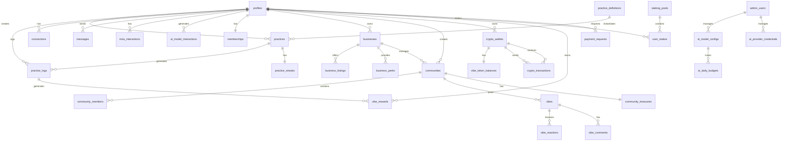

# Data Models - Complete Database Schema

**Version**: 1.0.0  
**Last Updated**: December 16, 2025

---

## Overview

Complete PostgreSQL schema for the VIBEUP platform. All tables have Row Level Security (RLS) enabled for data access control.

**Brand Considerations**: Fields storing user-facing content (practice descriptions, community names, business descriptions) should follow [brand voice guidelines](../brand/03-brand-voice-messaging.md). Default values and enums use brand-aligned language.

---

## Schema Organization

```
Database: vibeup_production
├── public schema (application tables)
├── auth schema (Supabase managed)
└── storage schema (Supabase managed)

Tables by Domain:
├── User Domain (8 tables)
├── Crypto Domain (8 tables) ⭐ NEW - Epic 1A
├── Practice Domain (6 tables)
├── Social Domain (5 tables)
├── Business Domain (6 tables)
├── Community Domain (5 tables)
├── Impact Domain (4 tables)
├── Monetization Domain (4 tables)
├── System Domain (5 tables)
└── AI Router Domain (5 tables)

Total: 56 tables
```

---

## Complete Schema

See individual epic documents for detailed table definitions:

- Epic 0: `profiles`, `feature_flags`, `admin_users`, `analytics_events`
- **Epic 1A (Crypto)**: `crypto_wallets`, `crypto_transactions`, `vibe_token_balances`, `payment_requests`, `vibe_rewards`, `staking_pools`, `user_stakes`, `community_treasuries`
- Epic 1: `mira_interactions`, `onboarding_state`, `mira_prompts`
- Epic 2: `profile_attributes`, `chemistry_assessments`, `connections`, `profile_views`
- Epic 3: `practice_definitions`, `practices`, `practice_logs`, `practice_streaks`, `affirmations`, `community_journeys`, `journey_participants`
- Epic 4: `messages`, `notifications`, `discovery_recommendations`, `search_queries`
- Epic 5: `impact_features`, `impact_initiatives`, `impact_votes`, `impact_comments`
- Epic 6: `businesses`, `business_listings`, `business_perks`, `practice_stacks`, `business_verification`
- Epic 7: `communities`, `community_members`, `vibes`, `vibe_reactions`, `vibe_comments`
- Epic 8: `memberships`, `affiliate_codes`, `affiliate_referrals`, `perk_redemptions`
- AI Router: `ai_model_interactions`, `ai_model_configs`, `ai_provider_credentials`, `ai_daily_budgets`, `ai_cache_entries`

---

## Crypto Domain Tables (Epic 1A)

### `crypto_wallets`
Stores user wallet information with hybrid custodial support.

```sql
CREATE TABLE crypto_wallets (
    id UUID PRIMARY KEY DEFAULT gen_random_uuid(),
    user_id UUID NOT NULL REFERENCES profiles(id) ON DELETE CASCADE,
    handle VARCHAR(50) UNIQUE NOT NULL,  -- @handle for P2P payments
    wallet_address VARCHAR(100) NOT NULL,
    chain VARCHAR(20) NOT NULL DEFAULT 'base',  -- base, solana, polygon
    wallet_type VARCHAR(20) NOT NULL DEFAULT 'custodial',  -- custodial, hybrid, self_custody
    encrypted_key_share TEXT,  -- MPC key share (encrypted)
    is_primary BOOLEAN DEFAULT true,
    created_at TIMESTAMPTZ DEFAULT NOW(),
    updated_at TIMESTAMPTZ DEFAULT NOW(),
    
    CONSTRAINT unique_user_primary UNIQUE (user_id, is_primary) WHERE is_primary = true
);

CREATE INDEX idx_wallets_user ON crypto_wallets(user_id);
CREATE INDEX idx_wallets_handle ON crypto_wallets(handle);
CREATE INDEX idx_wallets_address ON crypto_wallets(wallet_address);
```

### `crypto_transactions`
Immutable log of all crypto transactions.

```sql
CREATE TABLE crypto_transactions (
    id UUID PRIMARY KEY DEFAULT gen_random_uuid(),
    from_wallet_id UUID REFERENCES crypto_wallets(id),
    to_wallet_id UUID REFERENCES crypto_wallets(id),
    from_address VARCHAR(100),
    to_address VARCHAR(100),
    amount DECIMAL(20, 8) NOT NULL,
    token VARCHAR(20) NOT NULL,  -- USDC, VIBES, ETH
    chain VARCHAR(20) NOT NULL,
    tx_hash VARCHAR(100),
    status VARCHAR(20) NOT NULL DEFAULT 'pending',  -- pending, confirmed, failed
    type VARCHAR(30) NOT NULL,  -- transfer, reward, stake, unstake, tip, payment
    metadata JSONB DEFAULT '{}',  -- source context (practice_id, message_id, etc.)
    created_at TIMESTAMPTZ DEFAULT NOW(),
    confirmed_at TIMESTAMPTZ,
    
    CONSTRAINT valid_status CHECK (status IN ('pending', 'confirmed', 'failed')),
    CONSTRAINT valid_type CHECK (type IN ('transfer', 'reward', 'stake', 'unstake', 'tip', 'payment', 'withdrawal', 'deposit'))
);

CREATE INDEX idx_transactions_from ON crypto_transactions(from_wallet_id);
CREATE INDEX idx_transactions_to ON crypto_transactions(to_wallet_id);
CREATE INDEX idx_transactions_status ON crypto_transactions(status);
CREATE INDEX idx_transactions_created ON crypto_transactions(created_at DESC);
```

### `vibe_token_balances`
Current VIBES token balances (optimized for reads).

```sql
CREATE TABLE vibe_token_balances (
    id UUID PRIMARY KEY DEFAULT gen_random_uuid(),
    wallet_id UUID NOT NULL REFERENCES crypto_wallets(id) ON DELETE CASCADE,
    available_balance DECIMAL(20, 8) NOT NULL DEFAULT 0,
    staked_balance DECIMAL(20, 8) NOT NULL DEFAULT 0,
    pending_rewards DECIMAL(20, 8) NOT NULL DEFAULT 0,
    lifetime_earned DECIMAL(20, 8) NOT NULL DEFAULT 0,
    updated_at TIMESTAMPTZ DEFAULT NOW(),
    
    CONSTRAINT unique_wallet_balance UNIQUE (wallet_id),
    CONSTRAINT non_negative_balance CHECK (available_balance >= 0 AND staked_balance >= 0)
);

CREATE INDEX idx_balances_wallet ON vibe_token_balances(wallet_id);
```

### `payment_requests`
P2P payment requests within conversations.

```sql
CREATE TABLE payment_requests (
    id UUID PRIMARY KEY DEFAULT gen_random_uuid(),
    requester_id UUID NOT NULL REFERENCES profiles(id),
    payer_id UUID NOT NULL REFERENCES profiles(id),
    amount DECIMAL(20, 8) NOT NULL,
    token VARCHAR(20) NOT NULL DEFAULT 'USDC',
    message_id UUID REFERENCES messages(id),
    note TEXT,
    status VARCHAR(20) NOT NULL DEFAULT 'pending',  -- pending, paid, declined, expired
    paid_transaction_id UUID REFERENCES crypto_transactions(id),
    expires_at TIMESTAMPTZ DEFAULT (NOW() + INTERVAL '7 days'),
    created_at TIMESTAMPTZ DEFAULT NOW(),
    resolved_at TIMESTAMPTZ,
    
    CONSTRAINT valid_request_status CHECK (status IN ('pending', 'paid', 'declined', 'expired'))
);

CREATE INDEX idx_requests_requester ON payment_requests(requester_id);
CREATE INDEX idx_requests_payer ON payment_requests(payer_id);
CREATE INDEX idx_requests_status ON payment_requests(status);
```

### `vibe_rewards`
Tracks VIBES token rewards with source attribution.

```sql
CREATE TABLE vibe_rewards (
    id UUID PRIMARY KEY DEFAULT gen_random_uuid(),
    user_id UUID NOT NULL REFERENCES profiles(id),
    wallet_id UUID NOT NULL REFERENCES crypto_wallets(id),
    amount DECIMAL(20, 8) NOT NULL,
    reward_type VARCHAR(30) NOT NULL,  -- practice, streak, achievement, referral, community
    source_id UUID,  -- practice_log_id, streak_id, etc.
    source_type VARCHAR(30),  -- practice_log, streak, achievement, referral
    multiplier DECIMAL(4, 2) DEFAULT 1.0,  -- streak multipliers
    transaction_id UUID REFERENCES crypto_transactions(id),
    metadata JSONB DEFAULT '{}',
    created_at TIMESTAMPTZ DEFAULT NOW(),
    
    CONSTRAINT valid_reward_type CHECK (reward_type IN ('practice', 'streak', 'achievement', 'referral', 'community', 'bonus'))
);

CREATE INDEX idx_rewards_user ON vibe_rewards(user_id);
CREATE INDEX idx_rewards_type ON vibe_rewards(reward_type);
CREATE INDEX idx_rewards_created ON vibe_rewards(created_at DESC);
```

### `staking_pools`
Defines available staking pools and their benefits.

```sql
CREATE TABLE staking_pools (
    id UUID PRIMARY KEY DEFAULT gen_random_uuid(),
    name VARCHAR(100) NOT NULL,
    description TEXT,
    min_stake DECIMAL(20, 8) NOT NULL,
    apy_rate DECIMAL(6, 4) NOT NULL,  -- Annual Percentage Yield
    lock_period_days INTEGER NOT NULL DEFAULT 0,
    benefits JSONB NOT NULL DEFAULT '[]',  -- premium features unlocked
    is_active BOOLEAN DEFAULT true,
    created_at TIMESTAMPTZ DEFAULT NOW(),
    updated_at TIMESTAMPTZ DEFAULT NOW()
);

-- Seed default pools
INSERT INTO staking_pools (name, description, min_stake, apy_rate, lock_period_days, benefits) VALUES
('Explorer', 'Basic staking for early adopters', 100, 0.05, 0, '["priority_support"]'),
('Pathfinder', 'Committed stakers with premium access', 500, 0.08, 30, '["premium_features", "2x_vote_weight"]'),
('Founder', 'Founding members with maximum benefits', 2000, 0.12, 90, '["all_features", "3x_vote_weight", "founder_badge"]');
```

### `user_stakes`
Tracks individual user stakes in pools.

```sql
CREATE TABLE user_stakes (
    id UUID PRIMARY KEY DEFAULT gen_random_uuid(),
    user_id UUID NOT NULL REFERENCES profiles(id),
    wallet_id UUID NOT NULL REFERENCES crypto_wallets(id),
    pool_id UUID NOT NULL REFERENCES staking_pools(id),
    staked_amount DECIMAL(20, 8) NOT NULL,
    rewards_earned DECIMAL(20, 8) DEFAULT 0,
    staked_at TIMESTAMPTZ DEFAULT NOW(),
    unlock_at TIMESTAMPTZ,
    unstaked_at TIMESTAMPTZ,
    status VARCHAR(20) NOT NULL DEFAULT 'active',  -- active, unlocking, unstaked
    
    CONSTRAINT valid_stake_status CHECK (status IN ('active', 'unlocking', 'unstaked'))
);

CREATE INDEX idx_stakes_user ON user_stakes(user_id);
CREATE INDEX idx_stakes_pool ON user_stakes(pool_id);
CREATE INDEX idx_stakes_status ON user_stakes(status);
```

### `community_treasuries`
Shared wallets for community financial operations.

```sql
CREATE TABLE community_treasuries (
    id UUID PRIMARY KEY DEFAULT gen_random_uuid(),
    community_id UUID NOT NULL REFERENCES communities(id) ON DELETE CASCADE,
    wallet_id UUID NOT NULL REFERENCES crypto_wallets(id),
    name VARCHAR(100) NOT NULL,
    description TEXT,
    total_balance DECIMAL(20, 8) DEFAULT 0,
    spending_limit_daily DECIMAL(20, 8),
    requires_multisig BOOLEAN DEFAULT false,
    signers JSONB DEFAULT '[]',  -- user_ids who can approve
    approval_threshold INTEGER DEFAULT 1,  -- number of signatures needed
    created_at TIMESTAMPTZ DEFAULT NOW(),
    updated_at TIMESTAMPTZ DEFAULT NOW(),
    
    CONSTRAINT unique_community_treasury UNIQUE (community_id)
);

CREATE INDEX idx_treasuries_community ON community_treasuries(community_id);
```

---

## Entity Relationships



---

## Indexes Strategy

All foreign keys indexed for join performance. Frequently queried columns have dedicated indexes. Timestamp columns indexed DESC for recent-first queries.

---

## Migration Strategy

Migrations stored in `/database/migrations/` with timestamp prefixes:
- Format: `YYYYMMDDHHMMSS_migration_name.sql`
- Up and down migrations for every change
- Test rollback before deploying
- No breaking changes without migration path

---

**Related**: 
- All epic documents contain detailed schema for their tables
- AI Router tables detailed in [`ai-model-router.md`](ai-model-router.md)
- Crypto domain tables detailed in [`crypto-router.md`](crypto-router.md)
- VIBES token economics in [`vibe-tokenomics.md`](vibe-tokenomics.md)
- Epic 1A specification in [`epic-1a-crypto.md`](../epics/epic-1a-crypto.md)

