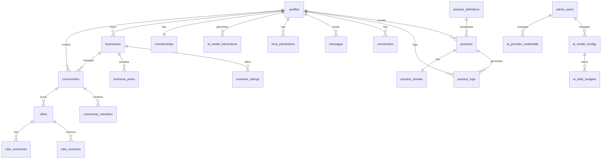

# Data Models - Complete Database Schema

**Version**: 1.0.0  
**Last Updated**: December 16, 2025

---

## Overview

Complete PostgreSQL schema for the VIBEUP platform. All tables have Row Level Security (RLS) enabled for data access control.

**Brand Considerations**: Fields storing user-facing content (practice descriptions, community names, business descriptions) should follow [brand voice guidelines](../brand/03-brand-voice-messaging.md). Default values and enums use brand-aligned language.

---

## Schema Organization

```
Database: vibeup_production
├── public schema (application tables)
├── auth schema (Supabase managed)
└── storage schema (Supabase managed)

Tables by Domain:
├── User Domain (8 tables)
├── Practice Domain (6 tables)
├── Social Domain (5 tables)
├── Business Domain (6 tables)
├── Community Domain (5 tables)
├── Impact Domain (4 tables)
├── Monetization Domain (4 tables)
├── System Domain (5 tables)
└── AI Router Domain (5 tables)

Total: 48 tables
```

---

## Complete Schema

See individual epic documents for detailed table definitions:

- Epic 0: `profiles`, `feature_flags`, `admin_users`, `analytics_events`
- Epic 1: `mira_interactions`, `onboarding_state`, `mira_prompts`
- Epic 2: `profile_attributes`, `chemistry_assessments`, `connections`, `profile_views`
- Epic 3: `practice_definitions`, `practices`, `practice_logs`, `practice_streaks`, `affirmations`, `community_journeys`, `journey_participants`
- Epic 4: `messages`, `notifications`, `discovery_recommendations`, `search_queries`
- Epic 5: `impact_features`, `impact_initiatives`, `impact_votes`, `impact_comments`
- Epic 6: `businesses`, `business_listings`, `business_perks`, `practice_stacks`, `business_verification`
- Epic 7: `communities`, `community_members`, `vibes`, `vibe_reactions`, `vibe_comments`
- Epic 8: `memberships`, `affiliate_codes`, `affiliate_referrals`, `perk_redemptions`
- AI Router: `ai_model_interactions`, `ai_model_configs`, `ai_provider_credentials`, `ai_daily_budgets`, `ai_cache_entries`

---

## Entity Relationships



---

## Indexes Strategy

All foreign keys indexed for join performance. Frequently queried columns have dedicated indexes. Timestamp columns indexed DESC for recent-first queries.

---

## Migration Strategy

Migrations stored in `/database/migrations/` with timestamp prefixes:
- Format: `YYYYMMDDHHMMSS_migration_name.sql`
- Up and down migrations for every change
- Test rollback before deploying
- No breaking changes without migration path

---

**Related**: 
- All epic documents contain detailed schema for their tables
- AI Router tables detailed in [`ai-model-router.md`](ai-model-router.md)

