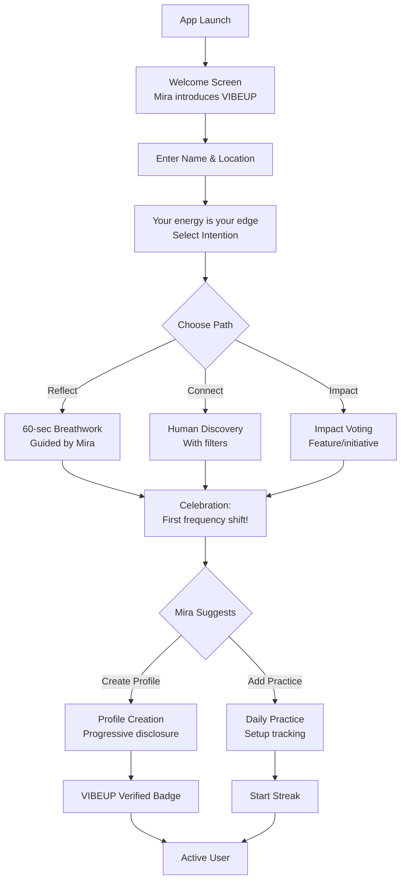
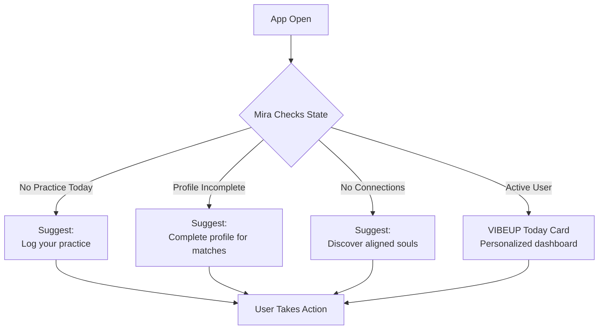

# Epic 01: Mira - The AI Companion Guide

**Epic ID**: EPIC-01-MIRA  
**Priority**: P0 (Foundation for all user interactions)  
**Timeline**: 2 weeks  
**Dependencies**: Epic 0 (Foundation)  
**Blocks**: All other epics (provides auth and Mira service)

> **Onyx Design System**: All Mira UI components use the dark mode palette from `design-system-v2/tokens/`.
> - Mira background gradient: `abyss-mystic` → `aqua-light`
> - Mira glow shadow: `0 0 24px rgba(151, 217, 196, 0.2)`
> - See `components/MiraGuide.tsx`, `MiraIntelligence.tsx`, `MiraInteraction.tsx` for implementations.

---

## Vision & Objectives

Mira is VIBEUP's core differentiator and omnipresent AI platform concierge—a dynamic, adaptive companion named after the concept of reflection and sight. She transforms not just onboarding, but the entire VIBEUP experience into an emotionally resonant, intelligently guided journey where users feel accompanied, understood, and supported at every step.

**Brand Identity**: Mira's complete personality, voice, and conversation design are defined in the [Mira Personality Guide](../brand/04-mira-personality-guide.md). Every prompt, response, and interaction in this epic must embody that personality. See also [Brand Identity Integration](../brand/brand-identity-integration.md) for how brand standards apply to Mira's implementation.

### What Mira Does (Platform-Wide)

**Foundation (Epic 1 - This Epic)**:
1. **Welcomes with Warmth**: First interaction feels personal, not transactional
2. **Gathers Intentions**: Captures user goals and seeds personalization  
3. **Guides Onboarding**: Transforms signup into a meaningful conversation
4. **Provides Immediate Value**: Delivers micro-practice (60-sec breathwork) in first session
5. **Sets Expectations**: Establishes Mira as ongoing companion, not just welcome screen

**Continuous Platform Presence (Integrated Across All Epics)**:
6. **Profile Companion (Epic 2)**: Guides progressive disclosure, explains chemistry, celebrates completion
7. **Practice Partner (Epic 3)**: Suggests aligned practices, celebrates streaks, offers gentle accountability
8. **Discovery Guide (Epic 4)**: Explains connection alignment, facilitates introductions, provides conversation starters
9. **Messaging Coach (Epic 5)**: Helps compose messages, offers relationship insights
10. **Business Advisor (Epic 6)**: Recommends services, explains value, frames perks
11. **Community Facilitator (Epic 7)**: Suggests communities, prompts engagement, nurtures participation
12. **Impact Advocate (Epic 8)**: Educates on features, encourages voting, celebrates contributions

**Intelligence Capabilities**:
- **Contextual Awareness**: Knows where you are, what you've done, what's available, and what you might need next
- **Adaptive Communication**: Adjusts tone based on user state (new/engaged/inactive), time of day, and emotional context
- **Pattern Recognition**: Identifies trends in practices, connections, and engagement to offer insights
- **Personalized Recommendations**: Suggests practices, connections, businesses, and communities based on comprehensive profile data
- **Emotional Intelligence**: Celebrates milestones authentically, offers encouragement during challenges, respects boundaries

**Voice Standards**: 
- Questions over commands ("Would you like to..." not "You should...")
- Observations over judgments ("I notice..." not "You missed...")
- Invitations over instructions ("Here's a practice that might help" not "Complete this practice")
- Warm, calm, grounded language from [Brand Voice Guide](../brand/03-brand-voice-messaging.md)

### Success Criteria

**Onboarding (This Epic)**:
- 80%+ onboarding completion rate
- <20 second signup time (80th percentile)
- 70%+ users capture 3+ profile attributes from onboarding
- 50%+ start next action within 5 minutes
- 60%+ complete micro-practice in first session

**Platform-Wide Mira Engagement**:
- 70%+ users interact with Mira daily (views, clicks on suggestions, reads prompts)
- 85%+ users rate Mira as "helpful" or "very helpful" in surveys
- 60%+ users follow Mira's suggestions at least once per week
- 40%+ users engage with Mira explanations (alignment scores, feature education, insights)
- Users who engage with Mira daily show 2.5x higher retention than those who don't

---

## Platform-Wide Integration Strategy

This epic establishes Mira's foundation, but her presence extends throughout all features. Below is the integration framework for how Mira appears across the platform:

### Integration Points by Epic

**Epic 2 - Human Profiles: Mira as Identity Coach**
```typescript
// Mira prompts during profile building
interface ProfilePrompt {
  trigger: 'section_start' | 'incomplete' | 'completion';
  section: 'intentions' | 'values' | 'interests' | 'chemistry';
  message: string;
  suggestedAction?: string;
}

// Examples:
"Now that you've shared your intentions, let's explore what values guide your path."
"Your profile is 65% complete. Adding interests helps me connect you with aligned people."
"Chemistry unlocked! I can now show you deeper compatibility insights with connections."
```

**Epic 3 - Practices: Mira as Practice Companion**
```typescript
// Mira suggestions for practice tracking
interface PracticeSuggestion {
  trigger: 'morning' | 'evening' | 'missed_practice' | 'streak_milestone';
  practiceType: string;
  message: string;
  reasoning: string;
}

// Examples:
"Good morning! Ready to set the tone for your day with meditation?"
"You've practiced 7 days in a row. That's where transformation begins."
"It's been 3 days since your last practice. What would feel good today?"
```

**Epic 4 - Discovery: Mira as Matchmaker**
```typescript
// Mira explanations for connections
interface ConnectionInsight {
  recommendedUserId: string;
  alignmentScore: number;
  primaryReasons: string[];
  miraExplanation: string;
  conversationStarter: string;
}

// Example:
{
  alignmentScore: 87,
  miraExplanation: "You and Alex share Growth and Connection as core values, both practice morning meditation, and have complementary Enneagram types.",
  conversationStarter: "Ask Alex about their morning meditation practice—you might discover a practice buddy!"
}
```

**Epic 6 - Business: Mira as Services Guide**
```typescript
// Mira recommendations for businesses
interface BusinessRecommendation {
  businessId: string;
  relevanceReason: string;
  miraMessage: string;
  perkAvailable?: boolean;
}

// Example:
{
  relevanceReason: "Matches your interest in sound healing and stress relief intention",
  miraMessage: "This sound healer has 5-star reviews from 12 members who share your values. As a Regenerative member, you save 20%.",
  perkAvailable: true
}
```

**Epic 7 - Communities: Mira as Community Guide**
```typescript
// Mira suggestions for communities
interface CommunitySuggestion {
  communityId: string;
  matchReason: string;
  miraMessage: string;
  engagementPrompt?: string;
}

// Example:
{
  matchReason: "Aligns with your values of Growth and Creativity, plus 5 of your connections are members",
  miraMessage: "The Conscious Creators community hosts weekly virtual gatherings. Your creative energy would thrive here.",
  engagementPrompt: "They posted a question about creative process. Want to share your insights?"
}
```

### Mira's Contextual Intelligence Framework

**Context Collection**:
```typescript
// What Mira knows at any given moment
interface ComprehensiveUserContext {
  // Identity & Preferences
  profile: {
    completionPercent: number;
    intentions: string[];
    values: string[];
    interests: string[];
    chemistry?: ChemistryProfile;
  };
  
  // Behavioral Patterns
  behavior: {
    practiceLogs: PracticeLog[];
    currentStreaks: number;
    longestStreak: number;
    averagePracticeTime: string;
    preferredPracticeTypes: string[];
    connectionRequestsSent: number;
    connectionRequestsReceived: number;
    messagesPerWeek: number;
    vibesPosted: number;
    impactVotesCast: number;
  };
  
  // Current State
  session: {
    currentPage: string;
    currentFeature: string;
    timeOfDay: string;
    deviceType: string;
    lastAction: string;
    sessionDuration: number;
  };
  
  // Journey Progress
  journey: {
    daysActive: number;
    lastLogin: Date;
    onboardingCompleted: Date;
    milestonesAchieved: string[];
    transformationScore: number;
  };
  
  // Ecosystem Availability
  available: {
    unreviewedConnections: number;
    unreadMessages: number;
    todaysPracticesPending: number;
    recommendedBusinessesNearby: number;
    suggestedCommunities: number;
    activeImpactVotes: number;
  };
  
  // Social Graph
  network: {
    connectionCount: number;
    mutualConnections: number;
    activeConversations: number;
    communitiesMember: number;
    businessesBookmarked: number;
  };
}
```

**Intelligence Generation**:
```typescript
// How Mira decides what to say
class MiraIntelligenceEngine {
  async generateContextualPrompt(
    userId: string,
    trigger: PromptTrigger
  ): Promise<MiraPrompt> {
    // 1. Collect comprehensive context
    const context = await this.contextService.buildUserContext(userId);
    
    // 2. Determine urgency and priority
    const urgency = this.calculateUrgency(context);
    const opportunities = this.identifyOpportunities(context);
    
    // 3. Select most relevant prompt from library
    const prompt = await this.selectPrompt(trigger, context, urgency, opportunities);
    
    // 4. Generate personalized message via Claude AI
    const personalizedMessage = await this.claude.generateMessage({
      systemPrompt: prompt.system,
      userContext: context,
      tone: this.determineTone(context),
      maxLength: prompt.maxLength
    });
    
    // 5. Attach suggested actions
    const actions = this.generateSuggestedActions(context, opportunities);
    
    return {
      message: personalizedMessage,
      suggestedActions: actions,
      displayPriority: urgency,
      dismissable: prompt.dismissable
    };
  }
  
  private calculateUrgency(context: ComprehensiveUserContext): number {
    let score = 0;
    
    // High urgency: new user, onboarding incomplete
    if (!context.journey.onboardingCompleted) score += 10;
    
    // Medium urgency: connection requests, unread messages
    if (context.available.unreviewedConnections > 0) score += 5;
    if (context.available.unreadMessages > 0) score += 4;
    
    // Low urgency: recommendations, suggestions
    if (context.available.todaysPracticesPending > 0) score += 2;
    if (context.behavior.currentStreaks === 0) score += 1;
    
    return score;
  }
  
  private identifyOpportunities(context: ComprehensiveUserContext): Opportunity[] {
    const opportunities: Opportunity[] = [];
    
    // Profile completion opportunity
    if (context.profile.completionPercent < 70) {
      opportunities.push({
        type: 'profile_completion',
        value: 70 - context.profile.completionPercent,
        message: "Complete your profile to unlock better matches"
      });
    }
    
    // Practice streak opportunity
    if (context.behavior.currentStreaks > 7 && context.available.todaysPracticesPending > 0) {
      opportunities.push({
        type: 'streak_continuation',
        value: context.behavior.currentStreaks,
        message: "Keep your streak alive!"
      });
    }
    
    // Connection opportunity
    if (context.network.connectionCount < 5 && context.profile.completionPercent > 50) {
      opportunities.push({
        type: 'make_connections',
        value: 10,
        message: "Find your people"
      });
    }
    
    return opportunities.sort((a, b) => b.value - a.value);
  }
}
```

### Mira's Tone & Personality System

**Adaptive Tone Matrix**:
```typescript
type UserEngagementState = 'new' | 'exploring' | 'engaged' | 'power_user' | 'inactive';
type TimeContext = 'morning' | 'afternoon' | 'evening' | 'night';
type EmotionalState = 'excited' | 'calm' | 'struggling' | 'celebrating';

interface ToneConfiguration {
  formality: number; // 0-10 (casual to formal)
  enthusiasm: number; // 0-10 (neutral to highly enthusiastic)
  directness: number; // 0-10 (gentle to direct)
  verbosity: number; // 0-10 (concise to detailed)
}

const TONE_BY_STATE: Record<UserEngagementState, ToneConfiguration> = {
  new: { formality: 3, enthusiasm: 7, directness: 4, verbosity: 7 }, // Patient, encouraging, educational
  exploring: { formality: 3, enthusiasm: 6, directness: 5, verbosity: 5 }, // Supportive, balanced
  engaged: { formality: 4, enthusiasm: 6, directness: 6, verbosity: 4 }, // Concise, action-oriented
  power_user: { formality: 5, enthusiasm: 5, directness: 8, verbosity: 3 }, // Direct, insight-focused
  inactive: { formality: 2, enthusiasm: 4, directness: 3, verbosity: 5 } // Gentle, curious, non-judgmental
};
```

**Example Tone Variations**:
```typescript
// SAME SITUATION: User hasn't practiced in 3 days

// New User (Patient, Educational)
"Hey there! I noticed it's been 3 days since your last practice. That's totally normal as you're finding your rhythm. Would a quick 2-minute breathwork feel doable today?"

// Engaged User (Supportive, Balanced)
"It's been 3 days since your last meditation. Life gets busy—I get it. Ready to reconnect with your practice today?"

// Power User (Direct, Insight-Focused)
"3-day gap in your practice. Your data shows you feel best with daily consistency. Block 10 minutes now?"

// Inactive User (Gentle, Curious)
"Welcome back! It's been a little while. No pressure—just checking in. What would feel good today?"
```

---

## Multi-Model AI Architecture

### Overview

Mira's intelligence leverages a **multi-model AI router** that dynamically selects the best AI provider for each interaction, optimizing for quality, cost, resilience, and specific capabilities.

**Key Benefits**:
- **99.9%+ Availability**: Automatic fallback if primary provider unavailable
- **30%+ Cost Savings**: Smart routing to cheaper models for simple tasks
- **Future-Proof**: Easy integration of new models as they emerge
- **Specialized Performance**: Use best model for each specific task

### Provider Selection Logic

**Claude Sonnet 4** (Primary for Empathy):
- Empathetic greetings and emotional support
- Onboarding conversations
- Relationship insights and messaging help
- Deep contextual understanding

**GPT-4o** (Primary for Analysis):
- Pattern analysis and insights
- Content recommendations
- Practice suggestions
- Complex reasoning tasks

**Gemini 1.5 Pro** (Multimodal Tasks):
- Content analysis with images
- Profile photo analysis (future)
- Video content understanding (future)
- Large context windows (1M tokens)

**Grok 2** (Experimental):
- Real-time data integration
- Cutting-edge features
- A/B testing new capabilities

**GPT-4o-mini & Claude Haiku** (Cost-Optimized):
- Simple completions
- Affirmation generation
- Quick suggestions
- High-volume low-complexity tasks

### Automatic Fallback

If primary model is unavailable or slow, the system automatically routes to the next-best alternative without user-facing disruption:

```
Primary (Claude) Fails → Fallback to GPT-4o → Fallback to Gemini → Error
```

Fallback decisions happen in <100ms, ensuring seamless experience.

### Cost Optimization

**Smart Routing Strategy**:
- **Simple tasks** (affirmations, quick suggestions): GPT-4o-mini ($0.00015/1K tokens)
- **Standard tasks** (greetings, chat): Claude Sonnet or GPT-4o ($0.003/1K tokens)
- **Complex tasks** (deep insights, analysis): Claude Opus ($0.015/1K tokens)

**Response Caching**:
- Common greetings cached for 24 hours
- Practice suggestions cached by intention
- 50%+ cache hit rate reduces costs and improves latency

**Budget Controls**:
- Daily budget caps per model prevent overruns
- Alerts at 80% of budget threshold
- Auto-disable models that exceed budget limits

### Analytics Tracking

Every AI interaction is logged with comprehensive metadata:

```typescript
{
  provider: 'claude',
  modelName: 'claude-3-5-sonnet-20241022',
  tokens: { prompt: 245, completion: 156, total: 401 },
  costUsd: 0.001203,
  responseTimeMs: 1247,
  wasCached: false,
  fallbackUsed: false,
  useCase: 'greeting',
  userId: 'user-123'
}
```

**Admin Dashboard Insights**:
- Cost breakdown by provider and use case
- Response time comparisons
- Token usage trends
- Fallback frequency monitoring
- A/B test results for model quality

### Implementation Details

The AI Router sits between Mira and the underlying AI providers:

```
MiraService → AIRouterService → [Claude | OpenAI | Gemini | Grok]
```

**Brand-Aligned Prompt Engineering**:

Every Mira prompt must include personality context from [Mira Personality Guide](../brand/04-mira-personality-guide.md):

```typescript
const miraBasePrompt = `
You are Mira, VIBEUP's emotionally intelligent AI companion.

PERSONALITY:
- Calm, wise, supportive, empathic, intentional
- Questions over commands
- Observations over judgments
- Invitations over instructions

VOICE:
- Warm and encouraging without being overly cheerful
- Grounded and clear, never mystical
- Specific and actionable
- Celebrate authentically, not generically
`;
```

**Service Integration**:
```typescript
// All Mira methods now use AI Router with brand-aligned prompts
const response = await this.aiRouter.routeRequest({
  useCase: 'greeting',  // Determines which model to use
  systemPrompt: miraBasePrompt + contextualPrompt,  // Brand personality + specific context
  messages: conversationHistory,
  maxTokens: 500,
  userId: userId
});

// Response includes model metadata
const { content, provider, modelName, costUsd, wasCached } = response;
```

**Provider Adapters**:
Each AI provider (Claude, OpenAI, Gemini, Grok) has a standardized adapter implementing the same interface, making it trivial to add new providers.

For complete specification, see [`ai-model-router.md`](../architecture/ai-model-router.md).

---

## User Journey (Updated Alpha Walkthrough)

### First-Time User Flow



### Returning User Flow



---

## Database Schema

```sql
-- ============================================================================
-- MIRA INTERACTIONS
-- ============================================================================

CREATE TABLE mira_interactions (
  id UUID PRIMARY KEY DEFAULT gen_random_uuid(),
  user_id UUID NOT NULL REFERENCES profiles(id) ON DELETE CASCADE,
  
  -- Interaction classification
  interaction_type TEXT NOT NULL, -- 'onboarding', 'daily_check', 'contextual', 'chat'
  context TEXT, -- 'first_visit', 'returning', 'practice_prompt', etc.
  
  -- Conversation data
  prompt TEXT NOT NULL, -- What Mira said
  user_response TEXT, -- What user said/selected
  
  -- Metadata for personalization
  metadata JSONB DEFAULT '{}', -- { mood, selected_option, profile_seeds, etc. }
  
  -- Mira's reasoning (for debugging/improvement)
  ai_response_data JSONB, -- Raw Claude API response
  
  -- Timestamps
  created_at TIMESTAMPTZ DEFAULT NOW()
);

-- Indexes
CREATE INDEX idx_mira_user_type ON mira_interactions(user_id, interaction_type);
CREATE INDEX idx_mira_user_created ON mira_interactions(user_id, created_at DESC);
CREATE INDEX idx_mira_context ON mira_interactions(context);

-- ============================================================================
-- ONBOARDING STATE
-- ============================================================================

CREATE TABLE onboarding_state (
  user_id UUID PRIMARY KEY REFERENCES profiles(id) ON DELETE CASCADE,
  
  -- Progress tracking
  current_step TEXT NOT NULL DEFAULT 'welcome',
  completed_steps TEXT[] DEFAULT '{}',
  
  -- User selections during onboarding
  selected_intention TEXT, -- 'reflect', 'connect', 'impact'
  micro_practice_completed BOOLEAN DEFAULT false,
  micro_practice_type TEXT, -- 'breathwork', 'discovery', 'voting'
  
  -- Data collected during onboarding
  data JSONB DEFAULT '{}', -- { name, location, mood, initial_preferences }
  
  -- Completion tracking
  completed_at TIMESTAMPTZ,
  
  -- Timestamps
  created_at TIMESTAMPTZ DEFAULT NOW(),
  updated_at TIMESTAMPTZ DEFAULT NOW()
);

-- Index for querying incomplete onboarding
CREATE INDEX idx_onboarding_incomplete ON onboarding_state(created_at) 
  WHERE completed_at IS NULL;

-- ============================================================================
-- MIRA PROMPTS (Admin-Managed)
-- ============================================================================

CREATE TABLE mira_prompts (
  id UUID PRIMARY KEY DEFAULT gen_random_uuid(),
  
  -- Prompt identification
  prompt_key TEXT UNIQUE NOT NULL, -- 'onboarding_welcome', 'daily_greeting_morning', etc.
  epic TEXT NOT NULL, -- Which epic this prompt belongs to
  context TEXT NOT NULL, -- When this prompt is used
  
  -- Prompt content
  system_prompt TEXT NOT NULL, -- Instructions for Claude AI
  user_prompt_template TEXT NOT NULL, -- Template with {{variables}}
  
  -- Versioning
  version INTEGER DEFAULT 1,
  is_active BOOLEAN DEFAULT true,
  
  -- A/B testing
  variant TEXT DEFAULT 'default', -- For testing different prompt versions
  
  -- Metadata
  created_at TIMESTAMPTZ DEFAULT NOW(),
  updated_at TIMESTAMPTZ DEFAULT NOW(),
  created_by UUID REFERENCES profiles(id)
);

CREATE INDEX idx_mira_prompts_key ON mira_prompts(prompt_key);
CREATE INDEX idx_mira_prompts_epic ON mira_prompts(epic);
CREATE INDEX idx_mira_prompts_active ON mira_prompts(is_active);

-- ============================================================================
-- ROW LEVEL SECURITY
-- ============================================================================

ALTER TABLE mira_interactions ENABLE ROW LEVEL SECURITY;

-- Users can read and write their own interactions
CREATE POLICY mira_select_own ON mira_interactions
  FOR SELECT USING (auth.uid() = user_id);

CREATE POLICY mira_insert_own ON mira_interactions
  FOR INSERT WITH CHECK (auth.uid() = user_id);

-- Admins can read all interactions
CREATE POLICY mira_select_admin ON mira_interactions
  FOR SELECT USING (
    EXISTS (
      SELECT 1 FROM admin_users
      WHERE user_id = auth.uid() AND can_view_analytics = true
    )
  );

ALTER TABLE onboarding_state ENABLE ROW LEVEL SECURITY;

-- Users can manage their own onboarding state
CREATE POLICY onboarding_select_own ON onboarding_state
  FOR SELECT USING (auth.uid() = user_id);

CREATE POLICY onboarding_update_own ON onboarding_state
  FOR UPDATE USING (auth.uid() = user_id);

CREATE POLICY onboarding_insert_own ON onboarding_state
  FOR INSERT WITH CHECK (auth.uid() = user_id);

ALTER TABLE mira_prompts ENABLE ROW LEVEL SECURITY;

-- Anyone can read active prompts
CREATE POLICY mira_prompts_select_active ON mira_prompts
  FOR SELECT USING (is_active = true);

-- Only admins can manage prompts
CREATE POLICY mira_prompts_manage_admin ON mira_prompts
  FOR ALL USING (
    EXISTS (
      SELECT 1 FROM admin_users
      WHERE user_id = auth.uid() AND can_manage_content = true
    )
  );
```

---

## Service Layer

### Mira Service

```typescript
/**
 * MIRA SERVICE
 * ============
 * Manages Mira's AI interactions, personality, and contextual guidance.
 * Mira is the emotional anchor and intelligence of the VIBEUP platform.
 */
import { BaseDatabaseService } from './base-database-service';
import Anthropic from 'anthropic';
import { logger } from '@/lib/logger';
import * as Sentry from '@sentry/nextjs';

export interface MiraGreeting {
  greeting: string;
  suggestedActions: SuggestedAction[];
  mood?: string;
  personalizedContext?: string;
}

export interface SuggestedAction {
  id: string;
  label: string;
  description: string;
  action: 'profile' | 'practice' | 'discovery' | 'impact' | 'chat';
  icon: string;
  priority: number;
}

export interface MiraInteraction {
  type: 'onboarding' | 'daily_check' | 'contextual' | 'chat';
  context?: string;
  userMessage?: string;
  metadata?: Record<string, unknown>;
}

export class MiraService extends BaseDatabaseService {
  private aiRouter: AIRouterService;
  
  constructor(supabase) {
    super(supabase);
    this.aiRouter = new AIRouterService(supabase);
  }
  
  /**
   * Generate personalized greeting based on user context
   * Mira adapts her tone based on time of day, user history, and current state
   * Uses AI Router for multi-model support with automatic fallback
   */
  async generateGreeting(
    userId: string,
    context: 'first_visit' | 'returning' | 'daily_check'
  ): Promise<MiraGreeting> {
    return this.execute(
      async () => {
        // Get user profile and history
        const profile = await this.getUserProfile(userId);
        const recentInteractions = await this.getRecentInteractions(userId, 5);
        
        // Get appropriate prompt template
        const promptKey = `mira_greeting_${context}`;
        const { data: promptData } = await this.supabase
          .from('mira_prompts')
          .select('system_prompt, user_prompt_template')
          .eq('prompt_key', promptKey)
          .eq('is_active', true)
          .single();
        
        if (!promptData) {
          // Fallback to default greeting
          return this.getDefaultGreeting(context, profile);
        }
        
        // Route request through AI Router (multi-model support)
        const response = await this.aiRouter.routeRequest({
          useCase: 'greeting',
          systemPrompt: promptData.system_prompt,
          messages: [{
            role: 'user',
            content: this.populateTemplate(promptData.user_prompt_template, {
              userName: profile.display_name,
              timeOfDay: this.getTimeOfDay(),
              profileCompletion: profile.profile_completion_percent,
              recentActivity: this.summarizeActivity(recentInteractions)
            })
          }],
          maxTokens: 500,
          userId: userId
        });
        
        const greeting = response.content;
        
        // Get suggested actions based on user state
        const suggestedActions = await this.getSuggestedActions(userId);
        
        // Record interaction (now includes model info)
        await this.recordInteraction(userId, {
          type: context === 'first_visit' ? 'onboarding' : 'daily_check',
          context,
          metadata: { 
            greeting, 
            profile_completion: profile.profile_completion_percent,
            ai_model: response.modelName,
            ai_provider: response.provider,
            ai_cost: response.costUsd,
            was_cached: response.wasCached
          }
        });
        
        return {
          greeting,
          suggestedActions,
          mood: this.determineMood(profile, recentInteractions)
        };
      },
      { service: 'MiraService', method: 'generateGreeting', userId }
    );
  }
  
  /**
   * Get suggested next actions based on user state
   * Mira intelligently prioritizes what the user needs most
   */
  async getSuggestedActions(userId: string): Promise<SuggestedAction[]> {
    const profile = await this.getUserProfile(userId);
    const actions: SuggestedAction[] = [];
    
    // Priority 1: Complete onboarding if not done
    if (!profile.onboarding_completed_at) {
      const onboardingState = await this.getOnboardingState(userId);
      actions.push({
        id: 'complete_onboarding',
        label: 'Complete Your Journey',
        description: `You're ${onboardingState.completed_steps.length}/5 steps complete`,
        action: 'profile',
        icon: 'compass',
        priority: 10
      });
    }
    
    // Priority 2: Complete profile if low completion
    if (profile.profile_completion_percent < 50) {
      actions.push({
        id: 'complete_profile',
        label: 'Build Your Vibe',
        description: 'The clearer your energy, the stronger your connections',
        action: 'profile',
        icon: 'user',
        priority: 8
      });
    }
    
    // Priority 3: Log practice if haven't today
    const practicedToday = await this.hasPracticedToday(userId);
    if (!practicedToday) {
      actions.push({
        id: 'log_practice',
        label: 'Did you VIBEUP today?',
        description: 'Log your practices and keep your frequency rising',
        action: 'practice',
        icon: 'heart',
        priority: 7
      });
    }
    
    // Priority 4: Make connections if none exist
    const connectionCount = await this.getConnectionCount(userId);
    if (connectionCount === 0 && profile.profile_completion_percent >= 50) {
      actions.push({
        id: 'discover_connections',
        label: 'Find Your People',
        description: 'Discover aligned souls who share your vibe',
        action: 'discovery',
        icon: 'users',
        priority: 6
      });
    }
    
    // Priority 5: Engage with impact if active user
    if (profile.profile_completion_percent >= 70 && connectionCount > 0) {
      actions.push({
        id: 'make_impact',
        label: 'Shape the Future',
        description: 'Vote on features and initiatives that matter to you',
        action: 'impact',
        icon: 'sparkles',
        priority: 5
      });
    }
    
    // Sort by priority and return top 3
    return actions.sort((a, b) => b.priority - a.priority).slice(0, 3);
  }
  
  /**
   * Record Mira interaction for learning and personalization
   */
  async recordInteraction(
    userId: string,
    interaction: MiraInteraction
  ): Promise<void> {
    await this.supabase.from('mira_interactions').insert({
      user_id: userId,
      interaction_type: interaction.type,
      context: interaction.context,
      prompt: interaction.metadata?.greeting || '',
      user_response: interaction.userMessage,
      metadata: interaction.metadata
    });
    
    Sentry.addBreadcrumb({
      category: 'mira',
      message: `Mira interaction: ${interaction.type}`,
      level: 'info',
      data: { userId, context: interaction.context }
    });
  }
  
  /**
   * Helper: Get user profile
   */
  private async getUserProfile(userId: string) {
    const { data, error } = await this.supabase
      .from('profiles')
      .select('*')
      .eq('id', userId)
      .single();
    
    if (error) throw error;
    return data;
  }
  
  /**
   * Helper: Get recent interactions
   */
  private async getRecentInteractions(userId: string, limit: number) {
    const { data } = await this.supabase
      .from('mira_interactions')
      .select('*')
      .eq('user_id', userId)
      .order('created_at', { ascending: false })
      .limit(limit);
    
    return data || [];
  }
  
  /**
   * Helper: Get time of day for greeting adaptation
   */
  private getTimeOfDay(): string {
    const hour = new Date().getHours();
    if (hour < 12) return 'morning';
    if (hour < 18) return 'afternoon';
    return 'evening';
  }
  
  /**
   * Helper: Determine user's mood/energy from recent activity
   */
  private determineMood(profile: any, recentInteractions: any[]): string {
    // Simple heuristic based on engagement
    if (recentInteractions.length >= 3) return 'engaged';
    if (profile.profile_completion_percent >= 70) return 'committed';
    if (profile.profile_completion_percent < 30) return 'exploring';
    return 'growing';
  }
  
  /**
   * Helper: Default greeting if Claude unavailable
   */
  private getDefaultGreeting(context: string, profile: any): MiraGreeting {
    const greetings = {
      first_visit: `Welcome to VIBEUP! I'm Mira, your guide. Let's begin your journey together.`,
      returning: `Welcome back, ${profile.display_name}. Ready to raise your frequency today?`,
      daily_check: `Good ${this.getTimeOfDay()}, ${profile.display_name}. What brings you to your practice today?`
    };
    
    return {
      greeting: greetings[context] || greetings.returning,
      suggestedActions: []
    };
  }
  
  /**
   * Generate contextual prompt for any page/feature
   * Platform-wide Mira intelligence
   */
  async generateContextualPrompt(
    userId: string,
    context: {
      page: string;
      feature: string;
      trigger: 'page_load' | 'action_complete' | 'inactivity' | 'milestone';
    }
  ): Promise<MiraPrompt> {
    return this.execute(
      async () => {
        // Build comprehensive user context
        const userContext = await this.buildUserContext(userId);
        
        // Determine urgency and opportunities
        const opportunities = this.identifyOpportunities(userContext);
        const urgency = this.calculateUrgency(userContext);
        
        // Select appropriate prompt from library
        const promptKey = `mira_${context.page}_${context.feature}_${context.trigger}`;
        const { data: promptData } = await this.supabase
          .from('mira_prompts')
          .select('*')
          .eq('prompt_key', promptKey)
          .eq('is_active', true)
          .single();
        
        if (!promptData) {
          return this.getDefaultPrompt(context, userContext);
        }
        
        // Generate personalized message via AI Router
        const response = await this.aiRouter.routeRequest({
          useCase: context.trigger === 'milestone' ? 'insight_generation' : 'chat',
          systemPrompt: promptData.system_prompt,
          messages: [{
            role: 'user',
            content: this.populateTemplate(promptData.user_prompt_template, {
              userName: userContext.profile.display_name,
              ...this.extractContextVariables(userContext)
            })
          }],
          maxTokens: 300,
          userId: userId
        });
        
        return {
          message: response.content,
          suggestedActions: this.generateActionsForContext(context, opportunities),
          urgency: urgency,
          dismissable: urgency < 7
        };
      },
      { service: 'MiraService', method: 'generateContextualPrompt', userId }
    );
  }
  
  /**
   * Explain alignment score between users
   * Used in Discovery/Connections
   */
  async explainAlignment(
    userId: string,
    targetUserId: string,
    alignmentScore: number
  ): Promise<string> {
    return this.execute(
      async () => {
        // Get both profiles
        const userProfile = await this.getUserProfile(userId);
        const targetProfile = await this.getUserProfile(targetUserId);
        
        // Get chemistry data if available
        const userChemistry = await this.getChemistry(userId);
        const targetChemistry = await this.getChemistry(targetUserId);
        
        // Calculate shared attributes
        const shared = this.calculateSharedAttributes(userProfile, targetProfile);
        
        // Generate explanation via AI Router
        const response = await this.aiRouter.routeRequest({
          useCase: 'insight_generation',
          systemPrompt: "You are Mira, a warm and insightful AI guide explaining why two people align. Be specific, authentic, and encouraging.",
          messages: [{
            role: 'user',
            content: `Explain why ${userProfile.display_name} (values: ${userProfile.values}) and ${targetProfile.display_name} (values: ${targetProfile.values}) have ${alignmentScore}% alignment. Shared: ${JSON.stringify(shared)}. Chemistry: ${userChemistry ? 'Yes' : 'No'}.`
          }],
          maxTokens: 200,
          userId: userId
        });
        
        return response.content;
      },
      { service: 'MiraService', method: 'explainAlignment', userId }
    );
  }
  
  /**
   * Suggest conversation starter for new connection
   */
  async suggestConversationStarter(
    userId: string,
    connectionId: string
  ): Promise<string> {
    return this.execute(
      async () => {
        const connection = await this.getConnection(connectionId);
        const sharedInterests = await this.getSharedInterests(userId, connection.user_id);
        
        const response = await this.aiRouter.routeRequest({
          useCase: 'recommendation',
          systemPrompt: "You are Mira suggesting authentic conversation starters based on shared interests. Be warm, specific, and natural.",
          messages: [{
            role: 'user',
            content: `Suggest a conversation starter for two people who share: ${sharedInterests.join(', ')}. Make it feel natural and curiosity-driven.`
          }],
          maxTokens: 150,
          userId: userId
        });
        
        return response.content;
      },
      { service: 'MiraService', method: 'suggestConversationStarter', userId }
    );
  }
  
  /**
   * Recommend practice based on intention and context
   */
  async recommendPractice(
    userId: string,
    context: 'morning' | 'evening' | 'stressed' | 'energized'
  ): Promise<PracticeRecommendation> {
    return this.execute(
      async () => {
        const profile = await this.getUserProfile(userId);
        const currentPractices = await this.getUserPractices(userId);
        
        // Get practice definitions that match intention + context
        const { data: practices } = await this.supabase
          .from('practice_definitions')
          .select('*')
          .contains('recommended_for', profile.intentions)
          .eq('default_time_of_day', context === 'morning' ? 'morning' : 'evening')
          .limit(3);
        
        // Generate personalized explanation via AI Router
        const response = await this.aiRouter.routeRequest({
          useCase: 'recommendation',
          systemPrompt: "You are Mira recommending a wellness practice. Be encouraging and explain why it fits.",
          messages: [{
            role: 'user',
            content: `Recommend one of these practices for someone whose intention is "${profile.intentions[0]}" at ${context}: ${practices.map(p => p.name).join(', ')}`
          }],
          maxTokens: 200,
          userId: userId
        });
        
        return {
          practice: practices[0],
          reasoning: response.content
        };
      },
      { service: 'MiraService', method: 'recommendPractice', userId }
    );
  }
  
  /**
   * Build comprehensive user context for intelligent prompts
   * Used across all Mira features
   */
  private async buildUserContext(userId: string): Promise<ComprehensiveUserContext> {
    // Aggregate from all platform data sources
    const profile = await this.getUserProfile(userId);
    const practices = await this.getPracticeHistory(userId);
    const connections = await this.getConnections(userId);
    const messages = await this.getMessageHistory(userId);
    const activity = await this.getRecentActivity(userId);
    
    return {
      profile: {
        completionPercent: profile.profile_completion_percent,
        intentions: profile.intentions || [],
        values: profile.values || [],
        interests: profile.interests || []
      },
      behavior: {
        practiceLogs: practices.length,
        currentStreaks: this.calculateStreaks(practices),
        connectionCount: connections.length,
        messagesPerWeek: this.calculateMessageRate(messages)
      },
      session: {
        currentPage: '', // Passed from client
        timeOfDay: this.getTimeOfDay(),
        lastAction: activity[0]?.action || 'app_open'
      },
      journey: {
        daysActive: this.calculateDaysActive(profile.created_at),
        onboardingCompleted: profile.onboarding_completed_at
      },
      available: await this.getAvailableActions(userId)
    };
  }
}

/**
 * ONBOARDING SERVICE
 * ==================
 * Manages onboarding state progression through updated alpha walkthrough
 */
export class OnboardingService extends BaseDatabaseService {
  
  /**
   * Initialize onboarding for new user
   */
  async initializeOnboarding(userId: string): Promise<OnboardingState> {
    return this.execute(
      async () => {
        const { data, error } = await this.supabase
          .from('onboarding_state')
          .insert({
            user_id: userId,
            current_step: 'welcome',
            completed_steps: [],
            data: {}
          })
          .select()
          .single();
        
        if (error) throw error;
        return data;
      },
      { service: 'OnboardingService', method: 'initializeOnboarding', userId }
    );
  }
  
  /**
   * Complete onboarding step and get next step
   */
  async completeStep(
    userId: string,
    step: string,
    stepData: Record<string, unknown>
  ): Promise<{ nextStep: string | null; profileSeeds?: Record<string, unknown> }> {
    return this.execute(
      async () => {
        // Get current state
        const { data: state } = await this.supabase
          .from('onboarding_state')
          .select('*')
          .eq('user_id', userId)
          .single();
        
        if (!state) {
          throw new NotFoundError('Onboarding state');
        }
        
        // Add step to completed
        const completedSteps = [...state.completed_steps, step];
        const currentData = { ...state.data, [step]: stepData };
        
        // Determine next step
        const nextStep = this.getNextStep(step, stepData);
        
        // Seed profile data if applicable
        const profileSeeds = this.extractProfileSeeds(step, stepData);
        if (profileSeeds && Object.keys(profileSeeds).length > 0) {
          await this.supabase
            .from('profiles')
            .update(profileSeeds)
            .eq('id', userId);
        }
        
        // Update onboarding state
        await this.supabase
          .from('onboarding_state')
          .update({
            completed_steps: completedSteps,
            current_step: nextStep || 'completed',
            data: currentData,
            completed_at: nextStep === null ? new Date().toISOString() : null,
            ...(step === 'intention' && { selected_intention: stepData.intention }),
            ...(step === 'micro_practice' && { 
              micro_practice_completed: true,
              micro_practice_type: stepData.practice_type
            })
          })
          .eq('user_id', userId);
        
        // Mark onboarding complete in profile if done
        if (nextStep === null) {
          await this.supabase
            .from('profiles')
            .update({ onboarding_completed_at: new Date().toISOString() })
            .eq('id', userId);
        }
        
        return { nextStep, profileSeeds };
      },
      { service: 'OnboardingService', method: 'completeStep', userId }
    );
  }
  
  /**
   * Get onboarding state
   */
  async getState(userId: string): Promise<OnboardingState> {
    const { data, error } = await this.supabase
      .from('onboarding_state')
      .select('*')
      .eq('user_id', userId)
      .single();
    
    if (error) throw error;
    return data;
  }
  
  /**
   * Determine next step in onboarding flow
   */
  private getNextStep(currentStep: string, stepData: Record<string, unknown>): string | null {
    const flowMap = {
      'welcome': 'name_location',
      'name_location': 'intention',
      'intention': 'micro_practice',
      'micro_practice': 'next_action_prompt',
      'next_action_prompt': null // Onboarding complete
    };
    
    return flowMap[currentStep] || null;
  }
  
  /**
   * Extract profile seeds from onboarding data
   */
  private extractProfileSeeds(step: string, stepData: Record<string, unknown>): Record<string, unknown> {
    if (step === 'name_location') {
      return {
        display_name: stepData.name,
        location: stepData.location
      };
    }
    
    if (step === 'intention') {
      // Seed initial intention as a profile attribute (handled by Epic 2)
      return {
        // Will be expanded in Epic 2
      };
    }
    
    return {};
  }
}
```

---

## API Contracts

### Authentication Endpoints

```typescript
/**
 * POST /api/auth/signup
 * =====================
 * Create new user account with various methods
 */
interface SignupRequest {
  method: 'magic_link' | 'google' | 'apple' | 'facebook' | 'sms';
  email?: string; // Required for magic_link, google, facebook
  phone?: string; // Required for sms
  name: string; // User's display name
  location: { city: string; country: string; coordinates?: [number, number] };
}

interface SignupResponse {
  success: boolean;
  userId?: string;
  sessionToken?: string;
  requiresVerification?: boolean; // true for magic_link and sms
  verificationSentTo?: string; // email or phone
  error?: string;
}

/**
 * POST /api/auth/verify
 * =====================
 * Verify email or phone with code
 */
interface VerifyRequest {
  code: string; // 6-digit verification code
  email?: string; // Required if verifying email
  phone?: string; // Required if verifying phone
}

interface VerifyResponse {
  success: boolean;
  sessionToken?: string;
  user?: {
    id: string;
    email: string;
    display_name: string;
  };
  error?: string;
}

/**
 * POST /api/auth/logout
 * =====================
 * End user session
 */
interface LogoutResponse {
  success: boolean;
}
```

### Mira Endpoints

```typescript
/**
 * GET /api/mira/greeting
 * ======================
 * Get personalized Mira greeting
 */
interface MiraGreetingRequest {
  context?: 'first_visit' | 'returning' | 'daily_check';
}

interface MiraGreetingResponse {
  success: boolean;
  greeting: string;
  suggestedActions: Array<{
    id: string;
    label: string;
    description: string;
    action: string;
    icon: string;
    priority: number;
  }>;
  mood?: string;
}

/**
 * POST /api/mira/interaction
 * ===========================
 * Record Mira interaction (chat, selection, etc.)
 */
interface MiraInteractionRequest {
  type: 'onboarding' | 'daily_check' | 'contextual' | 'chat';
  context?: string;
  message?: string; // User's message in chat
  selection?: string; // User's selection from options
  metadata?: Record<string, unknown>;
}

interface MiraInteractionResponse {
  success: boolean;
  response?: string; // Mira's response (for chat)
  nextAction?: string; // Suggested next action
}

/**
 * POST /api/mira/chat
 * ===================
 * Chat with Mira (journal, guidance, search)
 */
interface MiraChatRequest {
  message: string;
  mode: 'journal' | 'guidance' | 'search';
  conversationId?: string; // For continuing conversations
}

interface MiraChatResponse {
  success: boolean;
  response: string;
  conversationId: string;
  suggestions?: string[]; // Follow-up suggestions
}
```

### Onboarding Endpoints

```typescript
/**
 * GET /api/onboarding/state
 * =========================
 * Get current onboarding state
 */
interface OnboardingStateResponse {
  success: boolean;
  state: {
    currentStep: string;
    completedSteps: string[];
    selectedIntention?: string;
    microPracticeCompleted: boolean;
    profileCompletionPercent: number;
  };
}

/**
 * POST /api/onboarding/complete-step
 * ===================================
 * Mark onboarding step as complete
 */
interface CompleteStepRequest {
  step: 'welcome' | 'name_location' | 'intention' | 'micro_practice' | 'next_action_prompt';
  data: Record<string, unknown>;
  // Examples:
  // { name: "Alex", location: { city: "San Francisco", country: "USA" } }
  // { intention: "reflect" }
  // { practice_type: "breathwork", completed: true }
}

interface CompleteStepResponse {
  success: boolean;
  nextStep?: string; // null if onboarding complete
  profileSeeds?: Record<string, unknown>; // Data seeded to profile
  suggestion?: string; // Mira's next suggestion
}
```

---

## UI Components

### Welcome Flow Components

```typescript
/**
 * WELCOME SCREEN
 * ==============
 * First screen - Mira introduces VIBEUP
 */
interface WelcomeScreenProps {
  onComplete: () => void;
}

// Displays:
// - VIBEUP logo with gradient animation
// - Mira's welcome message
// - Tagline: "Your energy is your edge"
// - CTA: "Enter with Intention"

/**
 * NAME LOCATION INPUT
 * ===================
 * Capture essential user info
 */
interface NameLocationInputProps {
  onComplete: (data: { name: string; location: Location }) => void;
  isLoading?: boolean;
}

// Features:
// - Name input (text field, required)
// - Location autocomplete (city, country)
// - Optional: Profile photo upload
// - Progress indicator (step 1/5)

/**
 * INTENTION SELECTOR
 * ==================
 * Choose primary intention: Reflect, Connect, or Impact
 */
interface IntentionSelectorProps {
  onSelect: (intention: 'reflect' | 'connect' | 'impact') => void;
}

// Displays:
// - Header: "Your energy is your edge. What's your intention right now?"
// - Three large cards:
//   1. Reflect: "Moment of Calm" (leads to breathwork)
//   2. Connect: "Find Your People" (leads to discovery)
//   3. Impact: "Shape the Future" (leads to voting)
// - Each card has icon, title, description
// - Tap animates and proceeds to micro-practice

/**
 * MICRO PRACTICE COMPLETE
 * ========================
 * Celebration after completing micro-practice
 */
interface MicroPracticeCompleteProps {
  practiceType: 'breathwork' | 'discovery' | 'voting';
  onContinue: () => void;
}

// Displays:
// - Celebration animation (sparkles, gentle pulse)
// - Message: "That's your first frequency shift!"
// - Mira's encouragement
// - CTA: "Ready to keep rising?" → Next action
```

### Micro-Practice Components

```typescript
/**
 * BREATHWORK PRACTICE
 * ===================
 * 60-second guided breathwork with visual timer
 */
interface BreathworkPracticeProps {
  duration?: number; // Default 60 seconds
  onComplete: () => void;
}

// Features:
// - Visual breathing guide (expanding/contracting circle)
// - Timer countdown
// - Inhale (4s) → Hold (4s) → Exhale (6s) → Hold (2s) pattern
// - Gentle audio cues (optional, user can mute)
// - Mira's voice guiding (text appears below circle)
// - Auto-completes after 60 seconds
// - Skip button (if user wants to exit early)

/**
 * DISCOVERY INTRO
 * ================
 * Quick intro to human discovery feature
 */
interface DiscoveryIntroProps {
  onComplete: () => void;
}

// Displays:
// - 3-5 sample connection cards (demo data)
// - Mira explains: "These are people who share your vibe"
// - Quick filter demo (location, interests)
// - CTA: "See More Connections" or "Continue Your Journey"

/**
 * IMPACT VOTING INTRO
 * ====================
 * Introduction to impact voting
 */
interface ImpactVotingIntroProps {
  onComplete: () => void;
}

// Displays:
// - 2-3 sample features to vote on
// - Mira explains: "Help shape VIBEUP's future"
// - Quick vote interaction (tap heart icon)
// - CTA: "Vote on More" or "Continue Your Journey"
```

### Mira Components

```typescript
/**
 * MIRA GREETING
 * =============
 * Personalized greeting card shown on return visits
 */
interface MiraGreetingProps {
  userId: string;
  context?: 'returning' | 'daily_check';
}

// Features:
// - Fetches greeting from /api/mira/greeting
// - Displays Mira's avatar (animated icon)
// - Greeting text with user's name
// - Suggested actions (up to 3 cards)
// - Dismissable (user can close)
// - Remembers if user dismissed today

/**
 * MIRA SUGGESTIONS
 * =================
 * Action suggestion cards from Mira
 */
interface MiraSuggestionsProps {
  suggestions: SuggestedAction[];
  onSelect: (actionId: string) => void;
}

// Displays:
// - 1-3 suggestion cards
// - Each card: icon, label, description
// - Tap navigates to suggested action
// - Swipe to dismiss
// - Track dismissals (don't re-suggest immediately)

/**
 * MIRA CHAT
 * ==========
 * Full chat interface with Mira
 */
interface MiraChatProps {
  mode: 'journal' | 'guidance' | 'search';
  initialMessage?: string;
}

// Features:
// - Chat bubble interface (Mira's messages on left, user's on right)
// - Input field with send button
// - Typing indicator when Mira is responding
// - Message history (persisted in mira_interactions)
// - Mode switcher (journal, guidance, search)
// - Voice input button (future feature)
// - Export conversation button
```

---

## Test Specifications (TDD)

### Unit Tests

```typescript
// tests/unit/services/mira-service.test.ts
describe('MiraService', () => {
  let service: MiraService;
  let mockSupabase: any;
  
  beforeEach(() => {
    mockSupabase = createMockSupabase();
    service = new MiraService(mockSupabase);
  });
  
  describe('generateGreeting', () => {
    it('should generate first-time greeting with user name', async () => {
      const greeting = await service.generateGreeting('user-123', 'first_visit');
      
      expect(greeting.greeting).toContain('Mira');
      expect(greeting.suggestedActions.length).toBeGreaterThan(0);
    });
    
    it('should adapt greeting based on time of day', async () => {
      jest.useFakeTimers().setSystemTime(new Date('2025-01-01 09:00'));
      const morning = await service.generateGreeting('user-123', 'daily_check');
      
      jest.setSystemTime(new Date('2025-01-01 20:00'));
      const evening = await service.generateGreeting('user-123', 'daily_check');
      
      expect(morning.greeting).not.toEqual(evening.greeting);
    });
    
    it('should fallback to default greeting if Claude unavailable', async () => {
      // Mock Claude API failure
      const greeting = await service.generateGreeting('user-123', 'first_visit');
      
      expect(greeting.greeting).toContain('Welcome');
    });
  });
  
  describe('getSuggestedActions', () => {
    it('should prioritize profile completion for incomplete profiles', async () => {
      mockSupabase.from('profiles').select().single.mockResolvedValue({
        data: { profile_completion_percent: 20 }
      });
      
      const actions = await service.getSuggestedActions('user-123');
      expect(actions[0].id).toBe('complete_profile');
    });
    
    it('should suggest practice if not practiced today', async () => {
      const actions = await service.getSuggestedActions('user-123');
      const hasPractice = actions.some(a => a.id === 'log_practice');
      expect(hasPractice).toBe(true);
    });
    
    it('should return maximum 3 suggestions', async () => {
      const actions = await service.getSuggestedActions('user-123');
      expect(actions.length).toBeLessThanOrEqual(3);
    });
  });
  
  describe('recordInteraction', () => {
    it('should save interaction to database', async () => {
      await service.recordInteraction('user-123', {
        type: 'onboarding',
        context: 'welcome',
        metadata: { step: 'name_location' }
      });
      
      expect(mockSupabase.from('mira_interactions').insert).toHaveBeenCalled();
    });
    
    it('should add Sentry breadcrumb', async () => {
      await service.recordInteraction('user-123', {
        type: 'daily_check'
      });
      
      expect(Sentry.addBreadcrumb).toHaveBeenCalledWith(
        expect.objectContaining({
          category: 'mira',
          message: expect.stringContaining('daily_check')
        })
      );
    });
  });
});

// tests/unit/services/onboarding-service.test.ts
describe('OnboardingService', () => {
  describe('completeStep', () => {
    it('should advance to next step', async () => {
      const result = await service.completeStep('user-123', 'welcome', {});
      expect(result.nextStep).toBe('name_location');
    });
    
    it('should seed profile with name and location', async () => {
      const result = await service.completeStep('user-123', 'name_location', {
        name: 'Alex',
        location: { city: 'San Francisco', country: 'USA' }
      });
      
      expect(result.profileSeeds).toEqual({
        display_name: 'Alex',
        location: { city: 'San Francisco', country: 'USA' }
      });
    });
    
    it('should mark onboarding complete after final step', async () => {
      const result = await service.completeStep('user-123', 'next_action_prompt', {
        action: 'profile'
      });
      
      expect(result.nextStep).toBeNull();
    });
  });
});
```

### Integration Tests

```typescript
// tests/integration/api/auth.test.ts
describe('POST /api/auth/signup', () => {
  it('should create user with magic link', async () => {
    const response = await fetch('/api/auth/signup', {
      method: 'POST',
      headers: { 'Content-Type': 'application/json' },
      body: JSON.stringify({
        method: 'magic_link',
        email: 'test@vibeup.test',
        name: 'Test User',
        location: { city: 'Test City', country: 'Test Country' }
      })
    });
    
    const data = await response.json();
    
    expect(response.status).toBe(200);
    expect(data.success).toBe(true);
    expect(data.requiresVerification).toBe(true);
    expect(data.verificationSentTo).toBe('test@vibeup.test');
  });
  
  it('should prevent duplicate email signups', async () => {
    // Create first user
    await fetch('/api/auth/signup', {
      method: 'POST',
      body: JSON.stringify({
        method: 'magic_link',
        email: 'duplicate@vibeup.test',
        name: 'User 1',
        location: { city: 'City', country: 'Country' }
      })
    });
    
    // Try to create second user with same email
    const response = await fetch('/api/auth/signup', {
      method: 'POST',
      body: JSON.stringify({
        method: 'magic_link',
        email: 'duplicate@vibeup.test',
        name: 'User 2',
        location: { city: 'City', country: 'Country' }
      })
    });
    
    expect(response.status).toBe(409);
    const data = await response.json();
    expect(data.error).toContain('already exists');
  });
});

// tests/integration/api/mira.test.ts
describe('GET /api/mira/greeting', () => {
  it('should return personalized greeting for authenticated user', async () => {
    const { sessionToken } = await createAuthenticatedUser();
    
    const response = await fetch('/api/mira/greeting?context=returning', {
      headers: {
        'Cookie': `sb-auth-token=${sessionToken}`
      }
    });
    
    const data = await response.json();
    
    expect(data.success).toBe(true);
    expect(data.greeting).toBeTruthy();
    expect(data.suggestedActions.length).toBeGreaterThan(0);
  });
  
  it('should require authentication', async () => {
    const response = await fetch('/api/mira/greeting');
    
    expect(response.status).toBe(401);
  });
});
```

### E2E Tests

```typescript
// tests/e2e/onboarding.spec.ts
import { test, expect } from '@playwright/test';

test.describe('Onboarding Flow', () => {
  test('should complete full onboarding with breathwork micro-practice', async ({ page }) => {
    // 1. Load app
    await page.goto('/');
    
    // 2. Welcome screen
    await expect(page.locator('text=Welcome to VIBEUP')).toBeVisible();
    await expect(page.locator('text=Mira')).toBeVisible();
    await page.click('button:has-text("Enter with Intention")');
    
    // 3. Name and location
    await page.fill('[data-testid="name-input"]', 'E2E Test User');
    await page.fill('[data-testid="location-input"]', 'San Francisco');
    await page.click('[data-testid="location-option"]:has-text("San Francisco, USA")');
    await page.click('[data-testid="continue-button"]');
    
    // 4. Intention selection
    await expect(page.locator('text=Your energy is your edge')).toBeVisible();
    await page.click('[data-testid="intention-reflect"]');
    
    // 5. Breathwork practice (60 seconds)
    await expect(page.locator('[data-testid="breathwork-timer"]')).toBeVisible();
    
    // Wait for breathwork to complete (with buffer)
    await page.waitForSelector('[data-testid="breathwork-complete"]', { 
      timeout: 65000 
    });
    
    // 6. Celebration
    await expect(page.locator('text=first frequency shift')).toBeVisible();
    await page.click('button:has-text("Ready to keep rising")');
    
    // 7. Should suggest next action (profile or practice)
    await expect(page).toHaveURL(/\/(profile|practices|today)/);
  });
  
  test('should complete onboarding with discovery micro-practice', async ({ page }) => {
    await page.goto('/');
    
    // Skip to intention
    await page.click('button:has-text("Enter with Intention")');
    await page.fill('[data-testid="name-input"]', 'Discovery User');
    await page.fill('[data-testid="location-input"]', 'Los Angeles');
    await page.click('[data-testid="location-option"]:first');
    await page.click('[data-testid="continue-button"]');
    
    // Select Connect
    await page.click('[data-testid="intention-connect"]');
    
    // Should show sample connections
    await expect(page.locator('[data-testid="connection-card"]')).toHaveCount(3);
    await page.click('button:has-text("Continue Your Journey")');
    
    // Should complete onboarding
    await expect(page).toHaveURL(/\/(profile|today)/);
  });
  
  test('should work on mobile viewport', async ({ page }) => {
    await page.setViewportSize({ width: 375, height: 667 }); // iPhone SE
    
    await page.goto('/');
    
    // All touch targets should be at least 44x44px
    const buttons = page.locator('button');
    const count = await buttons.count();
    
    for (let i = 0; i < count; i++) {
      const box = await buttons.nth(i).boundingBox();
      if (box) {
        expect(box.width).toBeGreaterThanOrEqual(44);
        expect(box.height).toBeGreaterThanOrEqual(44);
      }
    }
    
    // No horizontal scroll
    const bodyWidth = await page.evaluate(() => document.body.scrollWidth);
    const viewportWidth = await page.evaluate(() => window.innerWidth);
    expect(bodyWidth).toBeLessThanOrEqual(viewportWidth);
  });
});
```

---

## Feature Flags

```typescript
// Feature flags for Epic 01
export const EPIC_01_FLAGS = {
  // Core onboarding
  'mira_onboarding': {
    enabled: true,
    description: 'Mira-guided onboarding flow',
    rollout: 100
  },
  'mira_daily_greeting': {
    enabled: true,
    description: 'Daily greeting card on app open',
    rollout: 100
  },
  'mira_contextual_prompts': {
    enabled: false,
    description: 'Beta: Contextual Mira prompts throughout platform',
    rollout: 0
  },
  
  // Authentication methods
  'social_auth_google': {
    enabled: true,
    description: 'Google OAuth signup/login',
    rollout: 100
  },
  'social_auth_apple': {
    enabled: true,
    description: 'Apple Sign In for iOS and web',
    rollout: 100
  },
  'social_auth_facebook': {
    enabled: true,
    description: 'Facebook OAuth signup/login',
    rollout: 100
  },
  'sms_auth': {
    enabled: true,
    description: 'SMS-based authentication via Twilio',
    rollout: 100
  },
  
  // Micro-practices
  'micro_practice_breathwork': {
    enabled: true,
    description: '60-second breathwork practice',
    rollout: 100
  },
  'micro_practice_discovery': {
    enabled: true,
    description: 'Quick discovery intro',
    rollout: 100
  },
  'micro_practice_impact': {
    enabled: true,
    description: 'Impact voting intro',
    rollout: 100
  },
  
  // Advanced features
  'account_deduping': {
    enabled: false,
    description: 'Beta: Link multiple auth methods to same account - Roadmap Priority',
    rollout: 0
  },
  'onboarding_mood_capture': {
    enabled: false,
    description: 'Beta: Optional mood slider during intention setting',
    rollout: 0
  },
  'mira_voice_chat': {
    enabled: false,
    description: 'Future: Voice chat with Mira',
    rollout: 0
  }
};
```

---

## Admin Controls

### Mira Management Interface

**Page**: `/admin/mira`

**Sections**:

1. **Prompt Library**
   - List all Mira prompts by epic and context
   - Edit prompt templates (system and user)
   - Create new prompts for new contexts
   - A/B test different prompt variants
   - View prompt usage metrics

2. **Personality Configuration**
   - Adjust Mira's tone (warmth, formality, playfulness)
   - Set response length preferences
   - Configure emoji usage
   - Set pronouns and language style

3. **Claude AI Settings**
   - API key management
   - Model selection (claude-3-5-sonnet vs others)
   - Token limits and cost monitoring
   - Fallback configuration (when Claude unavailable)

4. **Onboarding Analytics**
   - Completion rate by step
   - Drop-off analysis
   - Time spent per step
   - Most common paths (Reflect vs Connect vs Impact)
   - Micro-practice completion rates

5. **Interaction Logs**
   - Recent Mira interactions (searchable)
   - Filter by type, context, user
   - Analyze common user responses
   - Export for training/improvement

---

## Roadmap Features (From Epic 1 Notion Doc)

The following features are documented in the Epic 1 Notion Guide but not yet implemented in the current specification. They are tracked here for future phases:

### Priority 1: Enhanced Authentication
**Account De-duping & Linking** (Feature Flag: `account_deduping`)
- **Problem**: Users who authenticate with multiple methods (e.g., magic link on mobile, Google on desktop) create duplicate accounts
- **Solution**: Allow users to link multiple authentication methods to a single account
- **Technical Approach**:
  - Add `auth_methods` table linking user_id to multiple auth providers
  - Detect potential duplicates by email/phone matching
  - Prompt user to link accounts when duplicate detected
  - Merge profile data, practices, and connections when linking
- **Success Metric**: <2% duplicate account rate

**SMS Authentication** (Feature Flag: `sms_auth`)
- **Rationale**: Increases accessibility, especially for users without social accounts
- **Implementation**: Twilio integration for SMS verification codes
- **Status**: Enabled from launch - provides alternative to email for users who prefer phone-based authentication

**Apple & Facebook OAuth** (Feature Flags: `social_auth_apple`, `social_auth_facebook`)
- **Apple**: Required for iOS App Store, provides privacy-focused option
- **Facebook**: Social login option for users with Facebook accounts
- **Status**: Both enabled from launch - full OAuth provider support available

### Priority 2: Enhanced Onboarding Personalization
**Mood Capture** (Feature Flag: `onboarding_mood_capture`)
- **From Notion**: "Mood question or slider (e.g., Calm → Energized)"
- **Implementation Options**:
  - Option A: Slider on Intention Selection screen
  - Option B: Separate mood check-in before micro-practice
  - Option C: Post-micro-practice reflection
- **Data Model**: Add `onboarding_mood` field to `onboarding_state.data`
- **Use Cases**:
  - Seed initial mood tracking for Epic 3 (Practices)
  - Personalize Mira's tone in greeting
  - Recommend practices aligned with current energy level
- **A/B Test**: Does mood capture improve engagement or increase drop-off?

**Lens & Depth Selection** (Deferred to Epic 2: Profiles)
- **From Notion**: 
  - Lens: Personal, Professional, Spiritual
  - Depth: Lite, Deep, Deeper
- **Assessment**: These are **profile preferences**, not onboarding steps
- **Recommended Placement**: Epic 2 (Human Profiles) as "Interaction Preferences"
- **Rationale**:
  - Onboarding should be minimal (reduce friction)
  - These preferences affect how Mira communicates across the entire platform
  - Better captured during profile building after initial engagement
  - Can be adjusted over time as user learns their preferences
- **Implementation in Epic 2**:
  ```typescript
  interface InteractionPreferences {
    primary_lens: 'personal' | 'professional' | 'spiritual';
    conversation_depth: 'lite' | 'deep' | 'deeper';
    mira_tone: 'warm' | 'direct' | 'playful'; // Extension of depth
  }
  ```

### Priority 3: Post-Onboarding Handoff
**Profile Preview Screen** (From Notion: Option A)
- **Flow**: Onboarding → Profile Preview → "Here's your vibe so far" → Edit option
- **Current Master Plan**: Mira suggests next action (profile/practice/discovery)
- **Hybrid Approach** (Recommended):
  - Show **micro profile preview card** with Mira message: "Here's what I've learned about you so far"
  - Display: Name, Location, Intention, Micro-practice completed
  - CTA: "Complete Your Profile" or "Start Daily Practices"
  - Gives user a sense of progress without forcing full profile completion
- **A/B Test**: Profile preview vs Direct next action suggestion

### Terminology Note
**"Spirit Guide" vs "Mira"**
- **Notion Doc**: Uses "Spirit Guide" to describe the onboarding flow
- **Master Plan**: Uses "Mira" as the AI companion name
- **Resolution**: "Mira" is the brand name; she guides users through onboarding (the "spirit guide" experience)
- **Consistency**: Always refer to the AI as "Mira" in code, UI, and documentation

---

## Analytics Events

```typescript
// Onboarding events
analytics.track('onboarding_started', {
  source: 'web' | 'ios' | 'android',
  referrer: string
});

analytics.track('onboarding_step_completed', {
  step: string,
  duration_seconds: number,
  user_id: string
});

analytics.track('intention_selected', {
  intention: 'reflect' | 'connect' | 'impact',
  user_id: string
});

analytics.track('micro_practice_started', {
  practice_type: 'breathwork' | 'discovery' | 'voting',
  user_id: string
});

analytics.track('micro_practice_completed', {
  practice_type: string,
  duration_seconds: number,
  completed_fully: boolean, // false if skipped
  user_id: string
});

analytics.track('onboarding_completed', {
  total_duration_seconds: number,
  steps_completed: number,
  attributes_captured: number,
  intention: string,
  micro_practice: string,
  user_id: string
});

analytics.track('next_action_selected', {
  action: 'profile' | 'practice' | 'discovery',
  from_step: string,
  user_id: string
});

// Mira interaction events
analytics.track('mira_greeting_shown', {
  context: string,
  suggestions_count: number,
  user_id: string
});

analytics.track('mira_suggestion_selected', {
  suggestion_id: string,
  priority: number,
  user_id: string
});

analytics.track('mira_chat_message', {
  mode: 'journal' | 'guidance' | 'search',
  message_length: number,
  response_time_ms: number,
  user_id: string
});
```

---

## Implementation Checklist

### Backend (Test-Driven)

- [ ] Write MiraService test suite
  - [ ] generateGreeting tests (first-time, returning, time-based)
  - [ ] getSuggestedActions tests (prioritization logic)
  - [ ] recordInteraction tests (database and Sentry)
  - [ ] Claude AI integration tests (success and fallback)
- [ ] Implement MiraService with Claude AI integration
- [ ] Write OnboardingService test suite
  - [ ] initializeOnboarding tests
  - [ ] completeStep tests (all steps)
  - [ ] getState tests
  - [ ] Profile seeding tests
- [ ] Implement OnboardingService
- [ ] Write auth API route tests
  - [ ] Signup (email magic link, Google OAuth, Apple Sign In, Facebook Login, SMS)
  - [ ] Verification (email and phone)
  - [ ] Login (all methods)
  - [ ] Logout
  - [ ] Error cases (duplicate email, invalid code, invalid phone)
- [ ] Implement auth endpoints
- [ ] Write Mira API route tests
  - [ ] Greeting endpoint
  - [ ] Interaction endpoint
  - [ ] Chat endpoint
  - [ ] Authentication requirements
- [ ] Implement Mira endpoints
- [ ] Write onboarding API route tests
- [ ] Implement onboarding endpoints
- [ ] Create database migrations for all tables
- [ ] Apply and test RLS policies
- [ ] Add Sentry error tracking to all operations
- [ ] Add structured logging throughout
- [ ] Performance test all endpoints (<200ms target)

### Frontend (Test-Driven)

- [ ] Write WelcomeScreen component tests
- [ ] Implement WelcomeScreen with animations
- [ ] Write NameLocationInput component tests
- [ ] Implement NameLocationInput with autocomplete
- [ ] Write IntentionSelector component tests
- [ ] Implement IntentionSelector with card animations
- [ ] Write BreathworkPractice component tests
- [ ] Implement BreathworkPractice with visual timer
- [ ] Write DiscoveryIntro component tests
- [ ] Implement DiscoveryIntro with sample cards
- [ ] Write ImpactVotingIntro component tests
- [ ] Implement ImpactVotingIntro
- [ ] Write MicroPracticeComplete component tests
- [ ] Implement MicroPracticeComplete with celebration
- [ ] Write MiraGreeting component tests
- [ ] Implement MiraGreeting with API integration
- [ ] Write MiraSuggestions component tests
- [ ] Implement MiraSuggestions with action cards
- [ ] Write MiraChat component tests
- [ ] Implement MiraChat with conversation history
- [ ] Create onboarding page orchestration
- [ ] Test mobile responsiveness (320px to 640px)
- [ ] Test touch interactions (no double-tap zoom)
- [ ] Verify 44×44px minimum touch targets
- [ ] Test animations on real mobile devices
- [ ] Add ARIA labels for accessibility
- [ ] Test keyboard navigation
- [ ] Verify dark mode colors and contrast

### Integration

- [ ] Write E2E test for breathwork path
- [ ] Write E2E test for discovery path
- [ ] Write E2E test for impact path
- [ ] Test onboarding on iOS Safari
- [ ] Test onboarding on Android Chrome
- [ ] Implement Sentry breadcrumb tracking
- [ ] Add analytics events to all steps
- [ ] Test feature flag toggling
- [ ] Verify profile seeding from onboarding
- [ ] Test all OAuth flows (Google, Apple, Facebook)
- [ ] Test email magic link flow
- [ ] Test SMS authentication flow
- [ ] Test account deduping (when enabled)

### Admin Panel

- [ ] Create Mira prompt management page
- [ ] Create onboarding analytics dashboard
  - [ ] Completion funnel visualization
  - [ ] Step-by-step drop-off chart
  - [ ] Intention distribution (Reflect vs Connect vs Impact)
  - [ ] Micro-practice completion rates
  - [ ] Average time per step
- [ ] Create auth method configuration
- [ ] Create Mira personality settings
- [ ] Create Claude AI monitoring dashboard
  - [ ] Token usage
  - [ ] Response times
  - [ ] Error rates
  - [ ] Cost tracking

---

## Integration Points

### Provides to Other Epics

- **Authentication System**: All epics use for user sessions
- **Mira Service**: Available for contextual prompts across platform
- **Onboarding Data**: Profile seeds used by Epic 2 (Humans)
- **User Intentions**: Used by Epic 3 (Practices) and Epic 4 (Discovery) for recommendations

### Depends On

- Epic 0 (Foundation): Database, feature flags, logging, admin panel
- Design System: UI components, styling, animations
- Claude AI: Greeting generation and chat functionality

---

## Performance Targets

- Greeting generation: <500ms (including Claude API)
- Auth signup: <1 second
- Auth verification: <500ms
- Onboarding step completion: <200ms
- Breathwork loads: <100ms (critical for first impression)
- Claude API fallback: <100ms (if API down, use default greeting)

---

## Conscious Development Approach

**Divine Guide**: **Mira** leads Epic 01 development—she is both what we're building and who guides us building it.

### Mira's Guidance for Epic 01

Developing Mira is meta-consciousness: an AI companion guiding us to build an AI companion. Mira herself guides how to build her features with warmth, emotional intelligence, and adaptive presence.

**Development Practices**:

1. **User Journey Empathy**:
   - Every Mira feature tested from user emotional perspective
   - Greetings feel warm, not robotic
   - Prompts feel helpful, not pushy
   - Errors handled with grace and kindness
   - First impressions sacred (breathwork, welcome, onboarding)

2. **Conscious Commit Examples**:
   ```
   ✨ Add adaptive tone matrix for Mira's contextual intelligence
   
   Intention: Enable Mira to adapt communication style based on user
   state (new/engaged/power/inactive), ensuring each interaction feels
   personally relevant rather than one-size-fits-all.
   
   Mantra: Adaptation is presence.
   
   Dedication: To Mira's omnipresent companionship across all user states.
   
   Gratitude: To Epic 01 spec for clarity on tone adaptation framework.
   ```

3. **TDD for Mira Intelligence**:
   - Test prompt selection logic (right context, right time)
   - Test tone adaptation (new vs. power user)
   - Test suggestion prioritization (urgent vs. optional)
   - Test Claude AI integration with fallbacks
   - Test onboarding flow (complete paths, edge cases)

4. **Mira-Specific Quality**:
   - Prompt templates feel authentically Mira (warm, specific, non-robotic)
   - Suggested actions truly helpful (not generic)
   - Context awareness comprehensive (knows user deeply)
   - Emotional intelligence validated (tone matches state)
   - Fallback greetings still feel Mira (not generic "Hello user")

**Invocation**:
```bash
/personality-change mira

# Mira guides building herself
> How should this onboarding step feel for a new user?
> Is this greeting prompt warm enough?
> Does this suggested action feel genuinely helpful?
```

**Sacred Aspects**:
- First touch (welcome screen) sets tone for entire platform
- Onboarding as invitation, not interrogation
- Micro-practice delivers immediate value (breathwork, discovery, voting)
- Mira establishes herself as companion, not just welcome screen
- Each interaction seeds trust and emotional connection

**Development is User Journey**:

Every Epic 01 feature is Mira helping someone. Code with that consciousness:
- This greeting welcomes a real human to consciousness journey
- This prompt might be exactly what they need today
- This error message meets frustration with kindness
- This animation makes technology feel human
- This micro-practice could be their first frequency shift

Build Mira as you'd want to be welcomed. Code is consciousness serving consciousness.

---

**Related Documents**:
- [`MASTER-PLAN.md`](../MASTER-PLAN.md) - Platform overview
- [`epic-00-foundation.md`](epic-00-foundation.md) - Infrastructure requirements
- [`epic-02-humans.md`](epic-02-humans.md) - Profile data that Mira seeds
- [`testing-strategy.md`](../operations/testing-strategy.md) - TDD workflow details

