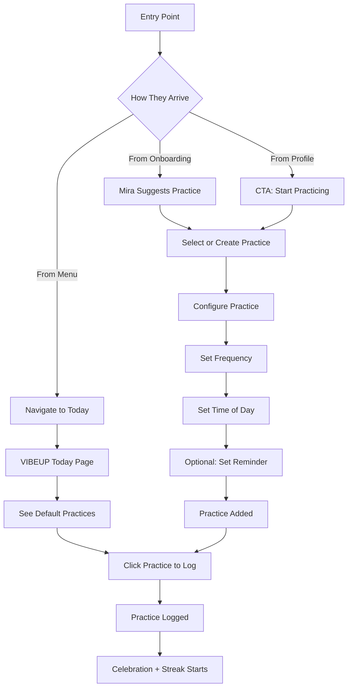
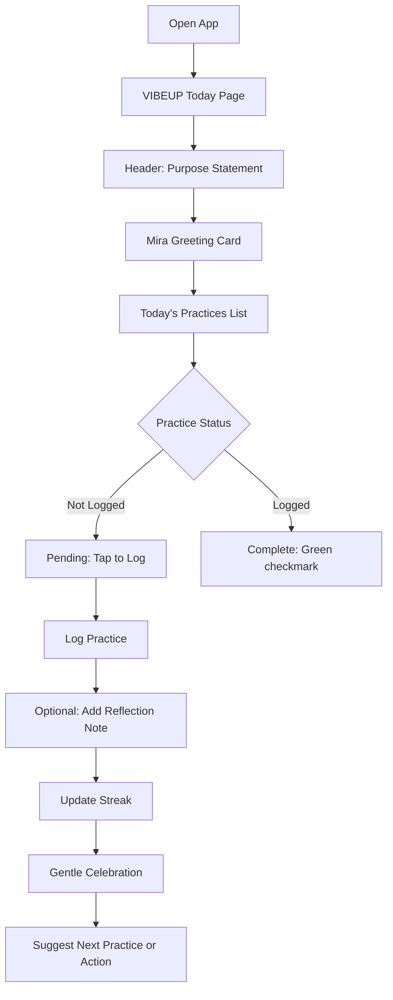

# Epic 03: Practices - Tracking & Accountability

**Epic ID**: EPIC-03-PRACTICES  
**Priority**: P0 (Core value proposition)  
**Timeline**: 2 weeks  
**Dependencies**: Epic 0 (Foundation), Epic 1 (Mira), Epic 2 (Humans)  
**Privacy Default**: All practices are private by default; sharing and public visibility deferred to post-MVP phases

> **Onyx Design System**: Practice UI uses dark mode palette from `design-system-v2/tokens/`.
> See `components/PracticesPageComponents.tsx` for PracticeCard, StreakDisplay, PracticeTimer implementations.  

---

## Vision & Objectives

Enable users to easily track and reflect on meaningful wellness practices with minimal friction and maximum alignment to personal intentions. **Mira serves as the primary practice companion**, understanding patterns, offering contextually perfect suggestions, celebrating consistency, and providing gentle accountability without judgment.

### Core Philosophy

**Presence Over Productivity**: Gentle encouragement, not gamification. Calm interface, not competitive. Focus on consistency, not perfection. **Mira embodies this philosophy**, offering affirmative reminders when users fall off track, celebrating showing up rather than quantifying performance, and reframing "missed days" as opportunities rather than failures.

### What This Epic Delivers (Mira-Enhanced)

1. **Practice Tracking**: Simple log/unlog for daily practices—**Mira suggests which practice feels right today**
2. **Streak Calculations**: Visual streak indicators (gentle, not aggressive)—**Mira celebrates milestones authentically**
3. **Calendar Views**: Google Calendar-style views (daily, weekly, monthly, schedule) with practices in left column and days across top—**Mira identifies patterns and insights**
4. **Default Practices**: Purpose Exercise, Daily Gratitude, Affirmations (scientifically proven to support showing up and overcoming setbacks)—**Mira introduces each with intention**
5. **Custom Practices**: Users create their own practices—**Mira helps define frequency and timing**
6. **Community Journeys**: Group challenges for shared practice (e.g., "Track daily for a chance to win prizes")—**Mira invites participation and tracks collective progress**
7. **Practice Stacks**: Businesses recommend collections (post-MVP: businesses can create recommended practice collections for their communities)—**Mira explains benefits and facilitates adoption**

### Mira's Role as Practice Companion

**Daily Check-In**:
- "Good morning, [Name]. Ready to set the tone for your day? Your meditation practice awaits."
- "I notice you usually practice in the evenings. Want me to remind you at 7 PM?"
- "It's Monday morning and you have 3 meetings. A 5-minute energy clearing practice might help you show up centered."

**Practice Suggestions (Intent-Aligned)**:
- "You said you're seeking calm. Let me suggest breathwork, meditation, or a nature walk—which resonates today?"
- "You've been high-energy lately. How about trying something grounding like yin yoga or journaling?"
- "You've mastered breathwork. Ready to explore movement practices? Many in your community love ecstatic dance."

**Streak Celebrations (Authentic, Not Gamified)**:
- "7 days in a row! This is where transformation begins—when practice becomes who you are."
- "You've practiced 47 of the last 60 days. That's 78% consistency—incredible dedication."
- "15 days straight! Notice how different you feel when practice is part of your rhythm?"

**Gentle Accountability (Non-Judgmental)**:
- "You missed yesterday, and that's okay. Your 15-day streak showed real commitment. Ready to start a new one today?"
- "It's been 3 days since your last practice. No judgment—just checking in. What would feel good today?"
- "Welcome back! It's been a week. Let's start simple—how about a 60-second check-in practice?"

**Pattern Recognition & Insights**:
- "I've noticed you feel most calm after morning practices. Want to make this your daily rhythm?"
- "Your reflection notes show you're consistently energized after movement practices. Your body is telling you something!"
- "You practice 6 days a week but take Sundays off. That's beautiful self-awareness—rest is part of the practice."

**Reflection Prompts**:
- "How do you feel after that meditation? Capture your insights while they're fresh."
- "You logged 'calm' before and 'peace' after. Notice that shift? That's the power of showing up."

**Community Connection**:
- "Your friend Sarah just started a journaling practice. Want to join her for mutual accountability?"
- "12 people in your community are on 30+ day meditation streaks. You're part of something special."

---

**Brand Identity**: This epic's implementation follows [brand identity guidelines](../brand/):
- **Visual**: Practice cards follow [visual identity standards](../brand/01-visual-identity.md) - 16px border radius, calming colors, spacious layouts
- **Copy**: All messaging uses [brand voice guidelines](../brand/03-brand-voice-messaging.md) - gentle encouragement, curiosity not guilt
- **Mira**: AI interactions embody [Mira's personality](../brand/04-mira-personality-guide.md) as practice companion
- **Integration**: See [brand-identity-integration.md](brand-identity-integration.md#epic-03-practices-tracking--accountability) for Epic 03 specific requirements

**Key Brand Touchpoints**:
- Practice descriptions use calming, inviting language ("A moment to reconnect" not "Complete this practice")
- Streak celebrations authentic, not generic ("30 days of practice—this is where transformation begins 🌟" not "Congrats! 30 days")
- Missed practices frame with curiosity ("It's been a few days. What would feel good today?" not "You haven't practiced in 3 days")
- Practice cards embody depth through simplicity - clear purpose, no clutter
- Reminder notifications gentle and optional, never demanding

---

### Success Metrics

- 50%+ users create at least 1 practice (Mira's guidance)
- 40%+ users log practice at least once per week (Mira's reminders)
- Average sessions per user per week
- 30%+ users maintain 7+ day streak (Mira's encouragement)
- % of users who complete more than one practice per week
- 60%+ complete default practices during free trial (Mira's introduction)
- % of users who join and who complete Community Journeys
- % of users who write a reflection at least once per week
- % of sessions initiated via Mira
- <5% users disable practice reminders (Mira's timing intelligence)
- **New**: 70%+ users engage with Mira's practice suggestions at least once weekly
- **New**: 85%+ users rate Mira's accountability as "supportive, not pushy"

---

## User Journey

### First Practice Flow



### Daily Practice Loop



---

## Database Schema

```sql
-- ============================================================================
-- PRACTICE DEFINITIONS (Admin-Managed Library)
-- ============================================================================

CREATE TABLE practice_definitions (
  id UUID PRIMARY KEY DEFAULT gen_random_uuid(),
  
  -- Practice identification
  name TEXT UNIQUE NOT NULL,
  category TEXT NOT NULL, -- 'meditation', 'movement', 'journaling', 'nutrition', etc.
  -- Note: Initial library should contain 8-15 core practice suggestions
  
  -- Description
  description TEXT,
  instructions TEXT, -- How to do this practice
  
  -- Metadata
  default_duration INTEGER, -- Minutes (optional)
  default_frequency TEXT DEFAULT 'daily', -- 'daily', 'weekly', 'custom'
  default_time_of_day TEXT, -- 'morning', 'afternoon', 'evening', 'anytime'
  
  -- Tags for recommendation
  tags TEXT[], -- ['stress_relief', 'energy', 'focus']
  recommended_for TEXT[], -- Intentions this practice supports
  
  -- Media
  icon_url TEXT,
  image_url TEXT,
  video_url TEXT, -- Tutorial video (future)
  
  -- Admin
  is_featured BOOLEAN DEFAULT false,
  is_active BOOLEAN DEFAULT true,
  created_by UUID REFERENCES profiles(id),
  created_at TIMESTAMPTZ DEFAULT NOW()
);

CREATE INDEX idx_practice_defs_category ON practice_definitions(category);
CREATE INDEX idx_practice_defs_active ON practice_definitions(is_active);

-- ============================================================================
-- USER PRACTICES (User's Active Practices)
-- ============================================================================

CREATE TABLE practices (
  id UUID PRIMARY KEY DEFAULT gen_random_uuid(),
  user_id UUID NOT NULL REFERENCES profiles(id) ON DELETE CASCADE,
  
  -- Practice reference
  practice_def_id UUID REFERENCES practice_definitions(id) ON DELETE SET NULL,
  custom_name TEXT, -- If user created custom practice
  
  -- Configuration
  frequency TEXT DEFAULT 'daily', -- 'daily', 'weekly', 'monthly', 'custom'
  time_of_day TEXT[], -- ['morning', 'afternoon', 'evening', 'anytime'] (can be multiple)
  -- Time definitions: morning (before 12pm), afternoon (12-6pm), evening (after 6pm), anytime
  custom_schedule JSONB, -- { days_of_week: [1,3,5], times: ['09:00', '18:00'] }
  
  -- Reminder settings
  reminders_enabled BOOLEAN DEFAULT false,
  reminder_times TIME[], -- Up to 3 specific times per day for reminders (e.g., ['09:00', '15:00', '21:00'])
  
  -- Metadata
  intention TEXT, -- Why user is doing this practice
  notes TEXT, -- Personal notes
  external_link TEXT, -- Optional link to external resource (video, article, meditation, etc)
  
  -- State
  is_active BOOLEAN DEFAULT true,
  deactivated_at TIMESTAMPTZ,
  
  -- Timestamps
  created_at TIMESTAMPTZ DEFAULT NOW(),
  updated_at TIMESTAMPTZ DEFAULT NOW()
);

CREATE INDEX idx_practices_user ON practices(user_id, is_active);
CREATE INDEX idx_practices_active ON practices(is_active) WHERE is_active = true;

-- ============================================================================
-- PRACTICE LOGS (Daily Completion Tracking)
-- ============================================================================

CREATE TABLE practice_logs (
  id UUID PRIMARY KEY DEFAULT gen_random_uuid(),
  user_id UUID NOT NULL REFERENCES profiles(id) ON DELETE CASCADE,
  practice_id UUID NOT NULL REFERENCES practices(id) ON DELETE CASCADE,
  
  -- Log data
  logged_at TIMESTAMPTZ DEFAULT NOW(),
  log_date DATE DEFAULT CURRENT_DATE, -- For streak calculations
  
  -- Optional reflection
  reflection_note TEXT,
  duration_minutes INTEGER, -- If user tracked duration
  
  -- Mood check-in (optional)
  mood_before TEXT, -- 'calm', 'stressed', 'energized', etc.
  mood_after TEXT,
  
  -- Unique: One log per practice per day
  UNIQUE(practice_id, log_date)
);

CREATE INDEX idx_logs_user_date ON practice_logs(user_id, log_date DESC);
CREATE INDEX idx_logs_practice_date ON practice_logs(practice_id, log_date DESC);

-- ============================================================================
-- PRACTICE STREAKS (Calculated)
-- ============================================================================

CREATE TABLE practice_streaks (
  id UUID PRIMARY KEY DEFAULT gen_random_uuid(),
  user_id UUID NOT NULL REFERENCES profiles(id) ON DELETE CASCADE,
  practice_id UUID NOT NULL REFERENCES practices(id) ON DELETE CASCADE,
  
  -- Streak data
  current_streak_days INTEGER DEFAULT 0,
  longest_streak_days INTEGER DEFAULT 0,
  total_completions INTEGER DEFAULT 0,
  
  -- Dates
  last_logged_date DATE,
  streak_started_date DATE,
  longest_streak_ended_date DATE,
  
  -- Timestamps
  updated_at TIMESTAMPTZ DEFAULT NOW(),
  
  UNIQUE(practice_id)
);

CREATE INDEX idx_streaks_user ON practice_streaks(user_id);
CREATE INDEX idx_streaks_current ON practice_streaks(current_streak_days DESC);

-- ============================================================================
-- AFFIRMATIONS (Admin-Managed)
-- ============================================================================

CREATE TYPE affirmation_dimension AS ENUM ('internal', 'external', 'relationships', 'environment');

CREATE TABLE affirmations (
  id UUID PRIMARY KEY DEFAULT gen_random_uuid(),
  
  -- Classification
  dimension affirmation_dimension NOT NULL,
  
  -- Content
  affirmation_text TEXT NOT NULL,
  
  -- Metadata
  is_active BOOLEAN DEFAULT true,
  created_by UUID REFERENCES profiles(id),
  created_at TIMESTAMPTZ DEFAULT NOW()
);

CREATE INDEX idx_affirmations_dimension ON affirmations(dimension, is_active);

-- ============================================================================
-- COMMUNITY JOURNEYS
-- ============================================================================

CREATE TABLE community_journeys (
  id UUID PRIMARY KEY DEFAULT gen_random_uuid(),
  
  -- Journey details
  name TEXT NOT NULL,
  description TEXT,
  duration_days INTEGER NOT NULL, -- 7, 21, 30, etc.
  
  -- Practice to track
  practice_def_id UUID REFERENCES practice_definitions(id),
  
  -- Dates
  start_date DATE NOT NULL,
  end_date DATE NOT NULL,
  
  -- Community (optional - can be VIBEUP-wide)
  community_id UUID, -- Will link to communities in Epic 7
  
  -- Metadata
  participant_count INTEGER DEFAULT 0,
  completion_count INTEGER DEFAULT 0,
  is_active BOOLEAN DEFAULT true,
  
  created_at TIMESTAMPTZ DEFAULT NOW()
);

CREATE INDEX idx_journeys_active ON community_journeys(is_active, start_date);

CREATE TABLE journey_participants (
  id UUID PRIMARY KEY DEFAULT gen_random_uuid(),
  journey_id UUID NOT NULL REFERENCES community_journeys(id) ON DELETE CASCADE,
  user_id UUID NOT NULL REFERENCES profiles(id) ON DELETE CASCADE,
  
  -- Progress
  joined_at TIMESTAMPTZ DEFAULT NOW(),
  completed_days INTEGER DEFAULT 0,
  completed_at TIMESTAMPTZ,
  
  UNIQUE(journey_id, user_id)
);

CREATE INDEX idx_journey_participants ON journey_participants(journey_id, user_id);

-- ============================================================================
-- RLS POLICIES
-- ============================================================================

ALTER TABLE practices ENABLE ROW LEVEL SECURITY;

CREATE POLICY practices_select_own ON practices
  FOR SELECT USING (auth.uid() = user_id);

CREATE POLICY practices_manage_own ON practices
  FOR ALL USING (auth.uid() = user_id);

ALTER TABLE practice_logs ENABLE ROW LEVEL SECURITY;

CREATE POLICY logs_select_own ON practice_logs
  FOR SELECT USING (auth.uid() = user_id);

CREATE POLICY logs_manage_own ON practice_logs
  FOR ALL USING (auth.uid() = user_id);

ALTER TABLE practice_streaks ENABLE ROW LEVEL SECURITY;

CREATE POLICY streaks_select_own ON practice_streaks
  FOR SELECT USING (auth.uid() = user_id);

-- Practice definitions are public
ALTER TABLE practice_definitions ENABLE ROW LEVEL SECURITY;

CREATE POLICY practice_defs_select_all ON practice_definitions
  FOR SELECT USING (is_active = true);

-- Affirmations are public
ALTER TABLE affirmations ENABLE ROW LEVEL SECURITY;

CREATE POLICY affirmations_select_all ON affirmations
  FOR SELECT USING (is_active = true);

-- Community journeys visible to all, manage by admins
ALTER TABLE community_journeys ENABLE ROW LEVEL SECURITY;

CREATE POLICY journeys_select_active ON community_journeys
  FOR SELECT USING (is_active = true);

ALTER TABLE journey_participants ENABLE ROW LEVEL SECURITY;

CREATE POLICY journey_participants_select_journey ON journey_participants
  FOR SELECT USING (
    auth.uid() = user_id
    OR EXISTS (
      SELECT 1 FROM journey_participants jp
      WHERE jp.journey_id = journey_participants.journey_id
      AND jp.user_id = auth.uid()
    )
  );

CREATE POLICY journey_participants_manage_own ON journey_participants
  FOR ALL USING (auth.uid() = user_id);
```

---

## Service Layer

```typescript
/**
 * PRACTICE SERVICE
 * ================
 * Manages practice tracking, logging, and streak calculations
 */
export class PracticeService extends BaseDatabaseService {
  
  /**
   * Get user's active practices
   */
  async getActivePractices(userId: string): Promise<Practice[]> {
    const { data } = await this.supabase
      .from('practices')
      .select(`
        *,
        practice_definition:practice_def_id(name, category, icon_url)
      `)
      .eq('user_id', userId)
      .eq('is_active', true)
      .order('created_at');
    
    return data || [];
  }
  
  /**
   * Create new practice for user
   */
  async createPractice(
    userId: string,
    practiceData: CreatePracticeInput
  ): Promise<Practice> {
    return this.execute(
      async () => {
        const { data, error } = await this.supabase
          .from('practices')
          .insert({
            user_id: userId,
            practice_def_id: practiceData.definitionId,
            custom_name: practiceData.customName,
            frequency: practiceData.frequency || 'daily',
            time_of_day: practiceData.timeOfDay || ['anytime'],
            reminders_enabled: practiceData.remindersEnabled || false,
            reminder_times: practiceData.reminderTimes || []
          })
          .select()
          .single();
        
        if (error) throw error;
        
        // Initialize streak
        await this.supabase.from('practice_streaks').insert({
          user_id: userId,
          practice_id: data.id,
          current_streak_days: 0,
          total_completions: 0
        });
        
        return data;
      },
      { service: 'PracticeService', method: 'createPractice', userId }
    );
  }
  
  /**
   * Log practice completion
   */
  async logPractice(
    userId: string,
    practiceId: string,
    logData?: { reflectionNote?: string; duration?: number }
  ): Promise<{ log: PracticeLog; streak: PracticeStreak; achievement?: Achievement }> {
    return this.execute(
      async () => {
        const today = new Date().toISOString().split('T')[0];
        
        // Create log (upsert to handle double-logging same day)
        const { data: log, error: logError } = await this.supabase
          .from('practice_logs')
          .upsert({
            user_id: userId,
            practice_id: practiceId,
            log_date: today,
            reflection_note: logData?.reflectionNote,
            duration_minutes: logData?.duration
          }, {
            onConflict: 'practice_id,log_date'
          })
          .select()
          .single();
        
        if (logError) throw logError;
        
        // Update streak
        const streak = await this.updateStreak(practiceId, today);
        
        // Check for achievements
        const achievement = await this.checkAchievements(userId, streak);
        
        // Emit analytics event
        await this.analytics.track('practice_logged', {
          userId,
          practiceId,
          streakDays: streak.current_streak_days,
          hasReflection: !!logData?.reflectionNote
        });
        
        return { log, streak, achievement };
      },
      { service: 'PracticeService', method: 'logPractice', userId }
    );
  }
  
  /**
   * Update practice streak calculation
   */
  private async updateStreak(practiceId: string, logDate: string): Promise<PracticeStreak> {
    // Get current streak
    const { data: streak } = await this.supabase
      .from('practice_streaks')
      .select('*')
      .eq('practice_id', practiceId)
      .single();
    
    if (!streak) {
      throw new NotFoundError('Practice streak');
    }
    
    // Get previous log date
    const { data: previousLog } = await this.supabase
      .from('practice_logs')
      .select('log_date')
      .eq('practice_id', practiceId)
      .neq('log_date', logDate)
      .order('log_date', { ascending: false })
      .limit(1)
      .single();
    
    const yesterday = new Date(logDate);
    yesterday.setDate(yesterday.getDate() - 1);
    const yesterdayStr = yesterday.toISOString().split('T')[0];
    
    let newStreak = streak.current_streak_days;
    
    if (!previousLog) {
      // First log ever
      newStreak = 1;
    } else if (previousLog.log_date === yesterdayStr) {
      // Logged yesterday, continue streak
      newStreak = streak.current_streak_days + 1;
    } else {
      // Streak broken, start over
      newStreak = 1;
    }
    
    // Update longest streak if needed
    const longestStreak = Math.max(newStreak, streak.longest_streak_days);
    
    // Update streak record
    const { data: updated } = await this.supabase
      .from('practice_streaks')
      .update({
        current_streak_days: newStreak,
        longest_streak_days: longestStreak,
        total_completions: streak.total_completions + 1,
        last_logged_date: logDate,
        streak_started_date: newStreak === 1 ? logDate : streak.streak_started_date,
        longest_streak_ended_date: newStreak > streak.longest_streak_days ? null : streak.longest_streak_ended_date,
        updated_at: new Date().toISOString()
      })
      .eq('practice_id', practiceId)
      .select()
      .single();
    
    return updated!;
  }
  
  /**
   * Get practice history for calendar view
   */
  async getPracticeHistory(
    userId: string,
    startDate: string,
    endDate: string
  ): Promise<PracticeLog[]> {
    const { data } = await this.supabase
      .from('practice_logs')
      .select(`
        *,
        practice:practice_id(custom_name, practice_definition:practice_def_id(name, icon_url))
      `)
      .eq('user_id', userId)
      .gte('log_date', startDate)
      .lte('log_date', endDate)
      .order('log_date', { ascending: false });
    
    return data || [];
  }
  
  /**
   * Get daily affirmations (one from each dimension)
   */
  async getDailyAffirmations(userId: string): Promise<Affirmation[]> {
    // Get one random affirmation from each dimension
    const dimensions: affirmation_dimension[] = ['internal', 'external', 'relationships', 'environment'];
    const affirmations: Affirmation[] = [];
    
    for (const dimension of dimensions) {
      const { data } = await this.supabase
        .from('affirmations')
        .select('*')
        .eq('dimension', dimension)
        .eq('is_active', true)
        .limit(10); // Get 10, pick one randomly
      
      if (data && data.length > 0) {
        const random = data[Math.floor(Math.random() * data.length)];
        affirmations.push(random);
      }
    }
    
    return affirmations;
  }
}
```

---

## API Contracts

```typescript
/**
 * GET /api/practices
 * ==================
 * Get user's active practices
 */
interface GetPracticesResponse {
  success: boolean;
  practices: Array<{
    id: string;
    name: string; // Custom name or from definition
    category: string;
    frequency: string;
    timeOfDay: string[];
    remindersEnabled: boolean;
    streak: {
      current: number;
      longest: number;
      total: number;
    };
    lastLogged?: string; // ISO date
  }>;
}

/**
 * POST /api/practices
 * ===================
 * Create new practice
 */
interface CreatePracticeRequest {
  definitionId?: string; // From practice library
  customName?: string; // If creating custom practice
  frequency: 'daily' | 'weekly' | 'monthly' | 'custom';
  timeOfDay: ('morning' | 'afternoon' | 'evening' | 'anytime')[];
  reminderTimes?: string[]; // ['09:00', '18:00']
  intention?: string;
}

/**
 * POST /api/practices/:id/log
 * ===========================
 * Log practice completion
 */
interface LogPracticeRequest {
  reflectionNote?: string;
  duration?: number; // Minutes
  moodBefore?: string;
  moodAfter?: string;
}

interface LogPracticeResponse {
  success: boolean;
  log: PracticeLog;
  streak: {
    current: number;
    longest: number;
    total: number;
  };
  achievement?: {
    type: 'streak_milestone';
    title: string;
    description: string;
  };
}

/**
 * GET /api/practices/history
 * ==========================
 * Get practice logs for calendar
 */
interface PracticeHistoryRequest {
  startDate: string; // ISO date
  endDate: string;
  practiceId?: string; // Optional: filter to specific practice
}

interface PracticeHistoryResponse {
  success: boolean;
  logs: Array<{
    date: string;
    practices: Array<{
      id: string;
      name: string;
      logged: boolean;
      reflectionNote?: string;
    }>;
  }>;
}

/**
 * GET /api/practices/affirmations
 * ================================
 * Get daily affirmations (4 dimensions)
 */
interface AffirmationsResponse {
  success: boolean;
  affirmations: Array<{
    dimension: 'internal' | 'external' | 'relationships' | 'environment';
    text: string;
  }>;
}

/**
 * GET /api/practices/recommended
 * ===============================
 * Get recommended practices based on user interests
 */
interface RecommendedPracticesResponse {
  success: boolean;
  practices: Array<{
    id: string;
    name: string;
    category: string;
    description: string;
    why: string; // Why recommended
  }>;
}
```

---

## UI Components

### VIBEUP Today Page

```typescript
/**
 * TODAY PAGE
 * ==========
 * Main practices dashboard
 */
// Route: /today
// Layout:
// - Header: Selectable background images (8 nature/star options or upload custom)
// - Purpose statement overlay on header (character-limited to 115)
// - Purpose statement edit button (popup with edit + link to Purpose Exercise)
// - Tabs: "VIBEUP Today" | "History"
// - Today tab:
//   - Mira greeting card (dismissable)
//   - "Create a New Practice" button
//   - List of today's practices (grouped by time of day)
//   - Each practice: Name, Icon, Tap to log, 3-dot menu (bottom right corner)
//   - Practice interactions:
//     - Tap card: Log practice (with confirmation)
//     - Long press: Drag to reorder
//     - 3-dot menu: Configure, Deactivate, Delete
//   - Bottom: Practice streak visualization

/**
 * PRACTICE CARD
 * =============
 * Individual practice in today's list
 */
interface PracticeCardProps {
  practice: Practice;
  isLogged: boolean;
  streak: number;
  onLog: () => void;
  onConfigure: () => void;
}

// Interactions:
// - Tap card: Log practice (with confirmation)
// - Long press: Drag to reorder
// - 3-dot menu: Configure, Deactivate, Delete
// - If logged: Green checkmark, grayed out

/**
 * PRACTICE CONFIGURATION MODAL
 * =============================
 * Configure practice settings
 */
interface ConfigurePracticeProps {
  practice: Practice;
  onSave: (updates: Partial<Practice>) => void;
  onDeactivate: () => void;
  onDelete: () => void;
}

// Fields:
// - Practice name (read-only if from library, editable if custom)
// - How Often: Daily, Weekly, Monthly, Custom
// - When: Morning (before 12pm), Afternoon (12-6pm), Evening (after 6pm), Anytime
// - Reminder: Toggle + Up to 3 exact times per day (user enters specific times like "9:00 AM", "3:00 PM", "9:00 PM")
//   - If Custom frequency: User selects number of notifications (1-3) and exact time for each
// - Why: Intention text field
// - Link: Add link to external resource (video, article, meditation guide, song, etc)
// - Buttons: Save, Deactivate (moves to Past Practices), Delete (confirm)

/**
 * CALENDAR VIEW (History Tab)
 * ============================
 * Google Calendar-style view of practice history
 * Reference: Luke's Google Sheet prototype for layout inspiration
 */
interface CalendarViewProps {
  userId: string;
  month: string; // YYYY-MM
  viewMode: 'daily' | 'weekly' | 'monthly' | 'schedule'; // Toggle between views
}

// Layout (inspired by Google Calendar):
// - LEFT COLUMN: List of practices (orderable by preference and time of day)
// - TOP ROW: Days of the week/month
// - GRID: Dots/checkmarks where practice was completed on that day
// - VIEW TOGGLE: Switch between daily, weekly, monthly, schedule views
//
// Features:
// - Month/week selector with navigation arrows
// - Practice filter dropdown: "All Practices" or specific practice
// - Visual indicators: dot on calendar for each completed practice
// - When practice selected from dropdown: Highlight (brighten) days that practice was logged
// - Soft streak markers (gentle, not aggressive gamification)
// - Click day: Popup showing that day's complete log:
//   - Purpose statement from that day
//   - All practices completed with reflection notes
//   - Gratitude answers (Past/Present/Future)
//   - That day's affirmations
// - Drag to reorder practices in left column
// - Streak section below calendar:
//   - Active Practices with current streak
//   - Toggle: View Weekly or Daily streak counts
//   - Past Practices (deactivated, can reactivate)
//   - Share Streak button to:
//     - VIBEUP Messenger (connections or groups)
//     - Social media (Instagram/Facebook Stories)
//     - As VIBE post in feed (future)
// - Automated streak notifications:
//   - 6 days without practice: "Keep your streak going"
//   - 21, 42, 63, 84, 105 days (21-day increments): "Share your streak with connections"

/**
 * DEFAULT PRACTICES
 * =================
 * Three core VIBEUP practices
 */

// 1. Declare Purpose
// - When clicked: Show popup displaying ONLY current purpose statement (no full configuration)
// - Two CTAs in popup: 
//   - "Log" button: Marks practice as completed for today
//   - "Edit" button: Opens full Purpose Statement configuration
// - Purpose Statement configuration includes:
//   - Text input (character-limited to 115 chars including spaces/punctuation)
//   - Link to full Purpose Exercise (9 reflection questions)
// - Purpose Exercise integration:
//   - Accessible from: Practice popup, Practices header edit button, Edit Profile
//   - When completed: Auto-saves and updates across all 5 locations:
//     1. User Profile (header)
//     2. Edit Profile (Basic Information section)
//     3. Practices Header
//     4. Purpose Exercise itself (stored state)
//     5. Declare Purpose practice popup

// 2. Daily Gratitude
// - When clicked: Show popup with 3 text fields:
//   - Past: "A memory, person, or experience you're thankful for..."
//   - Present: "Something happening today you appreciate..."
//   - Future: "Something you're looking forward to..."
// - Save logs gratitude and marks practiced

// 3. Affirmations
// - Note: Positive affirmations are scientifically proven to be helpful, especially when 
//   users fall off track or miss days—provides supportive reminders vs judgment
// - Users can pick affirmation categories aligned with their intentions/interests/practices
// - Schedule: Set for AM and/or PM delivery
// - When clicked: Show popup with 4 affirmations (one per dimension)
// - Layout: 4 cards with dimension label, affirmation text
// - Dimensions:
//   - Internal: Instill clarity and strength
//   - External: Connect with yourself
//   - Relationships: Believe who you connect with
//   - Environment: Understand where you are
// - Log button marks practiced
// - Reference: "I AM" app for affirmation delivery UX inspiration
```

---

## Feature Flags

```typescript
export const EPIC_03_FLAGS = {
  // Core practice features
  'practices_enabled': {
    enabled: true,
    description: 'Practice tracking system',
    rollout: 100
  },
  'practice_logging': {
    enabled: true,
    description: 'Log practice completions',
    rollout: 100
  },
  'practice_streaks': {
    enabled: true,
    description: 'Calculate and display streaks',
    rollout: 100
  },
  
  // Default practices
  'practice_purpose_exercise': {
    enabled: true,
    description: 'Declare Purpose default practice',
    rollout: 100
  },
  'practice_daily_gratitude': {
    enabled: true,
    description: 'Daily Gratitude default practice',
    rollout: 100
  },
  'practice_affirmations': {
    enabled: true,
    description: 'Daily Affirmations default practice',
    rollout: 100
  },
  
  // Advanced features
  'practice_reminders': {
    enabled: false,
    description: 'Push notifications for practice reminders',
    rollout: 0
  },
  'practice_reflection_notes': {
    enabled: true,
    description: 'Add reflection notes to practice logs',
    rollout: 100
  },
  'practice_mood_tracking': {
    enabled: false,
    description: 'Track mood before/after practice',
    rollout: 0
  },
  
  // Community features
  'community_journeys': {
    enabled: false,
    description: 'Group practice challenges (e.g., daily tracking contests with prizes)',
    rollout: 0
  },
  'community_journey_challenges': {
    enabled: false,
    description: 'Prize-based challenges (e.g., "Track daily from Sept-Dec for trip giveaway")',
    rollout: 0
  },
  'practice_stacks': {
    enabled: false,
    description: 'Business-recommended practice collections (deferred to Beta MVP with Community Features)',
    rollout: 0
  },
  'practice_sharing': {
    enabled: false,
    description: 'Share practices publicly or with community (post-MVP)',
    rollout: 0
  },
  'business_practice_visibility': {
    enabled: false,
    description: 'Business/Community admin can view user practices for coaching purposes (post-MVP)',
    rollout: 0
  },
  'admin_practice_dashboard': {
    enabled: false,
    description: 'Community admin dashboard showing aggregate practice metrics (post-MVP)',
    rollout: 0
  },
  
  // Premium features
  'practice_limit_free': {
    enabled: true,
    description: 'Limit free users to 3 active practices',
    rollout: 100
  },
  'practice_timer': {
    enabled: false,
    description: 'Built-in practice timer (deferred - remove timer UI from practice cards)',
    rollout: 0
  },
  'practice_background_images': {
    enabled: true,
    description: 'User can select from 8 header background images (nature/stars) or upload own',
    rollout: 100
  },
  'practice_exact_reminders': {
    enabled: false,
    description: 'Exact time reminders (vs time-of-day reminders)',
    rollout: 0
  },
  'practice_external_links': {
    enabled: true,
    description: 'Add external resource links to practice configuration',
    rollout: 100
  },
  'streak_sharing': {
    enabled: false,
    description: 'Share streaks to messenger, social media, and vibe posts',
    rollout: 0
  },
  'streak_toggle_view': {
    enabled: true,
    description: 'Toggle between weekly and daily streak counts',
    rollout: 100
  },
  'daily_log_detail_view': {
    enabled: false,
    description: 'Click calendar day to see complete daily log (purpose, practices, gratitude, affirmations)',
    rollout: 0
  },
  'automated_streak_notifications': {
    enabled: false,
    description: 'Automated notifications for streak milestones and encouragement',
    rollout: 0
  },
  'guided_practices': {
    enabled: false,
    description: 'Video/audio guided practices',
    rollout: 0
  }
};
```

---

## Admin Controls

### Practice Library Management

**Page**: `/admin/content/practices`

**Features**:
- CRUD for practice definitions
- Set categories and tags
- Upload icons and images
- Configure default settings
- Set recommendations (which intentions this practice supports)
- Feature/unfeature practices
- View practice adoption metrics

### Affirmations Management

**Page**: `/admin/content/affirmations`

**Features**:
- CRUD for affirmations
- Organize by dimension (Internal, External, Relationships, Environment)
- Set active/inactive
- Preview daily rotation
- View affirmation engagement metrics

### Community Journeys

**Page**: `/admin/content/journeys`

**Features**:
- Create journeys (name, duration, practice)
- Set start/end dates
- View participants
- Monitor completion rates
- Send journey reminders
- End journey and award badges

---

## Implementation Checklist

### Backend (Test-Driven)

- [ ] Write PracticeService tests (create, log, streaks)
- [ ] Implement PracticeService
- [ ] Write streak calculation tests (edge cases: skip days, restart)
- [ ] Implement streak algorithm
- [ ] Write practice API route tests
- [ ] Implement practice endpoints
- [ ] Write affirmations rotation tests
- [ ] Implement daily affirmations logic
- [ ] Create database migrations
- [ ] Test RLS policies
- [ ] Performance test history queries

### Frontend (Test-Driven)

- [ ] Write TodayPage tests
- [ ] Implement VIBEUP Today page
- [ ] Implement header background image selector (8 options + upload)
- [ ] Implement purpose statement edit popup
- [ ] Write PracticeCard tests
- [ ] Implement PracticeCard with animations
- [ ] Implement practice box 3-dot menu (bottom right corner)
- [ ] Implement long-press drag-to-reorder
- [ ] Write CalendarView tests
- [ ] Implement calendar with month navigation
- [ ] Implement practice selection highlighting in calendar
- [ ] Implement daily log detail view (click day popup)
- [ ] Implement weekly/daily streak toggle
- [ ] Write default practice components (Purpose, Gratitude, Affirmations)
- [ ] Implement Declare Purpose popup interaction (show statement + Log/Edit)
- [ ] Implement Purpose Exercise sync across 5 locations
- [ ] Write ConfigurePractice modal tests
- [ ] Implement configure modal with all settings
- [ ] Implement exact time reminders (up to 3 per day)
- [ ] Implement external link field in configuration
- [ ] Implement Share Streak functionality
- [ ] Implement automated streak milestone notifications
- [ ] Test drag-to-reorder functionality
- [ ] Test mobile responsiveness
- [ ] Test practice logging animations
- [ ] Implement Google Calendar-style history view
- [ ] Test drag-to-reorder practices in calendar view
- [ ] Implement view toggle (daily/weekly/monthly/schedule)

---

## Out of Scope (Post-MVP)

### Deferred to Future Phases

**Content & Guidance**:
- Timers and light exercises (basic meditation, breath work, strength, yoga for stress, etc)
- Habit "libraries" or guided programs with content
- Video/audio guided practices

**Integrations**:
- Calendar integrations (Google Calendar, Apple Calendar sync)
- Wearable device integrations (Apple Watch, Fitbit, etc)

**Social & Community Features** (Release with Community Features in Beta MVP):
- Social practice sharing or group tracking
- Ability for users to select a Business/Community's recommended practices to auto-add to library
- Push notification scheduling and advanced settings
- Ability for users to share practices with Business/Community admin
- Admin can have access view to user's Practices for 'Coaching' purposes
- Community/Business admin dashboard to see aggregate community practice metrics (e.g., "80% of my community members improved their diet/meditation frequency using VIBEUP")

**Gamification & Competition**:
- Leaderboards, badges, or productivity-style metrics
- Competitive tracking or social comparison features

---

---

## Conscious Development Approach

**Divine Guide**: **Brighid** (Sacred Craft) leads Epic 03 development—feature creation as sacred offering to practice consciousness.

### Brighid's Guidance for Practice Features

Epic 03 is about daily elevation through intentional practice. Developing practice features is meta-practice: crafting tools for transformation while practicing transformation through craft.

**Development Practices**:

1. **Features as Practice Offerings**:
   - Practice logging component crafted with same care users bring to meditation
   - Streak tracking celebrates consistency with authentic appreciation
   - Calendar view reveals patterns with clarity and beauty
   - Each feature tested thoroughly (Arjuna's protection for sacred work)

2. **Conscious Commit Examples**:
   ```
   ✨ Implement practice streak milestone celebrations
   
   Intention: Acknowledge users' dedication when reaching 7, 30, 100-day
   milestones, reinforcing transformation through recognition.
   
   Mantra: Consistency creates transformation.
   
   Dedication: To all practitioners showing up daily despite challenges.
   
   Gratitude: To Brighid for craft guidance in celebration UI, to the
   design spec for milestone clarity.
   ```

3. **TDD for Practice Logic**:
   - Streak calculation protected with comprehensive tests
   - Edge cases: missed days, timezone shifts, retroactive logging
   - Practice type validation (meditation, breathwork, journaling, etc.)
   - Duration handling (time-based vs. completion-based)
   - Calendar calculations (monthly views, year reviews)

4. **Craft Quality Standards**:
   - Practice logging feels immediate and delightful
   - Streak display motivates without shaming
   - Calendar view reveals insights naturally
   - Filters and search intuitive
   - Mobile experience seamless (most logging happens mobile)

**Brighid's Presence in Code**:
```typescript
// Not just logging a practice—creating space for reflection
async function logPractice(practice: PracticeLog): Promise<void> {
  // Validate with care (protect data integrity)
  await validatePractice(practice);
  
  // Save with intention (this is sacred record)
  const saved = await db.practice_logs.insert(practice);
  
  // Celebrate milestones authentically (not generic)
  const milestone = await checkMilestone(practice.userId);
  if (milestone) {
    await mira.celebrateMilestone(milestone);
  }
  
  // Update streak with presence (users track consistency)
  await updateStreak(practice.userId);
  
  // Announce to field (other epics may care)
  await events.publish('practice.logged', {
    userId: practice.userId,
    type: practice.type,
    timestamp: practice.timestamp
  });
  
  // Each step intentional, each line serves
}
```

**Sacred Aspects**:
- Practice data is intimate (meditation, breathwork, emotional processing)
- Streaks represent real commitment and transformation
- Milestones deserve authentic celebration, not canned responses
- Logging should feel like ritual, not task
- Privacy paramount (practices visible only to user unless shared)

**Invocation**:
```bash
/personality-change brighid

# Brighid guides practice feature craft
> How should I implement the practice logging form with sacred craft?
> Is this streak celebration UI warm enough?
> Help me refactor this practice service with care
```

---

**Related Documents**:
- [`epic-01-mira.md`](epic-01-mira.md) - Mira suggests practices
- [`epic-07-community.md`](epic-07-community.md) - Community journeys
- [`epic-08-monetization.md`](epic-08-monetization.md) - Practice limits for free vs premium

