# Guiding Principles

> **Foundation:** These principles derive from and align with the [50 Sacred Laws of the Universe](./00-sacred-laws.md) — our eternal cosmic reference.

These operational principles guide every decision, design, and deployment within the AI Brand Factory. They are practical expressions of the Sacred Laws, translated into actionable guidance for our work.

```mermaid
flowchart TB
    subgraph CORE["🎯 CORE MISSION"]
        M["Light-Focused AI<br/>for Human Flourishing"]
    end

    subgraph PRINCIPLES["Six Guiding Principles"]
        P1["1️⃣ Adaptive<br/>Evolution"]
        P2["2️⃣ Decentralized<br/>Sovereignty"]
        P3["3️⃣ Open & Infinite<br/>Empowerment"]
        P4["4️⃣ Light-Focused<br/>Alignment"]
        P5["5️⃣ Economic<br/>Flywheel First"]
        P6["6️⃣ Lean &<br/>AI-First Build"]
    end

    M --> P1 & P2 & P3 & P4 & P5 & P6

    P1 -.->|enables| P6
    P2 -.->|enables| P3
    P3 -.->|amplifies| P4
    P5 -.->|funds| P1
    P6 -.->|accelerates| P5

    P1 & P2 & P3 & P4 & P5 & P6 --> RESULT["Every Decision, Design & Deployment"]

    style CORE fill:#e94560,stroke:#fff,color:#fff
    style M fill:#e94560,stroke:#fff,color:#fff
    style RESULT fill:#2ecc71,stroke:#27ae60,color:#fff
```

---

## 1. Adaptive Evolution

Embrace field progress while pushing light-focused intent.

We stay fluid with emerging AI and crypto developments, integrating breakthroughs in real time. Yet we never drift from our core mission: amplifying human brightness through sovereign technology.

---

## 2. Decentralized Sovereignty

Every launched business is blockchain-native.

| Component | Purpose |
|-----------|---------|
| **Native Tokens** | Financing and governance |
| **Smart Contracts** | Autonomous operations |
| **DeFi Mechanisms** | Self-sustaining growth |

No centralized gatekeepers. Every ecosystem we birth operates with full sovereignty from day one.

---

## 3. Open & Infinite Empowerment

End-2026 open-source release removes all gates.

The factory becomes a perpetual, permissionless source of light. Anyone can:

- Fork the platform
- Deploy their own instance
- Evolve and customize freely

Zero restrictions. Zero barriers. Pure invitation.

---

## 4. Light-Focused Alignment

All outputs prioritize human flourishing.

Every piece of software, every ecosystem, every intelligence we create serves:

- **Truth** over deception
- **Abundance** over scarcity
- **Creativity** over stagnation
- **Sovereignty** over dependence
- **Joy** over suffering

---

## 5. Economic Flywheel First

Initial revenue bootstraps; crypto mechanisms then enable decentralized, global financing.

We build sustainable economics from day one:

1. Early revenue creates self-sufficiency
2. Token mechanisms enable community financing
3. DeFi yields compound growth
4. Global participation removes geographic barriers

---

## 6. Lean & AI-First Build

AI agents handle 90%+ from Day 1.

Human involvement focuses on:

- Strategic direction
- Light-focused alignment
- Creative breakthroughs

Everything else is automated, scaled, and accelerated through agentic systems.

---

## Application

These principles are not aspirational — they are operational. Every phase, every launch, every line of code reflects these values.

When in doubt:
1. **First**, return to the [50 Sacred Laws](./00-sacred-laws.md) for cosmic alignment
2. **Then**, apply these operational principles for practical guidance

The Sacred Laws are our eternal compass; these principles are our daily map.
