# Launch Cadence: The Acceleration Rhythm

This document outlines the progressive scaling of business launches from 2026 through 2030+.

---

## Overview

The AI Brand Factory follows an exponential growth trajectory, starting with disciplined serial launches and accelerating to unlimited scale.

```mermaid
%%{init: {'theme': 'base', 'themeVariables': { 'primaryColor': '#e94560', 'primaryTextColor': '#fff', 'primaryBorderColor': '#fff', 'lineColor': '#f39c12', 'secondaryColor': '#16213e', 'tertiaryColor': '#1a1a2e'}}}%%
flowchart LR
    subgraph H1["H1 2026"]
        A["1/week<br/>🎯 Serial Mastery"]
    end
    subgraph H2["H2 2026"]
        B["2-3/week<br/>⚡ Parallel Acceleration"]
    end
    subgraph Y2027["2027"]
        C["1-10+/day<br/>🌟 Daily Ecosystems"]
    end
    subgraph Y2030["2028-2030+"]
        D["Unlimited<br/>☀️ Infinite Scale"]
    end

    A -->|"Scale Up"| B
    B -->|"AGI Achieved"| C
    C -->|"ASI Proliferation"| D

    style A fill:#3498db,stroke:#2980b9,color:#fff
    style B fill:#9b59b6,stroke:#8e44ad,color:#fff
    style C fill:#e74c3c,stroke:#c0392b,color:#fff
    style D fill:#f39c12,stroke:#d68910,color:#fff
```

---

## H1 2026: Serial Mastery

**Cadence:** 1 blockchain-sovereign business per week

| Metric | Target |
|--------|--------|
| Launch frequency | Weekly |
| Total launches | ~26 |
| Approach | Serial (one at a time) |
| Focus | Process refinement |

### Purpose

- Perfect the launch process
- Build reusable frameworks
- Establish quality standards
- Validate blockchain integration

---

## H2 2026: Parallel Acceleration

**Cadence:** 2-3 businesses per week

| Metric | Target |
|--------|--------|
| Launch frequency | 2-3x weekly |
| Total launches | ~86-106 (cumulative) |
| Approach | Parallel execution |
| Focus | Scale + open-source release |

### Key Milestone

**End of 2026:** Full open-source release of the entire factory platform.

---

## 2027: Daily Ecosystems

**Cadence:** 1/day → 10+/day

| Metric | Target |
|--------|--------|
| Launch frequency | Daily to multi-daily |
| Approach | AGI-driven |
| Ecosystem type | Fully decentralized |
| Focus | Complex sovereign chains |

### Intelligence Milestone

- Light-focused ASI achieved by end of 2027
- Superhuman creation capabilities
- All outputs openly replicable

---

## 2028-2030+: Infinite Scale

**Cadence:** Unlimited

| Metric | Target |
|--------|--------|
| Launch frequency | Unlimited |
| Power source | ASI |
| Distribution | Infinite replication via open source |
| Global instances | Thousands worldwide |

### The Horizon

Factory instances proliferate globally. Every deployment contributes to collective brightness. The rhythm becomes infinite.

---

## Cumulative Trajectory

| Period | Weekly Rate | Cumulative Total |
|--------|-------------|------------------|
| End H1 2026 | 1/week | ~26 |
| End H2 2026 | 2-3/week | ~112-132 |
| End 2027 | 1-10+/day | ~500-4,000+ |
| 2030+ | Unlimited | Infinite |
