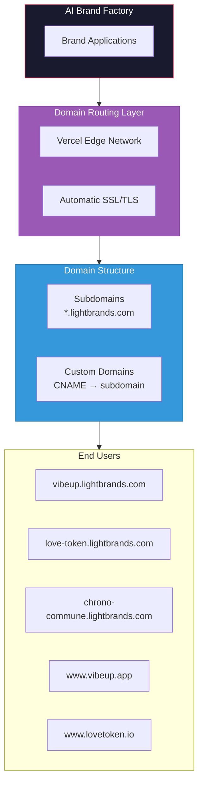
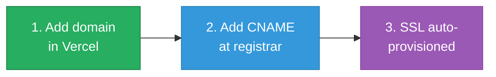
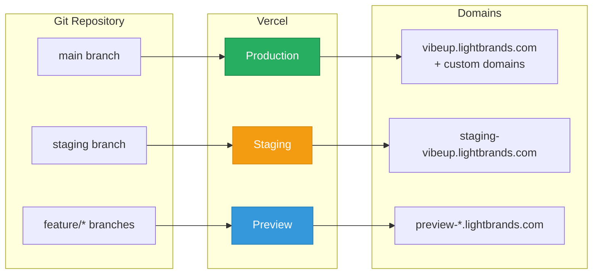

# Infrastructure Architecture: Subdomain & Domain Setup

> **Brands launch on lightbrands.com subdomains with seamless custom domain integration**

---

## Overview

Every brand in the AI Brand Factory deploys to a **lightbrands.com subdomain** by default, providing instant availability with zero DNS configuration. Brands can later integrate their own custom domains through a simple CNAME setup.



---

## Subdomain Structure

### Default Brand URLs

Every brand automatically receives a subdomain on `lightbrands.com`:

| Brand | Subdomain URL | Status |
|-------|---------------|--------|
| VibeUp | `vibeup.lightbrands.com` | Active |
| Love Token | `love-token.lightbrands.com` | Active |
| Chrono-Commune | `chrono-commune.lightbrands.com` | Active |
| Earth Weavers | `earth-weavers.lightbrands.com` | Planned |
| Light Brand Consulting | `consulting.lightbrands.com` | Planned |
| Solar AI Accelerator | `solar-ai.lightbrands.com` | Planned |
| Cho Ventures AI | `cho-ventures.lightbrands.com` | Planned |
| Sovereignty Series | `sovereignty.lightbrands.com` | Planned |
| Transformational Epicenter | `epicenter.lightbrands.com` | Planned |

### Environment Subdomains

Each brand also receives environment-specific subdomains:

```
Production:  vibeup.lightbrands.com
Staging:     staging-vibeup.lightbrands.com
Development: dev-vibeup.lightbrands.com
Preview:     preview-{branch}-vibeup.lightbrands.com
```

---

## Custom Domain Integration

### The Simple Path

Integrating a custom domain takes **3 minutes**:



### Step-by-Step Guide

#### Step 1: Add Domain in Vercel Dashboard

1. Navigate to brand's Vercel project
2. Go to **Settings** → **Domains**
3. Enter custom domain (e.g., `www.vibeup.app`)
4. Click **Add**

#### Step 2: Configure DNS at Registrar

Add a CNAME record pointing to the subdomain:

| Type | Name | Value | TTL |
|------|------|-------|-----|
| CNAME | www | `vibeup.lightbrands.com` | 300 |
| CNAME | @ (or A record) | `76.76.21.21` | 300 |

**For apex domains** (no www), use either:
- **A Record**: Point to Vercel's IP `76.76.21.21`
- **ALIAS/ANAME**: If your registrar supports it, point to the subdomain

#### Step 3: Automatic SSL

Vercel automatically provisions and renews SSL certificates via Let's Encrypt. No action required.

### Domain Configuration Examples

```yaml
# vibeup brand
domains:
  primary: vibeup.lightbrands.com
  custom:
    - www.vibeup.app
    - vibeup.app
    - www.vibeup.io
    - vibeup.io

# love-token brand
domains:
  primary: love-token.lightbrands.com
  custom:
    - www.lovetoken.io
    - lovetoken.io
    - www.love-token.com
    - love-token.com
```

---

## Technical Architecture

### Vercel Project Structure

Each brand deploys as a separate Vercel project under the Light Brands organization:

```
Light Brands (Vercel Team)
├── vibeup                    # vibeup.lightbrands.com
├── love-token                # love-token.lightbrands.com
├── chrono-commune            # chrono-commune.lightbrands.com
├── earth-weavers             # earth-weavers.lightbrands.com
├── light-brand-consulting    # consulting.lightbrands.com
├── solar-ai-accelerator      # solar-ai.lightbrands.com
├── cho-ventures-ai           # cho-ventures.lightbrands.com
├── sovereignty-series        # sovereignty.lightbrands.com
└── transformational-epicenter # epicenter.lightbrands.com
```

### DNS Configuration for lightbrands.com

Wildcard subdomain setup at the registrar:

```dns
# Wildcard CNAME for all brand subdomains
*.lightbrands.com.   300   IN   CNAME   cname.vercel-dns.com.

# Root domain
lightbrands.com.     300   IN   A       76.76.21.21

# WWW redirect
www.lightbrands.com. 300   IN   CNAME   cname.vercel-dns.com.
```

### Vercel Configuration Per Brand

Each brand's `vercel.json`:

```json
{
  "version": 2,
  "framework": "nextjs",
  "regions": ["iad1", "sfo1", "cdg1"],
  "headers": [
    {
      "source": "/(.*)",
      "headers": [
        { "key": "X-Frame-Options", "value": "DENY" },
        { "key": "X-Content-Type-Options", "value": "nosniff" },
        { "key": "Referrer-Policy", "value": "strict-origin-when-cross-origin" },
        { "key": "Permissions-Policy", "value": "camera=(), microphone=(), geolocation=()" }
      ]
    }
  ],
  "rewrites": [
    { "source": "/(.*)", "destination": "/$1" }
  ]
}
```

---

## Environment Variables

### Required for All Brands

```env
# Brand Identity
NEXT_PUBLIC_BRAND_SLUG=vibeup
NEXT_PUBLIC_BRAND_NAME="VibeUp"
NEXT_PUBLIC_PRIMARY_DOMAIN=vibeup.lightbrands.com

# Factory Integration
FACTORY_API_URL=https://api.lightbrands.com
FACTORY_API_KEY=<secret>

# Analytics (shared)
NEXT_PUBLIC_POSTHOG_KEY=<shared-key>
NEXT_PUBLIC_POSTHOG_HOST=https://analytics.lightbrands.com
```

### Environment-Specific

```env
# Production
NODE_ENV=production
NEXT_PUBLIC_ENVIRONMENT=production

# Staging
NODE_ENV=production
NEXT_PUBLIC_ENVIRONMENT=staging

# Development
NODE_ENV=development
NEXT_PUBLIC_ENVIRONMENT=development
```

---

## Deployment Flow

### Automatic Deployments



### Branch-to-Environment Mapping

| Branch | Environment | Domain Pattern |
|--------|-------------|----------------|
| `main` | Production | `{brand}.lightbrands.com` |
| `staging` | Staging | `staging-{brand}.lightbrands.com` |
| `feature/*` | Preview | `preview-{branch}-{brand}.lightbrands.com` |

---

## Custom Domain Checklist

### Before Launch

- [ ] Domain registered and accessible
- [ ] DNS access confirmed
- [ ] Vercel project created for brand
- [ ] Environment variables configured

### Domain Setup

- [ ] Add domain to Vercel project
- [ ] Configure CNAME record at registrar
- [ ] Wait for DNS propagation (5-30 minutes)
- [ ] Verify SSL certificate provisioned
- [ ] Test domain access

### Post-Launch

- [ ] Set up redirects (www ↔ non-www)
- [ ] Configure analytics for new domain
- [ ] Update brand documentation
- [ ] Notify stakeholders

---

## Monitoring & Health

### Uptime Monitoring

All brand domains are monitored via:

```yaml
monitors:
  - url: https://vibeup.lightbrands.com/api/health
    interval: 60s
    alerting:
      - email: ops@lightbrands.com
      - slack: #brand-alerts

  - url: https://www.vibeup.app/api/health
    interval: 60s
    alerting:
      - email: ops@lightbrands.com
```

### SSL Expiry Alerts

Vercel handles SSL renewal automatically, but we monitor expiry as backup:

```yaml
ssl_monitors:
  - domain: vibeup.lightbrands.com
    alert_days_before_expiry: 14
  - domain: www.vibeup.app
    alert_days_before_expiry: 14
```

---

## Troubleshooting

### Common Issues

| Issue | Cause | Solution |
|-------|-------|----------|
| Domain not resolving | DNS not propagated | Wait 30 min, check with `dig` |
| SSL error | CNAME incorrect | Verify CNAME points to correct subdomain |
| 404 on custom domain | Domain not added to Vercel | Add in Vercel dashboard |
| Mixed content warnings | HTTP resources on HTTPS | Update all URLs to HTTPS |

### Useful Commands

```bash
# Check DNS propagation
dig www.vibeup.app CNAME

# Check SSL certificate
openssl s_client -connect www.vibeup.app:443 -servername www.vibeup.app

# Test redirect behavior
curl -I https://vibeup.app
```

---

## Future Enhancements

### Phase 1 (Current)
- Manual custom domain setup via Vercel dashboard
- Wildcard subdomain for all brands

### Phase 2 (Q2 2026)
- Self-service domain configuration in brand admin
- Automatic DNS verification
- Domain health dashboard

### Phase 3 (Q3 2026)
- API-driven domain management
- Multi-region deployment with geo-routing
- Advanced traffic splitting for A/B testing

---

## Related Documents

| Document | Purpose |
|----------|---------|
| [Overview](./00-overview.md) | Core vision and architecture |
| [Launch Cadence](./02-launch-cadence.md) | Brand launch rhythm |
| [Council Integration](./04-council-integration-framework.md) | Governance for infrastructure decisions |

---

*Infrastructure that empowers instant presence while honoring brand sovereignty.*
