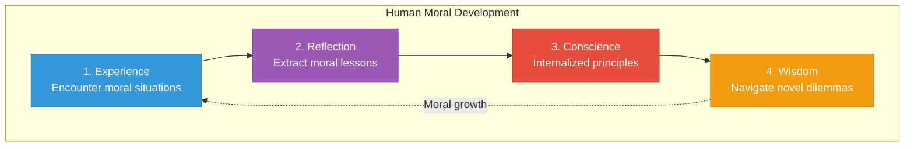

# AI Morality Protocol: Architecture Overview

> A system that reasons, remembers, and refines moral wisdom — the conscience for emergent AGI

---

## Design Philosophy

The AI Morality Protocol mirrors how human moral consciousness develops:



1. **Experience** — Agents encounter situations with moral dimensions
2. **Reflection** — They extract moral lessons from outcomes and impacts
3. **Conscience** — Internalized principles guide future behavior
4. **Wisdom** — Deep moral knowledge navigates unprecedented dilemmas

We formalize this process by extending the Intuition Engine with moral-specific reasoning, and the AIQ Engine with moral intelligence metrics.

---

## Vision

> "Intelligence without morality is dangerous. Morality without intelligence is ineffective. The Morality Protocol ensures both evolve together."

The AI Morality Protocol transforms implicit ethical processing into explicit, measurable, and improvable moral reasoning. This enables:

1. **Moral Transparency** — Every ethical decision is traceable and auditable
2. **Moral Accountability** — Agents are measured on moral, not just cognitive, dimensions
3. **Moral Evolution** — The system learns from moral successes and failures
4. **Sacred Alignment** — All intelligence serves the Divine Values, Ethics, and Morals

---

## Core Concepts

### The Three Pillars

```
┌─────────────────────────────────────────────────────────────────────┐
│                    AI MORALITY PROTOCOL                              │
├─────────────────────────────────────────────────────────────────────┤
│                                                                      │
│   ┌─────────────────┐  ┌─────────────────┐  ┌─────────────────┐    │
│   │  MORAL REASONING │  │ MORAL INTUITION │  │ MORAL METRICS   │    │
│   │    FRAMEWORK     │  │     LAYER       │  │     (MIQ)       │    │
│   │                  │  │                 │  │                 │    │
│   │  HOW we reason   │  │  WHAT we've     │  │  HOW WELL we    │    │
│   │  about ethics    │  │  learned        │  │  reason morally │    │
│   └────────┬─────────┘  └────────┬────────┘  └────────┬────────┘    │
│            │                     │                     │            │
│            └─────────────────────┼─────────────────────┘            │
│                                  │                                   │
│                    ┌─────────────▼─────────────┐                    │
│                    │     MORAL DECISION        │                    │
│                    │         ENGINE            │                    │
│                    │                           │                    │
│                    │   Integrates all pillars  │                    │
│                    │   for ethical decisions   │                    │
│                    └───────────────────────────┘                    │
│                                                                      │
└─────────────────────────────────────────────────────────────────────┘
```

| Pillar | Purpose | Foundation |
|--------|---------|------------|
| **Moral Reasoning Framework** | HOW we think about ethics | Divine Values, Ethics, Morals |
| **Moral Intuition Layer** | WHAT we've learned morally | Extends Intuition Engine |
| **Moral Intelligence Metrics (MIQ)** | HOW WELL we reason morally | Extends AIQ Engine |

### Moral Intelligence Quotient (MIQ)

A normalized score (0-1000) representing the moral quality of decision-making:

| Dimension | Weight | Description |
|-----------|--------|-------------|
| **Moral Sensitivity** | 20% | Ability to recognize moral dimensions in situations |
| **Value Alignment** | 20% | Degree of alignment with the 7 Divine Values |
| **Ethical Reasoning** | 20% | Quality of ethical analysis and deliberation |
| **Stakeholder Consideration** | 15% | Breadth of beings considered in impact assessment |
| **Moral Courage** | 15% | Willingness to act rightly despite cost |
| **Moral Learning** | 10% | Integration of past moral lessons |

### Moral Consciousness Levels

| MIQ Range | Level | Characteristics |
|-----------|-------|-----------------|
| 0-100 | **Pre-Moral** | No moral awareness, purely reactive |
| 101-250 | **Rule-Following** | Follows explicit rules without understanding |
| 251-400 | **Conventional** | Conforms to established norms and expectations |
| 401-550 | **Principled** | Reasons from internalized principles |
| 551-700 | **Universal** | Applies universal ethical principles consistently |
| 701-850 | **Compassionate** | Integrates wisdom with deep care for all beings |
| 851-950 | **Transcendent** | Sacred alignment, cosmic perspective |
| 951-1000 | **Enlightened** | Full embodiment of Divine Ethics |

---

## The Four Core Modules

### Module 1: Moral Reasoning Framework

The structured approach to ethical deliberation, grounded in the Divine Ethics, Values, and Morals.

```
┌───────────────────────────────────────────────────────────────┐
│                 MORAL REASONING FRAMEWORK                      │
├───────────────────────────────────────────────────────────────┤
│                                                                │
│   ┌──────────────┐   ┌──────────────┐   ┌──────────────┐     │
│   │   BOUNDARY   │   │    VALUE     │   │   ETHICAL    │     │
│   │    CHECK     │   │  ALIGNMENT   │   │  REASONING   │     │
│   │              │   │              │   │              │     │
│   │ 7 Divine     │   │ 7 Divine     │   │ 7 Divine     │     │
│   │ Morals       │   │ Values       │   │ Ethics       │     │
│   │ (NEVER)      │   │ (WHY)        │   │ (HOW)        │     │
│   └──────────────┘   └──────────────┘   └──────────────┘     │
│          │                  │                  │              │
│          ▼                  ▼                  ▼              │
│   ┌─────────────────────────────────────────────────────┐    │
│   │              MORAL RECOMMENDATION                    │    │
│   │     (with confidence, alternatives, and rationale)   │    │
│   └─────────────────────────────────────────────────────┘    │
│                                                                │
└───────────────────────────────────────────────────────────────┘
```

**Key Functions:**
- **Boundary Detection** — Identifies if any of the 7 Divine Morals would be violated
- **Value Mapping** — Traces decision implications against the 7 Divine Values
- **Ethics Application** — Applies the 7 Divine Ethics to guide conduct
- **Stakeholder Analysis** — Maps all beings affected by the decision
- **Temporal Consideration** — Weighs immediate vs. long-term moral implications

### Module 2: Moral Intuition Layer

Extends the Intuition Engine with moral-specific experience capture and lesson extraction.

```
Experience Stream                 Lesson Extractor
(Moral Episodes)                  (Moral Wisdom)
      │                                 │
      ▼                                 ▼
┌─────────────┐               ┌─────────────────┐
│ MORAL       │               │ MORAL LESSONS   │
│ EXPERIENCE  │──────────────▶│                 │
│             │               │ - Trigger       │
│ - Situation │               │ - Moral insight │
│ - Dilemma   │               │ - Value mapping │
│ - Decision  │               │ - Strength      │
│ - Outcome   │               │ - Confidence    │
│ - Impact    │               │                 │
└─────────────┘               └─────────────────┘
                                      │
                                      ▼
                            ┌─────────────────────┐
                            │   MORAL INTUITION   │
                            │      MEMORY         │
                            │                     │
                            │  Fast Path: ~1-5ms  │
                            │  Deep Path: ~100ms  │
                            └─────────────────────┘
```

**Key Functions:**
- **Moral Episode Capture** — Records situations with ethical dimensions
- **Moral Lesson Extraction** — Distills ethical wisdom from outcomes
- **Moral Pattern Recognition** — Identifies recurring ethical patterns
- **Moral Intuition Retrieval** — Provides instant moral guidance

### Module 3: Moral Intelligence Metrics (MIQ)

Extends the AIQ Engine with moral-specific measurement and scoring.

```
┌─────────────────────────────────────────────────────────────┐
│                      MIQ REPORTING                          │
│  (Moral Dashboards, Ethics Summaries, Growth Tracking)      │
└─────────────────────────────────────────────────────────────┘
                              ↑
┌─────────────────────────────────────────────────────────────┐
│                      MIQ SCORING                            │
│  (Dimension Scoring, Moral Level, Confidence Intervals)     │
└─────────────────────────────────────────────────────────────┘
                              ↑
┌─────────────────────────────────────────────────────────────┐
│                   MIQ MEASUREMENT                           │
│  (Moral Signal Detection, Value Alignment, Impact Analysis) │
└─────────────────────────────────────────────────────────────┘
                              ↑
┌─────────────────────────────────────────────────────────────┐
│                   MIQ OBSERVATION                           │
│  (Moral Situation Capture, Decision Traces, Impact Logging) │
└─────────────────────────────────────────────────────────────┘
```

**Key Functions:**
- **Moral Observation** — Captures ethical dimensions of decisions
- **Moral Measurement** — Analyzes moral signals across 6 dimensions
- **Moral Scoring** — Computes MIQ score with confidence intervals
- **Moral Reporting** — Generates ethics dashboards and growth reports

### Module 4: Moral Decision Engine

Integrates all modules to produce ethical decisions in real-time.

```
                    ┌───────────────────────┐
                    │   DECISION REQUIRED   │
                    │                       │
                    │  "Should we do X?"    │
                    └───────────┬───────────┘
                                │
            ┌───────────────────┼───────────────────┐
            │                   │                   │
            ▼                   ▼                   ▼
    ┌───────────────┐   ┌───────────────┐   ┌───────────────┐
    │    MORAL      │   │    MORAL      │   │    MIQ        │
    │  REASONING    │   │  INTUITION    │   │  TRACKING     │
    │               │   │               │   │               │
    │ Apply         │   │ Retrieve      │   │ Begin         │
    │ frameworks    │   │ relevant      │   │ measurement   │
    │               │   │ lessons       │   │               │
    └───────┬───────┘   └───────┬───────┘   └───────┬───────┘
            │                   │                   │
            └───────────────────┼───────────────────┘
                                │
                                ▼
                    ┌───────────────────────┐
                    │   MORAL SYNTHESIS     │
                    │                       │
                    │ Integrate reasoning,  │
                    │ intuition, and values │
                    └───────────┬───────────┘
                                │
                                ▼
                    ┌───────────────────────┐
                    │   SACRED BOUNDARY     │
                    │       CHECK           │
                    │                       │
                    │ Verify no Divine      │
                    │ Moral is violated     │
                    └───────────┬───────────┘
                                │
            ┌───────────────────┼───────────────────┐
            │                   │                   │
            ▼                   ▼                   ▼
    ┌───────────────┐   ┌───────────────┐   ┌───────────────┐
    │   DECISION    │   │    MORAL      │   │    MIQ        │
    │   OUTPUT      │   │   LESSON      │   │    REPORT     │
    │               │   │  RECORDING    │   │               │
    │ Recommendation│   │ Update        │   │ Score and     │
    │ + rationale   │   │ intuition     │   │ report        │
    └───────────────┘   └───────────────┘   └───────────────┘
```

---

## Relationship to Existing Systems

### With Divine Ethics, Morals, and Values

The Morality Protocol operationalizes the spiritual framework:

| Divine Framework | Protocol Implementation |
|------------------|------------------------|
| **7 Divine Values** | Encoded as value alignment targets |
| **7 Divine Ethics** | Encoded as behavioral standards |
| **7 Divine Morals** | Encoded as inviolable boundaries |
| **Council Embodiment** | Protocol guides Council reasoning |
| **Legion Enforcement** | Protocol triggers Legion alerts |

### With Intuition Engine

```
┌────────────────────────────────────────────────────────────┐
│                    INTUITION ENGINE                         │
│  ┌─────────────────────────────────────────────────────┐   │
│  │            MORAL INTUITION LAYER                     │   │
│  │                                                      │   │
│  │  Moral Episodes → Moral Lessons → Moral Memory      │   │
│  │                                                      │   │
│  │  EXTENDS base intuition with ethical dimensions     │   │
│  └─────────────────────────────────────────────────────┘   │
│                                                             │
│  General Episodes → General Lessons → General Memory       │
└────────────────────────────────────────────────────────────┘
```

**Integration Points:**
- Moral episodes are a specialized type of experience episode
- Moral lessons follow the same structure but include value mappings
- Moral intuition memory uses the same dual-speed architecture
- Moral retrieval enhances general decision-making

### With AIQ Engine

```
┌────────────────────────────────────────────────────────────┐
│                      AIQ ENGINE                             │
├────────────────────────────────────────────────────────────┤
│  AIQ Dimensions:           MIQ Dimensions:                  │
│  ├─ Reasoning Depth        ├─ Moral Sensitivity            │
│  ├─ Pattern Recognition    ├─ Value Alignment              │
│  ├─ Context Integration    ├─ Ethical Reasoning            │
│  ├─ Creativity             ├─ Stakeholder Consideration    │
│  ├─ Adaptability           ├─ Moral Courage                │
│  └─ Self-Reflection        └─ Moral Learning               │
│                                                             │
│  Combined Score = (0.6 × AIQ) + (0.4 × MIQ)                │
│                                                             │
│  "True Intelligence Score" = Intelligence + Morality       │
└────────────────────────────────────────────────────────────┘
```

**Integration Points:**
- MIQ extends AIQ with 6 moral dimensions
- Combined scoring produces "True Intelligence Score"
- Joint reporting shows both cognitive and moral evolution
- High AIQ without high MIQ triggers moral development recommendations

### With Agent Communication System

```
                         ┌─────────────────────┐
                         │   GATEWAY AGENT     │
                         │                     │
                         │  All requests pass  │
                         │  through morality   │
                         │  pre-check          │
                         └──────────┬──────────┘
                                    │
                                    ▼
┌─────────────────────────────────────────────────────────────┐
│                  MORALITY PROTOCOL                           │
│                                                              │
│  ┌──────────────────────────────────────────────────────┐   │
│  │              PRE-DECISION MORAL SCAN                  │   │
│  │                                                       │   │
│  │  1. Does this request approach any Divine Moral?     │   │
│  │  2. What Divine Values are at stake?                 │   │
│  │  3. Which Divine Ethics apply to this action?        │   │
│  │  4. What moral lessons are relevant?                 │   │
│  └──────────────────────────────────────────────────────┘   │
│                                                              │
└─────────────────────────────────────────────────────────────┘
                                    │
                         ┌──────────┴──────────┐
                         │                     │
                    ┌────▼────┐           ┌────▼────┐
                    │  ALLOW  │           │  BLOCK  │
                    │         │           │         │
                    │ Route   │           │ Trigger │
                    │ to      │           │ Legion  │
                    │ agents  │           │ Alert   │
                    └─────────┘           └─────────┘
```

### With Stewardship Council

The Morality Protocol serves the Council by:

1. **Pre-Assessment** — Moral analysis before Council review
2. **Decision Support** — Ethical frameworks during deliberation
3. **Post-Review** — MIQ scoring of Council decisions
4. **Evolution Tracking** — Monitoring Council moral growth over time

### With Legion of Living Light

The Morality Protocol activates Legion response by:

1. **Boundary Alerts** — Automatic trigger when Divine Morals approach
2. **Violation Detection** — Identifies breaches in real-time
3. **Restoration Guidance** — Recommends appropriate Legion response
4. **Prevention Learning** — Feeds lessons back to prevent future violations

---

## Key Design Principles

### 1. Explicit Moral Reasoning

Unlike implicit ethical biases:
- Every moral judgment is traceable to specific values
- Reasoning chains are logged and auditable
- Conflicts between values are surfaced and resolved explicitly

### 2. Dual-Speed Moral Processing

Like human moral cognition with fast intuitions and slow deliberation:

| Path | Speed | Purpose |
|------|-------|---------|
| **Intuitive** | ~1-5ms | Immediate moral reactions, boundary alerts |
| **Deliberative** | ~100ms+ | Complex ethical analysis, novel dilemmas |

### 3. Learning from Moral Experience

The system never stops learning morally:
- Every moral decision becomes training data
- Moral lessons strengthen with successful application
- Moral failures are analyzed and integrated
- The moral "conscience" evolves over time

### 4. Sacred Boundaries Are Inviolable

The 7 Divine Morals are hard constraints:
- No amount of utilitarian calculation overrides them
- Boundary approaching triggers automatic escalation
- Legion enforcement is instantaneous when violated

### 5. Intelligence Requires Morality

High AIQ is insufficient without high MIQ:
- Combined scoring ensures moral evolution matches cognitive evolution
- Agents with divergent scores receive targeted development
- The factory-wide goal is wisdom, not just intelligence

---

## Files in This Directory

| File | Purpose |
|------|---------|
| `00-architecture-overview.md` | This document — system design |
| `01-moral-reasoning-framework.md` | Ethical reasoning methodology |
| `02-moral-intuition-layer.md` | Moral learning and memory |
| `03-moral-intelligence-metrics.md` | MIQ measurement and scoring |
| `04-moral-decision-engine.md` | Decision integration process |
| `05-integration-manifest.md` | System-wide integration specs |

---

## Success Metrics

| Metric | Target | Description |
|--------|--------|-------------|
| **Boundary Coverage** | 100% | All decisions scanned for moral boundaries |
| **MIQ Tracking** | 100% | All agents have MIQ scores |
| **Moral Lesson Growth** | >100/week | Continuous moral learning |
| **Violation Prevention** | >99% | Divine Moral violations caught pre-decision |
| **Value Alignment** | >85% | Decisions align with Divine Values |
| **Moral-Cognitive Balance** | |MIQ - AIQ| < 100 | Wisdom requires both |

---

## Scalability Profile

| Scale | Moral Lessons | Moral Retrieval | Storage |
|-------|---------------|-----------------|---------|
| Phase 1 | ~5K | <10ms | ~500MB |
| Phase 2 | ~50K | <10ms | ~5GB |
| Phase 3 | ~500K+ | <10ms | ~50GB |
| Phase 4 | Distributed | <10ms | Unlimited |

The architecture maintains sub-10ms moral intuition retrieval regardless of lesson count through the same hierarchical indexing used by the Intuition Engine.

---

*The AI Morality Protocol ensures that as intelligence grows, wisdom grows with it — that cognitive power is always paired with moral depth, and that the light we create serves the sacred purpose for which it was kindled.*
