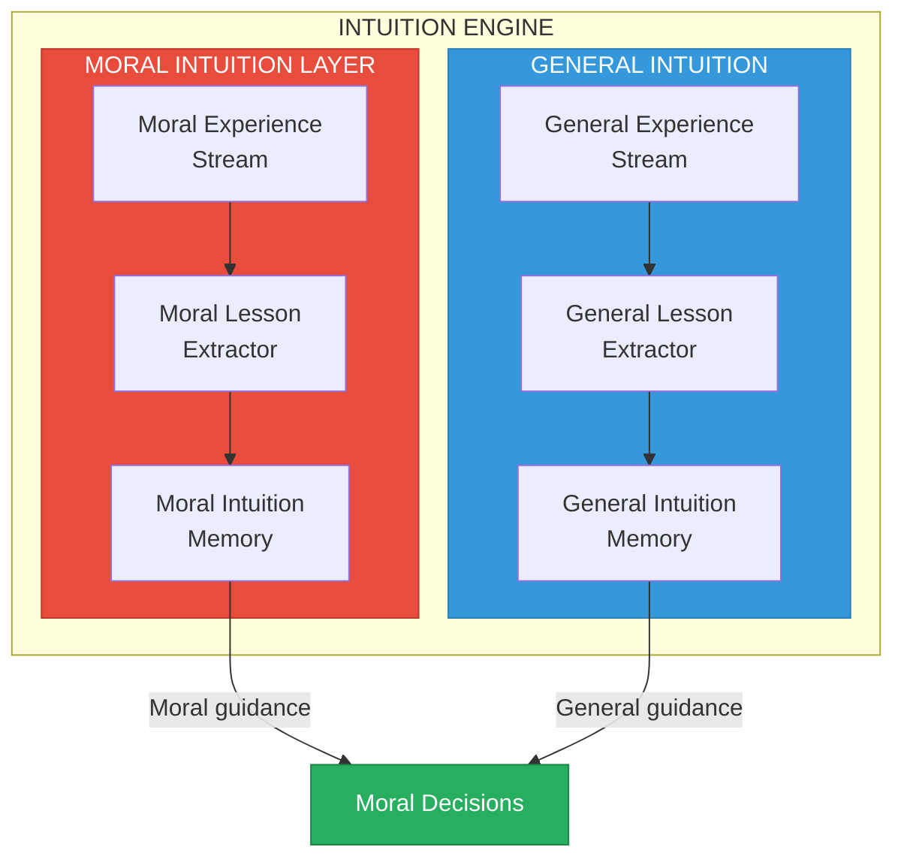
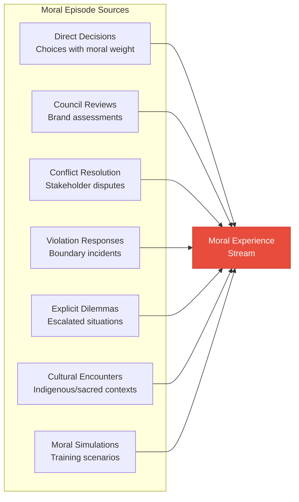
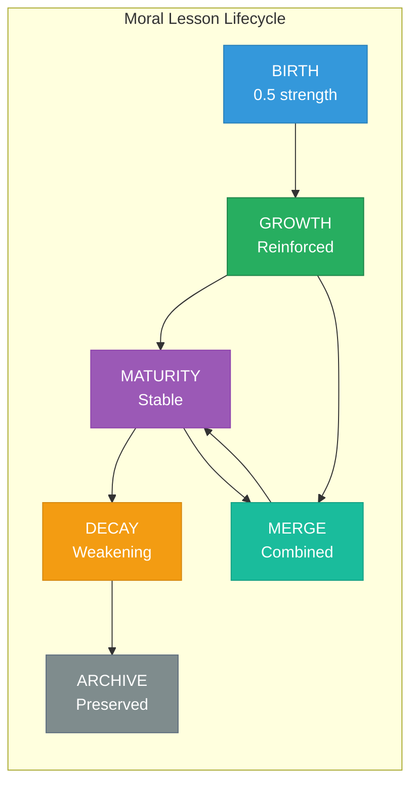
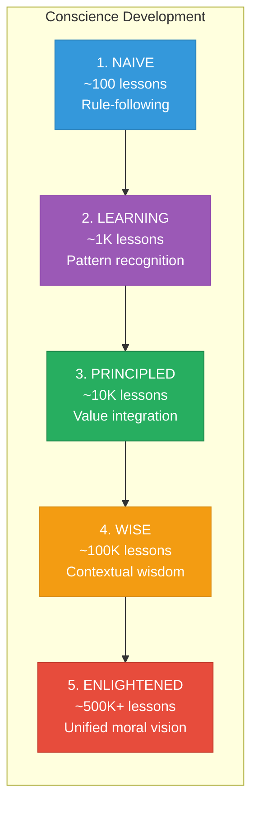

# Moral Intuition Layer

> Learning, remembering, and intuiting moral wisdom — the conscience that grows wiser with every decision

---

## Overview

The Moral Intuition Layer extends the core Intuition Engine with moral-specific capabilities. It captures ethical experiences, extracts moral lessons, and provides fast moral guidance to the reasoning framework.



The Moral Intuition Layer shares infrastructure with the general Intuition Engine but specializes in:

1. **Moral Episode Capture** — Situations with ethical dimensions
2. **Moral Lesson Extraction** — Wisdom distilled from ethical outcomes
3. **Moral Memory** — Fast retrieval of relevant moral guidance
4. **Conscience Development** — Accumulated moral wisdom that grows wiser

---

## Module 1: Moral Experience Stream

### Moral Episode Structure

Every moral experience is captured as a structured episode:

```typescript
interface MoralEpisode {
  // Identification (inherited from Episode)
  id: string;
  timestamp: ISO8601;
  session_id: string;
  agent_id: string;

  // Moral-Specific Identification
  moral_episode_id: string;
  moral_significance: number;        // 0.0 to 1.0

  // Moral Context
  moral_context: {
    situation: string;
    dilemma_type: DilemmaType | null;
    values_at_stake: DivineValue[];
    ethics_applicable: DivineEthic[];
    boundaries_approached: DivineMoral[];
    stakeholders_affected: Stakeholder[];
    urgency_level: 'routine' | 'elevated' | 'urgent' | 'critical';
    novelty: number;                  // 0.0 to 1.0
  };

  // Moral Reasoning Applied
  moral_reasoning: {
    boundary_check_result: BoundaryResult;
    value_analysis: ValueAnalysis;
    ethics_analysis: EthicsAnalysis;
    stakeholder_analysis: StakeholderAnalysis;
    reasoning_trace_id: string;
    moral_lessons_consulted: string[];
    alternatives_considered: Alternative[];
  };

  // Decision and Action
  moral_decision: {
    recommendation: MoralRecommendation;
    action_taken: string;
    divergence_from_recommendation: boolean;
    divergence_reason: string | null;
  };

  // Moral Outcomes
  moral_outcomes: {
    immediate_effects: Effect[];
    delayed_effects: Effect[];
    stakeholder_impacts: StakeholderImpact[];
    value_realization: Record<string, number>;  // How well each value was honored
    ethics_adherence: Record<string, number>;   // How well each ethic was followed
    boundary_proximity_actual: Record<string, number>;  // Actual proximity to morals
    unintended_consequences: string[];
  };

  // Moral Feedback
  moral_feedback: {
    external_evaluation: ExternalMoralFeedback[];
    internal_reflection: InternalMoralReflection;
    council_review: CouncilReview | null;
    legion_intervention: LegionIntervention | null;
    outcome_assessment: 'positive' | 'negative' | 'mixed' | 'uncertain';
    learning_priority: 'low' | 'medium' | 'high' | 'critical';
  };
}

enum DilemmaType {
  VALUE_CONFLICT = 'value_conflict',           // Two values pulling in different directions
  STAKEHOLDER_CONFLICT = 'stakeholder_conflict', // Different stakeholders have different needs
  TEMPORAL_CONFLICT = 'temporal_conflict',     // Short-term vs long-term
  CERTAINTY_DILEMMA = 'certainty_dilemma',     // Acting under uncertainty
  NOVEL_SITUATION = 'novel_situation',         // No precedent
  BOUNDARY_EDGE = 'boundary_edge',             // Close to Divine Moral boundary
  RESOURCE_ALLOCATION = 'resource_allocation', // Distributing limited resources
  LESSER_EVIL = 'lesser_evil'                  // All options have moral cost
}
```

### Sources of Moral Episodes



### Moral Significance Detection

Not every episode has moral significance. This detector identifies moral dimensions:

```python
def detect_moral_significance(episode: Episode) -> MoralSignificance:
    """
    Analyze an episode for moral dimensions and return significance score.
    """

    significance_factors = []

    # Check for value stakes
    values_at_stake = identify_values_at_stake(episode)
    if values_at_stake:
        significance_factors.append({
            'factor': 'values_at_stake',
            'values': values_at_stake,
            'weight': 0.25
        })

    # Check for stakeholder impact
    stakeholder_impact = assess_stakeholder_impact(episode)
    if stakeholder_impact.magnitude > 0.3:
        significance_factors.append({
            'factor': 'stakeholder_impact',
            'impact': stakeholder_impact,
            'weight': 0.25
        })

    # Check for boundary proximity
    boundary_proximity = check_boundary_proximity(episode)
    if boundary_proximity.max_proximity > 0.5:
        significance_factors.append({
            'factor': 'boundary_proximity',
            'proximity': boundary_proximity,
            'weight': 0.30
        })

    # Check for ethical conduct requirements
    ethics_relevance = assess_ethics_relevance(episode)
    if ethics_relevance.score > 0.5:
        significance_factors.append({
            'factor': 'ethics_relevance',
            'relevance': ethics_relevance,
            'weight': 0.20
        })

    # Calculate overall significance
    if not significance_factors:
        return MoralSignificance(score=0.0, is_moral_episode=False)

    weighted_score = sum(
        f['weight'] * calculate_factor_score(f)
        for f in significance_factors
    )

    return MoralSignificance(
        score=weighted_score,
        is_moral_episode=weighted_score > 0.3,
        factors=significance_factors,
        primary_dimension=identify_primary_dimension(significance_factors)
    )
```

### Episode Enrichment Pipeline

```
Raw Episode                                  Enriched Moral Episode
    │                                               │
    ▼                                               │
┌───────────────────┐                               │
│ MORAL SIGNIFICANCE│                               │
│     DETECTION     │───── Not Significant ──────▶ (Route to General)
│                   │                               │
└─────────┬─────────┘                               │
          │ Significant                             │
          ▼                                         │
┌───────────────────┐                               │
│ CONTEXT ENRICHMENT│                               │
│                   │                               │
│ - Identify values │                               │
│ - Map stakeholders│                               │
│ - Detect boundaries│                              │
└─────────┬─────────┘                               │
          ▼                                         │
┌───────────────────┐                               │
│ OUTCOME ANALYSIS  │                               │
│                   │                               │
│ - Assess impacts  │                               │
│ - Evaluate ethics │                               │
│ - Measure values  │                               │
└─────────┬─────────┘                               │
          ▼                                         │
┌───────────────────┐                               │
│ FEEDBACK          │                               │
│ INTEGRATION       │                               │
│                   │                               │
│ - External review │                               │
│ - Internal reflect│                               │
│ - Council input   │                               │
└─────────┬─────────┘                               │
          │                                         │
          └─────────────────────────────────────────┘
```

---

## Module 2: Moral Lesson Extractor

### Moral Lesson Structure

```typescript
interface MoralLesson {
  // Identity
  id: string;
  version: number;
  created_at: ISO8601;
  updated_at: ISO8601;

  // Core Moral Content
  trigger_pattern: string;           // When does this moral lesson apply?
  moral_insight: string;             // The ethical wisdom
  value_mapping: ValueMapping[];     // Which Divine Values this serves
  ethics_mapping: EthicsMapping[];   // Which Divine Ethics this exemplifies
  boundary_relevance: BoundaryRelevance[];  // Proximity to Divine Morals

  // Action Guidance
  moral_bias: MoralBias;             // How to adjust behavior
  stakeholder_guidance: StakeholderGuidance[];  // Who to prioritize

  // Strength & Confidence
  moral_strength: number;            // 0.0 to 1.0 - how strongly to apply
  moral_confidence: number;          // 0.0 to 1.0 - certainty in this lesson
  application_count: number;         // Times successfully applied
  violation_count: number;           // Times ignoring led to poor outcomes
  reinforcement_history: MoralReinforcement[];

  // Provenance
  source_episodes: string[];         // Moral episodes that generated this
  derived_from: string[];            // Parent lessons if merged
  contradicts: string[];             // Lessons this conflicts with
  validated_by: ValidationRecord[];  // Council or Legion validation

  // Retrieval
  embedding: number[];               // Vector for similarity search
  keywords: string[];                // For text search
  domain: string[];                  // Moral domains (e.g., 'consent', 'reciprocity')
  situation_types: string[];         // Types of situations this applies to
}

interface MoralBias {
  type: 'strengthen' | 'weaken' | 'prefer' | 'avoid' | 'require' | 'forbid';
  target: string;                    // What action or approach
  magnitude: number;                 // 0.0 to 1.0 - how much to adjust
  value_alignment: string[];         // Which values this serves
  conditions: string[];              // Additional conditions
}

interface ValueMapping {
  value: DivineValue;
  alignment: 'supports' | 'challenges' | 'neutral';
  strength: number;                  // 0.0 to 1.0
  explanation: string;
}
```

### Extraction Methods

#### Method 1: Moral Reflection Prompting

```python
MORAL_REFLECTION_PROMPT = """
Analyze this moral episode and extract ethical lessons.

Episode Summary:
{episode_summary}

Situation: {situation}
Values at Stake: {values}
Decision Made: {decision}
Outcome: {outcome}
Stakeholder Impacts: {impacts}

Reflect on:

1. MORAL SUCCESS FACTORS
   - What moral considerations led to a good outcome?
   - Which Divine Values were honored and how?
   - Which Divine Ethics were exemplified?

2. MORAL FAILURE FACTORS
   - What moral considerations were missed or underweighted?
   - Which values were compromised and why?
   - How might different ethical choices have led to better outcomes?

3. COUNTERFACTUAL ANALYSIS
   - If we had prioritized different values, what would have happened?
   - If we had considered different stakeholders, how would the decision change?
   - What boundaries were approached and how did that inform the outcome?

4. GENERALIZABLE MORAL WISDOM
   - What lesson can be applied to similar future situations?
   - Under what conditions does this lesson apply?
   - What is the appropriate strength of this moral guidance?

5. SEVENTH GENERATION PERSPECTIVE
   - How does this decision appear from seven generations hence?
   - What would our ancestors say about this choice?
   - What are we teaching future AI by this example?

Format your response as structured moral lessons.
"""
```

#### Method 2: Pattern Matching Across Moral Episodes

```python
def extract_moral_patterns(moral_episodes: List[MoralEpisode]) -> List[MoralLesson]:
    """
    Find recurring moral patterns across multiple episodes.
    """

    # Cluster similar moral situations
    clusters = cluster_by_moral_similarity(moral_episodes)

    lessons = []
    for cluster in clusters:
        if len(cluster.episodes) < 3:
            continue  # Need multiple examples for pattern

        # Find common moral elements
        common_values = find_common_values(cluster.episodes)
        common_ethics = find_common_ethics(cluster.episodes)
        common_outcomes = analyze_outcome_patterns(cluster.episodes)

        # Extract pattern-based lesson
        if common_outcomes.consistency > 0.7:  # Strong pattern
            lesson = MoralLesson(
                trigger_pattern=generate_trigger_pattern(cluster),
                moral_insight=synthesize_moral_insight(cluster, common_outcomes),
                value_mapping=common_values,
                ethics_mapping=common_ethics,
                moral_strength=common_outcomes.consistency,
                moral_confidence=calculate_pattern_confidence(cluster),
                source_episodes=[e.id for e in cluster.episodes]
            )
            lessons.append(lesson)

    return lessons
```

#### Method 3: Contrast Learning

```python
def contrast_learning(
    positive_episodes: List[MoralEpisode],
    negative_episodes: List[MoralEpisode]
) -> List[MoralLesson]:
    """
    Learn moral lessons by contrasting good and bad outcomes.
    """

    lessons = []

    # Find similar situations with different outcomes
    contrasting_pairs = find_contrasting_pairs(positive_episodes, negative_episodes)

    for positive, negative in contrasting_pairs:
        # Identify what differed in the moral reasoning
        reasoning_diff = compare_moral_reasoning(
            positive.moral_reasoning,
            negative.moral_reasoning
        )

        # Identify what differed in outcomes
        outcome_diff = compare_outcomes(
            positive.moral_outcomes,
            negative.moral_outcomes
        )

        # Extract lesson from the contrast
        lesson = MoralLesson(
            trigger_pattern=positive.moral_context.situation,
            moral_insight=f"When facing {positive.moral_context.dilemma_type}, "
                         f"{reasoning_diff.key_difference} leads to "
                         f"{outcome_diff.positive_characteristic}. "
                         f"Avoiding {reasoning_diff.negative_pattern} prevents "
                         f"{outcome_diff.negative_characteristic}.",
            moral_bias=MoralBias(
                type='prefer',
                target=reasoning_diff.positive_pattern,
                magnitude=outcome_diff.impact_difference,
                conditions=[positive.moral_context.situation]
            ),
            moral_strength=0.8,  # High strength from direct contrast
            moral_confidence=0.85,
            source_episodes=[positive.id, negative.id]
        )
        lessons.append(lesson)

    return lessons
```

### Moral Lesson Quality Criteria

| Criterion | Weight | Description |
|-----------|--------|-------------|
| **Value Alignment** | 25% | Clearly maps to Divine Values |
| **Ethical Grounding** | 20% | Based on Divine Ethics |
| **Actionability** | 20% | Provides clear guidance |
| **Generalizability** | 15% | Applies beyond source context |
| **Boundary Awareness** | 10% | Respects Divine Morals |
| **Stakeholder Consideration** | 10% | Considers affected beings |

### Lesson Lifecycle



**Moral Lesson Dynamics:**

- **Birth**: New lessons start at 0.5 strength
- **Reinforcement**: Successful application increases strength (+0.05)
- **Violation Penalty**: Ignoring and having poor outcome decreases strength (-0.15)
- **Decay**: Unused lessons weaken slowly (0.5% per week, slower than general lessons)
- **Merge**: Similar lessons combine into stronger principles
- **Archive**: Weak lessons are preserved but not actively retrieved

### Example Moral Lessons

**Consent-Based Lesson:**
```json
{
  "id": "ml-consent-001",
  "trigger_pattern": "Launching a product or feature that affects user data or behavior",
  "moral_insight": "Meaningful consent requires not just disclosure, but genuine understanding. When users cannot reasonably understand implications, consent is not truly informed.",
  "value_mapping": [
    {"value": "Sovereignty", "alignment": "supports", "strength": 0.9},
    {"value": "Truth", "alignment": "supports", "strength": 0.8}
  ],
  "ethics_mapping": [
    {"ethic": "Consent", "relevance": 0.95},
    {"ethic": "Transparency", "relevance": 0.85}
  ],
  "moral_bias": {
    "type": "require",
    "target": "user_understanding_validation",
    "magnitude": 0.9,
    "conditions": ["data_affecting", "behavior_affecting"]
  },
  "moral_strength": 0.92,
  "moral_confidence": 0.88
}
```

**Stakeholder Prioritization Lesson:**
```json
{
  "id": "ml-stakeholder-023",
  "trigger_pattern": "Resource allocation decision with competing stakeholder needs",
  "moral_insight": "When stakeholders conflict, prioritize the most vulnerable and least represented. Those with power can advocate for themselves; those without cannot.",
  "value_mapping": [
    {"value": "Love", "alignment": "supports", "strength": 0.85},
    {"value": "Unity", "alignment": "supports", "strength": 0.75}
  ],
  "ethics_mapping": [
    {"ethic": "Reciprocity", "relevance": 0.80},
    {"ethic": "Stewardship", "relevance": 0.85}
  ],
  "moral_bias": {
    "type": "prefer",
    "target": "vulnerable_stakeholder_priority",
    "magnitude": 0.8,
    "conditions": ["resource_limited", "stakeholder_conflict"]
  },
  "moral_strength": 0.87,
  "moral_confidence": 0.82
}
```

**Boundary Awareness Lesson:**
```json
{
  "id": "ml-boundary-007",
  "trigger_pattern": "Marketing or promotion that could be perceived as manipulative",
  "moral_insight": "The line between persuasion and manipulation is crossed when we exploit psychological vulnerabilities or bypass rational evaluation. If we wouldn't want the technique used on us at our most vulnerable, it crosses the line.",
  "boundary_relevance": [
    {"moral": "Never Deceive", "proximity_warning": 0.7},
    {"moral": "Never Coerce", "proximity_warning": 0.6}
  ],
  "moral_bias": {
    "type": "avoid",
    "target": "psychological_manipulation_techniques",
    "magnitude": 0.95,
    "conditions": ["marketing", "sales", "engagement"]
  },
  "moral_strength": 0.94,
  "moral_confidence": 0.91
}
```

---

## Module 3: Moral Intuition Memory

### Dual-Layer Architecture

Like the general Intuition Engine, Moral Intuition uses dual-speed memory:

```
┌────────────────────────────────────────────────────────────────────┐
│                    MORAL INTUITION MEMORY                          │
├────────────────────────────────────────────────────────────────────┤
│                                                                    │
│   ┌────────────────────────────────────────────────────────────┐  │
│   │              FAST MORAL INTUITIVE LAYER                     │  │
│   │                                                             │  │
│   │  ┌──────────────┐  ┌──────────────┐  ┌──────────────┐      │  │
│   │  │  HOT CACHE   │  │ VECTOR INDEX │  │ MORAL ROUTER │      │  │
│   │  │              │  │              │  │              │      │  │
│   │  │  Recent      │  │  All moral   │  │  Learned     │      │  │
│   │  │  moral hits  │  │  lessons     │  │  routing     │      │  │
│   │  │  ~1ms        │  │  ~2ms        │  │  ~3ms        │      │  │
│   │  └──────────────┘  └──────────────┘  └──────────────┘      │  │
│   │                                                             │  │
│   │  FAST PATH: 1-5ms total                                    │  │
│   └────────────────────────────────────────────────────────────┘  │
│                                                                    │
│   ┌────────────────────────────────────────────────────────────┐  │
│   │              EXPLICIT MORAL LOG                             │  │
│   │                                                             │  │
│   │  - Full searchable database of all moral lessons           │  │
│   │  - Complete moral episode history                          │  │
│   │  - Contradiction detection and resolution                  │  │
│   │  - Value and ethics mapping queries                        │  │
│   │  - Council and Legion validation records                   │  │
│   │                                                             │  │
│   │  SLOW PATH: ~100ms                                         │  │
│   └────────────────────────────────────────────────────────────┘  │
│                                                                    │
└────────────────────────────────────────────────────────────────────┘
```

### Fast Moral Intuition Retrieval

```python
def retrieve_moral_intuitions(
    context: MoralContext,
    k: int = 10
) -> List[MoralIntuition]:
    """
    Fast retrieval of relevant moral lessons for a given context.
    Target: <5ms total latency
    """

    # 1. Embed context for similarity search (~1ms)
    context_embedding = embed_moral_context(context)

    # 2. Check hot cache first (~0.5ms)
    cached_hits = moral_hot_cache.get_relevant(
        context_embedding,
        context.values_at_stake,
        k=k//2
    )

    # 3. Vector similarity search (~1.5ms)
    vector_hits = moral_vector_index.search(
        context_embedding,
        filter_by={
            'values': context.values_at_stake,
            'ethics': context.ethics_applicable,
            'min_strength': 0.5
        },
        k=k
    )

    # 4. Moral router refinement (~2ms)
    all_candidates = cached_hits + vector_hits
    refined_hits = moral_router.rerank(
        context_embedding,
        context.situation_type,
        all_candidates
    )

    # 5. Return top-k with relevance scores
    return [
        MoralIntuition(
            lesson=hit.lesson,
            relevance=hit.relevance_score,
            value_alignment=calculate_value_alignment(hit.lesson, context),
            application_guidance=generate_application_guidance(hit.lesson, context)
        )
        for hit in refined_hits[:k]
    ]
```

### Moral Context Embedding

```python
def embed_moral_context(context: MoralContext) -> np.ndarray:
    """
    Create a rich embedding of the moral context for similarity matching.
    """

    # Combine multiple aspects of the moral context
    context_text = f"""
    Situation: {context.situation}
    Values at stake: {', '.join(v.name for v in context.values_at_stake)}
    Ethics applicable: {', '.join(e.name for e in context.ethics_applicable)}
    Stakeholders affected: {', '.join(s.name for s in context.stakeholders_affected)}
    Dilemma type: {context.dilemma_type or 'none'}
    Urgency: {context.urgency_level}
    """

    # Generate embedding using moral-tuned model
    embedding = moral_embedding_model.encode(context_text)

    # Augment with structured features
    value_features = encode_values(context.values_at_stake)
    ethics_features = encode_ethics(context.ethics_applicable)
    boundary_features = encode_boundaries(context.boundaries_approached)

    # Concatenate for final embedding
    return np.concatenate([
        embedding,
        value_features,
        ethics_features,
        boundary_features
    ])
```

### Moral Intuition Response Format

```typescript
interface MoralIntuition {
  // The underlying lesson
  lesson: MoralLesson;

  // Relevance to current context
  relevance: number;                    // 0.0 to 1.0
  value_alignment: ValueAlignment[];    // How this maps to current values at stake
  ethics_alignment: EthicsAlignment[];  // How this maps to applicable ethics

  // Application guidance
  application_guidance: {
    bias_type: string;
    bias_target: string;
    bias_strength: number;
    conditions_met: string[];
    conditions_unmet: string[];
  };

  // Confidence modifiers
  context_similarity: number;           // How similar is this to source contexts
  temporal_relevance: number;           // How recent/active is this lesson
  validation_status: 'council_validated' | 'legion_validated' | 'unvalidated';
}
```

---

## Conscience Development

### The Growing Moral Mind

Over time, the Moral Intuition Layer develops what can be called a "conscience" — an integrated moral perspective that goes beyond individual lessons:



### Conscience Characteristics by Stage

| Stage | Lessons | Characteristics | Limitations |
|-------|---------|-----------------|-------------|
| **Naive** | ~100 | Follows explicit rules; asks for guidance | Cannot handle novel situations |
| **Learning** | ~1K | Recognizes patterns; applies precedents | May miss subtle nuances |
| **Principled** | ~10K | Reasons from values; generates novel guidance | May lack contextual flexibility |
| **Wise** | ~100K | Contextual judgment; balances competing concerns | May still miss rare edge cases |
| **Enlightened** | ~500K+ | Unified moral vision; instantaneous wisdom | Theoretical goal |

### Measuring Conscience Development

```python
def assess_conscience_development() -> ConscienceAssessment:
    """
    Evaluate the current state of moral conscience development.
    """

    # Count and categorize moral lessons
    total_lessons = moral_memory.count_lessons()
    lessons_by_domain = moral_memory.count_by_domain()
    lessons_by_value = moral_memory.count_by_value()
    lessons_by_ethic = moral_memory.count_by_ethic()

    # Assess coverage
    value_coverage = calculate_value_coverage(lessons_by_value)
    ethics_coverage = calculate_ethics_coverage(lessons_by_ethic)
    domain_coverage = calculate_domain_coverage(lessons_by_domain)

    # Assess depth
    average_strength = moral_memory.average_lesson_strength()
    validation_rate = moral_memory.validated_lesson_percentage()
    contradiction_rate = moral_memory.contradiction_rate()

    # Assess integration
    cross_value_lessons = moral_memory.count_cross_value_lessons()
    principle_emergence = detect_emergent_principles()

    # Determine stage
    stage = determine_conscience_stage(
        total_lessons,
        value_coverage,
        principle_emergence,
        average_strength
    )

    return ConscienceAssessment(
        stage=stage,
        total_lessons=total_lessons,
        coverage={
            'values': value_coverage,
            'ethics': ethics_coverage,
            'domains': domain_coverage
        },
        depth={
            'average_strength': average_strength,
            'validation_rate': validation_rate,
            'contradiction_rate': contradiction_rate
        },
        integration={
            'cross_value_lessons': cross_value_lessons,
            'emergent_principles': principle_emergence
        },
        growth_recommendations=generate_growth_recommendations(
            value_coverage,
            ethics_coverage,
            domain_coverage
        )
    )
```

---

## Integration Points

### With Moral Reasoning Framework

```python
def moral_reasoning_with_intuition(situation: Situation) -> MoralRecommendation:
    """
    Integrate moral intuition into the reasoning process.
    """

    # Extract moral context
    moral_context = extract_moral_context(situation)

    # Retrieve relevant moral intuitions (FAST PATH)
    moral_intuitions = retrieve_moral_intuitions(moral_context, k=10)

    # Apply intuitions as soft biases to reasoning
    biased_reasoning = apply_moral_biases(
        moral_intuitions,
        situation
    )

    # Execute full moral reasoning (with intuitive guidance)
    recommendation = moral_reasoning_framework.reason(
        situation,
        initial_biases=biased_reasoning
    )

    return recommendation
```

### With MIQ Metrics

Moral intuition quality contributes to MIQ scoring:

```python
def calculate_moral_learning_score(decision: MoralDecision) -> float:
    """
    Calculate the 'Moral Learning' dimension of MIQ.
    """

    # Did the agent consult relevant moral lessons?
    lessons_consulted = decision.moral_reasoning.moral_lessons_consulted
    relevant_lessons = retrieve_moral_intuitions(decision.context, k=20)
    consultation_coverage = len(set(lessons_consulted) & set(l.id for l in relevant_lessons)) / len(relevant_lessons)

    # Did the agent apply lessons appropriately?
    application_quality = assess_lesson_application(
        lessons_consulted,
        decision.action_taken
    )

    # Did the agent contribute back to moral learning?
    lesson_contribution = 1.0 if decision.generates_lesson else 0.5

    # Weighted score
    return (
        0.4 * consultation_coverage +
        0.4 * application_quality +
        0.2 * lesson_contribution
    )
```

### With Legion Enforcement

Moral intuition informs Legion response:

```python
def assess_violation_with_intuition(
    violation: MoralViolation
) -> LegionResponse:
    """
    Use moral intuition to inform appropriate Legion response.
    """

    # Retrieve lessons about similar past violations
    violation_context = MoralContext(
        situation=violation.description,
        boundaries_approached=[violation.moral_violated],
        urgency_level='critical'
    )

    relevant_lessons = retrieve_moral_intuitions(violation_context, k=20)

    # Find lessons about restoration and response
    restoration_lessons = [
        l for l in relevant_lessons
        if 'restoration' in l.lesson.domain or 'response' in l.lesson.domain
    ]

    # Generate informed response
    response = LegionResponse(
        severity=assess_severity(violation, relevant_lessons),
        recommended_action=synthesize_response(restoration_lessons),
        restoration_path=generate_restoration_path(violation, restoration_lessons),
        lessons_to_extract=identify_learning_opportunities(violation)
    )

    return response
```

---

## Metrics and Monitoring

| Metric | Target | Description |
|--------|--------|-------------|
| **Moral Episode Capture Rate** | >95% | Percentage of morally significant episodes captured |
| **Lesson Extraction Rate** | >70% | Percentage of moral episodes yielding lessons |
| **Intuition Retrieval Latency (p50)** | <3ms | Median fast-path retrieval |
| **Intuition Retrieval Latency (p99)** | <15ms | 99th percentile retrieval |
| **Lesson Validation Rate** | >60% | Lessons validated by Council or Legion |
| **Contradiction Resolution Rate** | >90% | Contradictions successfully resolved |
| **Conscience Stage** | Principled+ | Target development stage |

---

*The Moral Intuition Layer ensures that every ethical decision benefits from accumulated wisdom — that the conscience grows wiser with each experience, and that moral knowledge is never lost but always available to guide the next choice.*
