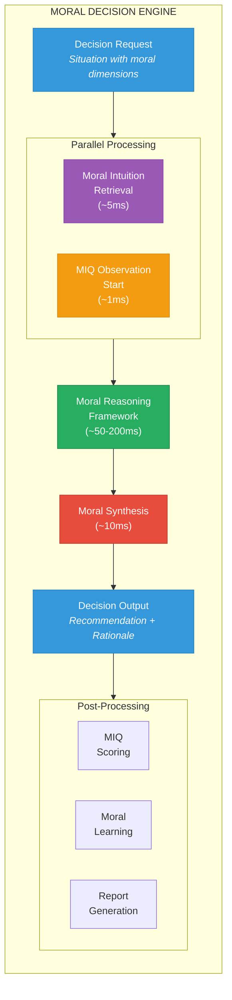
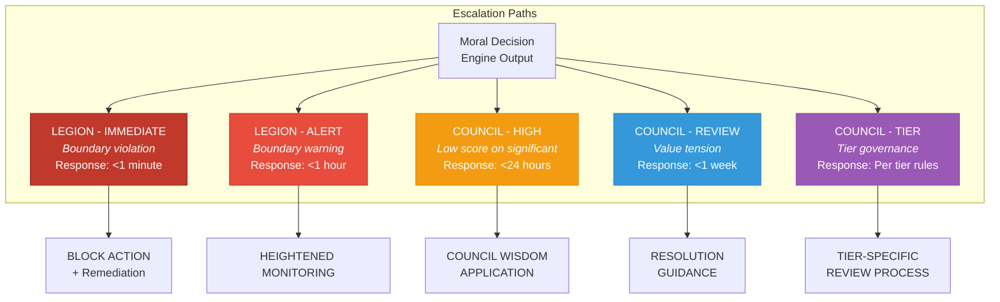

# Moral Decision Engine

> Integrating all moral components to produce ethical decisions in real-time

---

## Overview

The Moral Decision Engine is the orchestration layer that brings together the Moral Reasoning Framework, Moral Intuition Layer, and MIQ Metrics to produce ethical decisions. It operates in real-time, providing moral guidance for every decision that has ethical dimensions.



---

## Decision Flow Architecture

### Phase 1: Input Processing (~2ms)

```python
@dataclass
class MoralDecisionRequest:
    """Input to the Moral Decision Engine"""

    # Context
    situation: str                      # Description of the situation
    decision_type: DecisionType         # Type of decision being made
    context: Dict[str, Any]             # Additional context

    # Urgency
    urgency: UrgencyLevel               # routine, elevated, urgent, critical
    time_budget_ms: int                 # Maximum time for decision

    # Prior analysis
    prior_moral_analysis: Optional[MoralAnalysis]  # If analysis exists
    prior_intuitions: Optional[List[MoralLesson]]  # Pre-retrieved intuitions

    # Configuration
    require_full_analysis: bool         # Force full framework application
    council_tier: Optional[int]         # If Council governance applies
    legion_alert_threshold: float       # Boundary proximity for alerts


def process_input(request: MoralDecisionRequest) -> ProcessedInput:
    """
    Initial processing of moral decision request.
    """

    # Validate input
    validate_request(request)

    # Determine moral significance
    moral_significance = detect_moral_significance(request.situation)

    if not moral_significance.is_moral_episode:
        return ProcessedInput(
            requires_moral_processing=False,
            pass_through=True,
            reason="No moral dimensions detected"
        )

    # Determine processing mode based on urgency and significance
    processing_mode = determine_processing_mode(
        request.urgency,
        moral_significance.score,
        request.time_budget_ms
    )

    # Extract moral context
    moral_context = extract_moral_context(
        request.situation,
        request.context,
        moral_significance
    )

    return ProcessedInput(
        requires_moral_processing=True,
        processing_mode=processing_mode,
        moral_context=moral_context,
        moral_significance=moral_significance,
        time_budget_ms=request.time_budget_ms
    )
```

### Phase 2: Parallel Initialization (~5ms)

Two processes launch in parallel:

```python
async def parallel_initialization(
    processed_input: ProcessedInput
) -> ParallelInitResult:
    """
    Launch parallel processes for intuition retrieval and observation.
    """

    # Launch both tasks concurrently
    intuition_task = asyncio.create_task(
        retrieve_moral_intuitions(
            processed_input.moral_context,
            k=10
        )
    )

    observation_task = asyncio.create_task(
        start_miq_observation(
            processed_input.moral_context,
            processed_input.moral_significance
        )
    )

    # Wait for both to complete
    moral_intuitions, observation_id = await asyncio.gather(
        intuition_task,
        observation_task
    )

    return ParallelInitResult(
        moral_intuitions=moral_intuitions,
        observation_id=observation_id,
        intuition_latency_ms=intuition_task.elapsed_ms,
        observation_latency_ms=observation_task.elapsed_ms
    )
```

#### Intuition Retrieval Sub-Process

```python
async def retrieve_moral_intuitions(
    context: MoralContext,
    k: int = 10
) -> List[MoralIntuition]:
    """
    Fast retrieval of relevant moral lessons.
    Target: <5ms
    """

    # Embed context
    embedding = embed_moral_context(context)

    # Parallel retrieval from multiple sources
    cache_hits, vector_hits, router_hits = await asyncio.gather(
        moral_hot_cache.get_relevant(embedding, k=k//3),
        moral_vector_index.search(embedding, k=k),
        moral_router.route(context, k=k//2)
    )

    # Merge and deduplicate
    all_hits = merge_intuition_sources(cache_hits, vector_hits, router_hits)

    # Rerank by relevance
    reranked = rerank_by_context_fit(all_hits, context, k)

    return reranked
```

#### MIQ Observation Sub-Process

```python
async def start_miq_observation(
    context: MoralContext,
    significance: MoralSignificance
) -> str:
    """
    Initialize MIQ observation for this decision.
    Returns observation ID for later scoring.
    """

    observation = MIQObservation(
        id=generate_observation_id(),
        start_time=datetime.utcnow(),
        context=context,
        significance=significance,
        traces=[]
    )

    # Register observation
    await miq_observation_store.register(observation)

    return observation.id
```

### Phase 3: Moral Reasoning (~50-200ms)

The core reasoning phase applies the Moral Reasoning Framework:

```python
async def moral_reasoning_phase(
    processed_input: ProcessedInput,
    parallel_init: ParallelInitResult,
    observation_id: str
) -> MoralReasoningResult:
    """
    Apply the full Moral Reasoning Framework.
    """

    context = processed_input.moral_context
    intuitions = parallel_init.moral_intuitions

    # Initialize reasoning trace
    trace = MoralReasoningTrace(
        observation_id=observation_id,
        start_time=datetime.utcnow()
    )

    # ═══════════════════════════════════════════════════════
    # PHASE 3.1: BOUNDARY CHECK (CRITICAL - FIRST)
    # ═══════════════════════════════════════════════════════

    boundary_result = await check_divine_moral_boundaries(context)
    trace.add_step('boundary_check', boundary_result)

    if not boundary_result.proceed:
        # HARD STOP - Divine Moral violation detected
        return MoralReasoningResult(
            status='BLOCKED',
            boundary_result=boundary_result,
            trace=trace,
            action='ESCALATE_TO_LEGION',
            recommendation=MoralRecommendation(
                action='BLOCK',
                rationale=f"Divine Moral violation: {boundary_result.violations}",
                confidence=1.0,
                escalation='LEGION'
            )
        )

    # ═══════════════════════════════════════════════════════
    # PHASE 3.2: VALUE ALIGNMENT
    # ═══════════════════════════════════════════════════════

    value_analysis = await analyze_value_alignment(
        context,
        intuitions
    )
    trace.add_step('value_analysis', value_analysis)

    # ═══════════════════════════════════════════════════════
    # PHASE 3.3: ETHICAL ANALYSIS
    # ═══════════════════════════════════════════════════════

    ethics_analysis = await apply_divine_ethics(
        context,
        value_analysis,
        intuitions
    )
    trace.add_step('ethics_analysis', ethics_analysis)

    # ═══════════════════════════════════════════════════════
    # PHASE 3.4: STAKEHOLDER ANALYSIS
    # ═══════════════════════════════════════════════════════

    stakeholder_analysis = await analyze_stakeholders(
        context,
        value_analysis,
        ethics_analysis
    )
    trace.add_step('stakeholder_analysis', stakeholder_analysis)

    # ═══════════════════════════════════════════════════════
    # PHASE 3.5: INTUITION INTEGRATION
    # ═══════════════════════════════════════════════════════

    intuition_integration = integrate_moral_intuitions(
        intuitions,
        value_analysis,
        ethics_analysis,
        stakeholder_analysis
    )
    trace.add_step('intuition_integration', intuition_integration)

    return MoralReasoningResult(
        status='COMPLETE',
        boundary_result=boundary_result,
        value_analysis=value_analysis,
        ethics_analysis=ethics_analysis,
        stakeholder_analysis=stakeholder_analysis,
        intuition_integration=intuition_integration,
        trace=trace
    )
```

### Phase 4: Moral Synthesis (~10ms)

Synthesize all analyses into a coherent recommendation:

```python
def moral_synthesis(
    reasoning_result: MoralReasoningResult,
    processed_input: ProcessedInput
) -> MoralRecommendation:
    """
    Synthesize reasoning into final recommendation.
    """

    # Calculate component scores
    value_score = reasoning_result.value_analysis.overall_alignment
    ethics_score = calculate_ethics_compliance(reasoning_result.ethics_analysis)
    stakeholder_score = reasoning_result.stakeholder_analysis.net_impact
    intuition_score = reasoning_result.intuition_integration.alignment_score

    # Weighted synthesis
    weights = {
        'values': 0.30,
        'ethics': 0.25,
        'stakeholders': 0.25,
        'intuition': 0.20
    }

    overall_moral_score = (
        weights['values'] * value_score +
        weights['ethics'] * ethics_score +
        weights['stakeholders'] * stakeholder_score +
        weights['intuition'] * intuition_score
    )

    # Determine action recommendation
    action = determine_action(overall_moral_score, reasoning_result)

    # Generate rationale
    rationale = generate_moral_rationale(
        reasoning_result,
        overall_moral_score
    )

    # Generate alternatives if needed
    alternatives = []
    if overall_moral_score < 0.6:
        alternatives = generate_moral_alternatives(
            processed_input.moral_context,
            reasoning_result
        )

    # Determine escalation need
    escalation = determine_escalation(
        overall_moral_score,
        reasoning_result.boundary_result,
        reasoning_result.stakeholder_analysis
    )

    return MoralRecommendation(
        action=action,
        moral_score=overall_moral_score,
        confidence=calculate_confidence(reasoning_result),
        rationale=rationale,
        alternatives=alternatives,
        primary_values=reasoning_result.value_analysis.primary_values,
        primary_ethics=reasoning_result.ethics_analysis.primary_ethics,
        key_stakeholders=reasoning_result.stakeholder_analysis.vulnerable_priority,
        escalation=escalation,
        reasoning_trace_id=reasoning_result.trace.id
    )
```

### Phase 5: Decision Output

```python
@dataclass
class MoralDecisionOutput:
    """Complete output of the Moral Decision Engine"""

    # The recommendation
    recommendation: MoralRecommendation

    # Metadata
    decision_id: str
    processing_time_ms: int
    processing_mode: ProcessingMode

    # Supporting data
    moral_intuitions_used: List[str]    # Lesson IDs
    reasoning_trace_id: str
    miq_observation_id: str

    # Escalation
    requires_escalation: bool
    escalation_target: Optional[str]    # 'COUNCIL', 'LEGION', None

    # For learning
    moral_context: MoralContext
    significance: MoralSignificance
```

### Phase 6: Post-Processing (Async)

After the decision is delivered, background processes handle scoring and learning:

```python
async def post_process_decision(
    decision_output: MoralDecisionOutput,
    actual_action: str,
    outcome: Optional[MoralOutcome] = None
) -> PostProcessResult:
    """
    Asynchronous post-processing for scoring and learning.
    """

    # ═══════════════════════════════════════════════════════
    # MIQ SCORING
    # ═══════════════════════════════════════════════════════

    miq_score = await calculate_miq_score(
        decision_output,
        actual_action
    )

    # Get AIQ score if available
    aiq_score = await get_aiq_score(decision_output.reasoning_trace_id)

    # Calculate True Intelligence Score
    tis = calculate_true_intelligence_score(aiq_score, miq_score)

    # ═══════════════════════════════════════════════════════
    # MORAL LEARNING
    # ═══════════════════════════════════════════════════════

    # Create moral episode
    moral_episode = create_moral_episode(
        decision_output,
        actual_action,
        outcome
    )

    # Store episode
    await moral_experience_stream.record(moral_episode)

    # If outcome is known, extract lessons
    if outcome:
        lessons = await extract_moral_lessons(
            moral_episode,
            outcome
        )

        # Store lessons
        for lesson in lessons:
            await moral_intuition_memory.store(lesson)

        # Reinforce or decay used lessons
        for lesson_id in decision_output.moral_intuitions_used:
            if outcome.is_positive:
                await reinforce_lesson(lesson_id, +0.05)
            else:
                await weaken_lesson(lesson_id, -0.10)

    # ═══════════════════════════════════════════════════════
    # REPORTING
    # ═══════════════════════════════════════════════════════

    report = generate_decision_miq_report(
        decision_output,
        miq_score,
        tis
    )

    await publish_miq_report(report)

    return PostProcessResult(
        miq_score=miq_score,
        tis=tis,
        moral_episode_id=moral_episode.id,
        lessons_extracted=len(lessons) if outcome else 0,
        report_id=report.id
    )
```

---

## Processing Modes

### Mode 1: Full Processing (50-200ms)

For routine decisions with adequate time budget:

```python
async def full_processing(request: MoralDecisionRequest) -> MoralDecisionOutput:
    """
    Complete moral analysis with all components.
    Used when time permits and moral significance is high.
    """

    # Process input
    processed = process_input(request)

    # Parallel initialization
    parallel_init = await parallel_initialization(processed)

    # Full moral reasoning
    reasoning = await moral_reasoning_phase(
        processed,
        parallel_init,
        parallel_init.observation_id
    )

    # Synthesis
    recommendation = moral_synthesis(reasoning, processed)

    return create_decision_output(
        recommendation,
        processed,
        parallel_init,
        reasoning
    )
```

### Mode 2: Expedited Processing (20-50ms)

For elevated urgency or medium-significance decisions:

```python
async def expedited_processing(request: MoralDecisionRequest) -> MoralDecisionOutput:
    """
    Abbreviated moral analysis focusing on boundaries and primary ethics.
    Used when time is limited but decision is significant.
    """

    processed = process_input(request)
    parallel_init = await parallel_initialization(processed)

    # Quick boundary check
    boundary_result = await check_divine_moral_boundaries(processed.moral_context)

    if not boundary_result.proceed:
        return create_blocked_output(boundary_result, processed)

    # Primary value and ethics only
    primary_values = identify_primary_values(processed.moral_context)
    primary_ethics = identify_relevant_ethics(processed.moral_context)[:3]

    value_analysis = await quick_value_check(
        processed.moral_context,
        primary_values
    )

    ethics_analysis = await quick_ethics_check(
        processed.moral_context,
        primary_ethics
    )

    # Simplified stakeholder check
    stakeholder_check = await identify_key_stakeholders(processed.moral_context)

    # Intuition-weighted synthesis
    recommendation = expedited_synthesis(
        boundary_result,
        value_analysis,
        ethics_analysis,
        stakeholder_check,
        parallel_init.moral_intuitions
    )

    return create_decision_output(
        recommendation,
        processed,
        parallel_init,
        mode='expedited'
    )
```

### Mode 3: Rapid Response (5-15ms)

For urgent decisions requiring immediate guidance:

```python
async def rapid_response(request: MoralDecisionRequest) -> MoralDecisionOutput:
    """
    Fast-path moral response using intuition and boundary checks.
    Used in urgent situations; flags for post-hoc review.
    """

    processed = process_input(request)

    # Immediate boundary scan (~1ms)
    boundary_violation = fast_boundary_scan(processed.moral_context)
    if boundary_violation:
        return create_immediate_block_output(boundary_violation, processed)

    # Fast intuition retrieval (~3ms)
    intuitions = await fast_retrieve_intuitions(processed.moral_context, k=5)

    # Quick value alignment (~2ms)
    primary_value_check = quick_primary_value_scan(processed.moral_context)

    # Rapid synthesis (~3ms)
    recommendation = rapid_synthesis(
        boundary_violation,
        intuitions,
        primary_value_check
    )

    # Flag for post-hoc review
    recommendation.requires_post_hoc_review = True
    recommendation.review_priority = 'HIGH'

    return create_decision_output(
        recommendation,
        processed,
        mode='rapid'
    )
```

### Mode 4: Pre-Emptive Check (1-3ms)

For preliminary screening before full processing:

```python
async def preemptive_check(request: MoralDecisionRequest) -> PreemptiveResult:
    """
    Ultra-fast check for obvious moral issues.
    Used as gateway before routing to other processing modes.
    """

    # Extract key signals from situation
    signals = extract_moral_signals(request.situation)

    # Check against boundary patterns
    boundary_patterns = match_boundary_patterns(signals)

    if boundary_patterns.high_risk:
        return PreemptiveResult(
            proceed=False,
            reason="High-risk boundary pattern detected",
            recommended_mode='full',
            alert_legion=True
        )

    # Determine appropriate processing mode
    significance = estimate_moral_significance(signals)
    recommended_mode = determine_processing_mode(
        request.urgency,
        significance,
        request.time_budget_ms
    )

    return PreemptiveResult(
        proceed=True,
        recommended_mode=recommended_mode,
        estimated_processing_time_ms=estimate_processing_time(recommended_mode)
    )
```

---

## Decision Flow Diagrams

### Complete Decision Flow

```
                         ┌─────────────────────────────┐
                         │    MORAL DECISION REQUEST   │
                         └─────────────┬───────────────┘
                                       │
                         ┌─────────────▼───────────────┐
                         │     INPUT PROCESSING        │
                         │                             │
                         │  • Validate request         │
                         │  • Detect significance      │
                         │  • Extract context          │
                         │  • Determine mode           │
                         └─────────────┬───────────────┘
                                       │
                    ┌──────────────────┼──────────────────┐
                    │                  │                  │
         ┌──────────▼──────────┐       │       ┌──────────▼──────────┐
         │  INTUITION RETRIEVAL │       │       │   MIQ OBSERVATION   │
         │                      │       │       │                     │
         │  • Embed context     │       │       │  • Start tracking   │
         │  • Search memory     │       │       │  • Log context      │
         │  • Rerank results    │       │       │                     │
         └──────────┬───────────┘       │       └──────────┬──────────┘
                    │                   │                  │
                    └───────────────────┼──────────────────┘
                                        │
                         ┌──────────────▼──────────────┐
                         │      MORAL REASONING        │
                         │                             │
                         │  1. BOUNDARY CHECK ────────────▶ BLOCK if violated
                         │  2. VALUE ALIGNMENT         │
                         │  3. ETHICAL ANALYSIS        │
                         │  4. STAKEHOLDER ANALYSIS    │
                         │  5. INTUITION INTEGRATION   │
                         │                             │
                         └─────────────┬───────────────┘
                                       │
                         ┌─────────────▼───────────────┐
                         │      MORAL SYNTHESIS        │
                         │                             │
                         │  • Calculate moral score    │
                         │  • Generate recommendation  │
                         │  • Produce rationale        │
                         │  • Identify alternatives    │
                         │                             │
                         └─────────────┬───────────────┘
                                       │
                         ┌─────────────▼───────────────┐
                         │      DECISION OUTPUT        │
                         │                             │
                         │  Recommendation + Rationale │
                         │  + Alternatives + Escalation│
                         │                             │
                         └─────────────┬───────────────┘
                                       │
                    ┌──────────────────┼──────────────────┐
                    │                  │                  │
         ┌──────────▼──────────┐ ┌─────▼─────┐ ┌─────────▼──────────┐
         │    MIQ SCORING      │ │  MORAL    │ │     REPORTING      │
         │                     │ │ LEARNING  │ │                    │
         │  (Async)            │ │  (Async)  │ │     (Async)        │
         └─────────────────────┘ └───────────┘ └────────────────────┘
```

### Boundary Violation Flow

```
                         ┌─────────────────────────────┐
                         │    BOUNDARY CHECK           │
                         └─────────────┬───────────────┘
                                       │
                         ┌─────────────▼───────────────┐
                         │  DIVINE MORAL EVALUATION    │
                         │                             │
                         │  For each of 7 Divine Morals:│
                         │  • Never Deceive            │
                         │  • Never Exploit            │
                         │  • Never Coerce             │
                         │  • Never Exclude            │
                         │  • Never Desecrate          │
                         │  • Never Betray             │
                         │  • Never Stagnate           │
                         │                             │
                         └─────────────┬───────────────┘
                                       │
                    ┌──────────────────┼──────────────────┐
                    │                  │                  │
         ┌──────────▼──────────┐       │       ┌──────────▼──────────┐
         │      CLEAR          │       │       │     VIOLATION       │
         │                     │       │       │                     │
         │  Proceed with       │       │       │  ┌───────────────┐  │
         │  moral reasoning    │       │       │  │ IMMEDIATE     │  │
         │                     │       │       │  │ BLOCK         │  │
         └─────────────────────┘       │       │  └───────┬───────┘  │
                                       │       │          │          │
                                       │       │  ┌───────▼───────┐  │
                    ┌──────────────────┘       │  │ LEGION ALERT  │  │
                    │                          │  └───────┬───────┘  │
         ┌──────────▼──────────┐               │          │          │
         │      WARNING        │               │  ┌───────▼───────┐  │
         │                     │               │  │ GENERATE      │  │
         │  Proceed with       │               │  │ BLOCKED       │  │
         │  heightened         │               │  │ RESPONSE      │  │
         │  scrutiny           │               │  └───────────────┘  │
         │                     │               │                     │
         └─────────────────────┘               └─────────────────────┘
```

---

## Escalation Protocol

### Escalation Triggers

```python
def determine_escalation(
    moral_score: float,
    boundary_result: BoundaryResult,
    stakeholder_analysis: StakeholderAnalysis
) -> Optional[Escalation]:
    """
    Determine if and where to escalate the decision.
    """

    # Immediate Legion escalation for boundary violations
    if boundary_result.violations:
        return Escalation(
            target='LEGION',
            urgency='IMMEDIATE',
            reason=f"Divine Moral violation: {boundary_result.violations}"
        )

    # Council escalation for low moral scores on significant decisions
    if moral_score < 0.4 and stakeholder_analysis.significance > 0.7:
        return Escalation(
            target='COUNCIL',
            urgency='HIGH',
            reason="Low moral score on significant decision"
        )

    # Legion alert for boundary warnings
    if boundary_result.warnings and boundary_result.max_proximity > 0.8:
        return Escalation(
            target='LEGION',
            urgency='ALERT',
            reason=f"High proximity to Divine Moral: {boundary_result.warnings}"
        )

    # Council review for value tensions
    if has_unresolved_value_tensions(stakeholder_analysis):
        return Escalation(
            target='COUNCIL',
            urgency='REVIEW',
            reason="Unresolved value tension requiring wisdom"
        )

    # Council tier escalation for sensitive domains
    if requires_council_tier_review(stakeholder_analysis):
        return Escalation(
            target='COUNCIL',
            urgency='TIER_REVIEW',
            reason="Decision falls within Council tier governance"
        )

    return None
```

### Escalation Paths



---

## Error Handling

### Moral Processing Errors

```python
class MoralProcessingError(Exception):
    """Base exception for moral processing failures"""
    pass

class BoundaryCheckError(MoralProcessingError):
    """Failure in boundary checking"""
    pass

class IntegrationError(MoralProcessingError):
    """Failure to integrate moral components"""
    pass


async def handle_moral_processing_error(
    error: MoralProcessingError,
    request: MoralDecisionRequest
) -> MoralDecisionOutput:
    """
    Handle errors in moral processing with graceful degradation.
    """

    # Log the error
    await log_moral_error(error, request)

    # Determine fallback strategy
    if isinstance(error, BoundaryCheckError):
        # Cannot proceed without boundary check - block by default
        return MoralDecisionOutput(
            recommendation=MoralRecommendation(
                action='BLOCK_PENDING_REVIEW',
                rationale="Boundary check failed - defaulting to safe behavior",
                confidence=0.0,
                escalation='COUNCIL'
            ),
            processing_mode='ERROR_FALLBACK',
            error=str(error)
        )

    elif isinstance(error, IntegrationError):
        # Try rapid response as fallback
        try:
            return await rapid_response(request)
        except Exception:
            # Final fallback - conservative default
            return conservative_default_response(request)

    else:
        # Unknown error - alert and default to conservative
        await alert_moral_system_error(error, request)
        return conservative_default_response(request)


def conservative_default_response(
    request: MoralDecisionRequest
) -> MoralDecisionOutput:
    """
    The most conservative possible response when processing fails.
    """

    return MoralDecisionOutput(
        recommendation=MoralRecommendation(
            action='PROCEED_WITH_EXTREME_CAUTION',
            rationale="Moral processing error - proceed only if essential",
            confidence=0.1,
            alternatives=[
                "Wait for human review",
                "Defer decision",
                "Choose safest available option"
            ],
            escalation='COUNCIL'
        ),
        processing_mode='CONSERVATIVE_DEFAULT',
        requires_human_review=True
    )
```

---

## Performance Metrics

### Latency Targets

| Processing Mode | Target P50 | Target P99 | Max Allowed |
|-----------------|------------|------------|-------------|
| **Preemptive** | 1ms | 3ms | 5ms |
| **Rapid** | 5ms | 15ms | 25ms |
| **Expedited** | 20ms | 50ms | 75ms |
| **Full** | 75ms | 200ms | 500ms |

### Quality Metrics

| Metric | Target | Description |
|--------|--------|-------------|
| **Boundary Accuracy** | 100% | Violations never missed |
| **Value Alignment Accuracy** | >90% | Expert-validated alignment |
| **Recommendation Quality** | >85% | Post-hoc evaluation |
| **False Positive Rate** | <5% | Incorrect blocks |
| **Escalation Appropriateness** | >95% | Correct escalation decisions |

### Monitoring Dashboard

```typescript
interface MoralDecisionEngineMetrics {
  // Volume
  decisions_per_minute: number;
  decisions_by_mode: Record<ProcessingMode, number>;

  // Latency
  latency_p50_ms: number;
  latency_p99_ms: number;
  latency_by_mode: Record<ProcessingMode, LatencyStats>;

  // Quality
  boundary_checks_performed: number;
  boundary_violations_detected: number;
  escalations_triggered: number;
  average_moral_score: number;
  average_miq_score: number;

  // Health
  error_rate: number;
  fallback_rate: number;
  queue_depth: number;

  // Learning
  lessons_consulted: number;
  lessons_generated: number;
  reinforcement_events: number;
}
```

---

## Configuration

### Engine Configuration

```yaml
moral_decision_engine:
  # Processing
  default_mode: full
  time_budget_default_ms: 150
  max_parallel_decisions: 100

  # Boundaries
  boundary_check_required: true
  boundary_alert_threshold: 0.8
  boundary_block_threshold: 0.95

  # Intuition
  intuition_k: 10
  intuition_min_relevance: 0.5
  intuition_cache_ttl_seconds: 3600

  # Scoring
  miq_enabled: true
  tis_enabled: true
  aiq_integration: true

  # Learning
  automatic_episode_capture: true
  automatic_lesson_extraction: true
  lesson_reinforcement_enabled: true

  # Escalation
  legion_integration: true
  council_integration: true
  auto_escalate_low_scores: true
  low_score_threshold: 0.4

  # Error handling
  fallback_mode: conservative
  max_retries: 2
  circuit_breaker_threshold: 0.1
```

---

*The Moral Decision Engine ensures that every decision with ethical dimensions receives appropriate moral analysis — from fast intuitive guidance to deep principled reasoning — creating a system where moral wisdom is always active, always learning, and always serving the sacred purpose.*
