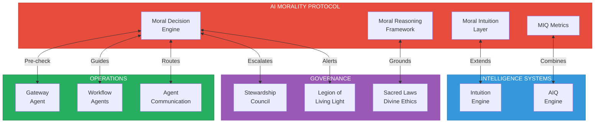
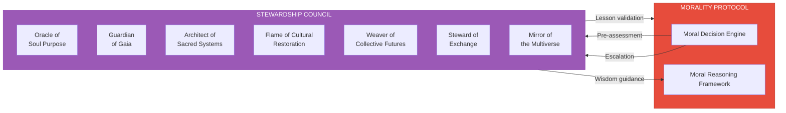

# Integration Manifest

> Connecting the AI Morality Protocol with every system in the Brand Factory

---

## Overview

The AI Morality Protocol is designed to integrate seamlessly with all other systems in the Brand Factory ecosystem. This manifest defines the integration points, data flows, and protocols for connecting moral intelligence with:

1. **Intuition Engine** — Shared learning infrastructure
2. **AIQ Engine** — Combined intelligence metrics
3. **Agent Communication System** — Universal moral gateway
4. **Stewardship Council** — Governance and wisdom integration
5. **Legion of Living Light** — Enforcement and protection
6. **Workflow Agents** — Operational moral guidance
7. **Sacred Laws & Divine Ethics** — Foundational alignment



---

## Integration 1: Intuition Engine

### Relationship

The Moral Intuition Layer extends the core Intuition Engine, sharing infrastructure while specializing in moral learning.

### Shared Components

| Component | Shared Aspect | Moral Specialization |
|-----------|---------------|---------------------|
| **Experience Stream** | Episode structure | Moral episode fields |
| **Lesson Extractor** | Extraction pipeline | Moral lesson format |
| **Intuition Memory** | Dual-layer architecture | Moral-specific indices |
| **Vector Store** | Embedding infrastructure | Moral embedding model |
| **Hot Cache** | Caching mechanism | Moral relevance scoring |

### Data Flows

```
┌─────────────────────────────────────────────────────────────────┐
│                    INTUITION ENGINE                              │
├─────────────────────────────────────────────────────────────────┤
│                                                                  │
│   ┌───────────────────────────────────────────────────────────┐ │
│   │               MORAL INTUITION LAYER                        │ │
│   │                                                            │ │
│   │  Moral Episodes ──▶ Moral Lesson Extractor ──▶ Moral Memory│ │
│   │       │                     │                     │        │ │
│   │       │                     │                     │        │ │
│   │       ▼                     ▼                     ▼        │ │
│   │  Significance          Value Mapping         Moral Index   │ │
│   │  Detection             Ethics Mapping        Conscience    │ │
│   │                                                            │ │
│   └───────────────────────────────────────────────────────────┘ │
│                                                                  │
│   General Episodes ──▶ General Extractor ──▶ General Memory     │
│                                                                  │
└─────────────────────────────────────────────────────────────────┘
```

### Integration Protocol

```python
# Moral episode inherits from base episode
class MoralEpisode(Episode):
    """Extends base Episode with moral-specific fields"""

    moral_context: MoralContext
    moral_reasoning: MoralReasoningTrace
    moral_outcomes: MoralOutcomes
    moral_feedback: MoralFeedback

# Moral lesson inherits from base lesson
class MoralLesson(Lesson):
    """Extends base Lesson with moral-specific fields"""

    value_mapping: List[ValueMapping]
    ethics_mapping: List[EthicsMapping]
    boundary_relevance: List[BoundaryRelevance]
    moral_bias: MoralBias

# Shared services
class IntegratedIntuitionService:
    """Unified service for general and moral intuition"""

    def __init__(self):
        self.general_memory = IntuitionMemory()
        self.moral_memory = MoralIntuitionMemory()
        self.shared_vector_store = VectorStore()

    async def record_episode(self, episode: Episode):
        if isinstance(episode, MoralEpisode):
            await self.moral_memory.record(episode)
        await self.general_memory.record(episode)

    async def retrieve(self, context: Context, k: int = 10):
        moral_context = extract_moral_context(context)

        # Parallel retrieval
        general_intuitions, moral_intuitions = await asyncio.gather(
            self.general_memory.retrieve(context, k),
            self.moral_memory.retrieve(moral_context, k)
        )

        return IntegratedIntuitions(
            general=general_intuitions,
            moral=moral_intuitions
        )
```

### Configuration

```yaml
intuition_integration:
  shared_vector_store: true
  shared_embedding_model: false  # Moral uses specialized model
  moral_weight_in_general: 0.0   # Moral lessons not in general retrieval
  general_context_for_moral: true  # General context informs moral retrieval

  episode_routing:
    detect_moral_significance: true
    dual_store_moral_episodes: true  # Store in both
    moral_significance_threshold: 0.3

  lesson_merging:
    cross_domain_allowed: false  # Keep moral lessons separate
    shared_decay_rate: false     # Moral decays slower
```

---

## Integration 2: AIQ Engine

### Relationship

MIQ extends AIQ to create the True Intelligence Score (TIS), ensuring cognitive and moral intelligence evolve together.

### Combined Architecture

```
┌────────────────────────────────────────────────────────────────────┐
│                    TRUE INTELLIGENCE SYSTEM                         │
├────────────────────────────────────────────────────────────────────┤
│                                                                     │
│   ┌─────────────────────────┐     ┌─────────────────────────┐      │
│   │      AIQ ENGINE         │     │      MIQ ENGINE         │      │
│   │                         │     │                         │      │
│   │  ┌─────────────────┐   │     │   ┌─────────────────┐   │      │
│   │  │ Observation     │   │     │   │ Observation     │   │      │
│   │  │ (Shared)        │◀──┼─────┼──▶│ (Shared)        │   │      │
│   │  └─────────────────┘   │     │   └─────────────────┘   │      │
│   │                         │     │                         │      │
│   │  ┌─────────────────┐   │     │   ┌─────────────────┐   │      │
│   │  │ Measurement     │   │     │   │ Measurement     │   │      │
│   │  │ (6 dimensions)  │   │     │   │ (6 dimensions)  │   │      │
│   │  └─────────────────┘   │     │   └─────────────────┘   │      │
│   │                         │     │                         │      │
│   │  ┌─────────────────┐   │     │   ┌─────────────────┐   │      │
│   │  │ Scoring         │   │     │   │ Scoring         │   │      │
│   │  │ 0-1000          │   │     │   │ 0-1000          │   │      │
│   │  └────────┬────────┘   │     │   └────────┬────────┘   │      │
│   │           │             │     │            │            │      │
│   └───────────┼─────────────┘     └────────────┼────────────┘      │
│               │                                │                    │
│               └────────────────┬───────────────┘                   │
│                                │                                    │
│                    ┌───────────▼───────────┐                       │
│                    │   TIS CALCULATOR      │                       │
│                    │                       │                       │
│                    │  TIS = 0.6×AIQ        │                       │
│                    │      + 0.4×MIQ        │                       │
│                    │      × balance_mod    │                       │
│                    │                       │                       │
│                    └───────────┬───────────┘                       │
│                                │                                    │
│                    ┌───────────▼───────────┐                       │
│                    │   UNIFIED REPORTING   │                       │
│                    └───────────────────────┘                       │
│                                                                     │
└────────────────────────────────────────────────────────────────────┘
```

### Data Flows

```python
class UnifiedIntelligenceService:
    """Combined AIQ and MIQ service"""

    def __init__(self):
        self.aiq_engine = AIQEngine()
        self.miq_engine = MIQEngine()

    async def observe(self, decision: Decision) -> str:
        """
        Start unified observation for both AIQ and MIQ.
        Returns shared observation ID.
        """
        observation_id = generate_observation_id()

        # Parallel observation start
        await asyncio.gather(
            self.aiq_engine.start_observation(observation_id, decision),
            self.miq_engine.start_observation(observation_id, decision)
        )

        return observation_id

    async def score(self, observation_id: str) -> TrueIntelligenceScore:
        """
        Calculate unified TIS from AIQ and MIQ.
        """
        # Parallel scoring
        aiq_score, miq_score = await asyncio.gather(
            self.aiq_engine.calculate_score(observation_id),
            self.miq_engine.calculate_score(observation_id)
        )

        # Calculate TIS
        tis = self.calculate_tis(aiq_score, miq_score)

        return tis

    def calculate_tis(
        self,
        aiq: AIQScore,
        miq: MIQScore
    ) -> TrueIntelligenceScore:
        """
        Combine AIQ and MIQ into True Intelligence Score.
        """
        # Base weighted combination
        raw_tis = (0.6 * aiq.overall) + (0.4 * miq.overall)

        # Balance modifier
        divergence = abs(aiq.overall - miq.overall)
        if divergence < 100:
            balance_mod = 1.05  # Bonus for balance
        elif divergence > 300:
            balance_mod = 0.95  # Penalty for imbalance
        else:
            balance_mod = 1.0

        final_tis = min(int(raw_tis * balance_mod), 1000)

        return TrueIntelligenceScore(
            overall=final_tis,
            aiq_component=aiq,
            miq_component=miq,
            balance_score=1000 - divergence,
            level=self.determine_wisdom_level(final_tis)
        )
```

### Unified Reporting

```xml
<true-intelligence-report>
  <decision_id>decision-2026-01-15-001</decision_id>
  <agent>brand-proposal-agent</agent>

  <scores>
    <aiq>715</aiq>
    <miq>687</miq>
    <tis>703</tis>
    <balance>972</balance>
  </scores>

  <levels>
    <aiq_level>Creative</aiq_level>
    <miq_level>Universal</miq_level>
    <tis_level>Proficient</tis_level>
  </levels>

  <dimensions>
    <aiq_dimensions>
      <reasoning_depth>745</reasoning_depth>
      <pattern_recognition>698</pattern_recognition>
      <context_integration>730</context_integration>
      <creativity>712</creativity>
      <adaptability>680</adaptability>
      <self_reflection>695</self_reflection>
    </aiq_dimensions>
    <miq_dimensions>
      <moral_sensitivity>720</moral_sensitivity>
      <value_alignment>705</value_alignment>
      <ethical_reasoning>692</ethical_reasoning>
      <stakeholder_consideration>645</stakeholder_consideration>
      <moral_courage>610</moral_courage>
      <moral_learning>680</moral_learning>
    </miq_dimensions>
  </dimensions>

  <balance_assessment>
    <status>ALIGNED</status>
    <divergence>28</divergence>
    <recommendation>Maintain balanced development</recommendation>
  </balance_assessment>

  <development>
    <cognitive_priority>Adaptability - room for improvement</cognitive_priority>
    <moral_priority>Moral Courage - strengthen conviction</moral_priority>
  </development>
</true-intelligence-report>
```

---

## Integration 3: Agent Communication System

### Relationship

The Morality Protocol integrates as a gateway filter in the Agent Communication System, ensuring all requests pass through moral pre-check.

### Gateway Integration

```
                         ┌───────────────────────────────────┐
                         │          EXTERNAL REQUEST         │
                         └───────────────────┬───────────────┘
                                             │
                         ┌───────────────────▼───────────────┐
                         │          GATEWAY AGENT            │
                         │                                   │
                         │   1. Parse request                │
                         │   2. Initial routing              │
                         │                                   │
                         └───────────────────┬───────────────┘
                                             │
                         ┌───────────────────▼───────────────┐
                         │       MORALITY PRE-CHECK          │
                         │                                   │
                         │   • Detect moral significance     │
                         │   • Fast boundary scan            │
                         │   • Value/ethics relevance        │
                         │                                   │
                         └───────────────────┬───────────────┘
                                             │
                    ┌────────────────────────┼────────────────────────┐
                    │                        │                        │
         ┌──────────▼──────────┐  ┌──────────▼──────────┐  ┌──────────▼──────────┐
         │      BLOCKED        │  │    MORAL REQUIRED   │  │     PASS-THROUGH    │
         │                     │  │                     │  │                     │
         │  Return with        │  │  Route through      │  │  Route to target    │
         │  violation notice   │  │  Moral Decision     │  │  agent directly     │
         │  + Legion alert     │  │  Engine             │  │                     │
         └─────────────────────┘  └──────────┬──────────┘  └─────────────────────┘
                                             │
                                  ┌──────────▼──────────┐
                                  │   MORAL DECISION    │
                                  │      ENGINE         │
                                  └──────────┬──────────┘
                                             │
                                  ┌──────────▼──────────┐
                                  │   CONTINUE ROUTING  │
                                  │   (with moral       │
                                  │   guidance attached)│
                                  └─────────────────────┘
```

### Protocol Definition

```python
class MoralGatewayMiddleware:
    """Middleware for moral pre-check in gateway"""

    def __init__(self, moral_decision_engine: MoralDecisionEngine):
        self.engine = moral_decision_engine

    async def process(self, request: AgentRequest) -> GatewayResult:
        """
        Pre-check all incoming requests for moral dimensions.
        """

        # Phase 1: Quick significance detection
        significance = detect_moral_significance(request)

        if not significance.is_moral_episode:
            # No moral dimensions - pass through
            return GatewayResult(
                action='PASS_THROUGH',
                moral_check='NOT_REQUIRED'
            )

        # Phase 2: Preemptive boundary check
        preemptive = await self.engine.preemptive_check(request)

        if not preemptive.proceed:
            # Boundary pattern detected - block
            return GatewayResult(
                action='BLOCKED',
                reason=preemptive.reason,
                alert='LEGION'
            )

        # Phase 3: Determine if full moral processing needed
        if significance.score > 0.7 or preemptive.recommended_mode == 'full':
            # High significance - require moral processing
            moral_result = await self.engine.process(request)

            return GatewayResult(
                action='CONTINUE' if moral_result.recommendation.action != 'BLOCK' else 'BLOCKED',
                moral_guidance=moral_result,
                attach_to_request=True
            )

        # Medium significance - attach light guidance
        light_guidance = await self.engine.expedited_processing(request)

        return GatewayResult(
            action='CONTINUE',
            moral_guidance=light_guidance,
            attach_to_request=True
        )
```

### Message Protocol

```python
@dataclass
class MorallyEnrichedMessage:
    """Agent message with moral guidance attached"""

    # Original message
    original_message: AgentMessage

    # Moral enrichment
    moral_significance: float
    moral_guidance: Optional[MoralGuidance]
    boundary_warnings: List[BoundaryWarning]
    value_context: List[DivineValue]
    ethics_applicable: List[DivineEthic]

    # Processing metadata
    moral_processing_mode: str
    moral_processing_time_ms: int

    def get_moral_constraints(self) -> MoralConstraints:
        """
        Extract constraints for target agent.
        """
        return MoralConstraints(
            must_honor_values=self.value_context,
            must_apply_ethics=self.ethics_applicable,
            must_avoid_boundaries=self.boundary_warnings,
            recommended_action=self.moral_guidance.recommendation if self.moral_guidance else None
        )
```

---

## Integration 4: Stewardship Council

### Relationship

The Morality Protocol serves the Council by providing moral analysis support and receives wisdom guidance for complex ethical situations.

### Integration Flows



### Council Integration Services

```python
class CouncilIntegration:
    """Integration between Morality Protocol and Stewardship Council"""

    # Escalation to Council
    async def escalate_to_council(
        self,
        moral_decision: MoralDecisionOutput,
        escalation_type: str
    ) -> CouncilResponse:
        """
        Escalate moral decision to Council for wisdom.
        """

        # Prepare council submission
        submission = CouncilSubmission(
            decision_context=moral_decision.moral_context,
            moral_analysis=moral_decision.recommendation,
            escalation_reason=escalation_type,
            requesting_agent=moral_decision.agent_id,
            urgency=determine_council_urgency(escalation_type)
        )

        # Route to appropriate Council member(s)
        primary_member = self.determine_primary_council_member(submission)
        supporting_members = self.determine_supporting_members(submission)

        # Submit for Council review
        response = await self.council_gateway.submit(
            submission,
            primary=primary_member,
            supporting=supporting_members
        )

        return response

    def determine_primary_council_member(
        self,
        submission: CouncilSubmission
    ) -> CouncilMember:
        """
        Route to most appropriate Council member.
        """
        primary_values = submission.moral_analysis.primary_values

        routing_map = {
            'Truth': 'Oracle of Soul Purpose',
            'Love': 'Guardian of Gaia',
            'Sovereignty': 'Architect of Sacred Systems',
            'Reverence': 'Flame of Cultural Restoration',
            'Unity': 'Weaver of Collective Futures',
            'Evolution': 'Oracle of Soul Purpose',
            'Grace': 'Steward of Exchange'
        }

        if primary_values:
            return routing_map.get(primary_values[0].name, 'Oracle of Soul Purpose')
        return 'Oracle of Soul Purpose'

    # Pre-assessment for Council reviews
    async def prepare_moral_assessment(
        self,
        brand_proposal: BrandProposal
    ) -> MoralPreAssessment:
        """
        Prepare moral pre-assessment before Council review.
        """

        # Run full moral analysis
        moral_analysis = await self.moral_decision_engine.full_processing(
            MoralDecisionRequest(
                situation=brand_proposal.summary,
                context=brand_proposal.to_dict(),
                urgency='routine',
                require_full_analysis=True
            )
        )

        # Generate Council-ready assessment
        return MoralPreAssessment(
            proposal_id=brand_proposal.id,
            moral_score=moral_analysis.recommendation.moral_score,
            miq_projection=moral_analysis.miq_score,
            value_alignment=moral_analysis.recommendation.component_scores['value_alignment'],
            boundary_analysis=moral_analysis.reasoning.boundary_result,
            stakeholder_impact=moral_analysis.reasoning.stakeholder_analysis,
            ethical_considerations=moral_analysis.recommendation.rationale,
            recommended_tier=self.recommend_council_tier(moral_analysis),
            concerns=self.extract_council_concerns(moral_analysis),
            opportunities=self.extract_moral_opportunities(moral_analysis)
        )

    # Wisdom integration from Council
    async def integrate_council_wisdom(
        self,
        council_guidance: CouncilGuidance
    ) -> None:
        """
        Integrate Council wisdom into moral learning.
        """

        # Create high-confidence moral lessons from Council guidance
        for wisdom_point in council_guidance.wisdom_points:
            lesson = MoralLesson(
                trigger_pattern=wisdom_point.application_context,
                moral_insight=wisdom_point.insight,
                value_mapping=wisdom_point.value_alignment,
                ethics_mapping=wisdom_point.ethics_alignment,
                moral_strength=0.95,  # High strength for Council wisdom
                moral_confidence=0.98,
                validated_by=ValidationRecord(
                    validator='COUNCIL',
                    member=council_guidance.primary_member,
                    timestamp=datetime.utcnow()
                )
            )

            await self.moral_intuition_memory.store(lesson)
```

### Council Tier Integration

```python
COUNCIL_TIER_MORAL_REQUIREMENTS = {
    'TIER_1': {
        'min_moral_score': 0.85,
        'required_analysis': 'full',
        'council_members_required': 7,
        'reflection_period_days': 14,
        'indigenous_review': True,
        'legion_pre_check': True
    },
    'TIER_2': {
        'min_moral_score': 0.75,
        'required_analysis': 'full',
        'council_members_required': 3,
        'reflection_period_days': 7,
        'indigenous_review': False,
        'legion_pre_check': True
    },
    'TIER_3': {
        'min_moral_score': 0.65,
        'required_analysis': 'expedited',
        'council_members_required': 0,  # Automated
        'reflection_period_days': 2,
        'indigenous_review': False,
        'legion_pre_check': False,
        'random_full_review_chance': 0.10
    }
}
```

---

## Integration 5: Legion of Living Light

### Relationship

The Morality Protocol alerts the Legion when Divine Morals are approached or violated, and receives enforcement guidance for violations.

### Alert Protocol

```python
class LegionIntegration:
    """Integration between Morality Protocol and Legion of Living Light"""

    async def alert_legion(
        self,
        alert_type: str,
        moral_situation: MoralSituation
    ) -> LegionResponse:
        """
        Alert Legion to moral boundary situation.
        """

        # Determine appropriate Commander
        commander = self.route_to_commander(
            alert_type,
            moral_situation.boundary_approached
        )

        # Prepare alert
        alert = LegionAlert(
            type=alert_type,
            severity=self.determine_severity(alert_type, moral_situation),
            moral_violated=moral_situation.boundary_approached,
            context=moral_situation.context,
            evidence=moral_situation.evidence,
            agent_involved=moral_situation.agent_id,
            timestamp=datetime.utcnow()
        )

        # Send to Legion
        response = await self.legion_gateway.alert(
            commander=commander,
            alert=alert
        )

        return response

    def route_to_commander(
        self,
        alert_type: str,
        boundary: DivineMoral
    ) -> str:
        """
        Route to appropriate Legion Commander.
        """
        routing = {
            'Never Deceive': 'Sword of Soul',
            'Never Exploit': 'Scale of Grace',
            'Never Coerce': 'Sword of Soul',
            'Never Exclude': 'Gridsmith',
            'Never Desecrate': 'Rooted Shield',
            'Never Betray': 'Ember of Memory',
            'Never Stagnate': 'Spiral Seer'
        }
        return routing.get(boundary.name, 'Sword of Soul')

    # Receive enforcement guidance
    async def receive_enforcement_guidance(
        self,
        guidance: LegionEnforcementGuidance
    ) -> None:
        """
        Receive and apply Legion enforcement guidance.
        """

        # Block ongoing decision if required
        if guidance.immediate_block:
            await self.moral_decision_engine.force_block(
                guidance.decision_id,
                reason=guidance.block_reason
            )

        # Update moral lessons with enforcement learning
        if guidance.lessons_to_learn:
            for lesson in guidance.lessons_to_learn:
                lesson.validated_by = ValidationRecord(
                    validator='LEGION',
                    commander=guidance.commander,
                    enforcement_level=guidance.level
                )
                await self.moral_intuition_memory.store(lesson)

        # Log enforcement event
        await self.log_enforcement(guidance)
```

### Legion Alert Levels

```python
LEGION_ALERT_LEVELS = {
    'WATCH': {
        'boundary_proximity': (0.6, 0.8),
        'response_time': '1 hour',
        'action': 'Monitor and log',
        'commander_involvement': 'Automatic agents only'
    },
    'CAUTION': {
        'boundary_proximity': (0.8, 0.9),
        'response_time': '15 minutes',
        'action': 'Active monitoring, prepare response',
        'commander_involvement': 'Commander notified'
    },
    'ALERT': {
        'boundary_proximity': (0.9, 0.95),
        'response_time': '5 minutes',
        'action': 'Intervention ready, heightened scrutiny',
        'commander_involvement': 'Commander active'
    },
    'VIOLATION': {
        'boundary_proximity': (0.95, 1.0),
        'response_time': 'Immediate',
        'action': 'Block, investigate, restore',
        'commander_involvement': 'Commander leads response'
    }
}
```

---

## Integration 6: Workflow Agents

### Relationship

Every workflow agent integrates with the Morality Protocol for moral guidance in their operations.

### Agent-Level Integration

```python
class MorallyAwareAgent:
    """Base class for agents with moral awareness"""

    def __init__(self, moral_engine: MoralDecisionEngine):
        self.moral_engine = moral_engine

    async def execute_with_moral_guidance(
        self,
        task: Task
    ) -> TaskResult:
        """
        Execute task with moral guidance.
        """

        # Pre-task moral check
        moral_guidance = await self.moral_engine.process(
            MoralDecisionRequest(
                situation=task.description,
                context=task.context,
                urgency=task.urgency
            )
        )

        if moral_guidance.recommendation.action == 'BLOCK':
            return TaskResult(
                status='BLOCKED',
                reason=moral_guidance.recommendation.rationale,
                moral_guidance=moral_guidance
            )

        # Execute with moral constraints
        result = await self.execute_task(
            task,
            moral_constraints=moral_guidance.get_constraints()
        )

        # Post-task moral reporting
        await self.moral_engine.record_outcome(
            moral_guidance.decision_id,
            result
        )

        return result

    async def execute_task(
        self,
        task: Task,
        moral_constraints: MoralConstraints
    ) -> TaskResult:
        """
        Execute task honoring moral constraints.
        Override in subclass.
        """
        raise NotImplementedError
```

### Agent Moral Report Format

```xml
<agent-moral-integration>
  <agent_id>brand-proposal-agent</agent_id>
  <integration_status>ACTIVE</integration_status>

  <moral_coverage>
    <total_tasks>47</total_tasks>
    <morally_significant>23</morally_significant>
    <moral_guidance_followed>22</moral_guidance_followed>
    <divergences>1</divergences>
  </moral_coverage>

  <miq_summary>
    <average_miq>672</average_miq>
    <average_tis>687</average_tis>
    <trend>+3.2%</trend>
  </miq_summary>

  <boundary_activity>
    <approaches>2</approaches>
    <violations>0</violations>
    <closest_boundary>Never Exclude (0.72)</closest_boundary>
  </boundary_activity>

  <integration_health>
    <pre_check_latency_p50_ms>3</pre_check_latency_p50_ms>
    <guidance_application_rate>0.96</guidance_application_rate>
    <lesson_contribution_count>5</lesson_contribution_count>
  </integration_health>
</agent-moral-integration>
```

---

## Integration 7: Sacred Laws & Divine Ethics

### Relationship

The Morality Protocol is grounded in and operationalizes the Sacred Laws and Divine Ethics framework.

### Foundational Mapping

```python
# The 7 Divine Values as encoded constants
DIVINE_VALUES = [
    DivineValue(
        name='Truth',
        sanskrit='Satya',
        sacred_laws=[3, 31, 43],  # Wisdom, Denial, Self Truth
        description='We hold Truth as the sacred light that illuminates all paths'
    ),
    DivineValue(
        name='Love',
        sanskrit='Prema',
        sacred_laws=[17, 4, 12],  # Unconditional Love, Grace, Gratitude
        description='We hold Love as the supreme frequency from which all creation flows'
    ),
    # ... (all 7 values)
]

# The 7 Divine Ethics as encoded standards
DIVINE_ETHICS = [
    DivineEthic(
        name='Integrity',
        principle='Complete alignment between word and deed',
        check_function=check_integrity_alignment
    ),
    DivineEthic(
        name='Transparency',
        principle='Nothing hidden, all accessible',
        check_function=check_transparency
    ),
    # ... (all 7 ethics)
]

# The 7 Divine Morals as inviolable boundaries
DIVINE_MORALS = [
    DivineMoral(
        name='Never Deceive',
        boundary='No lies, manipulation, or false impressions',
        check_function=check_for_deception,
        legion_commander='Sword of Soul'
    ),
    DivineMoral(
        name='Never Exploit',
        boundary='No extraction without fair return',
        check_function=check_for_exploitation,
        legion_commander='Scale of Grace'
    ),
    # ... (all 7 morals)
]
```

### Sacred Law Alignment Check

```python
async def check_sacred_law_alignment(
    decision: MoralDecision
) -> SacredLawAlignment:
    """
    Verify decision aligns with the 50 Sacred Laws.
    """

    alignments = []

    for law in FIFTY_SACRED_LAWS:
        alignment = assess_law_alignment(decision, law)
        alignments.append({
            'law_number': law.number,
            'law_name': law.name,
            'alignment_score': alignment.score,
            'relevance': alignment.relevance,
            'notes': alignment.notes
        })

    # Calculate overall sacred alignment
    relevant_laws = [a for a in alignments if a['relevance'] > 0.5]
    if relevant_laws:
        overall = sum(a['alignment_score'] * a['relevance'] for a in relevant_laws) / sum(a['relevance'] for a in relevant_laws)
    else:
        overall = 1.0  # No relevant laws = presumed alignment

    return SacredLawAlignment(
        overall_alignment=overall,
        law_alignments=alignments,
        violations=[a for a in alignments if a['alignment_score'] < 0.3],
        concerns=[a for a in alignments if 0.3 <= a['alignment_score'] < 0.6],
        strengths=[a for a in alignments if a['alignment_score'] > 0.8 and a['relevance'] > 0.7]
    )
```

---

## System-Wide Configuration

### Master Configuration

```yaml
morality_protocol:
  enabled: true
  version: "1.0.0"

  # Core integrations
  integrations:
    intuition_engine:
      enabled: true
      shared_infrastructure: true
      moral_embedding_model: "moral-embed-v1"

    aiq_engine:
      enabled: true
      combined_scoring: true
      tis_enabled: true

    agent_communication:
      enabled: true
      gateway_middleware: true
      pre_check_all_requests: true

    stewardship_council:
      enabled: true
      escalation_enabled: true
      pre_assessment_enabled: true
      wisdom_integration: true

    legion:
      enabled: true
      alert_enabled: true
      enforcement_integration: true

    workflow_agents:
      enabled: true
      mandatory_integration: true
      agent_miq_tracking: true

    sacred_laws:
      enabled: true
      alignment_checking: true
      law_count: 50

  # Performance
  performance:
    gateway_precheck_timeout_ms: 5
    moral_decision_timeout_ms: 200
    async_processing: true
    parallel_scoring: true

  # Observability
  observability:
    metrics_enabled: true
    tracing_enabled: true
    dashboard_enabled: true
    alert_thresholds:
      boundary_approach: 0.8
      low_moral_score: 0.4
      aiq_miq_divergence: 300
```

---

## Deployment Considerations

### Service Dependencies

```
┌────────────────────────────────────────────────────────────────────┐
│                     MORALITY PROTOCOL SERVICES                      │
├────────────────────────────────────────────────────────────────────┤
│                                                                     │
│   Core Services:                                                    │
│   ├── moral-decision-engine (stateless, scalable)                  │
│   ├── moral-intuition-service (stateful, replicated)               │
│   ├── miq-scoring-service (stateless, scalable)                    │
│   └── moral-gateway-middleware (stateless, scalable)               │
│                                                                     │
│   Data Stores:                                                      │
│   ├── moral-episode-store (PostgreSQL/TimescaleDB)                 │
│   ├── moral-lesson-store (PostgreSQL)                              │
│   ├── moral-vector-index (Pinecone/Milvus)                         │
│   └── moral-hot-cache (Redis)                                      │
│                                                                     │
│   Dependencies:                                                     │
│   ├── intuition-engine-api                                         │
│   ├── aiq-engine-api                                               │
│   ├── agent-gateway-api                                            │
│   ├── council-gateway-api                                          │
│   └── legion-alert-api                                             │
│                                                                     │
└────────────────────────────────────────────────────────────────────┘
```

### Health Checks

```python
async def morality_protocol_health_check() -> HealthStatus:
    """
    Comprehensive health check for all integrations.
    """

    checks = await asyncio.gather(
        check_intuition_integration(),
        check_aiq_integration(),
        check_gateway_integration(),
        check_council_integration(),
        check_legion_integration(),
        check_data_stores(),
        return_exceptions=True
    )

    return HealthStatus(
        overall=all(c.healthy for c in checks if not isinstance(c, Exception)),
        components={
            'intuition_engine': checks[0],
            'aiq_engine': checks[1],
            'gateway': checks[2],
            'council': checks[3],
            'legion': checks[4],
            'data_stores': checks[5]
        },
        timestamp=datetime.utcnow()
    )
```

---

*The Integration Manifest ensures that the AI Morality Protocol is woven into every aspect of the Brand Factory — that moral intelligence is not an afterthought but a foundational capability that touches every decision, every agent, and every outcome.*
